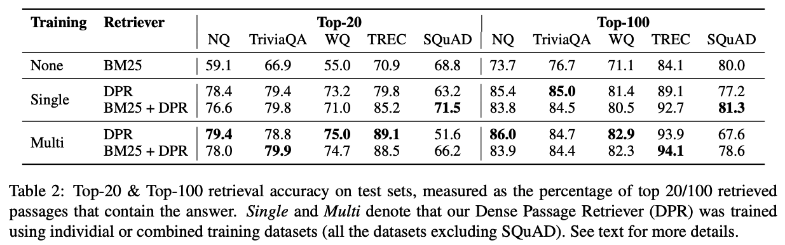

## Citation

> Karpukhin, V., Oğuz, B., Min, S., Lewis, P., Wu, L., Edunov, S., Chen, D., & Yih, W. (2020).   
> **Dense Passage Retrieval for Open-Domain Question Answering.**   
> https://doi.org/10.48550/arxiv.2004.04906

## Abstract

> Open-domain question answering relies on efficient passage retrieval to
> select candidate contexts, where traditional sparse vector space models, such
> as TF-IDF or BM25, are the de facto method. In this work, we show that
> retrieval can be practically implemented using dense representations alone,
> where embeddings are learned from a small number of questions and passages by a
> simple dual-encoder framework. When evaluated on a wide range of open-domain QA
> datasets, our dense retriever outperforms a strong Lucene-BM25 system largely
> by 9%-19% absolute in terms of top-20 passage retrieval accuracy, and helps our
> end-to-end QA system establish new state-of-the-art on multiple open-domain QA
> benchmarks.

## What's New

- QAタスクにおいて，追加で事前学習せずにDense Embeddingを学習する方法（Deep Passage Retriever）を提案
- QuestionとPassageを別々にEmbeddingするDual Encoderモデルにおいて，効率的な学習方法を採用
- Deep Passage Retrieverで，既存手法（TF-IDF，BM25）を上回る精度を達成
- 上記の観点を複数のQAデータセットで検証

## Dataset

- Natural Questions
    > Kwiatkowski, T. et al. (2019).   
    > **Natural Questions: A Benchmark for Question Answering Research.**  
    > Transactions of the Association for Computational Linguistics, 7, 453–466.  
    > https://doi.org/10.1162/TACL_A_00276  
- TriviaQA
    > Joshi, M., Choi, E., Weld, D. S., & Zettlemoyer, L. (2017).  
    > **TriviaQA: A Large Scale Distantly Supervised Challenge Dataset for Reading Comprehension.**  
    > https://doi.org/10.48550/arxiv.1705.03551  
- WebQuestions
    > Berant, J., Chou, A. K., Frostig, R., & Liang, P. (2013).  
    > **Semantic Parsing on Freebase from Question-Answer Pairs.**  
    > EMNLP.  
- CuratedTREC
    > Baudiš, P., & Šedivý, J. (2015).  
    > **Modeling of the question answering task in the YodaQA system.**  
    > Lecture Notes in Computer Science (Including Subseries Lecture Notes in Artificial Intelligence and Lecture Notes in Bioinformatics), 9283, 222–228.  
    > https://doi.org/10.1007/978-3-319-24027-5_20  
- SQuAD v1.1
    > Rajpurkar, P., Zhang, J., Lopyrev, K., & Liang, P. (2016).  
    > **SQuAD: 100,000+ Questions for Machine Comprehension of Text.**  
    > EMNLP 2016 - Conference on Empirical Methods in Natural Language Processing, Proceedings, 2383–2392.  
    > https://doi.org/10.18653/V1/D16-1264

**データセットのサマリ**

| Dataset | Train(original) | Train(for DPR) | Dev | Test |
|---------|----------------:|---------------:|----:|-----:|
| Natural Questions | 79,168 | 58,880 | 8,757 | 3,610 |
| TriviaQA          | 78,785 | 60,413 | 8,837 | 11,313 |
| WebQuestions      | 3,417  | 2,474  | 361   | 2,032 |
| CuratedTREC       | 1,353  | 1,125  | 133   | 694 |
| SQuAD             | 78,713 | 70,096 | 8,886 | 10,570 |

## Model Description

TBD

## Results

- SQuADを除いて，DPRは軒並みBM25よりも良い精度を出している
  - SQuADでは，アノテーターはPassageを見た後にQuestionを記載する手順になっているため，PassageとQuestionが非常に似たものになり，計算上，BM25で精度が高くなりやすいと考えられる
  - SQuADではWikipediaの記事中から500件強を収集して構築されたもので，学習データにかなりバイアスがあると考えられる