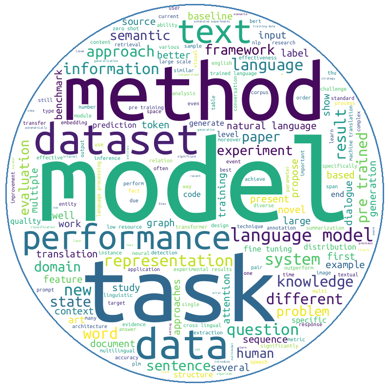

## Graph
<figure>
    
    <figcaption>ACL-2022 WordCloud</figcaption>
</figure>

## Code
```python
import sys
if "/workplace" not in sys.path:
    sys.path.append("/workplace")
    
import plotly.graph_objects as go
from plotly.subplots import make_subplots

from matplotlib import rcParams
rcParams['font.family'] = 'sans-serif'
rcParams['font.sans-serif'] = ['Hiragino Maru Gothic Pro', 'Yu Gothic', 'Meirio', 'Takao', 'IPAexGothic', 'IPAPGothic', 'VL PGothic', 'Noto Sans CJK JP']

from utils.utils import Config, word_cloud, WordCloudMask
from embeddings.glove import GloVe, GloVeType
from datasets.conference import ACL_2022

glove = GloVe(
    config,
    GloVeType.B6_D300,
    remove_stopwords=True,
    filter=lambda tk: tk.pos_tag.startswith("NN") or tk.pos_tag.startswith("JJ") or tk.pos_tag.startswith("RB")
)

dataset = ACL_2022(config)
papers = dataset.load(glove.word_tokenizer)

texts = []
for paper in papers:
    texts.append(paper.preprocessed_abstract)
text = " ".join(texts)
word_cloud(text, out_path="./word_cloud.png", mask_type=WordCloudMask.CIRCLE)
```

## Source

Data From: [ACL 2022](https://aclanthology.org/events/acl-2022/)

