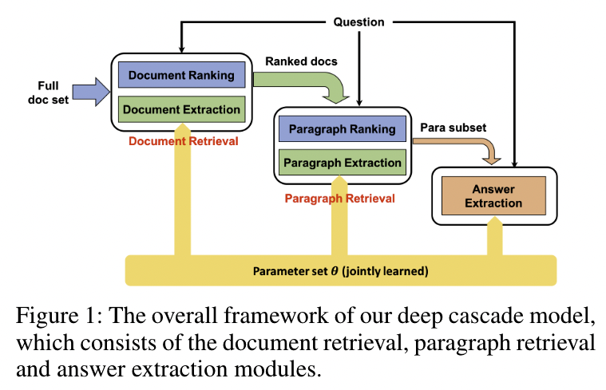
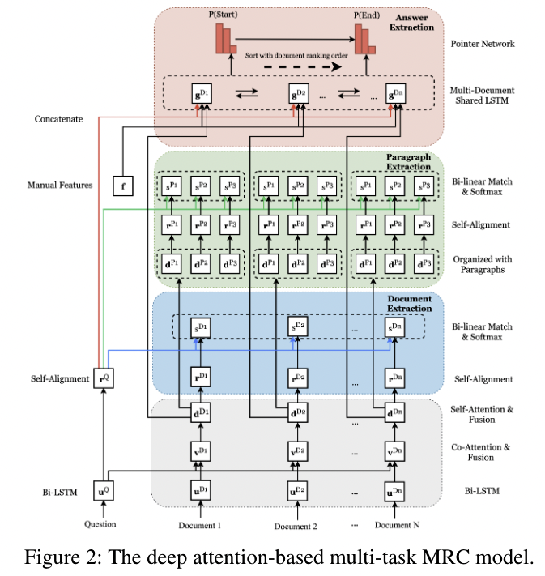
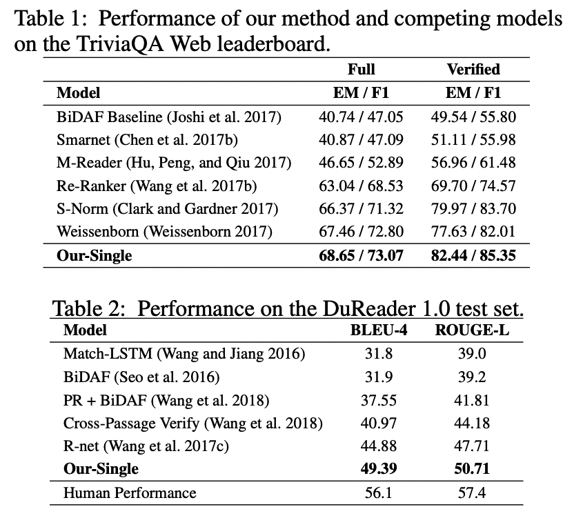

- [x] Round-1: Overview
- [ ] Round-2: Model Implementation Details
- [ ] Round-3: Experiments

## Citation


Yan, M., Xia, J., Wu, C., Bi, B., Zhao, Z., Zhang, J., Si, L., Wang, R., Wang, W., & Chen, H. (2019).  
A Deep Cascade Model for Multi-Document Reading Comprehension.  
Proceedings of the AAAI Conference on Artificial Intelligence, 33, 7354–7361.  
https://doi.org/10.1609/aaai.v33i01.33017354


## Abstract

> A fundamental trade-off between effectiveness and efficiency needs to be balanced when designing an online question answering system. Effectiveness comes from sophisticated functions such as extractive machine reading comprehension (MRC), while efficiency is obtained from improvements in preliminary retrieval components such as candidate document selection and paragraph ranking. Given the complexity of the real-world multi-document MRC scenario, it is difficult to jointly optimize both in an end-to-end system. To address this problem, we develop a novel deep cascade learning model, which progressively evolves from the documentlevel and paragraph-level ranking of candidate texts to more precise answer extraction with machine reading comprehension. Specifically, irrelevant documents and paragraphs are first filtered out with simple functions for efficiency consideration. Then we jointly train three modules on the remaining texts for better tracking the answer: the document extraction, the paragraph extraction and the answer extraction. Experiment results show that the proposed method outperforms the previous state-of-the-art methods on two large-scale multidocument benchmark datasets, i.e., TriviaQA and DuReader. In addition, our online system can stably serve typical scenarios with millions of daily requests in less than 50ms.

## Background & Wat's New

- Machine Reading Comprehension のタスクにおいて，複数のコンテキストを扱える Multi-Document Reading Comprehension Model を提案した．
- Document Extraction，Paragraph Extraction の2つのタスクをカスケードすることで，Answer Extraction フェーズで扱うデータ量を効率よく削減することに成功した．
  - Question と Context を Document Extraction と Paragraph Extraction の2段階で処理することによって，Multi-Document のような Context が大量にあるタスクでもうまく機能するようなモデルを考案している（= Cascade Model）
  - Document Extraction, Paragraph Extraction, Answer Extraction はベースのレイヤを共有しており，Joint-Leaningで学習する
  - [Figure 1](#model-description) 参照
- TriviaQAとDuReaderデータセットで検証を実施し，既存のモデルを上回る精度を達成することを確認した．

## Dataset



Mandar Joshi, Eunsol Choi, Daniel S. Weld, Luke Zettlemoyer. (2017)  
**TriviaQA: A Large Scale Distantly Supervised Challenge Dataset for Reading Comprehension**  
ACL  
[Paper Link](https://www.semanticscholar.org/paper/f010affab57b5fcf1cd6be23df79d8ec98c7289c)  
Influential Citation Count (193), SS-ID (f010affab57b5fcf1cd6be23df79d8ec98c7289c)  

**ABSTRACT**  
We present TriviaQA, a challenging reading comprehension dataset containing over 650K question-answer-evidence triples. TriviaQA includes 95K question-answer pairs authored by trivia enthusiasts and independently gathered evidence documents, six per question on average, that provide high quality distant supervision for answering the questions. We show that, in comparison to other recently introduced large-scale datasets, TriviaQA (1) has relatively complex, compositional questions, (2) has considerable syntactic and lexical variability between questions and corresponding answer-evidence sentences, and (3) requires more cross sentence reasoning to find answers. We also present two baseline algorithms: a feature-based classifier and a state-of-the-art neural network, that performs well on SQuAD reading comprehension. Neither approach comes close to human performance (23% and 40% vs. 80%), suggesting that TriviaQA is a challenging testbed that is worth significant future study. Data and code available at -- this http URL





Wei He, Kai Liu, Jing Liu, Yajuan Lyu, Shiqi Zhao, Xinyan Xiao, Yuan Liu, Yizhong Wang, Hua Wu, Qiaoqiao She, Xuan Liu, Tian Wu, Haifeng Wang. (2017)  
**DuReader: a Chinese Machine Reading Comprehension Dataset from Real-world Applications**  
QA@ACL  
[Paper Link](https://www.semanticscholar.org/paper/995b7affd684b910d5a1c520c3af00fd20cc39b0)  
Influential Citation Count (32), SS-ID (995b7affd684b910d5a1c520c3af00fd20cc39b0)  

**ABSTRACT**  
This paper introduces DuReader, a new large-scale, open-domain Chinese ma- chine reading comprehension (MRC) dataset, designed to address real-world MRC. DuReader has three advantages over previous MRC datasets: (1) data sources: questions and documents are based on Baidu Search and Baidu Zhidao; answers are manually generated. (2) question types: it provides rich annotations for more question types, especially yes-no and opinion questions, that leaves more opportunity for the research community. (3) scale: it contains 200K questions, 420K answers and 1M documents; it is the largest Chinese MRC dataset so far. Experiments show that human performance is well above current state-of-the-art baseline systems, leaving plenty of room for the community to make improvements. To help the community make these improvements, both DuReader and baseline systems have been posted online. We also organize a shared competition to encourage the exploration of more models. Since the release of the task, there are significant improvements over the baselines.



## Model Description



---



### Training Settings

TBD

## Results

## References



Pranav Rajpurkar, Jian Zhang, Konstantin Lopyrev, Percy Liang. (2016)  
**SQuAD: 100,000+ Questions for Machine Comprehension of Text**  
EMNLP  
[Paper Link](https://www.semanticscholar.org/paper/05dd7254b632376973f3a1b4d39485da17814df5)  
Influential Citation Count (1063), SS-ID (05dd7254b632376973f3a1b4d39485da17814df5)  

**ABSTRACT**  
We present the Stanford Question Answering Dataset (SQuAD), a new reading comprehension dataset consisting of 100,000+ questions posed by crowdworkers on a set of Wikipedia articles, where the answer to each question is a segment of text from the corresponding reading passage. We analyze the dataset to understand the types of reasoning required to answer the questions, leaning heavily on dependency and constituency trees. We build a strong logistic regression model, which achieves an F1 score of 51.0%, a significant improvement over a simple baseline (20%). However, human performance (86.8%) is much higher, indicating that the dataset presents a good challenge problem for future research.  The dataset is freely available at this https URL





Danna Zhou, Shuangshuang Wang, Keli Yang, Xue Liu, Wei Liu, R. Guo, W. Liang, F. Yuan, Zewen Liu, Ting Gao, Yong-xiang Tian. (2021)  
**d.**  
Microbial pathogenesis  
[Paper Link](https://www.semanticscholar.org/paper/083faacdad8283a28f4bb13d76f966fd89c1c5d8)  
Influential Citation Count (3564), SS-ID (083faacdad8283a28f4bb13d76f966fd89c1c5d8)  

**ABSTRACT**  





Yizhong Wang, Kai Liu, Jing Liu, W. He, Yajuan Lyu, Hua Wu, Sujian Li, Haifeng Wang. (2018)  
**Multi-Passage Machine Reading Comprehension with Cross-Passage Answer Verification**  
ACL  
[Paper Link](https://www.semanticscholar.org/paper/0985497d1de3ffd11713e75289cc2ad55836623d)  
Influential Citation Count (14), SS-ID (0985497d1de3ffd11713e75289cc2ad55836623d)  

**ABSTRACT**  
Machine reading comprehension (MRC) on real web data usually requires the machine to answer a question by analyzing multiple passages retrieved by search engine. Compared with MRC on a single passage, multi-passage MRC is more challenging, since we are likely to get multiple confusing answer candidates from different passages. To address this problem, we propose an end-to-end neural model that enables those answer candidates from different passages to verify each other based on their content representations. Specifically, we jointly train three modules that can predict the final answer based on three factors: the answer boundary, the answer content and the cross-passage answer verification. The experimental results show that our method outperforms the baseline by a large margin and achieves the state-of-the-art performance on the English MS-MARCO dataset and the Chinese DuReader dataset, both of which are designed for MRC in real-world settings.





L. Lefakis, F. Fleuret. (2010)  
**Joint Cascade Optimization Using A Product Of Boosted Classifiers**  
NIPS  
[Paper Link](https://www.semanticscholar.org/paper/0bbbbd6e9de229467c5298a3fc85c4dffd869a80)  
Influential Citation Count (0), SS-ID (0bbbbd6e9de229467c5298a3fc85c4dffd869a80)  

**ABSTRACT**  
The standard strategy for efficient object detection consists of building a cascade composed of several binary classifiers. The detection process takes the form of a lazy evaluation of the conjunction of the responses of these classifiers, and concentrates the computation on difficult parts of the image which cannot be trivially rejected.    We introduce a novel algorithm to construct jointly the classifiers of such a cascade, which interprets the response of a classifier as the probability of a positive prediction, and the overall response of the cascade as the probability that all the predictions are positive. From this noisy-AND model, we derive a consistent loss and a Boosting procedure to optimize that global probability on the training set.    Such a joint learning allows the individual predictors to focus on a more restricted modeling problem, and improves the performance compared to a standard cascade. We demonstrate the efficiency of this approach on face and pedestrian detection with standard data-sets and comparisons with reference baselines.





Danqi Chen, Adam Fisch, J. Weston, Antoine Bordes. (2017)  
**Reading Wikipedia to Answer Open-Domain Questions**  
ACL  
[Paper Link](https://www.semanticscholar.org/paper/104715e1097b7ebee436058bfd9f45540f269845)  
Influential Citation Count (280), SS-ID (104715e1097b7ebee436058bfd9f45540f269845)  

**ABSTRACT**  
This paper proposes to tackle open- domain question answering using Wikipedia as the unique knowledge source: the answer to any factoid question is a text span in a Wikipedia article. This task of machine reading at scale combines the challenges of document retrieval (finding the relevant articles) with that of machine comprehension of text (identifying the answer spans from those articles). Our approach combines a search component based on bigram hashing and TF-IDF matching with a multi-layer recurrent neural network model trained to detect answers in Wikipedia paragraphs. Our experiments on multiple existing QA datasets indicate that (1) both modules are highly competitive with respect to existing counterparts and (2) multitask learning using distant supervision on their combination is an effective complete system on this challenging task.





P. Alam. (2021)  
**‘K’**  
Composites Engineering: An A–Z Guide  
[Paper Link](https://www.semanticscholar.org/paper/17473bc2acf3675e73a26e27aeb2b35b04e0fce1)  
Influential Citation Count (1858), SS-ID (17473bc2acf3675e73a26e27aeb2b35b04e0fce1)  

**ABSTRACT**  





Wei Wang, Chen Wu, Ming Yan. (2018)  
**Multi-Granularity Hierarchical Attention Fusion Networks for Reading Comprehension and Question Answering**  
ACL  
[Paper Link](https://www.semanticscholar.org/paper/26b47e35fe6e4260fdf7b7cc98f279a73c277494)  
Influential Citation Count (20), SS-ID (26b47e35fe6e4260fdf7b7cc98f279a73c277494)  

**ABSTRACT**  
This paper describes a novel hierarchical attention network for reading comprehension style question answering, which aims to answer questions for a given narrative paragraph. In the proposed method, attention and fusion are conducted horizontally and vertically across layers at different levels of granularity between question and paragraph. Specifically, it first encode the question and paragraph with fine-grained language embeddings, to better capture the respective representations at semantic level. Then it proposes a multi-granularity fusion approach to fully fuse information from both global and attended representations. Finally, it introduces a hierarchical attention network to focuses on the answer span progressively with multi-level soft-alignment. Extensive experiments on the large-scale SQuAD, TriviaQA dataset validate the effectiveness of the proposed method. At the time of writing the paper, our model achieves state-of-the-art on the both SQuAD and TriviaQA Wiki leaderboard as well as two adversarial SQuAD datasets.





Tianqi Chen, Carlos Guestrin. (2016)  
**XGBoost: A Scalable Tree Boosting System**  
KDD  
[Paper Link](https://www.semanticscholar.org/paper/26bc9195c6343e4d7f434dd65b4ad67efe2be27a)  
Influential Citation Count (1774), SS-ID (26bc9195c6343e4d7f434dd65b4ad67efe2be27a)  

**ABSTRACT**  
Tree boosting is a highly effective and widely used machine learning method. In this paper, we describe a scalable end-to-end tree boosting system called XGBoost, which is used widely by data scientists to achieve state-of-the-art results on many machine learning challenges. We propose a novel sparsity-aware algorithm for sparse data and weighted quantile sketch for approximate tree learning. More importantly, we provide insights on cache access patterns, data compression and sharding to build a scalable tree boosting system. By combining these insights, XGBoost scales beyond billions of examples using far fewer resources than existing systems.





Dirk Weissenborn, Tom'avs Kovcisk'y, Chris Dyer. (2017)  
**Dynamic Integration of Background Knowledge in Neural NLU Systems**  
  
[Paper Link](https://www.semanticscholar.org/paper/2f92b10acf7c405e55c74c1043dabd9ded1b1800)  
Influential Citation Count (5), SS-ID (2f92b10acf7c405e55c74c1043dabd9ded1b1800)  

**ABSTRACT**  
Common-sense or background knowledge is required to understand natural language, but in most neural natural language understanding (NLU) systems, the requisite background knowledge is indirectly acquired from static corpora. We develop a new reading architecture for the dynamic integration of explicit background knowledge in NLU models. A new task-agnostic reading module provides refined word representations to a task-specific NLU architecture by processing background knowledge in the form of free-text statements, together with the task-specific inputs. Strong performance on the tasks of document question answering (DQA) and recognizing textual entailment (RTE) demonstrate the effectiveness and flexibility of our approach. Analysis shows that our models learn to exploit knowledge selectively and in a semantically appropriate way.





Felix Hill, Antoine Bordes, S. Chopra, J. Weston. (2015)  
**The Goldilocks Principle: Reading Children's Books with Explicit Memory Representations**  
ICLR  
[Paper Link](https://www.semanticscholar.org/paper/35b91b365ceb016fb3e022577cec96fb9b445dc5)  
Influential Citation Count (102), SS-ID (35b91b365ceb016fb3e022577cec96fb9b445dc5)  

**ABSTRACT**  
We introduce a new test of how well language models capture meaning in children's books. Unlike standard language modelling benchmarks, it distinguishes the task of predicting syntactic function words from that of predicting lower-frequency words, which carry greater semantic content. We compare a range of state-of-the-art models, each with a different way of encoding what has been previously read. We show that models which store explicit representations of long-term contexts outperform state-of-the-art neural language models at predicting semantic content words, although this advantage is not observed for syntactic function words. Interestingly, we find that the amount of text encoded in a single memory representation is highly influential to the performance: there is a sweet-spot, not too big and not too small, between single words and full sentences that allows the most meaningful information in a text to be effectively retained and recalled. Further, the attention over such window-based memories can be trained effectively through self-supervision. We then assess the generality of this principle by applying it to the CNN QA benchmark, which involves identifying named entities in paraphrased summaries of news articles, and achieve state-of-the-art performance.





Minjoon Seo, Aniruddha Kembhavi, Ali Farhadi, Hannaneh Hajishirzi. (2016)  
**Bidirectional Attention Flow for Machine Comprehension**  
ICLR  
[Paper Link](https://www.semanticscholar.org/paper/3a7b63b50c64f4ec3358477790e84cbd6be2a0b4)  
Influential Citation Count (440), SS-ID (3a7b63b50c64f4ec3358477790e84cbd6be2a0b4)  

**ABSTRACT**  
Machine comprehension (MC), answering a query about a given context paragraph, requires modeling complex interactions between the context and the query. Recently, attention mechanisms have been successfully extended to MC. Typically these methods use attention to focus on a small portion of the context and summarize it with a fixed-size vector, couple attentions temporally, and/or often form a uni-directional attention. In this paper we introduce the Bi-Directional Attention Flow (BIDAF) network, a multi-stage hierarchical process that represents the context at different levels of granularity and uses bi-directional attention flow mechanism to obtain a query-aware context representation without early summarization. Our experimental evaluations show that our model achieves the state-of-the-art results in Stanford Question Answering Dataset (SQuAD) and CNN/DailyMail cloze test.





Christopher Clark, Matt Gardner. (2017)  
**Simple and Effective Multi-Paragraph Reading Comprehension**  
ACL  
[Paper Link](https://www.semanticscholar.org/paper/3c78c6df5eb1695b6a399e346dde880af27d1016)  
Influential Citation Count (48), SS-ID (3c78c6df5eb1695b6a399e346dde880af27d1016)  

**ABSTRACT**  
We consider the problem of adapting neural paragraph-level question answering models to the case where entire documents are given as input. Our proposed solution trains models to produce well calibrated confidence scores for their results on individual paragraphs. We sample multiple paragraphs from the documents during training, and use a shared-normalization training objective that encourages the model to produce globally correct output. We combine this method with a state-of-the-art pipeline for training models on document QA data. Experiments demonstrate strong performance on several document QA datasets. Overall, we are able to achieve a score of 71.3 F1 on the web portion of TriviaQA, a large improvement from the 56.7 F1 of the previous best system.





Chuanqi Tan, Furu Wei, Nan Yang, Bowen Du, Weifeng Lv, M. Zhou. (2018)  
**S-Net: From Answer Extraction to Answer Synthesis for Machine Reading Comprehension**  
AAAI  
[Paper Link](https://www.semanticscholar.org/paper/49f4ab44c9672f88637b7feaa182cf0b8b07a4c8)  
Influential Citation Count (3), SS-ID (49f4ab44c9672f88637b7feaa182cf0b8b07a4c8)  

**ABSTRACT**  
In this paper, we present a novel approach to machine reading comprehension for the MS-MARCO dataset. Unlike the SQuAD dataset that aims to answer a question with exact text spans in a passage, the MS-MARCO dataset defines the task as answering a question from multiple passages and the words in the answer are not necessary in the passages. We therefore develop an extraction-then-synthesis framework to synthesize answers from extraction results. Specifically, the answer extraction model is first employed to predict the most important sub-spans from the passage as evidence, and the answer synthesis model takes the evidence as additional features along with the question and passage to further elaborate the final answers. We build the answer extraction model with state-ofthe-art neural networks for single passage reading comprehension, and propose an additional task of passage ranking to help answer extraction in multiple passages. The answer synthesis model is based on the sequence-to-sequence neural networks with extracted evidences as features. Experiments show that our extraction-then-synthesis method outperforms state-of-the-art methods.





Chuanqi Tan, Furu Wei, Nan Yang, Weifeng Lv, M. Zhou. (2017)  
**S-Net: From Answer Extraction to Answer Generation for Machine Reading Comprehension**  
AAAI 2017  
[Paper Link](https://www.semanticscholar.org/paper/53875e16feb74e9425e2f9da743794c850087817)  
Influential Citation Count (5), SS-ID (53875e16feb74e9425e2f9da743794c850087817)  

**ABSTRACT**  
In this paper, we present a novel approach to machine reading comprehension for the MS-MARCO dataset. Unlike the SQuAD dataset that aims to answer a question with exact text spans in a passage, the MS-MARCO dataset defines the task as answering a question from multiple passages and the words in the answer are not necessary in the passages. We therefore develop an extraction-then-synthesis framework to synthesize answers from extraction results. Specifically, the answer extraction model is first employed to predict the most important sub-spans from the passage as evidence, and the answer synthesis model takes the evidence as additional features along with the question and passage to further elaborate the final answers. We build the answer extraction model with state-of-the-art neural networks for single passage reading comprehension, and propose an additional task of passage ranking to help answer extraction in multiple passages. The answer synthesis model is based on the sequence-to-sequence neural networks with extracted evidences as features. Experiments show that our extraction-then-synthesis method outperforms state-of-the-art methods.





Zheqian Chen, Rongqin Yang, Bin Cao, Zhou Zhao, Deng Cai, Xiaofei He. (2017)  
**Smarnet: Teaching Machines to Read and Comprehend Like Human**  
ArXiv  
[Paper Link](https://www.semanticscholar.org/paper/5e585d1fadffa2c25a297f988554c2e0e3373840)  
Influential Citation Count (3), SS-ID (5e585d1fadffa2c25a297f988554c2e0e3373840)  

**ABSTRACT**  
Machine Comprehension (MC) is a challenging task in Natural Language Processing field, which aims to guide the machine to comprehend a passage and answer the given question. Many existing approaches on MC task are suffering the inefficiency in some bottlenecks, such as insufficient lexical understanding, complex question-passage interaction, incorrect answer extraction and so on. In this paper, we address these problems from the viewpoint of how humans deal with reading tests in a scientific way. Specifically, we first propose a novel lexical gating mechanism to dynamically combine the words and characters representations. We then guide the machines to read in an interactive way with attention mechanism and memory network. Finally we add a checking layer to refine the answer for insurance. The extensive experiments on two popular datasets SQuAD and TriviaQA show that our method exceeds considerable performance than most state-of-the-art solutions at the time of submission.





J. Koenderink. (2014)  
**Q…**  
  
[Paper Link](https://www.semanticscholar.org/paper/61c0bc639c0bce01d348092423f34274b0388d6b)  
Influential Citation Count (1046), SS-ID (61c0bc639c0bce01d348092423f34274b0388d6b)  

**ABSTRACT**  





Lidan Wang, Jimmy J. Lin, Donald Metzler. (2011)  
**A cascade ranking model for efficient ranked retrieval**  
SIGIR  
[Paper Link](https://www.semanticscholar.org/paper/639c5d11e675b0287342399e2094dbe47f9e4b44)  
Influential Citation Count (6), SS-ID (639c5d11e675b0287342399e2094dbe47f9e4b44)  

**ABSTRACT**  
There is a fundamental tradeoff between effectiveness and efficiency when designing retrieval models for large-scale document collections. Effectiveness tends to derive from sophisticated ranking functions, such as those constructed using learning to rank, while efficiency gains tend to arise from improvements in query evaluation and caching strategies. Given their inherently disjoint nature, it is difficult to jointly optimize effectiveness and efficiency in end-to-end systems. To address this problem, we formulate and develop a novel cascade ranking model, which unlike previous approaches, can simultaneously improve both top k ranked effectiveness and retrieval efficiency. The model constructs a cascade of increasingly complex ranking functions that progressively prunes and refines the set of candidate documents to minimize retrieval latency and maximize result set quality. We present a novel boosting algorithm for learning such cascades to directly optimize the tradeoff between effectiveness and efficiency. Experimental results show that our cascades are faster and return higher quality results than comparable ranking models.





H. Schneiderman. (2004)  
**Feature-centric evaluation for efficient cascaded object detection**  
CVPR 2004  
[Paper Link](https://www.semanticscholar.org/paper/7d4b63899c827125b0fa5bf77142ae8d4f52e519)  
Influential Citation Count (5), SS-ID (7d4b63899c827125b0fa5bf77142ae8d4f52e519)  

**ABSTRACT**  
We describe a cascaded method for object detection. This approach uses a novel organization of the first cascade stage called "feature-centric" evaluation which re-uses feature evaluations across multiple candidate windows. We minimize the cost of this evaluation through several simplifications: (1) localized lighting normalization, (2) representation of the classifier as an additive model and (3) discrete-valued features. Such a method also incorporates a unique feature representation. The early stages in the cascade use simple fast feature evaluations and the later stages use more complex discriminative features. In particular, we propose features based on sparse coding and ordinal relationships among filter responses. This combination of cascaded feature-centric evaluation with features of increasing complexity achieves both computational efficiency and accuracy. We describe object detection experiments on ten objects including faces and automobiles. These results include 97% recognition at equal error rate on the UIUC image database for car detection.





Adams Wei Yu, David Dohan, Minh-Thang Luong, Rui Zhao, Kai Chen, Mohammad Norouzi, Quoc V. Le. (2018)  
**QANet: Combining Local Convolution with Global Self-Attention for Reading Comprehension**  
ICLR  
[Paper Link](https://www.semanticscholar.org/paper/8c1b00128e74f1cd92aede3959690615695d5101)  
Influential Citation Count (154), SS-ID (8c1b00128e74f1cd92aede3959690615695d5101)  

**ABSTRACT**  
Current end-to-end machine reading and question answering (Q\&A) models are primarily based on recurrent neural networks (RNNs) with attention. Despite their success, these models are often slow for both training and inference due to the sequential nature of RNNs. We propose a new Q\&A architecture called QANet, which does not require recurrent networks: Its encoder consists exclusively of convolution and self-attention, where convolution models local interactions and self-attention models global interactions. On the SQuAD dataset, our model is 3x to 13x faster in training and 4x to 9x faster in inference, while achieving equivalent accuracy to recurrent models. The speed-up gain allows us to train the model with much more data. We hence combine our model with data generated by backtranslation from a neural machine translation model. On the SQuAD dataset, our single model, trained with augmented data, achieves 84.6 F1 score on the test set, which is significantly better than the best published F1 score of 81.8.





Shuohang Wang, Mo Yu, Jing Jiang, Wei Zhang, Xiaoxiao Guo, Shiyu Chang, Zhiguo Wang, Tim Klinger, G. Tesauro, Murray Campbell. (2017)  
**Evidence Aggregation for Answer Re-Ranking in Open-Domain Question Answering**  
ICLR  
[Paper Link](https://www.semanticscholar.org/paper/8e46f7fbb96549cd1b3b0bd226f06a611126b889)  
Influential Citation Count (29), SS-ID (8e46f7fbb96549cd1b3b0bd226f06a611126b889)  

**ABSTRACT**  
A popular recent approach to answering open-domain questions is to first search for question-related passages and then apply reading comprehension models to extract answers. Existing methods usually extract answers from single passages independently. But some questions require a combination of evidence from across different sources to answer correctly. In this paper, we propose two models which make use of multiple passages to generate their answers. Both use an answer-reranking approach which reorders the answer candidates generated by an existing state-of-the-art QA model. We propose two methods, namely, strength-based re-ranking and coverage-based re-ranking, to make use of the aggregated evidence from different passages to better determine the answer. Our models have achieved state-of-the-art results on three public open-domain QA datasets: Quasar-T, SearchQA and the open-domain version of TriviaQA, with about 8 percentage points of improvement over the former two datasets.





G. G. Stokes. (1890)  
**'J.'**  
  
[Paper Link](https://www.semanticscholar.org/paper/90006064cafcb0a9ad8a30cffeb56efe7e14129b)  
Influential Citation Count (69825), SS-ID (90006064cafcb0a9ad8a30cffeb56efe7e14129b)  

**ABSTRACT**  
however (for it was the literal soul of the life of the Redeemer, John xv. io), is the peculiar token of fellowship with the Redeemer. That love to God (what is meant here is not God’s love to men) is described in such a case as a perfect love (love that has been perfected), involves no difficulty, for the simple reason that the proposition is purely hypothetical. We must, of course, also take the &dquo;keeping&dquo; in all its stringency. John knows right well that the case supposed here ncver becomes full reality. &dquo; Hereb)’,&dquo; i.e. from the actual realization of love to God. &dquo; TIli7i 7e)e are ill Hinz &dquo;





Wei He, Kai Liu, Jing Liu, Yajuan Lyu, Shiqi Zhao, Xinyan Xiao, Yuan Liu, Yizhong Wang, Hua Wu, Qiaoqiao She, Xuan Liu, Tian Wu, Haifeng Wang. (2017)  
**DuReader: a Chinese Machine Reading Comprehension Dataset from Real-world Applications**  
QA@ACL  
[Paper Link](https://www.semanticscholar.org/paper/995b7affd684b910d5a1c520c3af00fd20cc39b0)  
Influential Citation Count (32), SS-ID (995b7affd684b910d5a1c520c3af00fd20cc39b0)  

**ABSTRACT**  
This paper introduces DuReader, a new large-scale, open-domain Chinese ma- chine reading comprehension (MRC) dataset, designed to address real-world MRC. DuReader has three advantages over previous MRC datasets: (1) data sources: questions and documents are based on Baidu Search and Baidu Zhidao; answers are manually generated. (2) question types: it provides rich annotations for more question types, especially yes-no and opinion questions, that leaves more opportunity for the research community. (3) scale: it contains 200K questions, 420K answers and 1M documents; it is the largest Chinese MRC dataset so far. Experiments show that human performance is well above current state-of-the-art baseline systems, leaving plenty of room for the community to make improvements. To help the community make these improvements, both DuReader and baseline systems have been posted online. We also organize a shared competition to encourage the exploration of more models. Since the release of the task, there are significant improvements over the baselines.





Lubomir D. Bourdev, Jonathan Brandt. (2005)  
**Robust object detection via soft cascade**  
2005 IEEE Computer Society Conference on Computer Vision and Pattern Recognition (CVPR'05)  
[Paper Link](https://www.semanticscholar.org/paper/9a0024fbad7fcda8af1d241064f0948a8365b969)  
Influential Citation Count (49), SS-ID (9a0024fbad7fcda8af1d241064f0948a8365b969)  

**ABSTRACT**  
We describe a method for training object detectors using a generalization of the cascade architecture, which results in a detection rate and speed comparable to that of the best published detectors while allowing for easier training and a detector with fewer features. In addition, the method allows for quickly calibrating the detector for a target detection rate, false positive rate or speed. One important advantage of our method is that it enables systematic exploration of the ROC surface, which characterizes the trade-off between accuracy and speed for a given classifier.





Daniel Fernando Campos, Tri Nguyen, M. Rosenberg, Xia Song, Jianfeng Gao, Saurabh Tiwary, Rangan Majumder, L. Deng, Bhaskar Mitra. (2016)  
**MS MARCO: A Human Generated MAchine Reading COmprehension Dataset**  
CoCo@NIPS  
[Paper Link](https://www.semanticscholar.org/paper/a69cf45d44a9d806d2487a1ffb9eca71ee73c2ee)  
Influential Citation Count (188), SS-ID (a69cf45d44a9d806d2487a1ffb9eca71ee73c2ee)  

**ABSTRACT**  
This paper presents our recent work on the design and development of a new, large scale dataset, which we name MS MARCO, for MAchine Reading COmprehension. This new dataset is aimed to overcome a number of well-known weaknesses of previous publicly available datasets for the same task of reading comprehension and question answering. In MS MARCO, all questions are sampled from real anonymized user queries. The context passages, from which answers in the dataset are derived, are extracted from real web documents using the most advanced version of the Bing search engine. The answers to the queries are human generated. Finally, a subset of these queries has multiple answers. We aim to release one million queries and the corresponding answers in the dataset, which, to the best of our knowledge, is the most comprehensive real-world dataset of its kind in both quantity and quality. We are currently releasing 100,000 queries with their corresponding answers to inspire work in reading comprehension and question answering along with gathering feedback from the research community.





P. Alam. (2021)  
**‘H’**  
Composites Engineering: An A–Z Guide  
[Paper Link](https://www.semanticscholar.org/paper/a98ff4e2eb9f759f6c3be4d97852be1b2275b977)  
Influential Citation Count (1958), SS-ID (a98ff4e2eb9f759f6c3be4d97852be1b2275b977)  

**ABSTRACT**  





Kazuma Hashimoto, Caiming Xiong, Yoshimasa Tsuruoka, R. Socher. (2016)  
**A Joint Many-Task Model: Growing a Neural Network for Multiple NLP Tasks**  
EMNLP  
[Paper Link](https://www.semanticscholar.org/paper/ade0c116120b54b57a91da51235108b75c28375a)  
Influential Citation Count (39), SS-ID (ade0c116120b54b57a91da51235108b75c28375a)  

**ABSTRACT**  
Transfer and multi-task learning have traditionally focused on either a single source-target pair or very few, similar tasks. Ideally, the linguistic levels of morphology, syntax and semantics would benefit each other by being trained in a single model. We introduce a joint many-task model together with a strategy for successively growing its depth to solve increasingly complex tasks. Higher layers include shortcut connections to lower-level task predictions to reflect linguistic hierarchies. We use a simple regularization term to allow for optimizing all model weights to improve one task’s loss without exhibiting catastrophic interference of the other tasks. Our single end-to-end model obtains state-of-the-art or competitive results on five different tasks from tagging, parsing, relatedness, and entailment tasks.





Wenhui Wang, Nan Yang, Furu Wei, Baobao Chang, M. Zhou. (2017)  
**Gated Self-Matching Networks for Reading Comprehension and Question Answering**  
ACL  
[Paper Link](https://www.semanticscholar.org/paper/b798cfd967e1a9ca5e7bc995d33a907bf65d1c7f)  
Influential Citation Count (97), SS-ID (b798cfd967e1a9ca5e7bc995d33a907bf65d1c7f)  

**ABSTRACT**  
In this paper, we present the gated self-matching networks for reading comprehension style question answering, which aims to answer questions from a given passage. We first match the question and passage with gated attention-based recurrent networks to obtain the question-aware passage representation. Then we propose a self-matching attention mechanism to refine the representation by matching the passage against itself, which effectively encodes information from the whole passage. We finally employ the pointer networks to locate the positions of answers from the passages. We conduct extensive experiments on the SQuAD dataset. The single model achieves 71.3% on the evaluation metrics of exact match on the hidden test set, while the ensemble model further boosts the results to 75.9%. At the time of submission of the paper, our model holds the first place on the SQuAD leaderboard for both single and ensemble model.





P. Alam. (2021)  
**‘L’**  
Composites Engineering: An A–Z Guide  
[Paper Link](https://www.semanticscholar.org/paper/cbe020b715b548694bad73e49c5d72854670d6e7)  
Influential Citation Count (2251), SS-ID (cbe020b715b548694bad73e49c5d72854670d6e7)  

**ABSTRACT**  





K. Hermann, Tomás Kociský, Edward Grefenstette, Lasse Espeholt, Will Kay, Mustafa Suleyman, P. Blunsom. (2015)  
**Teaching Machines to Read and Comprehend**  
NIPS  
[Paper Link](https://www.semanticscholar.org/paper/d1505c6123c102e53eb19dff312cb25cea840b72)  
Influential Citation Count (387), SS-ID (d1505c6123c102e53eb19dff312cb25cea840b72)  

**ABSTRACT**  
Teaching machines to read natural language documents remains an elusive challenge. Machine reading systems can be tested on their ability to answer questions posed on the contents of documents that they have seen, but until now large scale training and test datasets have been missing for this type of evaluation. In this work we define a new methodology that resolves this bottleneck and provides large scale supervised reading comprehension data. This allows us to develop a class of attention based deep neural networks that learn to read real documents and answer complex questions with minimal prior knowledge of language structure.





Shichen Liu, Fei Xiao, Wenwu Ou, Luo Si. (2017)  
**Cascade Ranking for Operational E-commerce Search**  
KDD  
[Paper Link](https://www.semanticscholar.org/paper/dd2a0dd51fe7d066a142bf58d8d9a9c97bc2338e)  
Influential Citation Count (2), SS-ID (dd2a0dd51fe7d066a142bf58d8d9a9c97bc2338e)  

**ABSTRACT**  
In the 'Big Data' era, many real-world applications like search involve the ranking problem for a large number of items. It is important to obtain effective ranking results and at the same time obtain the results efficiently in a timely manner for providing good user experience and saving computational costs. Valuable prior research has been conducted for learning to efficiently rank like the cascade ranking (learning) model, which uses a sequence of ranking functions to progressively filter some items and rank the remaining items. However, most existing research of learning to efficiently rank in search is studied in a relatively small computing environments with simulated user queries. This paper presents novel research and thorough study of designing and deploying a Cascade model in a Large-scale Operational E-commerce Search application (CLOES), which deals with hundreds of millions of user queries per day with hundreds of servers. The challenge of the real-world application provides new insights for research: 1). Real-world search applications often involve multiple factors of preferences or constraints with respect to user experience and computational costs such as search accuracy, search latency, size of search results and total CPU cost, while most existing search solutions only address one or two factors; 2). Effectiveness of e-commerce search involves multiple types of user behaviors such as click and purchase, while most existing cascade ranking in search only models the click behavior. Based on these observations, a novel cascade ranking model is designed and deployed in an operational e-commerce search application. An extensive set of experiments demonstrate the advantage of the proposed work to address multiple factors of effectiveness, efficiency and user experience in the real-world application.





Minghao Hu, Yuxing Peng, Xipeng Qiu. (2017)  
**Reinforced Mnemonic Reader for Machine Comprehension**  
  
[Paper Link](https://www.semanticscholar.org/paper/e148b1bff6a6959fa15f8bc5c5582d8a04d220f9)  
Influential Citation Count (13), SS-ID (e148b1bff6a6959fa15f8bc5c5582d8a04d220f9)  

**ABSTRACT**  
In this paper, we introduce the Reinforced Mnemonic Reader for machine comprehension (MC) task, which aims to answer a query about a given context document. We propose several novel mechanisms that address critical problems in MC that are not adequately solved by previous works, such as enhancing the capacity of encoder, modeling long-term dependencies of contexts, refining the predicted answer span, and directly optimizing the evaluation metric. Extensive experiments on TriviaQA and Stanford Question Answering Dataset (SQuAD) show that our model achieves state-of-the-art results.





Shuohang Wang, Mo Yu, Xiaoxiao Guo, Zhiguo Wang, Tim Klinger, Wei Zhang, Shiyu Chang, G. Tesauro, Bowen Zhou, Jing Jiang. (2017)  
**R3: Reinforced Reader-Ranker for Open-Domain Question Answering**  
ArXiv  
[Paper Link](https://www.semanticscholar.org/paper/eac12391f1f7761d5eba71d345cbccbe721971c2)  
Influential Citation Count (18), SS-ID (eac12391f1f7761d5eba71d345cbccbe721971c2)  

**ABSTRACT**  
In recent years researchers have achieved considerable success applying neural network methods to question answering (QA). These approaches have achieved state of the art results in simplified closed-domain settings such as the SQuAD (Rajpurkar et al., 2016) dataset, which provides a pre-selected passage, from which the answer to a given question may be extracted. More recently, researchers have begun to tackle open-domain QA, in which the model is given a question and access to a large corpus (e.g., wikipedia) instead of a pre-selected passage (Chen et al., 2017a). This setting is more complex as it requires large-scale search for relevant passages by an information retrieval component, combined with a reading comprehension model that "reads" the passages to generate an answer to the question. Performance in this setting lags considerably behind closed-domain performance. In this paper, we present a novel open-domain QA system called Reinforced Ranker-Reader $(R^3)$, based on two algorithmic innovations. First, we propose a new pipeline for open-domain QA with a Ranker component, which learns to rank retrieved passages in terms of likelihood of generating the ground-truth answer to a given question. Second, we propose a novel method that jointly trains the Ranker along with an answer-generation Reader model, based on reinforcement learning. We report extensive experimental results showing that our method significantly improves on the state of the art for multiple open-domain QA datasets.





P. Alam. (2021)  
**‘E’**  
Composites Engineering: An A–Z Guide  
[Paper Link](https://www.semanticscholar.org/paper/eef0188823e80cad31f67bbdf64dadbbadcc2726)  
Influential Citation Count (1890), SS-ID (eef0188823e80cad31f67bbdf64dadbbadcc2726)  

**ABSTRACT**  





Mandar Joshi, Eunsol Choi, Daniel S. Weld, Luke Zettlemoyer. (2017)  
**TriviaQA: A Large Scale Distantly Supervised Challenge Dataset for Reading Comprehension**  
ACL  
[Paper Link](https://www.semanticscholar.org/paper/f010affab57b5fcf1cd6be23df79d8ec98c7289c)  
Influential Citation Count (193), SS-ID (f010affab57b5fcf1cd6be23df79d8ec98c7289c)  

**ABSTRACT**  
We present TriviaQA, a challenging reading comprehension dataset containing over 650K question-answer-evidence triples. TriviaQA includes 95K question-answer pairs authored by trivia enthusiasts and independently gathered evidence documents, six per question on average, that provide high quality distant supervision for answering the questions. We show that, in comparison to other recently introduced large-scale datasets, TriviaQA (1) has relatively complex, compositional questions, (2) has considerable syntactic and lexical variability between questions and corresponding answer-evidence sentences, and (3) requires more cross sentence reasoning to find answers. We also present two baseline algorithms: a feature-based classifier and a state-of-the-art neural network, that performs well on SQuAD reading comprehension. Neither approach comes close to human performance (23% and 40% vs. 80%), suggesting that TriviaQA is a challenging testbed that is worth significant future study. Data and code available at -- this http URL





Shuohang Wang, Jing Jiang. (2016)  
**Machine Comprehension Using Match-LSTM and Answer Pointer**  
ICLR  
[Paper Link](https://www.semanticscholar.org/paper/ff1861b71eaedba46cb679bbe2c585dbe18f9b19)  
Influential Citation Count (82), SS-ID (ff1861b71eaedba46cb679bbe2c585dbe18f9b19)  

**ABSTRACT**  
Machine comprehension of text is an important problem in natural language processing. A recently released dataset, the Stanford Question Answering Dataset (SQuAD), offers a large number of real questions and their answers created by humans through crowdsourcing. SQuAD provides a challenging testbed for evaluating machine comprehension algorithms, partly because compared with previous datasets, in SQuAD the answers do not come from a small set of candidate answers and they have variable lengths. We propose an end-to-end neural architecture for the task. The architecture is based on match-LSTM, a model we proposed previously for textual entailment, and Pointer Net, a sequence-to-sequence model proposed by Vinyals et al.(2015) to constrain the output tokens to be from the input sequences. We propose two ways of using Pointer Net for our task. Our experiments show that both of our two models substantially outperform the best results obtained by Rajpurkar et al.(2016) using logistic regression and manually crafted features.



