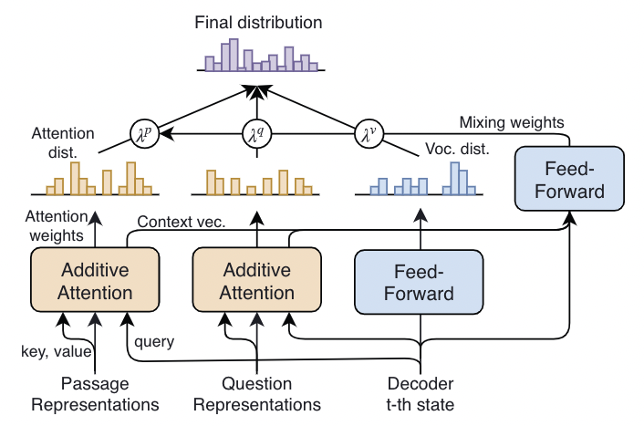

- [x] Round-1: Overview
- [x] Round-2: Model Implementation Details
- [ ] Round-3: Experiments

## Citation


Nishida, K., Saito, I., Nishida, K., Shinoda, K., Otsuka, A., Asano, H., & Tomita, J. (2020).  
Multi-style Generative Reading Comprehension.  
ACL 2019 - 57th Annual Meeting of the Association for Computational Linguistics, Proceedings of the Conference, 2273–2284.  
https://doi.org/10.18653/v1/p19-1220


## Abstract

> This study tackles generative reading comprehension (RC), which consists of answering questions based on textual evidence and natural language generation (NLG). We proposea multi-style abstractive summarization model for question answering, called Masque. The proposed model has two key characteristics. First, unlike most studies on RC that have focused on extracting an answer span from the provided passages, our model instead focuses on generating a summary from the question and multiple passages. This serves to cover various answer styles required for real-world applications. Second, whereas previous studies built a specific model for each answer style because of the difficulty of acquiring one general model, our approach learns multi-style answers within a model to improve the NLG capability for all styles involved. This also enables our model to give an answer in the target style. Experiments show that our model achieves state-of-the-art performance on the Q&A task and the Q&A + NLG task of MSMARCO 2.1 and the summary task of NarrativeQA. We observe that the transfer of the style-independent NLG capability to the targetstyle is the key to its success.

## Background & Wat's New
- 複数のPassageを入力にして Abstractive Summarization によりQAシステムで回答を生成する．
  - 既存手法の多くは入力のPassageの文字列の一部を抽出して回答を作成するが，一部のデータセットでは抽出型の方法では回答を作成できないものがある．
  - この点を解決するために，Transformerをベースとした Abstractive Summarization の手法により回答を生成する生成型のモデル **Masque** を提案した．
  - Masqueから生成される回答は，Vocabularyに含まれる語彙とPassageに散らばっている単語を集約することで文章として生成される．
- 質問の形式に応じて適切な回答を出力できるように質問形式を含めてモデルを学習する
  - QAの質問には，数値を答えるだけのものから文章を要約するものまで，様々なバリエーションがある．それぞれの質問の形式に応じて適切な回答方法があり，それらは一つの回答方法でカバーされるものではないため，Masqueでは質問形式に応じて適切な回答を生成できるよう，質問形式も学習するような仕組みになっている．

## Dataset


Daniel Fernando Campos, Tri Nguyen, M. Rosenberg, Xia Song, Jianfeng Gao, Saurabh Tiwary, Rangan Majumder, L. Deng, Bhaskar Mitra. (2016)  
**MS MARCO: A Human Generated MAchine Reading COmprehension Dataset**  
CoCo@NIPS  
[Paper Link](https://www.semanticscholar.org/paper/a69cf45d44a9d806d2487a1ffb9eca71ee73c2ee)  
Influential Citation Count (190), SS-ID (a69cf45d44a9d806d2487a1ffb9eca71ee73c2ee)  

**ABSTRACT**  
This paper presents our recent work on the design and development of a new, large scale dataset, which we name MS MARCO, for MAchine Reading COmprehension. This new dataset is aimed to overcome a number of well-known weaknesses of previous publicly available datasets for the same task of reading comprehension and question answering. In MS MARCO, all questions are sampled from real anonymized user queries. The context passages, from which answers in the dataset are derived, are extracted from real web documents using the most advanced version of the Bing search engine. The answers to the queries are human generated. Finally, a subset of these queries has multiple answers. We aim to release one million queries and the corresponding answers in the dataset, which, to the best of our knowledge, is the most comprehensive real-world dataset of its kind in both quantity and quality. We are currently releasing 100,000 queries with their corresponding answers to inspire work in reading comprehension and question answering along with gathering feedback from the research community.



Tomás Kociský, Jonathan Schwarz, P. Blunsom, Chris Dyer, K. Hermann, Gábor Melis, Edward Grefenstette. (2017)  
**The NarrativeQA Reading Comprehension Challenge**  
TACL  
[Paper Link](https://www.semanticscholar.org/paper/d91043f0d48b9b2c8ff7ee321abb8fd7efafff7a)  
Influential Citation Count (83), SS-ID (d91043f0d48b9b2c8ff7ee321abb8fd7efafff7a)  

**ABSTRACT**  
Reading comprehension (RC)—in contrast to information retrieval—requires integrating information and reasoning about events, entities, and their relations across a full document. Question answering is conventionally used to assess RC ability, in both artificial agents and children learning to read. However, existing RC datasets and tasks are dominated by questions that can be solved by selecting answers using superficial information (e.g., local context similarity or global term frequency); they thus fail to test for the essential integrative aspect of RC. To encourage progress on deeper comprehension of language, we present a new dataset and set of tasks in which the reader must answer questions about stories by reading entire books or movie scripts. These tasks are designed so that successfully answering their questions requires understanding the underlying narrative rather than relying on shallow pattern matching or salience. We show that although humans solve the tasks easily, standard RC models struggle on the tasks presented here. We provide an analysis of the dataset and the challenges it presents.


 

**Dataset Summary**  

## Model Description

### Problem Formulation

$$
\begin{align*}
  \text{Question} &: x^q = \lbrace x\_1^q, \ldots , x\_J^q \rbrace & x\_j^q &\in \mathbb{R}^V \\\\
  \text{Passages} &: x^{p\_k} = \lbrace x\_1^{p\_k}, \ldots , x\_L^{p\_k} \rbrace  & x\_l^{p\_k} &\in \mathbb{R}^V \\\\
  \text{Answer Style Label} &: s & s &\in \mathbb{N}^+\_{\geqq 0} \\\\
  \text{RC model output} &: y = \lbrace y\_1, \ldots , y\_T \rbrace & y_t &\in \mathbb{R}^V \\\\
  \text{where} \\\\
  & J: \text{length(number of words) of question} \\\\
  & K: \text{number of passages} \\\\
  & L: \text{length(number of words) of each passage} \\\\
  & T: \text{length of model output}
\end{align*}
$$

#### Machine Reading Comprehension Model

$$
f := (x^q, \lbrace x^{p\_k} \rbrace , s) \rightarrow P(y | x^q, \lbrace x^{p\_k} \rbrace , s)
$$

#### Model Traning Formulation

$$
\begin{align*}
  (x^q, \lbrace x^{p\_k} \rbrace , s, y, a, \lbrace r^{p\_k} \rbrace) & \rightarrow \text{loss}(P(y | x^q, \lbrace x^{p\_k} \rbrace , s)) \\\\
  \text{where} \\\\
  a = 1 \hspace{5pt} & \text{if the question is answerable otherwise} \hspace{5pt} 0 \\\\
  r^{p\_k} = 1 \hspace{5pt} & \text{if the }k\text{-th passage is required otherwise} \hspace{5pt} 0
\end{align*}
$$

### Model Architecture

<figure>
  
  <figcaption>Model Architecture</figcaption>
</figure>

### Question-Passages Reader
#### Word Embedding Layer
$$
\begin{align*}
  W^q &= \lbrace w\_1^q, \ldots , w\_J^q \rbrace &=& \hspace{5pt} \text{2L-Highway}(\text{GloVe+ELMo}(x^q)) & w\_j^q \in \mathbb{R}^{d\_{\text{word}} \times V} \\\\
  W^{p\_k} &= \lbrace w\_1^{p\_k}, \ldots , w\_L^{p\_k} \rbrace &=& \hspace{5pt} \text{2L-Highway}(\text{GloVe+ELMo}(x^{p\_k})) & w\_j^{p\_k} \in \mathbb{R}^{d\_{\text{word}} \times V} \\\\
\end{align*}
$$
※ the ELMo is bidirectional


Jeffrey Pennington, R. Socher, Christopher D. Manning. (2014)  
**GloVe: Global Vectors for Word Representation**  
EMNLP  
[Paper Link](https://www.semanticscholar.org/paper/f37e1b62a767a307c046404ca96bc140b3e68cb5)  
Influential Citation Count (3462), SS-ID (f37e1b62a767a307c046404ca96bc140b3e68cb5)  
**ABSTRACT**  
Recent methods for learning vector space representations of words have succeeded in capturing fine-grained semantic and syntactic regularities using vector arithmetic, but the origin of these regularities has remained opaque. We analyze and make explicit the model properties needed for such regularities to emerge in word vectors. The result is a new global logbilinear regression model that combines the advantages of the two major model families in the literature: global matrix factorization and local context window methods. Our model efficiently leverages statistical information by training only on the nonzero elements in a word-word cooccurrence matrix, rather than on the entire sparse matrix or on individual context windows in a large corpus. The model produces a vector space with meaningful substructure, as evidenced by its performance of 75% on a recent word analogy task. It also outperforms related models on similarity tasks and named entity recognition.


Matthew E. Peters, Mark Neumann, Mohit Iyyer, Matt Gardner, Christopher Clark, Kenton Lee, Luke Zettlemoyer. (2018)  
**Deep Contextualized Word Representations**  
NAACL  
[Paper Link](https://www.semanticscholar.org/paper/3febb2bed8865945e7fddc99efd791887bb7e14f)  
Influential Citation Count (1347), SS-ID (3febb2bed8865945e7fddc99efd791887bb7e14f)  
**ABSTRACT**  
We introduce a new type of deep contextualized word representation that models both (1) complex characteristics of word use (e.g., syntax and semantics), and (2) how these uses vary across linguistic contexts (i.e., to model polysemy). Our word vectors are learned functions of the internal states of a deep bidirectional language model (biLM), which is pre-trained on a large text corpus. We show that these representations can be easily added to existing models and significantly improve the state of the art across six challenging NLP problems, including question answering, textual entailment and sentiment analysis. We also present an analysis showing that exposing the deep internals of the pre-trained network is crucial, allowing downstream models to mix different types of semi-supervision signals.


R. Srivastava, Klaus Greff, J. Schmidhuber. (2015)  
**Highway Networks**  
ArXiv  
[Paper Link](https://www.semanticscholar.org/paper/e0945081b5b87187a53d4329cf77cd8bff635795)  
Influential Citation Count (81), SS-ID (e0945081b5b87187a53d4329cf77cd8bff635795)  
**ABSTRACT**  
There is plenty of theoretical and empirical evidence that depth of neural networks is a crucial ingredient for their success. However, network training becomes more difficult with increasing depth and training of very deep networks remains an open problem. In this extended abstract, we introduce a new architecture designed to ease gradient-based training of very deep networks. We refer to networks with this architecture as highway networks, since they allow unimpeded information flow across several layers on information highways. The architecture is characterized by the use of gating units which learn to regulate the flow of information through a network. Highway networks with hundreds of layers can be trained directly using stochastic gradient descent and with a variety of activation functions, opening up the possibility of studying extremely deep and efficient architectures.


Minjoon Seo, Aniruddha Kembhavi, Ali Farhadi, Hannaneh Hajishirzi. (2016)  
**Bidirectional Attention Flow for Machine Comprehension**  
ICLR  
[Paper Link](https://www.semanticscholar.org/paper/3a7b63b50c64f4ec3358477790e84cbd6be2a0b4)  
Influential Citation Count (439), SS-ID (3a7b63b50c64f4ec3358477790e84cbd6be2a0b4)  
**ABSTRACT**  
Machine comprehension (MC), answering a query about a given context paragraph, requires modeling complex interactions between the context and the query. Recently, attention mechanisms have been successfully extended to MC. Typically these methods use attention to focus on a small portion of the context and summarize it with a fixed-size vector, couple attentions temporally, and/or often form a uni-directional attention. In this paper we introduce the Bi-Directional Attention Flow (BIDAF) network, a multi-stage hierarchical process that represents the context at different levels of granularity and uses bi-directional attention flow mechanism to obtain a query-aware context representation without early summarization. Our experimental evaluations show that our model achieves the state-of-the-art results in Stanford Question Answering Dataset (SQuAD) and CNN/DailyMail cloze test.


#### Shared Encoder Layer

$$
\begin{align*}
  E^q &= \lbrace e\_1^q, \ldots e\_J^q \rbrace &=& \text{Shared-Transformer-Encoder-Blok}(W^q) & e\_j^q &\in \mathbb{R}^d \\\\
  E^{p\_k} &= \lbrace e\_1^{p\_k}, \ldots e\_L^{p\_k} \rbrace &=& \text{Shared-Transformer-Encoder-Blok}(W^{p\_k}) & e\_l^{p\_k} &\in \mathbb{R}^d
\end{align*}
$$

#### Dual Attention Layer

##### Similarity Matrix

$$
\begin{align*}
  U^{p\_k} &\in \mathbb{R}^{L \times J} \\\\
  \text{where} \\\\
  & U\_{lj}^{p\_k} = {w^a}^{\mathsf{T}} \left[ E\_l^{p\_k} ; E\_j^q ; E\_l^{p\_k} \odot E\_j^q \right] \\\\
  & w^a \in \mathbb{R}^{3d} \hspace{10pt} \text{(learnable parameters)} \\\\
  & \odot \mapsto \text{hadamard product} \\\\
  & ; \mapsto \text{vector concatenation across the rows}
\end{align*}
$$


Minjoon Seo, Aniruddha Kembhavi, Ali Farhadi, Hannaneh Hajishirzi. (2016)  
**Bidirectional Attention Flow for Machine Comprehension**  
ICLR  
[Paper Link](https://www.semanticscholar.org/paper/3a7b63b50c64f4ec3358477790e84cbd6be2a0b4)  
Influential Citation Count (439), SS-ID (3a7b63b50c64f4ec3358477790e84cbd6be2a0b4)  
**ABSTRACT**  
Machine comprehension (MC), answering a query about a given context paragraph, requires modeling complex interactions between the context and the query. Recently, attention mechanisms have been successfully extended to MC. Typically these methods use attention to focus on a small portion of the context and summarize it with a fixed-size vector, couple attentions temporally, and/or often form a uni-directional attention. In this paper we introduce the Bi-Directional Attention Flow (BIDAF) network, a multi-stage hierarchical process that represents the context at different levels of granularity and uses bi-directional attention flow mechanism to obtain a query-aware context representation without early summarization. Our experimental evaluations show that our model achieves the state-of-the-art results in Stanford Question Answering Dataset (SQuAD) and CNN/DailyMail cloze test.

 
##### Normalized Similarity Matrix

$$
\begin{align*}
  A^{p\_k} &= \text{softmax}\_j\left( {U^{p\_k}}^\mathsf{T} \right) &\in \mathbb{R}^{J \times L} \\\\
  B^{p\_k} &= \text{softmax}\_l\left( {U^{p\_k}} \right) &\in \mathbb{R}^{L \times J} \\\\
\end{align*}
$$

##### Dynamic Coattention Networks (DCN)

$$
\begin{align*}
  G^{q \rightarrow p\_k} &= \left\lbrack E^{p\_k} ; \bar{A}^{p\_k} ; \bar{\bar{A}}^{p\_k}; E^{p\_k} \odot \bar{A}^{p\_k}; E^{p\_k} \odot \bar{\bar{A}}^{p\_k} \right\rbrack &\in \mathbb{R}^{5d \times L} \\\\
  G^{p \rightarrow q} &= \left\lbrack E^q ; \bar{B} ; \bar{\bar{B}}; E^q \odot \bar{B} ; E^q \odot \bar{\bar{B}}\right\rbrack &\in \mathbb{R}^{5d \times J} \\\\
  \text{where} \\\\
  & \bar{A}^{p\_k} = E^q A^{p\_k} &\in \mathbb{R}^{d \times L} \\\\
  & \bar{B}^{p\_k} = E^{p\_k} B^{p\_k} &\in \mathbb{R}^{d \times J} \\\\
  & \bar{\bar{A}}^{p\_k} = \bar{B}^{p\_k} A^{p\_k} &\in \mathbb{R}^{d \times L} \\\\
  & \bar{\bar{B}}^{p\_k} = \bar{A}^{p\_k} B^{p\_k} &\in \mathbb{R}^{d \times J} \\\\
  & \bar{B} = \max\_k \left(\bar{B}^{p\_k}\right) &\in \mathbb{R}^{d \times J} \\\\
  & \bar{\bar{B}} = \max\_k \left( \bar{\bar{B}}^{p\_k} \right) &\in \mathbb{R}^{d \times J}
\end{align*}
$$


Caiming Xiong, Victor Zhong, R. Socher. (2016)  
**Dynamic Coattention Networks For Question Answering**  
ICLR  
[Paper Link](https://www.semanticscholar.org/paper/e978d832a4d86571e1b52aa1685dc32ccb250f50)  
Influential Citation Count (111), SS-ID (e978d832a4d86571e1b52aa1685dc32ccb250f50)  
**ABSTRACT**  
Several deep learning models have been proposed for question answering. However, due to their single-pass nature, they have no way to recover from local maxima corresponding to incorrect answers. To address this problem, we introduce the Dynamic Coattention Network (DCN) for question answering. The DCN first fuses co-dependent representations of the question and the document in order to focus on relevant parts of both. Then a dynamic pointing decoder iterates over potential answer spans. This iterative procedure enables the model to recover from initial local maxima corresponding to incorrect answers. On the Stanford question answering dataset, a single DCN model improves the previous state of the art from 71.0% F1 to 75.9%, while a DCN ensemble obtains 80.4% F1.


#### Model Encoder Layer

$$
\begin{align*}
  M^q &= \text{Transformer-Encoder-Block}(G^{p \rightarrow q}) &\in \mathbb{R}^{d \times J} \\\\
  M^{p\_k} &= \text{Transformer-Encoder-Block}(G^{q \rightarrow p\_k}) &\in \mathbb{R}^{d \times L}
\end{align*}
$$

### Passage Ranker
各 $\lbrace M^{p\_k} \rbrace$ の先頭の単語 $M\_1^{p\_k}$ を受け取ってQuestionに対する $k$番目のPassageの関連性スコアを算出する  
入力の文章の情報を $M\_1^{p\_k}$ に集約するように学習する

$$
\begin{align*}
  \beta^{p\_k} &= \text{sigmoid}\left( {w^r}^\mathsf{T} M\_1^{p\_k} \right) \in \mathbb{R} \\\\
  \text{where} \\\\
  & M\_1^{p\_k} \in \mathbb{R}^d \\\\
  & w^r \in \mathbb{R}^d
\end{align*}
$$

### Answer Possibility Classifier

#### Word Embedding Layer
- 基本構成は Reader Module と同じだが，Answer出力時の先読みを防ぐため，ELMo は **unidirectional**
- 一つのモデルで複数のAnswer Styleを扱うために，**Artificial Tokens** を導入
  - Answerの先頭( $y\_1$ )にAnswer Styleに対応するトークンを導入する
  - テスト時には，先頭のトークンを指定することで解答のスタイルをコントロールすることができるようになる
  - モデルのアーキテクチャには影響しない

$$
\begin{align*}
  y &= \left\lbrace y\_{\text{style}}, y\_1, \ldots, y\_T \right\rbrace \\\\
  W^{\text{answer}} &= \lbrace w\_{\text{style}}^{\text{answer}}, w\_1^{\text{answer}}, \ldots, w\_T^{\text{answer}} \rbrace = \text{2L-Highway}(\text{GloVe+ELMo}(y)) & w\_t^{\text{answer}} &\in \mathbb{R}^{d\_{\text{word}} \times V}
\end{align*}
$$

※ the ELMo is unidirectional


Melvin Johnson, M. Schuster, Quoc V. Le, M. Krikun, Yonghui Wu, Z. Chen, Nikhil Thorat, F. Viégas, M. Wattenberg, G. Corrado, Macduff Hughes, J. Dean. (2016)  
**Google’s Multilingual Neural Machine Translation System: Enabling Zero-Shot Translation**  
TACL  
[Paper Link](https://www.semanticscholar.org/paper/a486e2839291111bb44fa1f07731ada123539f75)  
Influential Citation Count (162), SS-ID (a486e2839291111bb44fa1f07731ada123539f75)  
**ABSTRACT**  
We propose a simple solution to use a single Neural Machine Translation (NMT) model to translate between multiple languages. Our solution requires no changes to the model architecture from a standard NMT system but instead introduces an artificial token at the beginning of the input sentence to specify the required target language. Using a shared wordpiece vocabulary, our approach enables Multilingual NMT systems using a single model. On the WMT’14 benchmarks, a single multilingual model achieves comparable performance for English→French and surpasses state-of-theart results for English→German. Similarly, a single multilingual model surpasses state-of-the-art results for French→English and German→English on WMT’14 and WMT’15 benchmarks, respectively. On production corpora, multilingual models of up to twelve language pairs allow for better translation of many individual pairs. Our models can also learn to perform implicit bridging between language pairs never seen explicitly during training, showing that transfer learning and zero-shot translation is possible for neural translation. Finally, we show analyses that hints at a universal interlingua representation in our models and also show some interesting examples when mixing languages.



Shunsuke Takeno, M. Nagata, Kazuhide Yamamoto. (2017)  
**Controlling Target Features in Neural Machine Translation via Prefix Constraints**  
WAT@IJCNLP  
[Paper Link](https://www.semanticscholar.org/paper/c034abc8ee67af5ffe717f8c52971dccd308ea2a)  
Influential Citation Count (0), SS-ID (c034abc8ee67af5ffe717f8c52971dccd308ea2a)  
**ABSTRACT**  
We propose prefix constraints, a novel method to enforce constraints on target sentences in neural machine translation. It places a sequence of special tokens at the beginning of target sentence (target prefix), while side constraints places a special token at the end of source sentence (source suffix). Prefix constraints can be predicted from source sentence jointly with target sentence, while side constraints (Sennrich et al., 2016) must be provided by the user or predicted by some other methods. In both methods, special tokens are designed to encode arbitrary features on target-side or metatextual information. We show that prefix constraints are more flexible than side constraints and can be used to control the behavior of neural machine translation, in terms of output length, bidirectional decoding, domain adaptation, and unaligned target word generation.


#### Attention Decoder Layer

$$
\begin{align*}
  M^{\text{answer}} &= \text{Normed-ResNet}(\text{Masked-Transformer-Encoder-Block}(W^{\text{answer}})) &\in \mathbb{R}^{d \times T'} \\\\
  M^{\text{answer}+q} &= \text{Normed-ResNet}(\text{Transformer-Encoder-Block}(M^{\text{answer}}, M^q)) &\in \mathbb{R}^{d \times T'} \\\\
  M^{\text{answer}+q+p\_{all}} &= \text{Normed-ResNet}(\text{Transformer-Encoder-Block}(M^{\text{answer}+q}, M^{p\_{all}})) &\in \mathbb{R}^{d \times T'} \\\\
  S = \lbrace s\_1, \ldots, s\_{T'} \rbrace &= \text{Normed-ResNet}(\text{Feed-Forward}(M^{\text{answer}+q+p\_{all}})) &\in \mathbb{R}^{d \times T'} \\\\
  & \text{where} \\\\
  & T' = T+1 \hspace{10pt} \text{(answer style + answer)} \\\\
  & M^{p\_{all}} = \left[M^{p\_1}, \ldots, M^{p\_K}\right] \in \mathbb{R}^{d \times KL} \\\\
  & [, ] \mapsto \text{vector concatenation across the columns}
\end{align*}
$$

#### Multi-source Pointer-Generator

<figure>
  
  <figcaption>Multi-source Pointer-Generator mechanism</figcaption>
</figure>

##### Extended vocabulary distribution
- Question及びPassagesのVocabularyとCommon Wordsを合わせたVocabularyをExtended Vocaburary( $V\_{\text{ext}}$ )とする

$$
\begin{align*}
  P^v(y\_t) &= \text{softmax}\left( {W^2}^\mathsf{T} \left(W^1 s\_t + b^1 \right) \right) \\\\
  &\text{where} \\\\
  & W^2 \in \mathbb{R}^{d\_{\text{word}} \times V\_{\text{ext}}} \\\\
  & W^1 \in \mathbb{R}^{d\_{\text{word}} \times d} \\\\
  & b^1 \in \mathbb{R}^{d\_{\text{word}}} \\\\
  & P^v(y\_t) = 0 \hspace{10pt} \text{if }y\_t\text{ is an out-of-vocabulary word for } V
\end{align*}
$$


Hakan Inan, Khashayar Khosravi, R. Socher. (2016)  
**Tying Word Vectors and Word Classifiers: A Loss Framework for Language Modeling**  
ICLR  
[Paper Link](https://www.semanticscholar.org/paper/424aef7340ee618132cc3314669400e23ad910ba)  
Influential Citation Count (34), SS-ID (424aef7340ee618132cc3314669400e23ad910ba)  
**ABSTRACT**  
Recurrent neural networks have been very successful at predicting sequences of words in tasks such as language modeling. However, all such models are based on the conventional classification framework, where the model is trained against one-hot targets, and each word is represented both as an input and as an output in isolation. This causes inefficiencies in learning both in terms of utilizing all of the information and in terms of the number of parameters needed to train. We introduce a novel theoretical framework that facilitates better learning in language modeling, and show that our framework leads to tying together the input embedding and the output projection matrices, greatly reducing the number of trainable variables. Our framework leads to state of the art performance on the Penn Treebank with a variety of network models.


##### Copy distribution

###### Additional Attention Layer

$$
\begin{align*}
  e\_l^{p\_k} &= {w^p}^\mathsf{T} \tanh \left(W^{pm} M\_l^{p\_k} + W^{ps} s\_t + b^p \right) \\\\
  \alpha\_t^p &= \text{softmax}\left(\left[ e^{p\_1}; \ldots; e^{p\_K}\right]\right) &\in \mathbb{R}^{KL} \\\\
  c\_t^p &= \sum\_l \alpha\_{tl}^p M\_l^{p\_{all}} &\in \mathbb{R}^d \\\\
  & \text{where} \\\\
  & w^p, b^p \in \mathbb{R}^d \hspace{10pt} \text{(learnable paramters)} \\\\
  & W^{pm}, W^{ps} \in \mathbb{R}^{d \times d} \hspace{10pt} \text{(learnable paramters)}
\end{align*}
$$

Question及びPassagesのそれぞれに対してCopy Distributions (over the extended vocabulary)を算出する

$$
\begin{align*}
  P^q(y\_t) &= \sum\_{j:x\_j^q=y\_t} \alpha\_{tj}^q \\\\
  P^p(y\_t) &= \sum\_{l:x\_l^{p\_{k(l)}}=y\_t} \alpha\_{tl}^p \\\\
  & \text{where} \\\\
  & k(l) \mapsto \text{the passage index corresponding to the }l\text{-th word in the concatenated passages}
\end{align*}
$$


Sebastian Gehrmann, Yuntian Deng, Alexander M. Rush. (2018)  
**Bottom-Up Abstractive Summarization**  
EMNLP  
[Paper Link](https://www.semanticscholar.org/paper/7af89df3691d8c33aaf1858f7cc51da1bc9549a9)  
Influential Citation Count (75), SS-ID (7af89df3691d8c33aaf1858f7cc51da1bc9549a9)  
**ABSTRACT**  
Neural summarization produces outputs that are fluent and readable, but which can be poor at content selection, for instance often copying full sentences from the source document. This work explores the use of data-efficient content selectors to over-determine phrases in a source document that should be part of the summary. We use this selector as a bottom-up attention step to constrain the model to likely phrases. We show that this approach improves the ability to compress text, while still generating fluent summaries. This two-step process is both simpler and higher performing than other end-to-end content selection models, leading to significant improvements on ROUGE for both the CNN-DM and NYT corpus. Furthermore, the content selector can be trained with as little as 1,000 sentences making it easy to transfer a trained summarizer to a new domain.


#### Final distribution

$$
\begin{align*}
  P(y\_t) &= \lambda^v P^v(y\_t) + \lambda^q P^q(y\_t) + \lambda^p P^p(y\_t) \\\\
  \lambda^v, \lambda^q, \lambda^p &= \text{softmax}\left( W^m\left[ s\_t; c\_t^q; c\_t^p \right] + b^m \right) \\\\
  & \text{where} \\\\
  & W^m \in \mathbb{R}^{3 \times 3d} \\\\
  & b^m \in \mathbb{R}^3
\end{align*}
$$

#### Combined Attention
- 関連性のないPassageに含まれる単語が混入することを防ぐために，**Combined Attention** を導入する
- Additional Attention Layerを下記の式で修正する

$$
\alpha\_{tl}^p = \frac{\alpha\_{tl}^p \beta^{p\_k(l)}}{\sum\_{l'} \alpha\_{tl'}^p \beta^{p\_k(l')}}
$$

### Loss Function

$$
\begin{align*}
  L(\theta) &= L\_{\text{dec}} + \gamma\_{\text{rank}} L\_{\text{rank}} + \gamma\_{\text{cls}} L\_{\text{cls}} \\\\
  L\_{\text{dec}} &= -\frac{1}{N\_{\text{able}}} \sum\_{(a,y) \in \mathcal{D}} \frac{a}{T} \sum\_t \log P(y\_t) \\\\
  L\_{\text{rank}} &= -\frac{1}{NK}\sum\_k\sum\_{r^{p\_k} \in \mathcal{D}} \left( r^{p\_k} \log \beta^{p\_k} + (1 - r^{p\_k}) \log (1 - \beta^{p\_k}) \right) \\\\
  L\_{\text{cls}} &= -\frac{1}{N}\sum\_{a \in \mathcal{D}} \left( a\log P(a) + (1 - a) \log (1 - P(a)) \right) \\\\
  & \text{where} \\\\
  & \gamma\_{\text{rank}}, \gamma\_{\text{cls}} \mapsto \text{balancing hyper-parameters} \\\\
  & N\_{\text{able}} \mapsto \text{answerable examples} \\\\
  & \mathcal{D} \mapsto \text{the training dataset}
\end{align*}
$$

### Training Settings

## Results

#### MSMARCO v2

#### NarrativeQA

## References



Pranav Rajpurkar, Jian Zhang, Konstantin Lopyrev, Percy Liang. (2016)  
**SQuAD: 100,000+ Questions for Machine Comprehension of Text**  
EMNLP  
[Paper Link](https://www.semanticscholar.org/paper/05dd7254b632376973f3a1b4d39485da17814df5)  
Influential Citation Count (1066), SS-ID (05dd7254b632376973f3a1b4d39485da17814df5)  

**ABSTRACT**  
We present the Stanford Question Answering Dataset (SQuAD), a new reading comprehension dataset consisting of 100,000+ questions posed by crowdworkers on a set of Wikipedia articles, where the answer to each question is a segment of text from the corresponding reading passage. We analyze the dataset to understand the types of reasoning required to answer the questions, leaning heavily on dependency and constituency trees. We build a strong logistic regression model, which achieves an F1 score of 51.0%, a significant improvement over a simple baseline (20%). However, human performance (86.8%) is much higher, indicating that the dataset presents a good challenge problem for future research.  The dataset is freely available at this https URL





Zhenxin Fu, Xiaoye Tan, Nanyun Peng, Dongyan Zhao, Rui Yan. (2017)  
**Style Transfer in Text: Exploration and Evaluation**  
AAAI  
[Paper Link](https://www.semanticscholar.org/paper/065191b835fee705a6a5a2818aaa944437089ce8)  
Influential Citation Count (86), SS-ID (065191b835fee705a6a5a2818aaa944437089ce8)  

**ABSTRACT**  
Style transfer is an important problem in natural language processing (NLP). However, the progress in language style transfer is lagged behind other domains, such as computer vision, mainly because of the lack of parallel data and principle evaluation metrics. In this paper, we propose to learn style transfer with non-parallel data. We explore two models to achieve this goal, and the key idea behind the proposed models is to learn separate content representations and style representations using adversarial networks. We also propose novel evaluation metrics which measure two aspects of style transfer: transfer strength and content preservation. We access our models and the evaluation metrics on two tasks: paper-news title transfer, and positive-negative review transfer. Results show that the proposed content preservation metric is highly correlate to human judgments, and the proposed models are able to generate sentences with higher style transfer strength and similar content preservation score comparing to auto-encoder.





Sewon Min, Victor Zhong, R. Socher, Caiming Xiong. (2018)  
**Efficient and Robust Question Answering from Minimal Context over Documents**  
ACL  
[Paper Link](https://www.semanticscholar.org/paper/090294db9fbcfc27e38b11050029bcb6fb794331)  
Influential Citation Count (11), SS-ID (090294db9fbcfc27e38b11050029bcb6fb794331)  

**ABSTRACT**  
Neural models for question answering (QA) over documents have achieved significant performance improvements. Although effective, these models do not scale to large corpora due to their complex modeling of interactions between the document and the question. Moreover, recent work has shown that such models are sensitive to adversarial inputs. In this paper, we study the minimal context required to answer the question, and find that most questions in existing datasets can be answered with a small set of sentences. Inspired by this observation, we propose a simple sentence selector to select the minimal set of sentences to feed into the QA model. Our overall system achieves significant reductions in training (up to 15 times) and inference times (up to 13 times), with accuracy comparable to or better than the state-of-the-art on SQuAD, NewsQA, TriviaQA and SQuAD-Open. Furthermore, our experimental results and analyses show that our approach is more robust to adversarial inputs.





Yizhong Wang, Kai Liu, Jing Liu, W. He, Yajuan Lyu, Hua Wu, Sujian Li, Haifeng Wang. (2018)  
**Multi-Passage Machine Reading Comprehension with Cross-Passage Answer Verification**  
ACL  
[Paper Link](https://www.semanticscholar.org/paper/0985497d1de3ffd11713e75289cc2ad55836623d)  
Influential Citation Count (14), SS-ID (0985497d1de3ffd11713e75289cc2ad55836623d)  

**ABSTRACT**  
Machine reading comprehension (MRC) on real web data usually requires the machine to answer a question by analyzing multiple passages retrieved by search engine. Compared with MRC on a single passage, multi-passage MRC is more challenging, since we are likely to get multiple confusing answer candidates from different passages. To address this problem, we propose an end-to-end neural model that enables those answer candidates from different passages to verify each other based on their content representations. Specifically, we jointly train three modules that can predict the final answer based on three factors: the answer boundary, the answer content and the cross-passage answer verification. The experimental results show that our method outperforms the baseline by a large margin and achieves the state-of-the-art performance on the English MS-MARCO dataset and the Chinese DuReader dataset, both of which are designed for MRC in real-world settings.





Danqi Chen, Adam Fisch, J. Weston, Antoine Bordes. (2017)  
**Reading Wikipedia to Answer Open-Domain Questions**  
ACL  
[Paper Link](https://www.semanticscholar.org/paper/104715e1097b7ebee436058bfd9f45540f269845)  
Influential Citation Count (281), SS-ID (104715e1097b7ebee436058bfd9f45540f269845)  

**ABSTRACT**  
This paper proposes to tackle open- domain question answering using Wikipedia as the unique knowledge source: the answer to any factoid question is a text span in a Wikipedia article. This task of machine reading at scale combines the challenges of document retrieval (finding the relevant articles) with that of machine comprehension of text (identifying the answer spans from those articles). Our approach combines a search component based on bigram hashing and TF-IDF matching with a multi-layer recurrent neural network model trained to detect answers in Wikipedia paragraphs. Our experiments on multiple existing QA datasets indicate that (1) both modules are highly competitive with respect to existing counterparts and (2) multitask learning using distant supervision on their combination is an effective complete system on this challenging task.





Dan Hendrycks, Kevin Gimpel. (2016)  
**Gaussian Error Linear Units (GELUs)**  
  
[Paper Link](https://www.semanticscholar.org/paper/15f4c35889ccc1ae258b680c2ca2fcbfe1e260f7)  
Influential Citation Count (113), SS-ID (15f4c35889ccc1ae258b680c2ca2fcbfe1e260f7)  

**ABSTRACT**  
We propose the Gaussian Error Linear Unit (GELU), a high-performing neural network activation function. The GELU activation function is $x\Phi(x)$, where $\Phi(x)$ the standard Gaussian cumulative distribution function. The GELU nonlinearity weights inputs by their value, rather than gates inputs by their sign as in ReLUs ($x\mathbf{1}_{x>0}$). We perform an empirical evaluation of the GELU nonlinearity against the ReLU and ELU activations and find performance improvements across all considered computer vision, natural language processing, and speech tasks.





R. Caruana. (1997)  
**Multitask Learning**  
Machine Learning  
[Paper Link](https://www.semanticscholar.org/paper/161ffb54a3fdf0715b198bb57bd22f910242eb49)  
Influential Citation Count (38), SS-ID (161ffb54a3fdf0715b198bb57bd22f910242eb49)  

**ABSTRACT**  
Multitask Learning is an approach to inductive transfer that improves generalization by using the domain information contained in the training signals of related tasks as an inductive bias. It does this by learning tasks in parallel while using a shared representation; what is learned for each task can help other tasks be learned better. This paper reviews prior work on MTL, presents new evidence that MTL in backprop nets discovers task relatedness without the need of supervisory signals, and presents new results for MTL with k-nearest neighbor and kernel regression. In this paper we demonstrate multitask learning in three domains. We explain how multitask learning works, and show that there are many opportunities for multitask learning in real domains. We present an algorithm and results for multitask learning with case-based methods like k-nearest neighbor and kernel regression, and sketch an algorithm for multitask learning in decision trees. Because multitask learning works, can be applied to many different kinds of domains, and can be used with different learning algorithms, we conjecture there will be many opportunities for its use on real-world problems.





Dani Yogatama, Cyprien de Masson d'Autume, Jerome T. Connor, Tomás Kociský, Mike Chrzanowski, Lingpeng Kong, Angeliki Lazaridou, Wang Ling, Lei Yu, Chris Dyer, P. Blunsom. (2019)  
**Learning and Evaluating General Linguistic Intelligence**  
ArXiv  
[Paper Link](https://www.semanticscholar.org/paper/19281b9ecdb5c07a93423a506627ab9d9b0cf039)  
Influential Citation Count (6), SS-ID (19281b9ecdb5c07a93423a506627ab9d9b0cf039)  

**ABSTRACT**  
We define general linguistic intelligence as the ability to reuse previously acquired knowledge about a language's lexicon, syntax, semantics, and pragmatic conventions to adapt to new tasks quickly. Using this definition, we analyze state-of-the-art natural language understanding models and conduct an extensive empirical investigation to evaluate them against these criteria through a series of experiments that assess the task-independence of the knowledge being acquired by the learning process. In addition to task performance, we propose a new evaluation metric based on an online encoding of the test data that quantifies how quickly an existing agent (model) learns a new task. Our results show that while the field has made impressive progress in terms of model architectures that generalize to many tasks, these models still require a lot of in-domain training examples (e.g., for fine tuning, training task-specific modules), and are prone to catastrophic forgetting. Moreover, we find that far from solving general tasks (e.g., document question answering), our models are overfitting to the quirks of particular datasets (e.g., SQuAD). We discuss missing components and conjecture on how to make progress toward general linguistic intelligence.





Juncen Li, Robin Jia, He He, Percy Liang. (2018)  
**Delete, Retrieve, Generate: a Simple Approach to Sentiment and Style Transfer**  
NAACL  
[Paper Link](https://www.semanticscholar.org/paper/1975ae6d8693eedfb07d5348798351fe51ab242b)  
Influential Citation Count (115), SS-ID (1975ae6d8693eedfb07d5348798351fe51ab242b)  

**ABSTRACT**  
We consider the task of text attribute transfer: transforming a sentence to alter a specific attribute (e.g., sentiment) while preserving its attribute-independent content (e.g., “screen is just the right size” to “screen is too small”). Our training data includes only sentences labeled with their attribute (e.g., positive and negative), but not pairs of sentences that only differ in the attributes, so we must learn to disentangle attributes from attribute-independent content in an unsupervised way. Previous work using adversarial methods has struggled to produce high-quality outputs. In this paper, we propose simpler methods motivated by the observation that text attributes are often marked by distinctive phrases (e.g., “too small”). Our strongest method extracts content words by deleting phrases associated with the sentence’s original attribute value, retrieves new phrases associated with the target attribute, and uses a neural model to fluently combine these into a final output. Based on human evaluation, our best method generates grammatical and appropriate responses on 22% more inputs than the best previous system, averaged over three attribute transfer datasets: altering sentiment of reviews on Yelp, altering sentiment of reviews on Amazon, and altering image captions to be more romantic or humorous.





Ashish Vaswani, Noam M. Shazeer, Niki Parmar, Jakob Uszkoreit, Llion Jones, Aidan N. Gomez, Lukasz Kaiser, Illia Polosukhin. (2017)  
**Attention is All you Need**  
NIPS  
[Paper Link](https://www.semanticscholar.org/paper/204e3073870fae3d05bcbc2f6a8e263d9b72e776)  
Influential Citation Count (7622), SS-ID (204e3073870fae3d05bcbc2f6a8e263d9b72e776)  

**ABSTRACT**  
The dominant sequence transduction models are based on complex recurrent or convolutional neural networks in an encoder-decoder configuration. The best performing models also connect the encoder and decoder through an attention mechanism. We propose a new simple network architecture, the Transformer, based solely on attention mechanisms, dispensing with recurrence and convolutions entirely. Experiments on two machine translation tasks show these models to be superior in quality while being more parallelizable and requiring significantly less time to train. Our model achieves 28.4 BLEU on the WMT 2014 English-to-German translation task, improving over the existing best results, including ensembles by over 2 BLEU. On the WMT 2014 English-to-French translation task, our model establishes a new single-model state-of-the-art BLEU score of 41.8 after training for 3.5 days on eight GPUs, a small fraction of the training costs of the best models from the literature. We show that the Transformer generalizes well to other tasks by applying it successfully to English constituency parsing both with large and limited training data.





Zhilin Yang, Peng Qi, Saizheng Zhang, Yoshua Bengio, William W. Cohen, R. Salakhutdinov, Christopher D. Manning. (2018)  
**HotpotQA: A Dataset for Diverse, Explainable Multi-hop Question Answering**  
EMNLP  
[Paper Link](https://www.semanticscholar.org/paper/22655979df781d222eaf812b0d325fa9adf11594)  
Influential Citation Count (195), SS-ID (22655979df781d222eaf812b0d325fa9adf11594)  

**ABSTRACT**  
Existing question answering (QA) datasets fail to train QA systems to perform complex reasoning and provide explanations for answers. We introduce HotpotQA, a new dataset with 113k Wikipedia-based question-answer pairs with four key features: (1) the questions require finding and reasoning over multiple supporting documents to answer; (2) the questions are diverse and not constrained to any pre-existing knowledge bases or knowledge schemas; (3) we provide sentence-level supporting facts required for reasoning, allowing QA systems to reason with strong supervision and explain the predictions; (4) we offer a new type of factoid comparison questions to test QA systems’ ability to extract relevant facts and perform necessary comparison. We show that HotpotQA is challenging for the latest QA systems, and the supporting facts enable models to improve performance and make explainable predictions.





Christian Szegedy, Vincent Vanhoucke, S. Ioffe, Jonathon Shlens, Z. Wojna. (2015)  
**Rethinking the Inception Architecture for Computer Vision**  
2016 IEEE Conference on Computer Vision and Pattern Recognition (CVPR)  
[Paper Link](https://www.semanticscholar.org/paper/23ffaa0fe06eae05817f527a47ac3291077f9e58)  
Influential Citation Count (2183), SS-ID (23ffaa0fe06eae05817f527a47ac3291077f9e58)  

**ABSTRACT**  
Convolutional networks are at the core of most state of-the-art computer vision solutions for a wide variety of tasks. Since 2014 very deep convolutional networks started to become mainstream, yielding substantial gains in various benchmarks. Although increased model size and computational cost tend to translate to immediate quality gains for most tasks (as long as enough labeled data is provided for training), computational efficiency and low parameter count are still enabling factors for various use cases such as mobile vision and big-data scenarios. Here we are exploring ways to scale up networks in ways that aim at utilizing the added computation as efficiently as possible by suitably factorized convolutions and aggressive regularization. We benchmark our methods on the ILSVRC 2012 classification challenge validation set demonstrate substantial gains over the state of the art: 21:2% top-1 and 5:6% top-5 error for single frame evaluation using a network with a computational cost of 5 billion multiply-adds per inference and with using less than 25 million parameters. With an ensemble of 4 models and multi-crop evaluation, we report 3:5% top-5 error and 17:3% top-1 error on the validation set and 3:6% top-5 error on the official test set.





Chenliang Li, Weiran Xu, Si Li, Sheng Gao. (2018)  
**Guiding Generation for Abstractive Text Summarization Based on Key Information Guide Network**  
NAACL  
[Paper Link](https://www.semanticscholar.org/paper/2770a733eecdda23c1b3f9408c9202efec4f0da0)  
Influential Citation Count (9), SS-ID (2770a733eecdda23c1b3f9408c9202efec4f0da0)  

**ABSTRACT**  
Neural network models, based on the attentional encoder-decoder model, have good capability in abstractive text summarization. However, these models are hard to be controlled in the process of generation, which leads to a lack of key information. We propose a guiding generation model that combines the extractive method and the abstractive method. Firstly, we obtain keywords from the text by a extractive model. Then, we introduce a Key Information Guide Network (KIGN), which encodes the keywords to the key information representation, to guide the process of generation. In addition, we use a prediction-guide mechanism, which can obtain the long-term value for future decoding, to further guide the summary generation. We evaluate our model on the CNN/Daily Mail dataset. The experimental results show that our model leads to significant improvements.





Fu Sun, Linyang Li, Xipeng Qiu, Yang Liu. (2018)  
**U-Net: Machine Reading Comprehension with Unanswerable Questions**  
ArXiv  
[Paper Link](https://www.semanticscholar.org/paper/27e98e09cf09bc13c913d01676e5f32624011050)  
Influential Citation Count (6), SS-ID (27e98e09cf09bc13c913d01676e5f32624011050)  

**ABSTRACT**  
Machine reading comprehension with unanswerable questions is a new challenging task for natural language processing. A key subtask is to reliably predict whether the question is unanswerable. In this paper, we propose a unified model, called U-Net, with three important components: answer pointer, no-answer pointer, and answer verifier. We introduce a universal node and thus process the question and its context passage as a single contiguous sequence of tokens. The universal node encodes the fused information from both the question and passage, and plays an important role to predict whether the question is answerable and also greatly improves the conciseness of the U-Net. Different from the state-of-art pipeline models, U-Net can be learned in an end-to-end fashion. The experimental results on the SQuAD 2.0 dataset show that U-Net can effectively predict the unanswerability of questions and achieves an F1 score of 71.7 on SQuAD 2.0.





Zhiting Hu, Zichao Yang, Xiaodan Liang, R. Salakhutdinov, E. Xing. (2017)  
**Toward Controlled Generation of Text**  
ICML  
[Paper Link](https://www.semanticscholar.org/paper/2a215755d7548ffc82079ce734c4ac60b62f6f56)  
Influential Citation Count (96), SS-ID (2a215755d7548ffc82079ce734c4ac60b62f6f56)  

**ABSTRACT**  
Generic generation and manipulation of text is challenging and has limited success compared to recent deep generative modeling in visual domain. This paper aims at generating plausible natural language sentences, whose attributes are dynamically controlled by learning disentangled latent representations with designated semantics. We propose a new neural generative model which combines variational auto-encoders and holistic attribute discriminators for effective imposition of semantic structures. With differentiable approximation to discrete text samples, explicit constraints on independent attribute controls, and efficient collaborative learning of generator and discriminators, our model learns highly interpretable representations from even only word annotations, and produces realistic sentences with desired attributes. Quantitative evaluation validates the accuracy of sentence and attribute generation.





Kaiming He, X. Zhang, Shaoqing Ren, Jian Sun. (2015)  
**Deep Residual Learning for Image Recognition**  
2016 IEEE Conference on Computer Vision and Pattern Recognition (CVPR)  
[Paper Link](https://www.semanticscholar.org/paper/2c03df8b48bf3fa39054345bafabfeff15bfd11d)  
Influential Citation Count (19458), SS-ID (2c03df8b48bf3fa39054345bafabfeff15bfd11d)  

**ABSTRACT**  
Deeper neural networks are more difficult to train. We present a residual learning framework to ease the training of networks that are substantially deeper than those used previously. We explicitly reformulate the layers as learning residual functions with reference to the layer inputs, instead of learning unreferenced functions. We provide comprehensive empirical evidence showing that these residual networks are easier to optimize, and can gain accuracy from considerably increased depth. On the ImageNet dataset we evaluate residual nets with a depth of up to 152 layers - 8× deeper than VGG nets [40] but still having lower complexity. An ensemble of these residual nets achieves 3.57% error on the ImageNet test set. This result won the 1st place on the ILSVRC 2015 classification task. We also present analysis on CIFAR-10 with 100 and 1000 layers. The depth of representations is of central importance for many visual recognition tasks. Solely due to our extremely deep representations, we obtain a 28% relative improvement on the COCO object detection dataset. Deep residual nets are foundations of our submissions to ILSVRC & COCO 2015 competitions1, where we also won the 1st places on the tasks of ImageNet detection, ImageNet localization, COCO detection, and COCO segmentation.





Nitish Srivastava, Geoffrey E. Hinton, A. Krizhevsky, Ilya Sutskever, R. Salakhutdinov. (2014)  
**Dropout: a simple way to prevent neural networks from overfitting**  
J. Mach. Learn. Res.  
[Paper Link](https://www.semanticscholar.org/paper/34f25a8704614163c4095b3ee2fc969b60de4698)  
Influential Citation Count (2210), SS-ID (34f25a8704614163c4095b3ee2fc969b60de4698)  

**ABSTRACT**  
Deep neural nets with a large number of parameters are very powerful machine learning systems. However, overfitting is a serious problem in such networks. Large networks are also slow to use, making it difficult to deal with overfitting by combining the predictions of many different large neural nets at test time. Dropout is a technique for addressing this problem. The key idea is to randomly drop units (along with their connections) from the neural network during training. This prevents units from co-adapting too much. During training, dropout samples from an exponential number of different "thinned" networks. At test time, it is easy to approximate the effect of averaging the predictions of all these thinned networks by simply using a single unthinned network that has smaller weights. This significantly reduces overfitting and gives major improvements over other regularization methods. We show that dropout improves the performance of neural networks on supervised learning tasks in vision, speech recognition, document classification and computational biology, obtaining state-of-the-art results on many benchmark data sets.





Minjoon Seo, Aniruddha Kembhavi, Ali Farhadi, Hannaneh Hajishirzi. (2016)  
**Bidirectional Attention Flow for Machine Comprehension**  
ICLR  
[Paper Link](https://www.semanticscholar.org/paper/3a7b63b50c64f4ec3358477790e84cbd6be2a0b4)  
Influential Citation Count (439), SS-ID (3a7b63b50c64f4ec3358477790e84cbd6be2a0b4)  

**ABSTRACT**  
Machine comprehension (MC), answering a query about a given context paragraph, requires modeling complex interactions between the context and the query. Recently, attention mechanisms have been successfully extended to MC. Typically these methods use attention to focus on a small portion of the context and summarize it with a fixed-size vector, couple attentions temporally, and/or often form a uni-directional attention. In this paper we introduce the Bi-Directional Attention Flow (BIDAF) network, a multi-stage hierarchical process that represents the context at different levels of granularity and uses bi-directional attention flow mechanism to obtain a query-aware context representation without early summarization. Our experimental evaluations show that our model achieves the state-of-the-art results in Stanford Question Answering Dataset (SQuAD) and CNN/DailyMail cloze test.





Christopher Clark, Matt Gardner. (2017)  
**Simple and Effective Multi-Paragraph Reading Comprehension**  
ACL  
[Paper Link](https://www.semanticscholar.org/paper/3c78c6df5eb1695b6a399e346dde880af27d1016)  
Influential Citation Count (48), SS-ID (3c78c6df5eb1695b6a399e346dde880af27d1016)  

**ABSTRACT**  
We consider the problem of adapting neural paragraph-level question answering models to the case where entire documents are given as input. Our proposed solution trains models to produce well calibrated confidence scores for their results on individual paragraphs. We sample multiple paragraphs from the documents during training, and use a shared-normalization training objective that encourages the model to produce globally correct output. We combine this method with a state-of-the-art pipeline for training models on document QA data. Experiments demonstrate strong performance on several document QA datasets. Overall, we are able to achieve a score of 71.3 F1 on the web portion of TriviaQA, a large improvement from the 56.7 F1 of the previous best system.





Yuta Kikuchi, Graham Neubig, Ryohei Sasano, Hiroya Takamura, M. Okumura. (2016)  
**Controlling Output Length in Neural Encoder-Decoders**  
EMNLP  
[Paper Link](https://www.semanticscholar.org/paper/3cfdec4f1664fcdc20fd5a6d3f86e7b40cf19f70)  
Influential Citation Count (19), SS-ID (3cfdec4f1664fcdc20fd5a6d3f86e7b40cf19f70)  

**ABSTRACT**  
Neural encoder-decoder models have shown great success in many sequence generation tasks. However, previous work has not investigated situations in which we would like to control the length of encoder-decoder outputs. This capability is crucial for applications such as text summarization, in which we have to generate concise summaries with a desired length. In this paper, we propose methods for controlling the output sequence length for neural encoder-decoder models: two decoding-based methods and two learning-based methods. Results show that our learning-based methods have the capability to control length without degrading summary quality in a summarization task.





Matthew E. Peters, Mark Neumann, Mohit Iyyer, Matt Gardner, Christopher Clark, Kenton Lee, Luke Zettlemoyer. (2018)  
**Deep Contextualized Word Representations**  
NAACL  
[Paper Link](https://www.semanticscholar.org/paper/3febb2bed8865945e7fddc99efd791887bb7e14f)  
Influential Citation Count (1347), SS-ID (3febb2bed8865945e7fddc99efd791887bb7e14f)  

**ABSTRACT**  
We introduce a new type of deep contextualized word representation that models both (1) complex characteristics of word use (e.g., syntax and semantics), and (2) how these uses vary across linguistic contexts (i.e., to model polysemy). Our word vectors are learned functions of the internal states of a deep bidirectional language model (biLM), which is pre-trained on a large text corpus. We show that these representations can be easily added to existing models and significantly improve the state of the art across six challenging NLP problems, including question answering, textual entailment and sentiment analysis. We also present an analysis showing that exposing the deep internals of the pre-trained network is crucial, allowing downstream models to mix different types of semi-supervision signals.





Yen-Chun Chen, Mohit Bansal. (2018)  
**Fast Abstractive Summarization with Reinforce-Selected Sentence Rewriting**  
ACL  
[Paper Link](https://www.semanticscholar.org/paper/41b3180745068934bd9f7f2fbc2efc00c64d534b)  
Influential Citation Count (51), SS-ID (41b3180745068934bd9f7f2fbc2efc00c64d534b)  

**ABSTRACT**  
Inspired by how humans summarize long documents, we propose an accurate and fast summarization model that first selects salient sentences and then rewrites them abstractively (i.e., compresses and paraphrases) to generate a concise overall summary. We use a novel sentence-level policy gradient method to bridge the non-differentiable computation between these two neural networks in a hierarchical way, while maintaining language fluency. Empirically, we achieve the new state-of-the-art on all metrics (including human evaluation) on the CNN/Daily Mail dataset, as well as significantly higher abstractiveness scores. Moreover, by first operating at the sentence-level and then the word-level, we enable parallel decoding of our neural generative model that results in substantially faster (10-20x) inference speed as well as 4x faster training convergence than previous long-paragraph encoder-decoder models. We also demonstrate the generalization of our model on the test-only DUC-2002 dataset, where we achieve higher scores than a state-of-the-art model.





Hakan Inan, Khashayar Khosravi, R. Socher. (2016)  
**Tying Word Vectors and Word Classifiers: A Loss Framework for Language Modeling**  
ICLR  
[Paper Link](https://www.semanticscholar.org/paper/424aef7340ee618132cc3314669400e23ad910ba)  
Influential Citation Count (34), SS-ID (424aef7340ee618132cc3314669400e23ad910ba)  

**ABSTRACT**  
Recurrent neural networks have been very successful at predicting sequences of words in tasks such as language modeling. However, all such models are based on the conventional classification framework, where the model is trained against one-hot targets, and each word is represented both as an input and as an output in isolation. This causes inefficiencies in learning both in terms of utilizing all of the information and in terms of the number of parameters needed to train. We introduce a novel theoretical framework that facilitates better learning in language modeling, and show that our framework leads to tying together the input embedding and the output projection matrices, greatly reducing the number of trainable variables. Our framework leads to state of the art performance on the Penn Treebank with a variety of network models.





Dan Hendrycks, Kevin Gimpel. (2016)  
**Bridging Nonlinearities and Stochastic Regularizers with Gaussian Error Linear Units**  
ArXiv  
[Paper Link](https://www.semanticscholar.org/paper/4361e64f2d12d63476fdc88faf72a0f70d9a2ffb)  
Influential Citation Count (42), SS-ID (4361e64f2d12d63476fdc88faf72a0f70d9a2ffb)  

**ABSTRACT**  
We propose the Gaussian Error Linear Unit (GELU), a high-performing neural network activation function. The GELU nonlinearity is the expected transformation of a stochastic regularizer which randomly applies the identity or zero map, combining the intuitions of dropout and zoneout while respecting neuron values. This connection suggests a new probabilistic understanding of nonlinearities. We perform an empirical evaluation of the GELU nonlinearity against the ReLU and ELU activations and find performance improvements across all tasks.





I. Loshchilov, F. Hutter. (2017)  
**Fixing Weight Decay Regularization in Adam**  
ArXiv  
[Paper Link](https://www.semanticscholar.org/paper/45dfef0cc1ed96558c1c650432ce39d6a1050b6a)  
Influential Citation Count (93), SS-ID (45dfef0cc1ed96558c1c650432ce39d6a1050b6a)  

**ABSTRACT**  
We note that common implementations of adaptive gradient algorithms, such as Adam, limit the potential benefit of weight decay regularization, because the weights do not decay multiplicatively (as would be expected for standard weight decay) but by an additive constant factor. We propose a simple way to resolve this issue by decoupling weight decay and the optimization steps taken w.r.t. the loss function. We provide empirical evidence that our proposed modification (i) decouples the optimal choice of weight decay factor from the setting of the learning rate for both standard SGD and Adam, and (ii) substantially improves Adam's generalization performance, allowing it to compete with SGD with momentum on image classification datasets (on which it was previously typically outperformed by the latter). We also demonstrate that longer optimization runs require smaller weight decay values for optimal results and introduce a normalized variant of weight decay to reduce this dependence. Finally, we propose a version of Adam with warm restarts (AdamWR) that has strong anytime performance while achieving state-of-the-art results on CIFAR-10 and ImageNet32x32. Our source code will become available after the review process.





Ramakanth Pasunuru, Mohit Bansal. (2018)  
**Multi-Reward Reinforced Summarization with Saliency and Entailment**  
NAACL  
[Paper Link](https://www.semanticscholar.org/paper/46d8767a078778aaa00d436b671a78f90667ebff)  
Influential Citation Count (9), SS-ID (46d8767a078778aaa00d436b671a78f90667ebff)  

**ABSTRACT**  
Abstractive text summarization is the task of compressing and rewriting a long document into a short summary while maintaining saliency, directed logical entailment, and non-redundancy. In this work, we address these three important aspects of a good summary via a reinforcement learning approach with two novel reward functions: ROUGESal and Entail, on top of a coverage-based baseline. The ROUGESal reward modifies the ROUGE metric by up-weighting the salient phrases/words detected via a keyphrase classifier. The Entail reward gives high (length-normalized) scores to logically-entailed summaries using an entailment classifier. Further, we show superior performance improvement when these rewards are combined with traditional metric (ROUGE) based rewards, via our novel and effective multi-reward approach of optimizing multiple rewards simultaneously in alternate mini-batches. Our method achieves the new state-of-the-art results on CNN/Daily Mail dataset as well as strong improvements in a test-only transfer setup on DUC-2002.





Minghao Hu, Yuxing Peng, Furu Wei, Zhen Huang, Dongsheng Li, Nan Yang, M. Zhou. (2018)  
**Attention-Guided Answer Distillation for Machine Reading Comprehension**  
EMNLP  
[Paper Link](https://www.semanticscholar.org/paper/48fdf50da3d2bbd3b85ea9d17bbf3d173f6164ea)  
Influential Citation Count (6), SS-ID (48fdf50da3d2bbd3b85ea9d17bbf3d173f6164ea)  

**ABSTRACT**  
Despite that current reading comprehension systems have achieved significant advancements, their promising performances are often obtained at the cost of making an ensemble of numerous models. Besides, existing approaches are also vulnerable to adversarial attacks. This paper tackles these problems by leveraging knowledge distillation, which aims to transfer knowledge from an ensemble model to a single model. We first demonstrate that vanilla knowledge distillation applied to answer span prediction is effective for reading comprehension systems. We then propose two novel approaches that not only penalize the prediction on confusing answers but also guide the training with alignment information distilled from the ensemble. Experiments show that our best student model has only a slight drop of 0.4% F1 on the SQuAD test set compared to the ensemble teacher, while running 12x faster during inference. It even outperforms the teacher on adversarial SQuAD datasets and NarrativeQA benchmark.





Chuanqi Tan, Furu Wei, Nan Yang, Bowen Du, Weifeng Lv, M. Zhou. (2018)  
**S-Net: From Answer Extraction to Answer Synthesis for Machine Reading Comprehension**  
AAAI  
[Paper Link](https://www.semanticscholar.org/paper/49f4ab44c9672f88637b7feaa182cf0b8b07a4c8)  
Influential Citation Count (3), SS-ID (49f4ab44c9672f88637b7feaa182cf0b8b07a4c8)  

**ABSTRACT**  
In this paper, we present a novel approach to machine reading comprehension for the MS-MARCO dataset. Unlike the SQuAD dataset that aims to answer a question with exact text spans in a passage, the MS-MARCO dataset defines the task as answering a question from multiple passages and the words in the answer are not necessary in the passages. We therefore develop an extraction-then-synthesis framework to synthesize answers from extraction results. Specifically, the answer extraction model is first employed to predict the most important sub-spans from the passage as evidence, and the answer synthesis model takes the evidence as additional features along with the question and passage to further elaborate the final answers. We build the answer extraction model with state-ofthe-art neural networks for single passage reading comprehension, and propose an additional task of passage ranking to help answer extraction in multiple passages. The answer synthesis model is based on the sequence-to-sequence neural networks with extracted evidences as features. Experiments show that our extraction-then-synthesis method outperforms state-of-the-art methods.





Kyosuke Nishida, Itsumi Saito, A. Otsuka, H. Asano, J. Tomita. (2018)  
**Retrieve-and-Read: Multi-task Learning of Information Retrieval and Reading Comprehension**  
CIKM  
[Paper Link](https://www.semanticscholar.org/paper/4b69fbc425daf8f60f4dce42696b9b6d08d6c64f)  
Influential Citation Count (3), SS-ID (4b69fbc425daf8f60f4dce42696b9b6d08d6c64f)  

**ABSTRACT**  
This study considers the task of machine reading at scale (MRS) wherein, given a question, a system first performs the information retrieval (IR) task of finding relevant passages in a knowledge source and then carries out the reading comprehension (RC) task of extracting an answer span from the passages. Previous MRS studies, in which the IR component was trained without considering answer spans, struggled to accurately find a small number of relevant passages from a large set of passages. In this paper, we propose a simple and effective approach that incorporates the IR and RC tasks by using supervised multi-task learning in order that the IR component can be trained by considering answer spans. Experimental results on the standard benchmark, answering SQuAD questions using the full Wikipedia as the knowledge source, showed that our model achieved state-of-the-art performance. Moreover, we thoroughly evaluated the individual contributions of our model components with our new Japanese dataset and SQuAD. The results showed significant improvements in the IR task and provided a new perspective on IR for RC: it is effective to teach which part of the passage answers the question rather than to give only a relevance score to the whole passage.





Pranav Rajpurkar, Robin Jia, Percy Liang. (2018)  
**Know What You Don’t Know: Unanswerable Questions for SQuAD**  
ACL  
[Paper Link](https://www.semanticscholar.org/paper/4d1c856275744c0284312a3a50efb6ca9dc4cd4c)  
Influential Citation Count (340), SS-ID (4d1c856275744c0284312a3a50efb6ca9dc4cd4c)  

**ABSTRACT**  
Extractive reading comprehension systems can often locate the correct answer to a question in a context document, but they also tend to make unreliable guesses on questions for which the correct answer is not stated in the context. Existing datasets either focus exclusively on answerable questions, or use automatically generated unanswerable questions that are easy to identify. To address these weaknesses, we present SQuADRUn, a new dataset that combines the existing Stanford Question Answering Dataset (SQuAD) with over 50,000 unanswerable questions written adversarially by crowdworkers to look similar to answerable ones. To do well on SQuADRUn, systems must not only answer questions when possible, but also determine when no answer is supported by the paragraph and abstain from answering. SQuADRUn is a challenging natural language understanding task for existing models: a strong neural system that gets 86% F1 on SQuAD achieves only 66% F1 on SQuADRUn. We release SQuADRUn to the community as the successor to SQuAD.





Chuanqi Tan, Furu Wei, Nan Yang, Weifeng Lv, M. Zhou. (2017)  
**S-Net: From Answer Extraction to Answer Generation for Machine Reading Comprehension**  
AAAI 2017  
[Paper Link](https://www.semanticscholar.org/paper/53875e16feb74e9425e2f9da743794c850087817)  
Influential Citation Count (5), SS-ID (53875e16feb74e9425e2f9da743794c850087817)  

**ABSTRACT**  
In this paper, we present a novel approach to machine reading comprehension for the MS-MARCO dataset. Unlike the SQuAD dataset that aims to answer a question with exact text spans in a passage, the MS-MARCO dataset defines the task as answering a question from multiple passages and the words in the answer are not necessary in the passages. We therefore develop an extraction-then-synthesis framework to synthesize answers from extraction results. Specifically, the answer extraction model is first employed to predict the most important sub-spans from the passage as evidence, and the answer synthesis model takes the evidence as additional features along with the question and passage to further elaborate the final answers. We build the answer extraction model with state-of-the-art neural networks for single passage reading comprehension, and propose an additional task of passage ranking to help answer extraction in multiple passages. The answer synthesis model is based on the sequence-to-sequence neural networks with extracted evidences as features. Experiments show that our extraction-then-synthesis method outperforms state-of-the-art methods.





A. See, Peter J. Liu, Christopher D. Manning. (2017)  
**Get To The Point: Summarization with Pointer-Generator Networks**  
ACL  
[Paper Link](https://www.semanticscholar.org/paper/668db48c6a79826456341680ee1175dfc4cced71)  
Influential Citation Count (614), SS-ID (668db48c6a79826456341680ee1175dfc4cced71)  

**ABSTRACT**  
Neural sequence-to-sequence models have provided a viable new approach for abstractive text summarization (meaning they are not restricted to simply selecting and rearranging passages from the original text). However, these models have two shortcomings: they are liable to reproduce factual details inaccurately, and they tend to repeat themselves. In this work we propose a novel architecture that augments the standard sequence-to-sequence attentional model in two orthogonal ways. First, we use a hybrid pointer-generator network that can copy words from the source text via pointing, which aids accurate reproduction of information, while retaining the ability to produce novel words through the generator. Second, we use coverage to keep track of what has been summarized, which discourages repetition. We apply our model to the CNN / Daily Mail summarization task, outperforming the current abstractive state-of-the-art by at least 2 ROUGE points.





Lisa Bauer, Yicheng Wang, Mohit Bansal. (2018)  
**Commonsense for Generative Multi-Hop Question Answering Tasks**  
EMNLP  
[Paper Link](https://www.semanticscholar.org/paper/711b1f7cc4e92d6f40c7813c6f0e1c2e179d48ad)  
Influential Citation Count (12), SS-ID (711b1f7cc4e92d6f40c7813c6f0e1c2e179d48ad)  

**ABSTRACT**  
Reading comprehension QA tasks have seen a recent surge in popularity, yet most works have focused on fact-finding extractive QA. We instead focus on a more challenging multi-hop generative task (NarrativeQA), which requires the model to reason, gather, and synthesize disjoint pieces of information within the context to generate an answer. This type of multi-step reasoning also often requires understanding implicit relations, which humans resolve via external, background commonsense knowledge. We first present a strong generative baseline that uses a multi-attention mechanism to perform multiple hops of reasoning and a pointer-generator decoder to synthesize the answer. This model performs substantially better than previous generative models, and is competitive with current state-of-the-art span prediction models. We next introduce a novel system for selecting grounded multi-hop relational commonsense information from ConceptNet via a pointwise mutual information and term-frequency based scoring function. Finally, we effectively use this extracted commonsense information to fill in gaps of reasoning between context hops, using a selectively-gated attention mechanism. This boosts the model’s performance significantly (also verified via human evaluation), establishing a new state-of-the-art for the task. We also show that our background knowledge enhancements are generalizable and improve performance on QAngaroo-WikiHop, another multi-hop reasoning dataset.





Sebastian Gehrmann, Yuntian Deng, Alexander M. Rush. (2018)  
**Bottom-Up Abstractive Summarization**  
EMNLP  
[Paper Link](https://www.semanticscholar.org/paper/7af89df3691d8c33aaf1858f7cc51da1bc9549a9)  
Influential Citation Count (75), SS-ID (7af89df3691d8c33aaf1858f7cc51da1bc9549a9)  

**ABSTRACT**  
Neural summarization produces outputs that are fluent and readable, but which can be poor at content selection, for instance often copying full sentences from the source document. This work explores the use of data-efficient content selectors to over-determine phrases in a source document that should be part of the summary. We use this selector as a bottom-up attention step to constrain the model to likely phrases. We show that this approach improves the ability to compress text, while still generating fluent summaries. This two-step process is both simpler and higher performing than other end-to-end content selection models, leading to significant improvements on ROUGE for both the CNN-DM and NYT corpus. Furthermore, the content selector can be trained with as little as 1,000 sentences making it easy to transfer a trained summarizer to a new domain.





A. Graves. (2013)  
**Generating Sequences With Recurrent Neural Networks**  
ArXiv  
[Paper Link](https://www.semanticscholar.org/paper/89b1f4740ae37fd04f6ac007577bdd34621f0861)  
Influential Citation Count (307), SS-ID (89b1f4740ae37fd04f6ac007577bdd34621f0861)  

**ABSTRACT**  
This paper shows how Long Short-term Memory recurrent neural networks can be used to generate complex sequences with long-range structure, simply by predicting one data point at a time. The approach is demonstrated for text (where the data are discrete) and online handwriting (where the data are real-valued). It is then extended to handwriting synthesis by allowing the network to condition its predictions on a text sequence. The resulting system is able to generate highly realistic cursive handwriting in a wide variety of styles.





Adams Wei Yu, David Dohan, Minh-Thang Luong, Rui Zhao, Kai Chen, Mohammad Norouzi, Quoc V. Le. (2018)  
**QANet: Combining Local Convolution with Global Self-Attention for Reading Comprehension**  
ICLR  
[Paper Link](https://www.semanticscholar.org/paper/8c1b00128e74f1cd92aede3959690615695d5101)  
Influential Citation Count (155), SS-ID (8c1b00128e74f1cd92aede3959690615695d5101)  

**ABSTRACT**  
Current end-to-end machine reading and question answering (Q\&A) models are primarily based on recurrent neural networks (RNNs) with attention. Despite their success, these models are often slow for both training and inference due to the sequential nature of RNNs. We propose a new Q\&A architecture called QANet, which does not require recurrent networks: Its encoder consists exclusively of convolution and self-attention, where convolution models local interactions and self-attention models global interactions. On the SQuAD dataset, our model is 3x to 13x faster in training and 4x to 9x faster in inference, while achieving equivalent accuracy to recurrent models. The speed-up gain allows us to train the model with much more data. We hence combine our model with data generated by backtranslation from a neural machine translation model. On the SQuAD dataset, our single model, trained with augmented data, achieves 84.6 F1 score on the test set, which is significantly better than the best published F1 score of 81.8.





Preksha Nema, Mitesh M. Khapra, Anirban Laha, Balaraman Ravindran. (2017)  
**Diversity driven attention model for query-based abstractive summarization**  
ACL  
[Paper Link](https://www.semanticscholar.org/paper/91957e38773e52203708039103e1163cf8786637)  
Influential Citation Count (24), SS-ID (91957e38773e52203708039103e1163cf8786637)  

**ABSTRACT**  
Abstractive summarization aims to generate a shorter version of the document covering all the salient points in a compact and coherent fashion. On the other hand, query-based summarization highlights those points that are relevant in the context of a given query. The encode-attend-decode paradigm has achieved notable success in machine translation, extractive summarization, dialog systems, etc. But it suffers from the drawback of generation of repeated phrases. In this work we propose a model for the query-based summarization task based on the encode-attend-decode paradigm with two key additions (i) a query attention model (in addition to document attention model) which learns to focus on different portions of the query at different time steps (instead of using a static representation for the query) and (ii) a new diversity based attention model which aims to alleviate the problem of repeating phrases in the summary. In order to enable the testing of this model we introduce a new query-based summarization dataset building on debatepedia. Our experiments show that with these two additions the proposed model clearly outperforms vanilla encode-attend-decode models with a gain of 28% (absolute) in ROUGE-L scores.





Alec Radford, Jeff Wu, Rewon Child, D. Luan, Dario Amodei, Ilya Sutskever. (2019)  
**Language Models are Unsupervised Multitask Learners**  
  
[Paper Link](https://www.semanticscholar.org/paper/9405cc0d6169988371b2755e573cc28650d14dfe)  
Influential Citation Count (1317), SS-ID (9405cc0d6169988371b2755e573cc28650d14dfe)  

**ABSTRACT**  
Natural language processing tasks, such as question answering, machine translation, reading comprehension, and summarization, are typically approached with supervised learning on taskspecific datasets. We demonstrate that language models begin to learn these tasks without any explicit supervision when trained on a new dataset of millions of webpages called WebText. When conditioned on a document plus questions, the answers generated by the language model reach 55 F1 on the CoQA dataset matching or exceeding the performance of 3 out of 4 baseline systems without using the 127,000+ training examples. The capacity of the language model is essential to the success of zero-shot task transfer and increasing it improves performance in a log-linear fashion across tasks. Our largest model, GPT-2, is a 1.5B parameter Transformer that achieves state of the art results on 7 out of 8 tested language modeling datasets in a zero-shot setting but still underfits WebText. Samples from the model reflect these improvements and contain coherent paragraphs of text. These findings suggest a promising path towards building language processing systems which learn to perform tasks from their naturally occurring demonstrations.





Bryan McCann, N. Keskar, Caiming Xiong, R. Socher. (2018)  
**The Natural Language Decathlon: Multitask Learning as Question Answering**  
ArXiv  
[Paper Link](https://www.semanticscholar.org/paper/9784fbf77295860b2e412137b86356d70b25e3c0)  
Influential Citation Count (38), SS-ID (9784fbf77295860b2e412137b86356d70b25e3c0)  

**ABSTRACT**  
Presented on August 28, 2018 at 12:15 p.m. in the Pettit Microelectronics Research Center, Room 102 A/B.





Jimmy Ba, J. Kiros, Geoffrey E. Hinton. (2016)  
**Layer Normalization**  
ArXiv  
[Paper Link](https://www.semanticscholar.org/paper/97fb4e3d45bb098e27e0071448b6152217bd35a5)  
Influential Citation Count (164), SS-ID (97fb4e3d45bb098e27e0071448b6152217bd35a5)  

**ABSTRACT**  
Training state-of-the-art, deep neural networks is computationally expensive. One way to reduce the training time is to normalize the activities of the neurons. A recently introduced technique called batch normalization uses the distribution of the summed input to a neuron over a mini-batch of training cases to compute a mean and variance which are then used to normalize the summed input to that neuron on each training case. This significantly reduces the training time in feedforward neural networks. However, the effect of batch normalization is dependent on the mini-batch size and it is not obvious how to apply it to recurrent neural networks. In this paper, we transpose batch normalization into layer normalization by computing the mean and variance used for normalization from all of the summed inputs to the neurons in a layer on a single training case. Like batch normalization, we also give each neuron its own adaptive bias and gain which are applied after the normalization but before the non-linearity. Unlike batch normalization, layer normalization performs exactly the same computation at training and test times. It is also straightforward to apply to recurrent neural networks by computing the normalization statistics separately at each time step. Layer normalization is very effective at stabilizing the hidden state dynamics in recurrent networks. Empirically, we show that layer normalization can substantially reduce the training time compared with previously published techniques.





Siva Reddy, Danqi Chen, Christopher D. Manning. (2018)  
**CoQA: A Conversational Question Answering Challenge**  
TACL  
[Paper Link](https://www.semanticscholar.org/paper/990a7b4eceedb6e053e6386269481bdfc42a1094)  
Influential Citation Count (106), SS-ID (990a7b4eceedb6e053e6386269481bdfc42a1094)  

**ABSTRACT**  
Humans gather information through conversations involving a series of interconnected questions and answers. For machines to assist in information gathering, it is therefore essential to enable them to answer conversational questions. We introduce CoQA, a novel dataset for building Conversational Question Answering systems. Our dataset contains 127k questions with answers, obtained from 8k conversations about text passages from seven diverse domains. The questions are conversational, and the answers are free-form text with their corresponding evidence highlighted in the passage. We analyze CoQA in depth and show that conversational questions have challenging phenomena not present in existing reading comprehension datasets (e.g., coreference and pragmatic reasoning). We evaluate strong dialogue and reading comprehension models on CoQA. The best system obtains an F1 score of 65.4%, which is 23.4 points behind human performance (88.8%), indicating that there is ample room for improvement. We present CoQA as a challenge to the community at https://stanfordnlp.github.io/coqa.





Wei He, Kai Liu, Jing Liu, Yajuan Lyu, Shiqi Zhao, Xinyan Xiao, Yuan Liu, Yizhong Wang, Hua Wu, Qiaoqiao She, Xuan Liu, Tian Wu, Haifeng Wang. (2017)  
**DuReader: a Chinese Machine Reading Comprehension Dataset from Real-world Applications**  
QA@ACL  
[Paper Link](https://www.semanticscholar.org/paper/995b7affd684b910d5a1c520c3af00fd20cc39b0)  
Influential Citation Count (32), SS-ID (995b7affd684b910d5a1c520c3af00fd20cc39b0)  

**ABSTRACT**  
This paper introduces DuReader, a new large-scale, open-domain Chinese ma- chine reading comprehension (MRC) dataset, designed to address real-world MRC. DuReader has three advantages over previous MRC datasets: (1) data sources: questions and documents are based on Baidu Search and Baidu Zhidao; answers are manually generated. (2) question types: it provides rich annotations for more question types, especially yes-no and opinion questions, that leaves more opportunity for the research community. (3) scale: it contains 200K questions, 420K answers and 1M documents; it is the largest Chinese MRC dataset so far. Experiments show that human performance is well above current state-of-the-art baseline systems, leaving plenty of room for the community to make improvements. To help the community make these improvements, both DuReader and baseline systems have been posted online. We also organize a shared competition to encourage the exploration of more models. Since the release of the task, there are significant improvements over the baselines.





Minghao Hu, Furu Wei, Yuxing Peng, Zhen Huang, Nan Yang, Ming Zhou. (2018)  
**Read + Verify: Machine Reading Comprehension with Unanswerable Questions**  
AAAI  
[Paper Link](https://www.semanticscholar.org/paper/9a5ba9aee44ab873f3d60b05e2773c693707da88)  
Influential Citation Count (18), SS-ID (9a5ba9aee44ab873f3d60b05e2773c693707da88)  

**ABSTRACT**  
Machine reading comprehension with unanswerable questions aims to abstain from answering when no answer can be inferred. In addition to extract answers, previous works usually predict an additional “no-answer” probability to detect unanswerable cases. However, they fail to validate the answerability of the question by verifying the legitimacy of the predicted answer. To address this problem, we propose a novel read-then-verify system, which not only utilizes a neural reader to extract candidate answers and produce no-answer probabilities, but also leverages an answer verifier to decide whether the predicted answer is entailed by the input snippets. Moreover, we introduce two auxiliary losses to help the reader better handle answer extraction as well as no-answer detection, and investigate three different architectures for the answer verifier. Our experiments on the SQuAD 2.0 dataset show that our system obtains a score of 74.2 F1 on test set, achieving state-of-the-art results at the time of submission (Aug. 28th, 2018).





Angela Fan, David Grangier, Michael Auli. (2017)  
**Controllable Abstractive Summarization**  
NMT@ACL  
[Paper Link](https://www.semanticscholar.org/paper/9b4a861151fabae1dfd61c917d031c86d26be704)  
Influential Citation Count (19), SS-ID (9b4a861151fabae1dfd61c917d031c86d26be704)  

**ABSTRACT**  
Current models for document summarization disregard user preferences such as the desired length, style, the entities that the user might be interested in, or how much of the document the user has already read. We present a neural summarization model with a simple but effective mechanism to enable users to specify these high level attributes in order to control the shape of the final summaries to better suit their needs. With user input, our system can produce high quality summaries that follow user preferences. Without user input, we set the control variables automatically – on the full text CNN-Dailymail dataset, we outperform state of the art abstractive systems (both in terms of F1-ROUGE1 40.38 vs. 39.53 F1-ROUGE and human evaluation.





Nick Craswell, S. Robertson. (2009)  
**Average Precision at n**  
Encyclopedia of Database Systems  
[Paper Link](https://www.semanticscholar.org/paper/9b4d80975930a6c75d1fb762aa07333b3b755b86)  
Influential Citation Count (0), SS-ID (9b4d80975930a6c75d1fb762aa07333b3b755b86)  

**ABSTRACT**  





Melvin Johnson, M. Schuster, Quoc V. Le, M. Krikun, Yonghui Wu, Z. Chen, Nikhil Thorat, F. Viégas, M. Wattenberg, G. Corrado, Macduff Hughes, J. Dean. (2016)  
**Google’s Multilingual Neural Machine Translation System: Enabling Zero-Shot Translation**  
TACL  
[Paper Link](https://www.semanticscholar.org/paper/a486e2839291111bb44fa1f07731ada123539f75)  
Influential Citation Count (162), SS-ID (a486e2839291111bb44fa1f07731ada123539f75)  

**ABSTRACT**  
We propose a simple solution to use a single Neural Machine Translation (NMT) model to translate between multiple languages. Our solution requires no changes to the model architecture from a standard NMT system but instead introduces an artificial token at the beginning of the input sentence to specify the required target language. Using a shared wordpiece vocabulary, our approach enables Multilingual NMT systems using a single model. On the WMT’14 benchmarks, a single multilingual model achieves comparable performance for English→French and surpasses state-of-theart results for English→German. Similarly, a single multilingual model surpasses state-of-the-art results for French→English and German→English on WMT’14 and WMT’15 benchmarks, respectively. On production corpora, multilingual models of up to twelve language pairs allow for better translation of many individual pairs. Our models can also learn to perform implicit bridging between language pairs never seen explicitly during training, showing that transfer learning and zero-shot translation is possible for neural translation. Finally, we show analyses that hints at a universal interlingua representation in our models and also show some interesting examples when mixing languages.





Daniel Fernando Campos, Tri Nguyen, M. Rosenberg, Xia Song, Jianfeng Gao, Saurabh Tiwary, Rangan Majumder, L. Deng, Bhaskar Mitra. (2016)  
**MS MARCO: A Human Generated MAchine Reading COmprehension Dataset**  
CoCo@NIPS  
[Paper Link](https://www.semanticscholar.org/paper/a69cf45d44a9d806d2487a1ffb9eca71ee73c2ee)  
Influential Citation Count (190), SS-ID (a69cf45d44a9d806d2487a1ffb9eca71ee73c2ee)  

**ABSTRACT**  
This paper presents our recent work on the design and development of a new, large scale dataset, which we name MS MARCO, for MAchine Reading COmprehension. This new dataset is aimed to overcome a number of well-known weaknesses of previous publicly available datasets for the same task of reading comprehension and question answering. In MS MARCO, all questions are sampled from real anonymized user queries. The context passages, from which answers in the dataset are derived, are extracted from real web documents using the most advanced version of the Bing search engine. The answers to the queries are human generated. Finally, a subset of these queries has multiple answers. We aim to release one million queries and the corresponding answers in the dataset, which, to the best of our knowledge, is the most comprehensive real-world dataset of its kind in both quantity and quality. We are currently releasing 100,000 queries with their corresponding answers to inspire work in reading comprehension and question answering along with gathering feedback from the research community.





Diederik P. Kingma, Jimmy Ba. (2014)  
**Adam: A Method for Stochastic Optimization**  
ICLR  
[Paper Link](https://www.semanticscholar.org/paper/a6cb366736791bcccc5c8639de5a8f9636bf87e8)  
Influential Citation Count (14649), SS-ID (a6cb366736791bcccc5c8639de5a8f9636bf87e8)  

**ABSTRACT**  
We introduce Adam, an algorithm for first-order gradient-based optimization of stochastic objective functions, based on adaptive estimates of lower-order moments. The method is straightforward to implement, is computationally efficient, has little memory requirements, is invariant to diagonal rescaling of the gradients, and is well suited for problems that are large in terms of data and/or parameters. The method is also appropriate for non-stationary objectives and problems with very noisy and/or sparse gradients. The hyper-parameters have intuitive interpretations and typically require little tuning. Some connections to related algorithms, on which Adam was inspired, are discussed. We also analyze the theoretical convergence properties of the algorithm and provide a regret bound on the convergence rate that is comparable to the best known results under the online convex optimization framework. Empirical results demonstrate that Adam works well in practice and compares favorably to other stochastic optimization methods. Finally, we discuss AdaMax, a variant of Adam based on the infinity norm.





Amrita Saha, Rahul Aralikatte, Mitesh M. Khapra, Karthik Sankaranarayanan. (2018)  
**DuoRC: Towards Complex Language Understanding with Paraphrased Reading Comprehension**  
ACL  
[Paper Link](https://www.semanticscholar.org/paper/a7bbb084f5de4f318c811776afeba2b05439c234)  
Influential Citation Count (16), SS-ID (a7bbb084f5de4f318c811776afeba2b05439c234)  

**ABSTRACT**  
We propose DuoRC, a novel dataset for Reading Comprehension (RC) that motivates several new challenges for neural approaches in language understanding beyond those offered by existing RC datasets. DuoRC contains 186,089 unique question-answer pairs created from a collection of 7680 pairs of movie plots where each pair in the collection reflects two versions of the same movie - one from Wikipedia and the other from IMDb - written by two different authors. We asked crowdsourced workers to create questions from one version of the plot and a different set of workers to extract or synthesize answers from the other version. This unique characteristic of DuoRC where questions and answers are created from different versions of a document narrating the same underlying story, ensures by design, that there is very little lexical overlap between the questions created from one version and the segments containing the answer in the other version. Further, since the two versions have different levels of plot detail, narration style, vocabulary, etc., answering questions from the second version requires deeper language understanding and incorporating external background knowledge. Additionally, the narrative style of passages arising from movie plots (as opposed to typical descriptive passages in existing datasets) exhibits the need to perform complex reasoning over events across multiple sentences. Indeed, we observe that state-of-the-art neural RC models which have achieved near human performance on the SQuAD dataset, even when coupled with traditional NLP techniques to address the challenges presented in DuoRC exhibit very poor performance (F1 score of 37.42% on DuoRC v/s 86% on SQuAD dataset). This opens up several interesting research avenues wherein DuoRC could complement other RC datasets to explore novel neural approaches for studying language understanding.





Wenhui Wang, Nan Yang, Furu Wei, Baobao Chang, M. Zhou. (2017)  
**Gated Self-Matching Networks for Reading Comprehension and Question Answering**  
ACL  
[Paper Link](https://www.semanticscholar.org/paper/b798cfd967e1a9ca5e7bc995d33a907bf65d1c7f)  
Influential Citation Count (97), SS-ID (b798cfd967e1a9ca5e7bc995d33a907bf65d1c7f)  

**ABSTRACT**  
In this paper, we present the gated self-matching networks for reading comprehension style question answering, which aims to answer questions from a given passage. We first match the question and passage with gated attention-based recurrent networks to obtain the question-aware passage representation. Then we propose a self-matching attention mechanism to refine the representation by matching the passage against itself, which effectively encodes information from the whole passage. We finally employ the pointer networks to locate the positions of answers from the passages. We conduct extensive experiments on the SQuAD dataset. The single model achieves 71.3% on the evaluation metrics of exact match on the hidden test set, while the ensemble model further boosts the results to 75.9%. At the time of submission of the paper, our model holds the first place on the SQuAD leaderboard for both single and ensemble model.





Yi Tay, Anh Tuan Luu, S. C. Hui, J. Su. (2018)  
**Densely Connected Attention Propagation for Reading Comprehension**  
NeurIPS  
[Paper Link](https://www.semanticscholar.org/paper/baca3fb4f55bc8d3bf853eb6e970086017ecc79c)  
Influential Citation Count (4), SS-ID (baca3fb4f55bc8d3bf853eb6e970086017ecc79c)  

**ABSTRACT**  
We propose DecaProp (Densely Connected Attention Propagation), a new densely connected neural architecture for reading comprehension (RC). There are two distinct characteristics of our model. Firstly, our model densely connects all pairwise layers of the network, modeling relationships between passage and query across all hierarchical levels. Secondly, the dense connectors in our network are learned via attention instead of standard residual skip-connectors. To this end, we propose novel Bidirectional Attention Connectors (BAC) for efficiently forging connections throughout the network. We conduct extensive experiments on four challenging RC benchmarks. Our proposed approach achieves state-of-the-art results on all four, outperforming existing baselines by up to 2.6% to 14.2% in absolute F1 score.





Rico Sennrich, B. Haddow, Alexandra Birch. (2016)  
**Controlling Politeness in Neural Machine Translation via Side Constraints**  
NAACL  
[Paper Link](https://www.semanticscholar.org/paper/bf0f141bae83bd6d5ca0c37839d53f0d06059b34)  
Influential Citation Count (51), SS-ID (bf0f141bae83bd6d5ca0c37839d53f0d06059b34)  

**ABSTRACT**  
Many languages use honorifics to express politeness, social distance, or the relative social status between the speaker and their ad-dressee(s). In machine translation from a language without honorifics such as English, it is difficult to predict the appropriate honorific, but users may want to control the level of politeness in the output. In this paper, we perform a pilot study to control honorifics in neural machine translation (NMT) via side constraints , focusing on English → German. We show that by marking up the (English) source side of the training data with a feature that en-codes the use of honorifics on the (German) target side, we can control the honorifics produced at test time. Experiments show that the choice of honorifics has a big impact on translation quality as measured by B LEU , and oracle experiments show that substantial im-provements are possible by constraining the translation to the desired level of politeness.





Shrimai Prabhumoye, Yulia Tsvetkov, R. Salakhutdinov, A. Black. (2018)  
**Style Transfer Through Back-Translation**  
ACL  
[Paper Link](https://www.semanticscholar.org/paper/bface38422b7e53287134c4d01a39fa58edd4469)  
Influential Citation Count (49), SS-ID (bface38422b7e53287134c4d01a39fa58edd4469)  

**ABSTRACT**  
Style transfer is the task of rephrasing the text to contain specific stylistic properties without changing the intent or affect within the context. This paper introduces a new method for automatic style transfer. We first learn a latent representation of the input sentence which is grounded in a language translation model in order to better preserve the meaning of the sentence while reducing stylistic properties. Then adversarial generation techniques are used to make the output match the desired style. We evaluate this technique on three different style transformations: sentiment, gender and political slant. Compared to two state-of-the-art style transfer modeling techniques we show improvements both in automatic evaluation of style transfer and in manual evaluation of meaning preservation and fluency.





Shunsuke Takeno, M. Nagata, Kazuhide Yamamoto. (2017)  
**Controlling Target Features in Neural Machine Translation via Prefix Constraints**  
WAT@IJCNLP  
[Paper Link](https://www.semanticscholar.org/paper/c034abc8ee67af5ffe717f8c52971dccd308ea2a)  
Influential Citation Count (0), SS-ID (c034abc8ee67af5ffe717f8c52971dccd308ea2a)  

**ABSTRACT**  
We propose prefix constraints, a novel method to enforce constraints on target sentences in neural machine translation. It places a sequence of special tokens at the beginning of target sentence (target prefix), while side constraints places a special token at the end of source sentence (source suffix). Prefix constraints can be predicted from source sentence jointly with target sentence, while side constraints (Sennrich et al., 2016) must be provided by the user or predicted by some other methods. In both methods, special tokens are designed to encode arbitrary features on target-side or metatextual information. We show that prefix constraints are more flexible than side constraints and can be used to control the behavior of neural machine translation, in terms of output length, bidirectional decoding, domain adaptation, and unaligned target word generation.





Ming Yan, Jiangnan Xia, Chen Wu, Bin Bi, Zhongzhou Zhao, Ji Zhang, Luo Si, Rui Wang, Wei Wang, Haiqing Chen. (2018)  
**A Deep Cascade Model for Multi-Document Reading Comprehension**  
AAAI  
[Paper Link](https://www.semanticscholar.org/paper/c435d84e38575b0ba52420bbc62230db8cd5bc14)  
Influential Citation Count (3), SS-ID (c435d84e38575b0ba52420bbc62230db8cd5bc14)  

**ABSTRACT**  
A fundamental trade-off between effectiveness and efficiency needs to be balanced when designing an online question answering system. Effectiveness comes from sophisticated functions such as extractive machine reading comprehension (MRC), while efficiency is obtained from improvements in preliminary retrieval components such as candidate document selection and paragraph ranking. Given the complexity of the real-world multi-document MRC scenario, it is difficult to jointly optimize both in an end-to-end system. To address this problem, we develop a novel deep cascade learning model, which progressively evolves from the documentlevel and paragraph-level ranking of candidate texts to more precise answer extraction with machine reading comprehension. Specifically, irrelevant documents and paragraphs are first filtered out with simple functions for efficiency consideration. Then we jointly train three modules on the remaining texts for better tracking the answer: the document extraction, the paragraph extraction and the answer extraction. Experiment results show that the proposed method outperforms the previous state-of-the-art methods on two large-scale multidocument benchmark datasets, i.e., TriviaQA and DuReader. In addition, our online system can stably serve typical scenarios with millions of daily requests in less than 50ms.





Alec Radford, Karthik Narasimhan. (2018)  
**Improving Language Understanding by Generative Pre-Training**  
  
[Paper Link](https://www.semanticscholar.org/paper/cd18800a0fe0b668a1cc19f2ec95b5003d0a5035)  
Influential Citation Count (591), SS-ID (cd18800a0fe0b668a1cc19f2ec95b5003d0a5035)  

**ABSTRACT**  
Natural language understanding comprises a wide range of diverse tasks such as textual entailment, question answering, semantic similarity assessment, and document classification. Although large unlabeled text corpora are abundant, labeled data for learning these specific tasks is scarce, making it challenging for discriminatively trained models to perform adequately. We demonstrate that large gains on these tasks can be realized by generative pre-training of a language model on a diverse corpus of unlabeled text, followed by discriminative fine-tuning on each specific task. In contrast to previous approaches, we make use of task-aware input transformations during fine-tuning to achieve effective transfer while requiring minimal changes to the model architecture. We demonstrate the effectiveness of our approach on a wide range of benchmarks for natural language understanding. Our general task-agnostic model outperforms discriminatively trained models that use architectures specifically crafted for each task, significantly improving upon the state of the art in 9 out of the 12 tasks studied. For instance, we achieve absolute improvements of 8.9% on commonsense reasoning (Stories Cloze Test), 5.7% on question answering (RACE), and 1.5% on textual entailment (MultiNLI).





I. Loshchilov, F. Hutter. (2017)  
**Decoupled Weight Decay Regularization**  
ICLR  
[Paper Link](https://www.semanticscholar.org/paper/d07284a6811f1b2745d91bdb06b040b57f226882)  
Influential Citation Count (579), SS-ID (d07284a6811f1b2745d91bdb06b040b57f226882)  

**ABSTRACT**  
L$_2$ regularization and weight decay regularization are equivalent for standard stochastic gradient descent (when rescaled by the learning rate), but as we demonstrate this is \emph{not} the case for adaptive gradient algorithms, such as Adam. While common implementations of these algorithms employ L$_2$ regularization (often calling it "weight decay" in what may be misleading due to the inequivalence we expose), we propose a simple modification to recover the original formulation of weight decay regularization by \emph{decoupling} the weight decay from the optimization steps taken w.r.t. the loss function. We provide empirical evidence that our proposed modification (i) decouples the optimal choice of weight decay factor from the setting of the learning rate for both standard SGD and Adam and (ii) substantially improves Adam's generalization performance, allowing it to compete with SGD with momentum on image classification datasets (on which it was previously typically outperformed by the latter). Our proposed decoupled weight decay has already been adopted by many researchers, and the community has implemented it in TensorFlow and PyTorch; the complete source code for our experiments is available at this https URL





W. Hsu, Chieh-Kai Lin, Ming-Ying Lee, Kerui Min, Jing Tang, Min Sun. (2018)  
**A Unified Model for Extractive and Abstractive Summarization using Inconsistency Loss**  
ACL  
[Paper Link](https://www.semanticscholar.org/paper/d381709212dccf397284eee54a1e3010a4ef777f)  
Influential Citation Count (29), SS-ID (d381709212dccf397284eee54a1e3010a4ef777f)  

**ABSTRACT**  
We propose a unified model combining the strength of extractive and abstractive summarization. On the one hand, a simple extractive model can obtain sentence-level attention with high ROUGE scores but less readable. On the other hand, a more complicated abstractive model can obtain word-level dynamic attention to generate a more readable paragraph. In our model, sentence-level attention is used to modulate the word-level attention such that words in less attended sentences are less likely to be generated. Moreover, a novel inconsistency loss function is introduced to penalize the inconsistency between two levels of attentions. By end-to-end training our model with the inconsistency loss and original losses of extractive and abstractive models, we achieve state-of-the-art ROUGE scores while being the most informative and readable summarization on the CNN/Daily Mail dataset in a solid human evaluation.





S. Indurthi, Seunghak Yu, Seohyun Back, H. Cuayáhuitl. (2018)  
**Cut to the Chase: A Context Zoom-in Network for Reading Comprehension**  
EMNLP  
[Paper Link](https://www.semanticscholar.org/paper/d7baaa250fbe7a9f5da4cafa8d0ba4e5f1b903a7)  
Influential Citation Count (0), SS-ID (d7baaa250fbe7a9f5da4cafa8d0ba4e5f1b903a7)  

**ABSTRACT**  
In recent years many deep neural networks have been proposed to solve Reading Comprehension (RC) tasks. Most of these models suffer from reasoning over long documents and do not trivially generalize to cases where the answer is not present as a span in a given document. We present a novel neural-based architecture that is capable of extracting relevant regions based on a given question-document pair and generating a well-formed answer. To show the effectiveness of our architecture, we conducted several experiments on the recently proposed and challenging RC dataset ‘NarrativeQA’. The proposed architecture outperforms state-of-the-art results by 12.62% (ROUGE-L) relative improvement.





Kishore Papineni, S. Roukos, T. Ward, Wei-Jing Zhu. (2002)  
**Bleu: a Method for Automatic Evaluation of Machine Translation**  
ACL  
[Paper Link](https://www.semanticscholar.org/paper/d7da009f457917aa381619facfa5ffae9329a6e9)  
Influential Citation Count (4215), SS-ID (d7da009f457917aa381619facfa5ffae9329a6e9)  

**ABSTRACT**  
Human evaluations of machine translation are extensive but expensive. Human evaluations can take months to finish and involve human labor that can not be reused. We propose a method of automatic machine translation evaluation that is quick, inexpensive, and language-independent, that correlates highly with human evaluation, and that has little marginal cost per run. We present this method as an automated understudy to skilled human judges which substitutes for them when there is need for quick or frequent evaluations.





Tomás Kociský, Jonathan Schwarz, P. Blunsom, Chris Dyer, K. Hermann, Gábor Melis, Edward Grefenstette. (2017)  
**The NarrativeQA Reading Comprehension Challenge**  
TACL  
[Paper Link](https://www.semanticscholar.org/paper/d91043f0d48b9b2c8ff7ee321abb8fd7efafff7a)  
Influential Citation Count (83), SS-ID (d91043f0d48b9b2c8ff7ee321abb8fd7efafff7a)  

**ABSTRACT**  
Reading comprehension (RC)—in contrast to information retrieval—requires integrating information and reasoning about events, entities, and their relations across a full document. Question answering is conventionally used to assess RC ability, in both artificial agents and children learning to read. However, existing RC datasets and tasks are dominated by questions that can be solved by selecting answers using superficial information (e.g., local context similarity or global term frequency); they thus fail to test for the essential integrative aspect of RC. To encourage progress on deeper comprehension of language, we present a new dataset and set of tasks in which the reader must answer questions about stories by reading entire books or movie scripts. These tasks are designed so that successfully answering their questions requires understanding the underlying narrative rather than relying on shallow pattern matching or salience. We show that although humans solve the tasks easily, standard RC models struggle on the tasks presented here. We provide an analysis of the dataset and the challenges it presents.





Johan Hasselqvist, Niklas Helmertz, Mikael Kågebäck. (2017)  
**Query-Based Abstractive Summarization Using Neural Networks**  
ArXiv  
[Paper Link](https://www.semanticscholar.org/paper/ddb3b822f7b03abaa9da09288605ee0bdad9e61e)  
Influential Citation Count (6), SS-ID (ddb3b822f7b03abaa9da09288605ee0bdad9e61e)  

**ABSTRACT**  
Creating short summaries of documents with respect to a query has applications in for example search engines, where it may help inform users of the most relevant results. Constructing such a summary automatically, with the potential expressiveness of a human-written summary, is a difficult problem yet to be fully solved. In this thesis, a neural network model for this task is presented. We adapt an existing dataset of news article summaries for the task and train a pointer-generator model using this dataset to summarize such articles. The generated summaries are then evaluated by measuring similarity to reference summaries. We observe that the generated summaries exhibit abstractive properties, but also that they have issues, such as rarely being truthful. However, we show that a neural network summarization model, similar to existing neural network models for abstractive summarization, can be constructed to make use of queries for more targeted summaries.





Jacob Devlin, Ming-Wei Chang, Kenton Lee, Kristina Toutanova. (2019)  
**BERT: Pre-training of Deep Bidirectional Transformers for Language Understanding**  
NAACL  
[Paper Link](https://www.semanticscholar.org/paper/df2b0e26d0599ce3e70df8a9da02e51594e0e992)  
Influential Citation Count (9961), SS-ID (df2b0e26d0599ce3e70df8a9da02e51594e0e992)  

**ABSTRACT**  
We introduce a new language representation model called BERT, which stands for Bidirectional Encoder Representations from Transformers. Unlike recent language representation models (Peters et al., 2018a; Radford et al., 2018), BERT is designed to pre-train deep bidirectional representations from unlabeled text by jointly conditioning on both left and right context in all layers. As a result, the pre-trained BERT model can be fine-tuned with just one additional output layer to create state-of-the-art models for a wide range of tasks, such as question answering and language inference, without substantial task-specific architecture modifications. BERT is conceptually simple and empirically powerful. It obtains new state-of-the-art results on eleven natural language processing tasks, including pushing the GLUE score to 80.5 (7.7 point absolute improvement), MultiNLI accuracy to 86.7% (4.6% absolute improvement), SQuAD v1.1 question answering Test F1 to 93.2 (1.5 point absolute improvement) and SQuAD v2.0 Test F1 to 83.1 (5.1 point absolute improvement).





R. Srivastava, Klaus Greff, J. Schmidhuber. (2015)  
**Highway Networks**  
ArXiv  
[Paper Link](https://www.semanticscholar.org/paper/e0945081b5b87187a53d4329cf77cd8bff635795)  
Influential Citation Count (81), SS-ID (e0945081b5b87187a53d4329cf77cd8bff635795)  

**ABSTRACT**  
There is plenty of theoretical and empirical evidence that depth of neural networks is a crucial ingredient for their success. However, network training becomes more difficult with increasing depth and training of very deep networks remains an open problem. In this extended abstract, we introduce a new architecture designed to ease gradient-based training of very deep networks. We refer to networks with this architecture as highway networks, since they allow unimpeded information flow across several layers on information highways. The architecture is characterized by the use of gating units which learn to regulate the flow of information through a network. Highway networks with hundreds of layers can be trained directly using stochastic gradient descent and with a variety of activation functions, opening up the possibility of studying extremely deep and efficient architectures.





Caiming Xiong, Victor Zhong, R. Socher. (2016)  
**Dynamic Coattention Networks For Question Answering**  
ICLR  
[Paper Link](https://www.semanticscholar.org/paper/e978d832a4d86571e1b52aa1685dc32ccb250f50)  
Influential Citation Count (111), SS-ID (e978d832a4d86571e1b52aa1685dc32ccb250f50)  

**ABSTRACT**  
Several deep learning models have been proposed for question answering. However, due to their single-pass nature, they have no way to recover from local maxima corresponding to incorrect answers. To address this problem, we introduce the Dynamic Coattention Network (DCN) for question answering. The DCN first fuses co-dependent representations of the question and the document in order to focus on relevant parts of both. Then a dynamic pointing decoder iterates over potential answer spans. This iterative procedure enables the model to recover from initial local maxima corresponding to incorrect answers. On the Stanford question answering dataset, a single DCN model improves the previous state of the art from 71.0% F1 to 75.9%, while a DCN ensemble obtains 80.4% F1.





Shuohang Wang, Mo Yu, Xiaoxiao Guo, Zhiguo Wang, Tim Klinger, Wei Zhang, Shiyu Chang, G. Tesauro, Bowen Zhou, Jing Jiang. (2017)  
**R3: Reinforced Reader-Ranker for Open-Domain Question Answering**  
ArXiv  
[Paper Link](https://www.semanticscholar.org/paper/eac12391f1f7761d5eba71d345cbccbe721971c2)  
Influential Citation Count (18), SS-ID (eac12391f1f7761d5eba71d345cbccbe721971c2)  

**ABSTRACT**  
In recent years researchers have achieved considerable success applying neural network methods to question answering (QA). These approaches have achieved state of the art results in simplified closed-domain settings such as the SQuAD (Rajpurkar et al., 2016) dataset, which provides a pre-selected passage, from which the answer to a given question may be extracted. More recently, researchers have begun to tackle open-domain QA, in which the model is given a question and access to a large corpus (e.g., wikipedia) instead of a pre-selected passage (Chen et al., 2017a). This setting is more complex as it requires large-scale search for relevant passages by an information retrieval component, combined with a reading comprehension model that "reads" the passages to generate an answer to the question. Performance in this setting lags considerably behind closed-domain performance. In this paper, we present a novel open-domain QA system called Reinforced Ranker-Reader $(R^3)$, based on two algorithmic innovations. First, we propose a new pipeline for open-domain QA with a Ranker component, which learns to rank retrieved passages in terms of likelihood of generating the ground-truth answer to a given question. Second, we propose a novel method that jointly trains the Ranker along with an answer-generation Reader model, based on reinforcement learning. We report extensive experimental results showing that our method significantly improves on the state of the art for multiple open-domain QA datasets.





Mandar Joshi, Eunsol Choi, Daniel S. Weld, Luke Zettlemoyer. (2017)  
**TriviaQA: A Large Scale Distantly Supervised Challenge Dataset for Reading Comprehension**  
ACL  
[Paper Link](https://www.semanticscholar.org/paper/f010affab57b5fcf1cd6be23df79d8ec98c7289c)  
Influential Citation Count (193), SS-ID (f010affab57b5fcf1cd6be23df79d8ec98c7289c)  

**ABSTRACT**  
We present TriviaQA, a challenging reading comprehension dataset containing over 650K question-answer-evidence triples. TriviaQA includes 95K question-answer pairs authored by trivia enthusiasts and independently gathered evidence documents, six per question on average, that provide high quality distant supervision for answering the questions. We show that, in comparison to other recently introduced large-scale datasets, TriviaQA (1) has relatively complex, compositional questions, (2) has considerable syntactic and lexical variability between questions and corresponding answer-evidence sentences, and (3) requires more cross sentence reasoning to find answers. We also present two baseline algorithms: a feature-based classifier and a state-of-the-art neural network, that performs well on SQuAD reading comprehension. Neither approach comes close to human performance (23% and 40% vs. 80%), suggesting that TriviaQA is a challenging testbed that is worth significant future study. Data and code available at -- this http URL





Jeffrey Pennington, R. Socher, Christopher D. Manning. (2014)  
**GloVe: Global Vectors for Word Representation**  
EMNLP  
[Paper Link](https://www.semanticscholar.org/paper/f37e1b62a767a307c046404ca96bc140b3e68cb5)  
Influential Citation Count (3462), SS-ID (f37e1b62a767a307c046404ca96bc140b3e68cb5)  

**ABSTRACT**  
Recent methods for learning vector space representations of words have succeeded in capturing fine-grained semantic and syntactic regularities using vector arithmetic, but the origin of these regularities has remained opaque. We analyze and make explicit the model properties needed for such regularities to emerge in word vectors. The result is a new global logbilinear regression model that combines the advantages of the two major model families in the literature: global matrix factorization and local context window methods. Our model efficiently leverages statistical information by training only on the nonzero elements in a word-word cooccurrence matrix, rather than on the entire sparse matrix or on individual context windows in a large corpus. The model produces a vector space with meaningful substructure, as evidenced by its performance of 75% on a recent word analogy task. It also outperforms related models on similarity tasks and named entity recognition.





Michael Böttner. (1997)  
**Natural Language**  
Relational Methods in Computer Science  
[Paper Link](https://www.semanticscholar.org/paper/f3fc961cc3bb5bf5e6f32119c4ff76d86f761eb4)  
Influential Citation Count (0), SS-ID (f3fc961cc3bb5bf5e6f32119c4ff76d86f761eb4)  

**ABSTRACT**  





Omer Levy, Minjoon Seo, Eunsol Choi, Luke Zettlemoyer. (2017)  
**Zero-Shot Relation Extraction via Reading Comprehension**  
CoNLL  
[Paper Link](https://www.semanticscholar.org/paper/fa025e5d117929361bcf798437957762eb5bb6d4)  
Influential Citation Count (49), SS-ID (fa025e5d117929361bcf798437957762eb5bb6d4)  

**ABSTRACT**  
We show that relation extraction can be reduced to answering simple reading comprehension questions, by associating one or more natural-language questions with each relation slot. This reduction has several advantages: we can (1) learn relation-extraction models by extending recent neural reading-comprehension techniques, (2) build very large training sets for those models by combining relation-specific crowd-sourced questions with distant supervision, and even (3) do zero-shot learning by extracting new relation types that are only specified at test-time, for which we have no labeled training examples. Experiments on a Wikipedia slot-filling task demonstrate that the approach can generalize to new questions for known relation types with high accuracy, and that zero-shot generalization to unseen relation types is possible, at lower accuracy levels, setting the bar for future work on this task.





Nick Craswell. (2009)  
**Mean Reciprocal Rank**  
Encyclopedia of Database Systems  
[Paper Link](https://www.semanticscholar.org/paper/fbe79d6661c83b5b0b1dccb7d3e3565e8678df3e)  
Influential Citation Count (33), SS-ID (fbe79d6661c83b5b0b1dccb7d3e3565e8678df3e)  

**ABSTRACT**  



