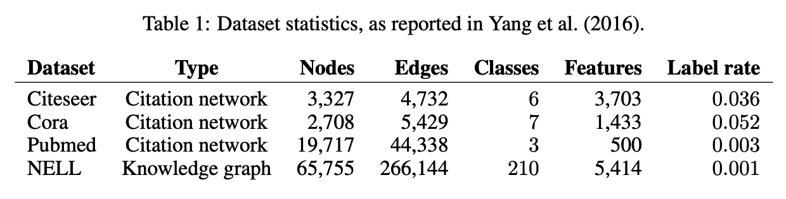
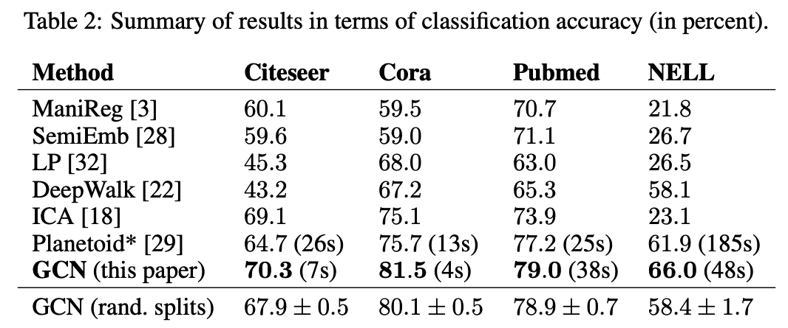
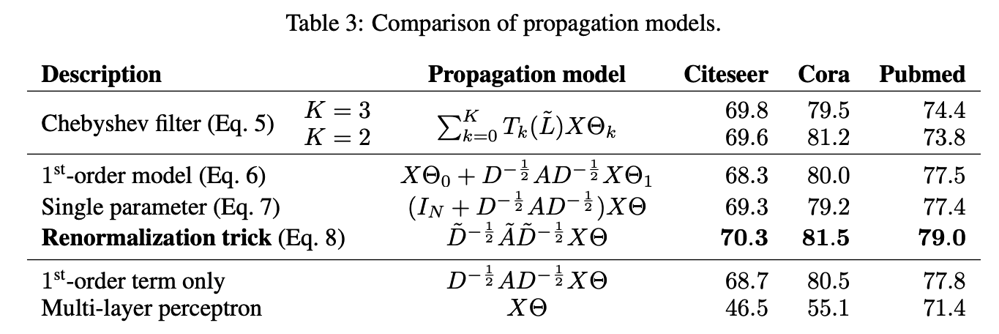
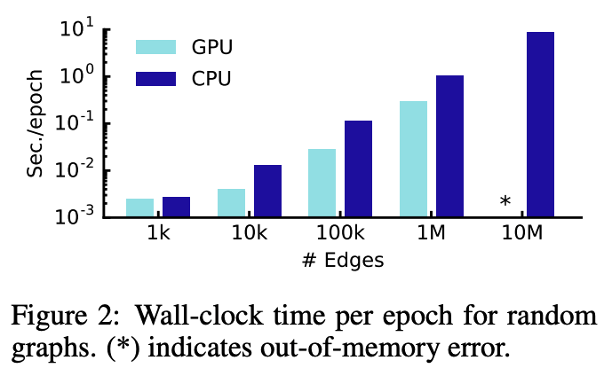

- [x] Round-1: Overview
- [x] Round-2: Model Implementation Details
- [ ] Round-3: Experiments

## Citation


Kipf, T. N., & Welling, M. (2016).  
Semi-Supervised Classification with Graph Convolutional Networks.  
Proceedings of the IEEE/CVF Conference on Computer Vision and Pattern Recognition. (2019)  
https://doi.org/10.48550/arxiv.1609.02907


## Abstract

> We present a scalable approach for semi-supervised learning on graph-structured data that is based on an efficient variant of convolutional neural networks which operate directly on graphs. We motivate the choice of our convolutional architecture via a localized first-order approximation of spectral graph convolutions. Our model scales linearly in the number of graph edges and learns hidden layer representations that encode both local graph structure and features of nodes. In a number of experiments on citation networks and on a knowledge graph dataset we demonstrate that our approach outperforms related methods by a significant margin.

## What's New

- グラフをニューラルネットワークで直接扱えるようなシンプルなプロパゲーションルール（GCN）を提案した．
- GCNをノードのSemi-Supervised Classificationタスクで使用した場合に，速度・スケーラビリティの観点で有用であることを示した．

## Dataset


P. Sen, Galileo Namata, M. Bilgic, L. Getoor, B. Gallagher, Tina Eliassi-Rad. (2008)  
**Collective Classification in Network Data**  
AI Mag.  
[Paper Link](https://www.semanticscholar.org/paper/c5f2f13778af201f486b0b3c4c8f6fcf36d4ca36)  
Influential Citation Count (437), SS-ID (c5f2f13778af201f486b0b3c4c8f6fcf36d4ca36)  

**ABSTRACT**  
Many real-world applications produce networked data such as the world-wide web (hypertext documents connected via hyperlinks), social networks (for example, people connected by friendship links), communication networks (computers connected via communication links) and biological networks (for example, protein interaction networks). A recent focus in machine learning research has been to extend traditional machine learning classification techniques to classify nodes in such networks. In this article, we provide a brief introduction to this area of research and how it has progressed during the past decade. We introduce four of the most widely used inference algorithms for classifying networked data and empirically compare them on both synthetic and real-world data.



P. Sen, Galileo Namata, M. Bilgic, L. Getoor, B. Gallagher, Tina Eliassi-Rad. (2008)  
**Collective Classification in Network Data**  
AI Mag.  
[Paper Link](https://www.semanticscholar.org/paper/c5f2f13778af201f486b0b3c4c8f6fcf36d4ca36)  
Influential Citation Count (437), SS-ID (c5f2f13778af201f486b0b3c4c8f6fcf36d4ca36)  

**ABSTRACT**  
Many real-world applications produce networked data such as the world-wide web (hypertext documents connected via hyperlinks), social networks (for example, people connected by friendship links), communication networks (computers connected via communication links) and biological networks (for example, protein interaction networks). A recent focus in machine learning research has been to extend traditional machine learning classification techniques to classify nodes in such networks. In this article, we provide a brief introduction to this area of research and how it has progressed during the past decade. We introduce four of the most widely used inference algorithms for classifying networked data and empirically compare them on both synthetic and real-world data.



P. Sen, Galileo Namata, M. Bilgic, L. Getoor, B. Gallagher, Tina Eliassi-Rad. (2008)  
**Collective Classification in Network Data**  
AI Mag.  
[Paper Link](https://www.semanticscholar.org/paper/c5f2f13778af201f486b0b3c4c8f6fcf36d4ca36)  
Influential Citation Count (437), SS-ID (c5f2f13778af201f486b0b3c4c8f6fcf36d4ca36)  

**ABSTRACT**  
Many real-world applications produce networked data such as the world-wide web (hypertext documents connected via hyperlinks), social networks (for example, people connected by friendship links), communication networks (computers connected via communication links) and biological networks (for example, protein interaction networks). A recent focus in machine learning research has been to extend traditional machine learning classification techniques to classify nodes in such networks. In this article, we provide a brief introduction to this area of research and how it has progressed during the past decade. We introduce four of the most widely used inference algorithms for classifying networked data and empirically compare them on both synthetic and real-world data.



Andrew Carlson, J. Betteridge, B. Kisiel, Burr Settles, Estevam R. Hruschka, Tom Michael Mitchell. (2010)  
**Toward an Architecture for Never-Ending Language Learning**  
AAAI  
[Paper Link](https://www.semanticscholar.org/paper/f7312b8568d63bbbb239583ed282f46cdc40978d)  
Influential Citation Count (235), SS-ID (f7312b8568d63bbbb239583ed282f46cdc40978d)  

**ABSTRACT**  
We consider here the problem of building a never-ending language learner; that is, an intelligent computer agent that runs forever and that each day must (1) extract, or read, information from the web to populate a growing structured knowledge base, and (2) learn to perform this task better than on the previous day. In particular, we propose an approach and a set of design principles for such an agent, describe a partial implementation of such a system that has already learned to extract a knowledge base containing over 242,000 beliefs with an estimated precision of 74% after running for 67 days, and discuss lessons learned from this preliminary attempt to build a never-ending learning agent.


 

#### Dataset Summary


Zhilin Yang, William W. Cohen, R. Salakhutdinov. (2016)  
**Revisiting Semi-Supervised Learning with Graph Embeddings**  
ICML  
[Paper Link](https://www.semanticscholar.org/paper/3d846cb01f6a975554035d2210b578ca61344b22)  
Influential Citation Count (178), SS-ID (3d846cb01f6a975554035d2210b578ca61344b22)  

**ABSTRACT**  
We present a semi-supervised learning framework based on graph embeddings. Given a graph between instances, we train an embedding for each instance to jointly predict the class label and the neighborhood context in the graph. We develop both transductive and inductive variants of our method. In the transductive variant of our method, the class labels are determined by both the learned embeddings and input feature vectors, while in the inductive variant, the embeddings are defined as a parametric function of the feature vectors, so predictions can be made on instances not seen during training. On a large and diverse set of benchmark tasks, including text classification, distantly supervised entity extraction, and entity classification, we show improved performance over many of the existing models.


## Model Description

### multi-layer Graph Convolutional Network (GCN)

グラフベースのニューラルネットワークモデル $f(X, A)$ に対して,  
（$X \in \mathbb{R}^{N \times N}$ はノードの特徴行列，$A \in \mathbb{R}^{N \times N}$ はグラフ $\mathcal{G}=(\mathcal{V},\mathcal{E}), v_i \in \mathcal{V}, (v_i, v_j) \in \mathcal{E}$ の隣接行列，$D_{ii}=\sum_j A_{ij}$ は次数行列）

$$
\begin{align*}
  H^{(l+1)} &= \sigma \left(\tilde{D}^{-\frac{1}{2}}\tilde{A}\tilde{D}^{-\frac{1}{2}}H^{(l)}W^{(l)}\right)  \\\\
  \text{where} &  \\\\
  &\begin{split}  \\\\
    &\tilde{A} &= A + I_N \\\\
    &\tilde{D}_{ii} &= \sum_j\tilde{A}_{ij} \\\\
    &W^{(l)} &: \text{ layer-specific trainable parameter} \\\\
    &\sigma (\cdot) &: \text{ activation function such as } \text{ReLU}(\cdot) = \max(0, \cdot) \\\\
    &H^{(0)} &= X \\\\
  \end{split} \\\\
  \text{shapes} & \\\\
  &\begin{split} \\\\
    &H^{(l)} &\in \mathbb{R}^{N \times D} \\\\
    &A, D &\in \mathbb{R}^{N \times N} \\\\
    &W^{(l)} &\in \mathbb{R}^{D \times D} \\\\
  \end{split} \\\\
\end{align*}
$$

#### Spectral Graph Convolutions → GCN
以下，グラフの畳み込み演算からGraph Convolutional Network (GCN)

$$
H^{(l+1)} = \sigma \left(\tilde{D}^{-\frac{1}{2}}\tilde{A}\tilde{D}^{-\frac{1}{2}}H^{(l)}W^{(l)}\right)
$$

を導出する．

---

各ノードに対応する特徴ベクトル $x \in \mathbb{R}^N$ とフィルター $g_{\theta} = \text{diag}(\theta), \theta \in \mathbb{R}^N$ のグラフ畳み込み演算を以下のように定義する．

$$
\begin{align*}
  g_{\theta} \star x &= Ug_{\theta}U^{\top}x  \\\\
  \text{where}& \\\\
  &\begin{split}
    &U &: \text{the matrix of eigenvectors of the normalized graph Laplacian (正規化グラフラプラシアン)} \\\\
    &L &= I_N - D^{-\frac{1}{2}}AD^{-\frac{1}{2}} \\\\
      &&= U\Lambda U^{\top} \\\\
    &\Lambda &: \text{対角成分に }L\text{ の固有値を持つ対角行列} \\\\
    (&U^{\top}x &: x\text{ のグラフフーリエ変換})
  \end{split}
\end{align*}
$$

$U$ の計算コストは $\mathcal{O}(N^2)$ であり重いため，Hammond et al. (2009)で提案されている手法を用いてチェビシェフの多項式 $T_k(x)$ により$K$次まで $g_{\theta}(\Lambda)$ を近似する．


D. K. Hammond, P. Vandergheynst, R. Gribonval. (2009)  
**Wavelets on Graphs via Spectral Graph Theory**  
ArXiv  
[Paper Link](https://www.semanticscholar.org/paper/8e8152d46c8ff1070805096c214df7f389c57b80)  
Influential Citation Count (165), SS-ID (8e8152d46c8ff1070805096c214df7f389c57b80)  


$$
\begin{align*}
  g_{{\theta}'}(\Lambda) &\approx \sum_{k=0}^{K}{\theta}'_k T_k(\tilde{\Lambda}) \\\\
  \text{where} & \\\\
  &\begin{split}
    &\tilde{\Lambda} &= \frac{2}{\lambda _{max}}\Lambda - I_N \\\\
    &\lambda _{max} &: \text{the largest eigenvalue of }L \\\\
    &{\theta}' &\in \mathbb{R}^K \\\\
    &T_k(x) &= 2xT_{k-1}(x) - T_{k-2}(x) \\\\
    &T_0(x) &= 1 \\\\
    &T_1(x) &= x
  \end{split}
\end{align*}
$$

したがって，グラフ畳み込み演算はチェビシェフの多項式を用いて以下のように近似することができる．

$$
\begin{align*}
  g_{{\theta}'} \star x &\approx \sum_{k=0}^{K}{\theta}'_k T_k(\tilde{L}) \\\\ 
  \text{where} & \\\\
  &\begin{split}
    &\tilde{L} = \frac{2}{\lambda _{max}}L - I_N \\\\
    &\because (U\Lambda U^{\top})^k = U\Lambda^kU^{\top}
  \end{split}
\end{align*}
$$

この近似の計算コストは $\mathcal{O}(|\mathcal{E}|)$ となり，エッジの数に比例するようになる．  
ここで， $K=1$，$\lambda _{max}=2$ の場合を考える．グラフ畳み込み演算単体としては線形になるが，このレイヤを複数重ねることよってニューラルネットワークから十分な表現力を得ることができると考え，値をこのように固定している．  
このとき，

$$
\begin{align*}
  g_{{\theta}'} \star x &\approx {\theta}'_0x + {\theta}'_1(L-I_N)x \\\\
                        &= \{\theta}'_0x - {\theta}'_1D^{-\frac{1}{2}}AD^{-\frac{1}{2}}x
\end{align*}
$$

となり，上式は ${\theta}'_0$ と ${\theta}'_1$ の2つだけのパラメータに依存するようになる．  
このフィルタパラメータはグラフ全体で共有する．  
さらに，ニューラルネットー枠としては最適化するパラメータの数を減らしたほうが有利になるため，

$$
\theta = {\theta}'_0 = -{\theta}'_1
$$

として，

$$
g_{{\theta}'} \star x \approx \theta(I_N + D^{-\frac{1}{2}}AD^{-\frac{1}{2}})x
$$

を得る．  
ここで，

$$
\begin{align*}
  I_N + D^{-\frac{1}{2}}AD^{-\frac{1}{2}} &= \tilde{D}^{-\frac{1}{2}}\tilde{A}\tilde{D}^{-\frac{1}{2}} \\\\
  \text{where} & \\\\
  &\begin{split}
    &\tilde{A} &= A + I_N \\\\
    &\tilde{D}_{ii} &= \sum_j\tilde{A}_{ij}
  \end{split}
\end{align*}
$$

として行列表現を用いれば，

$$
\begin{align*}
  Z &= \tilde{D}^{-\frac{1}{2}}\tilde{A}\tilde{D}^{-\frac{1}{2}}X\Theta \\\\
  \text{where} & \\\\
  &\begin{split}
    &X &\in \mathbb{R}^{N \times C} \\\\
    &\Theta &\in \mathbb{R}^{C \times F} \\\\
    &N &: \text{the number of nodes} \\\\
    &C &: \text{the number of input channels i.e. C-dimensional feature fector for each node} \\\\
    &F &: \text{the number of filter channels}
  \end{split}
\end{align*}
$$

を得る．
これを複数レイヤ重ねることによって，GCNは

$$
H^{(l+1)} = \sigma \left(\tilde{D}^{-\frac{1}{2}}\tilde{A}\tilde{D}^{-\frac{1}{2}}H^{(l)}W^{(l)}\right)
$$

となる．

## Results

#### Node Classification

#### Evaluation of Propagation Model

#### Training Time per Epoch

## References



Jian Tang, Meng Qu, Mingzhe Wang, Ming Zhang, Jun Yan, Q. Mei. (2015)  
**LINE: Large-scale Information Network Embedding**  
WWW  
[Paper Link](https://www.semanticscholar.org/paper/0834e74304b547c9354b6d7da6fa78ef47a48fa8)  
Influential Citation Count (835), SS-ID (0834e74304b547c9354b6d7da6fa78ef47a48fa8)  

**ABSTRACT**  
This paper studies the problem of embedding very large information networks into low-dimensional vector spaces, which is useful in many tasks such as visualization, node classification, and link prediction. Most existing graph embedding methods do not scale for real world information networks which usually contain millions of nodes. In this paper, we propose a novel network embedding method called the ``LINE,'' which is suitable for arbitrary types of information networks: undirected, directed, and/or weighted. The method optimizes a carefully designed objective function that preserves both the local and global network structures. An edge-sampling algorithm is proposed that addresses the limitation of the classical stochastic gradient descent and improves both the effectiveness and the efficiency of the inference. Empirical experiments prove the effectiveness of the LINE on a variety of real-world information networks, including language networks, social networks, and citation networks. The algorithm is very efficient, which is able to learn the embedding of a network with millions of vertices and billions of edges in a few hours on a typical single machine. The source code of the LINE is available online\footnote{\url{https://github.com/tangjianpku/LINE}}.





W. Zachary. (1977)  
**An Information Flow Model for Conflict and Fission in Small Groups**  
Journal of Anthropological Research  
[Paper Link](https://www.semanticscholar.org/paper/0de728ad1b67221d7a7302f809f987bb926f4504)  
Influential Citation Count (325), SS-ID (0de728ad1b67221d7a7302f809f987bb926f4504)  

**ABSTRACT**  
Data from a voluntary association are used to construct a new formal model for a traditional anthropological problem, fission in small groups. The process leading to fission is viewed as an unequal flow of sentiments and information across the ties in a social network. This flow is unequal because it is uniquely constrained by the contextual range and sensitivity of each relationship in the network. The subsequent differential sharing of sentiments leads to the formation of subgroups with more internal stability than the group as a whole, and results in fission. The Ford-Fulkerson labeling algorithm allows an accurate prediction of membership in the subgroups and of the locus of the fission to be made from measurements of the potential for information flow across each edge in the network. Methods for measurement of potential information flow are discussed, and it is shown that all appropriate techniques will generate the same predictions.





Xiaojin Zhu, Zoubin Ghahramani, J. Lafferty. (2003)  
**Semi-Supervised Learning Using Gaussian Fields and Harmonic Functions**  
ICML  
[Paper Link](https://www.semanticscholar.org/paper/125842668eab7decac136db8a59d392dc5e4e395)  
Influential Citation Count (520), SS-ID (125842668eab7decac136db8a59d392dc5e4e395)  

**ABSTRACT**  
An approach to semi-supervised learning is proposed that is based on a Gaussian random field model. Labeled and unlabeled data are represented as vertices in a weighted graph, with edge weights encoding the similarity between instances. The learning problem is then formulated in terms of a Gaussian random field on this graph, where the mean of the field is characterized in terms of harmonic functions, and is efficiently obtained using matrix methods or belief propagation. The resulting learning algorithms have intimate connections with random walks, electric networks, and spectral graph theory. We discuss methods to incorporate class priors and the predictions of classifiers obtained by supervised learning. We also propose a method of parameter learning by entropy minimization, and show the algorithm's ability to perform feature selection. Promising experimental results are presented for synthetic data, digit classification, and text classification tasks.





James Atwood, D. Towsley. (2015)  
**Diffusion-Convolutional Neural Networks**  
NIPS  
[Paper Link](https://www.semanticscholar.org/paper/18b47b83a373f33d6b902a3615f42c10f7600d72)  
Influential Citation Count (69), SS-ID (18b47b83a373f33d6b902a3615f42c10f7600d72)  

**ABSTRACT**  
We present diffusion-convolutional neural networks (DCNNs), a new model for graph-structured data. Through the introduction of a diffusion-convolution operation, we show how diffusion-based representations can be learned from graph-structured data and used as an effective basis for node classification. DCNNs have several attractive qualities, including a latent representation for graphical data that is invariant under isomorphism, as well as polynomial-time prediction and learning that can be represented as tensor operations and efficiently implemented on the GPU. Through several experiments with real structured datasets, we demonstrate that DCNNs are able to outperform probabilistic relational models and kernel-on-graph methods at relational node classification tasks.





Mikhail Belkin, P. Niyogi, V. Sindhwani. (2006)  
**Manifold Regularization: A Geometric Framework for Learning from Labeled and Unlabeled Examples**  
J. Mach. Learn. Res.  
[Paper Link](https://www.semanticscholar.org/paper/19bb0dce99466077e9bc5a2ad4941607fc28b40c)  
Influential Citation Count (480), SS-ID (19bb0dce99466077e9bc5a2ad4941607fc28b40c)  

**ABSTRACT**  
We propose a family of learning algorithms based on a new form of regularization that allows us to exploit the geometry of the marginal distribution. We focus on a semi-supervised framework that incorporates labeled and unlabeled data in a general-purpose learner. Some transductive graph learning algorithms and standard methods including support vector machines and regularized least squares can be obtained as special cases. We use properties of reproducing kernel Hilbert spaces to prove new Representer theorems that provide theoretical basis for the algorithms. As a result (in contrast to purely graph-based approaches) we obtain a natural out-of-sample extension to novel examples and so are able to handle both transductive and truly semi-supervised settings. We present experimental evidence suggesting that our semi-supervised algorithms are able to use unlabeled data effectively. Finally we have a brief discussion of unsupervised and fully supervised learning within our general framework.





L. V. D. Maaten, Geoffrey E. Hinton. (2008)  
**Visualizing Data using t-SNE**  
  
[Paper Link](https://www.semanticscholar.org/paper/1c46943103bd7b7a2c7be86859995a4144d1938b)  
Influential Citation Count (828), SS-ID (1c46943103bd7b7a2c7be86859995a4144d1938b)  

**ABSTRACT**  
We present a new technique called “t-SNE” that visualizes high-dimensional data by giving each datapoint a location in a two or three-dimensional map. The technique is a variation of Stochastic Neighbor Embedding (Hinton and Roweis, 2002) that is much easier to optimize, and produces significantly better visualizations by reducing the tendency to crowd points together in the center of the map. t-SNE is better than existing techniques at creating a single map that reveals structure at many different scales. This is particularly important for high-dimensional data that lie on several different, but related, low-dimensional manifolds, such as images of objects from multiple classes seen from multiple viewpoints. For visualizing the structure of very large datasets, we show how t-SNE can use random walks on neighborhood graphs to allow the implicit structure of all of the data to influence the way in which a subset of the data is displayed. We illustrate the performance of t-SNE on a wide variety of datasets and compare it with many other non-parametric visualization techniques, including Sammon mapping, Isomap, and Locally Linear Embedding. The visualizations produced by t-SNE are significantly better than those produced by the other techniques on almost all of the datasets.





Kaiming He, X. Zhang, Shaoqing Ren, Jian Sun. (2015)  
**Deep Residual Learning for Image Recognition**  
2016 IEEE Conference on Computer Vision and Pattern Recognition (CVPR)  
[Paper Link](https://www.semanticscholar.org/paper/2c03df8b48bf3fa39054345bafabfeff15bfd11d)  
Influential Citation Count (19570), SS-ID (2c03df8b48bf3fa39054345bafabfeff15bfd11d)  

**ABSTRACT**  
Deeper neural networks are more difficult to train. We present a residual learning framework to ease the training of networks that are substantially deeper than those used previously. We explicitly reformulate the layers as learning residual functions with reference to the layer inputs, instead of learning unreferenced functions. We provide comprehensive empirical evidence showing that these residual networks are easier to optimize, and can gain accuracy from considerably increased depth. On the ImageNet dataset we evaluate residual nets with a depth of up to 152 layers - 8× deeper than VGG nets [40] but still having lower complexity. An ensemble of these residual nets achieves 3.57% error on the ImageNet test set. This result won the 1st place on the ILSVRC 2015 classification task. We also present analysis on CIFAR-10 with 100 and 1000 layers. The depth of representations is of central importance for many visual recognition tasks. Solely due to our extremely deep representations, we obtain a 28% relative improvement on the COCO object detection dataset. Deep residual nets are foundations of our submissions to ILSVRC & COCO 2015 competitions1, where we also won the 1st places on the tasks of ImageNet detection, ImageNet localization, COCO detection, and COCO segmentation.





Nitish Srivastava, Geoffrey E. Hinton, A. Krizhevsky, Ilya Sutskever, R. Salakhutdinov. (2014)  
**Dropout: a simple way to prevent neural networks from overfitting**  
J. Mach. Learn. Res.  
[Paper Link](https://www.semanticscholar.org/paper/34f25a8704614163c4095b3ee2fc969b60de4698)  
Influential Citation Count (2230), SS-ID (34f25a8704614163c4095b3ee2fc969b60de4698)  

**ABSTRACT**  
Deep neural nets with a large number of parameters are very powerful machine learning systems. However, overfitting is a serious problem in such networks. Large networks are also slow to use, making it difficult to deal with overfitting by combining the predictions of many different large neural nets at test time. Dropout is a technique for addressing this problem. The key idea is to randomly drop units (along with their connections) from the neural network during training. This prevents units from co-adapting too much. During training, dropout samples from an exponential number of different "thinned" networks. At test time, it is easy to approximate the effect of averaging the predictions of all these thinned networks by simply using a single unthinned network that has smaller weights. This significantly reduces overfitting and gives major improvements over other regularization methods. We show that dropout improves the performance of neural networks on supervised learning tasks in vision, speech recognition, document classification and computational biology, obtaining state-of-the-art results on many benchmark data sets.





Aditya Grover, J. Leskovec. (2016)  
**node2vec: Scalable Feature Learning for Networks**  
KDD  
[Paper Link](https://www.semanticscholar.org/paper/36ee2c8bd605afd48035d15fdc6b8c8842363376)  
Influential Citation Count (1117), SS-ID (36ee2c8bd605afd48035d15fdc6b8c8842363376)  

**ABSTRACT**  
Prediction tasks over nodes and edges in networks require careful effort in engineering features used by learning algorithms. Recent research in the broader field of representation learning has led to significant progress in automating prediction by learning the features themselves. However, present feature learning approaches are not expressive enough to capture the diversity of connectivity patterns observed in networks. Here we propose node2vec, an algorithmic framework for learning continuous feature representations for nodes in networks. In node2vec, we learn a mapping of nodes to a low-dimensional space of features that maximizes the likelihood of preserving network neighborhoods of nodes. We define a flexible notion of a node's network neighborhood and design a biased random walk procedure, which efficiently explores diverse neighborhoods. Our algorithm generalizes prior work which is based on rigid notions of network neighborhoods, and we argue that the added flexibility in exploring neighborhoods is the key to learning richer representations. We demonstrate the efficacy of node2vec over existing state-of-the-art techniques on multi-label classification and link prediction in several real-world networks from diverse domains. Taken together, our work represents a new way for efficiently learning state-of-the-art task-independent representations in complex networks.





Zhilin Yang, William W. Cohen, R. Salakhutdinov. (2016)  
**Revisiting Semi-Supervised Learning with Graph Embeddings**  
ICML  
[Paper Link](https://www.semanticscholar.org/paper/3d846cb01f6a975554035d2210b578ca61344b22)  
Influential Citation Count (178), SS-ID (3d846cb01f6a975554035d2210b578ca61344b22)  

**ABSTRACT**  
We present a semi-supervised learning framework based on graph embeddings. Given a graph between instances, we train an embedding for each instance to jointly predict the class label and the neighborhood context in the graph. We develop both transductive and inductive variants of our method. In the transductive variant of our method, the class labels are determined by both the learned embeddings and input feature vectors, while in the inductive variant, the embeddings are defined as a parametric function of the feature vectors, so predictions can be made on instances not seen during training. On a large and diverse set of benchmark tasks, including text classification, distantly supervised entity extraction, and entity classification, we show improved performance over many of the existing models.





F. Scarselli, M. Gori, A. Tsoi, M. Hagenbuchner, G. Monfardini. (2009)  
**The Graph Neural Network Model**  
IEEE Transactions on Neural Networks  
[Paper Link](https://www.semanticscholar.org/paper/3efd851140aa28e95221b55fcc5659eea97b172d)  
Influential Citation Count (270), SS-ID (3efd851140aa28e95221b55fcc5659eea97b172d)  

**ABSTRACT**  
Many underlying relationships among data in several areas of science and engineering, e.g., computer vision, molecular chemistry, molecular biology, pattern recognition, and data mining, can be represented in terms of graphs. In this paper, we propose a new neural network model, called graph neural network (GNN) model, that extends existing neural network methods for processing the data represented in graph domains. This GNN model, which can directly process most of the practically useful types of graphs, e.g., acyclic, cyclic, directed, and undirected, implements a function tau(G,n) isin IRm that maps a graph G and one of its nodes n into an m-dimensional Euclidean space. A supervised learning algorithm is derived to estimate the parameters of the proposed GNN model. The computational cost of the proposed algorithm is also considered. Some experimental results are shown to validate the proposed learning algorithm, and to demonstrate its generalization capabilities.





Dengyong Zhou, O. Bousquet, T. N. Lal, J. Weston, B. Schölkopf. (2003)  
**Learning with Local and Global Consistency**  
NIPS  
[Paper Link](https://www.semanticscholar.org/paper/46770a8e7e2af28f5253e5961f709be74e34c1f6)  
Influential Citation Count (601), SS-ID (46770a8e7e2af28f5253e5961f709be74e34c1f6)  

**ABSTRACT**  
We consider the general problem of learning from labeled and unlabeled data, which is often called semi-supervised learning or transductive inference. A principled approach to semi-supervised learning is to design a classifying function which is sufficiently smooth with respect to the intrinsic structure collectively revealed by known labeled and unlabeled points. We present a simple algorithm to obtain such a smooth solution. Our method yields encouraging experimental results on a number of classification problems and demonstrates effective use of unlabeled data.





Yujia Li, Daniel Tarlow, Marc Brockschmidt, R. Zemel. (2015)  
**Gated Graph Sequence Neural Networks**  
ICLR  
[Paper Link](https://www.semanticscholar.org/paper/492f57ee9ceb61fb5a47ad7aebfec1121887a175)  
Influential Citation Count (283), SS-ID (492f57ee9ceb61fb5a47ad7aebfec1121887a175)  

**ABSTRACT**  
Abstract: Graph-structured data appears frequently in domains including chemistry, natural language semantics, social networks, and knowledge bases. In this work, we study feature learning techniques for graph-structured inputs. Our starting point is previous work on Graph Neural Networks (Scarselli et al., 2009), which we modify to use gated recurrent units and modern optimization techniques and then extend to output sequences. The result is a flexible and broadly useful class of neural network models that has favorable inductive biases relative to purely sequence-based models (e.g., LSTMs) when the problem is graph-structured. We demonstrate the capabilities on some simple AI (bAbI) and graph algorithm learning tasks. We then show it achieves state-of-the-art performance on a problem from program verification, in which subgraphs need to be matched to abstract data structures.





D. Shuman, M. Faraji, P. Vandergheynst. (2011)  
**Semi-Supervised Learning with Spectral Graph Wavelets**  
  
[Paper Link](https://www.semanticscholar.org/paper/4a5a12f0ffaad71edd2d77a0fdd134f65d0e90f4)  
Influential Citation Count (2), SS-ID (4a5a12f0ffaad71edd2d77a0fdd134f65d0e90f4)  

**ABSTRACT**  
We consider the transductive learning problem when the labels belong to a continuous space. Through the use of spectral graph wavelets, we explore the benefits of multiresolution analysis on a graph constructed from the labeled and unlabeled data. The spectral graph wavelets behave like discrete multiscale differential operators on graphs, and thus can sparsely approximate piecewise smooth signals. Therefore, rather than enforce a prior belief that the labels are globally smooth with respect to the intrinsic structure of the graph, we enforce sparse priors on the spectral graph wavelet coefficients. One issue that arises when the proportion of data with labels is low is that the fine scale wavelets that are useful in sparsely representing discontinuities are largely masked, making it difficult to recover the high frequency components of the label sequence. We discuss this challenge, and propose one method to use the structured sparsity of the wavelet coefficients to aid label reconstruction.





D. Duvenaud, D. Maclaurin, J. Aguilera-Iparraguirre, R. Gómez-Bombarelli, Timothy D. Hirzel, Alán Aspuru-Guzik, Ryan P. Adams. (2015)  
**Convolutional Networks on Graphs for Learning Molecular Fingerprints**  
NIPS  
[Paper Link](https://www.semanticscholar.org/paper/5d1bfeed240709725c78bc72ea40e55410b373dc)  
Influential Citation Count (148), SS-ID (5d1bfeed240709725c78bc72ea40e55410b373dc)  

**ABSTRACT**  
We introduce a convolutional neural network that operates directly on graphs. These networks allow end-to-end learning of prediction pipelines whose inputs are graphs of arbitrary size and shape. The architecture we present generalizes standard molecular feature extraction methods based on circular fingerprints. We show that these data-driven features are more interpretable, and have better predictive performance on a variety of tasks.





Joan Bruna, Wojciech Zaremba, Arthur D. Szlam, Yann LeCun. (2013)  
**Spectral Networks and Locally Connected Networks on Graphs**  
ICLR  
[Paper Link](https://www.semanticscholar.org/paper/5e925a9f1e20df61d1e860a7aa71894b35a1c186)  
Influential Citation Count (264), SS-ID (5e925a9f1e20df61d1e860a7aa71894b35a1c186)  

**ABSTRACT**  
Convolutional Neural Networks are extremely efficient architectures in image and audio recognition tasks, thanks to their ability to exploit the local translational invariance of signal classes over their domain. In this paper we consider possible generalizations of CNNs to signals defined on more general domains without the action of a translation group. In particular, we propose two constructions, one based upon a hierarchical clustering of the domain, and another based on the spectrum of the graph Laplacian. We show through experiments that for low-dimensional graphs it is possible to learn convolutional layers with a number of parameters independent of the input size, resulting in efficient deep architectures.





T. Joachims. (1999)  
**Transductive Inference for Text Classification using Support Vector Machines**  
ICML  
[Paper Link](https://www.semanticscholar.org/paper/74b1a9e50f18af8a7b9f8dd38f40e0466ad7a8e8)  
Influential Citation Count (421), SS-ID (74b1a9e50f18af8a7b9f8dd38f40e0466ad7a8e8)  

**ABSTRACT**  
This paper introduces Transductive Support Vector Machines (TSVMs) for text classi cation. While regular Support Vector Machines (SVMs) try to induce a general decision function for a learning task, Transductive Support Vector Machines take into account a particular test set and try to minimize misclassi cations of just those particular examples. The paper presents an analysis of why TSVMs are well suited for text classi cation. These theoretical ndings are supported by experiments on three test collections. The experiments show substantial improvements over inductive methods, especially for small training sets, cutting the number of labeled training examples down to a twentieth on some tasks. This work also proposes an algorithm for training TSVMs e ciently, handling 10,000 examples and more.





Mathias Niepert, Mohamed Ahmed, Konstantin Kutzkov. (2016)  
**Learning Convolutional Neural Networks for Graphs**  
ICML  
[Paper Link](https://www.semanticscholar.org/paper/7c6de5a9e02a779e24504619050c6118f4eac181)  
Influential Citation Count (136), SS-ID (7c6de5a9e02a779e24504619050c6118f4eac181)  

**ABSTRACT**  
Numerous important problems can be framed as learning from graph data. We propose a framework for learning convolutional neural networks for arbitrary graphs. These graphs may be undirected, directed, and with both discrete and continuous node and edge attributes. Analogous to image-based convolutional networks that operate on locally connected regions of the input, we present a general approach to extracting locally connected regions from graphs. Using established benchmark data sets, we demonstrate that the learned feature representations are competitive with state of the art graph kernels and that their computation is highly efficient.





J. Weston, F. Ratle, Ronan Collobert. (2008)  
**Deep learning via semi-supervised embedding**  
ICML '08  
[Paper Link](https://www.semanticscholar.org/paper/7ee368e60d0b826e78f965aad8d6c7d406127104)  
Influential Citation Count (51), SS-ID (7ee368e60d0b826e78f965aad8d6c7d406127104)  

**ABSTRACT**  
We show how nonlinear embedding algorithms popular for use with shallow semi-supervised learning techniques such as kernel methods can be applied to deep multilayer architectures, either as a regularizer at the output layer, or on each layer of the architecture. This provides a simple alternative to existing approaches to deep learning whilst yielding competitive error rates compared to those methods, and existing shallow semi-supervised techniques.





Tomas Mikolov, Ilya Sutskever, Kai Chen, G. Corrado, J. Dean. (2013)  
**Distributed Representations of Words and Phrases and their Compositionality**  
NIPS  
[Paper Link](https://www.semanticscholar.org/paper/87f40e6f3022adbc1f1905e3e506abad05a9964f)  
Influential Citation Count (3603), SS-ID (87f40e6f3022adbc1f1905e3e506abad05a9964f)  

**ABSTRACT**  
The recently introduced continuous Skip-gram model is an efficient method for learning high-quality distributed vector representations that capture a large number of precise syntactic and semantic word relationships. In this paper we present several extensions that improve both the quality of the vectors and the training speed. By subsampling of the frequent words we obtain significant speedup and also learn more regular word representations. We also describe a simple alternative to the hierarchical softmax called negative sampling.    An inherent limitation of word representations is their indifference to word order and their inability to represent idiomatic phrases. For example, the meanings of "Canada" and "Air" cannot be easily combined to obtain "Air Canada". Motivated by this example, we present a simple method for finding phrases in text, and show that learning good vector representations for millions of phrases is possible.





D. K. Hammond, P. Vandergheynst, R. Gribonval. (2009)  
**Wavelets on Graphs via Spectral Graph Theory**  
ArXiv  
[Paper Link](https://www.semanticscholar.org/paper/8e8152d46c8ff1070805096c214df7f389c57b80)  
Influential Citation Count (165), SS-ID (8e8152d46c8ff1070805096c214df7f389c57b80)  

**ABSTRACT**  





. (2014)  
**Link-Based Classification**  
Encyclopedia of Social Network Analysis and Mining  
[Paper Link](https://www.semanticscholar.org/paper/91bf323aec3270df0ec8082389119d536c395655)  
Influential Citation Count (48), SS-ID (91bf323aec3270df0ec8082389119d536c395655)  

**ABSTRACT**  





Xinyun Chen. (2016)  
**Under Review as a Conference Paper at Iclr 2017 Delving into Transferable Adversarial Ex- Amples and Black-box Attacks**  
  
[Paper Link](https://www.semanticscholar.org/paper/94e3e7bc3d23276f0ee2d1cb8f9d14aa19668d5f)  
Influential Citation Count (4), SS-ID (94e3e7bc3d23276f0ee2d1cb8f9d14aa19668d5f)  

**ABSTRACT**  
An intriguing property of deep neural networks is the existence of adversarial examples, which can transfer among different architectures. These transferable adversarial examples may severely hinder deep neural network-based applications. Previous works mostly study the transferability using small scale datasets. In this work, we are the first to conduct an extensive study of the transferability over large models and a large scale dataset, and we are also the first to study the transferability of targeted adversarial examples with their target labels. We study both non-targeted and targeted adversarial examples, and show that while transferable non-targeted adversarial examples are easy to find, targeted adversarial examples generated using existing approaches almost never transfer with their target labels. Therefore, we propose novel ensemble-based approaches to generating transferable adversarial examples. Using such approaches, we observe a large proportion of targeted adversarial examples that are able to transfer with their target labels for the first time. We also present some geometric studies to help understanding the transferable adversarial examples. Finally, we show that the adversarial examples generated using ensemble-based approaches can successfully attack Clarifai.com, which is a black-box image classification system.





B. Douglas. (2011)  
**The Weisfeiler-Lehman Method and Graph Isomorphism Testing**  
  
[Paper Link](https://www.semanticscholar.org/paper/9b44a53069dcf4dc10c34e456bf3a5ff160d3ede)  
Influential Citation Count (2), SS-ID (9b44a53069dcf4dc10c34e456bf3a5ff160d3ede)  

**ABSTRACT**  
Properties of the `$k$-equivalent' graph families constructed in Cai, F\"{u}rer and Immerman, and Evdokimov and Ponomarenko are analysed relative the the recursive $k$-dim WL method. An extension to the recursive $k$-dim WL method is presented that is shown to efficiently characterise all such types of `counterexample' graphs, under certain assumptions. These assumptions are shown to hold in all known cases.





M. Gori, G. Monfardini, F. Scarselli. (2005)  
**A new model for learning in graph domains**  
Proceedings. 2005 IEEE International Joint Conference on Neural Networks, 2005.  
[Paper Link](https://www.semanticscholar.org/paper/9ca9f28676ad788d04ba24a51141a9a0a0df4d67)  
Influential Citation Count (63), SS-ID (9ca9f28676ad788d04ba24a51141a9a0a0df4d67)  

**ABSTRACT**  
In several applications the information is naturally represented by graphs. Traditional approaches cope with graphical data structures using a preprocessing phase which transforms the graphs into a set of flat vectors. However, in this way, important topological information may be lost and the achieved results may heavily depend on the preprocessing stage. This paper presents a new neural model, called graph neural network (GNN), capable of directly processing graphs. GNNs extends recursive neural networks and can be applied on most of the practically useful kinds of graphs, including directed, undirected, labelled and cyclic graphs. A learning algorithm for GNNs is proposed and some experiments are discussed which assess the properties of the model.





Diederik P. Kingma, Jimmy Ba. (2014)  
**Adam: A Method for Stochastic Optimization**  
ICLR  
[Paper Link](https://www.semanticscholar.org/paper/a6cb366736791bcccc5c8639de5a8f9636bf87e8)  
Influential Citation Count (14748), SS-ID (a6cb366736791bcccc5c8639de5a8f9636bf87e8)  

**ABSTRACT**  
We introduce Adam, an algorithm for first-order gradient-based optimization of stochastic objective functions, based on adaptive estimates of lower-order moments. The method is straightforward to implement, is computationally efficient, has little memory requirements, is invariant to diagonal rescaling of the gradients, and is well suited for problems that are large in terms of data and/or parameters. The method is also appropriate for non-stationary objectives and problems with very noisy and/or sparse gradients. The hyper-parameters have intuitive interpretations and typically require little tuning. Some connections to related algorithms, on which Adam was inspired, are discussed. We also analyze the theoretical convergence properties of the algorithm and provide a regret bound on the convergence rate that is comparable to the best known results under the online convex optimization framework. Empirical results demonstrate that Adam works well in practice and compares favorably to other stochastic optimization methods. Finally, we discuss AdaMax, a variant of Adam based on the infinity norm.





Xavier Glorot, Yoshua Bengio. (2010)  
**Understanding the difficulty of training deep feedforward neural networks**  
AISTATS  
[Paper Link](https://www.semanticscholar.org/paper/b71ac1e9fb49420d13e084ac67254a0bbd40f83f)  
Influential Citation Count (647), SS-ID (b71ac1e9fb49420d13e084ac67254a0bbd40f83f)  

**ABSTRACT**  
Whereas before 2006 it appears that deep multilayer neural networks were not successfully trained, since then several algorithms have been shown to successfully train them, with experimental results showing the superiority of deeper vs less deep architectures. All these experimental results were obtained with new initialization or training mechanisms. Our objective here is to understand better why standard gradient descent from random initialization is doing so poorly with deep neural networks, to better understand these recent relative successes and help design better algorithms in the future. We first observe the influence of the non-linear activations functions. We find that the logistic sigmoid activation is unsuited for deep networks with random initialization because of its mean value, which can drive especially the top hidden layer into saturation. Surprisingly, we find that saturated units can move out of saturation by themselves, albeit slowly, and explaining the plateaus sometimes seen when training neural networks. We find that a new non-linearity that saturates less can often be beneficial. Finally, we study how activations and gradients vary across layers and during training, with the idea that training may be more difficult when the singular values of the Jacobian associated with each layer are far from 1. Based on these considerations, we propose a new initialization scheme that brings substantially faster convergence. 1 Deep Neural Networks Deep learning methods aim at learning feature hierarchies with features from higher levels of the hierarchy formed by the composition of lower level features. They include Appearing in Proceedings of the 13 International Conference on Artificial Intelligence and Statistics (AISTATS) 2010, Chia Laguna Resort, Sardinia, Italy. Volume 9 of JMLR: WC Weston et al., 2008). Much attention has recently been devoted to them (see (Bengio, 2009) for a review), because of their theoretical appeal, inspiration from biology and human cognition, and because of empirical success in vision (Ranzato et al., 2007; Larochelle et al., 2007; Vincent et al., 2008) and natural language processing (NLP) (Collobert & Weston, 2008; Mnih & Hinton, 2009). Theoretical results reviewed and discussed by Bengio (2009), suggest that in order to learn the kind of complicated functions that can represent high-level abstractions (e.g. in vision, language, and other AI-level tasks), one may need deep architectures. Most of the recent experimental results with deep architecture are obtained with models that can be turned into deep supervised neural networks, but with initialization or training schemes different from the classical feedforward neural networks (Rumelhart et al., 1986). Why are these new algorithms working so much better than the standard random initialization and gradient-based optimization of a supervised training criterion? Part of the answer may be found in recent analyses of the effect of unsupervised pretraining (Erhan et al., 2009), showing that it acts as a regularizer that initializes the parameters in a “better” basin of attraction of the optimization procedure, corresponding to an apparent local minimum associated with better generalization. But earlier work (Bengio et al., 2007) had shown that even a purely supervised but greedy layer-wise procedure would give better results. So here instead of focusing on what unsupervised pre-training or semi-supervised criteria bring to deep architectures, we focus on analyzing what may be going wrong with good old (but deep) multilayer neural networks. Our analysis is driven by investigative experiments to monitor activations (watching for saturation of hidden units) and gradients, across layers and across training iterations. We also evaluate the effects on these of choices of activation function (with the idea that it might affect saturation) and initialization procedure (since unsupervised pretraining is a particular form of initialization and it has a drastic impact).





A. Bosselut, Omer Levy, Ari Holtzman, C. Ennis, D. Fox, Yejin Choi. (2018)  
**Published as a conference paper at ICLR 2018 S IMULATING A CTION D YNAMICS WITH N EURAL P ROCESS N ETWORKS**  
  
[Paper Link](https://www.semanticscholar.org/paper/bcd857d75841aa3e92cd4284a8818aba9f6c0c3f)  
Influential Citation Count (0), SS-ID (bcd857d75841aa3e92cd4284a8818aba9f6c0c3f)  

**ABSTRACT**  
Understanding procedural language requires anticipating the causal effects of actions, even when they are not explicitly stated. In this work, we introduce Neural Process Networks to understand procedural text through (neural) simulation of action dynamics. Our model complements existing memory architectures with dynamic entity tracking by explicitly modeling actions as state transformers. The model updates the states of the entities by executing learned action operators. Empirical results demonstrate that our proposed model can reason about the unstated causal effects of actions, allowing it to provide more accurate contextual information for understanding and generating procedural text, all while offering more interpretable internal representations than existing alternatives.





M. Defferrard, X. Bresson, P. Vandergheynst. (2016)  
**Convolutional Neural Networks on Graphs with Fast Localized Spectral Filtering**  
NIPS  
[Paper Link](https://www.semanticscholar.org/paper/c41eb895616e453dcba1a70c9b942c5063cc656c)  
Influential Citation Count (548), SS-ID (c41eb895616e453dcba1a70c9b942c5063cc656c)  

**ABSTRACT**  
In this work, we are interested in generalizing convolutional neural networks (CNNs) from low-dimensional regular grids, where image, video and speech are represented, to high-dimensional irregular domains, such as social networks, brain connectomes or words' embedding, represented by graphs. We present a formulation of CNNs in the context of spectral graph theory, which provides the necessary mathematical background and efficient numerical schemes to design fast localized convolutional filters on graphs. Importantly, the proposed technique offers the same linear computational complexity and constant learning complexity as classical CNNs, while being universal to any graph structure. Experiments on MNIST and 20NEWS demonstrate the ability of this novel deep learning system to learn local, stationary, and compositional features on graphs.





P. Sen, Galileo Namata, M. Bilgic, L. Getoor, B. Gallagher, Tina Eliassi-Rad. (2008)  
**Collective Classification in Network Data**  
AI Mag.  
[Paper Link](https://www.semanticscholar.org/paper/c5f2f13778af201f486b0b3c4c8f6fcf36d4ca36)  
Influential Citation Count (437), SS-ID (c5f2f13778af201f486b0b3c4c8f6fcf36d4ca36)  

**ABSTRACT**  
Many real-world applications produce networked data such as the world-wide web (hypertext documents connected via hyperlinks), social networks (for example, people connected by friendship links), communication networks (computers connected via communication links) and biological networks (for example, protein interaction networks). A recent focus in machine learning research has been to extend traditional machine learning classification techniques to classify nodes in such networks. In this article, we provide a brief introduction to this area of research and how it has progressed during the past decade. We introduce four of the most widely used inference algorithms for classifying networked data and empirically compare them on both synthetic and real-world data.





Andrew Carlson, J. Betteridge, B. Kisiel, Burr Settles, Estevam R. Hruschka, Tom Michael Mitchell. (2010)  
**Toward an Architecture for Never-Ending Language Learning**  
AAAI  
[Paper Link](https://www.semanticscholar.org/paper/f7312b8568d63bbbb239583ed282f46cdc40978d)  
Influential Citation Count (235), SS-ID (f7312b8568d63bbbb239583ed282f46cdc40978d)  

**ABSTRACT**  
We consider here the problem of building a never-ending language learner; that is, an intelligent computer agent that runs forever and that each day must (1) extract, or read, information from the web to populate a growing structured knowledge base, and (2) learn to perform this task better than on the previous day. In particular, we propose an approach and a set of design principles for such an agent, describe a partial implementation of such a system that has already learned to extract a knowledge base containing over 242,000 beliefs with an estimated precision of 74% after running for 67 days, and discuss lessons learned from this preliminary attempt to build a never-ending learning agent.





U. Brandes, D. Delling, M. Gaertler, Robert Görke, M. Hoefer, Z. Nikoloski, D. Wagner. (2008)  
**On Modularity Clustering**  
IEEE Transactions on Knowledge and Data Engineering  
[Paper Link](https://www.semanticscholar.org/paper/f99939c9c396de3ba12b3326c50dca00dab4060d)  
Influential Citation Count (71), SS-ID (f99939c9c396de3ba12b3326c50dca00dab4060d)  

**ABSTRACT**  
Modularity is a recently introduced quality measure for graph clusterings. It has immediately received considerable attention in several disciplines, particularly in the complex systems literature, although its properties are not well understood. We study the problem of finding clusterings with maximum modularity, thus providing theoretical foundations for past and present work based on this measure. More precisely, we prove the conjectured hardness of maximizing modularity both in the general case and with the restriction to cuts and give an Integer Linear Programming formulation. This is complemented by first insights into the behavior and performance of the commonly applied greedy agglomerative approach.





Bryan Perozzi, Rami Al-Rfou, S. Skiena. (2014)  
**DeepWalk: online learning of social representations**  
KDD  
[Paper Link](https://www.semanticscholar.org/paper/fff114cbba4f3ba900f33da574283e3de7f26c83)  
Influential Citation Count (1340), SS-ID (fff114cbba4f3ba900f33da574283e3de7f26c83)  

**ABSTRACT**  
We present DeepWalk, a novel approach for learning latent representations of vertices in a network. These latent representations encode social relations in a continuous vector space, which is easily exploited by statistical models. DeepWalk generalizes recent advancements in language modeling and unsupervised feature learning (or deep learning) from sequences of words to graphs. DeepWalk uses local information obtained from truncated random walks to learn latent representations by treating walks as the equivalent of sentences. We demonstrate DeepWalk's latent representations on several multi-label network classification tasks for social networks such as BlogCatalog, Flickr, and YouTube. Our results show that DeepWalk outperforms challenging baselines which are allowed a global view of the network, especially in the presence of missing information. DeepWalk's representations can provide F1 scores up to 10% higher than competing methods when labeled data is sparse. In some experiments, DeepWalk's representations are able to outperform all baseline methods while using 60% less training data. DeepWalk is also scalable. It is an online learning algorithm which builds useful incremental results, and is trivially parallelizable. These qualities make it suitable for a broad class of real world applications such as network classification, and anomaly detection.



