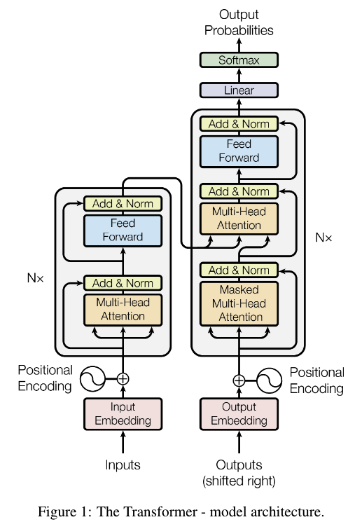
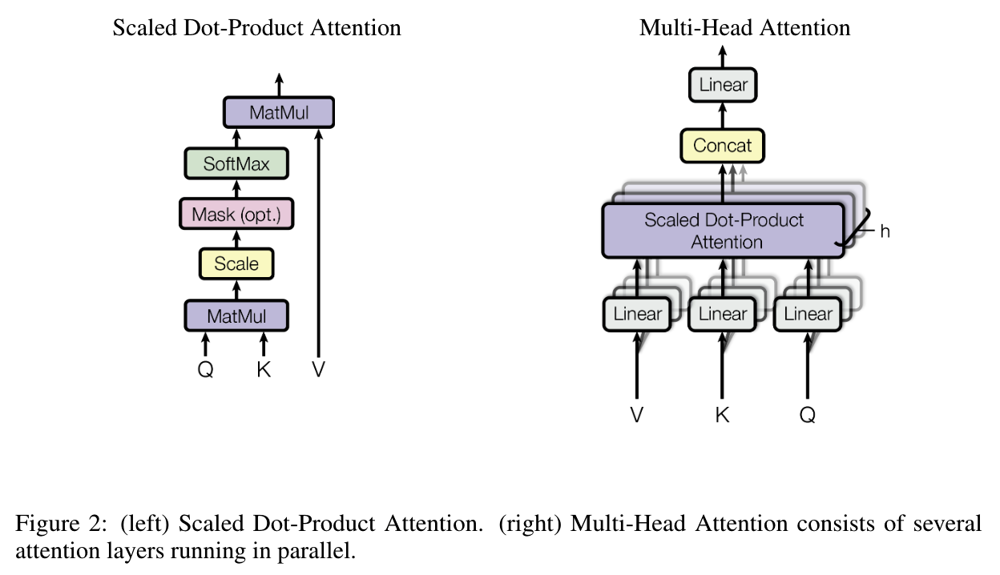
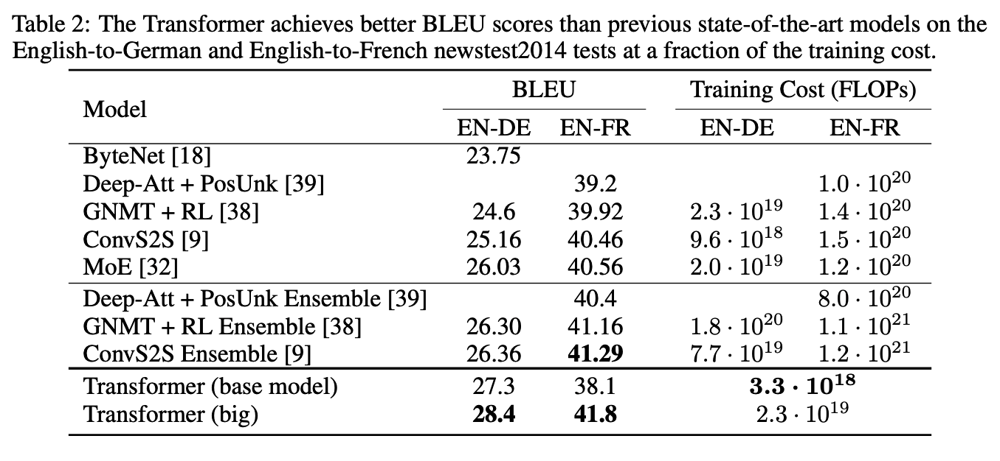
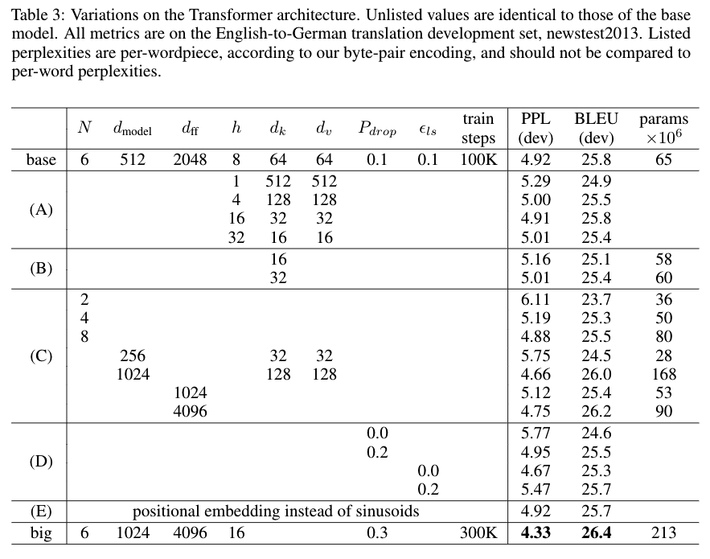

- [x] Round-1: Overview
- [ ] Round-2: Model Implementation Details
- [ ] Round-3: Experiments

## Citation


Vaswani, A., Shazeer, N., Parmar, N., Uszkoreit, J., Jones, L., Gomez, A. N., Kaiser, Ł., & Polosukhin, I. (2017).  
Attention is all you need.  
Advances in Neural Information Processing Systems, 2017-Decem, 5999–6009.  
http://arxiv.org/abs/1706.03762


## Abstract

> The dominant sequence transduction models are based on complex recurrent or convolutional neural networks in an encoder-decoder configuration. The best performing models also connect the encoder and decoder through an attention mechanism. We propose a new simple network architecture, the Transformer, based solely on attention mechanisms, dispensing with recurrence and convolutions entirely. Experiments on two machine translation tasks show these models to be superior in quality while being more parallelizable and requiring significantly less time to train. Our model achieves 28.4 BLEU on the WMT 2014 English-to-German translation task, improving over the existing best results, including ensembles by over 2 BLEU. On the WMT 2014 English-to-French translation task, our model establishes a new single-model state-of-the-art BLEU score of 41.8 after training for 3.5 days on eight GPUs, a small fraction of the training costs of the best models from the literature. We show that the Transformer generalizes well to other tasks by applying it successfully to English constituency parsing both with large and limited training data.

## Background & Wat's New

## Dataset


ACL 2014 NINTH WORKSHOP ON STATISTICAL MACHINE TRANSLATION  
26-27 June 2014  
Baltimore, USA  
https://www.statmt.org/wmt14/index.html


## Model Description


#### Encoder and Decoder Stacks
- Input
  - $n$ 個のトークンの列 $(x_1, \ldots, x_n)$ をEmbeddingしたベクトル $\textbf{z} = (z_1, \ldots, z_n)$
- Output
  - $m$ 個のトークンの列(確率) $(y_1, \ldots, y_m)$
- Encoder
  - $N=6$
  - Residual + Layer Normalization → $\text{LayerNorm}(x+\text{SubLayer}(x))$
- Decoder
  - $N=6$
---



#### Attention

$$
\begin{align*}
  \text{Attention}(Q,K,V) = \text{softmax}\left(\frac{QK^{\top}}{\sqrt{d_k}}\right)V
\end{align*}
$$
## Results

#### Machine Translation on WMT 2014

#### Model Variations
 

## References



Romain Paulus, Caiming Xiong, R. Socher. (2017)  
**A Deep Reinforced Model for Abstractive Summarization**  
ICLR  
[Paper Link](https://www.semanticscholar.org/paper/032274e57f7d8b456bd255fe76b909b2c1d7458e)  
Influential Citation Count (163), SS-ID (032274e57f7d8b456bd255fe76b909b2c1d7458e)  

**ABSTRACT**  
Attentional, RNN-based encoder-decoder models for abstractive summarization have achieved good performance on short input and output sequences. For longer documents and summaries however these models often include repetitive and incoherent phrases. We introduce a neural network model with a novel intra-attention that attends over the input and continuously generated output separately, and a new training method that combines standard supervised word prediction and reinforcement learning (RL). Models trained only with supervised learning often exhibit "exposure bias" - they assume ground truth is provided at each step during training. However, when standard word prediction is combined with the global sequence prediction training of RL the resulting summaries become more readable. We evaluate this model on the CNN/Daily Mail and New York Times datasets. Our model obtains a 41.16 ROUGE-1 score on the CNN/Daily Mail dataset, an improvement over previous state-of-the-art models. Human evaluation also shows that our model produces higher quality summaries.





M. Marcus, Beatrice Santorini, Mary Ann Marcinkiewicz. (1993)  
**Building a Large Annotated Corpus of English: The Penn Treebank**  
CL  
[Paper Link](https://www.semanticscholar.org/paper/0b44fcbeea9415d400c5f5789d6b892b6f98daff)  
Influential Citation Count (1350), SS-ID (0b44fcbeea9415d400c5f5789d6b892b6f98daff)  

**ABSTRACT**  
Abstract : As a result of this grant, the researchers have now published oil CDROM a corpus of over 4 million words of running text annotated with part-of- speech (POS) tags, with over 3 million words of that material assigned skeletal grammatical structure. This material now includes a fully hand-parsed version of the classic Brown corpus. About one half of the papers at the ACL Workshop on Using Large Text Corpora this past summer were based on the materials generated by this grant.





Kyunghyun Cho, Bart van Merrienboer, Çaglar Gülçehre, Dzmitry Bahdanau, Fethi Bougares, Holger Schwenk, Yoshua Bengio. (2014)  
**Learning Phrase Representations using RNN Encoder–Decoder for Statistical Machine Translation**  
EMNLP  
[Paper Link](https://www.semanticscholar.org/paper/0b544dfe355a5070b60986319a3f51fb45d1348e)  
Influential Citation Count (2601), SS-ID (0b544dfe355a5070b60986319a3f51fb45d1348e)  

**ABSTRACT**  
In this paper, we propose a novel neural network model called RNN Encoder‐ Decoder that consists of two recurrent neural networks (RNN). One RNN encodes a sequence of symbols into a fixedlength vector representation, and the other decodes the representation into another sequence of symbols. The encoder and decoder of the proposed model are jointly trained to maximize the conditional probability of a target sequence given a source sequence. The performance of a statistical machine translation system is empirically found to improve by using the conditional probabilities of phrase pairs computed by the RNN Encoder‐Decoder as an additional feature in the existing log-linear model. Qualitatively, we show that the proposed model learns a semantically and syntactically meaningful representation of linguistic phrases.





Yoon Kim, Carl Denton, Luong Hoang, Alexander M. Rush. (2017)  
**Structured Attention Networks**  
ICLR  
[Paper Link](https://www.semanticscholar.org/paper/13d9323a8716131911bfda048a40e2cde1a76a46)  
Influential Citation Count (26), SS-ID (13d9323a8716131911bfda048a40e2cde1a76a46)  

**ABSTRACT**  
Attention networks have proven to be an effective approach for embedding categorical inference within a deep neural network. However, for many tasks we may want to model richer structural dependencies without abandoning end-to-end training. In this work, we experiment with incorporating richer structural distributions, encoded using graphical models, within deep networks. We show that these structured attention networks are simple extensions of the basic attention procedure, and that they allow for extending attention beyond the standard soft-selection approach, such as attending to partial segmentations or to subtrees. We experiment with two different classes of structured attention networks: a linear-chain conditional random field and a graph-based parsing model, and describe how these models can be practically implemented as neural network layers. Experiments show that this approach is effective for incorporating structural biases, and structured attention networks outperform baseline attention models on a variety of synthetic and real tasks: tree transduction, neural machine translation, question answering, and natural language inference. We further find that models trained in this way learn interesting unsupervised hidden representations that generalize simple attention.





Jianpeng Cheng, Li Dong, Mirella Lapata. (2016)  
**Long Short-Term Memory-Networks for Machine Reading**  
EMNLP  
[Paper Link](https://www.semanticscholar.org/paper/13fe71da009484f240c46f14d9330e932f8de210)  
Influential Citation Count (59), SS-ID (13fe71da009484f240c46f14d9330e932f8de210)  

**ABSTRACT**  
In this paper we address the question of how to render sequence-level networks better at handling structured input. We propose a machine reading simulator which processes text incrementally from left to right and performs shallow reasoning with memory and attention. The reader extends the Long Short-Term Memory architecture with a memory network in place of a single memory cell. This enables adaptive memory usage during recurrence with neural attention, offering a way to weakly induce relations among tokens. The system is initially designed to process a single sequence but we also demonstrate how to integrate it with an encoder-decoder architecture. Experiments on language modeling, sentiment analysis, and natural language inference show that our model matches or outperforms the state of the art.





Muhua Zhu, Yue Zhang, Wenliang Chen, Min Zhang, Jingbo Zhu. (2013)  
**Fast and Accurate Shift-Reduce Constituent Parsing**  
ACL  
[Paper Link](https://www.semanticscholar.org/paper/174bbdb96252454cbb40a9c4e53335996235a008)  
Influential Citation Count (25), SS-ID (174bbdb96252454cbb40a9c4e53335996235a008)  

**ABSTRACT**  
Shift-reduce dependency parsers give comparable accuracies to their chartbased counterparts, yet the best shiftreduce constituent parsers still lag behind the state-of-the-art. One important reason is the existence of unary nodes in phrase structure trees, which leads to different numbers of shift-reduce actions between different outputs for the same input. This turns out to have a large empirical impact on the framework of global training and beam search. We propose a simple yet effective extension to the shift-reduce process, which eliminates size differences between action sequences in beam-search. Our parser gives comparable accuracies to the state-of-the-art chart parsers. With linear run-time complexity, our parser is over an order of magnitude faster than the fastest chart parser.





Rico Sennrich, B. Haddow, Alexandra Birch. (2015)  
**Neural Machine Translation of Rare Words with Subword Units**  
ACL  
[Paper Link](https://www.semanticscholar.org/paper/1af68821518f03568f913ab03fc02080247a27ff)  
Influential Citation Count (836), SS-ID (1af68821518f03568f913ab03fc02080247a27ff)  

**ABSTRACT**  
Neural machine translation (NMT) models typically operate with a fixed vocabulary, but translation is an open-vocabulary problem. Previous work addresses the translation of out-of-vocabulary words by backing off to a dictionary. In this paper, we introduce a simpler and more effective approach, making the NMT model capable of open-vocabulary translation by encoding rare and unknown words as sequences of subword units. This is based on the intuition that various word classes are translatable via smaller units than words, for instance names (via character copying or transliteration), compounds (via compositional translation), and cognates and loanwords (via phonological and morphological transformations). We discuss the suitability of different word segmentation techniques, including simple character n-gram models and a segmentation based on the byte pair encoding compression algorithm, and empirically show that subword models improve over a back-off dictionary baseline for the WMT 15 translation tasks English-German and English-Russian by 1.1 and 1.3 BLEU, respectively.





Zhouhan Lin, Minwei Feng, C. D. Santos, Mo Yu, Bing Xiang, Bowen Zhou, Yoshua Bengio. (2017)  
**A Structured Self-attentive Sentence Embedding**  
ICLR  
[Paper Link](https://www.semanticscholar.org/paper/204a4a70428f3938d2c538a4d74c7ae0416306d8)  
Influential Citation Count (148), SS-ID (204a4a70428f3938d2c538a4d74c7ae0416306d8)  

**ABSTRACT**  
This paper proposes a new model for extracting an interpretable sentence embedding by introducing self-attention. Instead of using a vector, we use a 2-D matrix to represent the embedding, with each row of the matrix attending on a different part of the sentence. We also propose a self-attention mechanism and a special regularization term for the model. As a side effect, the embedding comes with an easy way of visualizing what specific parts of the sentence are encoded into the embedding. We evaluate our model on 3 different tasks: author profiling, sentiment classification, and textual entailment. Results show that our model yields a significant performance gain compared to other sentence embedding methods in all of the 3 tasks.





Christian Szegedy, Vincent Vanhoucke, S. Ioffe, Jonathon Shlens, Z. Wojna. (2015)  
**Rethinking the Inception Architecture for Computer Vision**  
2016 IEEE Conference on Computer Vision and Pattern Recognition (CVPR)  
[Paper Link](https://www.semanticscholar.org/paper/23ffaa0fe06eae05817f527a47ac3291077f9e58)  
Influential Citation Count (2198), SS-ID (23ffaa0fe06eae05817f527a47ac3291077f9e58)  

**ABSTRACT**  
Convolutional networks are at the core of most state of-the-art computer vision solutions for a wide variety of tasks. Since 2014 very deep convolutional networks started to become mainstream, yielding substantial gains in various benchmarks. Although increased model size and computational cost tend to translate to immediate quality gains for most tasks (as long as enough labeled data is provided for training), computational efficiency and low parameter count are still enabling factors for various use cases such as mobile vision and big-data scenarios. Here we are exploring ways to scale up networks in ways that aim at utilizing the added computation as efficiently as possible by suitably factorized convolutions and aggressive regularization. We benchmark our methods on the ILSVRC 2012 classification challenge validation set demonstrate substantial gains over the state of the art: 21:2% top-1 and 5:6% top-5 error for single frame evaluation using a network with a computational cost of 5 billion multiply-adds per inference and with using less than 25 million parameters. With an ensemble of 4 models and multi-crop evaluation, we report 3:5% top-5 error and 17:3% top-1 error on the validation set and 3:6% top-5 error on the official test set.





Kaiming He, X. Zhang, Shaoqing Ren, Jian Sun. (2015)  
**Deep Residual Learning for Image Recognition**  
2016 IEEE Conference on Computer Vision and Pattern Recognition (CVPR)  
[Paper Link](https://www.semanticscholar.org/paper/2c03df8b48bf3fa39054345bafabfeff15bfd11d)  
Influential Citation Count (19695), SS-ID (2c03df8b48bf3fa39054345bafabfeff15bfd11d)  

**ABSTRACT**  
Deeper neural networks are more difficult to train. We present a residual learning framework to ease the training of networks that are substantially deeper than those used previously. We explicitly reformulate the layers as learning residual functions with reference to the layer inputs, instead of learning unreferenced functions. We provide comprehensive empirical evidence showing that these residual networks are easier to optimize, and can gain accuracy from considerably increased depth. On the ImageNet dataset we evaluate residual nets with a depth of up to 152 layers - 8× deeper than VGG nets [40] but still having lower complexity. An ensemble of these residual nets achieves 3.57% error on the ImageNet test set. This result won the 1st place on the ILSVRC 2015 classification task. We also present analysis on CIFAR-10 with 100 and 1000 layers. The depth of representations is of central importance for many visual recognition tasks. Solely due to our extremely deep representations, we obtain a 28% relative improvement on the COCO object detection dataset. Deep residual nets are foundations of our submissions to ILSVRC & COCO 2015 competitions1, where we also won the 1st places on the tasks of ImageNet detection, ImageNet localization, COCO detection, and COCO segmentation.





R. Józefowicz, Oriol Vinyals, M. Schuster, Noam M. Shazeer, Yonghui Wu. (2016)  
**Exploring the Limits of Language Modeling**  
ArXiv  
[Paper Link](https://www.semanticscholar.org/paper/2f2d8f8072e5cc9b296fad551f65f183bdbff7aa)  
Influential Citation Count (117), SS-ID (2f2d8f8072e5cc9b296fad551f65f183bdbff7aa)  

**ABSTRACT**  
In this work we explore recent advances in Recurrent Neural Networks for large scale Language Modeling, a task central to language understanding. We extend current models to deal with two key challenges present in this task: corpora and vocabulary sizes, and complex, long term structure of language. We perform an exhaustive study on techniques such as character Convolutional Neural Networks or Long-Short Term Memory, on the One Billion Word Benchmark. Our best single model significantly improves state-of-the-art perplexity from 51.3 down to 30.0 (whilst reducing the number of parameters by a factor of 20), while an ensemble of models sets a new record by improving perplexity from 41.0 down to 23.7. We also release these models for the NLP and ML community to study and improve upon.





Nitish Srivastava, Geoffrey E. Hinton, A. Krizhevsky, Ilya Sutskever, R. Salakhutdinov. (2014)  
**Dropout: a simple way to prevent neural networks from overfitting**  
J. Mach. Learn. Res.  
[Paper Link](https://www.semanticscholar.org/paper/34f25a8704614163c4095b3ee2fc969b60de4698)  
Influential Citation Count (2236), SS-ID (34f25a8704614163c4095b3ee2fc969b60de4698)  

**ABSTRACT**  
Deep neural nets with a large number of parameters are very powerful machine learning systems. However, overfitting is a serious problem in such networks. Large networks are also slow to use, making it difficult to deal with overfitting by combining the predictions of many different large neural nets at test time. Dropout is a technique for addressing this problem. The key idea is to randomly drop units (along with their connections) from the neural network during training. This prevents units from co-adapting too much. During training, dropout samples from an exponential number of different "thinned" networks. At test time, it is easy to approximate the effect of averaging the predictions of all these thinned networks by simply using a single unthinned network that has smaller weights. This significantly reduces overfitting and gives major improvements over other regularization methods. We show that dropout improves the performance of neural networks on supervised learning tasks in vision, speech recognition, document classification and computational biology, obtaining state-of-the-art results on many benchmark data sets.





Jonas Gehring, Michael Auli, David Grangier, Denis Yarats, Yann Dauphin. (2017)  
**Convolutional Sequence to Sequence Learning**  
ICML  
[Paper Link](https://www.semanticscholar.org/paper/43428880d75b3a14257c3ee9bda054e61eb869c0)  
Influential Citation Count (296), SS-ID (43428880d75b3a14257c3ee9bda054e61eb869c0)  

**ABSTRACT**  
The prevalent approach to sequence to sequence learning maps an input sequence to a variable length output sequence via recurrent neural networks. We introduce an architecture based entirely on convolutional neural networks. Compared to recurrent models, computations over all elements can be fully parallelized during training and optimization is easier since the number of non-linearities is fixed and independent of the input length. Our use of gated linear units eases gradient propagation and we equip each decoder layer with a separate attention module. We outperform the accuracy of the deep LSTM setup of Wu et al. (2016) on both WMT'14 English-German and WMT'14 English-French translation at an order of magnitude faster speed, both on GPU and CPU.





S. Hochreiter, J. Schmidhuber. (1997)  
**Long Short-Term Memory**  
Neural Computation  
[Paper Link](https://www.semanticscholar.org/paper/44d2abe2175df8153f465f6c39b68b76a0d40ab9)  
Influential Citation Count (8600), SS-ID (44d2abe2175df8153f465f6c39b68b76a0d40ab9)  

**ABSTRACT**  
Learning to store information over extended time intervals by recurrent backpropagation takes a very long time, mostly because of insufficient, decaying error backflow. We briefly review Hochreiter's (1991) analysis of this problem, then address it by introducing a novel, efficient, gradient based method called long short-term memory (LSTM). Truncating the gradient where this does not do harm, LSTM can learn to bridge minimal time lags in excess of 1000 discrete-time steps by enforcing constant error flow through constant error carousels within special units. Multiplicative gate units learn to open and close access to the constant error flow. LSTM is local in space and time; its computational complexity per time step and weight is O. 1. Our experiments with artificial data involve local, distributed, real-valued, and noisy pattern representations. In comparisons with real-time recurrent learning, back propagation through time, recurrent cascade correlation, Elman nets, and neural sequence chunking, LSTM leads to many more successful runs, and learns much faster. LSTM also solves complex, artificial long-time-lag tasks that have never been solved by previous recurrent network algorithms.





D. Britz, Anna Goldie, Minh-Thang Luong, Quoc V. Le. (2017)  
**Massive Exploration of Neural Machine Translation Architectures**  
EMNLP 2017  
[Paper Link](https://www.semanticscholar.org/paper/4550a4c714920ef57d19878e31c9ebae37b049b2)  
Influential Citation Count (31), SS-ID (4550a4c714920ef57d19878e31c9ebae37b049b2)  

**ABSTRACT**  
Neural Machine Translation (NMT) has shown remarkable progress over the past few years, with production systems now being deployed to end-users. As the field is moving rapidly, it has become unclear which elements of NMT architectures have a significant impact on translation quality. In this work, we present a large-scale analysis of the sensitivity of NMT architectures to common hyperparameters. We report empirical results and variance numbers for several hundred experimental runs, corresponding to over 250,000 GPU hours on a WMT English to German translation task. Our experiments provide practical insights into the relative importance of factors such as embedding size, network depth, RNN cell type, residual connections, attention mechanism, and decoding heuristics. As part of this contribution, we also release an open-source NMT framework in TensorFlow to make it easy for others to reproduce our results and perform their own experiments.





Oriol Vinyals, Lukasz Kaiser, Terry Koo, Slav Petrov, Ilya Sutskever, Geoffrey E. Hinton. (2014)  
**Grammar as a Foreign Language**  
NIPS  
[Paper Link](https://www.semanticscholar.org/paper/47570e7f63e296f224a0e7f9a0d08b0de3cbaf40)  
Influential Citation Count (95), SS-ID (47570e7f63e296f224a0e7f9a0d08b0de3cbaf40)  

**ABSTRACT**  
Syntactic constituency parsing is a fundamental problem in natural language processing and has been the subject of intensive research and engineering for decades. As a result, the most accurate parsers are domain specific, complex, and inefficient. In this paper we show that the domain agnostic attention-enhanced sequence-to-sequence model achieves state-of-the-art results on the most widely used syntactic constituency parsing dataset, when trained on a large synthetic corpus that was annotated using existing parsers. It also matches the performance of standard parsers when trained only on a small human-annotated dataset, which shows that this model is highly data-efficient, in contrast to sequence-to-sequence models without the attention mechanism. Our parser is also fast, processing over a hundred sentences per second with an unoptimized CPU implementation.





Sainbayar Sukhbaatar, Arthur D. Szlam, J. Weston, R. Fergus. (2015)  
**End-To-End Memory Networks**  
NIPS  
[Paper Link](https://www.semanticscholar.org/paper/4f10b9f47c5bb6b54dd4f5ca8d9fa2c0bbd7ec5e)  
Influential Citation Count (232), SS-ID (4f10b9f47c5bb6b54dd4f5ca8d9fa2c0bbd7ec5e)  

**ABSTRACT**  
We introduce a neural network with a recurrent attention model over a possibly large external memory. The architecture is a form of Memory Network [23] but unlike the model in that work, it is trained end-to-end, and hence requires significantly less supervision during training, making it more generally applicable in realistic settings. It can also be seen as an extension of RNNsearch [2] to the case where multiple computational steps (hops) are performed per output symbol. The flexibility of the model allows us to apply it to tasks as diverse as (synthetic) question answering [22] and to language modeling. For the former our approach is competitive with Memory Networks, but with less supervision. For the latter, on the Penn TreeBank and Text8 datasets our approach demonstrates comparable performance to RNNs and LSTMs. In both cases we show that the key concept of multiple computational hops yields improved results.





Noam M. Shazeer, Azalia Mirhoseini, Krzysztof Maziarz, Andy Davis, Quoc V. Le, Geoffrey E. Hinton, J. Dean. (2017)  
**Outrageously Large Neural Networks: The Sparsely-Gated Mixture-of-Experts Layer**  
ICLR  
[Paper Link](https://www.semanticscholar.org/paper/510e26733aaff585d65701b9f1be7ca9d5afc586)  
Influential Citation Count (72), SS-ID (510e26733aaff585d65701b9f1be7ca9d5afc586)  

**ABSTRACT**  
The capacity of a neural network to absorb information is limited by its number of parameters. Conditional computation, where parts of the network are active on a per-example basis, has been proposed in theory as a way of dramatically increasing model capacity without a proportional increase in computation. In practice, however, there are significant algorithmic and performance challenges. In this work, we address these challenges and finally realize the promise of conditional computation, achieving greater than 1000x improvements in model capacity with only minor losses in computational efficiency on modern GPU clusters. We introduce a Sparsely-Gated Mixture-of-Experts layer (MoE), consisting of up to thousands of feed-forward sub-networks. A trainable gating network determines a sparse combination of these experts to use for each example. We apply the MoE to the tasks of language modeling and machine translation, where model capacity is critical for absorbing the vast quantities of knowledge available in the training corpora. We present model architectures in which a MoE with up to 137 billion parameters is applied convolutionally between stacked LSTM layers. On large language modeling and machine translation benchmarks, these models achieve significantly better results than state-of-the-art at lower computational cost.





François Chollet. (2016)  
**Xception: Deep Learning with Depthwise Separable Convolutions**  
2017 IEEE Conference on Computer Vision and Pattern Recognition (CVPR)  
[Paper Link](https://www.semanticscholar.org/paper/5b6ec746d309b165f9f9def873a2375b6fb40f3d)  
Influential Citation Count (1017), SS-ID (5b6ec746d309b165f9f9def873a2375b6fb40f3d)  

**ABSTRACT**  
We present an interpretation of Inception modules in convolutional neural networks as being an intermediate step in-between regular convolution and the depthwise separable convolution operation (a depthwise convolution followed by a pointwise convolution). In this light, a depthwise separable convolution can be understood as an Inception module with a maximally large number of towers. This observation leads us to propose a novel deep convolutional neural network architecture inspired by Inception, where Inception modules have been replaced with depthwise separable convolutions. We show that this architecture, dubbed Xception, slightly outperforms Inception V3 on the ImageNet dataset (which Inception V3 was designed for), and significantly outperforms Inception V3 on a larger image classification dataset comprising 350 million images and 17,000 classes. Since the Xception architecture has the same number of parameters as Inception V3, the performance gains are not due to increased capacity but rather to a more efficient use of model parameters.





Zhongqiang Huang, M. Harper. (2009)  
**Self-Training PCFG Grammars with Latent Annotations Across Languages**  
EMNLP  
[Paper Link](https://www.semanticscholar.org/paper/5bfd8d40bc071fffaf93685a46974b122ee4239d)  
Influential Citation Count (7), SS-ID (5bfd8d40bc071fffaf93685a46974b122ee4239d)  

**ABSTRACT**  
We investigate the effectiveness of self-training PCFG grammars with latent annotations (PCFG-LA) for parsing languages with different amounts of labeled training data. Compared to Charniak's lexicalized parser, the PCFG-LA parser was more effectively adapted to a language for which parsing has been less well developed (i.e., Chinese) and benefited more from self-training. We show for the first time that self-training is able to significantly improve the performance of the PCFG-LA parser, a single generative parser, on both small and large amounts of labeled training data. Our approach achieves state-of-the-art parsing accuracies for a single parser on both English (91.5%) and Chinese (85.2%).





Lukasz Kaiser, Ilya Sutskever. (2015)  
**Neural GPUs Learn Algorithms**  
ICLR  
[Paper Link](https://www.semanticscholar.org/paper/5e4eb58d5b47ac1c73f4cf189497170e75ae6237)  
Influential Citation Count (29), SS-ID (5e4eb58d5b47ac1c73f4cf189497170e75ae6237)  

**ABSTRACT**  
Learning an algorithm from examples is a fundamental problem that has been widely studied. Recently it has been addressed using neural networks, in particular by Neural Turing Machines (NTMs). These are fully differentiable computers that use backpropagation to learn their own programming. Despite their appeal NTMs have a weakness that is caused by their sequential nature: they are not parallel and are are hard to train due to their large depth when unfolded.  We present a neural network architecture to address this problem: the Neural GPU. It is based on a type of convolutional gated recurrent unit and, like the NTM, is computationally universal. Unlike the NTM, the Neural GPU is highly parallel which makes it easier to train and efficient to run.  An essential property of algorithms is their ability to handle inputs of arbitrary size. We show that the Neural GPU can be trained on short instances of an algorithmic task and successfully generalize to long instances. We verified it on a number of tasks including long addition and long multiplication of numbers represented in binary. We train the Neural GPU on numbers with upto 20 bits and observe no errors whatsoever while testing it, even on much longer numbers.  To achieve these results we introduce a technique for training deep recurrent networks: parameter sharing relaxation. We also found a small amount of dropout and gradient noise to have a large positive effect on learning and generalization.





Ofir Press, Lior Wolf. (2016)  
**Using the Output Embedding to Improve Language Models**  
EACL  
[Paper Link](https://www.semanticscholar.org/paper/63e39cdf1ad884da6bc69096bb3413b5b1100559)  
Influential Citation Count (31), SS-ID (63e39cdf1ad884da6bc69096bb3413b5b1100559)  

**ABSTRACT**  
We study the topmost weight matrix of neural network language models. We show that this matrix constitutes a valid word embedding. When training language models, we recommend tying the input embedding and this output embedding. We analyze the resulting update rules and show that the tied embedding evolves in a more similar way to the output embedding than to the input embedding in the untied model. We also offer a new method of regularizing the output embedding. Our methods lead to a significant reduction in perplexity, as we are able to show on a variety of neural network language models. Finally, we show that weight tying can reduce the size of neural translation models to less than half of their original size without harming their performance.





Chris Dyer, A. Kuncoro, Miguel Ballesteros, Noah A. Smith. (2016)  
**Recurrent Neural Network Grammars**  
NAACL  
[Paper Link](https://www.semanticscholar.org/paper/7345843e87c81e24e42264859b214d26042f8d51)  
Influential Citation Count (85), SS-ID (7345843e87c81e24e42264859b214d26042f8d51)  

**ABSTRACT**  
We introduce recurrent neural network grammars, probabilistic models of sentences with explicit phrase structure. We explain efficient inference procedures that allow application to both parsing and language modeling. Experiments show that they provide better parsing in English than any single previously published supervised generative model and better language modeling than state-of-the-art sequential RNNs in English and Chinese.





Lukasz Kaiser, Samy Bengio. (2016)  
**Can Active Memory Replace Attention?**  
NIPS  
[Paper Link](https://www.semanticscholar.org/paper/735d547fc75e0772d2a78c46a1cc5fad7da1474c)  
Influential Citation Count (5), SS-ID (735d547fc75e0772d2a78c46a1cc5fad7da1474c)  

**ABSTRACT**  
Several mechanisms to focus attention of a neural network on selected parts of its input or memory have been used successfully in deep learning models in recent years. Attention has improved image classification, image captioning, speech recognition, generative models, and learning algorithmic tasks, but it had probably the largest impact on neural machine translation. Recently, similar improvements have been obtained using alternative mechanisms that do not focus on a single part of a memory but operate on all of it in parallel, in a uniform way. Such mechanism, which we call active memory, improved over attention in algorithmic tasks, image processing, and in generative modelling. So far, however, active memory has not improved over attention for most natural language processing tasks, in particular for machine translation. We analyze this shortcoming in this paper and propose an extended model of active memory that matches existing attention models on neural machine translation and generalizes better to longer sentences. We investigate this model and explain why previous active memory models did not succeed. Finally, we discuss when active memory brings most benefits and where attention can be a better choice.





David McClosky, Eugene Charniak, Mark Johnson. (2006)  
**Effective Self-Training for Parsing**  
NAACL  
[Paper Link](https://www.semanticscholar.org/paper/78a9513e70f596077179101f6cb6eadc51602039)  
Influential Citation Count (63), SS-ID (78a9513e70f596077179101f6cb6eadc51602039)  

**ABSTRACT**  
We present a simple, but surprisingly effective, method of self-training a two-phase parser-reranker system using readily available unlabeled data. We show that this type of bootstrapping is possible for parsing when the bootstrapped parses are processed by a discriminative reranker. Our improved model achieves an f-score of 92.1%, an absolute 1.1% improvement (12% error reduction) over the previous best result for Wall Street Journal parsing. Finally, we provide some analysis to better understand the phenomenon.





O. Kuchaiev, Boris Ginsburg. (2017)  
**Factorization tricks for LSTM networks**  
ICLR  
[Paper Link](https://www.semanticscholar.org/paper/79baf48bd560060549998d7b61751286de062e2a)  
Influential Citation Count (11), SS-ID (79baf48bd560060549998d7b61751286de062e2a)  

**ABSTRACT**  
We present two simple ways of reducing the number of parameters and accelerating the training of large Long Short-Term Memory (LSTM) networks: the first one is "matrix factorization by design" of LSTM matrix into the product of two smaller matrices, and the second one is partitioning of LSTM matrix, its inputs and states into the independent groups. Both approaches allow us to train large LSTM networks significantly faster to the near state-of the art perplexity while using significantly less RNN parameters.





A. Graves. (2013)  
**Generating Sequences With Recurrent Neural Networks**  
ArXiv  
[Paper Link](https://www.semanticscholar.org/paper/89b1f4740ae37fd04f6ac007577bdd34621f0861)  
Influential Citation Count (307), SS-ID (89b1f4740ae37fd04f6ac007577bdd34621f0861)  

**ABSTRACT**  
This paper shows how Long Short-term Memory recurrent neural networks can be used to generate complex sequences with long-range structure, simply by predicting one data point at a time. The approach is demonstrated for text (where the data are discrete) and online handwriting (where the data are real-valued). It is then extended to handwriting synthesis by allowing the network to condition its predictions on a text sequence. The resulting system is able to generate highly realistic cursive handwriting in a wide variety of styles.





Nal Kalchbrenner, Lasse Espeholt, K. Simonyan, Aäron van den Oord, A. Graves, K. Kavukcuoglu. (2016)  
**Neural Machine Translation in Linear Time**  
ArXiv  
[Paper Link](https://www.semanticscholar.org/paper/98445f4172659ec5e891e031d8202c102135c644)  
Influential Citation Count (40), SS-ID (98445f4172659ec5e891e031d8202c102135c644)  

**ABSTRACT**  
We present a novel neural network for processing sequences. The ByteNet is a one-dimensional convolutional neural network that is composed of two parts, one to encode the source sequence and the other to decode the target sequence. The two network parts are connected by stacking the decoder on top of the encoder and preserving the temporal resolution of the sequences. To address the differing lengths of the source and the target, we introduce an efficient mechanism by which the decoder is dynamically unfolded over the representation of the encoder. The ByteNet uses dilation in the convolutional layers to increase its receptive field. The resulting network has two core properties: it runs in time that is linear in the length of the sequences and it sidesteps the need for excessive memorization. The ByteNet decoder attains state-of-the-art performance on character-level language modelling and outperforms the previous best results obtained with recurrent networks. The ByteNet also achieves state-of-the-art performance on character-to-character machine translation on the English-to-German WMT translation task, surpassing comparable neural translation models that are based on recurrent networks with attentional pooling and run in quadratic time. We find that the latent alignment structure contained in the representations reflects the expected alignment between the tokens.





Diederik P. Kingma, Jimmy Ba. (2014)  
**Adam: A Method for Stochastic Optimization**  
ICLR  
[Paper Link](https://www.semanticscholar.org/paper/a6cb366736791bcccc5c8639de5a8f9636bf87e8)  
Influential Citation Count (14846), SS-ID (a6cb366736791bcccc5c8639de5a8f9636bf87e8)  

**ABSTRACT**  
We introduce Adam, an algorithm for first-order gradient-based optimization of stochastic objective functions, based on adaptive estimates of lower-order moments. The method is straightforward to implement, is computationally efficient, has little memory requirements, is invariant to diagonal rescaling of the gradients, and is well suited for problems that are large in terms of data and/or parameters. The method is also appropriate for non-stationary objectives and problems with very noisy and/or sparse gradients. The hyper-parameters have intuitive interpretations and typically require little tuning. Some connections to related algorithms, on which Adam was inspired, are discussed. We also analyze the theoretical convergence properties of the algorithm and provide a regret bound on the convergence rate that is comparable to the best known results under the online convex optimization framework. Empirical results demonstrate that Adam works well in practice and compares favorably to other stochastic optimization methods. Finally, we discuss AdaMax, a variant of Adam based on the infinity norm.





Junyoung Chung, Çaglar Gülçehre, Kyunghyun Cho, Yoshua Bengio. (2014)  
**Empirical Evaluation of Gated Recurrent Neural Networks on Sequence Modeling**  
ArXiv  
[Paper Link](https://www.semanticscholar.org/paper/adfcf065e15fd3bc9badf6145034c84dfb08f204)  
Influential Citation Count (1228), SS-ID (adfcf065e15fd3bc9badf6145034c84dfb08f204)  

**ABSTRACT**  
In this paper we compare different types of recurrent units in recurrent neural networks (RNNs). Especially, we focus on more sophisticated units that implement a gating mechanism, such as a long short-term memory (LSTM) unit and a recently proposed gated recurrent unit (GRU). We evaluate these recurrent units on the tasks of polyphonic music modeling and speech signal modeling. Our experiments revealed that these advanced recurrent units are indeed better than more traditional recurrent units such as tanh units. Also, we found GRU to be comparable to LSTM.





S. Hochreiter, Yoshua Bengio. (2001)  
**Gradient Flow in Recurrent Nets: the Difficulty of Learning Long-Term Dependencies**  
  
[Paper Link](https://www.semanticscholar.org/paper/aed054834e2c696807cc8b227ac7a4197196e211)  
Influential Citation Count (57), SS-ID (aed054834e2c696807cc8b227ac7a4197196e211)  

**ABSTRACT**  
D3EGF(FIH)J KMLONPEGQSRPETN UCV.WYX(Z R.[ V R6\M[ X N@]_^O\`JaNcb V RcQ W d EGKeL(^(QgfhKeLOE?i)^(QSj ETNPfPQkRl[ V R)m"[ X ^(KeLOEG^ npo qarpo m"[ X ^(KeLOEG^tsAu EGNPb V ^ v wyx zlwO{(|(}<~OC}€(‚(xp{aƒy„.~A}†…ˆ‡_~ ‰CŠlƒ3‰#|<€Az†w#|l€6‡ ‹(| Œ JpfhL XVŽ EG^O QgJ ‘ ETFOR†’“] ^O\”J•NPb V RcQ—– X E)ETR ˜6EGKeLOETNcKMLOEš™ Fˆ› ETN V RcQgJp^(^OE ZgZ E i ^(Qkj EGNPfhQSRO› E œOE2m1Jp^ RcNY› E V•Z sOŸž! ¡ q.n sCD X KGKa’8¢EG^ RPNhE¤£ ¥¦Q ZgZ E•s m§J•^ RPNO› E V•Z s( ̈ X › EG©#EKas# V ^ V œ V s(H a «a•¬3­ ®#|.€Y ̄y} xa°OC}l{x“‡ ‰ ƒyxl€Y~3{| „ ±2‡Pz „ ž V J Z J U N V fhKTJp^(Q ‘ ETFOR†’ J•\ D vYf3RPEGb ́f V ^(œ§ˆJpbF X RPETN@D KTQ—EG^(KTE i ^(QSjpEGNPfhQSR4vμJ•\ U¶Z JaNPEG^(K·E jYQ V œ(Q ̧D V ^ R V m V N3R V aOs#1 o ¡Ga r U Q—NhE^OoTE1⁄4»,] R V•Z vC1⁄2 3⁄4 „ x ± x  ‹#¿ }À‡ ‰3€t}l‚C}2‡P}<~ ¬t[ X NP•E^§D KeL(b ́Qgœ(L X ©yETN ] ‘ DY]_Á ˆJ•NPfhJàZ j EToQ V a• rpopo2Ä X  V ^(J(sCD Å)QSRPoTEGN ZgV ^(œ Æ ‰#|•{3 ̄|.€(C}.‹C¿Y}p„ ‡Pz†w





Jie Zhou, Ying Cao, Xuguang Wang, Peng Li, W. Xu. (2016)  
**Deep Recurrent Models with Fast-Forward Connections for Neural Machine Translation**  
TACL  
[Paper Link](https://www.semanticscholar.org/paper/b60abe57bc195616063be10638c6437358c81d1e)  
Influential Citation Count (18), SS-ID (b60abe57bc195616063be10638c6437358c81d1e)  

**ABSTRACT**  
Neural machine translation (NMT) aims at solving machine translation (MT) problems using neural networks and has exhibited promising results in recent years. However, most of the existing NMT models are shallow and there is still a performance gap between a single NMT model and the best conventional MT system. In this work, we introduce a new type of linear connections, named fast-forward connections, based on deep Long Short-Term Memory (LSTM) networks, and an interleaved bi-directional architecture for stacking the LSTM layers. Fast-forward connections play an essential role in propagating the gradients and building a deep topology of depth 16. On the WMT’14 English-to-French task, we achieve BLEU=37.7 with a single attention model, which outperforms the corresponding single shallow model by 6.2 BLEU points. This is the first time that a single NMT model achieves state-of-the-art performance and outperforms the best conventional model by 0.7 BLEU points. We can still achieve BLEU=36.3 even without using an attention mechanism. After special handling of unknown words and model ensembling, we obtain the best score reported to date on this task with BLEU=40.4. Our models are also validated on the more difficult WMT’14 English-to-German task.





Ilya Sutskever, Oriol Vinyals, Quoc V. Le. (2014)  
**Sequence to Sequence Learning with Neural Networks**  
NIPS  
[Paper Link](https://www.semanticscholar.org/paper/cea967b59209c6be22829699f05b8b1ac4dc092d)  
Influential Citation Count (1288), SS-ID (cea967b59209c6be22829699f05b8b1ac4dc092d)  

**ABSTRACT**  
Deep Neural Networks (DNNs) are powerful models that have achieved excellent performance on difficult learning tasks. Although DNNs work well whenever large labeled training sets are available, they cannot be used to map sequences to sequences. In this paper, we present a general end-to-end approach to sequence learning that makes minimal assumptions on the sequence structure. Our method uses a multilayered Long Short-Term Memory (LSTM) to map the input sequence to a vector of a fixed dimensionality, and then another deep LSTM to decode the target sequence from the vector. Our main result is that on an English to French translation task from the WMT-14 dataset, the translations produced by the LSTM achieve a BLEU score of 34.8 on the entire test set, where the LSTM's BLEU score was penalized on out-of-vocabulary words. Additionally, the LSTM did not have difficulty on long sentences. For comparison, a phrase-based SMT system achieves a BLEU score of 33.3 on the same dataset. When we used the LSTM to rerank the 1000 hypotheses produced by the aforementioned SMT system, its BLEU score increases to 36.5, which is close to the previous state of the art. The LSTM also learned sensible phrase and sentence representations that are sensitive to word order and are relatively invariant to the active and the passive voice. Finally, we found that reversing the order of the words in all source sentences (but not target sentences) improved the LSTM's performance markedly, because doing so introduced many short term dependencies between the source and the target sentence which made the optimization problem easier.





Minh-Thang Luong, Quoc V. Le, Ilya Sutskever, Oriol Vinyals, Lukasz Kaiser. (2015)  
**Multi-task Sequence to Sequence Learning**  
ICLR  
[Paper Link](https://www.semanticscholar.org/paper/d76c07211479e233f7c6a6f32d5346c983c5598f)  
Influential Citation Count (67), SS-ID (d76c07211479e233f7c6a6f32d5346c983c5598f)  

**ABSTRACT**  
Sequence to sequence learning has recently emerged as a new paradigm in supervised learning. To date, most of its applications focused on only one task and not much work explored this framework for multiple tasks. This paper examines three multi-task learning (MTL) settings for sequence to sequence models: (a) the oneto-many setting - where the encoder is shared between several tasks such as machine translation and syntactic parsing, (b) the many-to-one setting - useful when only the decoder can be shared, as in the case of translation and image caption generation, and (c) the many-to-many setting - where multiple encoders and decoders are shared, which is the case with unsupervised objectives and translation. Our results show that training on a small amount of parsing and image caption data can improve the translation quality between English and German by up to 1.5 BLEU points over strong single-task baselines on the WMT benchmarks. Furthermore, we have established a new state-of-the-art result in constituent parsing with 93.0 F1. Lastly, we reveal interesting properties of the two unsupervised learning objectives, autoencoder and skip-thought, in the MTL context: autoencoder helps less in terms of perplexities but more on BLEU scores compared to skip-thought.





Yonghui Wu, M. Schuster, Z. Chen, Quoc V. Le, Mohammad Norouzi, Wolfgang Macherey, M. Krikun, Yuan Cao, Qin Gao, Klaus Macherey, J. Klingner, Apurva Shah, Melvin Johnson, Xiaobing Liu, Lukasz Kaiser, Stephan Gouws, Y. Kato, Taku Kudo, H. Kazawa, K. Stevens, George Kurian, Nishant Patil, Wei Wang, C. Young, Jason R. Smith, Jason Riesa, Alex Rudnick, Oriol Vinyals, G. Corrado, Macduff Hughes, J. Dean. (2016)  
**Google's Neural Machine Translation System: Bridging the Gap between Human and Machine Translation**  
ArXiv  
[Paper Link](https://www.semanticscholar.org/paper/dbde7dfa6cae81df8ac19ef500c42db96c3d1edd)  
Influential Citation Count (348), SS-ID (dbde7dfa6cae81df8ac19ef500c42db96c3d1edd)  

**ABSTRACT**  
Neural Machine Translation (NMT) is an end-to-end learning approach for automated translation, with the potential to overcome many of the weaknesses of conventional phrase-based translation systems. Unfortunately, NMT systems are known to be computationally expensive both in training and in translation inference. Also, most NMT systems have difficulty with rare words. These issues have hindered NMT's use in practical deployments and services, where both accuracy and speed are essential. In this work, we present GNMT, Google's Neural Machine Translation system, which attempts to address many of these issues. Our model consists of a deep LSTM network with 8 encoder and 8 decoder layers using attention and residual connections. To improve parallelism and therefore decrease training time, our attention mechanism connects the bottom layer of the decoder to the top layer of the encoder. To accelerate the final translation speed, we employ low-precision arithmetic during inference computations. To improve handling of rare words, we divide words into a limited set of common sub-word units ("wordpieces") for both input and output. This method provides a good balance between the flexibility of "character"-delimited models and the efficiency of "word"-delimited models, naturally handles translation of rare words, and ultimately improves the overall accuracy of the system. Our beam search technique employs a length-normalization procedure and uses a coverage penalty, which encourages generation of an output sentence that is most likely to cover all the words in the source sentence. On the WMT'14 English-to-French and English-to-German benchmarks, GNMT achieves competitive results to state-of-the-art. Using a human side-by-side evaluation on a set of isolated simple sentences, it reduces translation errors by an average of 60% compared to Google's phrase-based production system.





Slav Petrov, Leon Barrett, R. Thibaux, D. Klein. (2006)  
**Learning Accurate, Compact, and Interpretable Tree Annotation**  
ACL  
[Paper Link](https://www.semanticscholar.org/paper/f52de7242e574b70410ca6fb70b79c811919fc00)  
Influential Citation Count (154), SS-ID (f52de7242e574b70410ca6fb70b79c811919fc00)  

**ABSTRACT**  
We present an automatic approach to tree annotation in which basic nonterminal symbols are alternately split and merged to maximize the likelihood of a training treebank. Starting with a simple X-bar grammar, we learn a new grammar whose nonterminals are subsymbols of the original nonterminals. In contrast with previous work, we are able to split various terminals to different degrees, as appropriate to the actual complexity in the data. Our grammars automatically learn the kinds of linguistic distinctions exhibited in previous work on manual tree annotation. On the other hand, our grammars are much more compact and substantially more accurate than previous work on automatic annotation. Despite its simplicity, our best grammar achieves an F1 of 90.2% on the Penn Treebank, higher than fully lexicalized systems.





Dzmitry Bahdanau, Kyunghyun Cho, Yoshua Bengio. (2014)  
**Neural Machine Translation by Jointly Learning to Align and Translate**  
ICLR  
[Paper Link](https://www.semanticscholar.org/paper/fa72afa9b2cbc8f0d7b05d52548906610ffbb9c5)  
Influential Citation Count (2463), SS-ID (fa72afa9b2cbc8f0d7b05d52548906610ffbb9c5)  

**ABSTRACT**  
Neural machine translation is a recently proposed approach to machine translation. Unlike the traditional statistical machine translation, the neural machine translation aims at building a single neural network that can be jointly tuned to maximize the translation performance. The models proposed recently for neural machine translation often belong to a family of encoder-decoders and consists of an encoder that encodes a source sentence into a fixed-length vector from which a decoder generates a translation. In this paper, we conjecture that the use of a fixed-length vector is a bottleneck in improving the performance of this basic encoder-decoder architecture, and propose to extend this by allowing a model to automatically (soft-)search for parts of a source sentence that are relevant to predicting a target word, without having to form these parts as a hard segment explicitly. With this new approach, we achieve a translation performance comparable to the existing state-of-the-art phrase-based system on the task of English-to-French translation. Furthermore, qualitative analysis reveals that the (soft-)alignments found by the model agree well with our intuition.



