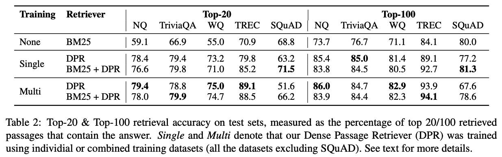

- [x] Round-1: Overview
- [ ] Round-2: Model Implementation Details
- [ ] Round-3: Experiments

## Citation

> Karpukhin, V., Oğuz, B., Min, S., Lewis, P., Wu, L., Edunov, S., Chen, D., & Yih, W. (2020).   
> **Dense Passage Retrieval for Open-Domain Question Answering.**   
> https://doi.org/10.48550/arxiv.2004.04906

## Abstract

> Open-domain question answering relies on efficient passage retrieval to
> select candidate contexts, where traditional sparse vector space models, such
> as TF-IDF or BM25, are the de facto method. In this work, we show that
> retrieval can be practically implemented using dense representations alone,
> where embeddings are learned from a small number of questions and passages by a
> simple dual-encoder framework. When evaluated on a wide range of open-domain QA
> datasets, our dense retriever outperforms a strong Lucene-BM25 system largely
> by 9%-19% absolute in terms of top-20 passage retrieval accuracy, and helps our
> end-to-end QA system establish new state-of-the-art on multiple open-domain QA
> benchmarks.

## What's New

- QAタスクにおいて，追加で事前学習せずにDense Embeddingを学習する方法（Deep Passage Retriever）を提案
- QuestionとPassageを別々にEmbeddingするDual Encoderモデルにおいて，効率的な学習方法を採用
- Deep Passage Retrieverで，既存手法（TF-IDF，BM25）を上回る精度を達成
- 上記の観点を複数のQAデータセットで検証

## Dataset

Natural Questions

  > Kwiatkowski, T. et al. (2019).   
  > **Natural Questions: A Benchmark for Question Answering Research.**  
  > Transactions of the Association for Computational Linguistics, 7, 453–466.  
  > https://doi.org/10.1162/TACL_A_00276  

TriviaQA

  > Joshi, M., Choi, E., Weld, D. S., & Zettlemoyer, L. (2017).  
  > **TriviaQA: A Large Scale Distantly Supervised Challenge Dataset for Reading Comprehension.**  
  > https://doi.org/10.48550/arxiv.1705.03551  

WebQuestions

  > Berant, J., Chou, A. K., Frostig, R., & Liang, P. (2013).  
  > **Semantic Parsing on Freebase from Question-Answer Pairs.**  
  > EMNLP.  

CuratedTRECK

  > Baudiš, P., & Šedivý, J. (2015).  
  > **Modeling of the question answering task in the YodaQA system.**  
  > Lecture Notes in Computer Science (Including Subseries Lecture Notes in Artificial Intelligence and Lecture Notes in Bioinformatics), 9283, 222–228.  
  > https://doi.org/10.1007/978-3-319-24027-5_20  

SQuAD v1.1

  > Rajpurkar, P., Zhang, J., Lopyrev, K., & Liang, P. (2016).  
  > **SQuAD: 100,000+ Questions for Machine Comprehension of Text.**  
  > EMNLP 2016 - Conference on Empirical Methods in Natural Language Processing, Proceedings, 2383–2392.  
  > https://doi.org/10.18653/V1/D16-1264

 

**Dataset Summary**

| Dataset | Train(original) | Train(for DPR) | Dev | Test |
|---------|----------------:|---------------:|----:|-----:|
| Natural Questions | 79,168 | 58,880 | 8,757 | 3,610 |
| TriviaQA          | 78,785 | 60,413 | 8,837 | 11,313 |
| WebQuestions      | 3,417  | 2,474  | 361   | 2,032 |
| CuratedTREC       | 1,353  | 1,125  | 133   | 694 |
| SQuAD             | 78,713 | 70,096 | 8,886 | 10,570 |

## Model Description

TBD

### Training Settings

## Results

- SQuADを除いて，DPRは軒並みBM25よりも良い精度を出している
  - SQuADでは，アノテーターはPassageを見た後にQuestionを記載する手順になっているため，PassageとQuestionが非常に似たものになり，計算上，BM25で精度が高くなりやすいと考えられる
  - SQuADではWikipediaの記事中から500件強を収集して構築されたもので，学習データにかなりバイアスがあると考えられる

## References

  
Scaling question answering to the web

  > Cody C. T. Kwok, Oren Etzioni, Daniel S. Weld. (2001)  
  > **Scaling question answering to the web**  
  > TOIS  
  > [Paper Link](https://www.semanticscholar.org/paper/016e9cc85c658c6a69710b4c617609ad2a5d3a74)  
  > Influential Citation Count (22), SS-ID (016e9cc85c658c6a69710b4c617609ad2a5d3a74)  
  > 
  > **ABSTRACT**  
  > The wealth of information on the web makes it an attractive resource for seeking quick answers to simple, factual questions such as &quote;who was the first American in space?&quote; or &quote;what is the second tallest mountain in the world?&quote; Yet today's most advanced web search services (e.g., Google and AskJeeves) make it surprisingly tedious to locate answers to such questions. In this paper, we extend question-answering techniques, first studied in the information retrieval literature, to the web and experimentally evaluate their performance.First we introduce Mulder, which we believe to be the first general-purpose, fully-automated question-answering system available on the web. Second, we describe Mulder's architecture, which relies on multiple search-engine queries, natural-language parsing, and a novel voting procedure to yield reliable answers coupled with high recall. Finally, we compare Mulder's performance to that of Google and AskJeeves on questions drawn from the TREC-8 question answering track. We find that Mulder's recall is more than a factor of three higher than that of AskJeeves. In addition, we find that Google requires 6.6 times as much user effort to achieve the same level of recall as Mulder.

  
SQuAD: 100,000+ Questions for Machine Comprehension of Text

  > Pranav Rajpurkar, Jian Zhang, Konstantin Lopyrev, Percy Liang. (2016)  
  > **SQuAD: 100,000+ Questions for Machine Comprehension of Text**  
  > EMNLP  
  > [Paper Link](https://www.semanticscholar.org/paper/05dd7254b632376973f3a1b4d39485da17814df5)  
  > Influential Citation Count (1062), SS-ID (05dd7254b632376973f3a1b4d39485da17814df5)  
  > 
  > **ABSTRACT**  
  > We present the Stanford Question Answering Dataset (SQuAD), a new reading comprehension dataset consisting of 100,000+ questions posed by crowdworkers on a set of Wikipedia articles, where the answer to each question is a segment of text from the corresponding reading passage. We analyze the dataset to understand the types of reasoning required to answer the questions, leaning heavily on dependency and constituency trees. We build a strong logistic regression model, which achieves an F1 score of 51.0%, a significant improvement over a simple baseline (20%). However, human performance (86.8%) is much higher, indicating that the dataset presents a good challenge problem for future research. 
The dataset is freely available at this https URL

  
Multi-passage BERT: A Globally Normalized BERT Model for Open-domain Question Answering

  > Zhiguo Wang, Patrick Ng, Xiaofei Ma, Ramesh Nallapati, Bing Xiang. (2019)  
  > **Multi-passage BERT: A Globally Normalized BERT Model for Open-domain Question Answering**  
  > EMNLP  
  > [Paper Link](https://www.semanticscholar.org/paper/0cf535110808d33fdf4db3ffa1621dea16e29c0d)  
  > Influential Citation Count (16), SS-ID (0cf535110808d33fdf4db3ffa1621dea16e29c0d)  
  > 
  > **ABSTRACT**  
  > BERT model has been successfully applied to open-domain QA tasks. However, previous work trains BERT by viewing passages corresponding to the same question as independent training instances, which may cause incomparable scores for answers from different passages. To tackle this issue, we propose a multi-passage BERT model to globally normalize answer scores across all passages of the same question, and this change enables our QA model find better answers by utilizing more passages. In addition, we find that splitting articles into passages with the length of 100 words by sliding window improves performance by 4%. By leveraging a passage ranker to select high-quality passages, multi-passage BERT gains additional 2%. Experiments on four standard benchmarks showed that our multi-passage BERT outperforms all state-of-the-art models on all benchmarks. In particular, on the OpenSQuAD dataset, our model gains 21.4% EM and 21.5% F1 over all non-BERT models, and 5.8% EM and 6.5% F1 over BERT-based models.

  
Reading Wikipedia to Answer Open-Domain Questions

  > Danqi Chen, Adam Fisch, J. Weston, Antoine Bordes. (2017)  
  > **Reading Wikipedia to Answer Open-Domain Questions**  
  > ACL  
  > [Paper Link](https://www.semanticscholar.org/paper/104715e1097b7ebee436058bfd9f45540f269845)  
  > Influential Citation Count (280), SS-ID (104715e1097b7ebee436058bfd9f45540f269845)  
  > 
  > **ABSTRACT**  
  > This paper proposes to tackle open- domain question answering using Wikipedia as the unique knowledge source: the answer to any factoid question is a text span in a Wikipedia article. This task of machine reading at scale combines the challenges of document retrieval (finding the relevant articles) with that of machine comprehension of text (identifying the answer spans from those articles). Our approach combines a search component based on bigram hashing and TF-IDF matching with a multi-layer recurrent neural network model trained to detect answers in Wikipedia paragraphs. Our experiments on multiple existing QA datasets indicate that (1) both modules are highly competitive with respect to existing counterparts and (2) multitask learning using distant supervision on their combination is an effective complete system on this challenging task.

  
Performance Issues and Error Analysis in an Open-Domain Question Answering System

  > D. Moldovan, Marius Pasca, S. Harabagiu, M. Surdeanu. (2002)  
  > **Performance Issues and Error Analysis in an Open-Domain Question Answering System**  
  > ACL  
  > [Paper Link](https://www.semanticscholar.org/paper/1503e5c5adb0a3063d09b0f398f724d7dd26a979)  
  > Influential Citation Count (12), SS-ID (1503e5c5adb0a3063d09b0f398f724d7dd26a979)  
  > 
  > **ABSTRACT**  
  > This paper presents an in-depth analysis of a state-of-the-art Question Answering system. Several scenarios are examined: (1) the performance of each module in a serial baseline system, (2) the impact of feedbacks and the insertion of a logic prover, and (3) the impact of various lexical resources. The main conclusion is that the overall performance depends on the depth of natural language processing resources and the tools used for answer finding.

  
Knowledge Guided Text Retrieval and Reading for Open Domain Question Answering

  > Sewon Min, Danqi Chen, Luke Zettlemoyer, Hannaneh Hajishirzi. (2019)  
  > **Knowledge Guided Text Retrieval and Reading for Open Domain Question Answering**  
  > ArXiv  
  > [Paper Link](https://www.semanticscholar.org/paper/1715aa36ccc851310308630d4db61dcecf49a50d)  
  > Influential Citation Count (4), SS-ID (1715aa36ccc851310308630d4db61dcecf49a50d)  
  > 
  > **ABSTRACT**  
  > We introduce an approach for open-domain question answering (QA) that retrieves and reads a passage graph, where vertices are passages of text and edges represent relationships that are derived from an external knowledge base or co-occurrence in the same article. Our goals are to boost coverage by using knowledge-guided retrieval to find more relevant passages than text-matching methods, and to improve accuracy by allowing for better knowledge-guided fusion of information across related passages. Our graph retrieval method expands a set of seed keyword-retrieved passages by traversing the graph structure of the knowledge base. Our reader extends a BERT-based architecture and updates passage representations by propagating information from related passages and their relations, instead of reading each passage in isolation. Experiments on three open-domain QA datasets, WebQuestions, Natural Questions and TriviaQA, show improved performance over non-graph baselines by 2-11% absolute. Our approach also matches or exceeds the state-of-the-art in every case, without using an expensive end-to-end training regime.

  
Natural Questions: A Benchmark for Question Answering Research

  > T. Kwiatkowski, Jennimaria Palomaki, Olivia Redfield, Michael Collins, Ankur P. Parikh, Chris Alberti, D. Epstein, Illia Polosukhin, Jacob Devlin, Kenton Lee, Kristina Toutanova, Llion Jones, Matthew Kelcey, Ming-Wei Chang, Andrew M. Dai, Jakob Uszkoreit, Quoc V. Le, Slav Petrov. (2019)  
  > **Natural Questions: A Benchmark for Question Answering Research**  
  > TACL  
  > [Paper Link](https://www.semanticscholar.org/paper/17dbd7b72029181327732e4d11b52a08ed4630d0)  
  > Influential Citation Count (121), SS-ID (17dbd7b72029181327732e4d11b52a08ed4630d0)  
  > 
  > **ABSTRACT**  
  > We present the Natural Questions corpus, a question answering data set. Questions consist of real anonymized, aggregated queries issued to the Google search engine. An annotator is presented with a question along with a Wikipedia page from the top 5 search results, and annotates a long answer (typically a paragraph) and a short answer (one or more entities) if present on the page, or marks null if no long/short answer is present. The public release consists of 307,373 training examples with single annotations; 7,830 examples with 5-way annotations for development data; and a further 7,842 examples with 5-way annotated sequestered as test data. We present experiments validating quality of the data. We also describe analysis of 25-way annotations on 302 examples, giving insights into human variability on the annotation task. We introduce robust metrics for the purposes of evaluating question answering systems; demonstrate high human upper bounds on these metrics; and establish baseline results using competitive methods drawn from related literature.

  
Learning and Inference via Maximum Inner Product Search

  > Stephen Mussmann, S. Ermon. (2016)  
  > **Learning and Inference via Maximum Inner Product Search**  
  > ICML  
  > [Paper Link](https://www.semanticscholar.org/paper/2040c5de2344b9b14f1bbfff372f708639cca739)  
  > Influential Citation Count (2), SS-ID (2040c5de2344b9b14f1bbfff372f708639cca739)  
  > 
  > **ABSTRACT**  
  > A large class of commonly used probabilistic models known as log-linear models are defined up to a normalization constant. Typical learning algorithms for such models require solving a sequence of probabilistic inference queries. These inferences are typically intractable, and are a major bottleneck for learning models with large output spaces. In this paper, we provide a new approach for amortizing the cost of a sequence of related inference queries, such as the ones arising during learning. Our technique relies on a surprising connection with algorithms developed in the past two decades for similarity search in large data bases. Our approach achieves improved running times with provable approximation guarantees. We show that it performs well both on synthetic data and neural language models with large output spaces.

  
Indexing by Latent Semantic Analysis

  > S. Deerwester, S. Dumais, T. Landauer, G. Furnas, R. Harshman. (1990)  
  > **Indexing by Latent Semantic Analysis**  
  > J. Am. Soc. Inf. Sci.  
  > [Paper Link](https://www.semanticscholar.org/paper/20a80a7356859daa4170fb4da6b87b84adbb547f)  
  > Influential Citation Count (770), SS-ID (20a80a7356859daa4170fb4da6b87b84adbb547f)  
  > 
  > **ABSTRACT**  
  > A new method for automatic indexing and retrieval is described. The approach is to take advantage of implicit higher-order structure in the association of terms with documents (“semantic structure”) in order to improve the detection of relevant documents on the basis of terms found in queries. The particular technique used is singular-value decomposition, in which a large term by document matrix is decomposed into a set of ca. 100 orthogonal factors from which the original matrix can be approximated by linear combination. Documents are represented by ca. 100 item vectors of factor weights. Queries are represented as pseudo-document vectors formed from weighted combinations of terms, and documents with supra-threshold cosine values are returned. initial tests find this completely automatic method for retrieval to be promising.

  
Billion-Scale Similarity Search with GPUs

  > Jeff Johnson, M. Douze, H. Jégou. (2017)  
  > **Billion-Scale Similarity Search with GPUs**  
  > IEEE Transactions on Big Data  
  > [Paper Link](https://www.semanticscholar.org/paper/2cbb8de53759e75411bc528518947a3094fbce3a)  
  > Influential Citation Count (166), SS-ID (2cbb8de53759e75411bc528518947a3094fbce3a)  
  > 
  > **ABSTRACT**  
  > Similarity search finds application in database systems handling complex data such as images or videos, which are typically represented by high-dimensional features and require specific indexing structures. This paper tackles the problem of better utilizing GPUs for this task. While GPUs excel at data parallel tasks such as distance computation, prior approaches in this domain are bottlenecked by algorithms that expose less parallelism, such as <inline-formula><tex-math notation="LaTeX">$k$</tex-math><alternatives><mml:math><mml:mi>k</mml:mi></mml:math><inline-graphic xlink:href="johnson-ieq1-2921572.gif"/></alternatives></inline-formula>-min selection, or make poor use of the memory hierarchy. We propose a novel design for <inline-formula><tex-math notation="LaTeX">$k$</tex-math><alternatives><mml:math><mml:mi>k</mml:mi></mml:math><inline-graphic xlink:href="johnson-ieq2-2921572.gif"/></alternatives></inline-formula>-selection. We apply it in different similarity search scenarios, by optimizing brute-force, approximate and compressed-domain search based on product quantization. In all these setups, we outperform the state of the art by large margins. Our implementation operates at up to 55 percent of theoretical peak performance, enabling a nearest neighbor implementation that is 8.5 × faster than prior GPU state of the art. It enables the construction of a high accuracy <inline-formula><tex-math notation="LaTeX">$k$</tex-math><alternatives><mml:math><mml:mi>k</mml:mi></mml:math><inline-graphic xlink:href="johnson-ieq3-2921572.gif"/></alternatives></inline-formula>-NN graph on 95 million images from the <sc>Yfcc100M</sc> dataset in 35 minutes, and of a graph connecting 1 billion vectors in less than 12 hours on 4 Maxwell Titan X GPUs. We have open-sourced our approach for the sake of comparison and reproducibility.

  
End-to-End Open-Domain Question Answering with BERTserini

  > Wei Yang, Yuqing Xie, Aileen Lin, Xingyu Li, Luchen Tan, Kun Xiong, Ming Li, Jimmy J. Lin. (2019)  
  > **End-to-End Open-Domain Question Answering with BERTserini**  
  > NAACL  
  > [Paper Link](https://www.semanticscholar.org/paper/2fe7dba5a58aee5156594b4d78634ecd6c7dcabd)  
  > Influential Citation Count (45), SS-ID (2fe7dba5a58aee5156594b4d78634ecd6c7dcabd)  
  > 
  > **ABSTRACT**  
  > We demonstrate an end-to-end question answering system that integrates BERT with the open-source Anserini information retrieval toolkit. In contrast to most question answering and reading comprehension models today, which operate over small amounts of input text, our system integrates best practices from IR with a BERT-based reader to identify answers from a large corpus of Wikipedia articles in an end-to-end fashion. We report large improvements over previous results on a standard benchmark test collection, showing that fine-tuning pretrained BERT with SQuAD is sufficient to achieve high accuracy in identifying answer spans.

  
A Discrete Hard EM Approach for Weakly Supervised Question Answering

  > Sewon Min, Danqi Chen, Hannaneh Hajishirzi, Luke Zettlemoyer. (2019)  
  > **A Discrete Hard EM Approach for Weakly Supervised Question Answering**  
  > EMNLP  
  > [Paper Link](https://www.semanticscholar.org/paper/30eff53e981695c7296d258b8dc44b4c7b482a0c)  
  > Influential Citation Count (19), SS-ID (30eff53e981695c7296d258b8dc44b4c7b482a0c)  
  > 
  > **ABSTRACT**  
  > Many question answering (QA) tasks only provide weak supervision for how the answer should be computed. For example, TriviaQA answers are entities that can be mentioned multiple times in supporting documents, while DROP answers can be computed by deriving many different equations from numbers in the reference text. In this paper, we show it is possible to convert such tasks into discrete latent variable learning problems with a precomputed, task-specific set of possible solutions (e.g. different mentions or equations) that contains one correct option. We then develop a hard EM learning scheme that computes gradients relative to the most likely solution at each update. Despite its simplicity, we show that this approach significantly outperforms previous methods on six QA tasks, including absolute gains of 2–10%, and achieves the state-of-the-art on five of them. Using hard updates instead of maximizing marginal likelihood is key to these results as it encourages the model to find the one correct answer, which we show through detailed qualitative analysis.

  
Poly-encoders: Architectures and Pre-training Strategies for Fast and Accurate Multi-sentence Scoring

  > Samuel Humeau, Kurt Shuster, Marie-Anne Lachaux, J. Weston. (2020)  
  > **Poly-encoders: Architectures and Pre-training Strategies for Fast and Accurate Multi-sentence Scoring**  
  > ICLR  
  > [Paper Link](https://www.semanticscholar.org/paper/3511facfa0230b8c3ba5b72d9c11bc58f6ed6ecc)  
  > Influential Citation Count (28), SS-ID (3511facfa0230b8c3ba5b72d9c11bc58f6ed6ecc)  
  > 
  > **ABSTRACT**  
  > The use of deep pre-trained transformers has led to remarkable progress in a number of applications (Devlin et al., 2018). For tasks that make pairwise comparisons between sequences, matching a given input with a corresponding label, two approaches are common: Cross-encoders performing full self-attention over the pair and Bi-encoders encoding the pair separately. The former often performs better, but is too slow for practical use. In this work, we develop a new transformer architecture, the Poly-encoder, that learns global rather than token level self-attention features. We perform a detailed comparison of all three approaches, including what pre-training and fine-tuning strategies work best. We show our models achieve state-of-the-art results on four tasks; that Poly-encoders are faster than Cross-encoders and more accurate than Bi-encoders; and that the best results are obtained by pre-training on large datasets similar to the downstream tasks.

  
BART: Denoising Sequence-to-Sequence Pre-training for Natural Language Generation, Translation, and Comprehension

  > M. Lewis, Yinhan Liu, Naman Goyal, Marjan Ghazvininejad, Abdelrahman Mohamed, Omer Levy, Veselin Stoyanov, Luke Zettlemoyer. (2019)  
  > **BART: Denoising Sequence-to-Sequence Pre-training for Natural Language Generation, Translation, and Comprehension**  
  > ACL  
  > [Paper Link](https://www.semanticscholar.org/paper/395de0bd3837fdf4b4b5e5f04835bcc69c279481)  
  > Influential Citation Count (481), SS-ID (395de0bd3837fdf4b4b5e5f04835bcc69c279481)  
  > 
  > **ABSTRACT**  
  > We present BART, a denoising autoencoder for pretraining sequence-to-sequence models. BART is trained by (1) corrupting text with an arbitrary noising function, and (2) learning a model to reconstruct the original text. It uses a standard Tranformer-based neural machine translation architecture which, despite its simplicity, can be seen as generalizing BERT (due to the bidirectional encoder), GPT (with the left-to-right decoder), and other recent pretraining schemes. We evaluate a number of noising approaches, finding the best performance by both randomly shuffling the order of sentences and using a novel in-filling scheme, where spans of text are replaced with a single mask token. BART is particularly effective when fine tuned for text generation but also works well for comprehension tasks. It matches the performance of RoBERTa on GLUE and SQuAD, and achieves new state-of-the-art results on a range of abstractive dialogue, question answering, and summarization tasks, with gains of up to 3.5 ROUGE. BART also provides a 1.1 BLEU increase over a back-translation system for machine translation, with only target language pretraining. We also replicate other pretraining schemes within the BART framework, to understand their effect on end-task performance.

  
Exploring the Limits of Transfer Learning with a Unified Text-to-Text Transformer

  > Colin Raffel, Noam M. Shazeer, Adam Roberts, Katherine Lee, Sharan Narang, Michael Matena, Yanqi Zhou, Wei Li, Peter J. Liu. (2019)  
  > **Exploring the Limits of Transfer Learning with a Unified Text-to-Text Transformer**  
  > J. Mach. Learn. Res.  
  > [Paper Link](https://www.semanticscholar.org/paper/3cfb319689f06bf04c2e28399361f414ca32c4b3)  
  > Influential Citation Count (615), SS-ID (3cfb319689f06bf04c2e28399361f414ca32c4b3)  
  > 
  > **ABSTRACT**  
  > Transfer learning, where a model is first pre-trained on a data-rich task before being fine-tuned on a downstream task, has emerged as a powerful technique in natural language processing (NLP). The effectiveness of transfer learning has given rise to a diversity of approaches, methodology, and practice. In this paper, we explore the landscape of transfer learning techniques for NLP by introducing a unified framework that converts every language problem into a text-to-text format. Our systematic study compares pre-training objectives, architectures, unlabeled datasets, transfer approaches, and other factors on dozens of language understanding tasks. By combining the insights from our exploration with scale and our new "Colossal Clean Crawled Corpus", we achieve state-of-the-art results on many benchmarks covering summarization, question answering, text classification, and more. To facilitate future work on transfer learning for NLP, we release our dataset, pre-trained models, and code.

  
Efficient Natural Language Response Suggestion for Smart Reply

  > Matthew Henderson, Rami Al-Rfou, B. Strope, Yun-Hsuan Sung, László Lukács, Ruiqi Guo, Sanjiv Kumar, Balint Miklos, R. Kurzweil. (2017)  
  > **Efficient Natural Language Response Suggestion for Smart Reply**  
  > ArXiv  
  > [Paper Link](https://www.semanticscholar.org/paper/435553998fbef790b5bed3491a8f634d9ec5cfa2)  
  > Influential Citation Count (13), SS-ID (435553998fbef790b5bed3491a8f634d9ec5cfa2)  
  > 
  > **ABSTRACT**  
  > This paper presents a computationally efficient machine-learned method for natural language response suggestion. Feed-forward neural networks using n-gram embedding features encode messages into vectors which are optimized to give message-response pairs a high dot-product value. An optimized search finds response suggestions. The method is evaluated in a large-scale commercial e-mail application, Inbox by Gmail. Compared to a sequence-to-sequence approach, the new system achieves the same quality at a small fraction of the computational requirements and latency.

  
Progressively Pretrained Dense Corpus Index for Open-Domain Question Answering

  > Wenhan Xiong, Hong Wang, W. Wang. (2020)  
  > **Progressively Pretrained Dense Corpus Index for Open-Domain Question Answering**  
  > EACL  
  > [Paper Link](https://www.semanticscholar.org/paper/469d92f195aebfa09e9b411ad92b3c879bcd1eba)  
  > Influential Citation Count (1), SS-ID (469d92f195aebfa09e9b411ad92b3c879bcd1eba)  
  > 
  > **ABSTRACT**  
  > Commonly used information retrieval methods such as TF-IDF in open-domain question answering (QA) systems are insufficient to capture deep semantic matching that goes beyond lexical overlaps. Some recent studies consider the retrieval process as maximum inner product search (MIPS) using dense question and paragraph representations, achieving promising results on several information-seeking QA datasets. However, the pretraining of the dense vector representations is highly resource-demanding, e.g., requires a very large batch size and lots of training steps. In this work, we propose a sample-efficient method to pretrain the paragraph encoder. First, instead of using heuristically created pseudo question-paragraph pairs for pretraining, we use an existing pretrained sequence-to-sequence model to build a strong question generator that creates high-quality pretraining data. Second, we propose a simple progressive pretraining algorithm to ensure the existence of effective negative samples in each batch. Across three open-domain QA datasets, our method consistently outperforms a strong dense retrieval baseline that uses 6 times more computation for training. On two of the datasets, our method achieves more than 4-point absolute improvement in terms of answer exact match.

  
The Probabilistic Relevance Framework: BM25 and Beyond

  > S. Robertson, H. Zaragoza. (2009)  
  > **The Probabilistic Relevance Framework: BM25 and Beyond**  
  > Found. Trends Inf. Retr.  
  > [Paper Link](https://www.semanticscholar.org/paper/47ced790a563344efae66588b5fb7fe6cca29ed3)  
  > Influential Citation Count (278), SS-ID (47ced790a563344efae66588b5fb7fe6cca29ed3)  
  > 
  > **ABSTRACT**  
  > The Probabilistic Relevance Framework (PRF) is a formal framework for document retrieval, grounded in work done in the 1970—1980s, which led to the development of one of the most successful text-retrieval algorithms, BM25. In recent years, research in the PRF has yielded new retrieval models capable of taking into account document meta-data (especially structure and link-graph information). Again, this has led to one of the most successful Web-search and corporate-search algorithms, BM25F. This work presents the PRF from a conceptual point of view, describing the probabilistic modelling assumptions behind the framework and the different ranking algorithms that result from its application: the binary independence model, relevance feedback models, BM25 and BM25F. It also discusses the relation between the PRF and other statistical models for IR, and covers some related topics, such as the use of non-textual features, and parameter optimisation for models with free parameters.

  
Revealing the Importance of Semantic Retrieval for Machine Reading at Scale

  > Yixin Nie, Songhe Wang, Mohit Bansal. (2019)  
  > **Revealing the Importance of Semantic Retrieval for Machine Reading at Scale**  
  > EMNLP  
  > [Paper Link](https://www.semanticscholar.org/paper/4bf61dab8ad195e87b6f0496ec7bada5d37c476f)  
  > Influential Citation Count (20), SS-ID (4bf61dab8ad195e87b6f0496ec7bada5d37c476f)  
  > 
  > **ABSTRACT**  
  > Machine Reading at Scale (MRS) is a challenging task in which a system is given an input query and is asked to produce a precise output by “reading” information from a large knowledge base. The task has gained popularity with its natural combination of information retrieval (IR) and machine comprehension (MC). Advancements in representation learning have led to separated progress in both IR and MC; however, very few studies have examined the relationship and combined design of retrieval and comprehension at different levels of granularity, for development of MRS systems. In this work, we give general guidelines on system design for MRS by proposing a simple yet effective pipeline system with special consideration on hierarchical semantic retrieval at both paragraph and sentence level, and their potential effects on the downstream task. The system is evaluated on both fact verification and open-domain multihop QA, achieving state-of-the-art results on the leaderboard test sets of both FEVER and HOTPOTQA. To further demonstrate the importance of semantic retrieval, we present ablation and analysis studies to quantify the contribution of neural retrieval modules at both paragraph-level and sentence-level, and illustrate that intermediate semantic retrieval modules are vital for not only effectively filtering upstream information and thus saving downstream computation, but also for shaping upstream data distribution and providing better data for downstream modeling.

  
Retrieval-Augmented Generation for Knowledge-Intensive NLP Tasks

  > Patrick Lewis, Ethan Perez, Aleksandara Piktus, Fabio Petroni, Vladimir Karpukhin, Naman Goyal, Heinrich Kuttler, M. Lewis, Wen-tau Yih, Tim Rocktäschel, Sebastian Riedel, Douwe Kiela. (2020)  
  > **Retrieval-Augmented Generation for Knowledge-Intensive NLP Tasks**  
  > NeurIPS  
  > [Paper Link](https://www.semanticscholar.org/paper/58ed1fbaabe027345f7bb3a6312d41c5aac63e22)  
  > Influential Citation Count (52), SS-ID (58ed1fbaabe027345f7bb3a6312d41c5aac63e22)  
  > 
  > **ABSTRACT**  
  > Large pre-trained language models have been shown to store factual knowledge in their parameters, and achieve state-of-the-art results when fine-tuned on downstream NLP tasks. However, their ability to access and precisely manipulate knowledge is still limited, and hence on knowledge-intensive tasks, their performance lags behind task-specific architectures. Additionally, providing provenance for their decisions and updating their world knowledge remain open research problems. Pre-trained models with a differentiable access mechanism to explicit non-parametric memory can overcome this issue, but have so far been only investigated for extractive downstream tasks. We explore a general-purpose fine-tuning recipe for retrieval-augmented generation (RAG) -- models which combine pre-trained parametric and non-parametric memory for language generation. We introduce RAG models where the parametric memory is a pre-trained seq2seq model and the non-parametric memory is a dense vector index of Wikipedia, accessed with a pre-trained neural retriever. We compare two RAG formulations, one which conditions on the same retrieved passages across the whole generated sequence, the other can use different passages per token. We fine-tune and evaluate our models on a wide range of knowledge-intensive NLP tasks and set the state-of-the-art on three open domain QA tasks, outperforming parametric seq2seq models and task-specific retrieve-and-extract architectures. For language generation tasks, we find that RAG models generate more specific, diverse and factual language than a state-of-the-art parametric-only seq2seq baseline.

  
ColBERT: Efficient and Effective Passage Search via Contextualized Late Interaction over BERT

  > O. Khattab, M. Zaharia. (2020)  
  > **ColBERT: Efficient and Effective Passage Search via Contextualized Late Interaction over BERT**  
  > SIGIR  
  > [Paper Link](https://www.semanticscholar.org/paper/60b8ad6177230ad5402af409a6edb5af441baeb4)  
  > Influential Citation Count (52), SS-ID (60b8ad6177230ad5402af409a6edb5af441baeb4)  
  > 
  > **ABSTRACT**  
  > Recent progress in Natural Language Understanding (NLU) is driving fast-paced advances in Information Retrieval (IR), largely owed to fine-tuning deep language models (LMs) for document ranking. While remarkably effective, the ranking models based on these LMs increase computational cost by orders of magnitude over prior approaches, particularly as they must feed each query-document pair through a massive neural network to compute a single relevance score. To tackle this, we present ColBERT, a novel ranking model that adapts deep LMs (in particular, BERT) for efficient retrieval. ColBERT introduces a late interaction architecture that independently encodes the query and the document using BERT and then employs a cheap yet powerful interaction step that models their fine-grained similarity. By delaying and yet retaining this fine-granular interaction, ColBERT can leverage the expressiveness of deep LMs while simultaneously gaining the ability to pre-compute document representations offline, considerably speeding up query processing. Crucially, ColBERT's pruning-friendly interaction mechanism enables leveraging vector-similarity indexes for end-to-end retrieval directly from millions of documents. We extensively evaluate ColBERT using two recent passage search datasets. Results show that ColBERT's effectiveness is competitive with existing BERT-based models (and outperforms every non-BERT baseline), while executing two orders-of-magnitude faster and requiring up to four orders-of-magnitude fewer FLOPs per query.

  
Learning to rank using gradient descent

  > C. Burges, Tal Shaked, Erin Renshaw, Ari Lazier, Matt Deeds, Nicole Hamilton, Greg Hullender. (2005)  
  > **Learning to rank using gradient descent**  
  > ICML  
  > [Paper Link](https://www.semanticscholar.org/paper/63aaf12163fe9735dfe9a69114937c4fa34f303a)  
  > Influential Citation Count (290), SS-ID (63aaf12163fe9735dfe9a69114937c4fa34f303a)  
  > 
  > **ABSTRACT**  
  > We investigate using gradient descent methods for learning ranking functions; we propose a simple probabilistic cost function, and we introduce RankNet, an implementation of these ideas using a neural network to model the underlying ranking function. We present test results on toy data and on data from a commercial internet search engine.

  
The TREC-8 Question Answering Track Report

  > E. Voorhees. (1999)  
  > **The TREC-8 Question Answering Track Report**  
  > TREC  
  > [Paper Link](https://www.semanticscholar.org/paper/646d4888871aca2a25111eb2520e4c47e253b014)  
  > Influential Citation Count (157), SS-ID (646d4888871aca2a25111eb2520e4c47e253b014)  
  > 
  > **ABSTRACT**  
  > The TREC-8 Question Answering track was the first large-scale evaluation of domain-independent question answering systems. This paper summarizes the results of the track by giving a brief overview of the different approaches taken to solve the problem. The most accurate systems found a correct response for more than 2/3 of the questions. Relatively simple bag-of-words approaches were adequate for finding answers when responses could be as long as a paragraph (250 bytes), but more sophisticated processing was necessary for more direct responses (50 bytes).

The TREC-8 Question Answering track was an initial eort to bring the benets of large-scale evaluation to bear on a question answering (QA) task. The goal in the QA task is to retrieve small snippets of text that contain the actual answer to a question rather than the document lists traditionally returned by text retrieval systems. The assumption is that users would usually prefer to be given the answer rather than and the answer themselves in a document.

This paper summarizes the retrieval results of the track; a companion paper (\The TREC-8 Question Answering Track Evaluation") gives details about how the evaluation was implemented. By necessity, a track report can give only an overview of the different approaches used in the track. Readers are urged to consult the participants' papers elsewhere in the Proceedings for details regarding a particular approach.

  
Learning to Retrieve Reasoning Paths over Wikipedia Graph for Question Answering

  > Akari Asai, Kazuma Hashimoto, Hannaneh Hajishirzi, R. Socher, Caiming Xiong. (2019)  
  > **Learning to Retrieve Reasoning Paths over Wikipedia Graph for Question Answering**  
  > ICLR  
  > [Paper Link](https://www.semanticscholar.org/paper/6580bf92ca01a403ac58f6764dc1dd7a771579d0)  
  > Influential Citation Count (26), SS-ID (6580bf92ca01a403ac58f6764dc1dd7a771579d0)  
  > 
  > **ABSTRACT**  
  > Answering questions that require multi-hop reasoning at web-scale necessitates retrieving multiple evidence documents, one of which often has little lexical or semantic relationship to the question. This paper introduces a new graph-based recurrent retrieval approach that learns to retrieve reasoning paths over the Wikipedia graph to answer multi-hop open-domain questions. Our retriever model trains a recurrent neural network that learns to sequentially retrieve evidence paragraphs in the reasoning path by conditioning on the previously retrieved documents. Our reader model ranks the reasoning paths and extracts the answer span included in the best reasoning path. Experimental results show state-of-the-art results in three open-domain QA datasets, showcasing the effectiveness and robustness of our method. Notably, our method achieves significant improvement in HotpotQA, outperforming the previous best model by more than 14 points.

  
Learning Dense Representations for Entity Retrieval

  > D. Gillick, Sayali Kulkarni, L. Lansing, A. Presta, Jason Baldridge, Eugene Ie, Diego Garcia-Olano. (2019)  
  > **Learning Dense Representations for Entity Retrieval**  
  > CoNLL  
  > [Paper Link](https://www.semanticscholar.org/paper/6b5cb3b85fb247256b264c2732916cf129015a92)  
  > Influential Citation Count (10), SS-ID (6b5cb3b85fb247256b264c2732916cf129015a92)  
  > 
  > **ABSTRACT**  
  > We show that it is feasible to perform entity linking by training a dual encoder (two-tower) model that encodes mentions and entities in the same dense vector space, where candidate entities are retrieved by approximate nearest neighbor search. Unlike prior work, this setup does not rely on an alias table followed by a re-ranker, and is thus the first fully learned entity retrieval model. We show that our dual encoder, trained using only anchor-text links in Wikipedia, outperforms discrete alias table and BM25 baselines, and is competitive with the best comparable results on the standard TACKBP-2010 dataset. In addition, it can retrieve candidates extremely fast, and generalizes well to a new dataset derived from Wikinews. On the modeling side, we demonstrate the dramatic value of an unsupervised negative mining algorithm for this task.

  
Asymmetric LSH (ALSH) for Sublinear Time Maximum Inner Product Search (MIPS)

  > Anshumali Shrivastava, Ping Li. (2014)  
  > **Asymmetric LSH (ALSH) for Sublinear Time Maximum Inner Product Search (MIPS)**  
  > NIPS  
  > [Paper Link](https://www.semanticscholar.org/paper/6dbffa57b3c6c5645cf701b9b444984a4b61bb57)  
  > Influential Citation Count (44), SS-ID (6dbffa57b3c6c5645cf701b9b444984a4b61bb57)  
  > 
  > **ABSTRACT**  
  > We present the first provably sublinear time algorithm for approximate \emph{Maximum Inner Product Search} (MIPS). Our proposal is also the first hashing algorithm for searching with (un-normalized) inner product as the underlying similarity measure. Finding hashing schemes for MIPS was considered hard. We formally show that the existing Locality Sensitive Hashing (LSH) framework is insufficient for solving MIPS, and then we extend the existing LSH framework to allow asymmetric hashing schemes. Our proposal is based on an interesting mathematical phenomenon in which inner products, after independent asymmetric transformations, can be converted into the problem of approximate near neighbor search. This key observation makes efficient sublinear hashing scheme for MIPS possible. In the extended asymmetric LSH (ALSH) framework, we provide an explicit construction of provably fast hashing scheme for MIPS. The proposed construction and the extended LSH framework could be of independent theoretical interest. Our proposed algorithm is simple and easy to implement. We evaluate the method, for retrieving inner products, in the collaborative filtering task of item recommendations on Netflix and Movielens datasets.

  
Break It Down: A Question Understanding Benchmark

  > Tomer Wolfson, Mor Geva, Ankit Gupta, Matt Gardner, Yoav Goldberg, Daniel Deutch, Jonathan Berant. (2020)  
  > **Break It Down: A Question Understanding Benchmark**  
  > TACL  
  > [Paper Link](https://www.semanticscholar.org/paper/71c908529b12ef6ee8d735127a63d48b1fc5c43c)  
  > Influential Citation Count (10), SS-ID (71c908529b12ef6ee8d735127a63d48b1fc5c43c)  
  > 
  > **ABSTRACT**  
  > Understanding natural language questions entails the ability to break down a question into the requisite steps for computing its answer. In this work, we introduce a Question Decomposition Meaning Representation (QDMR) for questions. QDMR constitutes the ordered list of steps, expressed through natural language, that are necessary for answering a question. We develop a crowdsourcing pipeline, showing that quality QDMRs can be annotated at scale, and release the Break dataset, containing over 83K pairs of questions and their QDMRs. We demonstrate the utility of QDMR by showing that (a) it can be used to improve open-domain question answering on the HotpotQA dataset, (b) it can be deterministically converted to a pseudo-SQL formal language, which can alleviate annotation in semantic parsing applications. Last, we use Break to train a sequence-to-sequence model with copying that parses questions into QDMR structures, and show that it substantially outperforms several natural baselines.

  
Modeling of the Question Answering Task in the YodaQA System

  > P. Baudis, J. Sedivý. (2015)  
  > **Modeling of the Question Answering Task in the YodaQA System**  
  > CLEF  
  > [Paper Link](https://www.semanticscholar.org/paper/7e5955481e9d197cc1cd1b64a90fbd245b88c886)  
  > Influential Citation Count (17), SS-ID (7e5955481e9d197cc1cd1b64a90fbd245b88c886)  
  > 
  > **ABSTRACT**  
  > We briefly survey the current state of art in the field of Question Answering and present the YodaQA system, an open source framework for this task and a baseline pipeline with reasonable performance. We take a holistic approach, reviewing and aiming to integrate many different question answering task definitions and approaches concerning classes of knowledge bases, question representation and answer generation. To ease performance comparisons of general-purpose QA systems, we also propose an effort in building a new reference QA testing corpus which is a curated and extended version of the TREC corpus.

  
How Much Knowledge Can You Pack into the Parameters of a Language Model?

  > Adam Roberts, Colin Raffel, Noam M. Shazeer. (2020)  
  > **How Much Knowledge Can You Pack into the Parameters of a Language Model?**  
  > EMNLP  
  > [Paper Link](https://www.semanticscholar.org/paper/80376bdec5f534be78ba82821f540590ebce5559)  
  > Influential Citation Count (38), SS-ID (80376bdec5f534be78ba82821f540590ebce5559)  
  > 
  > **ABSTRACT**  
  > It has recently been observed that neural language models trained on unstructured text can implicitly store and retrieve knowledge using natural language queries. In this short paper, we measure the practical utility of this approach by fine-tuning pre-trained models to answer questions without access to any external context or knowledge. We show that this approach scales surprisingly well with model size and outperforms models that explicitly look up knowledge on the open-domain variants of Natural Questions and WebQuestions. To facilitate reproducibility and future work, we release our code and trained models.

  
REALM: Retrieval-Augmented Language Model Pre-Training

  > Kelvin Guu, Kenton Lee, Z. Tung, Panupong Pasupat, Ming-Wei Chang. (2020)  
  > **REALM: Retrieval-Augmented Language Model Pre-Training**  
  > ArXiv  
  > [Paper Link](https://www.semanticscholar.org/paper/832fff14d2ed50eb7969c4c4b976c35776548f56)  
  > Influential Citation Count (64), SS-ID (832fff14d2ed50eb7969c4c4b976c35776548f56)  
  > 
  > **ABSTRACT**  
  > Language model pre-training has been shown to capture a surprising amount of world knowledge, crucial for NLP tasks such as question answering. However, this knowledge is stored implicitly in the parameters of a neural network, requiring ever-larger networks to cover more facts. 
To capture knowledge in a more modular and interpretable way, we augment language model pre-training with a latent knowledge retriever, which allows the model to retrieve and attend over documents from a large corpus such as Wikipedia, used during pre-training, fine-tuning and inference. For the first time, we show how to pre-train such a knowledge retriever in an unsupervised manner, using masked language modeling as the learning signal and backpropagating through a retrieval step that considers millions of documents. 
We demonstrate the effectiveness of Retrieval-Augmented Language Model pre-training (REALM) by fine-tuning on the challenging task of Open-domain Question Answering (Open-QA). We compare against state-of-the-art models for both explicit and implicit knowledge storage on three popular Open-QA benchmarks, and find that we outperform all previous methods by a significant margin (4-16% absolute accuracy), while also providing qualitative benefits such as interpretability and modularity.

  
Passage Re-ranking with BERT

  > Rodrigo Nogueira, Kyunghyun Cho. (2019)  
  > **Passage Re-ranking with BERT**  
  > ArXiv  
  > [Paper Link](https://www.semanticscholar.org/paper/85e07116316e686bf787114ba10ca60f4ea7c5b2)  
  > Influential Citation Count (89), SS-ID (85e07116316e686bf787114ba10ca60f4ea7c5b2)  
  > 
  > **ABSTRACT**  
  > Recently, neural models pretrained on a language modeling task, such as ELMo (Peters et al., 2017), OpenAI GPT (Radford et al., 2018), and BERT (Devlin et al., 2018), have achieved impressive results on various natural language processing tasks such as question-answering and natural language inference. In this paper, we describe a simple re-implementation of BERT for query-based passage re-ranking. Our system is the state of the art on the TREC-CAR dataset and the top entry in the leaderboard of the MS MARCO passage retrieval task, outperforming the previous state of the art by 27% (relative) in MRR@10. The code to reproduce our results is available at this https URL

  
Metric Learning: A Survey

  > B. Kulis. (2013)  
  > **Metric Learning: A Survey**  
  > Found. Trends Mach. Learn.  
  > [Paper Link](https://www.semanticscholar.org/paper/8916521f7d4c97befa30b06e17a7a39cda274552)  
  > Influential Citation Count (33), SS-ID (8916521f7d4c97befa30b06e17a7a39cda274552)  
  > 
  > **ABSTRACT**  
  > The metric learning problem is concerned with learning a distance function tuned to a particular task, and has been shown to be useful when used in conjunction with nearest-neighbor methods and other techniques that rely on distances or similarities. Metric Learning: A Review presents an overview of existing research in this topic, including recent progress on scaling to high-dimensional feature spaces and to data sets with an extremely large number of data points. It presents as unified a framework as possible under which existing research on metric learning can be cast. The monograph starts out by focusing on linear metric learning approaches, and mainly concentrates on the class of Mahalanobis distance learning methods. It then discusses nonlinear metric learning approaches, focusing on the connections between the non-linear and linear approaches. Finally, it discusses extensions of metric learning, as well as applications to a variety of problems in computer vision, text analysis, program analysis, and multimedia. Metric Learning: A Review is an ideal reference for anyone interested in the metric learning problem. It synthesizes much of the recent work in the area and it is hoped that it will inspire new algorithms and applications.

  
Introduction to

  > H. Hung, G. Toderici. (2015)  
  > **Introduction to**  
  > ACM Trans. Multim. Comput. Commun. Appl.  
  > [Paper Link](https://www.semanticscholar.org/paper/969dfac1f7f3f500b3976cec07ff1cc7d1a391cd)  
  > Influential Citation Count (1), SS-ID (969dfac1f7f3f500b3976cec07ff1cc7d1a391cd)  
  > 
  > **ABSTRACT**  
  > This special issue continues the tradition of inviting the best papers from ACM Multimedia to extend their work to a journal article. In 2015, the conference was held in Orlando, FL, USA. A number of new areas were introduced this year. The two articles presented in this special issue came from the Deep Learning for Multimedia area and the Emotional and Social Signals in Multimedia area. As usual, a rigorous review process was carried out followed by an intense two-day colocated technical program committee meeting. Selecting the final set of best-paper candidates was a very intense process for all concerned, sparking a lot of debate about how important it is to have best paper candidates that are multimodal and take a fresh perspective on new topics. The following best paper extensions underwent a rigorous review procedure to ensure that the work was sufficiently extended compared to their respective conference paper versions. We thank the anonymous reviewers who helped to ensure the quality of these two extended papers. The first article, “Emotion Recognition During Speech Using Dynamics of Multiple Regions of Face” by Yelin Kim and Emily Mower-Provost, addresses the challenging task of performing automated facial emotion recognition when someone is speaking simultaneously. In this article, the authors exploit the context of the speech to disambiguate facial behavior that is caused by speech production from true expressions of facial emotion. They investigate an unsupervised method of segmenting the facial movements due to speech, demonstrating an improvement in facial-emotion recognition performance on the IEMOCAP and SAVEE datasets. Importantly, they describe the correspondence of their experimental findings in relation to existing emotion perception studies. This work is particularly valuable in the development of more naturalistic human-centered and emotionally aware multimedia interfaces. The second article, “Correspondence Autoencoders for Cross-Modal Retrieval” by Fangxiang Feng, Xiaojie Wang, and Ruifan Li, tackles the task of cross-modal retrieval by using correspondence autoencoder which connects the text and image modality. This enables users to issue text queries and have images retrieved using their shared representations. The authors present three distinct architectures for achieving this. A correspondence cross-modal autoencoder reconstructs its input, which may consist of text phrases or images, while using a shared bottleneck layer (with the text and image belonging to the same entity). In the second variant, the full-modal architecture, both inputs must be reconstructed given a single modality. The final deep architecture employs restricted Boltzmann machines. Experimental results show that the described architectures improve upon previously published literature in this domain on the Wikipedia, Pascal, and NUS-WIDE-10k datasets. Moreover, the authors

  
Signature Verification Using A "Siamese" Time Delay Neural Network

  > J. Bromley, James W. Bentz, L. Bottou, I. Guyon, Yann LeCun, C. Moore, Eduard Säckinger, Roopak Shah. (1993)  
  > **Signature Verification Using A "Siamese" Time Delay Neural Network**  
  > Int. J. Pattern Recognit. Artif. Intell.  
  > [Paper Link](https://www.semanticscholar.org/paper/997dc5d9a058753f034422afe7bd0cc0b8ad808b)  
  > Influential Citation Count (153), SS-ID (997dc5d9a058753f034422afe7bd0cc0b8ad808b)  
  > 
  > **ABSTRACT**  
  > This paper describes an algorithm for verification of signatures written on a pen-input tablet. The algorithm is based on a novel, artificial neural network, called a "Siamese" neural network. This network consists of two identical sub-networks joined at their outputs. During training the two sub-networks extract features from two signatures, while the joining neuron measures the distance between the two feature vectors. Verification consists of comparing an extracted feature vector with a stored feature vector for the signer. Signatures closer to this stored representation than a chosen threshold are accepted, all other signatures are rejected as forgeries.

  
An Analysis of the AskMSR Question-Answering System

  > E. Brill, S. Dumais, Michele Banko. (2002)  
  > **An Analysis of the AskMSR Question-Answering System**  
  > EMNLP  
  > [Paper Link](https://www.semanticscholar.org/paper/9c99620d7511c83a402ff3b4b3a2348a669e61e3)  
  > Influential Citation Count (18), SS-ID (9c99620d7511c83a402ff3b4b3a2348a669e61e3)  
  > 
  > **ABSTRACT**  
  > We describe the architecture of the AskMSR question answering system and systematically evaluate contributions of different system components to accuracy. The system differs from most question answering systems in its dependency on data redundancy rather than sophisticated linguistic analyses of either questions or candidate answers. Because a wrong answer is often worse than no answer, we also explore strategies for predicting when the question answering system is likely to give an incorrect answer.

  
Latent Retrieval for Weakly Supervised Open Domain Question Answering

  > Kenton Lee, Ming-Wei Chang, Kristina Toutanova. (2019)  
  > **Latent Retrieval for Weakly Supervised Open Domain Question Answering**  
  > ACL  
  > [Paper Link](https://www.semanticscholar.org/paper/a81874b4a651a740fffbfc47ef96515e8c7f782f)  
  > Influential Citation Count (100), SS-ID (a81874b4a651a740fffbfc47ef96515e8c7f782f)  
  > 
  > **ABSTRACT**  
  > Recent work on open domain question answering (QA) assumes strong supervision of the supporting evidence and/or assumes a blackbox information retrieval (IR) system to retrieve evidence candidates. We argue that both are suboptimal, since gold evidence is not always available, and QA is fundamentally different from IR. We show for the first time that it is possible to jointly learn the retriever and reader from question-answer string pairs and without any IR system. In this setting, evidence retrieval from all of Wikipedia is treated as a latent variable. Since this is impractical to learn from scratch, we pre-train the retriever with an Inverse Cloze Task. We evaluate on open versions of five QA datasets. On datasets where the questioner already knows the answer, a traditional IR system such as BM25 is sufficient. On datasets where a user is genuinely seeking an answer, we show that learned retrieval is crucial, outperforming BM25 by up to 19 points in exact match.

  
Semantic Parsing on Freebase from Question-Answer Pairs

  > Jonathan Berant, A. Chou, Roy Frostig, Percy Liang. (2013)  
  > **Semantic Parsing on Freebase from Question-Answer Pairs**  
  > EMNLP  
  > [Paper Link](https://www.semanticscholar.org/paper/b29447ba499507a259ae9d8f685d60cc1597d7d3)  
  > Influential Citation Count (222), SS-ID (b29447ba499507a259ae9d8f685d60cc1597d7d3)  
  > 
  > **ABSTRACT**  
  > In this paper, we train a semantic parser that scales up to Freebase. Instead of relying on annotated logical forms, which is especially expensive to obtain at large scale, we learn from question-answer pairs. The main challenge in this setting is narrowing down the huge number of possible logical predicates for a given question. We tackle this problem in two ways: First, we build a coarse mapping from phrases to predicates using a knowledge base and a large text corpus. Second, we use a bridging operation to generate additional predicates based on neighboring predicates. On the dataset of Cai and Yates (2013), despite not having annotated logical forms, our system outperforms their state-of-the-art parser. Additionally, we collected a more realistic and challenging dataset of question-answer pairs and improves over a natural baseline.

  
Real-Time Open-Domain Question Answering with Dense-Sparse Phrase Index

  > Minjoon Seo, Jinhyuk Lee, T. Kwiatkowski, Ankur P. Parikh, Ali Farhadi, Hannaneh Hajishirzi. (2019)  
  > **Real-Time Open-Domain Question Answering with Dense-Sparse Phrase Index**  
  > ACL  
  > [Paper Link](https://www.semanticscholar.org/paper/b29db655a18e7417e1188ba392a06b6314f0cb87)  
  > Influential Citation Count (12), SS-ID (b29db655a18e7417e1188ba392a06b6314f0cb87)  
  > 
  > **ABSTRACT**  
  > Existing open-domain question answering (QA) models are not suitable for real-time usage because they need to process several long documents on-demand for every input query, which is computationally prohibitive. In this paper, we introduce query-agnostic indexable representations of document phrases that can drastically speed up open-domain QA. In particular, our dense-sparse phrase encoding effectively captures syntactic, semantic, and lexical information of the phrases and eliminates the pipeline filtering of context documents. Leveraging strategies for optimizing training and inference time, our model can be trained and deployed even in a single 4-GPU server. Moreover, by representing phrases as pointers to their start and end tokens, our model indexes phrases in the entire English Wikipedia (up to 60 billion phrases) using under 2TB. Our experiments on SQuAD-Open show that our model is on par with or more accurate than previous models with 6000x reduced computational cost, which translates into at least 68x faster end-to-end inference benchmark on CPUs. Code and demo are available at nlp.cs.washington.edu/denspi

  
Denoising Distantly Supervised Open-Domain Question Answering

  > Yankai Lin, Haozhe Ji, Zhiyuan Liu, Maosong Sun. (2018)  
  > **Denoising Distantly Supervised Open-Domain Question Answering**  
  > ACL  
  > [Paper Link](https://www.semanticscholar.org/paper/ba1382a0574baa0345fd727f259bc86797fe1381)  
  > Influential Citation Count (21), SS-ID (ba1382a0574baa0345fd727f259bc86797fe1381)  
  > 
  > **ABSTRACT**  
  > Distantly supervised open-domain question answering (DS-QA) aims to find answers in collections of unlabeled text. Existing DS-QA models usually retrieve related paragraphs from a large-scale corpus and apply reading comprehension technique to extract answers from the most relevant paragraph. They ignore the rich information contained in other paragraphs. Moreover, distant supervision data inevitably accompanies with the wrong labeling problem, and these noisy data will substantially degrade the performance of DS-QA. To address these issues, we propose a novel DS-QA model which employs a paragraph selector to filter out those noisy paragraphs and a paragraph reader to extract the correct answer from those denoised paragraphs. Experimental results on real-world datasets show that our model can capture useful information from noisy data and achieve significant improvements on DS-QA as compared to all baselines.

  
Real-time Inference in Multi-sentence Tasks with Deep Pretrained Transformers

  > Samuel Humeau, Kurt Shuster, Marie-Anne Lachaux, J. Weston. (2019)  
  > **Real-time Inference in Multi-sentence Tasks with Deep Pretrained Transformers**  
  > ArXiv  
  > [Paper Link](https://www.semanticscholar.org/paper/bb2afd8172469fef7276e9789b306e085ed6e650)  
  > Influential Citation Count (2), SS-ID (bb2afd8172469fef7276e9789b306e085ed6e650)  
  > 
  > **ABSTRACT**  
  > The use of deep pretrained bidirectional transformers has led to remarkable progress in learning multi-sentence representations for downstream language understanding tasks (Devlin et al., 2018). For tasks that make pairwise comparisons, e.g. matching a given context with a corresponding response, two approaches have permeated the literature. A Cross-encoder performs full self-attention over the pair; a Bi-encoder performs self-attention for each sequence separately, and the final representation is a function of the pair. While Cross-encoders nearly always outperform Bi-encoders on various tasks, both in our work and others' (Urbanek et al., 2019), they are orders of magnitude slower, which hampers their ability to perform real-time inference. In this work, we develop a new architecture, the Poly-encoder, that is designed to approach the performance of the Cross-encoder while maintaining reasonable computation time. Additionally, we explore two pretraining schemes with different datasets to determine how these affect the performance on our chosen dialogue tasks: ConvAI2 and DSTC7 Track 1. We show that our models achieve state-of-the-art results on both tasks; that the Poly-encoder is a suitable replacement for Bi-encoders and Cross-encoders; and that even better results can be obtained by pretraining on a large dialogue dataset.

  
Leveraging Passage Retrieval with Generative Models for Open Domain Question Answering

  > Gautier Izacard, Edouard Grave. (2020)  
  > **Leveraging Passage Retrieval with Generative Models for Open Domain Question Answering**  
  > EACL  
  > [Paper Link](https://www.semanticscholar.org/paper/bde0c85ed3d61de2a8874ddad70497b3d68bc8ad)  
  > Influential Citation Count (44), SS-ID (bde0c85ed3d61de2a8874ddad70497b3d68bc8ad)  
  > 
  > **ABSTRACT**  
  > Generative models for open domain question answering have proven to be competitive, without resorting to external knowledge. While promising, this approach requires to use models with billions of parameters, which are expensive to train and query. In this paper, we investigate how much these models can benefit from retrieving text passages, potentially containing evidence. We obtain state-of-the-art results on the Natural Questions and TriviaQA open benchmarks. Interestingly, we observe that the performance of this method significantly improves when increasing the number of retrieved passages. This is evidence that sequence-to-sequence models offers a flexible framework to efficiently aggregate and combine evidence from multiple passages.

  
Introduction to "This is Watson"

  > D. Ferrucci. (2012)  
  > **Introduction to "This is Watson"**  
  > IBM J. Res. Dev.  
  > [Paper Link](https://www.semanticscholar.org/paper/bde2d81eaf6086e664af87c04241d4ce4e1bd01b)  
  > Influential Citation Count (36), SS-ID (bde2d81eaf6086e664af87c04241d4ce4e1bd01b)  
  > 
  > **ABSTRACT**  
  > In 2007, IBM Research took on the grand challenge of building a computer system that could compete with champions at the game of Jeopardy!™. In 2011, the open-domain question-answering (QA) system, dubbed Watson, beat the two highest ranked players in a nationally televised two-game Jeopardy! match. This paper provides a brief history of the events and ideas that positioned our team to take on the Jeopardy! challenge, build Watson, IBM Watson™, and ultimately triumph. It describes both the nature of the QA challenge represented by Jeopardy! and our overarching technical approach. The main body of this paper provides a narrative of the DeepQA processing pipeline to introduce the articles in this special issue and put them in context of the overall system. Finally, this paper summarizes our main results, describing how the system, as a holistic combination of many diverse algorithmic techniques, performed at champion levels, and it briefly discusses the team's future research plans.

  
Information science as "Little Science":The implications of a bibliometric analysis of theJournal of the American Society for Information Science

  > W. Koehler. (2001)  
  > **Information science as "Little Science":The implications of a bibliometric analysis of theJournal of the American Society for Information Science**  
  > Scientometrics  
  > [Paper Link](https://www.semanticscholar.org/paper/c69317340f1684cd27af2cccdc5f3285402f8d7e)  
  > Influential Citation Count (20), SS-ID (c69317340f1684cd27af2cccdc5f3285402f8d7e)  
  > 
  > **ABSTRACT**  
  > This paper considers the status of information science as science through an exploration ofone of the leading journals in the field – the Journal of the American Society for InformationScience (JASIS) from its initial publication as American Documentation (AD) in 1950 through theclosing issue of its Silver Anniversary year in December 1999. It is a bibliometric examination ofAD/JASIS articles. Based on our analysis of articles published in AD and JASIS from 1950 to1999, we find that there has been a slow but perhaps inevitable shift based first on the single nonfundedresearcher and author to a much wider research and publishing participation amongauthors, regions, corporate authors, and countries. This suggests not only cross-fertilization ofideas, but also more complex research questions. A small trend toward greater external fundingfurther reinforces this hypothesis. Information may no longer be "little" science, but it is also not"big" science.

  
Approximate Nearest Neighbor Negative Contrastive Learning for Dense Text Retrieval

  > Lee Xiong, Chenyan Xiong, Ye Li, Kwok-Fung Tang, Jialin Liu, Paul Bennett, Junaid Ahmed, Arnold Overwijk. (2020)  
  > **Approximate Nearest Neighbor Negative Contrastive Learning for Dense Text Retrieval**  
  > ICLR  
  > [Paper Link](https://www.semanticscholar.org/paper/c9b8593db099869fe7254aa1fa53f3c9073b0176)  
  > Influential Citation Count (70), SS-ID (c9b8593db099869fe7254aa1fa53f3c9073b0176)  
  > 
  > **ABSTRACT**  
  > Conducting text retrieval in a dense learned representation space has many intriguing advantages over sparse retrieval. Yet the effectiveness of dense retrieval (DR) often requires combination with sparse retrieval. In this paper, we identify that the main bottleneck is in the training mechanisms, where the negative instances used in training are not representative of the irrelevant documents in testing. This paper presents Approximate nearest neighbor Negative Contrastive Estimation (ANCE), a training mechanism that constructs negatives from an Approximate Nearest Neighbor (ANN) index of the corpus, which is parallelly updated with the learning process to select more realistic negative training instances. This fundamentally resolves the discrepancy between the data distribution used in the training and testing of DR. In our experiments, ANCE boosts the BERT-Siamese DR model to outperform all competitive dense and sparse retrieval baselines. It nearly matches the accuracy of sparse-retrieval-and-BERT-reranking using dot-product in the ANCE-learned representation space and provides almost 100x speed-up.

  
Learning a similarity metric discriminatively, with application to face verification

  > S. Chopra, R. Hadsell, Yann LeCun. (2005)  
  > **Learning a similarity metric discriminatively, with application to face verification**  
  > 2005 IEEE Computer Society Conference on Computer Vision and Pattern Recognition (CVPR'05)  
  > [Paper Link](https://www.semanticscholar.org/paper/cfaae9b6857b834043606df3342d8dc97524aa9d)  
  > Influential Citation Count (178), SS-ID (cfaae9b6857b834043606df3342d8dc97524aa9d)  
  > 
  > **ABSTRACT**  
  > We present a method for training a similarity metric from data. The method can be used for recognition or verification applications where the number of categories is very large and not known during training, and where the number of training samples for a single category is very small. The idea is to learn a function that maps input patterns into a target space such that the L/sub 1/ norm in the target space approximates the "semantic" distance in the input space. The method is applied to a face verification task. The learning process minimizes a discriminative loss function that drives the similarity metric to be small for pairs of faces from the same person, and large for pairs from different persons. The mapping from raw to the target space is a convolutional network whose architecture is designed for robustness to geometric distortions. The system is tested on the Purdue/AR face database which has a very high degree of variability in the pose, lighting, expression, position, and artificial occlusions such as dark glasses and obscuring scarves.

  
Learning Discriminative Projections for Text Similarity Measures

  > Wen-tau Yih, Kristina Toutanova, John C. Platt, Christopher Meek. (2011)  
  > **Learning Discriminative Projections for Text Similarity Measures**  
  > CoNLL  
  > [Paper Link](https://www.semanticscholar.org/paper/d5b034176d6021bc965fca9aa02f17864d1ccf67)  
  > Influential Citation Count (16), SS-ID (d5b034176d6021bc965fca9aa02f17864d1ccf67)  
  > 
  > **ABSTRACT**  
  > Traditional text similarity measures consider each term similar only to itself and do not model semantic relatedness of terms. We propose a novel discriminative training method that projects the raw term vectors into a common, low-dimensional vector space. Our approach operates by finding the optimal matrix to minimize the loss of the pre-selected similarity function (e.g., cosine) of the projected vectors, and is able to efficiently handle a large number of training examples in the high-dimensional space. Evaluated on two very different tasks, cross-lingual document retrieval and ad relevance measure, our method not only outperforms existing state-of-the-art approaches, but also achieves high accuracy at low dimensions and is thus more efficient.

  
Maximum inner-product search using cone trees

  > P. Ram, Alexander G. Gray. (2012)  
  > **Maximum inner-product search using cone trees**  
  > KDD  
  > [Paper Link](https://www.semanticscholar.org/paper/dcd2755f4e7b5ed96571ec6a741b172a217cabe2)  
  > Influential Citation Count (13), SS-ID (dcd2755f4e7b5ed96571ec6a741b172a217cabe2)  
  > 
  > **ABSTRACT**  
  > The problem of efficiently finding the best match for a query in a given set with respect to the Euclidean distance or the cosine similarity has been extensively studied. However, the closely related problem of efficiently finding the best match with respect to the inner-product has never been explored in the general setting to the best of our knowledge. In this paper we consider this problem and contrast it with the previous problems considered. First, we propose a general branch-and-bound algorithm based on a (single) tree data structure. Subsequently, we present a dual-tree algorithm for the case where there are multiple queries. Our proposed branch-and-bound algorithms are based on novel inner-product bounds. Finally we present a new data structure, the cone tree, for increasing the efficiency of the dual-tree algorithm. We evaluate our proposed algorithms on a variety of data sets from various applications, and exhibit up to five orders of magnitude improvement in query time over the naive search technique in some cases.

  
BERT: Pre-training of Deep Bidirectional Transformers for Language Understanding

  > Jacob Devlin, Ming-Wei Chang, Kenton Lee, Kristina Toutanova. (2019)  
  > **BERT: Pre-training of Deep Bidirectional Transformers for Language Understanding**  
  > NAACL  
  > [Paper Link](https://www.semanticscholar.org/paper/df2b0e26d0599ce3e70df8a9da02e51594e0e992)  
  > Influential Citation Count (9858), SS-ID (df2b0e26d0599ce3e70df8a9da02e51594e0e992)  
  > 
  > **ABSTRACT**  
  > We introduce a new language representation model called BERT, which stands for Bidirectional Encoder Representations from Transformers. Unlike recent language representation models (Peters et al., 2018a; Radford et al., 2018), BERT is designed to pre-train deep bidirectional representations from unlabeled text by jointly conditioning on both left and right context in all layers. As a result, the pre-trained BERT model can be fine-tuned with just one additional output layer to create state-of-the-art models for a wide range of tasks, such as question answering and language inference, without substantial task-specific architecture modifications. BERT is conceptually simple and empirically powerful. It obtains new state-of-the-art results on eleven natural language processing tasks, including pushing the GLUE score to 80.5 (7.7 point absolute improvement), MultiNLI accuracy to 86.7% (4.6% absolute improvement), SQuAD v1.1 question answering Test F1 to 93.2 (1.5 point absolute improvement) and SQuAD v2.0 Test F1 to 83.1 (5.1 point absolute improvement).

  
Quantization based Fast Inner Product Search

  > Ruiqi Guo, Sanjiv Kumar, K. Choromanski, David Simcha. (2015)  
  > **Quantization based Fast Inner Product Search**  
  > AISTATS  
  > [Paper Link](https://www.semanticscholar.org/paper/e15fdad9f7d160e11e9a313bd80ebe99952eff08)  
  > Influential Citation Count (6), SS-ID (e15fdad9f7d160e11e9a313bd80ebe99952eff08)  
  > 
  > **ABSTRACT**  
  > We propose a quantization based approach for fast approximate Maximum Inner Product Search (MIPS). Each database vector is quantized in multiple subspaces via a set of codebooks, learned directly by minimizing the inner product quantization error. Then, the inner product of a query to a database vector is approximated as the sum of inner products with the subspace quantizers. Different from recently proposed LSH approaches to MIPS, the database vectors and queries do not need to be augmented in a higher dimensional feature space. We also provide a theoretical analysis of the proposed approach, consisting of the concentration results under mild assumptions. Furthermore, if a small sample of example queries is given at the training time, we propose a modified codebook learning procedure which further improves the accuracy. Experimental results on a variety of datasets including those arising from deep neural networks show that the proposed approach significantly outperforms the existing state-of-the-art.

  
Multi-step Retriever-Reader Interaction for Scalable Open-domain Question Answering

  > R. Das, S. Dhuliawala, M. Zaheer, A. McCallum. (2019)  
  > **Multi-step Retriever-Reader Interaction for Scalable Open-domain Question Answering**  
  > ICLR  
  > [Paper Link](https://www.semanticscholar.org/paper/e7512b84e923372ae410d7614e71224d573ed2ef)  
  > Influential Citation Count (13), SS-ID (e7512b84e923372ae410d7614e71224d573ed2ef)  
  > 
  > **ABSTRACT**  
  > This paper introduces a new framework for open-domain question answering in which the retriever and the reader iteratively interact with each other. The framework is agnostic to the architecture of the machine reading model, only requiring access to the token-level hidden representations of the reader. The retriever uses fast nearest neighbor search to scale to corpora containing millions of paragraphs. A gated recurrent unit updates the query at each step conditioned on the state of the reader and the reformulated query is used to re-rank the paragraphs by the retriever. We conduct analysis and show that iterative interaction helps in retrieving informative paragraphs from the corpus. Finally, we show that our multi-step-reasoning framework brings consistent improvement when applied to two widely used reader architectures DrQA and BiDAF on various large open-domain datasets --- TriviaQA-unfiltered, QuasarT, SearchQA, and SQuAD-Open.

  
TriviaQA: A Large Scale Distantly Supervised Challenge Dataset for Reading Comprehension

  > Mandar Joshi, Eunsol Choi, Daniel S. Weld, Luke Zettlemoyer. (2017)  
  > **TriviaQA: A Large Scale Distantly Supervised Challenge Dataset for Reading Comprehension**  
  > ACL  
  > [Paper Link](https://www.semanticscholar.org/paper/f010affab57b5fcf1cd6be23df79d8ec98c7289c)  
  > Influential Citation Count (191), SS-ID (f010affab57b5fcf1cd6be23df79d8ec98c7289c)  
  > 
  > **ABSTRACT**  
  > We present TriviaQA, a challenging reading comprehension dataset containing over 650K question-answer-evidence triples. TriviaQA includes 95K question-answer pairs authored by trivia enthusiasts and independently gathered evidence documents, six per question on average, that provide high quality distant supervision for answering the questions. We show that, in comparison to other recently introduced large-scale datasets, TriviaQA (1) has relatively complex, compositional questions, (2) has considerable syntactic and lexical variability between questions and corresponding answer-evidence sentences, and (3) requires more cross sentence reasoning to find answers. We also present two baseline algorithms: a feature-based classifier and a state-of-the-art neural network, that performs well on SQuAD reading comprehension. Neither approach comes close to human performance (23% and 40% vs. 80%), suggesting that TriviaQA is a challenging testbed that is worth significant future study. Data and code available at -- this http URL

  
Data Augmentation for BERT Fine-Tuning in Open-Domain Question Answering

  > Wei Yang, Yuqing Xie, Luchen Tan, Kun Xiong, Ming Li, Jimmy J. Lin. (2019)  
  > **Data Augmentation for BERT Fine-Tuning in Open-Domain Question Answering**  
  > ArXiv  
  > [Paper Link](https://www.semanticscholar.org/paper/f5eaf727b80240a13e9f631211c9ecec7e3b9feb)  
  > Influential Citation Count (6), SS-ID (f5eaf727b80240a13e9f631211c9ecec7e3b9feb)  
  > 
  > **ABSTRACT**  
  > Recently, a simple combination of passage retrieval using off-the-shelf IR techniques and a BERT reader was found to be very effective for question answering directly on Wikipedia, yielding a large improvement over the previous state of the art on a standard benchmark dataset. In this paper, we present a data augmentation technique using distant supervision that exploits positive as well as negative examples. We apply a stage-wise approach to fine tuning BERT on multiple datasets, starting with data that is "furthest" from the test data and ending with the "closest". Experimental results show large gains in effectiveness over previous approaches on English QA datasets, and we establish new baselines on two recent Chinese QA datasets.

  
R3: Reinforced Ranker-Reader for Open-Domain Question Answering

  > Shuohang Wang, Mo Yu, Xiaoxiao Guo, Zhiguo Wang, Tim Klinger, Wei Zhang, Shiyu Chang, G. Tesauro, Bowen Zhou, Jing Jiang. (2018)  
  > **R3: Reinforced Ranker-Reader for Open-Domain Question Answering**  
  > AAAI  
  > [Paper Link](https://www.semanticscholar.org/paper/f7df82c5417b9ec7582def05b79ca080a07c4f3b)  
  > Influential Citation Count (33), SS-ID (f7df82c5417b9ec7582def05b79ca080a07c4f3b)  
  > 
  > **ABSTRACT**  
  > In recent years researchers have achieved considerable success applying neural network methods to question answering (QA). These approaches have achieved state of the art results in simplified closed-domain settings such as the SQuAD (Rajpurkar et al. 2016) dataset, which provides a preselected passage, from which the answer to a given question may be extracted. More recently, researchers have begun to tackle open-domain QA, in which the model is given a question and access to a large corpus (e.g., wikipedia) instead of a pre-selected passage (Chen et al. 2017a). This setting is more complex as it requires large-scale search for relevant passages by an information retrieval component, combined with a reading comprehension model that “reads” the passages to generate an answer to the question. Performance in this setting lags well behind closed-domain performance. In this paper, we present a novel open-domain QA system called Reinforced Ranker-Reader (R), based on two algorithmic innovations. First, we propose a new pipeline for open-domain QA with a Ranker component, which learns to rank retrieved passages in terms of likelihood of extracting the ground-truth answer to a given question. Second, we propose a novel method that jointly trains the Ranker along with an answer-extraction Reader model, based on reinforcement learning. We report extensive experimental results showing that our method significantly improves on the state of the art for multiple open-domain QA datasets. 2

  
Learning deep structured semantic models for web search using clickthrough data

  > Po-Sen Huang, Xiaodong He, Jianfeng Gao, L. Deng, A. Acero, Larry Heck. (2013)  
  > **Learning deep structured semantic models for web search using clickthrough data**  
  > CIKM  
  > [Paper Link](https://www.semanticscholar.org/paper/fdb813d8b927bdd21ae1858cafa6c34b66a36268)  
  > Influential Citation Count (243), SS-ID (fdb813d8b927bdd21ae1858cafa6c34b66a36268)  
  > 
  > **ABSTRACT**  
  > Latent semantic models, such as LSA, intend to map a query to its relevant documents at the semantic level where keyword-based matching often fails. In this study we strive to develop a series of new latent semantic models with a deep structure that project queries and documents into a common low-dimensional space where the relevance of a document given a query is readily computed as the distance between them. The proposed deep structured semantic models are discriminatively trained by maximizing the conditional likelihood of the clicked documents given a query using the clickthrough data. To make our models applicable to large-scale Web search applications, we also use a technique called word hashing, which is shown to effectively scale up our semantic models to handle large vocabularies which are common in such tasks. The new models are evaluated on a Web document ranking task using a real-world data set. Results show that our best model significantly outperforms other latent semantic models, which were considered state-of-the-art in the performance prior to the work presented in this paper.

