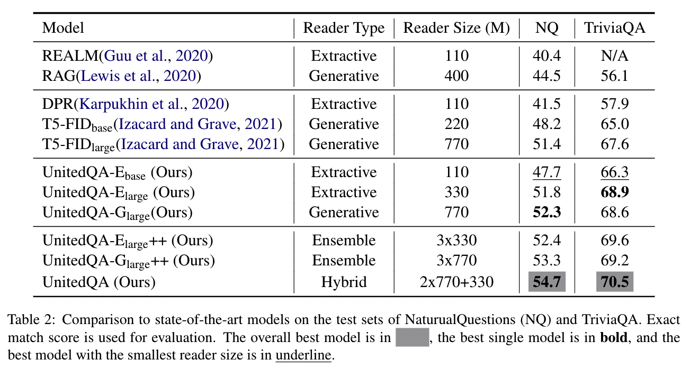
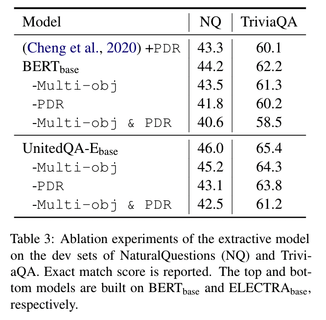
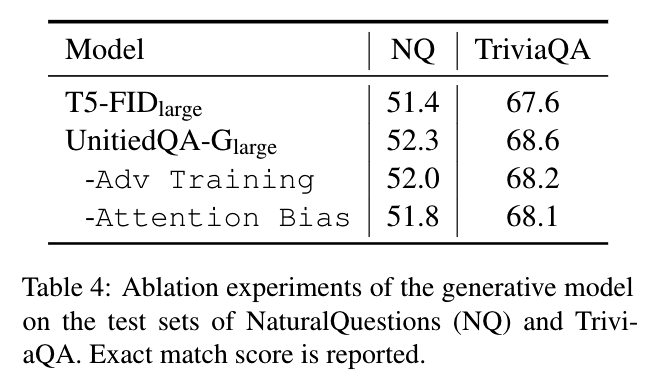
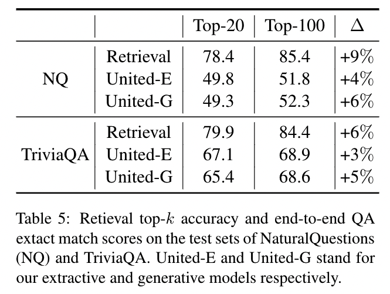

- [x] Round-1: Overview
- [ ] Round-2: Model Implementation Details
- [ ] Round-3: Experiments

## Citation


Cheng, H., Shen, Y., Liu, X., He, P., Chen, W., & Gao, J. (2021).  
UnitedQA: A Hybrid Approach for Open Domain Question Answering.  
https://doi.org/10.48550/arxiv.2101.00178


## Abstract

> To date, most of recent work under the retrieval-reader framework for open-domain QA focuses on either extractive or generative reader exclusively. In this paper, we study a hybrid approach for leveraging the strengths of both models. We apply novel techniques to enhance both extractive and generative readers built upon recent pretrained neural language models, and find that proper training methods can provide large improvement over previous state-of-the-art models. We demonstrate that a simple hybrid approach by combining answers from both readers can efficiently take advantages of extractive and generative answer inference strategies and outperforms single models as well as homogeneous ensembles. Our approach outperforms previous state-of-the-art models by 3.3 and 2.7 points in exact match on NaturalQuestions and TriviaQA respectively.

## What's New

- Question Answeringのタスクにおいて，ExtractiveなモデルとGenerativeなモデルをアンサンブルしたUnitedQAを提案．
- Extractiveモデルを改善 <i class="fa-solid fa-arrow-right"></i> UnitedQA-E
  - Multi-objective for Weakly-supervised QA  
    Cheng et al. (2020)で提案されたmulti-objective formulationを導入
  - Posterior Differential Regularization  
    Cheng et al. (2020)で提案されたPosterior Differential Regularization (PDR)を導入  
- Generativeモデルを改善 <i class="fa-solid fa-arrow-right"></i> UnitedQA-G
  - Decoder Attention Bias  
    デコーダとして使用しているT5のAttentionにバイアスを乗せることでロバスト性を高める
  - Adversarial Training  
    学習方法を改良


Hao Cheng, Ming-Wei Chang, Kenton Lee, Kristina Toutanova. (2020)  
**Probabilistic Assumptions Matter: Improved Models for Distantly-Supervised Document-Level Question Answering**  
ACL  
[Paper Link](https://www.semanticscholar.org/paper/74abf8638a3dde78f20047dc72413780f2c28fb7)  
Influential Citation Count (3), SS-ID (74abf8638a3dde78f20047dc72413780f2c28fb7)  

**ABSTRACT**  
We address the problem of extractive question answering using document-level distant super-vision, pairing questions and relevant documents with answer strings. We compare previously used probability space and distant supervision assumptions (assumptions on the correspondence between the weak answer string labels and possible answer mention spans). We show that these assumptions interact, and that different configurations provide complementary benefits. We demonstrate that a multi-objective model can efficiently combine the advantages of multiple assumptions and outperform the best individual formulation. Our approach outperforms previous state-of-the-art models by 4.3 points in F1 on TriviaQA-Wiki and 1.7 points in Rouge-L on NarrativeQA summaries.



Hao Cheng, Xiaodong Liu, Lis Pereira, Yaoliang Yu, Jianfeng Gao. (2020)  
**Posterior Differential Regularization with f-divergence for Improving Model Robustness**  
NAACL  
[Paper Link](https://www.semanticscholar.org/paper/1a2bed6bed5f28095ebe5793f0c31d38690d6cd4)  
Influential Citation Count (0), SS-ID (1a2bed6bed5f28095ebe5793f0c31d38690d6cd4)  

**ABSTRACT**  
We address the problem of enhancing model robustness through regularization. Specifically, we focus on methods that regularize the model posterior difference between clean and noisy inputs. Theoretically, we provide a connection of two recent methods, Jacobian Regularization and Virtual Adversarial Training, under this framework. Additionally, we generalize the posterior differential regularization to the family of f-divergences and characterize the overall framework in terms of the Jacobian matrix. Empirically, we compare those regularizations and standard BERT training on a diverse set of tasks to provide a comprehensive profile of their effect on model generalization. For both fully supervised and semi-supervised settings, we show that regularizing the posterior difference with f-divergence can result in well-improved model robustness. In particular, with a proper f-divergence, a BERT-base model can achieve comparable generalization as its BERT-large counterpart for in-domain, adversarial and domain shift scenarios, indicating the great potential of the proposed framework for enhancing NLP model robustness.


## Dataset


T. Kwiatkowski, Jennimaria Palomaki, Olivia Redfield, Michael Collins, Ankur P. Parikh, Chris Alberti, D. Epstein, Illia Polosukhin, Jacob Devlin, Kenton Lee, Kristina Toutanova, Llion Jones, Matthew Kelcey, Ming-Wei Chang, Andrew M. Dai, Jakob Uszkoreit, Quoc V. Le, Slav Petrov. (2019)  
**Natural Questions: A Benchmark for Question Answering Research**  
TACL  
[Paper Link](https://www.semanticscholar.org/paper/17dbd7b72029181327732e4d11b52a08ed4630d0)  
Influential Citation Count (124), SS-ID (17dbd7b72029181327732e4d11b52a08ed4630d0)  

**ABSTRACT**  
We present the Natural Questions corpus, a question answering data set. Questions consist of real anonymized, aggregated queries issued to the Google search engine. An annotator is presented with a question along with a Wikipedia page from the top 5 search results, and annotates a long answer (typically a paragraph) and a short answer (one or more entities) if present on the page, or marks null if no long/short answer is present. The public release consists of 307,373 training examples with single annotations; 7,830 examples with 5-way annotations for development data; and a further 7,842 examples with 5-way annotated sequestered as test data. We present experiments validating quality of the data. We also describe analysis of 25-way annotations on 302 examples, giving insights into human variability on the annotation task. We introduce robust metrics for the purposes of evaluating question answering systems; demonstrate high human upper bounds on these metrics; and establish baseline results using competitive methods drawn from related literature.



Mandar Joshi, Eunsol Choi, Daniel S. Weld, Luke Zettlemoyer. (2017)  
**TriviaQA: A Large Scale Distantly Supervised Challenge Dataset for Reading Comprehension**  
ACL  
[Paper Link](https://www.semanticscholar.org/paper/f010affab57b5fcf1cd6be23df79d8ec98c7289c)  
Influential Citation Count (193), SS-ID (f010affab57b5fcf1cd6be23df79d8ec98c7289c)  

**ABSTRACT**  
We present TriviaQA, a challenging reading comprehension dataset containing over 650K question-answer-evidence triples. TriviaQA includes 95K question-answer pairs authored by trivia enthusiasts and independently gathered evidence documents, six per question on average, that provide high quality distant supervision for answering the questions. We show that, in comparison to other recently introduced large-scale datasets, TriviaQA (1) has relatively complex, compositional questions, (2) has considerable syntactic and lexical variability between questions and corresponding answer-evidence sentences, and (3) requires more cross sentence reasoning to find answers. We also present two baseline algorithms: a feature-based classifier and a state-of-the-art neural network, that performs well on SQuAD reading comprehension. Neither approach comes close to human performance (23% and 40% vs. 80%), suggesting that TriviaQA is a challenging testbed that is worth significant future study. Data and code available at -- this http URL


## Model Description

### Training Settings

## Results

### Main Results

- ベースラインのモデル（REALM，RAG，DPR，T5-FID）と比較して精度を大きく向上させることに成功．

### Ablation Study


- BERTベースとELECTRAベースのモデルで提案手法を深掘り．
- Multi-obj，PDRともモデルの性能向上に寄与していることがわかる．

 

---



## References



Pranav Rajpurkar, Jian Zhang, Konstantin Lopyrev, Percy Liang. (2016)  
**SQuAD: 100,000+ Questions for Machine Comprehension of Text**  
EMNLP  
[Paper Link](https://www.semanticscholar.org/paper/05dd7254b632376973f3a1b4d39485da17814df5)  
Influential Citation Count (1068), SS-ID (05dd7254b632376973f3a1b4d39485da17814df5)  

**ABSTRACT**  
We present the Stanford Question Answering Dataset (SQuAD), a new reading comprehension dataset consisting of 100,000+ questions posed by crowdworkers on a set of Wikipedia articles, where the answer to each question is a segment of text from the corresponding reading passage. We analyze the dataset to understand the types of reasoning required to answer the questions, leaning heavily on dependency and constituency trees. We build a strong logistic regression model, which achieves an F1 score of 51.0%, a significant improvement over a simple baseline (20%). However, human performance (86.8%) is much higher, indicating that the dataset presents a good challenge problem for future research.  The dataset is freely available at this https URL





Geoffrey E. Hinton, Oriol Vinyals, J. Dean. (2015)  
**Distilling the Knowledge in a Neural Network**  
ArXiv  
[Paper Link](https://www.semanticscholar.org/paper/0c908739fbff75f03469d13d4a1a07de3414ee19)  
Influential Citation Count (1219), SS-ID (0c908739fbff75f03469d13d4a1a07de3414ee19)  

**ABSTRACT**  
A very simple way to improve the performance of almost any machine learning algorithm is to train many different models on the same data and then to average their predictions. Unfortunately, making predictions using a whole ensemble of models is cumbersome and may be too computationally expensive to allow deployment to a large number of users, especially if the individual models are large neural nets. Caruana and his collaborators have shown that it is possible to compress the knowledge in an ensemble into a single model which is much easier to deploy and we develop this approach further using a different compression technique. We achieve some surprising results on MNIST and we show that we can significantly improve the acoustic model of a heavily used commercial system by distilling the knowledge in an ensemble of models into a single model. We also introduce a new type of ensemble composed of one or more full models and many specialist models which learn to distinguish fine-grained classes that the full models confuse. Unlike a mixture of experts, these specialist models can be trained rapidly and in parallel.





Zhiguo Wang, Patrick Ng, Xiaofei Ma, Ramesh Nallapati, Bing Xiang. (2019)  
**Multi-passage BERT: A Globally Normalized BERT Model for Open-domain Question Answering**  
EMNLP  
[Paper Link](https://www.semanticscholar.org/paper/0cf535110808d33fdf4db3ffa1621dea16e29c0d)  
Influential Citation Count (16), SS-ID (0cf535110808d33fdf4db3ffa1621dea16e29c0d)  

**ABSTRACT**  
BERT model has been successfully applied to open-domain QA tasks. However, previous work trains BERT by viewing passages corresponding to the same question as independent training instances, which may cause incomparable scores for answers from different passages. To tackle this issue, we propose a multi-passage BERT model to globally normalize answer scores across all passages of the same question, and this change enables our QA model find better answers by utilizing more passages. In addition, we find that splitting articles into passages with the length of 100 words by sliding window improves performance by 4%. By leveraging a passage ranker to select high-quality passages, multi-passage BERT gains additional 2%. Experiments on four standard benchmarks showed that our multi-passage BERT outperforms all state-of-the-art models on all benchmarks. In particular, on the OpenSQuAD dataset, our model gains 21.4% EM and 21.5% F1 over all non-BERT models, and 5.8% EM and 6.5% F1 over BERT-based models.





Danqi Chen, Adam Fisch, J. Weston, Antoine Bordes. (2017)  
**Reading Wikipedia to Answer Open-Domain Questions**  
ACL  
[Paper Link](https://www.semanticscholar.org/paper/104715e1097b7ebee436058bfd9f45540f269845)  
Influential Citation Count (281), SS-ID (104715e1097b7ebee436058bfd9f45540f269845)  

**ABSTRACT**  
This paper proposes to tackle open- domain question answering using Wikipedia as the unique knowledge source: the answer to any factoid question is a text span in a Wikipedia article. This task of machine reading at scale combines the challenges of document retrieval (finding the relevant articles) with that of machine comprehension of text (identifying the answer spans from those articles). Our approach combines a search component based on bigram hashing and TF-IDF matching with a multi-layer recurrent neural network model trained to detect answers in Wikipedia paragraphs. Our experiments on multiple existing QA datasets indicate that (1) both modules are highly competitive with respect to existing counterparts and (2) multitask learning using distant supervision on their combination is an effective complete system on this challenging task.





T. Kwiatkowski, Jennimaria Palomaki, Olivia Redfield, Michael Collins, Ankur P. Parikh, Chris Alberti, D. Epstein, Illia Polosukhin, Jacob Devlin, Kenton Lee, Kristina Toutanova, Llion Jones, Matthew Kelcey, Ming-Wei Chang, Andrew M. Dai, Jakob Uszkoreit, Quoc V. Le, Slav Petrov. (2019)  
**Natural Questions: A Benchmark for Question Answering Research**  
TACL  
[Paper Link](https://www.semanticscholar.org/paper/17dbd7b72029181327732e4d11b52a08ed4630d0)  
Influential Citation Count (124), SS-ID (17dbd7b72029181327732e4d11b52a08ed4630d0)  

**ABSTRACT**  
We present the Natural Questions corpus, a question answering data set. Questions consist of real anonymized, aggregated queries issued to the Google search engine. An annotator is presented with a question along with a Wikipedia page from the top 5 search results, and annotates a long answer (typically a paragraph) and a short answer (one or more entities) if present on the page, or marks null if no long/short answer is present. The public release consists of 307,373 training examples with single annotations; 7,830 examples with 5-way annotations for development data; and a further 7,842 examples with 5-way annotated sequestered as test data. We present experiments validating quality of the data. We also describe analysis of 25-way annotations on 302 examples, giving insights into human variability on the annotation task. We introduce robust metrics for the purposes of evaluating question answering systems; demonstrate high human upper bounds on these metrics; and establish baseline results using competitive methods drawn from related literature.





Hao Cheng, Xiaodong Liu, Lis Pereira, Yaoliang Yu, Jianfeng Gao. (2020)  
**Posterior Differential Regularization with f-divergence for Improving Model Robustness**  
NAACL  
[Paper Link](https://www.semanticscholar.org/paper/1a2bed6bed5f28095ebe5793f0c31d38690d6cd4)  
Influential Citation Count (0), SS-ID (1a2bed6bed5f28095ebe5793f0c31d38690d6cd4)  

**ABSTRACT**  
We address the problem of enhancing model robustness through regularization. Specifically, we focus on methods that regularize the model posterior difference between clean and noisy inputs. Theoretically, we provide a connection of two recent methods, Jacobian Regularization and Virtual Adversarial Training, under this framework. Additionally, we generalize the posterior differential regularization to the family of f-divergences and characterize the overall framework in terms of the Jacobian matrix. Empirically, we compare those regularizations and standard BERT training on a diverse set of tasks to provide a comprehensive profile of their effect on model generalization. For both fully supervised and semi-supervised settings, we show that regularizing the posterior difference with f-divergence can result in well-improved model robustness. In particular, with a proper f-divergence, a BERT-base model can achieve comparable generalization as its BERT-large counterpart for in-domain, adversarial and domain shift scenarios, indicating the great potential of the proposed framework for enhancing NLP model robustness.





Sewon Min, Danqi Chen, Hannaneh Hajishirzi, Luke Zettlemoyer. (2019)  
**A Discrete Hard EM Approach for Weakly Supervised Question Answering**  
EMNLP  
[Paper Link](https://www.semanticscholar.org/paper/30eff53e981695c7296d258b8dc44b4c7b482a0c)  
Influential Citation Count (19), SS-ID (30eff53e981695c7296d258b8dc44b4c7b482a0c)  

**ABSTRACT**  
Many question answering (QA) tasks only provide weak supervision for how the answer should be computed. For example, TriviaQA answers are entities that can be mentioned multiple times in supporting documents, while DROP answers can be computed by deriving many different equations from numbers in the reference text. In this paper, we show it is possible to convert such tasks into discrete latent variable learning problems with a precomputed, task-specific set of possible solutions (e.g. different mentions or equations) that contains one correct option. We then develop a hard EM learning scheme that computes gradients relative to the most likely solution at each update. Despite its simplicity, we show that this approach significantly outperforms previous methods on six QA tasks, including absolute gains of 2–10%, and achieves the state-of-the-art on five of them. Using hard updates instead of maximizing marginal likelihood is key to these results as it encourages the model to find the one correct answer, which we show through detailed qualitative analysis.





Yingqi Qu, Yuchen Ding, Jing Liu, Kai Liu, Ruiyang Ren, Xin Zhao, Daxiang Dong, Hua Wu, Haifeng Wang. (2020)  
**RocketQA: An Optimized Training Approach to Dense Passage Retrieval for Open-Domain Question Answering**  
NAACL  
[Paper Link](https://www.semanticscholar.org/paper/3416e5e5694855f7175125b5fe2e0b659c3cdbfa)  
Influential Citation Count (36), SS-ID (3416e5e5694855f7175125b5fe2e0b659c3cdbfa)  

**ABSTRACT**  
In open-domain question answering, dense passage retrieval has become a new paradigm to retrieve relevant passages for finding answers. Typically, the dual-encoder architecture is adopted to learn dense representations of questions and passages for semantic matching. However, it is difficult to effectively train a dual-encoder due to the challenges including the discrepancy between training and inference, the existence of unlabeled positives and limited training data. To address these challenges, we propose an optimized training approach, called RocketQA, to improving dense passage retrieval. We make three major technical contributions in RocketQA, namely cross-batch negatives, denoised hard negatives and data augmentation. The experiment results show that RocketQA significantly outperforms previous state-of-the-art models on both MSMARCO and Natural Questions. We also conduct extensive experiments to examine the effectiveness of the three strategies in RocketQA. Besides, we demonstrate that the performance of end-to-end QA can be improved based on our RocketQA retriever.





Christopher Clark, Matt Gardner. (2017)  
**Simple and Effective Multi-Paragraph Reading Comprehension**  
ACL  
[Paper Link](https://www.semanticscholar.org/paper/3c78c6df5eb1695b6a399e346dde880af27d1016)  
Influential Citation Count (48), SS-ID (3c78c6df5eb1695b6a399e346dde880af27d1016)  

**ABSTRACT**  
We consider the problem of adapting neural paragraph-level question answering models to the case where entire documents are given as input. Our proposed solution trains models to produce well calibrated confidence scores for their results on individual paragraphs. We sample multiple paragraphs from the documents during training, and use a shared-normalization training objective that encourages the model to produce globally correct output. We combine this method with a state-of-the-art pipeline for training models on document QA data. Experiments demonstrate strong performance on several document QA datasets. Overall, we are able to achieve a score of 71.3 F1 on the web portion of TriviaQA, a large improvement from the 56.7 F1 of the previous best system.





Colin Raffel, Noam M. Shazeer, Adam Roberts, Katherine Lee, Sharan Narang, Michael Matena, Yanqi Zhou, Wei Li, Peter J. Liu. (2019)  
**Exploring the Limits of Transfer Learning with a Unified Text-to-Text Transformer**  
J. Mach. Learn. Res.  
[Paper Link](https://www.semanticscholar.org/paper/3cfb319689f06bf04c2e28399361f414ca32c4b3)  
Influential Citation Count (634), SS-ID (3cfb319689f06bf04c2e28399361f414ca32c4b3)  

**ABSTRACT**  
Transfer learning, where a model is first pre-trained on a data-rich task before being fine-tuned on a downstream task, has emerged as a powerful technique in natural language processing (NLP). The effectiveness of transfer learning has given rise to a diversity of approaches, methodology, and practice. In this paper, we explore the landscape of transfer learning techniques for NLP by introducing a unified framework that converts every language problem into a text-to-text format. Our systematic study compares pre-training objectives, architectures, unlabeled datasets, transfer approaches, and other factors on dozens of language understanding tasks. By combining the insights from our exploration with scale and our new "Colossal Clean Crawled Corpus", we achieve state-of-the-art results on many benchmarks covering summarization, question answering, text classification, and more. To facilitate future work on transfer learning for NLP, we release our dataset, pre-trained models, and code.





I. Csiszár, P. Shields. (2004)  
**Information Theory and Statistics: A Tutorial**  
Found. Trends Commun. Inf. Theory  
[Paper Link](https://www.semanticscholar.org/paper/46cc7d0d9ab944d678deeaeb899e3c2ffd745d6c)  
Influential Citation Count (49), SS-ID (46cc7d0d9ab944d678deeaeb899e3c2ffd745d6c)  

**ABSTRACT**  
This tutorial is concerned with applications of information theory concepts in statistics, in the finite alphabet setting. The information measure known as information divergence or Kullback-Leibler distance or relative entropy plays a key role, often with a geometric flavor as an analogue of squared Euclidean distance, as in the concepts of I-projection, I-radius and I-centroid. The topics covered include large deviations, hypothesis testing, maximum likelihood estimation in exponential families, analysis of contingency tables, and iterative algorithms with an "information geometry" background. Also, an introduction is provided to the theory of universal coding, and to statistical inference via the minimum description length principle motivated by that theory.





Takeru Miyato, S. Maeda, Masanori Koyama, S. Ishii. (2017)  
**Virtual Adversarial Training: A Regularization Method for Supervised and Semi-Supervised Learning**  
IEEE Transactions on Pattern Analysis and Machine Intelligence  
[Paper Link](https://www.semanticscholar.org/paper/4b1c6f6521da545892f3f5dc39461584d4a27ec0)  
Influential Citation Count (282), SS-ID (4b1c6f6521da545892f3f5dc39461584d4a27ec0)  

**ABSTRACT**  
We propose a new regularization method based on virtual adversarial loss: a new measure of local smoothness of the conditional label distribution given input. Virtual adversarial loss is defined as the robustness of the conditional label distribution around each input data point against local perturbation. Unlike adversarial training, our method defines the adversarial direction without label information and is hence applicable to semi-supervised learning. Because the directions in which we smooth the model are only “virtually” adversarial, we call our method virtual adversarial training (VAT). The computational cost of VAT is relatively low. For neural networks, the approximated gradient of virtual adversarial loss can be computed with no more than two pairs of forward- and back-propagations. In our experiments, we applied VAT to supervised and semi-supervised learning tasks on multiple benchmark datasets. With a simple enhancement of the algorithm based on the entropy minimization principle, our VAT achieves state-of-the-art performance for semi-supervised learning tasks on SVHN and CIFAR-10.





Pranav Rajpurkar, Robin Jia, Percy Liang. (2018)  
**Know What You Don’t Know: Unanswerable Questions for SQuAD**  
ACL  
[Paper Link](https://www.semanticscholar.org/paper/4d1c856275744c0284312a3a50efb6ca9dc4cd4c)  
Influential Citation Count (340), SS-ID (4d1c856275744c0284312a3a50efb6ca9dc4cd4c)  

**ABSTRACT**  
Extractive reading comprehension systems can often locate the correct answer to a question in a context document, but they also tend to make unreliable guesses on questions for which the correct answer is not stated in the context. Existing datasets either focus exclusively on answerable questions, or use automatically generated unanswerable questions that are easy to identify. To address these weaknesses, we present SQuADRUn, a new dataset that combines the existing Stanford Question Answering Dataset (SQuAD) with over 50,000 unanswerable questions written adversarially by crowdworkers to look similar to answerable ones. To do well on SQuADRUn, systems must not only answer questions when possible, but also determine when no answer is supported by the paragraph and abstain from answering. SQuADRUn is a challenging natural language understanding task for existing models: a strong neural system that gets 86% F1 on SQuAD achieves only 66% F1 on SQuADRUn. We release SQuADRUn to the community as the successor to SQuAD.





Patrick Lewis, Ethan Perez, Aleksandara Piktus, Fabio Petroni, Vladimir Karpukhin, Naman Goyal, Heinrich Kuttler, M. Lewis, Wen-tau Yih, Tim Rocktäschel, Sebastian Riedel, Douwe Kiela. (2020)  
**Retrieval-Augmented Generation for Knowledge-Intensive NLP Tasks**  
NeurIPS  
[Paper Link](https://www.semanticscholar.org/paper/58ed1fbaabe027345f7bb3a6312d41c5aac63e22)  
Influential Citation Count (54), SS-ID (58ed1fbaabe027345f7bb3a6312d41c5aac63e22)  

**ABSTRACT**  
Large pre-trained language models have been shown to store factual knowledge in their parameters, and achieve state-of-the-art results when fine-tuned on downstream NLP tasks. However, their ability to access and precisely manipulate knowledge is still limited, and hence on knowledge-intensive tasks, their performance lags behind task-specific architectures. Additionally, providing provenance for their decisions and updating their world knowledge remain open research problems. Pre-trained models with a differentiable access mechanism to explicit non-parametric memory can overcome this issue, but have so far been only investigated for extractive downstream tasks. We explore a general-purpose fine-tuning recipe for retrieval-augmented generation (RAG) -- models which combine pre-trained parametric and non-parametric memory for language generation. We introduce RAG models where the parametric memory is a pre-trained seq2seq model and the non-parametric memory is a dense vector index of Wikipedia, accessed with a pre-trained neural retriever. We compare two RAG formulations, one which conditions on the same retrieved passages across the whole generated sequence, the other can use different passages per token. We fine-tune and evaluate our models on a wide range of knowledge-intensive NLP tasks and set the state-of-the-art on three open domain QA tasks, outperforming parametric seq2seq models and task-specific retrieve-and-extract architectures. For language generation tasks, we find that RAG models generate more specific, diverse and factual language than a state-of-the-art parametric-only seq2seq baseline.





Song Han, Huizi Mao, W. Dally. (2015)  
**Deep Compression: Compressing Deep Neural Network with Pruning, Trained Quantization and Huffman Coding**  
ICLR  
[Paper Link](https://www.semanticscholar.org/paper/642d0f49b7826adcf986616f4af77e736229990f)  
Influential Citation Count (611), SS-ID (642d0f49b7826adcf986616f4af77e736229990f)  

**ABSTRACT**  
Neural networks are both computationally intensive and memory intensive, making them difficult to deploy on embedded systems with limited hardware resources. To address this limitation, we introduce "deep compression", a three stage pipeline: pruning, trained quantization and Huffman coding, that work together to reduce the storage requirement of neural networks by 35x to 49x without affecting their accuracy. Our method first prunes the network by learning only the important connections. Next, we quantize the weights to enforce weight sharing, finally, we apply Huffman coding. After the first two steps we retrain the network to fine tune the remaining connections and the quantized centroids. Pruning, reduces the number of connections by 9x to 13x; Quantization then reduces the number of bits that represent each connection from 32 to 5. On the ImageNet dataset, our method reduced the storage required by AlexNet by 35x, from 240MB to 6.9MB, without loss of accuracy. Our method reduced the size of VGG-16 by 49x from 552MB to 11.3MB, again with no loss of accuracy. This allows fitting the model into on-chip SRAM cache rather than off-chip DRAM memory. Our compression method also facilitates the use of complex neural networks in mobile applications where application size and download bandwidth are constrained. Benchmarked on CPU, GPU and mobile GPU, compressed network has 3x to 4x layerwise speedup and 3x to 7x better energy efficiency.





E. Voorhees. (1999)  
**The TREC-8 Question Answering Track Report**  
TREC  
[Paper Link](https://www.semanticscholar.org/paper/646d4888871aca2a25111eb2520e4c47e253b014)  
Influential Citation Count (157), SS-ID (646d4888871aca2a25111eb2520e4c47e253b014)  

**ABSTRACT**  
The TREC-8 Question Answering track was the first large-scale evaluation of domain-independent question answering systems. This paper summarizes the results of the track by giving a brief overview of the different approaches taken to solve the problem. The most accurate systems found a correct response for more than 2/3 of the questions. Relatively simple bag-of-words approaches were adequate for finding answers when responses could be as long as a paragraph (250 bytes), but more sophisticated processing was necessary for more direct responses (50 bytes).
 
 The TREC-8 Question Answering track was an initial eort to bring the benets of large-scale evaluation to bear on a question answering (QA) task. The goal in the QA task is to retrieve small snippets of text that contain the actual answer to a question rather than the document lists traditionally returned by text retrieval systems. The assumption is that users would usually prefer to be given the answer rather than and the answer themselves in a document.
 
 This paper summarizes the retrieval results of the track; a companion paper (\The TREC-8 Question Answering Track Evaluation") gives details about how the evaluation was implemented. By necessity, a track report can give only an overview of the different approaches used in the track. Readers are urged to consult the participants' papers elsewhere in the Proceedings for details regarding a particular approach.





Hao Cheng, Ming-Wei Chang, Kenton Lee, Kristina Toutanova. (2020)  
**Probabilistic Assumptions Matter: Improved Models for Distantly-Supervised Document-Level Question Answering**  
ACL  
[Paper Link](https://www.semanticscholar.org/paper/74abf8638a3dde78f20047dc72413780f2c28fb7)  
Influential Citation Count (3), SS-ID (74abf8638a3dde78f20047dc72413780f2c28fb7)  

**ABSTRACT**  
We address the problem of extractive question answering using document-level distant super-vision, pairing questions and relevant documents with answer strings. We compare previously used probability space and distant supervision assumptions (assumptions on the correspondence between the weak answer string labels and possible answer mention spans). We show that these assumptions interact, and that different configurations provide complementary benefits. We demonstrate that a multi-objective model can efficiently combine the advantages of multiple assumptions and outperform the best individual formulation. Our approach outperforms previous state-of-the-art models by 4.3 points in F1 on TriviaQA-Wiki and 1.7 points in Rouge-L on NarrativeQA summaries.





Kevin Clark, Minh-Thang Luong, Quoc V. Le, Christopher D. Manning. (2020)  
**ELECTRA: Pre-training Text Encoders as Discriminators Rather Than Generators**  
ICLR  
[Paper Link](https://www.semanticscholar.org/paper/756810258e3419af76aff38c895c20343b0602d0)  
Influential Citation Count (288), SS-ID (756810258e3419af76aff38c895c20343b0602d0)  

**ABSTRACT**  
While masked language modeling (MLM) pre-training methods such as BERT produce excellent results on downstream NLP tasks, they require large amounts of compute to be effective. These approaches corrupt the input by replacing some tokens with [MASK] and then train a model to reconstruct the original tokens. As an alternative, we propose a more sample-efficient pre-training task called replaced token detection. Instead of masking the input, our approach corrupts it by replacing some input tokens with plausible alternatives sampled from a small generator network. Then, instead of training a model that predicts the original identities of the corrupted tokens, we train a discriminative model that predicts whether each token in the corrupted input was replaced by a generator sample or not. Thorough experiments demonstrate this new pre-training task is more efficient than MLM because the model learns from all input tokens rather than just the small subset that was masked out. As a result, the contextual representations learned by our approach substantially outperform the ones learned by methods such as BERT and XLNet given the same model size, data, and compute. The gains are particularly strong for small models; for example, we train a model on one GPU for 4 days that outperforms GPT (trained using 30x more compute) on the GLUE natural language understanding benchmark. Our approach also works well at scale, where we match the performance of RoBERTa, the current state-of-the-art pre-trained transformer, while using less than 1/4 of the compute.





Vladimir Karpukhin, Barlas Oğuz, Sewon Min, Patrick Lewis, Ledell Yu Wu, Sergey Edunov, Danqi Chen, Wen-tau Yih. (2020)  
**Dense Passage Retrieval for Open-Domain Question Answering**  
EMNLP  
[Paper Link](https://www.semanticscholar.org/paper/79cd9f77e5258f62c0e15d11534aea6393ef73fe)  
Influential Citation Count (226), SS-ID (79cd9f77e5258f62c0e15d11534aea6393ef73fe)  

**ABSTRACT**  
Open-domain question answering relies on efficient passage retrieval to select candidate contexts, where traditional sparse vector space models, such as TF-IDF or BM25, are the de facto method. In this work, we show that retrieval can be practically implemented using dense representations alone, where embeddings are learned from a small number of questions and passages by a simple dual-encoder framework. When evaluated on a wide range of open-domain QA datasets, our dense retriever outperforms a strong Lucene-BM25 system largely by 9%-19% absolute in terms of top-20 passage retrieval accuracy, and helps our end-to-end QA system establish new state-of-the-art on multiple open-domain QA benchmarks.





Kelvin Guu, Kenton Lee, Z. Tung, Panupong Pasupat, Ming-Wei Chang. (2020)  
**REALM: Retrieval-Augmented Language Model Pre-Training**  
ArXiv  
[Paper Link](https://www.semanticscholar.org/paper/832fff14d2ed50eb7969c4c4b976c35776548f56)  
Influential Citation Count (63), SS-ID (832fff14d2ed50eb7969c4c4b976c35776548f56)  

**ABSTRACT**  
Language model pre-training has been shown to capture a surprising amount of world knowledge, crucial for NLP tasks such as question answering. However, this knowledge is stored implicitly in the parameters of a neural network, requiring ever-larger networks to cover more facts.  To capture knowledge in a more modular and interpretable way, we augment language model pre-training with a latent knowledge retriever, which allows the model to retrieve and attend over documents from a large corpus such as Wikipedia, used during pre-training, fine-tuning and inference. For the first time, we show how to pre-train such a knowledge retriever in an unsupervised manner, using masked language modeling as the learning signal and backpropagating through a retrieval step that considers millions of documents.  We demonstrate the effectiveness of Retrieval-Augmented Language Model pre-training (REALM) by fine-tuning on the challenging task of Open-domain Question Answering (Open-QA). We compare against state-of-the-art models for both explicit and implicit knowledge storage on three popular Open-QA benchmarks, and find that we outperform all previous methods by a significant margin (4-16% absolute accuracy), while also providing qualitative benefits such as interpretability and modularity.





Kenton Lee, Ming-Wei Chang, Kristina Toutanova. (2019)  
**Latent Retrieval for Weakly Supervised Open Domain Question Answering**  
ACL  
[Paper Link](https://www.semanticscholar.org/paper/a81874b4a651a740fffbfc47ef96515e8c7f782f)  
Influential Citation Count (99), SS-ID (a81874b4a651a740fffbfc47ef96515e8c7f782f)  

**ABSTRACT**  
Recent work on open domain question answering (QA) assumes strong supervision of the supporting evidence and/or assumes a blackbox information retrieval (IR) system to retrieve evidence candidates. We argue that both are suboptimal, since gold evidence is not always available, and QA is fundamentally different from IR. We show for the first time that it is possible to jointly learn the retriever and reader from question-answer string pairs and without any IR system. In this setting, evidence retrieval from all of Wikipedia is treated as a latent variable. Since this is impractical to learn from scratch, we pre-train the retriever with an Inverse Cloze Task. We evaluate on open versions of five QA datasets. On datasets where the questioner already knows the answer, a traditional IR system such as BM25 is sufficient. On datasets where a user is genuinely seeking an answer, we show that learned retrieval is crucial, outperforming BM25 by up to 19 points in exact match.





Jianfeng Gao, Michel Galley, Lihong Li. (2018)  
**Neural Approaches to Conversational AI**  
Found. Trends Inf. Retr.  
[Paper Link](https://www.semanticscholar.org/paper/a94c0fc00c7a823cebd2d17094a2d7ab3652a5b6)  
Influential Citation Count (30), SS-ID (a94c0fc00c7a823cebd2d17094a2d7ab3652a5b6)  

**ABSTRACT**  
The present paper surveys neural approaches to conversational AI that have been developed in the last few years. We group conversational systems into three categories: (1) question answering agents, (2) task-oriented dialogue agents, and (3) chatbots. For each category, we present a review of state-of-the-art neural approaches, draw the connection between them and traditional approaches, and discuss the progress that has been made and challenges still being faced, using specific systems and models as case studies.





Lis Pereira, Xiaodong Liu, Hao Cheng, Hoifung Poon, Jianfeng Gao, I. Kobayashi. (2021)  
**Targeted Adversarial Training for Natural Language Understanding**  
NAACL  
[Paper Link](https://www.semanticscholar.org/paper/a9e8c7544b41ff133b04a321179c22f7da3c3cdc)  
Influential Citation Count (1), SS-ID (a9e8c7544b41ff133b04a321179c22f7da3c3cdc)  

**ABSTRACT**  
We present a simple yet effective Targeted Adversarial Training (TAT) algorithm to improve adversarial training for natural language understanding. The key idea is to introspect current mistakes and prioritize adversarial training steps to where the model errs the most. Experiments show that TAT can significantly improve accuracy over standard adversarial training on GLUE and attain new state-of-the-art zero-shot results on XNLI. Our code will be released upon acceptance of the paper.





Haoming Jiang, Pengcheng He, Weizhu Chen, Xiaodong Liu, Jianfeng Gao, T. Zhao. (2019)  
**SMART: Robust and Efficient Fine-Tuning for Pre-trained Natural Language Models through Principled Regularized Optimization**  
ACL  
[Paper Link](https://www.semanticscholar.org/paper/ab70853cd5912c470f6ff95e95481980f0a2a41b)  
Influential Citation Count (23), SS-ID (ab70853cd5912c470f6ff95e95481980f0a2a41b)  

**ABSTRACT**  
Transfer learning has fundamentally changed the landscape of natural language processing (NLP). Many state-of-the-art models are first pre-trained on a large text corpus and then fine-tuned on downstream tasks. However, due to limited data resources from downstream tasks and the extremely high complexity of pre-trained models, aggressive fine-tuning often causes the fine-tuned model to overfit the training data of downstream tasks and fail to generalize to unseen data. To address such an issue in a principled manner, we propose a new learning framework for robust and efficient fine-tuning for pre-trained models to attain better generalization performance. The proposed framework contains two important ingredients: 1. Smoothness-inducing regularization, which effectively manages the complexity of the model; 2. Bregman proximal point optimization, which is an instance of trust-region methods and can prevent aggressive updating. Our experiments show that the proposed framework achieves new state-of-the-art performance on a number of NLP tasks including GLUE, SNLI, SciTail and ANLI. Moreover, it also outperforms the state-of-the-art T5 model, which is the largest pre-trained model containing 11 billion parameters, on GLUE.





M. Greenwood. (2005)  
**Open-domain question answering**  
  
[Paper Link](https://www.semanticscholar.org/paper/b5403ef8446c2106d35155e7f05a45977d0c7f85)  
Influential Citation Count (2), SS-ID (b5403ef8446c2106d35155e7f05a45977d0c7f85)  

**ABSTRACT**  
A sparse representation is known to be an effective means to encode precise lexical cues in information retrieval tasks by associating each dimension with a unique ngram-based feature. However, it has often relied on term frequency (such as tf-idf and BM25) or hand-engineered features that are coarse-grained (document-level) and often task-specific, hence not easily generalizable and not appropriate for finegrained (word or phrase-level) retrieval. In this work, we propose an effective method for learning a highly contextualized, word-level sparse representation by utilizing rectified self-attention weights on the neighboring n-grams. We kernelize the inner product space during training for memory efficiency without the explicit mapping of the large sparse vectors. We particularly focus on the application of our model to phrase retrieval problem, which has recently shown to be a promising direction for open-domain question answering (QA) and requires lexically sensitive phrase encoding. We demonstrate the effectiveness of the learned sparse representations by not only drastically improving the phrase retrieval accuracy (by more than 4%), but also outperforming all other (pipeline-based) open-domain QA methods with up to x97 faster inference in SQUADOPEN and CURATEDTREC.1





Yankai Lin, Haozhe Ji, Zhiyuan Liu, Maosong Sun. (2018)  
**Denoising Distantly Supervised Open-Domain Question Answering**  
ACL  
[Paper Link](https://www.semanticscholar.org/paper/ba1382a0574baa0345fd727f259bc86797fe1381)  
Influential Citation Count (21), SS-ID (ba1382a0574baa0345fd727f259bc86797fe1381)  

**ABSTRACT**  
Distantly supervised open-domain question answering (DS-QA) aims to find answers in collections of unlabeled text. Existing DS-QA models usually retrieve related paragraphs from a large-scale corpus and apply reading comprehension technique to extract answers from the most relevant paragraph. They ignore the rich information contained in other paragraphs. Moreover, distant supervision data inevitably accompanies with the wrong labeling problem, and these noisy data will substantially degrade the performance of DS-QA. To address these issues, we propose a novel DS-QA model which employs a paragraph selector to filter out those noisy paragraphs and a paragraph reader to extract the correct answer from those denoised paragraphs. Experimental results on real-world datasets show that our model can capture useful information from noisy data and achieve significant improvements on DS-QA as compared to all baselines.





Gautier Izacard, Edouard Grave. (2020)  
**Leveraging Passage Retrieval with Generative Models for Open Domain Question Answering**  
EACL  
[Paper Link](https://www.semanticscholar.org/paper/bde0c85ed3d61de2a8874ddad70497b3d68bc8ad)  
Influential Citation Count (44), SS-ID (bde0c85ed3d61de2a8874ddad70497b3d68bc8ad)  

**ABSTRACT**  
Generative models for open domain question answering have proven to be competitive, without resorting to external knowledge. While promising, this approach requires to use models with billions of parameters, which are expensive to train and query. In this paper, we investigate how much these models can benefit from retrieving text passages, potentially containing evidence. We obtain state-of-the-art results on the Natural Questions and TriviaQA open benchmarks. Interestingly, we observe that the performance of this method significantly improves when increasing the number of retrieved passages. This is evidence that sequence-to-sequence models offers a flexible framework to efficiently aggregate and combine evidence from multiple passages.





M. Lewis, Marjan Ghazvininejad, Gargi Ghosh, Armen Aghajanyan, Sida Wang, Luke Zettlemoyer. (2020)  
**Pre-training via Paraphrasing**  
NeurIPS  
[Paper Link](https://www.semanticscholar.org/paper/c00ba15810496669d47d2ed5b627e6c7d2b1f6aa)  
Influential Citation Count (26), SS-ID (c00ba15810496669d47d2ed5b627e6c7d2b1f6aa)  

**ABSTRACT**  
We introduce MARGE, a pre-trained sequence-to-sequence model learned with an unsupervised multi-lingual multi-document paraphrasing objective. MARGE provides an alternative to the dominant masked language modeling paradigm, where we self-supervise the reconstruction of target text by retrieving a set of related texts (in many languages) and conditioning on them to maximize the likelihood of generating the original. We show it is possible to jointly learn to do retrieval and reconstruction, given only a random initialization. The objective noisily captures aspects of paraphrase, translation, multi-document summarization, and information retrieval, allowing for strong zero-shot performance on several tasks. For example, with no additional task-specific training we achieve BLEU scores of up to 35.8 for document translation. We further show that fine-tuning gives strong performance on a range of discriminative and generative tasks in many languages, making MARGE the most generally applicable pre-training method to date.





Patrick Lewis, Pontus Stenetorp, Sebastian Riedel. (2020)  
**Question and Answer Test-Train Overlap in Open-Domain Question Answering Datasets**  
EACL  
[Paper Link](https://www.semanticscholar.org/paper/cb58542c94ce83b09f5d3809e69518ba52709c92)  
Influential Citation Count (15), SS-ID (cb58542c94ce83b09f5d3809e69518ba52709c92)  

**ABSTRACT**  
Ideally Open-Domain Question Answering models should exhibit a number of competencies, ranging from simply memorizing questions seen at training time, to answering novel question formulations with answers seen during training, to generalizing to completely novel questions with novel answers. However, single aggregated test set scores do not show the full picture of what capabilities models truly have. In this work, we perform a detailed study of the test sets of three popular open-domain benchmark datasets with respect to these competencies. We find that 30% of test-set questions have a near-duplicate paraphrase in their corresponding train sets. In addition, we find that 60-70% of answers in the test sets are also present in the train sets. Using these findings, we evaluate a variety of popular open-domain models to obtain greater insight into what extent they can generalize, and what drives their overall performance. We find that all models perform substantially worse on questions that cannot be memorized from train sets, with a mean absolute performance difference of 61% between repeated and non-repeated data. Finally we show that simple nearest-neighbor models outperform a BART closed-book QA model, further highlighting the role that train set memorization plays in these benchmarks





Itay Hubara, Matthieu Courbariaux, Daniel Soudry, Ran El-Yaniv, Yoshua Bengio. (2016)  
**Quantized Neural Networks: Training Neural Networks with Low Precision Weights and Activations**  
J. Mach. Learn. Res.  
[Paper Link](https://www.semanticscholar.org/paper/d2e4147eecae6f914e9e1e9aece8fdd2eaed809f)  
Influential Citation Count (106), SS-ID (d2e4147eecae6f914e9e1e9aece8fdd2eaed809f)  

**ABSTRACT**  
We introduce a method to train Quantized Neural Networks (QNNs) -- neural networks with extremely low precision (e.g., 1-bit) weights and activations, at run-time. At traintime the quantized weights and activations are used for computing the parameter gradients. During the forward pass, QNNs drastically reduce memory size and accesses, and replace most arithmetic operations with bit-wise operations. As a result, power consumption is expected to be drastically reduced. We trained QNNs over the MNIST, CIFAR-10, SVHN and ImageNet datasets. The resulting QNNs achieve prediction accuracy comparable to their 32-bit counterparts. For example, our quantized version of AlexNet with 1-bit weights and 2-bit activations achieves 51% top-1 accuracy. Moreover, we quantize the parameter gradients to 6-bits as well which enables gradients computation using only bit-wise operation. Quantized recurrent neural networks were tested over the Penn Treebank dataset, and achieved comparable accuracy as their 32-bit counterparts using only 4-bits. Last but not least, we programmed a binary matrix multiplication GPU kernel with which it is possible to run our MNIST QNN 7 times faster than with an unoptimized GPU kernel, without suffering any loss in classification accuracy. The QNN code is available online.





Jacob Devlin, Ming-Wei Chang, Kenton Lee, Kristina Toutanova. (2019)  
**BERT: Pre-training of Deep Bidirectional Transformers for Language Understanding**  
NAACL  
[Paper Link](https://www.semanticscholar.org/paper/df2b0e26d0599ce3e70df8a9da02e51594e0e992)  
Influential Citation Count (9978), SS-ID (df2b0e26d0599ce3e70df8a9da02e51594e0e992)  

**ABSTRACT**  
We introduce a new language representation model called BERT, which stands for Bidirectional Encoder Representations from Transformers. Unlike recent language representation models (Peters et al., 2018a; Radford et al., 2018), BERT is designed to pre-train deep bidirectional representations from unlabeled text by jointly conditioning on both left and right context in all layers. As a result, the pre-trained BERT model can be fine-tuned with just one additional output layer to create state-of-the-art models for a wide range of tasks, such as question answering and language inference, without substantial task-specific architecture modifications. BERT is conceptually simple and empirically powerful. It obtains new state-of-the-art results on eleven natural language processing tasks, including pushing the GLUE score to 80.5 (7.7 point absolute improvement), MultiNLI accuracy to 86.7% (4.6% absolute improvement), SQuAD v1.1 question answering Test F1 to 93.2 (1.5 point absolute improvement) and SQuAD v2.0 Test F1 to 83.1 (5.1 point absolute improvement).





Kelvin Guu, Kenton Lee, Z. Tung, Panupong Pasupat, Ming-Wei Chang. (2020)  
**Retrieval Augmented Language Model Pre-Training**  
ICML  
[Paper Link](https://www.semanticscholar.org/paper/ea1f95989f808f409a3cd29b128000c04036c224)  
Influential Citation Count (20), SS-ID (ea1f95989f808f409a3cd29b128000c04036c224)  

**ABSTRACT**  





Mandar Joshi, Eunsol Choi, Daniel S. Weld, Luke Zettlemoyer. (2017)  
**TriviaQA: A Large Scale Distantly Supervised Challenge Dataset for Reading Comprehension**  
ACL  
[Paper Link](https://www.semanticscholar.org/paper/f010affab57b5fcf1cd6be23df79d8ec98c7289c)  
Influential Citation Count (193), SS-ID (f010affab57b5fcf1cd6be23df79d8ec98c7289c)  

**ABSTRACT**  
We present TriviaQA, a challenging reading comprehension dataset containing over 650K question-answer-evidence triples. TriviaQA includes 95K question-answer pairs authored by trivia enthusiasts and independently gathered evidence documents, six per question on average, that provide high quality distant supervision for answering the questions. We show that, in comparison to other recently introduced large-scale datasets, TriviaQA (1) has relatively complex, compositional questions, (2) has considerable syntactic and lexical variability between questions and corresponding answer-evidence sentences, and (3) requires more cross sentence reasoning to find answers. We also present two baseline algorithms: a feature-based classifier and a state-of-the-art neural network, that performs well on SQuAD reading comprehension. Neither approach comes close to human performance (23% and 40% vs. 80%), suggesting that TriviaQA is a challenging testbed that is worth significant future study. Data and code available at -- this http URL





Jure Sokolic, R. Giryes, G. Sapiro, M. Rodrigues. (2017)  
**Robust Large Margin Deep Neural Networks**  
IEEE Transactions on Signal Processing  
[Paper Link](https://www.semanticscholar.org/paper/f657e68dde470641ba1a6cd7ab755e6359a32840)  
Influential Citation Count (29), SS-ID (f657e68dde470641ba1a6cd7ab755e6359a32840)  

**ABSTRACT**  
The generalization error of deep neural networks via their classification margin is studied in this paper. Our approach is based on the Jacobian matrix of a deep neural network and can be applied to networks with arbitrary nonlinearities and pooling layers, and to networks with different architectures such as feed forward networks and residual networks. Our analysis leads to the conclusion that a bounded spectral norm of the network's Jacobian matrix in the neighbourhood of the training samples is crucial for a deep neural network of arbitrary depth and width to generalize well. This is a significant improvement over the current bounds in the literature, which imply that the generalization error grows with either the width or the depth of the network. Moreover, it shows that the recently proposed batch normalization and weight normalization reparametrizations enjoy good generalization properties, and leads to a novel network regularizer based on the network's Jacobian matrix. The analysis is supported with experimental results on the MNIST, CIFAR-10, LaRED, and ImageNet datasets.



