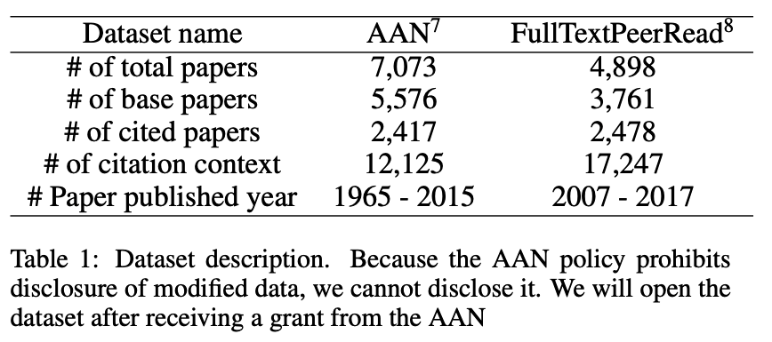
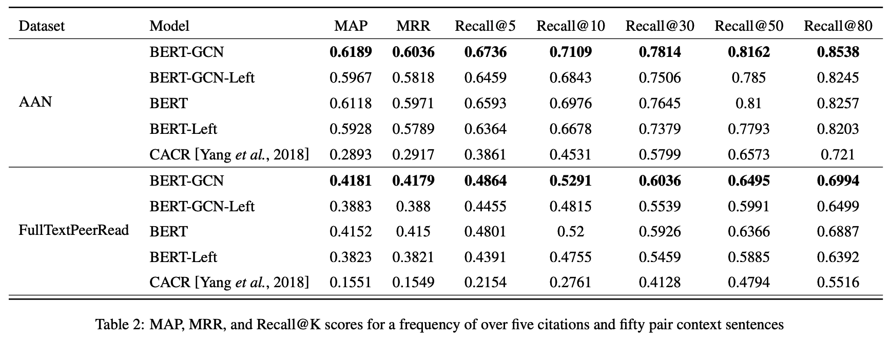
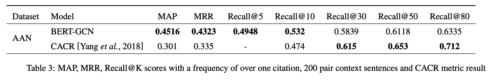
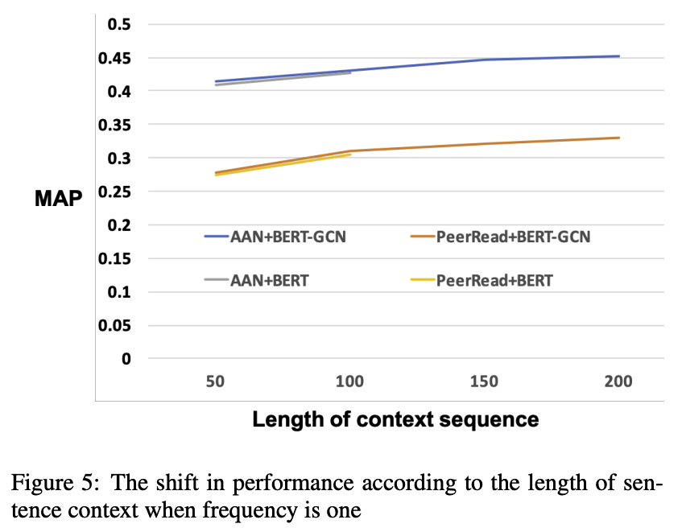
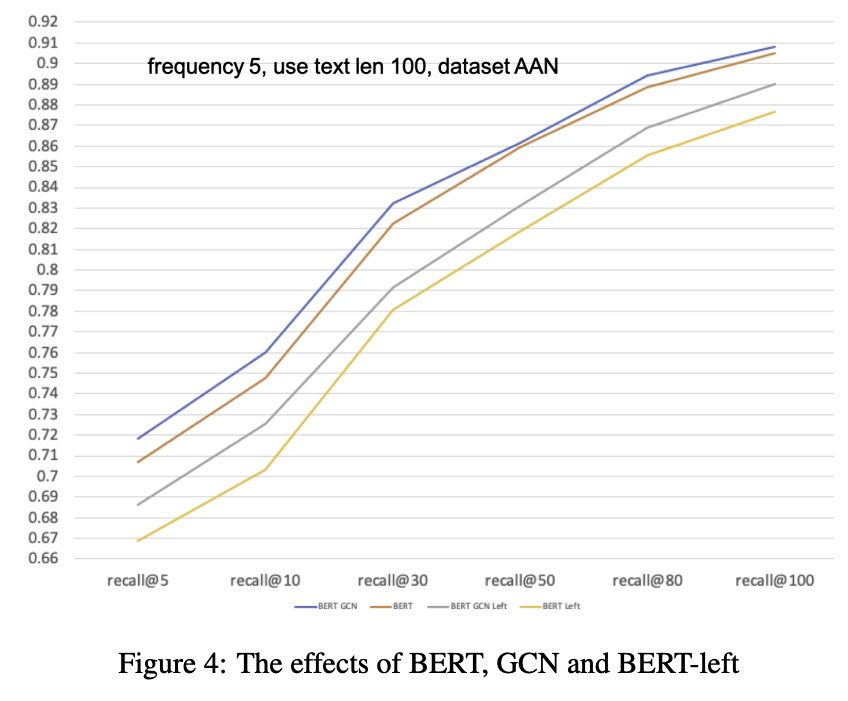
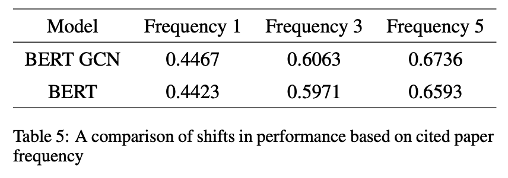

- [x] Round-1: Overview
- [ ] Round-2: Model Implementation Details
- [ ] Round-3: Experiments

## Citation


Jeong, C., Jang, S., Shin, H., Park, E., & Choi, S. (2019).  
A Context-Aware Citation Recommendation Model with BERT and Graph Convolutional Networks.  
https://doi.org/10.48550/arxiv.1903.06464


## Abstract
> With the tremendous growth in the number of scientific papers being
> published, searching for references while writing a scientific paper is a
> time-consuming process. A technique that could add a reference citation at the
> appropriate place in a sentence will be beneficial. In this perspective,
> context-aware citation recommendation has been researched upon for around two
> decades. Many researchers have utilized the text data called the context
> sentence, which surrounds the citation tag, and the metadata of the target
> paper to find the appropriate cited research. However, the lack of
> well-organized benchmarking datasets and no model that can attain high
> performance has made the research difficult. In this paper, we propose a deep learning based model and well-organized
> dataset for context-aware paper citation recommendation. Our model comprises a
> document encoder and a context encoder, which uses Graph Convolutional Networks
> (GCN) layer and Bidirectional Encoder Representations from Transformers (BERT),
> which is a pre-trained model of textual data. By modifying the related PeerRead
> dataset, we propose a new dataset called FullTextPeerRead containing context
> sentences to cited references and paper metadata. To the best of our knowledge,
> This dataset is the first well-organized dataset for context-aware paper
> recommendation. The results indicate that the proposed model with the proposed
> datasets can attain state-of-the-art performance and achieve a more than 28%
> improvement in mean average precision (MAP) and recall@k.

## What's New

- Citation Recommendationにおいて新しいベンチマークデータセット **FullTextPeerRead** を構築
- BERTとGCNを組み合わせたCitation Recommendationモデルを構築しSOTAを達成

## Dataset

[<i class="fa-solid fa-arrow-right" ></i> Dataset (https://github.com/TeamLab/bert-gcn-for-paper-citation)](https://github.com/TeamLab/bert-gcn-for-paper-citation)

- AAN (Radev et al., 2013) 及びPeerRead (Kang et al., 2018) をベースにして新しいデータセットを構築
- 既存のデータセットは引用に関わる部分に関してコンテキスト情報が含まれていないため，arXiv Vanityを使用してコンテキスト情報を抽出しデータセットに追加した
- arXiv VanityではLatexで書かれたPDFをHTMLに変換できるので，Latexで書かれていない論文は対象外となっている
- arXiv Vanityから機械的に収集したデータはノイズが多いため，手動でデータをクリーニング


Dragomir R. Radev, Pradeep Muthukrishnan, Vahed Qazvinian, Amjad Abu-Jbara. (2013)  
**The ACL anthology network corpus**  
Lang. Resour. Evaluation  
[Paper Link](https://www.semanticscholar.org/paper/e01eae8dea6fbaa1ae7fc83535053932268df430)  
Influential Citation Count (50), SS-ID (e01eae8dea6fbaa1ae7fc83535053932268df430)  



Dongyeop Kang, Waleed Ammar, Bhavana Dalvi, Madeleine van Zuylen, Sebastian Kohlmeier, E. Hovy, Roy Schwartz. (2018)  
**A Dataset of Peer Reviews (PeerRead): Collection, Insights and NLP Applications**  
NAACL  
[Paper Link](https://www.semanticscholar.org/paper/53489041a08ef1a6cd19b4c95ce092a148283b6b)  
Influential Citation Count (19), SS-ID (53489041a08ef1a6cd19b4c95ce092a148283b6b)  

**ABSTRACT**  
Peer reviewing is a central component in the scientific publishing process. We present the first public dataset of scientific peer reviews available for research purposes (PeerRead v1),1 providing an opportunity to study this important artifact. The dataset consists of 14.7K paper drafts and the corresponding accept/reject decisions in top-tier venues including ACL, NIPS and ICLR. The dataset also includes 10.7K textual peer reviews written by experts for a subset of the papers. We describe the data collection process and report interesting observed phenomena in the peer reviews. We also propose two novel NLP tasks based on this dataset and provide simple baseline models. In the first task, we show that simple models can predict whether a paper is accepted with up to 21% error reduction compared to the majority baseline. In the second task, we predict the numerical scores of review aspects and show that simple models can outperform the mean baseline for aspects with high variance such as ‘originality’ and ‘impact’.


#### Dataset Statistics

## Model Description

### Training Settings

## Results
#### Main Results

- ベースラインモデルのCACR (Yang et al., 2018) に比べて高い精度を達成
  
Libin Yang, Yu Zheng, Xiaoyan Cai, Hang Dai, Dejun Mu, Lantian Guo, Tao Dai. (2018)  
**A LSTM Based Model for Personalized Context-Aware Citation Recommendation**  
IEEE Access  
[Paper Link](https://www.semanticscholar.org/paper/52020530c72e189ca0d295e611063a0aaa9109c2)  
Influential Citation Count (3), SS-ID (52020530c72e189ca0d295e611063a0aaa9109c2)  

**ABSTRACT**  
The rapid growth of scientific papers makes it difficult to find relevant and appropriate citations. Context-aware citation recommendation aims to overcome this problem by providing a list of scientific papers given a short passage of text. In this paper, we propose a long–short-term memory (LSTM)-based model for context-aware citation recommendation, which first learns the distributed representations of the citation contexts and the scientific papers separately based on LSTM, and then measures the relevance based on the learned distributed representation of citation contexts and the scientific papers. Finally, the scientific papers with high relevance scores are selected as the recommendation list. In particular, we try to incorporate author information, venue information, and content information in scientific paper distributed vector representation. Furthermore, we integrate author information of the given context in citation context distributed vector representation. Thus, the proposed model makes personalized context-aware citation recommendation possible, which is a new issue that few papers addressed in the past. When conducting experiments on the ACL Anthology Network and DBLP data sets, the results demonstrate the proposed LSTM-based model for context-aware citation recommendation is able to achieve considerable improvement over previous context-aware citation recommendation approaches. The personalized recommendation approach is also competitive with the non-personalized recommendation approach.
  

#### Ablation Study



---



- 全ての場合において，GCNを追加した方が精度が向上した
- GCNは入力単語・文章の数が少ない方がモデルに対するインパクトは大きくなる
- コンテキストの長さが一定数以上を超えるとモデルの精度の上昇幅は緩やかになっていく

---

- 引用頻度が高くなるほどモデルの精度は向上する

## References



Haifeng Liu, Xiangjie Kong, Xiaomei Bai, Wei Wang, T. M. Bekele, Feng Xia. (2015)  
**Context-Based Collaborative Filtering for Citation Recommendation**  
IEEE Access  
[Paper Link](https://www.semanticscholar.org/paper/0fb67f88fed7dc3592653a892eee2b8697806451)  
Influential Citation Count (6), SS-ID (0fb67f88fed7dc3592653a892eee2b8697806451)  

**ABSTRACT**  
Citation recommendation is an interesting and significant research area as it solves the information overload in academia by automatically suggesting relevant references for a research paper. Recently, with the rapid proliferation of information technology, research papers are rapidly published in various conferences and journals. This makes citation recommendation a highly important and challenging discipline. In this paper, we propose a novel citation recommendation method that uses only easily obtained citation relations as source data. The rationale underlying this method is that, if two citing papers are significantly co-occurring with the same citing paper(s), they should be similar to some extent. Based on the above rationale, an association mining technique is employed to obtain the paper representation of each citing paper from the citation context. Then, these paper representations are pairwise compared to compute similarities between the citing papers for collaborative filtering. We evaluate our proposed method through two relevant real-world data sets. Our experimental results demonstrate that the proposed method significantly outperforms the baseline method in terms of precision, recall, and F1, as well as mean average precision and mean reciprocal rank, which are metrics related to the rank information in the recommendation list.





Michel Galley, K. McKeown, E. Fosler-Lussier, Hongyan Jing. (2003)  
**Discourse Segmentation of Multi-Party Conversation**  
ACL  
[Paper Link](https://www.semanticscholar.org/paper/118a331364f30592d12eafe9af8a8c84b59b961c)  
Influential Citation Count (73), SS-ID (118a331364f30592d12eafe9af8a8c84b59b961c)  

**ABSTRACT**  
We present a domain-independent topic segmentation algorithm for multi-party speech. Our feature-based algorithm combines knowledge about content using a text-based algorithm as a feature and about form using linguistic and acoustic cues about topic shifts extracted from speech. This segmentation algorithm uses automatically induced decision rules to combine the different features. The embedded text-based algorithm builds on lexical cohesion and has performance comparable to state-of-the-art algorithms based on lexical information. A significant error reduction is obtained by combining the two knowledge sources.





Dekai Wu. (1997)  
**Stochastic Inversion Transduction Grammars and Bilingual Parsing of Parallel Corpora**  
Comput. Linguistics  
[Paper Link](https://www.semanticscholar.org/paper/13b6eeb28328252a35cdcbe3ab8d09d2a9caf99d)  
Influential Citation Count (114), SS-ID (13b6eeb28328252a35cdcbe3ab8d09d2a9caf99d)  

**ABSTRACT**  
We introduce (1) a novel stochastic inversion transduction grammar formalism for bilingual language modeling of sentence-pairs, and (2) the concept of bilingual parsing with a variety of parallel corpus analysis applications. Aside from the bilingual orientation, three major features distinguish the formalism from the finite-state transducers more traditionally found in computational linguistics: it skips directly to a context-free rather than finite-state base, it permits a minimal extra degree of ordering flexibility, and its probabilistic formulation admits an efficient maximum-likelihood bilingual parsing algorithm. A convenient normal form is shown to exist. Analysis of the formalism's expressiveness suggests that it is particularly well suited to modeling ordering shifts between languages, balancing needed flexibility against complexity constraints. We discuss a number of examples of how stochastic inversion transduction grammars bring bilingual constraints to bear upon problematic corpus analysis tasks such as segmentation, bracketing, phrasal alignment, and parsing.





Jiwei Tan, Xiaojun Wan, Hui Liu, Jianguo Xiao. (2018)  
**QuoteRec: Toward Quote Recommendation for Writing**  
ACM Trans. Inf. Syst.  
[Paper Link](https://www.semanticscholar.org/paper/15b09272a3b7476ca4b1fbfdac5675797b3c3ff7)  
Influential Citation Count (2), SS-ID (15b09272a3b7476ca4b1fbfdac5675797b3c3ff7)  

**ABSTRACT**  
Quote is a language phenomenon of transcribing the statement of someone else, such as a proverb and a famous saying. An appropriate usage of quote usually equips the expression with more elegance and credibility. However, there are times when we are eager to stress our idea by citing a quote, while nothing relevant comes to mind. Therefore, it is exciting to have a recommender system which provides quote recommendations while we are writing. This article extends previous study of quote recommendation, the task that recommends the appropriate quote according to the context (i.e., the content occurring before and after the quote). In this article, a quote recommender system called QuoteRec is presented to tackle the task. We investigate two models to learn the vector representations of quotes and contexts, and then rank the candidate quotes based on the representations. The first model learns the quote representation according to the contexts of a quote. The second model is an extension of the neural network model in previous study, which learns the representation of a quote by concerning both its content and contexts. Experimental results demonstrate the effectiveness of the two models in learning the semantic representations of quotes, and the neural network model achieves state-of-the-art results on the quote recommendation task.





H. Moed. (2009)  
**Measuring contextual citation impact of scientific journals**  
J. Informetrics  
[Paper Link](https://www.semanticscholar.org/paper/172aed103a885735bce827fee4a24bed30eefd9e)  
Influential Citation Count (50), SS-ID (172aed103a885735bce827fee4a24bed30eefd9e)  

**ABSTRACT**  





Qi He, Daniel Kifer, J. Pei, P. Mitra, C. Lee Giles. (2011)  
**Citation recommendation without author supervision**  
WSDM '11  
[Paper Link](https://www.semanticscholar.org/paper/1954a67069a6744cc6c85f258c430431118a9916)  
Influential Citation Count (10), SS-ID (1954a67069a6744cc6c85f258c430431118a9916)  

**ABSTRACT**  
Automatic recommendation of citations for a manuscript is highly valuable for scholarly activities since it can substantially improve the efficiency and quality of literature search. The prior techniques placed a considerable burden on users, who were required to provide a representative bibliography or to mark passages where citations are needed. In this paper we present a system that considerably reduces this burden: a user simply inputs a query manuscript (without a bibliography) and our system automatically finds locations where citations are needed. We show that naïve approaches do not work well due to massive noise in the document corpus. We produce a successful approach by carefully examining the relevance between segments in a query manuscript and the representative segments extracted from a document corpus. An extensive empirical evaluation using the CiteSeerX data set shows that our approach is effective.





F. Och. (2003)  
**Minimum Error Rate Training in Statistical Machine Translation**  
ACL  
[Paper Link](https://www.semanticscholar.org/paper/1f12451245667a85d0ee225a80880fc93c71cc8b)  
Influential Citation Count (487), SS-ID (1f12451245667a85d0ee225a80880fc93c71cc8b)  

**ABSTRACT**  
Often, the training procedure for statistical machine translation models is based on maximum likelihood or related criteria. A general problem of this approach is that there is only a loose relation to the final translation quality on unseen text. In this paper, we analyze various training criteria which directly optimize translation quality. These training criteria make use of recently proposed automatic evaluation metrics. We describe a new algorithm for efficient training an unsmoothed error count. We show that significantly better results can often be obtained if the final evaluation criterion is taken directly into account as part of the training procedure.





M. Rappa, Paul Jones, J. Freire, Soumen Chakrabarti. (2010)  
**Proceedings of the 19th international conference on World wide web**  
WWW 2010  
[Paper Link](https://www.semanticscholar.org/paper/2829bdbb2950b4eac1c43aa0f627a7bb14c9a775)  
Influential Citation Count (16), SS-ID (2829bdbb2950b4eac1c43aa0f627a7bb14c9a775)  

**ABSTRACT**  
Welcome to the World Wide Web Conference held during April 26-30, 2010, at the Raleigh Convention Center in Raleigh, North Carolina, USA. The WWW Conference is the largest and premier annual forum where researchers and developers from around the world assemble to share, discuss and debate the latest developments on Web technologies and standards and the Web's impact on society and culture. We are pleased to present the proceedings of the conference as its published record.    Based on input from several office holders in recent WWW conferences, we implemented a number of modifications in the review process this time. In earlier years, WWW used a partitioned track system, and each paper was sent to exactly one track. This year, we implemented a system of overlapping (broad) areas and (fine) topics. Each broad area was represented by at least two, but often more, area chairs (ACs), who helped recruit the rest of the program committee (PC) members, but PC members were not partitioned by area.    Each paper could potentially be assigned to any PC member. We downloaded a number of recent papers by each PC member to create a profile, and used its similarity with each submitted paper as one signal into the paper assignment process, while paying close attention to bids for papers by PC members. The assignments were then fine-tuned by the ACs. Each paper was first reviewed by three PC members. Then the ACs initiated discussions, solicited additional reviews if needed, and wrote at least one meta-review per paper summarizing and justifying the final decision.    For most papers, the ACs had a confident decision before the PC meeting held 14-15th January. At this meeting, particularly complicated decisions were made and reviewed. Overall, we believe the two-tier review process ensures in-depth, reliable and fair evaluations.    Other new features include a new demo track, where anyone, not just industrial exhibitors, can show a working system, and a new category of Application and Experience (A+E) papers that were reviewed for merit in design, implementation, benchmarking or extensive experience, as distinct from a core technical idea as in regular research submissions. Some A+E papers were nominated for demos. Other tracks for posters, tutorials, workshops, and developers were run as usual, separate from the research track.    754 research papers were submitted. Of these, 91 were accepted as regular research papers and 14 were accepted as A+E papers. A total of 24 tutorials were proposed and 11 accepted. A total of 19 workshops were proposed and 11 were accepted. A total of 90 posters and 27 demos will be exhibited.





Thomas Kipf, M. Welling. (2016)  
**Semi-Supervised Classification with Graph Convolutional Networks**  
ICLR  
[Paper Link](https://www.semanticscholar.org/paper/36eff562f65125511b5dfab68ce7f7a943c27478)  
Influential Citation Count (3166), SS-ID (36eff562f65125511b5dfab68ce7f7a943c27478)  

**ABSTRACT**  
We present a scalable approach for semi-supervised learning on graph-structured data that is based on an efficient variant of convolutional neural networks which operate directly on graphs. We motivate the choice of our convolutional architecture via a localized first-order approximation of spectral graph convolutions. Our model scales linearly in the number of graph edges and learns hidden layer representations that encode both local graph structure and features of nodes. In a number of experiments on citation networks and on a knowledge graph dataset we demonstrate that our approach outperforms related methods by a significant margin.





Qi He, J. Pei, Daniel Kifer, P. Mitra, C. Lee Giles. (2010)  
**Context-aware citation recommendation**  
WWW '10  
[Paper Link](https://www.semanticscholar.org/paper/3c0312918ac9fea614abaa0732d83f3e76c16f7d)  
Influential Citation Count (32), SS-ID (3c0312918ac9fea614abaa0732d83f3e76c16f7d)  

**ABSTRACT**  
When you write papers, how many times do you want to make some citations at a place but you are not sure which papers to cite? Do you wish to have a recommendation system which can recommend a small number of good candidates for every place that you want to make some citations? In this paper, we present our initiative of building a context-aware citation recommendation system. High quality citation recommendation is challenging: not only should the citations recommended be relevant to the paper under composition, but also should match the local contexts of the places citations are made. Moreover, it is far from trivial to model how the topic of the whole paper and the contexts of the citation places should affect the selection and ranking of citations. To tackle the problem, we develop a context-aware approach. The core idea is to design a novel non-parametric probabilistic model which can measure the context-based relevance between a citation context and a document. Our approach can recommend citations for a context effectively. Moreover, it can recommend a set of citations for a paper with high quality. We implement a prototype system in CiteSeerX. An extensive empirical evaluation in the CiteSeerX digital library against many baselines demonstrates the effectiveness and the scalability of our approach.





Danilo Jimenez Rezende, S. Mohamed, Daan Wierstra. (2014)  
**Stochastic Backpropagation and Approximate Inference in Deep Generative Models**  
ICML  
[Paper Link](https://www.semanticscholar.org/paper/484ad17c926292fbe0d5211540832a8c8a8e958b)  
Influential Citation Count (640), SS-ID (484ad17c926292fbe0d5211540832a8c8a8e958b)  

**ABSTRACT**  
We marry ideas from deep neural networks and approximate Bayesian inference to derive a generalised class of deep, directed generative models, endowed with a new algorithm for scalable inference and learning. Our algorithm introduces a recognition model to represent approximate posterior distributions, and that acts as a stochastic encoder of the data. We develop stochastic back-propagation -- rules for back-propagation through stochastic variables -- and use this to develop an algorithm that allows for joint optimisation of the parameters of both the generative and recognition model. We demonstrate on several real-world data sets that the model generates realistic samples, provides accurate imputations of missing data and is a useful tool for high-dimensional data visualisation.





Libin Yang, Yu Zheng, Xiaoyan Cai, Hang Dai, Dejun Mu, Lantian Guo, Tao Dai. (2018)  
**A LSTM Based Model for Personalized Context-Aware Citation Recommendation**  
IEEE Access  
[Paper Link](https://www.semanticscholar.org/paper/52020530c72e189ca0d295e611063a0aaa9109c2)  
Influential Citation Count (3), SS-ID (52020530c72e189ca0d295e611063a0aaa9109c2)  

**ABSTRACT**  
The rapid growth of scientific papers makes it difficult to find relevant and appropriate citations. Context-aware citation recommendation aims to overcome this problem by providing a list of scientific papers given a short passage of text. In this paper, we propose a long–short-term memory (LSTM)-based model for context-aware citation recommendation, which first learns the distributed representations of the citation contexts and the scientific papers separately based on LSTM, and then measures the relevance based on the learned distributed representation of citation contexts and the scientific papers. Finally, the scientific papers with high relevance scores are selected as the recommendation list. In particular, we try to incorporate author information, venue information, and content information in scientific paper distributed vector representation. Furthermore, we integrate author information of the given context in citation context distributed vector representation. Thus, the proposed model makes personalized context-aware citation recommendation possible, which is a new issue that few papers addressed in the past. When conducting experiments on the ACL Anthology Network and DBLP data sets, the results demonstrate the proposed LSTM-based model for context-aware citation recommendation is able to achieve considerable improvement over previous context-aware citation recommendation approaches. The personalized recommendation approach is also competitive with the non-personalized recommendation approach.





Meen Chul Kim, Chaomei Chen. (2015)  
**A scientometric review of emerging trends and new developments in recommendation systems**  
Scientometrics  
[Paper Link](https://www.semanticscholar.org/paper/52c22ac616688491ce58c0f9f25c2cef81aacba1)  
Influential Citation Count (6), SS-ID (52c22ac616688491ce58c0f9f25c2cef81aacba1)  

**ABSTRACT**  





Dongyeop Kang, Waleed Ammar, Bhavana Dalvi, Madeleine van Zuylen, Sebastian Kohlmeier, E. Hovy, Roy Schwartz. (2018)  
**A Dataset of Peer Reviews (PeerRead): Collection, Insights and NLP Applications**  
NAACL  
[Paper Link](https://www.semanticscholar.org/paper/53489041a08ef1a6cd19b4c95ce092a148283b6b)  
Influential Citation Count (19), SS-ID (53489041a08ef1a6cd19b4c95ce092a148283b6b)  

**ABSTRACT**  
Peer reviewing is a central component in the scientific publishing process. We present the first public dataset of scientific peer reviews available for research purposes (PeerRead v1),1 providing an opportunity to study this important artifact. The dataset consists of 14.7K paper drafts and the corresponding accept/reject decisions in top-tier venues including ACL, NIPS and ICLR. The dataset also includes 10.7K textual peer reviews written by experts for a subset of the papers. We describe the data collection process and report interesting observed phenomena in the peer reviews. We also propose two novel NLP tasks based on this dataset and provide simple baseline models. In the first task, we show that simple models can predict whether a paper is accepted with up to 21% error reduction compared to the majority baseline. In the second task, we predict the numerical scores of review aspects and show that simple models can outperform the mean baseline for aspects with high variance such as ‘originality’ and ‘impact’.





Thomas Kipf, M. Welling. (2016)  
**Variational Graph Auto-Encoders**  
ArXiv  
[Paper Link](https://www.semanticscholar.org/paper/54906484f42e871f7c47bbfe784a358b1448231f)  
Influential Citation Count (353), SS-ID (54906484f42e871f7c47bbfe784a358b1448231f)  

**ABSTRACT**  
We introduce the variational graph auto-encoder (VGAE), a framework for unsupervised learning on graph-structured data based on the variational auto-encoder (VAE). This model makes use of latent variables and is capable of learning interpretable latent representations for undirected graphs. We demonstrate this model using a graph convolutional network (GCN) encoder and a simple inner product decoder. Our model achieves competitive results on a link prediction task in citation networks. In contrast to most existing models for unsupervised learning on graph-structured data and link prediction, our model can naturally incorporate node features, which significantly improves predictive performance on a number of benchmark datasets.





Dragomir R. Radev, M. Joseph, B. Gibson, Pradeep Muthukrishnan. (2015)  
**A bibliometric and network analysis of the field of computational linguistics**  
J. Assoc. Inf. Sci. Technol.  
[Paper Link](https://www.semanticscholar.org/paper/7300b624588c62fb5af4fbd948969c8803b28d46)  
Influential Citation Count (1), SS-ID (7300b624588c62fb5af4fbd948969c8803b28d46)  

**ABSTRACT**  
The ACL Anthology is a large collection of research papers in computational linguistics. Citation data were obtained using text extraction from a collection of PDF files with significant manual postprocessing performed to clean up the results. Manual annotation of the references was then performed to complete the citation network. We analyzed the networks of paper citations, author citations, and author collaborations in an attempt to identify the most central papers and authors. The analysis includes general network statistics, PageRank, metrics across publication years and venues, the impact factor and h‐index, as well as other measures.





Mathias Niepert, Mohamed Ahmed, Konstantin Kutzkov. (2016)  
**Learning Convolutional Neural Networks for Graphs**  
ICML  
[Paper Link](https://www.semanticscholar.org/paper/7c6de5a9e02a779e24504619050c6118f4eac181)  
Influential Citation Count (136), SS-ID (7c6de5a9e02a779e24504619050c6118f4eac181)  

**ABSTRACT**  
Numerous important problems can be framed as learning from graph data. We propose a framework for learning convolutional neural networks for arbitrary graphs. These graphs may be undirected, directed, and with both discrete and continuous node and edge attributes. Analogous to image-based convolutional networks that operate on locally connected regions of the input, we present a general approach to extracting locally connected regions from graphs. Using established benchmark data sets, we demonstrate that the learned feature representations are competitive with state of the art graph kernels and that their computation is highly efficient.





Xiaomei Bai, Fuli Zhang, Ivan Lee. (2019)  
**Predicting the citations of scholarly paper**  
J. Informetrics  
[Paper Link](https://www.semanticscholar.org/paper/7f57a5bdbf6c711c711e1901864eaa4237b01f9f)  
Influential Citation Count (0), SS-ID (7f57a5bdbf6c711c711e1901864eaa4237b01f9f)  

**ABSTRACT**  





Shangsong Liang, Z. Ren, Yukun Zhao, Jun Ma, Emine Yilmaz, M. de Rijke. (2017)  
**Inferring Dynamic User Interests in Streams of Short Texts for User Clustering**  
ACM Trans. Inf. Syst.  
[Paper Link](https://www.semanticscholar.org/paper/803a6b4333302fae7d05f2e2e196954540db2b01)  
Influential Citation Count (0), SS-ID (803a6b4333302fae7d05f2e2e196954540db2b01)  

**ABSTRACT**  
User clustering has been studied from different angles. In order to identify shared interests, behavior-based methods consider similar browsing or search patterns of users, whereas content-based methods use information from the contents of the documents visited by the users. So far, content-based user clustering has mostly focused on static sets of relatively long documents. Given the dynamic nature of social media, there is a need to dynamically cluster users in the context of streams of short texts. User clustering in this setting is more challenging than in the case of long documents, as it is difficult to capture the users’ dynamic topic distributions in sparse data settings. To address this problem, we propose a dynamic user clustering topic model (UCT). UCT adaptively tracks changes of each user’s time-varying topic distributions based both on the short texts the user posts during a given time period and on previously estimated distributions. To infer changes, we propose a Gibbs sampling algorithm where a set of word pairs from each user is constructed for sampling. UCT can be used in two ways: (1) as a short-term dependency model that infers a user’s current topic distribution based on the user’s topic distributions during the previous time period only, and (2) as a long-term dependency model that infers a user’s current topic distributions based on the user’s topic distributions during multiple time periods in the past. The clustering results are explainable and human-understandable, in contrast to many other clustering algorithms. For evaluation purposes, we work with a dataset consisting of users and tweets from each user. Experimental results demonstrate the effectiveness of our proposed short-term and long-term dependency user clustering models compared to state-of-the-art baselines.





Xuewei Tang, Xiaojun Wan, Xun Zhang. (2014)  
**Cross-language context-aware citation recommendation in scientific articles**  
SIGIR  
[Paper Link](https://www.semanticscholar.org/paper/851332942f7cfbd74e3f2799309c1383fa547fb6)  
Influential Citation Count (2), SS-ID (851332942f7cfbd74e3f2799309c1383fa547fb6)  

**ABSTRACT**  
Adequacy of citations is very important for a scientific paper. However, it is not an easy job to find appropriate citations for a given context, especially for citations in different languages. In this paper, we define a novel task of cross-language context-aware citation recommendation, which aims at recommending English citations for a given context of the place where a citation is made in a Chinese paper. This task is very challenging because the contexts and citations are written in different languages and there exists a language gap when matching them. To tackle this problem, we propose the bilingual context-citation embedding algorithm (i.e. BLSRec-I), which can learn a low-dimensional joint embedding space for both contexts and citations. Moreover, two advanced algorithms named BLSRec-II and BLSRec-III are proposed by enhancing BLSRec-I with translation results and abstract information, respectively. We evaluate the proposed methods based on a real dataset that contains Chinese contexts and English citations. The results demonstrate that our proposed algorithms can outperform a few baselines and the BLSRec-II and BLSRec-III methods can outperform the BLSRec-I method.





Travis Ebesu, Yi Fang. (2017)  
**Neural Citation Network for Context-Aware Citation Recommendation**  
SIGIR  
[Paper Link](https://www.semanticscholar.org/paper/a191c41607ce88e731fe8fc08faf6677c1f47903)  
Influential Citation Count (15), SS-ID (a191c41607ce88e731fe8fc08faf6677c1f47903)  

**ABSTRACT**  
The accelerating rate of scientific publications makes it difficult to find relevant citations or related work. Context-aware citation recommendation aims to solve this problem by providing a curated list of high-quality candidates given a short passage of text. Existing literature adopts bag-of-word representations leading to the loss of valuable semantics and lacks the ability to integrate metadata or generalize to unseen manuscripts in the training set. We propose a flexible encoder-decoder architecture called Neural Citation Network (NCN), embodying a robust representation of the citation context with a max time delay neural network, further augmented with an attention mechanism and author networks. The recurrent neural network decoder consults this representation when determining the optimal paper to recommend based solely on its title. Quantitative results on the large-scale CiteSeer dataset reveal NCN cultivates a significant improvement over competitive baselines. Qualitative evidence highlights the effectiveness of the proposed end-to-end neural network revealing a promising research direction for citation recommendation.





A. Ratnaparkhi. (1996)  
**A Maximum Entropy Model for Part-Of-Speech Tagging**  
EMNLP  
[Paper Link](https://www.semanticscholar.org/paper/a574e320d899e7e82e341eb64baef7dfe8a24642)  
Influential Citation Count (110), SS-ID (a574e320d899e7e82e341eb64baef7dfe8a24642)  

**ABSTRACT**  
This paper presents a statistical model which trains from a corpus annotated with Part Of Speech tags and assigns them to previously unseen text with state of the art accuracy The model can be classi ed as a Maximum Entropy model and simultaneously uses many contextual features to predict the POS tag Furthermore this paper demonstrates the use of specialized fea tures to model di cult tagging decisions discusses the corpus consistency problems discovered during the implementation of these features and proposes a training strategy that mitigates these problems





Diederik P. Kingma, Jimmy Ba. (2014)  
**Adam: A Method for Stochastic Optimization**  
ICLR  
[Paper Link](https://www.semanticscholar.org/paper/a6cb366736791bcccc5c8639de5a8f9636bf87e8)  
Influential Citation Count (14742), SS-ID (a6cb366736791bcccc5c8639de5a8f9636bf87e8)  

**ABSTRACT**  
We introduce Adam, an algorithm for first-order gradient-based optimization of stochastic objective functions, based on adaptive estimates of lower-order moments. The method is straightforward to implement, is computationally efficient, has little memory requirements, is invariant to diagonal rescaling of the gradients, and is well suited for problems that are large in terms of data and/or parameters. The method is also appropriate for non-stationary objectives and problems with very noisy and/or sparse gradients. The hyper-parameters have intuitive interpretations and typically require little tuning. Some connections to related algorithms, on which Adam was inspired, are discussed. We also analyze the theoretical convergence properties of the algorithm and provide a regret bound on the convergence rate that is comparable to the best known results under the online convex optimization framework. Empirical results demonstrate that Adam works well in practice and compares favorably to other stochastic optimization methods. Finally, we discuss AdaMax, a variant of Adam based on the infinity norm.





N. Calzolari. (1966)  
**Language Resources and Evaluation**  
  
[Paper Link](https://www.semanticscholar.org/paper/b7c42dcbefb9ff13d17d2b3bf3fb38ae3bfcebd5)  
Influential Citation Count (4), SS-ID (b7c42dcbefb9ff13d17d2b3bf3fb38ae3bfcebd5)  

**ABSTRACT**  





Philipp Koehn. (2004)  
**Statistical Significance Tests for Machine Translation Evaluation**  
EMNLP  
[Paper Link](https://www.semanticscholar.org/paper/cb826a3899752b796f14df1c50378c64954a6b0a)  
Influential Citation Count (124), SS-ID (cb826a3899752b796f14df1c50378c64954a6b0a)  

**ABSTRACT**  
If two translation systems differ differ in performance on a test set, can we trust that this indicates a difference in true system quality? To answer this question, we describe bootstrap resampling methods to compute statistical significance of test results, and validate them on the concrete example of the BLEU score. Even for small test sizes of only 300 sentences, our methods may give us assurances that test result differences are real.





Marti A. Hearst. (1997)  
**Text Tiling: Segmenting Text into Multi-paragraph Subtopic Passages**  
CL  
[Paper Link](https://www.semanticscholar.org/paper/cb91a9ef1723440bd35a3e5965a2e180ad1ab36f)  
Influential Citation Count (197), SS-ID (cb91a9ef1723440bd35a3e5965a2e180ad1ab36f)  

**ABSTRACT**  
TextTiling is a technique for subdividing texts into multi-paragraph units that represent passages, or subtopics. The discourse cues for identifying major subtopic shifts are patterns of lexical co-occurrence and distribution. The algorithm is fully implemented and is shown to produce segmentation that corresponds well to human judgments of the subtopic boundaries of 12 texts. Multi-paragraph subtopic segmentation should be useful for many text analysis tasks, including information retrieval and summarization.





Jacob Devlin, Ming-Wei Chang, Kenton Lee, Kristina Toutanova. (2019)  
**BERT: Pre-training of Deep Bidirectional Transformers for Language Understanding**  
NAACL  
[Paper Link](https://www.semanticscholar.org/paper/df2b0e26d0599ce3e70df8a9da02e51594e0e992)  
Influential Citation Count (10235), SS-ID (df2b0e26d0599ce3e70df8a9da02e51594e0e992)  

**ABSTRACT**  
We introduce a new language representation model called BERT, which stands for Bidirectional Encoder Representations from Transformers. Unlike recent language representation models (Peters et al., 2018a; Radford et al., 2018), BERT is designed to pre-train deep bidirectional representations from unlabeled text by jointly conditioning on both left and right context in all layers. As a result, the pre-trained BERT model can be fine-tuned with just one additional output layer to create state-of-the-art models for a wide range of tasks, such as question answering and language inference, without substantial task-specific architecture modifications. BERT is conceptually simple and empirically powerful. It obtains new state-of-the-art results on eleven natural language processing tasks, including pushing the GLUE score to 80.5 (7.7 point absolute improvement), MultiNLI accuracy to 86.7% (4.6% absolute improvement), SQuAD v1.1 question answering Test F1 to 93.2 (1.5 point absolute improvement) and SQuAD v2.0 Test F1 to 83.1 (5.1 point absolute improvement).





Dragomir R. Radev, Pradeep Muthukrishnan, Vahed Qazvinian, Amjad Abu-Jbara. (2013)  
**The ACL anthology network corpus**  
Lang. Resour. Evaluation  
[Paper Link](https://www.semanticscholar.org/paper/e01eae8dea6fbaa1ae7fc83535053932268df430)  
Influential Citation Count (50), SS-ID (e01eae8dea6fbaa1ae7fc83535053932268df430)  

**ABSTRACT**  





W. Huang, Zhaohui Wu, Chen Liang, P. Mitra, C. Lee Giles. (2015)  
**A Neural Probabilistic Model for Context Based Citation Recommendation**  
AAAI  
[Paper Link](https://www.semanticscholar.org/paper/e5aa3cf6d6521ca67a49cb7c7e13cbd914f83bf8)  
Influential Citation Count (14), SS-ID (e5aa3cf6d6521ca67a49cb7c7e13cbd914f83bf8)  

**ABSTRACT**  
Automatic citation recommendation can be very useful for authoring a paper and is an AI-complete problem due to the challenge of bridging the semantic gap between citation context and the cited paper. It is not always easy for knowledgeable researchers to give an accurate citation context for a cited paper or to find the right paper to cite given context. To help with this problem, we propose a novel neural probabilistic model that jointly learns the semantic representations of citation contexts and cited papers. The probability of citing a paper given a citation context is estimated by training a multi-layer neural network. We implement and evaluate our model on the entire CiteSeer dataset, which at the time of this work consists of 10,760,318 citation contexts from 1,017,457 papers. We show that the proposed model significantly outperforms other state-of-the-art models in recall, MAP, MRR, and nDCG.





M. Fontoura, Daat Document-at-a-time, Taat Term-at-a-time. (-1)  
**Analyzing the performance of top-k retrieval algorithms**  
  
[Paper Link](https://www.semanticscholar.org/paper/ebb5f4273e461e21db6afcdbca698295cb0d21e1)  
Influential Citation Count (0), SS-ID (ebb5f4273e461e21db6afcdbca698295cb0d21e1)  

**ABSTRACT**  





M. Walker, Heng Ji, Amanda Stent. (2018)  
**Proceedings of the 2018 Conference of the North American Chapter of the Association for Computational Linguistics: Human Language Technologies, Volume 3 (Industry Papers)**  
NAACL 2018  
[Paper Link](https://www.semanticscholar.org/paper/ed2b7bfbbf5e48d750d7c3e0046e55341cecd335)  
Influential Citation Count (5), SS-ID (ed2b7bfbbf5e48d750d7c3e0046e55341cecd335)  

**ABSTRACT**  





Marti A. Hearst. (1994)  
**Multi-Paragraph Segmentation of Expository Texts**  
  
[Paper Link](https://www.semanticscholar.org/paper/f1626b2b04237165f14701be43ca38e91cb04464)  
Influential Citation Count (9), SS-ID (f1626b2b04237165f14701be43ca38e91cb04464)  

**ABSTRACT**  
We present a method for partitioning expository texts into coherent multi-paragraph units which re ect the subtopic structure of the texts. Using Chafe's Flow Model of discourse, we observe that subtopics are often expressed by the interaction of multiple simultaneous themes. We describe two fully-implemented algorithms that use only term repetition information to determine the extents of the subtopics. We show that the segments correspond well to human judgements of the major subtopic boundaries of thirteen lengthy texts, and suggest the use of such segments in information retrieval applications.





Quoc V. Le, Tomas Mikolov. (2014)  
**Distributed Representations of Sentences and Documents**  
ICML  
[Paper Link](https://www.semanticscholar.org/paper/f527bcfb09f32e6a4a8afc0b37504941c1ba2cee)  
Influential Citation Count (953), SS-ID (f527bcfb09f32e6a4a8afc0b37504941c1ba2cee)  

**ABSTRACT**  
Many machine learning algorithms require the input to be represented as a fixed-length feature vector. When it comes to texts, one of the most common fixed-length features is bag-of-words. Despite their popularity, bag-of-words features have two major weaknesses: they lose the ordering of the words and they also ignore semantics of the words. For example, "powerful," "strong" and "Paris" are equally distant. In this paper, we propose Paragraph Vector, an unsupervised algorithm that learns fixed-length feature representations from variable-length pieces of texts, such as sentences, paragraphs, and documents. Our algorithm represents each document by a dense vector which is trained to predict words in the document. Its construction gives our algorithm the potential to overcome the weaknesses of bag-of-words models. Empirical results show that Paragraph Vectors outperforms bag-of-words models as well as other techniques for text representations. Finally, we achieve new state-of-the-art results on several text classification and sentiment analysis tasks.



