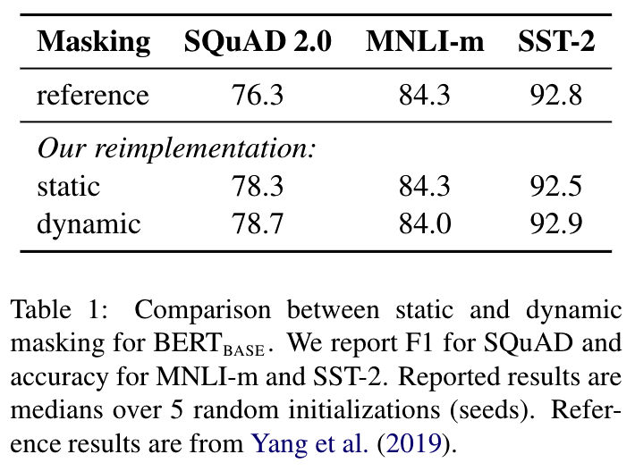
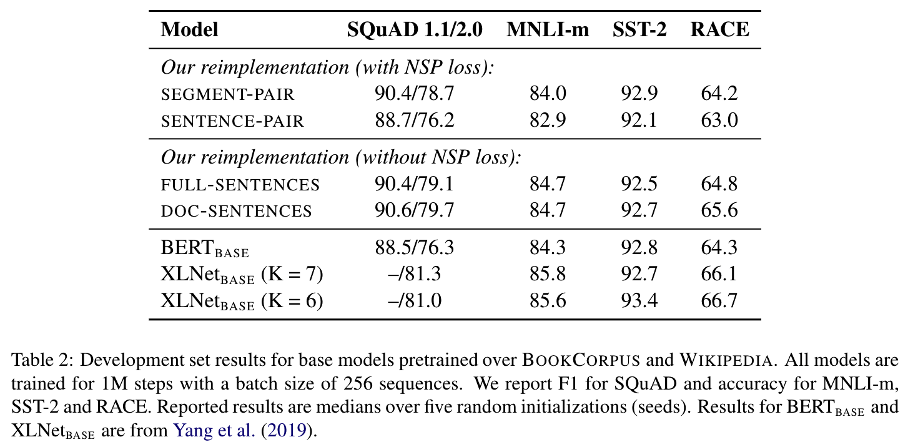
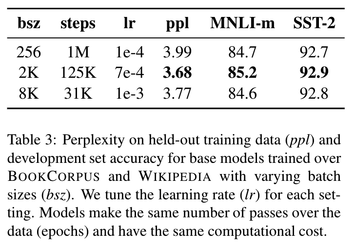
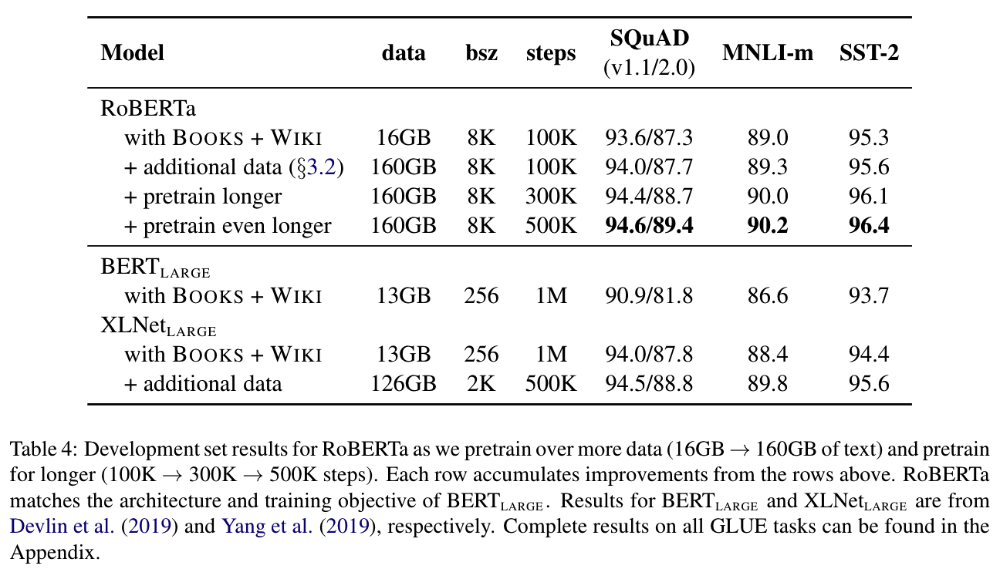
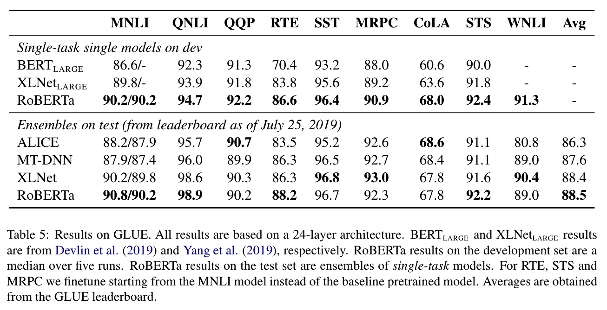
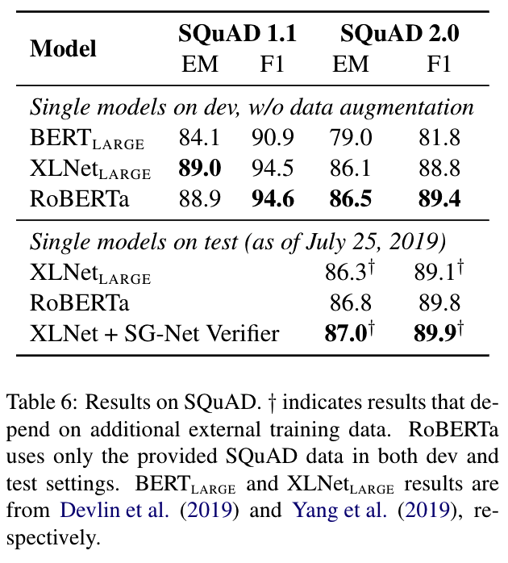
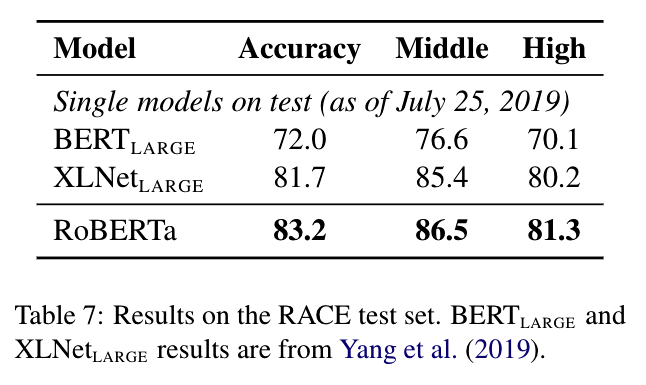

- [x] Round-1: Overview
- [ ] Round-2: Model Implementation Details
- [ ] Round-3: Experiments

## Citation


Liu, Y., Ott, M., Goyal, N., Du, J., Joshi, M., Chen, D., Levy, O., Lewis, M., Zettlemoyer, L., & Stoyanov, V. (2019).  
RoBERTa: A Robustly Optimized BERT Pretraining Approach.  
https://doi.org/10.48550/arxiv.1907.11692


## Abstract

> Language model pretraining has led to significant performance gains but
> careful comparison between different approaches is challenging. Training is
> computationally expensive, often done on private datasets of different sizes,
> and, as we will show, hyperparameter choices have significant impact on the
> final results. We present a replication study of BERT pretraining (Devlin et
> al., 2019) that carefully measures the impact of many key hyperparameters and
> training data size. We find that BERT was significantly undertrained, and can
> match or exceed the performance of every model published after it. Our best
> model achieves state-of-the-art results on GLUE, RACE and SQuAD. These results
> highlight the importance of previously overlooked design choices, and raise
> questions about the source of recently reported improvements. We release our
> models and code.

## What's New

- BERTの学習設定を精査し，最も精度が向上する設定方針を提案
  - **Dynamic Masking**
    - 事前学習のMasked Language Modelingにおいて，同じマスクを使い回すのではなく，エポックごとに動的に単語をマスキングすると精度が向上する
  - **Input Full-Sentence & Exclude NSP**
    - オリジナルのBERTでは入力文章がセグメント単位でコンテキストが短いため，セグメント単位ではなくドキュメント内の文章全体をインプットとした方が精度が向上する
    - 事前学習のNext Sentence Prediction (NSP)は除外した方が精度が向上する
  - **Training with large batches**
    - 学習時のステップ数とバッチサイズを変更した場合のモデルの精度の変動を検証し，バッチサイズを大きくした方が精度が向上する
  - **Byte-Pair Encoding**
    - トークンのエンコーディング方式に Byte-Pair Encoding (BPE) を採用（言語モデルにはBPEが適していると考えられるが，精度は向上していない）
- モデルの学習にあたって，新しいデータセットである **CC-News** を導入

## Dataset

### For Training


Yukun Zhu, Ryan Kiros, R. Zemel, R. Salakhutdinov, R. Urtasun, A. Torralba, S. Fidler. (2015)  
**Aligning Books and Movies: Towards Story-Like Visual Explanations by Watching Movies and Reading Books**  
2015 IEEE International Conference on Computer Vision (ICCV)  
[Paper Link](https://www.semanticscholar.org/paper/0e6824e137847be0599bb0032e37042ed2ef5045)  
Influential Citation Count (172), SS-ID (0e6824e137847be0599bb0032e37042ed2ef5045)  

**ABSTRACT**  
Books are a rich source of both fine-grained information, how a character, an object or a scene looks like, as well as high-level semantics, what someone is thinking, feeling and how these states evolve through a story. This paper aims to align books to their movie releases in order to provide rich descriptive explanations for visual content that go semantically far beyond the captions available in the current datasets. To align movies and books we propose a neural sentence embedding that is trained in an unsupervised way from a large corpus of books, as well as a video-text neural embedding for computing similarities between movie clips and sentences in the book. We propose a context-aware CNN to combine information from multiple sources. We demonstrate good quantitative performance for movie/book alignment and show several qualitative examples that showcase the diversity of tasks our model can be used for.



Sebastian Nagel. (2016)  
Cc-news  
http://web.archive.org/save/http://commoncrawl.org/2016/10/news-dataset-available



Aaron Gokaslan and Vanya Cohen. (2019)  
Openweb-text corpus  
http://web.archive.org/save/http://Skylion007.github.io/OpenWebTextCorpus



Trieu H. Trinh, Quoc V. Le. (2018)  
**A Simple Method for Commonsense Reasoning**  
ArXiv  
[Paper Link](https://www.semanticscholar.org/paper/d7b6753a2d4a2b286c396854063bde3a91b75535)  
Influential Citation Count (16), SS-ID (d7b6753a2d4a2b286c396854063bde3a91b75535)  

**ABSTRACT**  
Commonsense reasoning is a long-standing challenge for deep learning. For example, it is difficult to use neural networks to tackle the Winograd Schema dataset (Levesque et al., 2011). In this paper, we present a simple method for commonsense reasoning with neural networks, using unsupervised learning. Key to our method is the use of language models, trained on a massive amount of unlabled data, to score multiple choice questions posed by commonsense reasoning tests. On both Pronoun Disambiguation and Winograd Schema challenges, our models outperform previous state-of-the-art methods by a large margin, without using expensive annotated knowledge bases or hand-engineered features. We train an array of large RNN language models that operate at word or character level on LM-1-Billion, CommonCrawl, SQuAD, Gutenberg Books, and a customized corpus for this task and show that diversity of training data plays an important role in test performance. Further analysis also shows that our system successfully discovers important features of the context that decide the correct answer, indicating a good grasp of commonsense knowledge.


### For Evaluation


Alex Wang, Amanpreet Singh, Julian Michael, Felix Hill, Omer Levy, Samuel R. Bowman. (2018)  
**GLUE: A Multi-Task Benchmark and Analysis Platform for Natural Language Understanding**  
BlackboxNLP@EMNLP  
[Paper Link](https://www.semanticscholar.org/paper/93b8da28d006415866bf48f9a6e06b5242129195)  
Influential Citation Count (659), SS-ID (93b8da28d006415866bf48f9a6e06b5242129195)  

**ABSTRACT**  
Human ability to understand language is general, flexible, and robust. In contrast, most NLU models above the word level are designed for a specific task and struggle with out-of-domain data. If we aspire to develop models with understanding beyond the detection of superficial correspondences between inputs and outputs, then it is critical to develop a unified model that can execute a range of linguistic tasks across different domains. To facilitate research in this direction, we present the General Language Understanding Evaluation (GLUE, gluebenchmark.com): a benchmark of nine diverse NLU tasks, an auxiliary dataset for probing models for understanding of specific linguistic phenomena, and an online platform for evaluating and comparing models. For some benchmark tasks, training data is plentiful, but for others it is limited or does not match the genre of the test set. GLUE thus favors models that can represent linguistic knowledge in a way that facilitates sample-efficient learning and effective knowledge-transfer across tasks. While none of the datasets in GLUE were created from scratch for the benchmark, four of them feature privately-held test data, which is used to ensure that the benchmark is used fairly. We evaluate baselines that use ELMo (Peters et al., 2018), a powerful transfer learning technique, as well as state-of-the-art sentence representation models. The best models still achieve fairly low absolute scores. Analysis with our diagnostic dataset yields similarly weak performance over all phenomena tested, with some exceptions.



Pranav Rajpurkar, Jian Zhang, Konstantin Lopyrev, Percy Liang. (2016)  
**SQuAD: 100,000+ Questions for Machine Comprehension of Text**  
EMNLP  
[Paper Link](https://www.semanticscholar.org/paper/05dd7254b632376973f3a1b4d39485da17814df5)  
Influential Citation Count (1089), SS-ID (05dd7254b632376973f3a1b4d39485da17814df5)  

**ABSTRACT**  
We present the Stanford Question Answering Dataset (SQuAD), a new reading comprehension dataset consisting of 100,000+ questions posed by crowdworkers on a set of Wikipedia articles, where the answer to each question is a segment of text from the corresponding reading passage. We analyze the dataset to understand the types of reasoning required to answer the questions, leaning heavily on dependency and constituency trees. We build a strong logistic regression model, which achieves an F1 score of 51.0%, a significant improvement over a simple baseline (20%). However, human performance (86.8%) is much higher, indicating that the dataset presents a good challenge problem for future research.  The dataset is freely available at this https URL



Pranav Rajpurkar, Robin Jia, Percy Liang. (2018)  
**Know What You Don’t Know: Unanswerable Questions for SQuAD**  
ACL  
[Paper Link](https://www.semanticscholar.org/paper/4d1c856275744c0284312a3a50efb6ca9dc4cd4c)  
Influential Citation Count (348), SS-ID (4d1c856275744c0284312a3a50efb6ca9dc4cd4c)  

**ABSTRACT**  
Extractive reading comprehension systems can often locate the correct answer to a question in a context document, but they also tend to make unreliable guesses on questions for which the correct answer is not stated in the context. Existing datasets either focus exclusively on answerable questions, or use automatically generated unanswerable questions that are easy to identify. To address these weaknesses, we present SQuADRUn, a new dataset that combines the existing Stanford Question Answering Dataset (SQuAD) with over 50,000 unanswerable questions written adversarially by crowdworkers to look similar to answerable ones. To do well on SQuADRUn, systems must not only answer questions when possible, but also determine when no answer is supported by the paragraph and abstain from answering. SQuADRUn is a challenging natural language understanding task for existing models: a strong neural system that gets 86% F1 on SQuAD achieves only 66% F1 on SQuADRUn. We release SQuADRUn to the community as the successor to SQuAD.



Guokun Lai, Qizhe Xie, Hanxiao Liu, Yiming Yang, E. Hovy. (2017)  
**RACE: Large-scale ReAding Comprehension Dataset From Examinations**  
EMNLP  
[Paper Link](https://www.semanticscholar.org/paper/636a79420d838eabe4af7fb25d6437de45ab64e8)  
Influential Citation Count (183), SS-ID (636a79420d838eabe4af7fb25d6437de45ab64e8)  

**ABSTRACT**  
We present RACE, a new dataset for benchmark evaluation of methods in the reading comprehension task. Collected from the English exams for middle and high school Chinese students in the age range between 12 to 18, RACE consists of near 28,000 passages and near 100,000 questions generated by human experts (English instructors), and covers a variety of topics which are carefully designed for evaluating the students’ ability in understanding and reasoning. In particular, the proportion of questions that requires reasoning is much larger in RACE than that in other benchmark datasets for reading comprehension, and there is a significant gap between the performance of the state-of-the-art models (43%) and the ceiling human performance (95%). We hope this new dataset can serve as a valuable resource for research and evaluation in machine comprehension. The dataset is freely available at http://www.cs.cmu.edu/~glai1/data/race/ and the code is available at https://github.com/qizhex/RACE_AR_baselines.


## Model Description

### Training Settings

## Results


### Static vs. Dynamic Masking
- Static MaskingとDynamic Maskingの比較結果．
- Dynamic Maskingの方が精度が若干良い．
---



### Model Input Format and NSP
- モデルの入力フォーマットをSegment，Sentence-Pair，Full-Sentences，Doc-Sentencesで比較．
- 入力とする文章は一つのドキュメントから文全体を取り出してモデルに投入した方が精度が向上する．
  - セグメント単位で投入するよりも広い範囲のコンテキストを扱うことができるためではないかと考えられる．
- NSPについては様々な議論があり，オリジナルのBERTではNSPを導入した方が精度が良くなるとされている一方で，NSPタスクを疑問視する研究もある．この論文では事前学習のNSPタスクは除外した方が，エンドタスクの精度が向上したとのこと．


### Training with Large Batches
- 同じサイズのデータを投入する場合に，バッチサイズを大きくしてステップ数を減らした方がエンドタスクの精度が向上する
---



### Evaluation of RoBERTa



---



## References



Yu Sun, Shuohuan Wang, Yukun Li, Shikun Feng, Xuyi Chen, Han Zhang, Xin Tian, Danxiang Zhu, Hao Tian, Hua Wu. (2019)  
**ERNIE: Enhanced Representation through Knowledge Integration**  
ArXiv  
[Paper Link](https://www.semanticscholar.org/paper/031e4e43aaffd7a479738dcea69a2d5be7957aa3)  
Influential Citation Count (65), SS-ID (031e4e43aaffd7a479738dcea69a2d5be7957aa3)  

**ABSTRACT**  
We present a novel language representation model enhanced by knowledge called ERNIE (Enhanced Representation through kNowledge IntEgration). Inspired by the masking strategy of BERT, ERNIE is designed to learn language representation enhanced by knowledge masking strategies, which includes entity-level masking and phrase-level masking. Entity-level strategy masks entities which are usually composed of multiple words.Phrase-level strategy masks the whole phrase which is composed of several words standing together as a conceptual unit.Experimental results show that ERNIE outperforms other baseline methods, achieving new state-of-the-art results on five Chinese natural language processing tasks including natural language inference, semantic similarity, named entity recognition, sentiment analysis and question answering. We also demonstrate that ERNIE has more powerful knowledge inference capacity on a cloze test.





Pranav Rajpurkar, Jian Zhang, Konstantin Lopyrev, Percy Liang. (2016)  
**SQuAD: 100,000+ Questions for Machine Comprehension of Text**  
EMNLP  
[Paper Link](https://www.semanticscholar.org/paper/05dd7254b632376973f3a1b4d39485da17814df5)  
Influential Citation Count (1089), SS-ID (05dd7254b632376973f3a1b4d39485da17814df5)  

**ABSTRACT**  
We present the Stanford Question Answering Dataset (SQuAD), a new reading comprehension dataset consisting of 100,000+ questions posed by crowdworkers on a set of Wikipedia articles, where the answer to each question is a segment of text from the corresponding reading passage. We analyze the dataset to understand the types of reasoning required to answer the questions, leaning heavily on dependency and constituency trees. We build a strong logistic regression model, which achieves an F1 score of 51.0%, a significant improvement over a simple baseline (20%). However, human performance (86.8%) is much higher, indicating that the dataset presents a good challenge problem for future research.  The dataset is freely available at this https URL





Yukun Zhu, Ryan Kiros, R. Zemel, R. Salakhutdinov, R. Urtasun, A. Torralba, S. Fidler. (2015)  
**Aligning Books and Movies: Towards Story-Like Visual Explanations by Watching Movies and Reading Books**  
2015 IEEE International Conference on Computer Vision (ICCV)  
[Paper Link](https://www.semanticscholar.org/paper/0e6824e137847be0599bb0032e37042ed2ef5045)  
Influential Citation Count (172), SS-ID (0e6824e137847be0599bb0032e37042ed2ef5045)  

**ABSTRACT**  
Books are a rich source of both fine-grained information, how a character, an object or a scene looks like, as well as high-level semantics, what someone is thinking, feeling and how these states evolve through a story. This paper aims to align books to their movie releases in order to provide rich descriptive explanations for visual content that go semantically far beyond the captions available in the current datasets. To align movies and books we propose a neural sentence embedding that is trained in an unsupervised way from a large corpus of books, as well as a video-text neural embedding for computing similarities between movie clips and sentences in the book. We propose a context-aware CNN to combine information from multiple sources. We demonstrate good quantitative performance for movie/book alignment and show several qualitative examples that showcase the diversity of tasks our model can be used for.





L. Bentivogli, Peter Clark, Ido Dagan, Danilo Giampiccolo. (2011)  
**The Seventh PASCAL Recognizing Textual Entailment Challenge**  
TAC  
[Paper Link](https://www.semanticscholar.org/paper/0f8468de03ee9f12d693237bec87916311bf1c24)  
Influential Citation Count (16), SS-ID (0f8468de03ee9f12d693237bec87916311bf1c24)  

**ABSTRACT**  
This paper presents the Seventh Recognizing Textual Entailment (RTE-7) challenge. This year’s challenge replicated the exercise proposed in RTE-6, consisting of a Main Task, in which Textual Entailment is performed on a real corpus in the Update Summarization scenario; a Main subtask aimed at detecting novel information; and a KBP Validation Task, in which RTE systems had to validate the output of systems participating in the KBP Slot Filling Task. Thirteen teams participated in the Main Task (submitting 33 runs) and 5 in the Novelty Detection Subtask (submitting 13 runs). The KBP Validation Task was undertaken by 2 participants which submitted 5 runs. The ablation test experiment, introduced in RTE-5 to evaluate the impact of knowledge resources used by the systems participating in the Main Task and extended also to tools in RTE-6, was also repeated in RTE-7.





H. Levesque, E. Davis, L. Morgenstern. (2011)  
**The Winograd Schema Challenge**  
KR  
[Paper Link](https://www.semanticscholar.org/paper/128cb6b891aee1b5df099acb48e2efecfcff689f)  
Influential Citation Count (150), SS-ID (128cb6b891aee1b5df099acb48e2efecfcff689f)  

**ABSTRACT**  
In this paper, we present an alternative to the Turing Test that has some conceptual and practical advantages. Like the original, it involves responding to typed English sentences, and English-speaking adults will have no difficulty with it. Unlike the original, the subject is not required to engage in a conversation and fool an interrogator into believing she is dealing with a person. Moreover, the test is arranged in such a way that having full access to a large corpus of English text might not help much. Finally, the interrogator or a third party will be able to decide unambiguously after a few minutes whether or not a subject has passed the test.





William Chan, Nikita Kitaev, Kelvin Guu, Mitchell Stern, Jakob Uszkoreit. (2019)  
**KERMIT: Generative Insertion-Based Modeling for Sequences**  
ArXiv  
[Paper Link](https://www.semanticscholar.org/paper/130277ff64c7171c90d98d7e73f4bda8a0b0c1f9)  
Influential Citation Count (4), SS-ID (130277ff64c7171c90d98d7e73f4bda8a0b0c1f9)  

**ABSTRACT**  
We present KERMIT, a simple insertion-based approach to generative modeling for sequences and sequence pairs. KERMIT models the joint distribution and its decompositions (i.e., marginals and conditionals) using a single neural network and, unlike much prior work, does not rely on a prespecified factorization of the data distribution. During training, one can feed KERMIT paired data $(x, y)$ to learn the joint distribution $p(x, y)$, and optionally mix in unpaired data $x$ or $y$ to refine the marginals $p(x)$ or $p(y)$. During inference, we have access to the conditionals $p(x \mid y)$ and $p(y \mid x)$ in both directions. We can also sample from the joint distribution or the marginals. The model supports both serial fully autoregressive decoding and parallel partially autoregressive decoding, with the latter exhibiting an empirically logarithmic runtime. We demonstrate through experiments in machine translation, representation learning, and zero-shot cloze question answering that our unified approach is capable of matching or exceeding the performance of dedicated state-of-the-art systems across a wide range of tasks without the need for problem-specific architectural adaptation.





Roy Bar-Haim, Ido Dagan, Bill Dolan, L. Ferro, Danilo Giampiccolo, B. Magnini. (2006)  
**The Second PASCAL Recognising Textual Entailment Challenge**  
  
[Paper Link](https://www.semanticscholar.org/paper/136326377c122560768db674e35f5bcd6de3bc40)  
Influential Citation Count (51), SS-ID (136326377c122560768db674e35f5bcd6de3bc40)  

**ABSTRACT**  
This paper describes the Second PASCAL Recognising Textual Entailment Challenge (RTE-2). 1 We describe the RTE2 dataset and overview the submissions for the challenge. One of the main goals for this year’s dataset was to provide more “realistic” text-hypothesis examples, based mostly on outputs of actual systems. The 23 submissions for the challenge present diverse approaches and research directions, and the best results achieved this year are considerably higher than last year’s state of the art.





Kaitao Song, Xu Tan, Tao Qin, Jianfeng Lu, Tie-Yan Liu. (2019)  
**MASS: Masked Sequence to Sequence Pre-training for Language Generation**  
ICML  
[Paper Link](https://www.semanticscholar.org/paper/145b8b5d99a2beba6029418ca043585b90138d12)  
Influential Citation Count (108), SS-ID (145b8b5d99a2beba6029418ca043585b90138d12)  

**ABSTRACT**  
Pre-training and fine-tuning, e.g., BERT, have achieved great success in language understanding by transferring knowledge from rich-resource pre-training task to the low/zero-resource downstream tasks. Inspired by the success of BERT, we propose MAsked Sequence to Sequence pre-training (MASS) for the encoder-decoder based language generation tasks. MASS adopts the encoder-decoder framework to reconstruct a sentence fragment given the remaining part of the sentence: its encoder takes a sentence with randomly masked fragment (several consecutive tokens) as input, and its decoder tries to predict this masked fragment. In this way, MASS can jointly train the encoder and decoder to develop the capability of representation extraction and language modeling. By further fine-tuning on a variety of zero/low-resource language generation tasks, including neural machine translation, text summarization and conversational response generation (3 tasks and totally 8 datasets), MASS achieves significant improvements over the baselines without pre-training or with other pre-training methods. Specially, we achieve the state-of-the-art accuracy (37.5 in terms of BLEU score) on the unsupervised English-French translation, even beating the early attention-based supervised model.





Dan Hendrycks, Kevin Gimpel. (2016)  
**Gaussian Error Linear Units (GELUs)**  
  
[Paper Link](https://www.semanticscholar.org/paper/15f4c35889ccc1ae258b680c2ca2fcbfe1e260f7)  
Influential Citation Count (117), SS-ID (15f4c35889ccc1ae258b680c2ca2fcbfe1e260f7)  

**ABSTRACT**  
We propose the Gaussian Error Linear Unit (GELU), a high-performing neural network activation function. The GELU activation function is $x\Phi(x)$, where $\Phi(x)$ the standard Gaussian cumulative distribution function. The GELU nonlinearity weights inputs by their value, rather than gates inputs by their sign as in ReLUs ($x\mathbf{1}_{x>0}$). We perform an empirical evaluation of the GELU nonlinearity against the ReLU and ELU activations and find performance improvements across all considered computer vision, natural language processing, and speech tasks.





Rico Sennrich, B. Haddow, Alexandra Birch. (2015)  
**Neural Machine Translation of Rare Words with Subword Units**  
ACL  
[Paper Link](https://www.semanticscholar.org/paper/1af68821518f03568f913ab03fc02080247a27ff)  
Influential Citation Count (834), SS-ID (1af68821518f03568f913ab03fc02080247a27ff)  

**ABSTRACT**  
Neural machine translation (NMT) models typically operate with a fixed vocabulary, but translation is an open-vocabulary problem. Previous work addresses the translation of out-of-vocabulary words by backing off to a dictionary. In this paper, we introduce a simpler and more effective approach, making the NMT model capable of open-vocabulary translation by encoding rare and unknown words as sequences of subword units. This is based on the intuition that various word classes are translatable via smaller units than words, for instance names (via character copying or transliteration), compounds (via compositional translation), and cognates and loanwords (via phonological and morphological transformations). We discuss the suitability of different word segmentation techniques, including simple character n-gram models and a segmentation based on the byte pair encoding compression algorithm, and empirically show that subword models improve over a back-off dictionary baseline for the WMT 15 translation tasks English-German and English-Russian by 1.1 and 1.3 BLEU, respectively.





Li Dong, Nan Yang, Wenhui Wang, Furu Wei, Xiaodong Liu, Yu Wang, Jianfeng Gao, M. Zhou, H. Hon. (2019)  
**Unified Language Model Pre-training for Natural Language Understanding and Generation**  
NeurIPS  
[Paper Link](https://www.semanticscholar.org/paper/1c71771c701aadfd72c5866170a9f5d71464bb88)  
Influential Citation Count (107), SS-ID (1c71771c701aadfd72c5866170a9f5d71464bb88)  

**ABSTRACT**  
This paper presents a new Unified pre-trained Language Model (UniLM) that can be fine-tuned for both natural language understanding and generation tasks. The model is pre-trained using three types of language modeling tasks: unidirectional, bidirectional, and sequence-to-sequence prediction. The unified modeling is achieved by employing a shared Transformer network and utilizing specific self-attention masks to control what context the prediction conditions on. UniLM compares favorably with BERT on the GLUE benchmark, and the SQuAD 2.0 and CoQA question answering tasks. Moreover, UniLM achieves new state-of-the-art results on five natural language generation datasets, including improving the CNN/DailyMail abstractive summarization ROUGE-L to 40.51 (2.04 absolute improvement), the Gigaword abstractive summarization ROUGE-L to 35.75 (0.86 absolute improvement), the CoQA generative question answering F1 score to 82.5 (37.1 absolute improvement), the SQuAD question generation BLEU-4 to 22.12 (3.75 absolute improvement), and the DSTC7 document-grounded dialog response generation NIST-4 to 2.67 (human performance is 2.65). The code and pre-trained models are available at this https URL.





Jeremy Howard, Sebastian Ruder. (2018)  
**Universal Language Model Fine-tuning for Text Classification**  
ACL  
[Paper Link](https://www.semanticscholar.org/paper/1e077413b25c4d34945cc2707e17e46ed4fe784a)  
Influential Citation Count (224), SS-ID (1e077413b25c4d34945cc2707e17e46ed4fe784a)  

**ABSTRACT**  
Inductive transfer learning has greatly impacted computer vision, but existing approaches in NLP still require task-specific modifications and training from scratch. We propose Universal Language Model Fine-tuning (ULMFiT), an effective transfer learning method that can be applied to any task in NLP, and introduce techniques that are key for fine-tuning a language model. Our method significantly outperforms the state-of-the-art on six text classification tasks, reducing the error by 18-24% on the majority of datasets. Furthermore, with only 100 labeled examples, it matches the performance of training from scratch on 100 times more data. We open-source our pretrained models and code.





Ashish Vaswani, Noam M. Shazeer, Niki Parmar, Jakob Uszkoreit, Llion Jones, Aidan N. Gomez, Lukasz Kaiser, Illia Polosukhin. (2017)  
**Attention is All you Need**  
NIPS  
[Paper Link](https://www.semanticscholar.org/paper/204e3073870fae3d05bcbc2f6a8e263d9b72e776)  
Influential Citation Count (7808), SS-ID (204e3073870fae3d05bcbc2f6a8e263d9b72e776)  

**ABSTRACT**  
The dominant sequence transduction models are based on complex recurrent or convolutional neural networks in an encoder-decoder configuration. The best performing models also connect the encoder and decoder through an attention mechanism. We propose a new simple network architecture, the Transformer, based solely on attention mechanisms, dispensing with recurrence and convolutions entirely. Experiments on two machine translation tasks show these models to be superior in quality while being more parallelizable and requiring significantly less time to train. Our model achieves 28.4 BLEU on the WMT 2014 English-to-German translation task, improving over the existing best results, including ensembles by over 2 BLEU. On the WMT 2014 English-to-French translation task, our model establishes a new single-model state-of-the-art BLEU score of 41.8 after training for 3.5 days on eight GPUs, a small fraction of the training costs of the best models from the literature. We show that the Transformer generalizes well to other tasks by applying it successfully to English constituency parsing both with large and limited training data.





P. Micikevicius, Sharan Narang, Jonah Alben, G. Diamos, Erich Elsen, David García, Boris Ginsburg, Michael Houston, O. Kuchaiev, Ganesh Venkatesh, Hao Wu. (2017)  
**Mixed Precision Training**  
ICLR  
[Paper Link](https://www.semanticscholar.org/paper/2e10560579f2bdeae0143141f26bd9f0a195b4b7)  
Influential Citation Count (68), SS-ID (2e10560579f2bdeae0143141f26bd9f0a195b4b7)  

**ABSTRACT**  
Deep neural networks have enabled progress in a wide variety of applications. Growing the size of the neural network typically results in improved accuracy. As model sizes grow, the memory and compute requirements for training these models also increases. We introduce a technique to train deep neural networks using half precision floating point numbers. In our technique, weights, activations and gradients are stored in IEEE half-precision format. Half-precision floating numbers have limited numerical range compared to single-precision numbers. We propose two techniques to handle this loss of information. Firstly, we recommend maintaining a single-precision copy of the weights that accumulates the gradients after each optimizer step. This single-precision copy is rounded to half-precision format during training. Secondly, we propose scaling the loss appropriately to handle the loss of information with half-precision gradients. We demonstrate that this approach works for a wide variety of models including convolution neural networks, recurrent neural networks and generative adversarial networks. This technique works for large scale models with more than 100 million parameters trained on large datasets. Using this approach, we can reduce the memory consumption of deep learning models by nearly 2x. In future processors, we can also expect a significant computation speedup using half-precision hardware units.





Yang You, Jing Li, Jonathan Hseu, Xiaodan Song, J. Demmel, Cho-Jui Hsieh. (2019)  
**Reducing BERT Pre-Training Time from 3 Days to 76 Minutes**  
ArXiv  
[Paper Link](https://www.semanticscholar.org/paper/3c6dca9041f54583aeab60587c9e6e9272104dc1)  
Influential Citation Count (13), SS-ID (3c6dca9041f54583aeab60587c9e6e9272104dc1)  

**ABSTRACT**  
Large-batch training is key to speeding up deep neural network training in large distributed systems. However, large-batch training is difficult because it produces a generalization gap. Straightforward optimization often leads to accuracy loss on the test set. BERT \cite{devlin2018bert} is a state-of-the-art deep learning model that builds on top of deep bidirectional transformers for language understanding. Previous large-batch training techniques do not perform well for BERT when we scale the batch size (e.g. beyond 8192). BERT pre-training also takes a long time to finish (around three days on 16 TPUv3 chips). To solve this problem, we propose the LAMB optimizer, which helps us to scale the batch size to 65536 without losing accuracy. LAMB is a general optimizer that works for both small and large batch sizes and does not need hyper-parameter tuning besides the learning rate. The baseline BERT-Large model needs 1 million iterations to finish pre-training, while LAMB with batch size 65536/32768 only needs 8599 iterations. We push the batch size to the memory limit of a TPUv3 pod and can finish BERT training in 76 minutes.





Matthew E. Peters, Mark Neumann, Mohit Iyyer, Matt Gardner, Christopher Clark, Kenton Lee, Luke Zettlemoyer. (2018)  
**Deep Contextualized Word Representations**  
NAACL  
[Paper Link](https://www.semanticscholar.org/paper/3febb2bed8865945e7fddc99efd791887bb7e14f)  
Influential Citation Count (1358), SS-ID (3febb2bed8865945e7fddc99efd791887bb7e14f)  

**ABSTRACT**  
We introduce a new type of deep contextualized word representation that models both (1) complex characteristics of word use (e.g., syntax and semantics), and (2) how these uses vary across linguistic contexts (i.e., to model polysemy). Our word vectors are learned functions of the internal states of a deep bidirectional language model (biLM), which is pre-trained on a large text corpus. We show that these representations can be easily added to existing models and significantly improve the state of the art across six challenging NLP problems, including question answering, textual entailment and sentiment analysis. We also present an analysis showing that exposing the deep internals of the pre-trained network is crucial, allowing downstream models to mix different types of semi-supervision signals.





Dan Hendrycks, Kevin Gimpel. (2016)  
**Bridging Nonlinearities and Stochastic Regularizers with Gaussian Error Linear Units**  
ArXiv  
[Paper Link](https://www.semanticscholar.org/paper/4361e64f2d12d63476fdc88faf72a0f70d9a2ffb)  
Influential Citation Count (45), SS-ID (4361e64f2d12d63476fdc88faf72a0f70d9a2ffb)  

**ABSTRACT**  
We propose the Gaussian Error Linear Unit (GELU), a high-performing neural network activation function. The GELU nonlinearity is the expected transformation of a stochastic regularizer which randomly applies the identity or zero map, combining the intuitions of dropout and zoneout while respecting neuron values. This connection suggests a new probabilistic understanding of nonlinearities. We perform an empirical evaluation of the GELU nonlinearity against the ReLU and ELU activations and find performance improvements across all tasks.





W. Dolan, Chris Brockett. (2005)  
**Automatically Constructing a Corpus of Sentential Paraphrases**  
IJCNLP  
[Paper Link](https://www.semanticscholar.org/paper/475354f10798f110d34792b6d88f31d6d5cb099e)  
Influential Citation Count (141), SS-ID (475354f10798f110d34792b6d88f31d6d5cb099e)  

**ABSTRACT**  
An obstacle to research in automatic paraphrase identification and generation is the lack of large-scale, publiclyavailable labeled corpora of sentential paraphrases. This paper describes the creation of the recently-released Microsoft Research Paraphrase Corpus, which contains 5801 sentence pairs, each hand-labeled with a binary judgment as to whether the pair constitutes a paraphrase. The corpus was created using heuristic extraction techniques in conjunction with an SVM-based classifier to select likely sentence-level paraphrases from a large corpus of topicclustered news data. These pairs were then submitted to human judges, who confirmed that 67% were in fact semantically equivalent. In addition to describing the corpus itself, we explore a number of issues that arose in defining guidelines for the human raters.





Andrew M. Dai, Quoc V. Le. (2015)  
**Semi-supervised Sequence Learning**  
NIPS  
[Paper Link](https://www.semanticscholar.org/paper/4aa9f5150b46320f534de4747a2dd0cd7f3fe292)  
Influential Citation Count (53), SS-ID (4aa9f5150b46320f534de4747a2dd0cd7f3fe292)  

**ABSTRACT**  
We present two approaches to use unlabeled data to improve Sequence Learning with recurrent networks. The first approach is to predict what comes next in a sequence, which is a language model in NLP. The second approach is to use a sequence autoencoder, which reads the input sequence into a vector and predicts the input sequence again. These two algorithms can be used as a "pretraining" algorithm for a later supervised sequence learning algorithm. In other words, the parameters obtained from the pretraining step can then be used as a starting point for other supervised training models. In our experiments, we find that long short term memory recurrent networks after pretrained with the two approaches become more stable to train and generalize better. With pretraining, we were able to achieve strong performance in many classification tasks, such as text classification with IMDB, DBpedia or image recognition in CIFAR-10.





Pranav Rajpurkar, Robin Jia, Percy Liang. (2018)  
**Know What You Don’t Know: Unanswerable Questions for SQuAD**  
ACL  
[Paper Link](https://www.semanticscholar.org/paper/4d1c856275744c0284312a3a50efb6ca9dc4cd4c)  
Influential Citation Count (348), SS-ID (4d1c856275744c0284312a3a50efb6ca9dc4cd4c)  

**ABSTRACT**  
Extractive reading comprehension systems can often locate the correct answer to a question in a context document, but they also tend to make unreliable guesses on questions for which the correct answer is not stated in the context. Existing datasets either focus exclusively on answerable questions, or use automatically generated unanswerable questions that are easy to identify. To address these weaknesses, we present SQuADRUn, a new dataset that combines the existing Stanford Question Answering Dataset (SQuAD) with over 50,000 unanswerable questions written adversarially by crowdworkers to look similar to answerable ones. To do well on SQuADRUn, systems must not only answer questions when possible, but also determine when no answer is supported by the paragraph and abstain from answering. SQuADRUn is a challenging natural language understanding task for existing models: a strong neural system that gets 86% F1 on SQuAD achieves only 66% F1 on SQuADRUn. We release SQuADRUn to the community as the successor to SQuAD.





Adina Williams, Nikita Nangia, Samuel R. Bowman. (2017)  
**A Broad-Coverage Challenge Corpus for Sentence Understanding through Inference**  
NAACL  
[Paper Link](https://www.semanticscholar.org/paper/5ded2b8c64491b4a67f6d39ce473d4b9347a672e)  
Influential Citation Count (458), SS-ID (5ded2b8c64491b4a67f6d39ce473d4b9347a672e)  

**ABSTRACT**  
This paper introduces the Multi-Genre Natural Language Inference (MultiNLI) corpus, a dataset designed for use in the development and evaluation of machine learning models for sentence understanding. At 433k examples, this resource is one of the largest corpora available for natural language inference (a.k.a. recognizing textual entailment), improving upon available resources in both its coverage and difficulty. MultiNLI accomplishes this by offering data from ten distinct genres of written and spoken English, making it possible to evaluate systems on nearly the full complexity of the language, while supplying an explicit setting for evaluating cross-genre domain adaptation. In addition, an evaluation using existing machine learning models designed for the Stanford NLI corpus shows that it represents a substantially more difficult task than does that corpus, despite the two showing similar levels of inter-annotator agreement.





Guokun Lai, Qizhe Xie, Hanxiao Liu, Yiming Yang, E. Hovy. (2017)  
**RACE: Large-scale ReAding Comprehension Dataset From Examinations**  
EMNLP  
[Paper Link](https://www.semanticscholar.org/paper/636a79420d838eabe4af7fb25d6437de45ab64e8)  
Influential Citation Count (183), SS-ID (636a79420d838eabe4af7fb25d6437de45ab64e8)  

**ABSTRACT**  
We present RACE, a new dataset for benchmark evaluation of methods in the reading comprehension task. Collected from the English exams for middle and high school Chinese students in the age range between 12 to 18, RACE consists of near 28,000 passages and near 100,000 questions generated by human experts (English instructors), and covers a variety of topics which are carefully designed for evaluating the students’ ability in understanding and reasoning. In particular, the proportion of questions that requires reasoning is much larger in RACE than that in other benchmark datasets for reading comprehension, and there is a significant gap between the performance of the state-of-the-art models (43%) and the ceiling human performance (95%). We hope this new dataset can serve as a valuable resource for research and evaluation in machine comprehension. The dataset is freely available at http://www.cs.cmu.edu/~glai1/data/race/ and the code is available at https://github.com/qizhex/RACE_AR_baselines.





Xiaodong Liu, Pengcheng He, Weizhu Chen, Jianfeng Gao. (2019)  
**Multi-Task Deep Neural Networks for Natural Language Understanding**  
ACL  
[Paper Link](https://www.semanticscholar.org/paper/658721bc13b0fa97366d38c05a96bf0a9f4bb0ac)  
Influential Citation Count (172), SS-ID (658721bc13b0fa97366d38c05a96bf0a9f4bb0ac)  

**ABSTRACT**  
In this paper, we present a Multi-Task Deep Neural Network (MT-DNN) for learning representations across multiple natural language understanding (NLU) tasks. MT-DNN not only leverages large amounts of cross-task data, but also benefits from a regularization effect that leads to more general representations to help adapt to new tasks and domains. MT-DNN extends the model proposed in Liu et al. (2015) by incorporating a pre-trained bidirectional transformer language model, known as BERT (Devlin et al., 2018). MT-DNN obtains new state-of-the-art results on ten NLU tasks, including SNLI, SciTail, and eight out of nine GLUE tasks, pushing the GLUE benchmark to 82.7% (2.2% absolute improvement) as of February 25, 2019 on the latest GLUE test set. We also demonstrate using the SNLI and SciTail datasets that the representations learned by MT-DNN allow domain adaptation with substantially fewer in-domain labels than the pre-trained BERT representations. Our code and pre-trained models will be made publicly available.





R. Socher, Alex Perelygin, Jean Wu, Jason Chuang, Christopher D. Manning, A. Ng, Christopher Potts. (2013)  
**Recursive Deep Models for Semantic Compositionality Over a Sentiment Treebank**  
EMNLP  
[Paper Link](https://www.semanticscholar.org/paper/687bac2d3320083eb4530bf18bb8f8f721477600)  
Influential Citation Count (876), SS-ID (687bac2d3320083eb4530bf18bb8f8f721477600)  

**ABSTRACT**  
Semantic word spaces have been very useful but cannot express the meaning of longer phrases in a principled way. Further progress towards understanding compositionality in tasks such as sentiment detection requires richer supervised training and evaluation resources and more powerful models of composition. To remedy this, we introduce a Sentiment Treebank. It includes fine grained sentiment labels for 215,154 phrases in the parse trees of 11,855 sentences and presents new challenges for sentiment compositionality. To address them, we introduce the Recursive Neural Tensor Network. When trained on the new treebank, this model outperforms all previous methods on several metrics. It pushes the state of the art in single sentence positive/negative classification from 80% up to 85.4%. The accuracy of predicting fine-grained sentiment labels for all phrases reaches 80.7%, an improvement of 9.7% over bag of features baselines. Lastly, it is the only model that can accurately capture the effects of negation and its scope at various tree levels for both positive and negative phrases.





Xiaodong Liu, Pengcheng He, Weizhu Chen, Jianfeng Gao. (2019)  
**Improving Multi-Task Deep Neural Networks via Knowledge Distillation for Natural Language Understanding**  
ArXiv  
[Paper Link](https://www.semanticscholar.org/paper/7ebed46b7f3ec913e508e6468304fcaea832eda1)  
Influential Citation Count (21), SS-ID (7ebed46b7f3ec913e508e6468304fcaea832eda1)  

**ABSTRACT**  
This paper explores the use of knowledge distillation to improve a Multi-Task Deep Neural Network (MT-DNN) (Liu et al., 2019) for learning text representations across multiple natural language understanding tasks. Although ensemble learning can improve model performance, serving an ensemble of large DNNs such as MT-DNN can be prohibitively expensive. Here we apply the knowledge distillation method (Hinton et al., 2015) in the multi-task learning setting. For each task, we train an ensemble of different MT-DNNs (teacher) that outperforms any single model, and then train a single MT-DNN (student) via multi-task learning to \emph{distill} knowledge from these ensemble teachers. We show that the distilled MT-DNN significantly outperforms the original MT-DNN on 7 out of 9 GLUE tasks, pushing the GLUE benchmark (single model) to 83.7\% (1.5\% absolute improvement\footnote{ Based on the GLUE leaderboard at this https URL as of April 1, 2019.}). The code and pre-trained models will be made publicly available at this https URL.





Mandar Joshi, Danqi Chen, Yinhan Liu, Daniel S. Weld, Luke Zettlemoyer, Omer Levy. (2019)  
**SpanBERT: Improving Pre-training by Representing and Predicting Spans**  
TACL  
[Paper Link](https://www.semanticscholar.org/paper/81f5810fbbab9b7203b9556f4ce3c741875407bc)  
Influential Citation Count (185), SS-ID (81f5810fbbab9b7203b9556f4ce3c741875407bc)  

**ABSTRACT**  
We present SpanBERT, a pre-training method that is designed to better represent and predict spans of text. Our approach extends BERT by (1) masking contiguous random spans, rather than random tokens, and (2) training the span boundary representations to predict the entire content of the masked span, without relying on the individual token representations within it. SpanBERT consistently outperforms BERT and our better-tuned baselines, with substantial gains on span selection tasks such as question answering and coreference resolution. In particular, with the same training data and model size as BERTlarge, our single model obtains 94.6% and 88.7% F1 on SQuAD 1.1 and 2.0 respectively. We also achieve a new state of the art on the OntoNotes coreference resolution task (79.6% F1), strong performance on the TACRED relation extraction benchmark, and even gains on GLUE.1





Felix Hamborg, Norman Meuschke, Corinna Breitinger, Bela Gipp. (2017)  
**news-please - A Generic News Crawler and Extractor**  
ISI  
[Paper Link](https://www.semanticscholar.org/paper/86f86f7017ca11d4d849006b2938e6f02bfe16d9)  
Influential Citation Count (1), SS-ID (86f86f7017ca11d4d849006b2938e6f02bfe16d9)  

**ABSTRACT**  
The amount of news published and read online has increased tremendously in recent years, making news data an interesting resource for many research disciplines, such as the social sciences and linguistics. However, large scale collection of news data is cumbersome due to a lack of generic tools for crawling and extracting such data. We present news-please, a generic, multi-language, open-source crawler and extractor for news that works out-of-the-box for a large variety of news websites. Our system allows crawling arbitrary news websites and extracting the major elements of news articles on those websites, i.e., title, lead paragraph, main content, publication date, author, and main image. Compared to existing tools, news-please features full website extraction requiring only the root URL.





Alex Wang, Amanpreet Singh, Julian Michael, Felix Hill, Omer Levy, Samuel R. Bowman. (2018)  
**GLUE: A Multi-Task Benchmark and Analysis Platform for Natural Language Understanding**  
BlackboxNLP@EMNLP  
[Paper Link](https://www.semanticscholar.org/paper/93b8da28d006415866bf48f9a6e06b5242129195)  
Influential Citation Count (659), SS-ID (93b8da28d006415866bf48f9a6e06b5242129195)  

**ABSTRACT**  
Human ability to understand language is general, flexible, and robust. In contrast, most NLU models above the word level are designed for a specific task and struggle with out-of-domain data. If we aspire to develop models with understanding beyond the detection of superficial correspondences between inputs and outputs, then it is critical to develop a unified model that can execute a range of linguistic tasks across different domains. To facilitate research in this direction, we present the General Language Understanding Evaluation (GLUE, gluebenchmark.com): a benchmark of nine diverse NLU tasks, an auxiliary dataset for probing models for understanding of specific linguistic phenomena, and an online platform for evaluating and comparing models. For some benchmark tasks, training data is plentiful, but for others it is limited or does not match the genre of the test set. GLUE thus favors models that can represent linguistic knowledge in a way that facilitates sample-efficient learning and effective knowledge-transfer across tasks. While none of the datasets in GLUE were created from scratch for the benchmark, four of them feature privately-held test data, which is used to ensure that the benchmark is used fairly. We evaluate baselines that use ELMo (Peters et al., 2018), a powerful transfer learning technique, as well as state-of-the-art sentence representation models. The best models still achieve fairly low absolute scores. Analysis with our diagnostic dataset yields similarly weak performance over all phenomena tested, with some exceptions.





Alec Radford, Jeff Wu, Rewon Child, D. Luan, Dario Amodei, Ilya Sutskever. (2019)  
**Language Models are Unsupervised Multitask Learners**  
  
[Paper Link](https://www.semanticscholar.org/paper/9405cc0d6169988371b2755e573cc28650d14dfe)  
Influential Citation Count (1384), SS-ID (9405cc0d6169988371b2755e573cc28650d14dfe)  

**ABSTRACT**  
Natural language processing tasks, such as question answering, machine translation, reading comprehension, and summarization, are typically approached with supervised learning on taskspecific datasets. We demonstrate that language models begin to learn these tasks without any explicit supervision when trained on a new dataset of millions of webpages called WebText. When conditioned on a document plus questions, the answers generated by the language model reach 55 F1 on the CoQA dataset matching or exceeding the performance of 3 out of 4 baseline systems without using the 127,000+ training examples. The capacity of the language model is essential to the success of zero-shot task transfer and increasing it improves performance in a log-linear fashion across tasks. Our largest model, GPT-2, is a 1.5B parameter Transformer that achieves state of the art results on 7 out of 8 tested language modeling datasets in a zero-shot setting but still underfits WebText. Samples from the model reflect these improvements and contain coherent paragraphs of text. These findings suggest a promising path towards building language processing systems which learn to perform tasks from their naturally occurring demonstrations.





Alexei Baevski, Sergey Edunov, Yinhan Liu, Luke Zettlemoyer, Michael Auli. (2019)  
**Cloze-driven Pretraining of Self-attention Networks**  
EMNLP  
[Paper Link](https://www.semanticscholar.org/paper/9f1c5777a193b2c3bb2b25e248a156348e5ba56d)  
Influential Citation Count (14), SS-ID (9f1c5777a193b2c3bb2b25e248a156348e5ba56d)  

**ABSTRACT**  
We present a new approach for pretraining a bi-directional transformer model that provides significant performance gains across a variety of language understanding problems. Our model solves a cloze-style word reconstruction task, where each word is ablated and must be predicted given the rest of the text. Experiments demonstrate large performance gains on GLUE and new state of the art results on NER as well as constituency parsing benchmarks, consistent with BERT. We also present a detailed analysis of a number of factors that contribute to effective pretraining, including data domain and size, model capacity, and variations on the cloze objective.





Diederik P. Kingma, Jimmy Ba. (2014)  
**Adam: A Method for Stochastic Optimization**  
ICLR  
[Paper Link](https://www.semanticscholar.org/paper/a6cb366736791bcccc5c8639de5a8f9636bf87e8)  
Influential Citation Count (14812), SS-ID (a6cb366736791bcccc5c8639de5a8f9636bf87e8)  

**ABSTRACT**  
We introduce Adam, an algorithm for first-order gradient-based optimization of stochastic objective functions, based on adaptive estimates of lower-order moments. The method is straightforward to implement, is computationally efficient, has little memory requirements, is invariant to diagonal rescaling of the gradients, and is well suited for problems that are large in terms of data and/or parameters. The method is also appropriate for non-stationary objectives and problems with very noisy and/or sparse gradients. The hyper-parameters have intuitive interpretations and typically require little tuning. Some connections to related algorithms, on which Adam was inspired, are discussed. We also analyze the theoretical convergence properties of the algorithm and provide a regret bound on the convergence rate that is comparable to the best known results under the online convex optimization framework. Empirical results demonstrate that Adam works well in practice and compares favorably to other stochastic optimization methods. Finally, we discuss AdaMax, a variant of Adam based on the infinity norm.





Rowan Zellers, Ari Holtzman, Hannah Rashkin, Yonatan Bisk, Ali Farhadi, Franziska Roesner, Yejin Choi. (2019)  
**Defending Against Neural Fake News**  
NeurIPS  
[Paper Link](https://www.semanticscholar.org/paper/ad7129af0644dbcafa9aa2f111cb76526ea444a1)  
Influential Citation Count (59), SS-ID (ad7129af0644dbcafa9aa2f111cb76526ea444a1)  

**ABSTRACT**  
Recent progress in natural language generation has raised dual-use concerns. While applications like summarization and translation are positive, the underlying technology also might enable adversaries to generate neural fake news: targeted propaganda that closely mimics the style of real news.  Modern computer security relies on careful threat modeling: identifying potential threats and vulnerabilities from an adversary's point of view, and exploring potential mitigations to these threats. Likewise, developing robust defenses against neural fake news requires us first to carefully investigate and characterize the risks of these models. We thus present a model for controllable text generation called Grover. Given a headline like `Link Found Between Vaccines and Autism,' Grover can generate the rest of the article; humans find these generations to be more trustworthy than human-written disinformation.  Developing robust verification techniques against generators like Grover is critical. We find that best current discriminators can classify neural fake news from real, human-written, news with 73% accuracy, assuming access to a moderate level of training data. Counterintuitively, the best defense against Grover turns out to be Grover itself, with 92% accuracy, demonstrating the importance of public release of strong generators. We investigate these results further, showing that exposure bias -- and sampling strategies that alleviate its effects -- both leave artifacts that similar discriminators can pick up on. We conclude by discussing ethical issues regarding the technology, and plan to release Grover publicly, helping pave the way for better detection of neural fake news.





Jeremy Howard, Sebastian Ruder. (2018)  
**Fine-tuned Language Models for Text Classification**  
ArXiv  
[Paper Link](https://www.semanticscholar.org/paper/ad76c236fe641aa52d1d6c28bf362ae9ffac91e7)  
Influential Citation Count (20), SS-ID (ad76c236fe641aa52d1d6c28bf362ae9ffac91e7)  

**ABSTRACT**  
Transfer learning has revolutionized computer vision, but existing approaches in NLP still require task-specific modifications and training from scratch. We propose Fine-tuned Language Models (FitLaM), an effective transfer learning method that can be applied to any task in NLP, and introduce techniques that are key for fine-tuning a state-of-the-art language model. Our method significantly outperforms the state-of-the-art on five text classification tasks, reducing the error by 18-24% on the majority of datasets. We open-source our pretrained models and code to enable adoption by the community.





Danilo Giampiccolo, B. Magnini, Ido Dagan, W. Dolan. (2007)  
**The Third PASCAL Recognizing Textual Entailment Challenge**  
ACL-PASCAL@ACL  
[Paper Link](https://www.semanticscholar.org/paper/b2815bc4c9e4260227cd7ca0c9d68d41c4c2f58b)  
Influential Citation Count (64), SS-ID (b2815bc4c9e4260227cd7ca0c9d68d41c4c2f58b)  

**ABSTRACT**  





Adam Paszke, S. Gross, Soumith Chintala, Gregory Chanan, E. Yang, Zach DeVito, Zeming Lin, Alban Desmaison, L. Antiga, Adam Lerer. (2017)  
**Automatic differentiation in PyTorch**  
  
[Paper Link](https://www.semanticscholar.org/paper/b36a5bb1707bb9c70025294b3a310138aae8327a)  
Influential Citation Count (1170), SS-ID (b36a5bb1707bb9c70025294b3a310138aae8327a)  

**ABSTRACT**  
In this article, we describe an automatic differentiation module of PyTorch — a library designed to enable rapid research on machine learning models. It builds upon a few projects, most notably Lua Torch, Chainer, and HIPS Autograd [4], and provides a high performance environment with easy access to automatic differentiation of models executed on different devices (CPU and GPU). To make prototyping easier, PyTorch does not follow the symbolic approach used in many other deep learning frameworks, but focuses on differentiation of purely imperative programs, with a focus on extensibility and low overhead. Note that this preprint is a draft of certain sections from an upcoming paper covering all PyTorch features.





Bryan McCann, James Bradbury, Caiming Xiong, R. Socher. (2017)  
**Learned in Translation: Contextualized Word Vectors**  
NIPS  
[Paper Link](https://www.semanticscholar.org/paper/bc8fa64625d9189f5801837e7b133e7fe3c581f7)  
Influential Citation Count (65), SS-ID (bc8fa64625d9189f5801837e7b133e7fe3c581f7)  

**ABSTRACT**  
Computer vision has benefited from initializing multiple deep layers with weights pretrained on large supervised training sets like ImageNet. Natural language processing (NLP) typically sees initialization of only the lowest layer of deep models with pretrained word vectors. In this paper, we use a deep LSTM encoder from an attentional sequence-to-sequence model trained for machine translation (MT) to contextualize word vectors. We show that adding these context vectors (CoVe) improves performance over using only unsupervised word and character vectors on a wide variety of common NLP tasks: sentiment analysis (SST, IMDb), question classification (TREC), entailment (SNLI), and question answering (SQuAD). For fine-grained sentiment analysis and entailment, CoVe improves performance of our baseline models to the state of the art.





Myle Ott, Sergey Edunov, David Grangier, Michael Auli. (2018)  
**Scaling Neural Machine Translation**  
WMT  
[Paper Link](https://www.semanticscholar.org/paper/bf8fe437f779f2098f9af82b534aa51dc9edb06f)  
Influential Citation Count (69), SS-ID (bf8fe437f779f2098f9af82b534aa51dc9edb06f)  

**ABSTRACT**  
Sequence to sequence learning models still require several days to reach state of the art performance on large benchmark datasets using a single machine. This paper shows that reduced precision and large batch training can speedup training by nearly 5x on a single 8-GPU machine with careful tuning and implementation. On WMT’14 English-German translation, we match the accuracy of Vaswani et al. (2017) in under 5 hours when training on 8 GPUs and we obtain a new state of the art of 29.3 BLEU after training for 85 minutes on 128 GPUs. We further improve these results to 29.8 BLEU by training on the much larger Paracrawl dataset. On the WMT’14 English-French task, we obtain a state-of-the-art BLEU of 43.2 in 8.5 hours on 128 GPUs.





Vid Kocijan, Ana-Maria Cretu, Oana-Maria Camburu, Yordan Yordanov, Thomas Lukasiewicz. (2019)  
**A Surprisingly Robust Trick for the Winograd Schema Challenge**  
ACL  
[Paper Link](https://www.semanticscholar.org/paper/c57298fe3faf87f9f24414821b0df7ebb7634320)  
Influential Citation Count (19), SS-ID (c57298fe3faf87f9f24414821b0df7ebb7634320)  

**ABSTRACT**  
The Winograd Schema Challenge (WSC) dataset WSC273 and its inference counterpart WNLI are popular benchmarks for natural language understanding and commonsense reasoning. In this paper, we show that the performance of three language models on WSC273 strongly improves when fine-tuned on a similar pronoun disambiguation problem dataset (denoted WSCR). We additionally generate a large unsupervised WSC-like dataset. By fine-tuning the BERT language model both on the introduced and on the WSCR dataset, we achieve overall accuracies of 72.2% and 71.9% on WSC273 and WNLI, improving the previous state-of-the-art solutions by 8.5% and 6.8%, respectively. Furthermore, our fine-tuned models are also consistently more robust on the “complex” subsets of WSC273, introduced by Trichelair et al. (2018).





Alex Warstadt, Amanpreet Singh, Samuel R. Bowman. (2018)  
**Neural Network Acceptability Judgments**  
Transactions of the Association for Computational Linguistics  
[Paper Link](https://www.semanticscholar.org/paper/cb0f3ee1e98faf92429d601cdcd76c69c1e484eb)  
Influential Citation Count (93), SS-ID (cb0f3ee1e98faf92429d601cdcd76c69c1e484eb)  

**ABSTRACT**  
Abstract This paper investigates the ability of artificial neural networks to judge the grammatical acceptability of a sentence, with the goal of testing their linguistic competence. We introduce the Corpus of Linguistic Acceptability (CoLA), a set of 10,657 English sentences labeled as grammatical or ungrammatical from published linguistics literature. As baselines, we train several recurrent neural network models on acceptability classification, and find that our models outperform unsupervised models by Lau et al. (2016) on CoLA. Error-analysis on specific grammatical phenomena reveals that both Lau et al.’s models and ours learn systematic generalizations like subject-verb-object order. However, all models we test perform far below human level on a wide range of grammatical constructions.





Trieu H. Trinh, Quoc V. Le. (2018)  
**A Simple Method for Commonsense Reasoning**  
ArXiv  
[Paper Link](https://www.semanticscholar.org/paper/d7b6753a2d4a2b286c396854063bde3a91b75535)  
Influential Citation Count (16), SS-ID (d7b6753a2d4a2b286c396854063bde3a91b75535)  

**ABSTRACT**  
Commonsense reasoning is a long-standing challenge for deep learning. For example, it is difficult to use neural networks to tackle the Winograd Schema dataset (Levesque et al., 2011). In this paper, we present a simple method for commonsense reasoning with neural networks, using unsupervised learning. Key to our method is the use of language models, trained on a massive amount of unlabled data, to score multiple choice questions posed by commonsense reasoning tests. On both Pronoun Disambiguation and Winograd Schema challenges, our models outperform previous state-of-the-art methods by a large margin, without using expensive annotated knowledge bases or hand-engineered features. We train an array of large RNN language models that operate at word or character level on LM-1-Billion, CommonCrawl, SQuAD, Gutenberg Books, and a customized corpus for this task and show that diversity of training data plays an important role in test performance. Further analysis also shows that our system successfully discovers important features of the context that decide the correct answer, indicating a good grasp of commonsense knowledge.





Alex Wang, Yada Pruksachatkun, Nikita Nangia, Amanpreet Singh, Julian Michael, Felix Hill, Omer Levy, Samuel R. Bowman. (2019)  
**SuperGLUE: A Stickier Benchmark for General-Purpose Language Understanding Systems**  
NeurIPS  
[Paper Link](https://www.semanticscholar.org/paper/d9f6ada77448664b71128bb19df15765336974a6)  
Influential Citation Count (146), SS-ID (d9f6ada77448664b71128bb19df15765336974a6)  

**ABSTRACT**  
In the last year, new models and methods for pretraining and transfer learning have driven striking performance improvements across a range of language understanding tasks. The GLUE benchmark, introduced a little over one year ago, offers a single-number metric that summarizes progress on a diverse set of such tasks, but performance on the benchmark has recently surpassed the level of non-expert humans, suggesting limited headroom for further research. In this paper we present SuperGLUE, a new benchmark styled after GLUE with a new set of more difficult language understanding tasks, a software toolkit, and a public leaderboard. SuperGLUE is available at this http URL.





L. Bentivogli, Peter Clark, Ido Dagan, Danilo Giampiccolo. (2009)  
**The Sixth PASCAL Recognizing Textual Entailment Challenge**  
TAC  
[Paper Link](https://www.semanticscholar.org/paper/db8885a0037fe47d973ade79d696586453710233)  
Influential Citation Count (82), SS-ID (db8885a0037fe47d973ade79d696586453710233)  

**ABSTRACT**  
This paper presents the Sixth Recognizing Textual Entailment (RTE-6) challenge. This year a major innovation was introduced, as the traditional Main Task was replaced by a new task, similar to the RTE-5 Search Pilot, in which Textual Entailment is performed on a real corpus in the Update Summarization scenario. A subtask was also proposed, aimed at detecting novel information. To continue the effort of testing RTE in NLP applications, a KBP Validation Pilot Task was set up, in which RTE systems had to validate the output of systems participating in the KBP Slot Filling Task. Eighteen teams participated in the Main Task (48 submitted runs) and 9 in the Novelty Detection Subtask (22 submitted runs). As for the Pilot, 10 runs were submitted by 3 participants. Finally, the exploratory effort started in RTE-5 to perform resource evaluation through ablation tests was not only reiterated in RTE-6, but also extended to tools.





Ido Dagan, Oren Glickman, B. Magnini. (2007)  
**The PASCAL Recognising Textual Entailment Challenge**  
MLCW  
[Paper Link](https://www.semanticscholar.org/paper/de794d50713ea5f91a7c9da3d72041e2f5ef8452)  
Influential Citation Count (235), SS-ID (de794d50713ea5f91a7c9da3d72041e2f5ef8452)  

**ABSTRACT**  





Jacob Devlin, Ming-Wei Chang, Kenton Lee, Kristina Toutanova. (2019)  
**BERT: Pre-training of Deep Bidirectional Transformers for Language Understanding**  
NAACL  
[Paper Link](https://www.semanticscholar.org/paper/df2b0e26d0599ce3e70df8a9da02e51594e0e992)  
Influential Citation Count (10347), SS-ID (df2b0e26d0599ce3e70df8a9da02e51594e0e992)  

**ABSTRACT**  
We introduce a new language representation model called BERT, which stands for Bidirectional Encoder Representations from Transformers. Unlike recent language representation models (Peters et al., 2018a; Radford et al., 2018), BERT is designed to pre-train deep bidirectional representations from unlabeled text by jointly conditioning on both left and right context in all layers. As a result, the pre-trained BERT model can be fine-tuned with just one additional output layer to create state-of-the-art models for a wide range of tasks, such as question answering and language inference, without substantial task-specific architecture modifications. BERT is conceptually simple and empirically powerful. It obtains new state-of-the-art results on eleven natural language processing tasks, including pushing the GLUE score to 80.5 (7.7 point absolute improvement), MultiNLI accuracy to 86.7% (4.6% absolute improvement), SQuAD v1.1 question answering Test F1 to 93.2 (1.5 point absolute improvement) and SQuAD v2.0 Test F1 to 83.1 (5.1 point absolute improvement).





Zhilin Yang, Zihang Dai, Yiming Yang, J. Carbonell, R. Salakhutdinov, Quoc V. Le. (2019)  
**XLNet: Generalized Autoregressive Pretraining for Language Understanding**  
NeurIPS  
[Paper Link](https://www.semanticscholar.org/paper/e0c6abdbdecf04ffac65c440da77fb9d66bb474c)  
Influential Citation Count (651), SS-ID (e0c6abdbdecf04ffac65c440da77fb9d66bb474c)  

**ABSTRACT**  
With the capability of modeling bidirectional contexts, denoising autoencoding based pretraining like BERT achieves better performance than pretraining approaches based on autoregressive language modeling. However, relying on corrupting the input with masks, BERT neglects dependency between the masked positions and suffers from a pretrain-finetune discrepancy. In light of these pros and cons, we propose XLNet, a generalized autoregressive pretraining method that (1) enables learning bidirectional contexts by maximizing the expected likelihood over all permutations of the factorization order and (2) overcomes the limitations of BERT thanks to its autoregressive formulation. Furthermore, XLNet integrates ideas from Transformer-XL, the state-of-the-art autoregressive model, into pretraining. Empirically, under comparable experiment settings, XLNet outperforms BERT on 20 tasks, often by a large margin, including question answering, natural language inference, sentiment analysis, and document ranking.





Guillaume Lample, A. Conneau. (2019)  
**Cross-lingual Language Model Pretraining**  
NeurIPS  
[Paper Link](https://www.semanticscholar.org/paper/ec4eba83f6b3266d9ae7cabb2b2cb1518f727edc)  
Influential Citation Count (356), SS-ID (ec4eba83f6b3266d9ae7cabb2b2cb1518f727edc)  

**ABSTRACT**  
Recent studies have demonstrated the efficiency of generative pretraining for English natural language understanding. In this work, we extend this approach to multiple languages and show the effectiveness of cross-lingual pretraining. We propose two methods to learn cross-lingual language models (XLMs): one unsupervised that only relies on monolingual data, and one supervised that leverages parallel data with a new cross-lingual language model objective. We obtain state-of-the-art results on cross-lingual classification, unsupervised and supervised machine translation. On XNLI, our approach pushes the state of the art by an absolute gain of 4.9% accuracy. On unsupervised machine translation, we obtain 34.3 BLEU on WMT’16 German-English, improving the previous state of the art by more than 9 BLEU. On supervised machine translation, we obtain a new state of the art of 38.5 BLEU on WMT’16 Romanian-English, outperforming the previous best approach by more than 4 BLEU. Our code and pretrained models will be made publicly available.





Samuel R. Bowman, Gabor Angeli, Christopher Potts, Christopher D. Manning. (2015)  
**A large annotated corpus for learning natural language inference**  
EMNLP  
[Paper Link](https://www.semanticscholar.org/paper/f04df4e20a18358ea2f689b4c129781628ef7fc1)  
Influential Citation Count (664), SS-ID (f04df4e20a18358ea2f689b4c129781628ef7fc1)  

**ABSTRACT**  
Understanding entailment and contradiction is fundamental to understanding natural language, and inference about entailment and contradiction is a valuable testing ground for the development of semantic representations. However, machine learning research in this area has been dramatically limited by the lack of large-scale resources. To address this, we introduce the Stanford Natural Language Inference corpus, a new, freely available collection of labeled sentence pairs, written by humans doing a novel grounded task based on image captioning. At 570K pairs, it is two orders of magnitude larger than all other resources of its type. This increase in scale allows lexicalized classifiers to outperform some sophisticated existing entailment models, and it allows a neural network-based model to perform competitively on natural language inference benchmarks for the first time.





Myle Ott, Sergey Edunov, Alexei Baevski, Angela Fan, S. Gross, Nathan Ng, David Grangier, Michael Auli. (2019)  
**fairseq: A Fast, Extensible Toolkit for Sequence Modeling**  
NAACL  
[Paper Link](https://www.semanticscholar.org/paper/faadd7d081c8d67e8c2567e8a5579e46cd6b2280)  
Influential Citation Count (160), SS-ID (faadd7d081c8d67e8c2567e8a5579e46cd6b2280)  

**ABSTRACT**  
fairseq is an open-source sequence modeling toolkit that allows researchers and developers to train custom models for translation, summarization, language modeling, and other text generation tasks. The toolkit is based on PyTorch and supports distributed training across multiple GPUs and machines. We also support fast mixed-precision training and inference on modern GPUs. A demo video can be found at https://www.youtube.com/watch?v=OtgDdWtHvto



