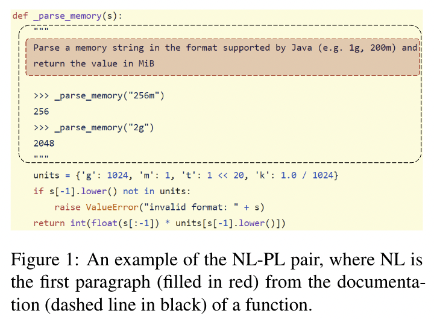

- [x] Round-1: Overview
- [x] Round-2: Model Implementation Details
- [ ] Round-3: Experiments

## Citation


Feng, Z., Guo, D., Tang, D., Duan, N., Feng, X., Gong, M., Shou, L., Qin, B., Liu, T., Jiang, D., & Zhou, M. (2020).  
CodeBERT: A Pre-Trained Model for Programming and Natural Languages.  
Findings of the Association for Computational Linguistics Findings of ACL: EMNLP 2020, 1536–1547.  
https://doi.org/10.18653/V1/2020.FINDINGS-EMNLP.139


## Abstract
> We present CodeBERT, a bimodal pre-trained model for programming language (PL) and natural language (NL). CodeBERT learns general-purpose representations that support downstream NL-PL applications such as natural language code search, code documentation generation, etc. We develop CodeBERT with Transformer-based neural architecture, and train it with a hybrid objective function that incorporates the pre-training task of replaced token detection, which is to detect plausible alternatives sampled from generators. This enables us to utilize both “bimodal” data of NL-PL pairs and “unimodal” data, where the former provides input tokens for model training while the latter helps to learn better generators. We evaluate CodeBERT on two NL-PL applications by fine-tuning model parameters. Results show that CodeBERT achieves state-of-the-art performance on both natural language code search and code documentation generation. Furthermore, to investigate what type of knowledge is learned in CodeBERT, we construct a dataset for NL-PL probing, and evaluate in a zero-shot setting where parameters of pre-trained models are fixed. Results show that CodeBERT performs better than previous pre-trained models on NL-PL probing.

## Code


## What's New

- コード（PL/Programming Language）と自然言語(NL/Natural Language)の意味的な結びつきを学習するモデルを提案した
  - NL-PLのNatural Language Understandingに関わるタスク広く適用可能
- マルチレイヤのTransformerをベースにモデルを設計
  - モデルのアーキテクチャは **RoBERTa** (Liu et al., 2019)と完全に同一
  - 損失関数を工夫した


Yinhan Liu, Myle Ott, Naman Goyal, Jingfei Du, Mandar Joshi, Danqi Chen, Omer Levy, M. Lewis, Luke Zettlemoyer, Veselin Stoyanov. (2019)  
**RoBERTa: A Robustly Optimized BERT Pretraining Approach**  
ArXiv  
[Paper Link](https://www.semanticscholar.org/paper/077f8329a7b6fa3b7c877a57b81eb6c18b5f87de)  
Influential Citation Count (2365), SS-ID (077f8329a7b6fa3b7c877a57b81eb6c18b5f87de)  
**ABSTRACT**  
Language model pretraining has led to significant performance gains but careful comparison between different approaches is challenging. Training is computationally expensive, often done on private datasets of different sizes, and, as we will show, hyperparameter choices have significant impact on the final results. We present a replication study of BERT pretraining (Devlin et al., 2019) that carefully measures the impact of many key hyperparameters and training data size. We find that BERT was significantly undertrained, and can match or exceed the performance of every model published after it. Our best model achieves state-of-the-art results on GLUE, RACE and SQuAD. These results highlight the importance of previously overlooked design choices, and raise questions about the source of recently reported improvements. We release our models and code.


## Dataset

- CodeSearch Dataset (Husain et al., 2019) &emsp; 

|Training Data|bimodal Data|unimodal Codes|
|---|---|---|
|GO| 319,256 | 726,768 |
|JAVA| 500,754 | 1,569,889 |
|JAVASCRIPT| 143,252 | 1,857,835 |
|PHP| 662,907 | 977,821 |
|PYTHON| 458, 219 | 1,156,085 |
|RUBY| 52,905 | 164,048 |
|ALL| 2,137,293 | 6,452,446 |

#### Example

<figure>
  
  <figcaption>An example of the NL-PL pair</figcaption>
</figure>

## Model Description

モデルのアーキテクチャは **RoBERTa** (Liu et al., 2019)と完全に同一．

### Pre-Training CodeBERT

#### Masked Language Modeling (MLM)

NL-PLのペア( $x=\lbrace \boldsymbol{w}, \boldsymbol{c} \rbrace$ )を入力として，NLとPLのトークン列それぞれに対してランダムにマスクするトークンを選択し，マスク $\boldsymbol{m}^{\boldsymbol{w}}, \boldsymbol{m}^{\boldsymbol{c}}$ を生成する．  
マスクされた単語はマスクトークン(`[MASK]`)に置き換えられる．  
Devlin et al. (2018) に従って $15%$ のトークンをマスクトークンに置き換える．

$$
\begin{align*}
  m\_i^w &\sim \text{unif} \lbrace 1, |\boldsymbol{w}| \rbrace & \hspace{10pt} & (i=1, \ldots, |\boldsymbol{w}|) \\\\
  m\_i^c &\sim \text{unif} \lbrace 1, |\boldsymbol{c}| \rbrace & \hspace{10pt} & (i=1, \ldots, |\boldsymbol{c}|) \\\\
  \boldsymbol{w}^{\text{masked}} &= \text{REPLACE}(\boldsymbol{w}, \boldsymbol{m}^{\boldsymbol{w}}, \text{[MASK]}) \\\\
  \boldsymbol{c}^{\text{masked}} &= \text{REPLACE}(\boldsymbol{c}, \boldsymbol{m}^{\boldsymbol{c}}, \text{[MASK]}) \\\\
  \boldsymbol{x} &= \boldsymbol{w} + \boldsymbol{c}
\end{align*}
$$

上記の前提のもとで，以下の損失関数を最小化する

$$
\mathcal{L}\_{\text{MLM}}(\theta) = \sum\_{i \in \boldsymbol{m}^{\boldsymbol{w}} \cup \boldsymbol{m}^{\boldsymbol{c}}} -\log p^{D\_1} \left( x\_i | \boldsymbol{w}^{\text{masked}}, \boldsymbol{c}^{\text{masked}}\right)
$$

$p^{D\_1}$ は語彙からトークンを予測するDiscriminator．


Devlin, J., Chang, M. W., Lee, K., & Toutanova, K. (2019).  
**BERT: Pre-training of deep bidirectional transformers for language understanding**  
NAACL HLT 2019 - 2019 Conference of the North American Chapter of the Association for Computational Linguistics: Human Language Technologies - Proceedings of the Conference, 1, 4171–4186.  
[Paper Link](https://aclanthology.org/N19-1423/)  
**ABSTRACT**  
> We introduce a new language representation model called BERT, which stands for Bidirectional Encoder Representations from Transformers. Unlike recent language representation models, BERT is designed to pre-train deep bidirectional representations from unlabeled text by jointly conditioning on both left and right context in all layers. As a result, the pre-trained BERT model can be fine-tuned with just one additional output layer to create state-of-the-art models for a wide range of tasks, such as question answering and language inference, without substantial task-specific architecture modifications. BERT is conceptually simple and empirically powerful. It obtains new state-of-the-art results on eleven natural language processing tasks, including pushing the GLUE score to 80.5% (7.7% point absolute improvement), MultiNLI accuracy to 86.7% (4.6% absolute improvement), SQuAD v1.1 question answering Test F1 to 93.2 (1.5 point absolute improvement) and SQuAD v2.0 Test F1 to 83.1 (5.1 point absolute improvement).


#### Replaced Token Detection (RTD)
Clark et al. (2020)によって提案された事前学習手法．マスク対象のトークンに対して，生成器が生成するトークンでオリジナルのトークンを置き換え，文章を構成する各トークンがオリジナルかどうかを二値分類させる．

$$
\begin{align*}
  \hat{w\_i} &\sim p^{G\_w} \left( w\_i | \boldsymbol{w}^{\text{masked}}\right) & \hspace{10pt} & (i \in \boldsymbol{m}^{\boldsymbol{w}}) \\\\
  \hat{c\_i} &\sim p^{G\_c} \left( c\_i | \boldsymbol{c}^{\text{masked}}\right) & \hspace{10pt} & (i \in \boldsymbol{m}^{\boldsymbol{c}}) \\\\
  \boldsymbol{w}^{\text{corrupt}} &= \text{REPLACE} (\boldsymbol{w}, \boldsymbol{m}^{\boldsymbol{w}}, \hat{\boldsymbol{w}}) \\\\
  \boldsymbol{c}^{\text{corrupt}} &= \text{REPLACE} (\boldsymbol{c}, \boldsymbol{m}^{\boldsymbol{c}}, \hat{\boldsymbol{c}}) \\\\
  \boldsymbol{x}^{\text{corrupt}} &= \boldsymbol{w}^{\text{corrupt}} + \boldsymbol{c}^{\text{corrupt}}
\end{align*}
$$


Kevin Clark, Minh-Thang Luong, Quoc V. Le, Christopher D. Manning. (2020)  
**ELECTRA: Pre-training Text Encoders as Discriminators Rather Than Generators**  
ICLR  
[Paper Link](https://www.semanticscholar.org/paper/756810258e3419af76aff38c895c20343b0602d0)  
Influential Citation Count (332), SS-ID (756810258e3419af76aff38c895c20343b0602d0)  
**ABSTRACT**  
While masked language modeling (MLM) pre-training methods such as BERT produce excellent results on downstream NLP tasks, they require large amounts of compute to be effective. These approaches corrupt the input by replacing some tokens with [MASK] and then train a model to reconstruct the original tokens. As an alternative, we propose a more sample-efficient pre-training task called replaced token detection. Instead of masking the input, our approach corrupts it by replacing some input tokens with plausible alternatives sampled from a small generator network. Then, instead of training a model that predicts the original identities of the corrupted tokens, we train a discriminative model that predicts whether each token in the corrupted input was replaced by a generator sample or not. Thorough experiments demonstrate this new pre-training task is more efficient than MLM because the model learns from all input tokens rather than just the small subset that was masked out. As a result, the contextual representations learned by our approach substantially outperform the ones learned by methods such as BERT and XLNet given the same model size, data, and compute. The gains are particularly strong for small models; for example, we train a model on one GPU for 4 days that outperforms GPT (trained using 30x more compute) on the GLUE natural language understanding benchmark. Our approach also works well at scale, where we match the performance of RoBERTa, the current state-of-the-art pre-trained transformer, while using less than 1/4 of the compute.


損失関数は以下．

$$
\begin{align*}
  \mathcal{L}\_{\text{RTD}}(\theta) &= \sum\_{i=1}^{|\boldsymbol{w}| + |\boldsymbol{c}|} \left( \delta (i) \log p^{D\_2} \left( \boldsymbol{x}^{\text{corrupt}}, i \right) | \left( 1 - \delta (i) \right) \left( 1 - \log p^{D\_2} \left( \boldsymbol{x}^{\text{corrupt}}, i \right) \right) \right) \\\\
  &\text{where} \\\\
  & \delta (i) = \left\lbrace \begin{array} \\\\
  1, \hspace{10pt} \text{if } x\_i^\text{corrupt} = x\_i \\\\
  0, \hspace{10pt} \text{otherwise}
  \end{array}\right.
\end{align*}
$$

#### Final Loss Function

$$
\min\_\theta \mathcal{L}\_\text{MLM} (\theta) + \mathcal{L}\_\text{RTD} (\theta)
$$

## Results

### Natural Language Code Search

## References



Yinhan Liu, Myle Ott, Naman Goyal, Jingfei Du, Mandar Joshi, Danqi Chen, Omer Levy, M. Lewis, Luke Zettlemoyer, Veselin Stoyanov. (2019)  
**RoBERTa: A Robustly Optimized BERT Pretraining Approach**  
ArXiv  
[Paper Link](https://www.semanticscholar.org/paper/077f8329a7b6fa3b7c877a57b81eb6c18b5f87de)  
Influential Citation Count (2365), SS-ID (077f8329a7b6fa3b7c877a57b81eb6c18b5f87de)  

**ABSTRACT**  
Language model pretraining has led to significant performance gains but careful comparison between different approaches is challenging. Training is computationally expensive, often done on private datasets of different sizes, and, as we will show, hyperparameter choices have significant impact on the final results. We present a replication study of BERT pretraining (Devlin et al., 2019) that carefully measures the impact of many key hyperparameters and training data size. We find that BERT was significantly undertrained, and can match or exceed the performance of every model published after it. Our best model achieves state-of-the-art results on GLUE, RACE and SQuAD. These results highlight the importance of previously overlooked design choices, and raise questions about the source of recently reported improvements. We release our models and code.





Kyunghyun Cho, Bart van Merrienboer, Çaglar Gülçehre, Dzmitry Bahdanau, Fethi Bougares, Holger Schwenk, Yoshua Bengio. (2014)  
**Learning Phrase Representations using RNN Encoder–Decoder for Statistical Machine Translation**  
EMNLP  
[Paper Link](https://www.semanticscholar.org/paper/0b544dfe355a5070b60986319a3f51fb45d1348e)  
Influential Citation Count (2734), SS-ID (0b544dfe355a5070b60986319a3f51fb45d1348e)  

**ABSTRACT**  
In this paper, we propose a novel neural network model called RNN Encoder‐ Decoder that consists of two recurrent neural networks (RNN). One RNN encodes a sequence of symbols into a fixedlength vector representation, and the other decodes the representation into another sequence of symbols. The encoder and decoder of the proposed model are jointly trained to maximize the conditional probability of a target sequence given a source sequence. The performance of a statistical machine translation system is empirically found to improve by using the conditional probabilities of phrase pairs computed by the RNN Encoder‐Decoder as an additional feature in the existing log-linear model. Qualitatively, we show that the proposed model learns a semantically and syntactically meaningful representation of linguistic phrases.





Yoon Kim. (2014)  
**Convolutional Neural Networks for Sentence Classification**  
EMNLP  
[Paper Link](https://www.semanticscholar.org/paper/1f6ba0782862ec12a5ec6d7fb608523d55b0c6ba)  
Influential Citation Count (1666), SS-ID (1f6ba0782862ec12a5ec6d7fb608523d55b0c6ba)  

**ABSTRACT**  
We report on a series of experiments with convolutional neural networks (CNN) trained on top of pre-trained word vectors for sentence-level classification tasks. We show that a simple CNN with little hyperparameter tuning and static vectors achieves excellent results on multiple benchmarks. Learning task-specific vectors through fine-tuning offers further gains in performance. We additionally propose a simple modification to the architecture to allow for the use of both task-specific and static vectors. The CNN models discussed herein improve upon the state of the art on 4 out of 7 tasks, which include sentiment analysis and question classification.





Ashish Vaswani, Noam M. Shazeer, Niki Parmar, Jakob Uszkoreit, Llion Jones, Aidan N. Gomez, Lukasz Kaiser, Illia Polosukhin. (2017)  
**Attention is All you Need**  
NIPS  
[Paper Link](https://www.semanticscholar.org/paper/204e3073870fae3d05bcbc2f6a8e263d9b72e776)  
Influential Citation Count (8540), SS-ID (204e3073870fae3d05bcbc2f6a8e263d9b72e776)  

**ABSTRACT**  
The dominant sequence transduction models are based on complex recurrent or convolutional neural networks in an encoder-decoder configuration. The best performing models also connect the encoder and decoder through an attention mechanism. We propose a new simple network architecture, the Transformer, based solely on attention mechanisms, dispensing with recurrence and convolutions entirely. Experiments on two machine translation tasks show these models to be superior in quality while being more parallelizable and requiring significantly less time to train. Our model achieves 28.4 BLEU on the WMT 2014 English-to-German translation task, improving over the existing best results, including ensembles by over 2 BLEU. On the WMT 2014 English-to-French translation task, our model establishes a new single-model state-of-the-art BLEU score of 41.8 after training for 3.5 days on eight GPUs, a small fraction of the training costs of the best models from the literature. We show that the Transformer generalizes well to other tasks by applying it successfully to English constituency parsing both with large and limited training data.





Srini Iyer, Ioannis Konstas, Alvin Cheung, Luke Zettlemoyer. (2016)  
**Summarizing Source Code using a Neural Attention Model**  
ACL  
[Paper Link](https://www.semanticscholar.org/paper/32aa2517b03c871c11e521c2a3406f457833e2c3)  
Influential Citation Count (84), SS-ID (32aa2517b03c871c11e521c2a3406f457833e2c3)  

**ABSTRACT**  
High quality source code is often paired with high level summaries of the computation it performs, for example in code documentation or in descriptions posted in online forums. Such summaries are extremely useful for applications such as code search but are expensive to manually author, hence only done for a small fraction of all code that is produced. In this paper, we present the first completely datadriven approach for generating high level summaries of source code. Our model, CODE-NN , uses Long Short Term Memory (LSTM) networks with attention to produce sentences that describe C# code snippets and SQL queries. CODE-NN is trained on a new corpus that is automatically collected from StackOverflow, which we release. Experiments demonstrate strong performance on two tasks: (1) code summarization, where we establish the first end-to-end learning results and outperform strong baselines, and (2) code retrieval, where our learned model improves the state of the art on a recently introduced C# benchmark by a large margin.





Kai Sheng Tai, R. Socher, Christopher D. Manning. (2015)  
**Improved Semantic Representations From Tree-Structured Long Short-Term Memory Networks**  
ACL  
[Paper Link](https://www.semanticscholar.org/paper/32de44f01a96d4473d21099d15e25bc2b9f08e2f)  
Influential Citation Count (401), SS-ID (32de44f01a96d4473d21099d15e25bc2b9f08e2f)  

**ABSTRACT**  
Because of their superior ability to preserve sequence information over time, Long Short-Term Memory (LSTM) networks, a type of recurrent neural network with a more complex computational unit, have obtained strong results on a variety of sequence modeling tasks. The only underlying LSTM structure that has been explored so far is a linear chain. However, natural language exhibits syntactic properties that would naturally combine words to phrases. We introduce the Tree-LSTM, a generalization of LSTMs to tree-structured network topologies. Tree-LSTMs outperform all existing systems and strong LSTM baselines on two tasks: predicting the semantic relatedness of two sentences (SemEval 2014, Task 1) and sentiment classification (Stanford Sentiment Treebank).





M. Lewis, Yinhan Liu, Naman Goyal, Marjan Ghazvininejad, Abdelrahman Mohamed, Omer Levy, Veselin Stoyanov, Luke Zettlemoyer. (2019)  
**BART: Denoising Sequence-to-Sequence Pre-training for Natural Language Generation, Translation, and Comprehension**  
ACL  
[Paper Link](https://www.semanticscholar.org/paper/395de0bd3837fdf4b4b5e5f04835bcc69c279481)  
Influential Citation Count (625), SS-ID (395de0bd3837fdf4b4b5e5f04835bcc69c279481)  

**ABSTRACT**  
We present BART, a denoising autoencoder for pretraining sequence-to-sequence models. BART is trained by (1) corrupting text with an arbitrary noising function, and (2) learning a model to reconstruct the original text. It uses a standard Tranformer-based neural machine translation architecture which, despite its simplicity, can be seen as generalizing BERT (due to the bidirectional encoder), GPT (with the left-to-right decoder), and other recent pretraining schemes. We evaluate a number of noising approaches, finding the best performance by both randomly shuffling the order of sentences and using a novel in-filling scheme, where spans of text are replaced with a single mask token. BART is particularly effective when fine tuned for text generation but also works well for comprehension tasks. It matches the performance of RoBERTa on GLUE and SQuAD, and achieves new state-of-the-art results on a range of abstractive dialogue, question answering, and summarization tasks, with gains of up to 3.5 ROUGE. BART also provides a 1.1 BLEU increase over a back-translation system for machine translation, with only target language pretraining. We also replicate other pretraining schemes within the BART framework, to understand their effect on end-task performance.





Colin Raffel, Noam M. Shazeer, Adam Roberts, Katherine Lee, Sharan Narang, Michael Matena, Yanqi Zhou, Wei Li, Peter J. Liu. (2019)  
**Exploring the Limits of Transfer Learning with a Unified Text-to-Text Transformer**  
J. Mach. Learn. Res.  
[Paper Link](https://www.semanticscholar.org/paper/3cfb319689f06bf04c2e28399361f414ca32c4b3)  
Influential Citation Count (779), SS-ID (3cfb319689f06bf04c2e28399361f414ca32c4b3)  

**ABSTRACT**  
Transfer learning, where a model is first pre-trained on a data-rich task before being fine-tuned on a downstream task, has emerged as a powerful technique in natural language processing (NLP). The effectiveness of transfer learning has given rise to a diversity of approaches, methodology, and practice. In this paper, we explore the landscape of transfer learning techniques for NLP by introducing a unified framework that converts every language problem into a text-to-text format. Our systematic study compares pre-training objectives, architectures, unlabeled datasets, transfer approaches, and other factors on dozens of language understanding tasks. By combining the insights from our exploration with scale and our new "Colossal Clean Crawled Corpus", we achieve state-of-the-art results on many benchmarks covering summarization, question answering, text classification, and more. To facilitate future work on transfer learning for NLP, we release our dataset, pre-trained models, and code.





Matthew E. Peters, Mark Neumann, Mohit Iyyer, Matt Gardner, Christopher Clark, Kenton Lee, Luke Zettlemoyer. (2018)  
**Deep Contextualized Word Representations**  
NAACL  
[Paper Link](https://www.semanticscholar.org/paper/3febb2bed8865945e7fddc99efd791887bb7e14f)  
Influential Citation Count (1400), SS-ID (3febb2bed8865945e7fddc99efd791887bb7e14f)  

**ABSTRACT**  
We introduce a new type of deep contextualized word representation that models both (1) complex characteristics of word use (e.g., syntax and semantics), and (2) how these uses vary across linguistic contexts (i.e., to model polysemy). Our word vectors are learned functions of the internal states of a deep bidirectional language model (biLM), which is pre-trained on a large text corpus. We show that these representations can be easily added to existing models and significantly improve the state of the art across six challenging NLP problems, including question answering, textual entailment and sentiment analysis. We also present an analysis showing that exposing the deep internals of the pre-trained network is crucial, allowing downstream models to mix different types of semi-supervision signals.





Devlin, J., Chang, M. W., Lee, K., & Toutanova, K. (2019).  
**BERT: Pre-training of deep bidirectional transformers for language understanding**  
NAACL HLT 2019 - 2019 Conference of the North American Chapter of the Association for Computational Linguistics: Human Language Technologies - Proceedings of the Conference, 1, 4171–4186.  
[Paper Link](https://aclanthology.org/N19-1423/)  

**ABSTRACT**  
> We introduce a new language representation model called BERT, which stands for Bidirectional Encoder Representations from Transformers. Unlike recent language representation models, BERT is designed to pre-train deep bidirectional representations from unlabeled text by jointly conditioning on both left and right context in all layers. As a result, the pre-trained BERT model can be fine-tuned with just one additional output layer to create state-of-the-art models for a wide range of tasks, such as question answering and language inference, without substantial task-specific architecture modifications. BERT is conceptually simple and empirically powerful. It obtains new state-of-the-art results on eleven natural language processing tasks, including pushing the GLUE score to 80.5% (7.7% point absolute improvement), MultiNLI accuracy to 86.7% (4.6% absolute improvement), SQuAD v1.1 question answering Test F1 to 93.2 (1.5 point absolute improvement) and SQuAD v2.0 Test F1 to 83.1 (5.1 point absolute improvement).





Chin-Yew Lin, F. Och. (2004)  
**ORANGE: a Method for Evaluating Automatic Evaluation Metrics for Machine Translation**  
COLING  
[Paper Link](https://www.semanticscholar.org/paper/443516aeb2819d4d362ffe7d5418a54e5427a016)  
Influential Citation Count (47), SS-ID (443516aeb2819d4d362ffe7d5418a54e5427a016)  

**ABSTRACT**  
Comparisons of automatic evaluation metrics for machine translation are usually conducted on corpus level using correlation statistics such as Pearson's product moment correlation coefficient or Spearman's rank order correlation coefficient between human scores and automatic scores. However, such comparisons rely on human judgments of translation qualities such as adequacy and fluency. Unfortunately, these judgments are often inconsistent and very expensive to acquire. In this paper, we introduce a new evaluation method, Orange, for evaluating automatic machine translation evaluation metrics automatically without extra human involvement other than using a set of reference translations. We also show the results of comparing several existing automatic metrics and three new automatic metrics using Orange.





Aditya Kanade, Petros Maniatis, G. Balakrishnan, Kensen Shi. (2019)  
**Pre-trained Contextual Embedding of Source Code**  
ArXiv  
[Paper Link](https://www.semanticscholar.org/paper/463fefdbd81a4a0a32cf59bc58a9545757c8cf2e)  
Influential Citation Count (4), SS-ID (463fefdbd81a4a0a32cf59bc58a9545757c8cf2e)  

**ABSTRACT**  
The source code of a program not only serves as a formal description of an executable task, but it also serves to communicate developer intent in a human-readable form. To facilitate this, developers use meaningful identifier names and natural-language documentation. This makes it possible to successfully apply sequence-modeling approaches, shown to be effective in natural-language processing, to source code. A major advancement in natural-language understanding has been the use of pre-trained token embeddings; BERT and other works have further shown that pre-trained contextual embeddings can be extremely powerful and can be fine-tuned effectively for a variety of downstream supervised tasks. Inspired by these developments, we present the first attempt to replicate this success on source code. We curate a massive corpus of Python programs from GitHub to pre-train a BERT model, which we call Code Understanding BERT (CuBERT). We also pre-train Word2Vec embeddings on the same dataset. We create a benchmark of five classification tasks and compare fine-tuned CuBERT against sequence models trained with and without the Word2Vec embeddings. Our results show that CuBERT outperforms the baseline methods by a margin of 2.9-22%. We also show its superiority when fine-tuned with smaller datasets, and over fewer epochs. We further evaluate CuBERT's effectiveness on a joint classification, localization and repair task involving prediction of two pointers.





Philipp Koehn, Hieu T. Hoang, Alexandra Birch, Chris Callison-Burch, Marcello Federico, N. Bertoldi, Brooke Cowan, Wade Shen, C. Moran, R. Zens, Chris Dyer, Ondrej Bojar, Alexandra Constantin, Evan Herbst. (2007)  
**Moses: Open Source Toolkit for Statistical Machine Translation**  
ACL  
[Paper Link](https://www.semanticscholar.org/paper/4ee2eab4c298c1824a9fb8799ad8eed21be38d21)  
Influential Citation Count (819), SS-ID (4ee2eab4c298c1824a9fb8799ad8eed21be38d21)  

**ABSTRACT**  
We describe an open-source toolkit for statistical machine translation whose novel contributions are (a) support for linguistically motivated factors, (b) confusion network decoding, and (c) efficient data formats for translation models and language models. In addition to the SMT decoder, the toolkit also includes a wide variety of tools for training, tuning and applying the system to many translation tasks.





Alexander M. Rush, S. Chopra, J. Weston. (2015)  
**A Neural Attention Model for Abstractive Sentence Summarization**  
EMNLP  
[Paper Link](https://www.semanticscholar.org/paper/5082a1a13daea5c7026706738f8528391a1e6d59)  
Influential Citation Count (268), SS-ID (5082a1a13daea5c7026706738f8528391a1e6d59)  

**ABSTRACT**  
Summarization based on text extraction is inherently limited, but generation-style abstractive methods have proven challenging to build. In this work, we propose a fully data-driven approach to abstractive sentence summarization. Our method utilizes a local attention-based model that generates each word of the summary conditioned on the input sentence. While the model is structurally simple, it can easily be trained end-to-end and scales to a large amount of training data. The model shows significant performance gains on the DUC-2004 shared task compared with several strong baselines.





Alon Talmor, Yanai Elazar, Yoav Goldberg, Jonathan Berant. (2019)  
**oLMpics-On What Language Model Pre-training Captures**  
Transactions of the Association for Computational Linguistics  
[Paper Link](https://www.semanticscholar.org/paper/5e0cffc51e8b64a8f11326f955fa4b4f1803e3be)  
Influential Citation Count (19), SS-ID (5e0cffc51e8b64a8f11326f955fa4b4f1803e3be)  

**ABSTRACT**  
Abstract Recent success of pre-trained language models (LMs) has spurred widespread interest in the language capabilities that they possess. However, efforts to understand whether LM representations are useful for symbolic reasoning tasks have been limited and scattered. In this work, we propose eight reasoning tasks, which conceptually require operations such as comparison, conjunction, and composition. A fundamental challenge is to understand whether the performance of a LM on a task should be attributed to the pre-trained representations or to the process of fine-tuning on the task data. To address this, we propose an evaluation protocol that includes both zero-shot evaluation (no fine-tuning), as well as comparing the learning curve of a fine-tuned LM to the learning curve of multiple controls, which paints a rich picture of the LM capabilities. Our main findings are that: (a) different LMs exhibit qualitatively different reasoning abilities, e.g., RoBERTa succeeds in reasoning tasks where BERT fails completely; (b) LMs do not reason in an abstract manner and are context-dependent, e.g., while RoBERTa can compare ages, it can do so only when the ages are in the typical range of human ages; (c) On half of our reasoning tasks all models fail completely. Our findings and infrastructure can help future work on designing new datasets, models, and objective functions for pre-training.





Bhaskar Mitra, Nick Craswell. (2018)  
**An Introduction to Neural Information Retrieval**  
Found. Trends Inf. Retr.  
[Paper Link](https://www.semanticscholar.org/paper/5f2cbe15668ed1365d3b3f34b13691673a75bfea)  
Influential Citation Count (13), SS-ID (5f2cbe15668ed1365d3b3f34b13691673a75bfea)  

**ABSTRACT**  
Neural models have been employed in many Information Retrieval scenarios, including ad-hoc retrieval, recommender systems, multi-media search, and even conversational systems that generate answers in response to natural language questions. An Introduction to Neural Information Retrieval provides a tutorial introduction to neural methods for ranking documents in response to a query, an important IR task. The monograph provides a complete picture of neural information retrieval techniques that culminate in supervised neural learning to rank models including deep neural network architectures that are trained end-to-end for ranking tasks. In reaching this point, the authors cover all the important topics, including the learning to rank framework and an overview of deep neural networks. This monograph provides an accessible, yet comprehensive, overview of the state-of-the-art of Neural Information Retrieval.





Jiasen Lu, Dhruv Batra, Devi Parikh, Stefan Lee. (2019)  
**ViLBERT: Pretraining Task-Agnostic Visiolinguistic Representations for Vision-and-Language Tasks**  
NeurIPS  
[Paper Link](https://www.semanticscholar.org/paper/65a9c7b0800c86a196bc14e7621ff895cc6ab287)  
Influential Citation Count (256), SS-ID (65a9c7b0800c86a196bc14e7621ff895cc6ab287)  

**ABSTRACT**  
We present ViLBERT (short for Vision-and-Language BERT), a model for learning task-agnostic joint representations of image content and natural language. We extend the popular BERT architecture to a multi-modal two-stream model, pro-cessing both visual and textual inputs in separate streams that interact through co-attentional transformer layers. We pretrain our model through two proxy tasks on the large, automatically collected Conceptual Captions dataset and then transfer it to multiple established vision-and-language tasks -- visual question answering, visual commonsense reasoning, referring expressions, and caption-based image retrieval -- by making only minor additions to the base architecture. We observe significant improvements across tasks compared to existing task-specific models -- achieving state-of-the-art on all four tasks. Our work represents a shift away from learning groundings between vision and language only as part of task training and towards treating visual grounding as a pretrainable and transferable capability.





Kevin Clark, Minh-Thang Luong, Quoc V. Le, Christopher D. Manning. (2020)  
**ELECTRA: Pre-training Text Encoders as Discriminators Rather Than Generators**  
ICLR  
[Paper Link](https://www.semanticscholar.org/paper/756810258e3419af76aff38c895c20343b0602d0)  
Influential Citation Count (332), SS-ID (756810258e3419af76aff38c895c20343b0602d0)  

**ABSTRACT**  
While masked language modeling (MLM) pre-training methods such as BERT produce excellent results on downstream NLP tasks, they require large amounts of compute to be effective. These approaches corrupt the input by replacing some tokens with [MASK] and then train a model to reconstruct the original tokens. As an alternative, we propose a more sample-efficient pre-training task called replaced token detection. Instead of masking the input, our approach corrupts it by replacing some input tokens with plausible alternatives sampled from a small generator network. Then, instead of training a model that predicts the original identities of the corrupted tokens, we train a discriminative model that predicts whether each token in the corrupted input was replaced by a generator sample or not. Thorough experiments demonstrate this new pre-training task is more efficient than MLM because the model learns from all input tokens rather than just the small subset that was masked out. As a result, the contextual representations learned by our approach substantially outperform the ones learned by methods such as BERT and XLNet given the same model size, data, and compute. The gains are particularly strong for small models; for example, we train a model on one GPU for 4 days that outperforms GPT (trained using 30x more compute) on the GLUE natural language understanding benchmark. Our approach also works well at scale, where we match the performance of RoBERTa, the current state-of-the-art pre-trained transformer, while using less than 1/4 of the compute.





Telmo J. P. Pires, Eva Schlinger, Dan Garrette. (2019)  
**How Multilingual is Multilingual BERT?**  
ACL  
[Paper Link](https://www.semanticscholar.org/paper/809cc93921e4698bde891475254ad6dfba33d03b)  
Influential Citation Count (69), SS-ID (809cc93921e4698bde891475254ad6dfba33d03b)  

**ABSTRACT**  
In this paper, we show that Multilingual BERT (M-BERT), released by Devlin et al. (2018) as a single language model pre-trained from monolingual corpora in 104 languages, is surprisingly good at zero-shot cross-lingual model transfer, in which task-specific annotations in one language are used to fine-tune the model for evaluation in another language. To understand why, we present a large number of probing experiments, showing that transfer is possible even to languages in different scripts, that transfer works best between typologically similar languages, that monolingual corpora can train models for code-switching, and that the model can find translation pairs. From these results, we can conclude that M-BERT does create multilingual representations, but that these representations exhibit systematic deficiencies affecting certain language pairs.





Uri Alon, Shaked Brody, Omer Levy, Eran Yahav. (2018)  
**code2seq: Generating Sequences from Structured Representations of Code**  
ICLR  
[Paper Link](https://www.semanticscholar.org/paper/98d1307bed619b58b4a44acd8e65ac58495776c2)  
Influential Citation Count (99), SS-ID (98d1307bed619b58b4a44acd8e65ac58495776c2)  

**ABSTRACT**  
The ability to generate natural language sequences from source code snippets has a variety of applications such as code summarization, documentation, and retrieval. Sequence-to-sequence (seq2seq) models, adopted from neural machine translation (NMT), have achieved state-of-the-art performance on these tasks by treating source code as a sequence of tokens. We present ${\rm {\scriptsize CODE2SEQ}}$: an alternative approach that leverages the syntactic structure of programming languages to better encode source code. Our model represents a code snippet as the set of compositional paths in its abstract syntax tree (AST) and uses attention to select the relevant paths while decoding. We demonstrate the effectiveness of our approach for two tasks, two programming languages, and four datasets of up to $16$M examples. Our model significantly outperforms previous models that were specifically designed for programming languages, as well as state-of-the-art NMT models. An interactive online demo of our model is available at this http URL Our code, data and trained models are available at this http URL





Philipp Koehn, Marcello Federico, Wade Shen, N. Bertoldi, Chris Callison-Burch, Ondrej Bojar, Brooke Cowan, Chris Dyer, Hieu T. Hoang, R. Zens, Alexandra Constantin, Evan Herbst, C. Moran. (2006)  
**Open Source Toolkit for Statistical Machine Translation: Factored Translation Models and Lattice Decoding**  
  
[Paper Link](https://www.semanticscholar.org/paper/99e8d34817ae10d7304521e89c5fbf908b9d856b)  
Influential Citation Count (66), SS-ID (99e8d34817ae10d7304521e89c5fbf908b9d856b)  

**ABSTRACT**  





Diederik P. Kingma, Jimmy Ba. (2014)  
**Adam: A Method for Stochastic Optimization**  
ICLR  
[Paper Link](https://www.semanticscholar.org/paper/a6cb366736791bcccc5c8639de5a8f9636bf87e8)  
Influential Citation Count (15699), SS-ID (a6cb366736791bcccc5c8639de5a8f9636bf87e8)  

**ABSTRACT**  
We introduce Adam, an algorithm for first-order gradient-based optimization of stochastic objective functions, based on adaptive estimates of lower-order moments. The method is straightforward to implement, is computationally efficient, has little memory requirements, is invariant to diagonal rescaling of the gradients, and is well suited for problems that are large in terms of data and/or parameters. The method is also appropriate for non-stationary objectives and problems with very noisy and/or sparse gradients. The hyper-parameters have intuitive interpretations and typically require little tuning. Some connections to related algorithms, on which Adam was inspired, are discussed. We also analyze the theoretical convergence properties of the algorithm and provide a regret bound on the convergence rate that is comparable to the best known results under the online convex optimization framework. Empirical results demonstrate that Adam works well in practice and compares favorably to other stochastic optimization methods. Finally, we discuss AdaMax, a variant of Adam based on the infinity norm.





Chen Sun, Austin Myers, Carl Vondrick, K. Murphy, C. Schmid. (2019)  
**VideoBERT: A Joint Model for Video and Language Representation Learning**  
2019 IEEE/CVF International Conference on Computer Vision (ICCV)  
[Paper Link](https://www.semanticscholar.org/paper/c41a11c0e9b8b92b4faaf97749841170b760760a)  
Influential Citation Count (53), SS-ID (c41a11c0e9b8b92b4faaf97749841170b760760a)  

**ABSTRACT**  
Self-supervised learning has become increasingly important to leverage the abundance of unlabeled data available on platforms like YouTube. Whereas most existing approaches learn low-level representations, we propose a joint visual-linguistic model to learn high-level features without any explicit supervision. In particular, inspired by its recent success in language modeling, we build upon the BERT model to learn bidirectional joint distributions over sequences of visual and linguistic tokens, derived from vector quantization of video data and off-the-shelf speech recognition outputs, respectively. We use VideoBERT in numerous tasks, including action classification and video captioning. We show that it can be applied directly to open-vocabulary classification, and confirm that large amounts of training data and cross-modal information are critical to performance. Furthermore, we outperform the state-of-the-art on video captioning, and quantitative results verify that the model learns high-level semantic features.





Alec Radford, Karthik Narasimhan. (2018)  
**Improving Language Understanding by Generative Pre-Training**  
  
[Paper Link](https://www.semanticscholar.org/paper/cd18800a0fe0b668a1cc19f2ec95b5003d0a5035)  
Influential Citation Count (646), SS-ID (cd18800a0fe0b668a1cc19f2ec95b5003d0a5035)  

**ABSTRACT**  
Natural language understanding comprises a wide range of diverse tasks such as textual entailment, question answering, semantic similarity assessment, and document classification. Although large unlabeled text corpora are abundant, labeled data for learning these specific tasks is scarce, making it challenging for discriminatively trained models to perform adequately. We demonstrate that large gains on these tasks can be realized by generative pre-training of a language model on a diverse corpus of unlabeled text, followed by discriminative fine-tuning on each specific task. In contrast to previous approaches, we make use of task-aware input transformations during fine-tuning to achieve effective transfer while requiring minimal changes to the model architecture. We demonstrate the effectiveness of our approach on a wide range of benchmarks for natural language understanding. Our general task-agnostic model outperforms discriminatively trained models that use architectures specifically crafted for each task, significantly improving upon the state of the art in 9 out of the 12 tasks studied. For instance, we achieve absolute improvements of 8.9% on commonsense reasoning (Stories Cloze Test), 5.7% on question answering (RACE), and 1.5% on textual entailment (MultiNLI).





Ilya Sutskever, Oriol Vinyals, Quoc V. Le. (2014)  
**Sequence to Sequence Learning with Neural Networks**  
NIPS  
[Paper Link](https://www.semanticscholar.org/paper/cea967b59209c6be22829699f05b8b1ac4dc092d)  
Influential Citation Count (1331), SS-ID (cea967b59209c6be22829699f05b8b1ac4dc092d)  

**ABSTRACT**  
Deep Neural Networks (DNNs) are powerful models that have achieved excellent performance on difficult learning tasks. Although DNNs work well whenever large labeled training sets are available, they cannot be used to map sequences to sequences. In this paper, we present a general end-to-end approach to sequence learning that makes minimal assumptions on the sequence structure. Our method uses a multilayered Long Short-Term Memory (LSTM) to map the input sequence to a vector of a fixed dimensionality, and then another deep LSTM to decode the target sequence from the vector. Our main result is that on an English to French translation task from the WMT-14 dataset, the translations produced by the LSTM achieve a BLEU score of 34.8 on the entire test set, where the LSTM's BLEU score was penalized on out-of-vocabulary words. Additionally, the LSTM did not have difficulty on long sentences. For comparison, a phrase-based SMT system achieves a BLEU score of 33.3 on the same dataset. When we used the LSTM to rerank the 1000 hypotheses produced by the aforementioned SMT system, its BLEU score increases to 36.5, which is close to the previous state of the art. The LSTM also learned sensible phrase and sentence representations that are sensitive to word order and are relatively invariant to the active and the passive voice. Finally, we found that reversing the order of the words in all source sentences (but not target sentences) improved the LSTM's performance markedly, because doing so introduced many short term dependencies between the source and the target sentence which made the optimization problem easier.





Fabio Petroni, Tim Rocktäschel, Patrick Lewis, A. Bakhtin, Yuxiang Wu, Alexander H. Miller, S. Riedel. (2019)  
**Language Models as Knowledge Bases?**  
EMNLP  
[Paper Link](https://www.semanticscholar.org/paper/d0086b86103a620a86bc918746df0aa642e2a8a3)  
Influential Citation Count (134), SS-ID (d0086b86103a620a86bc918746df0aa642e2a8a3)  

**ABSTRACT**  
Recent progress in pretraining language models on large textual corpora led to a surge of improvements for downstream NLP tasks. Whilst learning linguistic knowledge, these models may also be storing relational knowledge present in the training data, and may be able to answer queries structured as “fill-in-the-blank” cloze statements. Language models have many advantages over structured knowledge bases: they require no schema engineering, allow practitioners to query about an open class of relations, are easy to extend to more data, and require no human supervision to train. We present an in-depth analysis of the relational knowledge already present (without fine-tuning) in a wide range of state-of-the-art pretrained language models. We find that (i) without fine-tuning, BERT contains relational knowledge competitive with traditional NLP methods that have some access to oracle knowledge, (ii) BERT also does remarkably well on open-domain question answering against a supervised baseline, and (iii) certain types of factual knowledge are learned much more readily than others by standard language model pretraining approaches. The surprisingly strong ability of these models to recall factual knowledge without any fine-tuning demonstrates their potential as unsupervised open-domain QA systems. The code to reproduce our analysis is available at https://github.com/facebookresearch/LAMA.





Kishore Papineni, S. Roukos, T. Ward, Wei-Jing Zhu. (2002)  
**Bleu: a Method for Automatic Evaluation of Machine Translation**  
ACL  
[Paper Link](https://www.semanticscholar.org/paper/d7da009f457917aa381619facfa5ffae9329a6e9)  
Influential Citation Count (4412), SS-ID (d7da009f457917aa381619facfa5ffae9329a6e9)  

**ABSTRACT**  
Human evaluations of machine translation are extensive but expensive. Human evaluations can take months to finish and involve human labor that can not be reused. We propose a method of automatic machine translation evaluation that is quick, inexpensive, and language-independent, that correlates highly with human evaluation, and that has little marginal cost per run. We present this method as an automated understudy to skilled human judges which substitutes for them when there is need for quick or frequent evaluations.





Yonghui Wu, M. Schuster, Z. Chen, Quoc V. Le, Mohammad Norouzi, Wolfgang Macherey, M. Krikun, Yuan Cao, Qin Gao, Klaus Macherey, J. Klingner, Apurva Shah, Melvin Johnson, Xiaobing Liu, Lukasz Kaiser, Stephan Gouws, Y. Kato, Taku Kudo, H. Kazawa, K. Stevens, George Kurian, Nishant Patil, Wei Wang, C. Young, Jason R. Smith, Jason Riesa, Alex Rudnick, Oriol Vinyals, G. Corrado, Macduff Hughes, J. Dean. (2016)  
**Google's Neural Machine Translation System: Bridging the Gap between Human and Machine Translation**  
ArXiv  
[Paper Link](https://www.semanticscholar.org/paper/dbde7dfa6cae81df8ac19ef500c42db96c3d1edd)  
Influential Citation Count (364), SS-ID (dbde7dfa6cae81df8ac19ef500c42db96c3d1edd)  

**ABSTRACT**  
Neural Machine Translation (NMT) is an end-to-end learning approach for automated translation, with the potential to overcome many of the weaknesses of conventional phrase-based translation systems. Unfortunately, NMT systems are known to be computationally expensive both in training and in translation inference. Also, most NMT systems have difficulty with rare words. These issues have hindered NMT's use in practical deployments and services, where both accuracy and speed are essential. In this work, we present GNMT, Google's Neural Machine Translation system, which attempts to address many of these issues. Our model consists of a deep LSTM network with 8 encoder and 8 decoder layers using attention and residual connections. To improve parallelism and therefore decrease training time, our attention mechanism connects the bottom layer of the decoder to the top layer of the encoder. To accelerate the final translation speed, we employ low-precision arithmetic during inference computations. To improve handling of rare words, we divide words into a limited set of common sub-word units ("wordpieces") for both input and output. This method provides a good balance between the flexibility of "character"-delimited models and the efficiency of "word"-delimited models, naturally handles translation of rare words, and ultimately improves the overall accuracy of the system. Our beam search technique employs a length-normalization procedure and uses a coverage penalty, which encourages generation of an output sentence that is most likely to cover all the words in the source sentence. On the WMT'14 English-to-French and English-to-German benchmarks, GNMT achieves competitive results to state-of-the-art. Using a human side-by-side evaluation on a set of isolated simple sentences, it reduces translation errors by an average of 60% compared to Google's phrase-based production system.





Xiaodong Gu, Hongyu Zhang, Sunghun Kim. (2018)  
**Deep Code Search**  
2018 IEEE/ACM 40th International Conference on Software Engineering (ICSE)  
[Paper Link](https://www.semanticscholar.org/paper/e033a0b29af2939fd44e5765d03380c08897a9e8)  
Influential Citation Count (46), SS-ID (e033a0b29af2939fd44e5765d03380c08897a9e8)  

**ABSTRACT**  
To implement a program functionality, developers can reuse previously written code snippets by searching through a large-scale codebase. Over the years, many code search tools have been proposed to help developers. The existing approaches often treat source code as textual documents and utilize information retrieval models to retrieve relevant code snippets that match a given query. These approaches mainly rely on the textual similarity between source code and natural language query. They lack a deep understanding of the semantics of queries and source code. In this paper, we propose a novel deep neural network named CODEnn (Code-Description Embedding Neural Network). Instead of matching text similarity, CODEnn jointly embeds code snippets and natural language descriptions into a high-dimensional vector space, in such a way that code snippet and its corresponding description have similar vectors. Using the unified vector representation, code snippets related to a natural language query can be retrieved according to their vectors. Semantically related words can also be recognized and irrelevant/noisy keywords in queries can be handled. As a proof-of-concept application, we implement a code search tool named DeepCS using the proposed CODEnn model. We empirically evaluate DeepCS on a large scale codebase collected from GitHub. The experimental results show that our approach can effectively retrieve relevant code snippets and outperforms previous techniques.





Zhilin Yang, Zihang Dai, Yiming Yang, J. Carbonell, R. Salakhutdinov, Quoc V. Le. (2019)  
**XLNet: Generalized Autoregressive Pretraining for Language Understanding**  
NeurIPS  
[Paper Link](https://www.semanticscholar.org/paper/e0c6abdbdecf04ffac65c440da77fb9d66bb474c)  
Influential Citation Count (692), SS-ID (e0c6abdbdecf04ffac65c440da77fb9d66bb474c)  

**ABSTRACT**  
With the capability of modeling bidirectional contexts, denoising autoencoding based pretraining like BERT achieves better performance than pretraining approaches based on autoregressive language modeling. However, relying on corrupting the input with masks, BERT neglects dependency between the masked positions and suffers from a pretrain-finetune discrepancy. In light of these pros and cons, we propose XLNet, a generalized autoregressive pretraining method that (1) enables learning bidirectional contexts by maximizing the expected likelihood over all permutations of the factorization order and (2) overcomes the limitations of BERT thanks to its autoregressive formulation. Furthermore, XLNet integrates ideas from Transformer-XL, the state-of-the-art autoregressive model, into pretraining. Empirically, under comparable experiment settings, XLNet outperforms BERT on 20 tasks, often by a large margin, including question answering, natural language inference, sentiment analysis, and document ranking.





H. Husain, Hongqi Wu, Tiferet Gazit, Miltiadis Allamanis, M. Brockschmidt. (2019)  
**CodeSearchNet Challenge: Evaluating the State of Semantic Code Search**  
ArXiv  
[Paper Link](https://www.semanticscholar.org/paper/fbe25e4f069a19dc63daca27b7c98cff338663b9)  
Influential Citation Count (71), SS-ID (fbe25e4f069a19dc63daca27b7c98cff338663b9)  

**ABSTRACT**  
Semantic code search is the task of retrieving relevant code given a natural language query. While related to other information retrieval tasks, it requires bridging the gap between the language used in code (often abbreviated and highly technical) and natural language more suitable to describe vague concepts and ideas.  To enable evaluation of progress on code search, we are releasing the CodeSearchNet Corpus and are presenting the CodeSearchNet Challenge, which consists of 99 natural language queries with about 4k expert relevance annotations of likely results from CodeSearchNet Corpus. The corpus contains about 6 million functions from open-source code spanning six programming languages (Go, Java, JavaScript, PHP, Python, and Ruby). The CodeSearchNet Corpus also contains automatically generated query-like natural language for 2 million functions, obtained from mechanically scraping and preprocessing associated function documentation. In this article, we describe the methodology used to obtain the corpus and expert labels, as well as a number of simple baseline solutions for the task.  We hope that CodeSearchNet Challenge encourages researchers and practitioners to study this interesting task further and will host a competition and leaderboard to track the progress on the challenge. We are also keen on extending CodeSearchNet Challenge to more queries and programming languages in the future.



