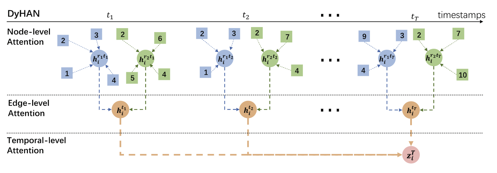
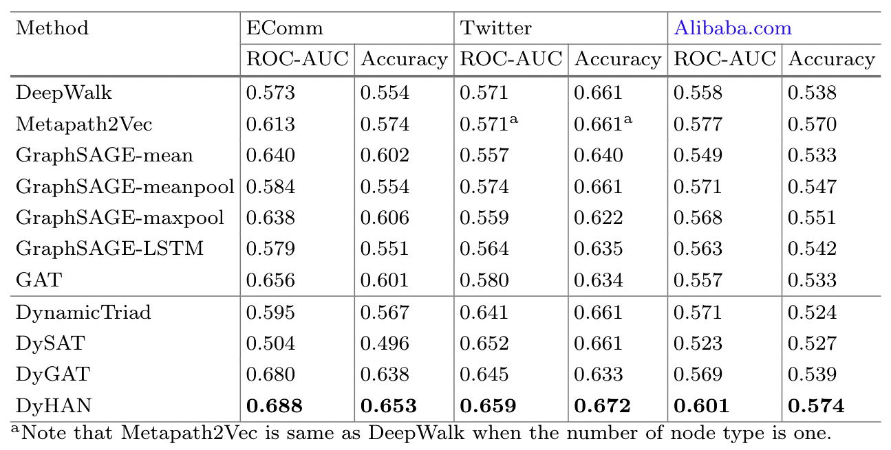

- [x] Round-1: Overview
- [x] Round-2: Model Implementation Details
- [ ] Round-3: Experiments

## Citation


Yang, L., Xiao, Z., Jiang, W., Wei, Y., Hu, Y., & Wang, H. (2020).  
Dynamic heterogeneous graph embedding using hierarchical attentions.  
Lecture Notes in Computer Science (Including Subseries Lecture Notes in Artificial Intelligence and Lecture Notes in Bioinformatics), 12036 LNCS.  
https://doi.org/10.1007/978-3-030-45442-5_53


## Abstract

> Graph embedding has attracted many research interests. Existing works mainly focus on static homogeneous/heterogeneous networks or dynamic homogeneous networks. However, dynamic heterogeneous networks are more ubiquitous in reality, e.g. social network, e-commerce network, citation network, etc. There is still a lack of research on dynamic heterogeneous graph embedding. In this paper, we propose a novel dynamic heterogeneous graph embedding method using hierarchical attentions (DyHAN) that learns node embeddings leveraging both structural heterogeneity and temporal evolution. We evaluate our method on three real-world datasets. The results show that DyHAN outperforms various state-of-the-art baselines in terms of link prediction task.

## Background & Wat's New
- NodeとEdgeに関するDynamicなグラフのEmbedding手法を提案

## Dataset

- <a href="https://tianchi.aliyun.com/competition/entrance/231719/introduction">CIKM 2019 EComm AI: User Behavior Diversities Prediction</a>
- 
M. De Domenico, A. Lima, P. Mougel and M. Musolesi. The Anatomy of a Scientific Rumor. (Nature Open Access) Scientific Reports 3, 2980 (2013).

> The Higgs dataset has been built after monitoring the spreading processes on Twitter before, during and after the announcement of the discovery of a new particle with the features of the elusive Higgs boson on 4th July 2012. The messages posted in Twitter about this discovery between 1st and 7th July 2012 are considered.


|Dataset| #nodes| #edges| #node-types| #edge-types| #time-steps|
|---|---|---|---|---|---|
|EComm| 37724| 91033| 2| 4| 11|
|Twitter| 100000| 63410| 1| 3| 7|
|Alibaba.com| 16620| 93956| 2| 3| 11|

## Model Description

<figure>
  
  <figcaption>Architecture of DyHAN</figcaption>
</figure>

##### Dynamic Heterogeneous Graphsの定義

$$
\begin{align*}
  \text{Dynamic Heterogeneous Graphs}:& \\\\
  & \text{Graphs } = \lbrace G^1, G^2, \ldots G^T \rbrace \\\\
  & G^t = (\mathcal{V}^t, \mathcal{E}^t, \mathcal{W}^t) \\\\
  & \text{where } \mathcal{V}^t \text{ is the node set with node type } o \in \mathcal{O} \\\\
  & \text{where } \mathcal{E}^t \text{ is the node set with node type } r \in \mathcal{R} \\\\
  & |\mathcal{O}| + |\mathcal{R}| > 2
\end{align*}
$$

**Dynamic Heterogeneous Graph Embedding** は 
$$
f: \mathcal{V} \rightarrow \mathbb{R}^d
$$
を学習する．

##### Node-Level Attention

時刻 $t$ におけるエッジタイプ $r$ のノードのペア $(i, j)$ の **Importance Score** を以下のように定義する．

$$
\begin{align*}
  \alpha \_{ij}^{rt} &= \frac{\exp{\left(\sigma\left(a\_r^{\mathsf{T}}\lbrack W\_{nl}^rx\_i || W\_{nl}^rx\_j\rbrack\right)\right)}}{\sum_{k \in N\_i^{rt}}\exp{\left(\sigma\left(a\_r^{\mathsf{T}}\lbrack W\_{nl}^rx\_i || W\_{nl}^rx\_k\rbrack\right)\right)}} \in \mathbb{R} \\\\
  \text{where }& \\\\
  || \mapsto &\text{ concatenation} \\\\
  x\_i &\in \mathbb{R}^d \\\\
  N\_i^{rt} &\mapsto \text{sampled naighbor nodes for node } i \text{ for edge type } r \text{ and time stemp }r \\\\
  W\_{nl}^r &\in \mathbb{R}^{d \times d} \hspace{10pt} \text{(parameter)} \\\\
  a\_r &\in \mathbb{R}^{2d} \hspace{10pt} \text{(parameter / node-level attention vector)}
\end{align*}
$$

Importance Scoreにより，時刻 $t$ におけるエッジタイプ $r$ のノード $i$ のEmbeddingは以下のように計算される．

$$
h\_i^{rt} = \sigma\left(\sum\_{j \in N\_i^{rt}}\alpha\_{ij}^{rt} \cdot W\_{nl}^rx\_j\right) \in \mathbb{R}^d
$$

##### Edge-Level Attention

Hegerogeneous Graph において，同じタイプのエッジを共有するノードのEmbeddingの集合は，他のエッジタイプの集合と比較して区別できるような特徴を持っていると考えられる．  
そこで，このようなエッジの特徴を集約することを考える．  
時刻 $t$ におけるノード $i$ に関して，エッジタイプ $r$ の **Importance Score** を以下のように one-layer MLP で定式化する．

$$
\begin{align*}
  \beta \_i^{rt} &= \frac{\exp \left(q^{\mathsf{T}} \cdot \sigma \left(W\_{el}h\_i^{rt} + b\_{el}\right)\right)}{\sum\_{l=1}^R \exp \left(q^{\mathsf{T}} \cdot \sigma \left(W\_{el}h\_i^{lt} + b\_{el}\right)\right)} \in \mathbb{R} \\\\
  \text{where }& \\\\
  q &\in \mathbb{R}^d \hspace{10pt} \text{(parameter/edge-level attention vector)} \\\\
  W\_{el} &\in \mathbb{R}^{d \times d} \hspace{10pt} \text{(parameter)} \\\\
  b\_{el} &\in \mathbb{R}^d \hspace{10pt} \text{(bias)}
\end{align*}
$$

Importance Scoreにより，時刻 $t$ におけるノード $i$ に関するエッジのEmbeddingは以下のように計算される．

$$
h\_i^t = \sum\_{r=1}^R \beta \_i^{rt} \cdot h\_i^{rt} \in \mathbb{R}^d
$$

##### Tempral-Level Attention

ノードのEmbeddingを計算後，時系列でそれらのEmbeddingを時刻 $T$ に集約する．  
手法は Scaled Dot-Product Attention に基づいている．


Ashish Vaswani, Noam M. Shazeer, Niki Parmar, Jakob Uszkoreit, Llion Jones, Aidan N. Gomez, Lukasz Kaiser, Illia Polosukhin. (2017)  
**Attention is All you Need**  
NIPS  
[Paper Link](https://www.semanticscholar.org/paper/204e3073870fae3d05bcbc2f6a8e263d9b72e776)  
Influential Citation Count (8450), SS-ID (204e3073870fae3d05bcbc2f6a8e263d9b72e776)  

**ABSTRACT**  
The dominant sequence transduction models are based on complex recurrent or convolutional neural networks in an encoder-decoder configuration. The best performing models also connect the encoder and decoder through an attention mechanism. We propose a new simple network architecture, the Transformer, based solely on attention mechanisms, dispensing with recurrence and convolutions entirely. Experiments on two machine translation tasks show these models to be superior in quality while being more parallelizable and requiring significantly less time to train. Our model achieves 28.4 BLEU on the WMT 2014 English-to-German translation task, improving over the existing best results, including ensembles by over 2 BLEU. On the WMT 2014 English-to-French translation task, our model establishes a new single-model state-of-the-art BLEU score of 41.8 after training for 3.5 days on eight GPUs, a small fraction of the training costs of the best models from the literature. We show that the Transformer generalizes well to other tasks by applying it successfully to English constituency parsing both with large and limited training data.


$$
\begin{align*}
  H\_i &= \lbrace h\_i^1, h\_i^2, \ldots , h\_i^{T-1} \rbrace \in \mathbb{R}^{T \times d} \\\\
  Q &= H\_i W\_q \\\\
  K &= H\_i W\_k \\\\
  V &= H\_i W\_v \\\\
  Z\_i &= \text{softmax}\left( \frac{QK^{\mathsf{T}}}{\sqrt{d'}} + M \right) \cdot V \in \mathbb{R}^{T \times d'} \\\\
  \text{where}& \\\\
  &W\_q, W\_k, W\_v \in \mathbb{R}^{d \times d'} \hspace{10pt} \text{(parameters)} \\\\
  &M \in \mathbb{R}^{T \times T} \text{(a mask matrix)} \\\\
  &M\_{ij} = 0 \hspace{10pt} \text{if} \hspace{5pt} i \leq j  \hspace{10pt} \text{else} \hspace{3pt} -\infty
\end{align*}
$$

$Z = \lbrace z\_i^1, z\_i^2, \ldots , z\_i^T \rbrace$ を得るので，$z\_i^T$ が最終的なノードのEmbeddingとなる．  
（構造上，Multi-Head Attention に拡張することができる）

##### Optimization

グラフの構造及び時系列性を考慮して，最終時刻 $T$ において，近くにあるノードが似たEmbeddingを持つようにMetric Learningを実施する．

$$
\begin{align*}
  L(z\_u^T) &= -\log \left( \sigma \left( \left\langle z\_u^T, z\_v^T \right\rangle \right) \right) - Q \cdot \mathbb{E}\_{v\_n \sim P\_n(v)}\log \left( \sigma \left( \left\langle -z\_u^T, z\_{v\_n}^T \right\rangle \right) \right) \\\\
  \text{where}& \\\\
  & \langle , \rangle \mapsto \text{inner product} \\\\
  & v \mapsto \text{node that co-occurs near } u \text{ on fixed-length random walk in the last time step} \\\\
  & P\_n \mapsto \text{negative sampling distribution (node's degree in the last time step)} \\\\
  & Q \mapsto \text{the number of negative samples}
\end{align*}
$$

### Training Settings

- $\lbrace G^1, G^2, \ldots , G^t\rbrace$ を入力として，$G^{t+1}$ の **Link Prediction** を実施する
- 評価方法は既存研究に則る
  - 
Aravind Sankar, Yanhong Wu, Liang Gou, Wei Zhang, Hao Yang. (2018)  
**Dynamic Graph Representation Learning via Self-Attention Networks**  
ArXiv  
[Paper Link](https://www.semanticscholar.org/paper/50a1a28d216ebf719ca1103593d5afe1e29e3ee1)  
Influential Citation Count (7), SS-ID (50a1a28d216ebf719ca1103593d5afe1e29e3ee1)  
**ABSTRACT**  
Learning latent representations of nodes in graphs is an important and ubiquitous task with widespread applications such as link prediction, node classification, and graph visualization. Previous methods on graph representation learning mainly focus on static graphs, however, many real-world graphs are dynamic and evolve over time. In this paper, we present Dynamic Self-Attention Network (DySAT), a novel neural architecture that operates on dynamic graphs and learns node representations that capture both structural properties and temporal evolutionary patterns. Specifically, DySAT computes node representations by jointly employing self-attention layers along two dimensions: structural neighborhood and temporal dynamics. We conduct link prediction experiments on two classes of graphs: communication networks and bipartite rating networks. Our experimental results show that DySAT has a significant performance gain over several different state-of-the-art graph embedding baselines.

  - 
Lun Du, Yun Wang, Guojie Song, Zhicong Lu, Junshan Wang. (2018)  
**Dynamic Network Embedding : An Extended Approach for Skip-gram based Network Embedding**  
IJCAI  
[Paper Link](https://www.semanticscholar.org/paper/707defa78c0e5529c17fda92ce7b33f0b6674612)  
Influential Citation Count (10), SS-ID (707defa78c0e5529c17fda92ce7b33f0b6674612)  
**ABSTRACT**  
Network embedding, as an approach to learn low-dimensional representations of vertices, has been proved extremely useful in many applications. Lots of state-of-the-art network embedding methods based on Skip-gram framework are efficient and effective. However, these methods mainly focus on the static network embedding and cannot naturally generalize to the dynamic environment. In this paper, we propose a stable dynamic embedding framework with high efficiency. It is an extension for the Skip-gram based network embedding methods, which can keep the optimality of the objective in the Skip-gram based methods in theory. Our model can not only generalize to the new vertex representation, but also update the most affected original vertex representations during the evolvement of the network. Multi-class classification on three real-world networks demonstrates that, our model can update the vertex representations efficiently and achieve the performance of retraining simultaneously. Besides, the visualization experimental result illustrates that, our model is capable of avoiding the embedding space drifting.

- DyHANの出力に **Logistic Regression Classifier** を接続して Link Prediction 向けの予測モデルを構築
- $G^{t+1}$ 時点のスナップショットから20%のエッジをハイパーパラメータチューニング向けのValidation Setとして切り出した
- 残りのエッジを $25:75$ に分割し，それぞれ学習データ・テストデータとして実験を実施
- 評価指標は **ROC Curve** 及び **AUC**

## Results

<figure>
  
  <figcaption>Experimental results on three real-world datasets</figcaption>
</figure>

## References



Xiao Wang, Houye Ji, C. Shi, Bai Wang, Peng Cui, P. Yu, Yanfang Ye. (2019)  
**Heterogeneous Graph Attention Network**  
WWW  
[Paper Link](https://www.semanticscholar.org/paper/00b7efbf14a54cced4b9f19e663b70ffbd01324b)  
Influential Citation Count (177), SS-ID (00b7efbf14a54cced4b9f19e663b70ffbd01324b)  

**ABSTRACT**  
Graph neural network, as a powerful graph representation technique based on deep learning, has shown superior performance and attracted considerable research interest. However, it has not been fully considered in graph neural network for heterogeneous graph which contains different types of nodes and links. The heterogeneity and rich semantic information bring great challenges for designing a graph neural network for heterogeneous graph. Recently, one of the most exciting advancements in deep learning is the attention mechanism, whose great potential has been well demonstrated in various areas. In this paper, we first propose a novel heterogeneous graph neural network based on the hierarchical attention, including node-level and semantic-level attentions. Specifically, the node-level attention aims to learn the importance between a node and its meta-path based neighbors, while the semantic-level attention is able to learn the importance of different meta-paths. With the learned importance from both node-level and semantic-level attention, the importance of node and meta-path can be fully considered. Then the proposed model can generate node embedding by aggregating features from meta-path based neighbors in a hierarchical manner. Extensive experimental results on three real-world heterogeneous graphs not only show the superior performance of our proposed model over the state-of-the-arts, but also demonstrate its potentially good interpretability for graph analysis.





A. M. Fard, E. Bagheri, Ke Wang. (2019)  
**Relationship Prediction in Dynamic Heterogeneous Information Networks**  
ECIR  
[Paper Link](https://www.semanticscholar.org/paper/06eb6cc2f68bba86e3ef5c1ece21a34687d86f29)  
Influential Citation Count (0), SS-ID (06eb6cc2f68bba86e3ef5c1ece21a34687d86f29)  

**ABSTRACT**  





Jian Tang, Meng Qu, Mingzhe Wang, Ming Zhang, Jun Yan, Q. Mei. (2015)  
**LINE: Large-scale Information Network Embedding**  
WWW  
[Paper Link](https://www.semanticscholar.org/paper/0834e74304b547c9354b6d7da6fa78ef47a48fa8)  
Influential Citation Count (861), SS-ID (0834e74304b547c9354b6d7da6fa78ef47a48fa8)  

**ABSTRACT**  
This paper studies the problem of embedding very large information networks into low-dimensional vector spaces, which is useful in many tasks such as visualization, node classification, and link prediction. Most existing graph embedding methods do not scale for real world information networks which usually contain millions of nodes. In this paper, we propose a novel network embedding method called the ``LINE,'' which is suitable for arbitrary types of information networks: undirected, directed, and/or weighted. The method optimizes a carefully designed objective function that preserves both the local and global network structures. An edge-sampling algorithm is proposed that addresses the limitation of the classical stochastic gradient descent and improves both the effectiveness and the efficiency of the inference. Empirical experiments prove the effectiveness of the LINE on a variety of real-world information networks, including language networks, social networks, and citation networks. The algorithm is very efficient, which is able to learn the embedding of a network with millions of vertices and billions of edges in a few hours on a typical single machine. The source code of the LINE is available online\footnote{\url{https://github.com/tangjianpku/LINE}}.





Palash Goyal, Nitin Kamra, Xinran He, Yan Liu. (2018)  
**DynGEM: Deep Embedding Method for Dynamic Graphs**  
ArXiv  
[Paper Link](https://www.semanticscholar.org/paper/1d49c0dd13911f44418d46ec5fac128d6c4bbf59)  
Influential Citation Count (35), SS-ID (1d49c0dd13911f44418d46ec5fac128d6c4bbf59)  

**ABSTRACT**  
Embedding large graphs in low dimensional spaces has recently attracted significant interest due to its wide applications such as graph visualization, link prediction and node classification. Existing methods focus on computing the embedding for static graphs. However, many graphs in practical applications are dynamic and evolve constantly over time. Naively applying existing embedding algorithms to each snapshot of dynamic graphs independently usually leads to unsatisfactory performance in terms of stability, flexibility and efficiency. In this work, we present an efficient algorithm DynGEM based on recent advances in deep autoencoders for graph embeddings, to address this problem. The major advantages of DynGEM include: (1) the embedding is stable over time, (2) it can handle growing dynamic graphs, and (3) it has better running time than using static embedding methods on each snapshot of a dynamic graph. We test DynGEM on a variety of tasks including graph visualization, graph reconstruction, link prediction and anomaly detection (on both synthetic and real datasets). Experimental results demonstrate the superior stability and scalability of our approach.





Ashish Vaswani, Noam M. Shazeer, Niki Parmar, Jakob Uszkoreit, Llion Jones, Aidan N. Gomez, Lukasz Kaiser, Illia Polosukhin. (2017)  
**Attention is All you Need**  
NIPS  
[Paper Link](https://www.semanticscholar.org/paper/204e3073870fae3d05bcbc2f6a8e263d9b72e776)  
Influential Citation Count (8450), SS-ID (204e3073870fae3d05bcbc2f6a8e263d9b72e776)  

**ABSTRACT**  
The dominant sequence transduction models are based on complex recurrent or convolutional neural networks in an encoder-decoder configuration. The best performing models also connect the encoder and decoder through an attention mechanism. We propose a new simple network architecture, the Transformer, based solely on attention mechanisms, dispensing with recurrence and convolutions entirely. Experiments on two machine translation tasks show these models to be superior in quality while being more parallelizable and requiring significantly less time to train. Our model achieves 28.4 BLEU on the WMT 2014 English-to-German translation task, improving over the existing best results, including ensembles by over 2 BLEU. On the WMT 2014 English-to-French translation task, our model establishes a new single-model state-of-the-art BLEU score of 41.8 after training for 3.5 days on eight GPUs, a small fraction of the training costs of the best models from the literature. We show that the Transformer generalizes well to other tasks by applying it successfully to English constituency parsing both with large and limited training data.





Petar Velickovic, Guillem Cucurull, Arantxa Casanova, Adriana Romero, P. Lio’, Yoshua Bengio. (2017)  
**Graph Attention Networks**  
ICLR  
[Paper Link](https://www.semanticscholar.org/paper/33998aff64ce51df8dee45989cdca4b6b1329ec4)  
Influential Citation Count (1525), SS-ID (33998aff64ce51df8dee45989cdca4b6b1329ec4)  

**ABSTRACT**  
We present graph attention networks (GATs), novel neural network architectures that operate on graph-structured data, leveraging masked self-attentional layers to address the shortcomings of prior methods based on graph convolutions or their approximations. By stacking layers in which nodes are able to attend over their neighborhoods' features, we enable (implicitly) specifying different weights to different nodes in a neighborhood, without requiring any kind of costly matrix operation (such as inversion) or depending on knowing the graph structure upfront. In this way, we address several key challenges of spectral-based graph neural networks simultaneously, and make our model readily applicable to inductive as well as transductive problems. Our GAT models have achieved or matched state-of-the-art results across four established transductive and inductive graph benchmarks: the Cora, Citeseer and Pubmed citation network datasets, as well as a protein-protein interaction dataset (wherein test graphs remain unseen during training).





Aditya Grover, J. Leskovec. (2016)  
**node2vec: Scalable Feature Learning for Networks**  
KDD  
[Paper Link](https://www.semanticscholar.org/paper/36ee2c8bd605afd48035d15fdc6b8c8842363376)  
Influential Citation Count (1155), SS-ID (36ee2c8bd605afd48035d15fdc6b8c8842363376)  

**ABSTRACT**  
Prediction tasks over nodes and edges in networks require careful effort in engineering features used by learning algorithms. Recent research in the broader field of representation learning has led to significant progress in automating prediction by learning the features themselves. However, present feature learning approaches are not expressive enough to capture the diversity of connectivity patterns observed in networks. Here we propose node2vec, an algorithmic framework for learning continuous feature representations for nodes in networks. In node2vec, we learn a mapping of nodes to a low-dimensional space of features that maximizes the likelihood of preserving network neighborhoods of nodes. We define a flexible notion of a node's network neighborhood and design a biased random walk procedure, which efficiently explores diverse neighborhoods. Our algorithm generalizes prior work which is based on rigid notions of network neighborhoods, and we argue that the added flexibility in exploring neighborhoods is the key to learning richer representations. We demonstrate the efficacy of node2vec over existing state-of-the-art techniques on multi-label classification and link prediction in several real-world networks from diverse domains. Taken together, our work represents a new way for efficiently learning state-of-the-art task-independent representations in complex networks.





Thomas Kipf, M. Welling. (2016)  
**Semi-Supervised Classification with Graph Convolutional Networks**  
ICLR  
[Paper Link](https://www.semanticscholar.org/paper/36eff562f65125511b5dfab68ce7f7a943c27478)  
Influential Citation Count (3468), SS-ID (36eff562f65125511b5dfab68ce7f7a943c27478)  

**ABSTRACT**  
We present a scalable approach for semi-supervised learning on graph-structured data that is based on an efficient variant of convolutional neural networks which operate directly on graphs. We motivate the choice of our convolutional architecture via a localized first-order approximation of spectral graph convolutions. Our model scales linearly in the number of graph edges and learns hidden layer representations that encode both local graph structure and features of nodes. In a number of experiments on citation networks and on a knowledge graph dataset we demonstrate that our approach outperforms related methods by a significant margin.





C. Shi, Binbin Hu, Wayne Xin Zhao, Philip S. Yu. (2017)  
**Heterogeneous Information Network Embedding for Recommendation**  
IEEE Transactions on Knowledge and Data Engineering  
[Paper Link](https://www.semanticscholar.org/paper/378f0a62471ef232c7730d8a67717afa5104ab21)  
Influential Citation Count (45), SS-ID (378f0a62471ef232c7730d8a67717afa5104ab21)  

**ABSTRACT**  
Due to the flexibility in modelling data heterogeneity, heterogeneous information network (HIN) has been adopted to characterize complex and heterogeneous auxiliary data in recommender systems, called HIN based recommendation. It is challenging to develop effective methods for HIN based recommendation in both extraction and exploitation of the information from HINs. Most of HIN based recommendation methods rely on path based similarity, which cannot fully mine latent structure features of users and items. In this paper, we propose a novel heterogeneous network embedding based approach for HIN based recommendation, called HERec. To embed HINs, we design a meta-path based random walk strategy to generate meaningful node sequences for network embedding. The learned node embeddings are first transformed by a set of fusion functions, and subsequently integrated into an extended matrix factorization (MF) model. The extended MF model together with fusion functions are jointly optimized for the rating prediction task. Extensive experiments on three real-world datasets demonstrate the effectiveness of the HERec model. Moreover, we show the capability of the HERec model for the cold-start problem, and reveal that the transformed embedding information from HINs can improve the recommendation performance.





Yukuo Cen, Xu Zou, Jianwei Zhang, Hongxia Yang, Jingren Zhou, Jie Tang. (2019)  
**Representation Learning for Attributed Multiplex Heterogeneous Network**  
KDD  
[Paper Link](https://www.semanticscholar.org/paper/3c64b7a74c749d43b1a4b96dd1a00620ba613ee0)  
Influential Citation Count (27), SS-ID (3c64b7a74c749d43b1a4b96dd1a00620ba613ee0)  

**ABSTRACT**  
Network embedding (or graph embedding) has been widely used in many real-world applications. However, existing methods mainly focus on networks with single-typed nodes/edges and cannot scale well to handle large networks. Many real-world networks consist of billions of nodes and edges of multiple types, and each node is associated with different attributes. In this paper, we formalize the problem of embedding learning for the Attributed Multiplex Heterogeneous Network and propose a unified framework to address this problem. The framework supports both transductive and inductive learning. We also give the theoretical analysis of the proposed framework, showing its connection with previous works and proving its better expressiveness. We conduct systematical evaluations for the proposed framework on four different genres of challenging datasets: Amazon, YouTube, Twitter, and Alibaba. Experimental results demonstrate that with the learned embeddings from the proposed framework, we can achieve statistically significant improvements (e.g., 5.99-28.23% lift by F1 scores; p<<0.01, t-test) over previous state-of-the-art methods for link prediction. The framework has also been successfully deployed on the recommendation system of a worldwide leading e-commerce company, Alibaba Group. Results of the offline A/B tests on product recommendation further confirm the effectiveness and efficiency of the framework in practice.





Aravind Sankar, Yanhong Wu, Liang Gou, Wei Zhang, Hao Yang. (2018)  
**Dynamic Graph Representation Learning via Self-Attention Networks**  
ArXiv  
[Paper Link](https://www.semanticscholar.org/paper/50a1a28d216ebf719ca1103593d5afe1e29e3ee1)  
Influential Citation Count (7), SS-ID (50a1a28d216ebf719ca1103593d5afe1e29e3ee1)  

**ABSTRACT**  
Learning latent representations of nodes in graphs is an important and ubiquitous task with widespread applications such as link prediction, node classification, and graph visualization. Previous methods on graph representation learning mainly focus on static graphs, however, many real-world graphs are dynamic and evolve over time. In this paper, we present Dynamic Self-Attention Network (DySAT), a novel neural architecture that operates on dynamic graphs and learns node representations that capture both structural properties and temporal evolutionary patterns. Specifically, DySAT computes node representations by jointly employing self-attention layers along two dimensions: structural neighborhood and temporal dynamics. We conduct link prediction experiments on two classes of graphs: communication networks and bipartite rating networks. Our experimental results show that DySAT has a significant performance gain over several different state-of-the-art graph embedding baselines.





William L. Hamilton, Z. Ying, J. Leskovec. (2017)  
**Inductive Representation Learning on Large Graphs**  
NIPS  
[Paper Link](https://www.semanticscholar.org/paper/6b7d6e6416343b2a122f8416e69059ce919026ef)  
Influential Citation Count (1380), SS-ID (6b7d6e6416343b2a122f8416e69059ce919026ef)  

**ABSTRACT**  
Low-dimensional embeddings of nodes in large graphs have proved extremely useful in a variety of prediction tasks, from content recommendation to identifying protein functions. However, most existing approaches require that all nodes in the graph are present during training of the embeddings; these previous approaches are inherently transductive and do not naturally generalize to unseen nodes. Here we present GraphSAGE, a general, inductive framework that leverages node feature information (e.g., text attributes) to efficiently generate node embeddings for previously unseen data. Instead of training individual embeddings for each node, we learn a function that generates embeddings by sampling and aggregating features from a node's local neighborhood. Our algorithm outperforms strong baselines on three inductive node-classification benchmarks: we classify the category of unseen nodes in evolving information graphs based on citation and Reddit post data, and we show that our algorithm generalizes to completely unseen graphs using a multi-graph dataset of protein-protein interactions.





Rex Ying, Ruining He, Kaifeng Chen, Pong Eksombatchai, William L. Hamilton, J. Leskovec. (2018)  
**Graph Convolutional Neural Networks for Web-Scale Recommender Systems**  
KDD  
[Paper Link](https://www.semanticscholar.org/paper/6c96c2d4a3fbd572fef2d59cb856521ee1746789)  
Influential Citation Count (145), SS-ID (6c96c2d4a3fbd572fef2d59cb856521ee1746789)  

**ABSTRACT**  
Recent advancements in deep neural networks for graph-structured data have led to state-of-the-art performance on recommender system benchmarks. However, making these methods practical and scalable to web-scale recommendation tasks with billions of items and hundreds of millions of users remains an unsolved challenge. Here we describe a large-scale deep recommendation engine that we developed and deployed at Pinterest. We develop a data-efficient Graph Convolutional Network (GCN) algorithm, which combines efficient random walks and graph convolutions to generate embeddings of nodes (i.e., items) that incorporate both graph structure as well as node feature information. Compared to prior GCN approaches, we develop a novel method based on highly efficient random walks to structure the convolutions and design a novel training strategy that relies on harder-and-harder training examples to improve robustness and convergence of the model. We also develop an efficient MapReduce model inference algorithm to generate embeddings using a trained model. Overall, we can train on and embed graphs that are four orders of magnitude larger than typical GCN implementations. We show how GCN embeddings can be used to make high-quality recommendations in various settings at Pinterest, which has a massive underlying graph with 3 billion nodes representing pins and boards, and 17 billion edges. According to offline metrics, user studies, as well as A/B tests, our approach generates higher-quality recommendations than comparable deep learning based systems. To our knowledge, this is by far the largest application of deep graph embeddings to date and paves the way for a new generation of web-scale recommender systems based on graph convolutional architectures.





Lun Du, Yun Wang, Guojie Song, Zhicong Lu, Junshan Wang. (2018)  
**Dynamic Network Embedding : An Extended Approach for Skip-gram based Network Embedding**  
IJCAI  
[Paper Link](https://www.semanticscholar.org/paper/707defa78c0e5529c17fda92ce7b33f0b6674612)  
Influential Citation Count (10), SS-ID (707defa78c0e5529c17fda92ce7b33f0b6674612)  

**ABSTRACT**  
Network embedding, as an approach to learn low-dimensional representations of vertices, has been proved extremely useful in many applications. Lots of state-of-the-art network embedding methods based on Skip-gram framework are efficient and effective. However, these methods mainly focus on the static network embedding and cannot naturally generalize to the dynamic environment. In this paper, we propose a stable dynamic embedding framework with high efficiency. It is an extension for the Skip-gram based network embedding methods, which can keep the optimality of the objective in the Skip-gram based methods in theory. Our model can not only generalize to the new vertex representation, but also update the most affected original vertex representations during the evolvement of the network. Multi-class classification on three real-world networks demonstrates that, our model can update the vertex representations efficiently and achieve the performance of retraining simultaneously. Besides, the visualization experimental result illustrates that, our model is capable of avoiding the embedding space drifting.





Le-kui Zhou, Yang Yang, Xiang Ren, Fei Wu, Yueting Zhuang. (2018)  
**Dynamic Network Embedding by Modeling Triadic Closure Process**  
AAAI  
[Paper Link](https://www.semanticscholar.org/paper/7bfb46c47c25e46a5f7b168133f4e926ab44725b)  
Influential Citation Count (43), SS-ID (7bfb46c47c25e46a5f7b168133f4e926ab44725b)  

**ABSTRACT**  
    Network embedding, which aims to learn the low-dimensional representations of vertices, is an important task and has attracted considerable research efforts recently. In real world, networks, like social network and biological networks, are dynamic and evolving over time. However, almost all the existing network embedding methods focus on static networks while ignore network dynamics. In this paper, we present a novel representation learning approach, DynamicTriad, to preserve both structural information and evolution patterns of a given network. The general idea of our approach is to impose triad, which is a group of three vertices and is one of the basic units of networks. In particular, we model how a closed triad, which consists of three vertices connected with each other, develops from an open triad that has two of three vertices not connected with each other. This triadic closure process is a fundamental mechanism in the formation and evolution of networks, thereby makes our model being able to capture the network dynamics and to learn representation vectors for each vertex at different time steps. Experimental results on three real-world networks demonstrate that, compared with several state-of-the-art techniques, DynamicTriad achieves substantial gains in several application scenarios. For example, our approach can effectively be applied and help to identify telephone frauds in a mobile network, and to predict whether a user will repay her loans or not in a loan network.   





Zonghan Wu, Shirui Pan, Fengwen Chen, Guodong Long, Chengqi Zhang, Philip S. Yu. (2019)  
**A Comprehensive Survey on Graph Neural Networks**  
IEEE Transactions on Neural Networks and Learning Systems  
[Paper Link](https://www.semanticscholar.org/paper/81a4fd3004df0eb05d6c1cef96ad33d5407820df)  
Influential Citation Count (217), SS-ID (81a4fd3004df0eb05d6c1cef96ad33d5407820df)  

**ABSTRACT**  
Deep learning has revolutionized many machine learning tasks in recent years, ranging from image classification and video processing to speech recognition and natural language understanding. The data in these tasks are typically represented in the Euclidean space. However, there is an increasing number of applications, where data are generated from non-Euclidean domains and are represented as graphs with complex relationships and interdependency between objects. The complexity of graph data has imposed significant challenges on the existing machine learning algorithms. Recently, many studies on extending deep learning approaches for graph data have emerged. In this article, we provide a comprehensive overview of graph neural networks (GNNs) in data mining and machine learning fields. We propose a new taxonomy to divide the state-of-the-art GNNs into four categories, namely, recurrent GNNs, convolutional GNNs, graph autoencoders, and spatial–temporal GNNs. We further discuss the applications of GNNs across various domains and summarize the open-source codes, benchmark data sets, and model evaluation of GNNs. Finally, we propose potential research directions in this rapidly growing field.





Yuxiao Dong, N. Chawla, A. Swami. (2017)  
**metapath2vec: Scalable Representation Learning for Heterogeneous Networks**  
KDD  
[Paper Link](https://www.semanticscholar.org/paper/c0af91371f426ff92117d2ccdadb2032bec23d2c)  
Influential Citation Count (168), SS-ID (c0af91371f426ff92117d2ccdadb2032bec23d2c)  

**ABSTRACT**  
We study the problem of representation learning in heterogeneous networks. Its unique challenges come from the existence of multiple types of nodes and links, which limit the feasibility of the conventional network embedding techniques. We develop two scalable representation learning models, namely metapath2vec and metapath2vec++. The metapath2vec model formalizes meta-path-based random walks to construct the heterogeneous neighborhood of a node and then leverages a heterogeneous skip-gram model to perform node embeddings. The metapath2vec++ model further enables the simultaneous modeling of structural and semantic correlations in heterogeneous networks. Extensive experiments show that metapath2vec and metapath2vec++ are able to not only outperform state-of-the-art embedding models in various heterogeneous network mining tasks, such as node classification, clustering, and similarity search, but also discern the structural and semantic correlations between diverse network objects.





Rakshit S. Trivedi, Mehrdad Farajtabar, P. Biswal, H. Zha. (2018)  
**Learning Dynamic Graph Representations**  
  
[Paper Link](https://www.semanticscholar.org/paper/c0f169a55728b0b2c6be0d6217726682d1775020)  
Influential Citation Count (0), SS-ID (c0f169a55728b0b2c6be0d6217726682d1775020)  

**ABSTRACT**  
We address two fundamental questions that arise in learning over dynamic graphs: 1 (i) How to elegantly model dynamical processes over graphs? (ii) How to lever2 age such a model to effectively encode evolving graph information into low3 dimensional representations? We present DyRep a novel modeling framework 4 for dynamic graphs that posits representation learning as a latent mediation process 5 bridging two observed processes – dynamic of the network (topological evolution) 6 and dynamic on the network (activities of the nodes). To this end, we propose an 7 inductive framework comprising of two-time scale deep temporal point process 8 model parameterized by a temporal-attentive representation network and trained 9 end-to-end using an efficient unsupervised procedure. We demonstrate that DyRep 10 significantly outperforms state-of-art baselines for dynamic link prediction and 11 event time prediction and provide extensive qualitative analysis of our framework.1 12





Bryan Perozzi, Rami Al-Rfou, S. Skiena. (2014)  
**DeepWalk: online learning of social representations**  
KDD  
[Paper Link](https://www.semanticscholar.org/paper/fff114cbba4f3ba900f33da574283e3de7f26c83)  
Influential Citation Count (1389), SS-ID (fff114cbba4f3ba900f33da574283e3de7f26c83)  

**ABSTRACT**  
We present DeepWalk, a novel approach for learning latent representations of vertices in a network. These latent representations encode social relations in a continuous vector space, which is easily exploited by statistical models. DeepWalk generalizes recent advancements in language modeling and unsupervised feature learning (or deep learning) from sequences of words to graphs. DeepWalk uses local information obtained from truncated random walks to learn latent representations by treating walks as the equivalent of sentences. We demonstrate DeepWalk's latent representations on several multi-label network classification tasks for social networks such as BlogCatalog, Flickr, and YouTube. Our results show that DeepWalk outperforms challenging baselines which are allowed a global view of the network, especially in the presence of missing information. DeepWalk's representations can provide F1 scores up to 10% higher than competing methods when labeled data is sparse. In some experiments, DeepWalk's representations are able to outperform all baseline methods while using 60% less training data. DeepWalk is also scalable. It is an online learning algorithm which builds useful incremental results, and is trivially parallelizable. These qualities make it suitable for a broad class of real world applications such as network classification, and anomaly detection.



