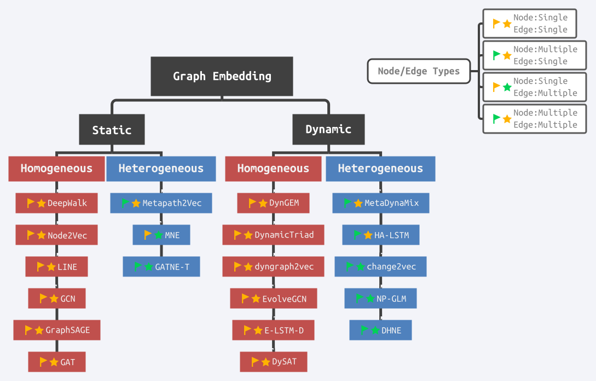
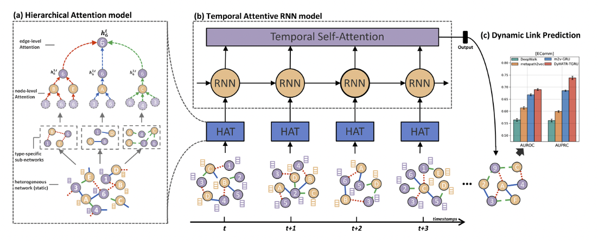

- [x] Round-1: Overview
- [ ] Round-2: Model Implementation Details
- [ ] Round-3: Experiments

## Citation


Xue, H., Yang, L., Jiang, W., Wei, Y., Hu, Y., & Lin, Y. (2021).
Modeling Dynamic Heterogeneous Network for Link Prediction Using Hierarchical Attention with Temporal RNN.
Springer, Cham. pp.282–298. https://doi.org/10.1007/978-3-030-67658-2_17


## Abstract

> Network embedding aims to learn low-dimensional representations of nodes while capturing structure information of networks. It has achieved great success on many tasks of network analysis such as link prediction and node classification. Most of existing network embedding algorithms focus on how to learn static homogeneous networks effectively. However, networks in the real world are more complex, e.g.., networks may consist of several types of nodes and edges (called heterogeneous information) and may vary over time in terms of dynamic nodes and edges (called evolutionary patterns). Limited work has been done for network embedding of dynamic heterogeneous networks as it is challenging to learn both evolutionary and heterogeneous information simultaneously. In this paper, we propose a novel dynamic heterogeneous network embedding method, termed as DyHATR, which uses hierarchical attention to learn heterogeneous information and incorporates recurrent neural networks with temporal attention to capture evolutionary patterns. We benchmark our method on four real-world datasets for the task of link prediction. Experimental results show that DyHATR significantly outperforms several state-of-the-art baselines.

## What's New

- Dynamic Heterogeneous Graphに対応したEmbedding手法 **DyHATR** を提案した
- グラフの時系列のスナップショットに関するheterogeneityを捉えるため，階層的なAttentionモデルを採用
- 時系列と共に変化するグラフの構造を捉えるために，GRU/LSTMを採用
- DyHATRでSOTAを達成

<figure>
    
    <figcaption>Summary of Typical Network Embedding Methods</figcaption>
</figure>

## Dataset

## Model Description

<figure>
    
    <figcaption>Model Architecture</figcaption>
</figure>

### Dynamic Heterogeneous Networks

$$
\begin{align*}
    \mathbb{G} &= \lbrace G^1, G^2, \ldots, G^T \rbrace \\\\
    & \text{where} \\\\
    & T \mapsto \text{the number of snapshots} \\\\
    & G^t = \left( V^t, E^t \right) \\\\
    & v^t\_o \in V^t, o \in O \hspace{10pt} (O\text{ is the set of node type}) \\\\
    & e^t\_r \in E^t, r \in R \hspace{10pt} (R\text{ is the set of edge type}) \\\\
    & |O| + |R| > 2
\end{align*}
$$

### Hierarchical Attention for Heterogeneous Information

#### Nodel-level Attention

ターゲットのノードの近傍ノードごとにImportance Weightを算出し，Multi-Head Attentionを用いてそれらを集約する  
$\hat{\boldsymbol{h}}\_i^{rt}$ はエッジタイプ $r$ における $t$番目のスナップショットのノード $i$ の一つのヘッドのEmbeddingを表す

$$
\begin{align*}
    \boldsymbol{h}\_i^{rt} &= \text{Concat}(\hat{h}^1, \hat{h}^2, \ldots, \hat{h}^\kappa) &\in& \hspace{5pt} \mathbb{R}^{d\kappa} \\\\
    \hat{\boldsymbol{h}}\_i^{rt} &= \sigma \left( \sum\_{j \in N\_i^{rt}} \alpha\_{ij}^{rt} \cdot W^r x\_j \right) &\in& \hspace{5pt} \mathbb{R}^d \\\\
    \alpha\_{i,j}^{rt} &= \frac{\exp\left(\sigma\left( \boldsymbol{a}\_r^\mathsf{T} \cdot \left[ W^r \cdot x\_i || W^r \cdot x\_j \right] \right)\right)}{\sum\_{k \in N\_i^{rt}} \exp\left(\sigma\left( \boldsymbol{a}\_r^\mathsf{T} \cdot \left[ W^r \cdot x\_i || W^r \cdot x\_k \right] \right)\right)} &\in& \hspace{5pt} \mathbb{R} \\\\
    &\text{where} \\\\
    & d \ll |V| \\\\
    & x\_i \in \mathbb{R}^d \mapsto \text{the initial feature vector of node }i \\\\
    & W^r \in \mathbb{R}^{d \times d} \mapsto \text{a transformation matrix for edge type }r \\\\
    & N\_i^{rt} \mapsto \text{the sampled neighbors of node } i \text{ with edge type } r \text{ in the snapshot }t \\\\
    & \boldsymbol{a}\_r \in \mathbb{R}^d \mapsto \text{the parameterized weight vector for edge type }r
\end{align*}
$$

#### Edge-level Attention
Heterogeneous Graphには複数のエッジタイプが存在するため，各タイプのエッジの特徴を集約してEdge-levelのEmbeddingを算出する

$$
\begin{align*}
    \boldsymbol{h}\_i^t &= \sum\_{r=1}^R \beta\_i^{rt} \cdot \boldsymbol{h}\_i^{rt} &\in& \hspace{5pt} \mathbb{R}^{d\kappa} \\\\
    \beta\_i^{rt} &= \frac{\exp \left( \boldsymbol{q}^\mathsf{T} \cdot \sigma\left( W \cdot \boldsymbol{h}\_i^{rt} + \boldsymbol{b} \right)\right)}{\sum\_{r \in R} \exp \left( \boldsymbol{q}^\mathsf{T} \cdot \sigma \left( W \cdot \boldsymbol{h}\_i^{rt} + \boldsymbol{b} \right)\right)} &\in& \hspace{5pt} \mathbb{R} \\\\
    & \text{where} \\\\
    & W \in \mathbb{R}^{d\kappa \times d\kappa} \hspace{10pt} \text{(shared across all different edge types and snapshots)} \\\\
    & b \in \mathbb{R}^{d\kappa} \hspace{10pt} \text{(shared across all different edge types and snapshots)}
\end{align*}
$$

### Training Settings

## Results

## References



Hongyun Cai, V. Zheng, K. Chang. (2017)  
**A Comprehensive Survey of Graph Embedding: Problems, Techniques, and Applications**  
IEEE Transactions on Knowledge and Data Engineering  
[Paper Link](https://www.semanticscholar.org/paper/006906b6bbe5c1f378cde9fd86de1ce9e6b131da)  
Influential Citation Count (47), SS-ID (006906b6bbe5c1f378cde9fd86de1ce9e6b131da)  

**ABSTRACT**  
Graph is an important data representation which appears in a wide diversity of real-world scenarios. Effective graph analytics provides users a deeper understanding of what is behind the data, and thus can benefit a lot of useful applications such as node classification, node recommendation, link prediction, etc. However, most graph analytics methods suffer the high computation and space cost. Graph embedding is an effective yet efficient way to solve the graph analytics problem. It converts the graph data into a low dimensional space in which the graph structural information and graph properties are maximumly preserved. In this survey, we conduct a comprehensive review of the literature in graph embedding. We first introduce the formal definition of graph embedding as well as the related concepts. After that, we propose two taxonomies of graph embedding which correspond to what challenges exist in different graph embedding problem settings and how the existing work addresses these challenges in their solutions. Finally, we summarize the applications that graph embedding enables and suggest four promising future research directions in terms of computation efficiency, problem settings, techniques, and application scenarios.





Xiao Wang, Houye Ji, C. Shi, Bai Wang, Peng Cui, P. Yu, Yanfang Ye. (2019)  
**Heterogeneous Graph Attention Network**  
WWW  
[Paper Link](https://www.semanticscholar.org/paper/00b7efbf14a54cced4b9f19e663b70ffbd01324b)  
Influential Citation Count (180), SS-ID (00b7efbf14a54cced4b9f19e663b70ffbd01324b)  

**ABSTRACT**  
Graph neural network, as a powerful graph representation technique based on deep learning, has shown superior performance and attracted considerable research interest. However, it has not been fully considered in graph neural network for heterogeneous graph which contains different types of nodes and links. The heterogeneity and rich semantic information bring great challenges for designing a graph neural network for heterogeneous graph. Recently, one of the most exciting advancements in deep learning is the attention mechanism, whose great potential has been well demonstrated in various areas. In this paper, we first propose a novel heterogeneous graph neural network based on the hierarchical attention, including node-level and semantic-level attentions. Specifically, the node-level attention aims to learn the importance between a node and its meta-path based neighbors, while the semantic-level attention is able to learn the importance of different meta-paths. With the learned importance from both node-level and semantic-level attention, the importance of node and meta-path can be fully considered. Then the proposed model can generate node embedding by aggregating features from meta-path based neighbors in a hierarchical manner. Extensive experimental results on three real-world heterogeneous graphs not only show the superior performance of our proposed model over the state-of-the-arts, but also demonstrate its potentially good interpretability for graph analysis.





Hongming Zhang, Liwei Qiu, Lingling Yi, Yangqiu Song. (2018)  
**Scalable Multiplex Network Embedding**  
IJCAI  
[Paper Link](https://www.semanticscholar.org/paper/036f0877999d189ff42d91d23136486cd97928bd)  
Influential Citation Count (29), SS-ID (036f0877999d189ff42d91d23136486cd97928bd)  

**ABSTRACT**  
Network embedding has been proven to be helpful for many real-world problems. In this paper, we present a scalable multiplex network embedding model to represent information of multi-type relations into a unified embedding space. To combine information of different types of relations while maintaining their distinctive properties, for each node, we propose one high-dimensional common embedding and a lower-dimensional additional embedding for each type of relation. Then multiple relations can be learned jointly based on a unified network embedding model. We conduct experiments on two tasks: link prediction and node classification using six different multiplex networks. On both tasks, our model achieved better or comparable performance compared to current state-of-the-art models with less memory use.





Hanyin Fang, Fei Wu, Zhou Zhao, Xinyu Duan, Yueting Zhuang, M. Ester. (2016)  
**Community-Based Question Answering via Heterogeneous Social Network Learning**  
AAAI  
[Paper Link](https://www.semanticscholar.org/paper/06b0e8c067e249a2e71897c00730ec734d18c922)  
Influential Citation Count (9), SS-ID (06b0e8c067e249a2e71897c00730ec734d18c922)  

**ABSTRACT**  
    Community-based question answering (cQA) sites have accumulated vast amount of questions and corresponding crowdsourced answers over time. How to efficiently share the underlying information and knowledge from reliable (usually highly-reputable) answerers has become an increasingly popular research topic. A major challenge in cQA tasks is the accurate matching of high-quality answers w.r.t given questions. Many of traditional approaches likely recommend corresponding answers merely depending on the content similarity between questions and answers, therefore suffer from the sparsity bottleneck of cQA data. In this paper, we propose a novel framework which encodes not only the contents of question-answer(Q-A) but also the social interaction cues in the community to boost the cQA tasks. More specifically, our framework collaboratively utilizes the rich interaction among questions, answers and answerers to learn the relative quality rank of different answers w.r.t a same question. Moreover, the information in heterogeneous social networks is comprehensively employed to enhance the quality of question-answering (QA) matching by our deep random walk learning framework. Extensive experiments on a large-scale dataset from a real world cQA site show that leveraging the heterogeneous social information indeed achieves better performance than other state-of-the-art cQA methods.   





A. M. Fard, E. Bagheri, Ke Wang. (2019)  
**Relationship Prediction in Dynamic Heterogeneous Information Networks**  
ECIR  
[Paper Link](https://www.semanticscholar.org/paper/06eb6cc2f68bba86e3ef5c1ece21a34687d86f29)  
Influential Citation Count (0), SS-ID (06eb6cc2f68bba86e3ef5c1ece21a34687d86f29)  

**ABSTRACT**  





Jian Tang, Meng Qu, Mingzhe Wang, Ming Zhang, Jun Yan, Q. Mei. (2015)  
**LINE: Large-scale Information Network Embedding**  
WWW  
[Paper Link](https://www.semanticscholar.org/paper/0834e74304b547c9354b6d7da6fa78ef47a48fa8)  
Influential Citation Count (861), SS-ID (0834e74304b547c9354b6d7da6fa78ef47a48fa8)  

**ABSTRACT**  
This paper studies the problem of embedding very large information networks into low-dimensional vector spaces, which is useful in many tasks such as visualization, node classification, and link prediction. Most existing graph embedding methods do not scale for real world information networks which usually contain millions of nodes. In this paper, we propose a novel network embedding method called the ``LINE,'' which is suitable for arbitrary types of information networks: undirected, directed, and/or weighted. The method optimizes a carefully designed objective function that preserves both the local and global network structures. An edge-sampling algorithm is proposed that addresses the limitation of the classical stochastic gradient descent and improves both the effectiveness and the efficiency of the inference. Empirical experiments prove the effectiveness of the LINE on a variety of real-world information networks, including language networks, social networks, and citation networks. The algorithm is very efficient, which is able to learn the embedding of a network with millions of vertices and billions of edges in a few hours on a typical single machine. The source code of the LINE is available online\footnote{\url{https://github.com/tangjianpku/LINE}}.





Kyunghyun Cho, Bart van Merrienboer, Çaglar Gülçehre, Dzmitry Bahdanau, Fethi Bougares, Holger Schwenk, Yoshua Bengio. (2014)  
**Learning Phrase Representations using RNN Encoder–Decoder for Statistical Machine Translation**  
EMNLP  
[Paper Link](https://www.semanticscholar.org/paper/0b544dfe355a5070b60986319a3f51fb45d1348e)  
Influential Citation Count (2734), SS-ID (0b544dfe355a5070b60986319a3f51fb45d1348e)  

**ABSTRACT**  
In this paper, we propose a novel neural network model called RNN Encoder‐ Decoder that consists of two recurrent neural networks (RNN). One RNN encodes a sequence of symbols into a fixedlength vector representation, and the other decodes the representation into another sequence of symbols. The encoder and decoder of the proposed model are jointly trained to maximize the conditional probability of a target sequence given a source sequence. The performance of a statistical machine translation system is empirically found to improve by using the conditional probabilities of phrase pairs computed by the RNN Encoder‐Decoder as an additional feature in the existing log-linear model. Qualitatively, we show that the proposed model learns a semantically and syntactically meaningful representation of linguistic phrases.





Ziwei Zhang, Peng Cui, J. Pei, Xiao Wang, Wenwu Zhu. (2017)  
**TIMERS: Error-Bounded SVD Restart on Dynamic Networks**  
AAAI  
[Paper Link](https://www.semanticscholar.org/paper/1ca27cb4d43e7f3fbc1c4196252168702d7b3b3e)  
Influential Citation Count (10), SS-ID (1ca27cb4d43e7f3fbc1c4196252168702d7b3b3e)  

**ABSTRACT**  
    Singular Value Decomposition (SVD) is a popular approach in various network applications, such as link prediction and network parameter characterization. Incremental SVD approaches are proposed to process newly changed nodes and edges in dynamic networks. However, incremental SVD approaches suffer from serious error accumulation inevitably due to approximation on incremental updates. SVD restart is an effective approach to reset the aggregated error, but when to restart SVD for dynamic networks is not addressed in literature. In this paper, we propose TIMERS, Theoretically Instructed Maximum-Error-bounded Restart of SVD, a novel approach which optimally sets the restart time in order to reduce error accumulation in time. Specifically, we monitor the margin between reconstruction loss of incremental updates and the minimum loss in SVD model. To reduce the complexity of monitoring, we theoretically develop a lower bound of SVD minimum loss for dynamic networks and use the bound to replace the minimum loss in monitoring. By setting a maximum tolerated error as a threshold, we can trigger SVD restart automatically when the margin exceeds this threshold. We prove that the time complexity of our method is linear with respect to the number of local dynamic changes, and our method is general across different types of dynamic networks. We conduct extensive experiments on several synthetic and real dynamic networks. The experimental results demonstrate that our proposed method significantly outperforms the existing methods by reducing 27% to 42% in terms of the maximum error for dynamic network reconstruction when fixing the number of restarts. Our method reduces the number of restarts by 25% to 50% when fixing the maximum error tolerated.   





Palash Goyal, Nitin Kamra, Xinran He, Yan Liu. (2018)  
**DynGEM: Deep Embedding Method for Dynamic Graphs**  
ArXiv  
[Paper Link](https://www.semanticscholar.org/paper/1d49c0dd13911f44418d46ec5fac128d6c4bbf59)  
Influential Citation Count (35), SS-ID (1d49c0dd13911f44418d46ec5fac128d6c4bbf59)  

**ABSTRACT**  
Embedding large graphs in low dimensional spaces has recently attracted significant interest due to its wide applications such as graph visualization, link prediction and node classification. Existing methods focus on computing the embedding for static graphs. However, many graphs in practical applications are dynamic and evolve constantly over time. Naively applying existing embedding algorithms to each snapshot of dynamic graphs independently usually leads to unsatisfactory performance in terms of stability, flexibility and efficiency. In this work, we present an efficient algorithm DynGEM based on recent advances in deep autoencoders for graph embeddings, to address this problem. The major advantages of DynGEM include: (1) the embedding is stable over time, (2) it can handle growing dynamic graphs, and (3) it has better running time than using static embedding methods on each snapshot of a dynamic graph. We test DynGEM on a variety of tasks including graph visualization, graph reconstruction, link prediction and anomaly detection (on both synthetic and real datasets). Experimental results demonstrate the superior stability and scalability of our approach.





Cunchao Tu, Han Liu, Zhiyuan Liu, Maosong Sun. (2017)  
**CANE: Context-Aware Network Embedding for Relation Modeling**  
ACL  
[Paper Link](https://www.semanticscholar.org/paper/20bb300eb3400f1af766110ff51feada78170674)  
Influential Citation Count (37), SS-ID (20bb300eb3400f1af766110ff51feada78170674)  

**ABSTRACT**  
Network embedding (NE) is playing a critical role in network analysis, due to its ability to represent vertices with efficient low-dimensional embedding vectors. However, existing NE models aim to learn a fixed context-free embedding for each vertex and neglect the diverse roles when interacting with other vertices. In this paper, we assume that one vertex usually shows different aspects when interacting with different neighbor vertices, and should own different embeddings respectively. Therefore, we present Context-Aware Network Embedding (CANE), a novel NE model to address this issue. CANE learns context-aware embeddings for vertices with mutual attention mechanism and is expected to model the semantic relationships between vertices more precisely. In experiments, we compare our model with existing NE models on three real-world datasets. Experimental results show that CANE achieves significant improvement than state-of-the-art methods on link prediction and comparable performance on vertex classification. The source code and datasets can be obtained from https://github.com/thunlp/CANE.





Ranran Bian, Yun Sing Koh, G. Dobbie, A. Divoli. (2019)  
**Network Embedding and Change Modeling in Dynamic Heterogeneous Networks**  
SIGIR  
[Paper Link](https://www.semanticscholar.org/paper/21827f8fa462febc6f970a8b1f57a212e7e5feb6)  
Influential Citation Count (2), SS-ID (21827f8fa462febc6f970a8b1f57a212e7e5feb6)  

**ABSTRACT**  
Network embedding learns the vector representations of nodes. Most real world networks are heterogeneous and evolve over time. There are, however, no network embedding approaches designed for dynamic heterogeneous networks so far. Addressing this research gap is beneficial for analyzing and mining real world networks. We develop a novel representation learning method, change2vec, which considers a dynamic heterogeneous network as snapshots of networks with different time stamps. Instead of processing the whole network at each time stamp, change2vec models changes between two consecutive static networks by capturing newly-added and deleted nodes with their neighbour nodes as well as newly-formed or deleted edges that caused core structural changes known as triad closure or open processes. Change2vec leverages metapath based node embedding and change modeling to preserve both heterogeneous and dynamic features of a network. Experimental results show that change2vec outperforms two state-of-the-art methods in terms of clustering performance and efficiency.





W. Nelson, M. Zitnik, Bo Wang, J. Leskovec, A. Goldenberg, R. Sharan. (2019)  
**To Embed or Not: Network Embedding as a Paradigm in Computational Biology**  
Front. Genet.  
[Paper Link](https://www.semanticscholar.org/paper/230ac06f71e9571165082d09dd1088767cc234da)  
Influential Citation Count (4), SS-ID (230ac06f71e9571165082d09dd1088767cc234da)  

**ABSTRACT**  
Current technology is producing high throughput biomedical data at an ever-growing rate. A common approach to interpreting such data is through network-based analyses. Since biological networks are notoriously complex and hard to decipher, a growing body of work applies graph embedding techniques to simplify, visualize, and facilitate the analysis of the resulting networks. In this review, we survey traditional and new approaches for graph embedding and compare their application to fundamental problems in network biology with using the networks directly. We consider a broad variety of applications including protein network alignment, community detection, and protein function prediction. We find that in all of these domains both types of approaches are of value and their performance depends on the evaluation measures being used and the goal of the project. In particular, network embedding methods outshine direct methods according to some of those measures and are, thus, an essential tool in bioinformatics research.





Petar Velickovic, Guillem Cucurull, Arantxa Casanova, Adriana Romero, P. Lio’, Yoshua Bengio. (2017)  
**Graph Attention Networks**  
ICLR  
[Paper Link](https://www.semanticscholar.org/paper/33998aff64ce51df8dee45989cdca4b6b1329ec4)  
Influential Citation Count (1542), SS-ID (33998aff64ce51df8dee45989cdca4b6b1329ec4)  

**ABSTRACT**  
We present graph attention networks (GATs), novel neural network architectures that operate on graph-structured data, leveraging masked self-attentional layers to address the shortcomings of prior methods based on graph convolutions or their approximations. By stacking layers in which nodes are able to attend over their neighborhoods' features, we enable (implicitly) specifying different weights to different nodes in a neighborhood, without requiring any kind of costly matrix operation (such as inversion) or depending on knowing the graph structure upfront. In this way, we address several key challenges of spectral-based graph neural networks simultaneously, and make our model readily applicable to inductive as well as transductive problems. Our GAT models have achieved or matched state-of-the-art results across four established transductive and inductive graph benchmarks: the Cora, Citeseer and Pubmed citation network datasets, as well as a protein-protein interaction dataset (wherein test graphs remain unseen during training).





A. Pareja, Giacomo Domeniconi, Jie Chen, Tengfei Ma, T. Suzumura, H. Kanezashi, Tim Kaler, Charles E. Leisersen. (2019)  
**EvolveGCN: Evolving Graph Convolutional Networks for Dynamic Graphs**  
AAAI  
[Paper Link](https://www.semanticscholar.org/paper/362e416c5f55b056a6c5930d55d8e3588efce9b9)  
Influential Citation Count (58), SS-ID (362e416c5f55b056a6c5930d55d8e3588efce9b9)  

**ABSTRACT**  
Graph representation learning resurges as a trending research subject owing to the widespread use of deep learning for Euclidean data, which inspire various creative designs of neural networks in the non-Euclidean domain, particularly graphs. With the success of these graph neural networks (GNN) in the static setting, we approach further practical scenarios where the graph dynamically evolves. Existing approaches typically resort to node embeddings and use a recurrent neural network (RNN, broadly speaking) to regulate the embeddings and learn the temporal dynamics. These methods require the knowledge of a node in the full time span (including both training and testing) and are less applicable to the frequent change of the node set. In some extreme scenarios, the node sets at different time steps may completely differ. To resolve this challenge, we propose EvolveGCN, which adapts the graph convolutional network (GCN) model along the temporal dimension without resorting to node embeddings. The proposed approach captures the dynamism of the graph sequence through using an RNN to evolve the GCN parameters. Two architectures are considered for the parameter evolution. We evaluate the proposed approach on tasks including link prediction, edge classification, and node classification. The experimental results indicate a generally higher performance of EvolveGCN compared with related approaches. The code is available at https://github.com/IBM/EvolveGCN.





Aditya Grover, J. Leskovec. (2016)  
**node2vec: Scalable Feature Learning for Networks**  
KDD  
[Paper Link](https://www.semanticscholar.org/paper/36ee2c8bd605afd48035d15fdc6b8c8842363376)  
Influential Citation Count (1158), SS-ID (36ee2c8bd605afd48035d15fdc6b8c8842363376)  

**ABSTRACT**  
Prediction tasks over nodes and edges in networks require careful effort in engineering features used by learning algorithms. Recent research in the broader field of representation learning has led to significant progress in automating prediction by learning the features themselves. However, present feature learning approaches are not expressive enough to capture the diversity of connectivity patterns observed in networks. Here we propose node2vec, an algorithmic framework for learning continuous feature representations for nodes in networks. In node2vec, we learn a mapping of nodes to a low-dimensional space of features that maximizes the likelihood of preserving network neighborhoods of nodes. We define a flexible notion of a node's network neighborhood and design a biased random walk procedure, which efficiently explores diverse neighborhoods. Our algorithm generalizes prior work which is based on rigid notions of network neighborhoods, and we argue that the added flexibility in exploring neighborhoods is the key to learning richer representations. We demonstrate the efficacy of node2vec over existing state-of-the-art techniques on multi-label classification and link prediction in several real-world networks from diverse domains. Taken together, our work represents a new way for efficiently learning state-of-the-art task-independent representations in complex networks.





Thomas Kipf, M. Welling. (2016)  
**Semi-Supervised Classification with Graph Convolutional Networks**  
ICLR  
[Paper Link](https://www.semanticscholar.org/paper/36eff562f65125511b5dfab68ce7f7a943c27478)  
Influential Citation Count (3488), SS-ID (36eff562f65125511b5dfab68ce7f7a943c27478)  

**ABSTRACT**  
We present a scalable approach for semi-supervised learning on graph-structured data that is based on an efficient variant of convolutional neural networks which operate directly on graphs. We motivate the choice of our convolutional architecture via a localized first-order approximation of spectral graph convolutions. Our model scales linearly in the number of graph edges and learns hidden layer representations that encode both local graph structure and features of nodes. In a number of experiments on citation networks and on a knowledge graph dataset we demonstrate that our approach outperforms related methods by a significant margin.





C. Shi, Binbin Hu, Wayne Xin Zhao, Philip S. Yu. (2017)  
**Heterogeneous Information Network Embedding for Recommendation**  
IEEE Transactions on Knowledge and Data Engineering  
[Paper Link](https://www.semanticscholar.org/paper/378f0a62471ef232c7730d8a67717afa5104ab21)  
Influential Citation Count (45), SS-ID (378f0a62471ef232c7730d8a67717afa5104ab21)  

**ABSTRACT**  
Due to the flexibility in modelling data heterogeneity, heterogeneous information network (HIN) has been adopted to characterize complex and heterogeneous auxiliary data in recommender systems, called HIN based recommendation. It is challenging to develop effective methods for HIN based recommendation in both extraction and exploitation of the information from HINs. Most of HIN based recommendation methods rely on path based similarity, which cannot fully mine latent structure features of users and items. In this paper, we propose a novel heterogeneous network embedding based approach for HIN based recommendation, called HERec. To embed HINs, we design a meta-path based random walk strategy to generate meaningful node sequences for network embedding. The learned node embeddings are first transformed by a set of fusion functions, and subsequently integrated into an extended matrix factorization (MF) model. The extended MF model together with fusion functions are jointly optimized for the rating prediction task. Extensive experiments on three real-world datasets demonstrate the effectiveness of the HERec model. Moreover, we show the capability of the HERec model for the cold-start problem, and reveal that the transformed embedding information from HINs can improve the recommendation performance.





Yukuo Cen, Xu Zou, Jianwei Zhang, Hongxia Yang, Jingren Zhou, Jie Tang. (2019)  
**Representation Learning for Attributed Multiplex Heterogeneous Network**  
KDD  
[Paper Link](https://www.semanticscholar.org/paper/3c64b7a74c749d43b1a4b96dd1a00620ba613ee0)  
Influential Citation Count (27), SS-ID (3c64b7a74c749d43b1a4b96dd1a00620ba613ee0)  

**ABSTRACT**  
Network embedding (or graph embedding) has been widely used in many real-world applications. However, existing methods mainly focus on networks with single-typed nodes/edges and cannot scale well to handle large networks. Many real-world networks consist of billions of nodes and edges of multiple types, and each node is associated with different attributes. In this paper, we formalize the problem of embedding learning for the Attributed Multiplex Heterogeneous Network and propose a unified framework to address this problem. The framework supports both transductive and inductive learning. We also give the theoretical analysis of the proposed framework, showing its connection with previous works and proving its better expressiveness. We conduct systematical evaluations for the proposed framework on four different genres of challenging datasets: Amazon, YouTube, Twitter, and Alibaba. Experimental results demonstrate that with the learned embeddings from the proposed framework, we can achieve statistically significant improvements (e.g., 5.99-28.23% lift by F1 scores; p<<0.01, t-test) over previous state-of-the-art methods for link prediction. The framework has also been successfully deployed on the recommendation system of a worldwide leading e-commerce company, Alibaba Group. Results of the offline A/B tests on product recommendation further confirm the effectiveness and efficiency of the framework in practice.



{{< ci-details summary="{SNAP Datasets}: {Stanford} Large Network Dataset Collection (J. Leskovec et al., 2014)">}}

J. Leskovec, A. Krevl. (2014)  
**{SNAP Datasets}: {Stanford} Large Network Dataset Collection**  
  
[Paper Link](https://www.semanticscholar.org/paper/404ae4a2b31d5c2184861cf702f953e47db40cab)  
Influential Citation Count (333), SS-ID (404ae4a2b31d5c2184861cf702f953e47db40cab)  

**ABSTRACT**  
A collection of more than 50 large network datasets from tens of thousands of nodes and edges to tens of millions of nodes and edges. In includes social networks, web graphs, road networks, internet networks, citation networks, collaboration networks, and communication networks.





S. Hochreiter, J. Schmidhuber. (1997)  
**Long Short-Term Memory**  
Neural Computation  
[Paper Link](https://www.semanticscholar.org/paper/44d2abe2175df8153f465f6c39b68b76a0d40ab9)  
Influential Citation Count (9024), SS-ID (44d2abe2175df8153f465f6c39b68b76a0d40ab9)  

**ABSTRACT**  
Learning to store information over extended time intervals by recurrent backpropagation takes a very long time, mostly because of insufficient, decaying error backflow. We briefly review Hochreiter's (1991) analysis of this problem, then address it by introducing a novel, efficient, gradient based method called long short-term memory (LSTM). Truncating the gradient where this does not do harm, LSTM can learn to bridge minimal time lags in excess of 1000 discrete-time steps by enforcing constant error flow through constant error carousels within special units. Multiplicative gate units learn to open and close access to the constant error flow. LSTM is local in space and time; its computational complexity per time step and weight is O. 1. Our experiments with artificial data involve local, distributed, real-valued, and noisy pattern representations. In comparisons with real-time recurrent learning, back propagation through time, recurrent cascade correlation, Elman nets, and neural sequence chunking, LSTM leads to many more successful runs, and learns much faster. LSTM also solves complex, artificial long-time-lag tasks that have never been solved by previous recurrent network algorithms.





Dongkuan Xu, Wei Cheng, Dongsheng Luo, Xiao Liu, X. Zhang. (2019)  
**Spatio-Temporal Attentive RNN for Node Classification in Temporal Attributed Graphs**  
IJCAI  
[Paper Link](https://www.semanticscholar.org/paper/4c4ecd0385f638e069186b1073a6a0ae22c15d61)  
Influential Citation Count (5), SS-ID (4c4ecd0385f638e069186b1073a6a0ae22c15d61)  

**ABSTRACT**  
Node classification in graph-structured data aims to classify the nodes where labels are only available for a subset of nodes. This problem has attracted considerable research efforts in recent years. In real-world applications, both graph topology and node attributes evolve over time. Existing techniques, however, mainly focus on static graphs and lack the capability to simultaneously learn both temporal and spatial/structural features. Node classification in temporal attributed graphs is challenging for two major aspects. First, effectively modeling the spatio-temporal contextual information is hard. Second, as temporal and spatial dimensions are entangled, to learn the feature representation of one target node, it’s desirable and challenging to differentiate the relative importance of different factors, such as different neighbors and time periods. In this paper, we propose STAR, a spatio-temporal attentive recurrent network model, to deal with the above challenges. STAR extracts the vector representation of neighborhood by sampling and aggregating local neighbor nodes. It further feeds both the neighborhood representation and node attributes into a gated recurrent unit network to jointly learn the spatio-temporal contextual information. On top of that, we take advantage of the dual attention mechanism to perform a thorough analysis on the model interpretability. Extensive experiments on real datasets demonstrate the effectiveness of the STAR model.





Y. Wen, Lei Guo, Zhumin Chen, Jun Ma. (2018)  
**Network Embedding Based Recommendation Method in Social Networks**  
WWW  
[Paper Link](https://www.semanticscholar.org/paper/4e6ca293bf8d1f045375a92fa9ae5a50c3203df5)  
Influential Citation Count (1), SS-ID (4e6ca293bf8d1f045375a92fa9ae5a50c3203df5)  

**ABSTRACT**  
With the advent of online social networks, the use of information hidden in social networks for recommendation has been extensively studied. Unlike previous work regarded social influence as regularization terms, we take advantage of network embedding techniques and propose an embedding based recommendation method. Specifically, we first pre-train a network embedding model on the users' social network to map each user into a low dimensional space, and then incorporate them into a matrix factorization model, which combines both latent and pre-learned features for recommendation. The experimental results on two real-world datasets indicate that our proposed model is more effective and can reach better performance than other related methods.





Aravind Sankar, Yanhong Wu, Liang Gou, Wei Zhang, Hao Yang. (2018)  
**Dynamic Graph Representation Learning via Self-Attention Networks**  
ArXiv  
[Paper Link](https://www.semanticscholar.org/paper/50a1a28d216ebf719ca1103593d5afe1e29e3ee1)  
Influential Citation Count (7), SS-ID (50a1a28d216ebf719ca1103593d5afe1e29e3ee1)  

**ABSTRACT**  
Learning latent representations of nodes in graphs is an important and ubiquitous task with widespread applications such as link prediction, node classification, and graph visualization. Previous methods on graph representation learning mainly focus on static graphs, however, many real-world graphs are dynamic and evolve over time. In this paper, we present Dynamic Self-Attention Network (DySAT), a novel neural architecture that operates on dynamic graphs and learns node representations that capture both structural properties and temporal evolutionary patterns. Specifically, DySAT computes node representations by jointly employing self-attention layers along two dimensions: structural neighborhood and temporal dynamics. We conduct link prediction experiments on two classes of graphs: communication networks and bipartite rating networks. Our experimental results show that DySAT has a significant performance gain over several different state-of-the-art graph embedding baselines.





Rakshit S. Trivedi, Mehrdad Farajtabar, P. Biswal, H. Zha. (2019)  
**DyRep: Learning Representations over Dynamic Graphs**  
ICLR  
[Paper Link](https://www.semanticscholar.org/paper/5593001e49474a475dbcae99be350a8d527c05a3)  
Influential Citation Count (37), SS-ID (5593001e49474a475dbcae99be350a8d527c05a3)  

**ABSTRACT**  





Uriel Singer, Ido Guy, Kira Radinsky. (2019)  
**Node Embedding over Temporal Graphs**  
IJCAI  
[Paper Link](https://www.semanticscholar.org/paper/62cecdf40ca61c4b481ca2f908f0b16eb96a17c7)  
Influential Citation Count (6), SS-ID (62cecdf40ca61c4b481ca2f908f0b16eb96a17c7)  

**ABSTRACT**  
In this work, we present a method for node embedding in temporal graphs. We propose an algorithm that learns the evolution of a temporal graph's nodes and edges over time and incorporates this dynamics in a temporal node embedding framework for different graph prediction tasks. We present a joint loss function that creates a temporal embedding of a node by learning to combine its historical temporal embeddings, such that it optimizes per given task (e.g., link prediction). The algorithm is initialized using static node embeddings, which are then aligned over the representations of a node at different time points, and eventually adapted for the given task in a joint optimization. We evaluate the effectiveness of our approach over a variety of temporal graphs for the two fundamental tasks of temporal link prediction and multi-label node classification, comparing to competitive baselines and algorithmic alternatives. Our algorithm shows performance improvements across many of the datasets and baselines and is found particularly effective for graphs that are less cohesive, with a lower clustering coefficient.





Taisong Li, Jiawei Zhang, Philip S. Yu, Yan Zhang, Yonghong Yan. (2018)  
**Deep Dynamic Network Embedding for Link Prediction**  
IEEE Access  
[Paper Link](https://www.semanticscholar.org/paper/6775bc75a1ab44c2f43857a44a29e74b70cd0d27)  
Influential Citation Count (5), SS-ID (6775bc75a1ab44c2f43857a44a29e74b70cd0d27)  

**ABSTRACT**  
Network embedding task aims at learning low-dimension latent representations of vertices while preserving the structure of a network simultaneously. Most existing network embedding methods mainly focus on static networks, which extract and condense the network information without temporal information. However, in the real world, networks keep evolving, where the linkage states between the same vertex pairs at consequential timestamps have very close correlations. In this paper, we propose to study the network embedding problem and focus on modeling the linkage evolution in the dynamic network setting. To address this problem, we propose a deep dynamic network embedding method. More specifically, the method utilizes the historical information obtained from the network snapshots at past timestamps to learn latent representations of the future network. In the proposed embedding method, the objective function is carefully designed to incorporate both the network internal and network dynamic transition structures. Extensive empirical experiments prove the effectiveness of the proposed model on various categories of real-world networks, including a human contact network, a bibliographic network, and e-mail networks. Furthermore, the experimental results also demonstrate the significant advantages of the method compared with both the state-of-the-art embedding techniques and several existing baseline methods.





William L. Hamilton, Z. Ying, J. Leskovec. (2017)  
**Inductive Representation Learning on Large Graphs**  
NIPS  
[Paper Link](https://www.semanticscholar.org/paper/6b7d6e6416343b2a122f8416e69059ce919026ef)  
Influential Citation Count (1388), SS-ID (6b7d6e6416343b2a122f8416e69059ce919026ef)  

**ABSTRACT**  
Low-dimensional embeddings of nodes in large graphs have proved extremely useful in a variety of prediction tasks, from content recommendation to identifying protein functions. However, most existing approaches require that all nodes in the graph are present during training of the embeddings; these previous approaches are inherently transductive and do not naturally generalize to unseen nodes. Here we present GraphSAGE, a general, inductive framework that leverages node feature information (e.g., text attributes) to efficiently generate node embeddings for previously unseen data. Instead of training individual embeddings for each node, we learn a function that generates embeddings by sampling and aggregating features from a node's local neighborhood. Our algorithm outperforms strong baselines on three inductive node-classification benchmarks: we classify the category of unseen nodes in evolving information graphs based on citation and Reddit post data, and we show that our algorithm generalizes to completely unseen graphs using a multi-graph dataset of protein-protein interactions.





Lun Du, Yun Wang, Guojie Song, Zhicong Lu, Junshan Wang. (2018)  
**Dynamic Network Embedding : An Extended Approach for Skip-gram based Network Embedding**  
IJCAI  
[Paper Link](https://www.semanticscholar.org/paper/707defa78c0e5529c17fda92ce7b33f0b6674612)  
Influential Citation Count (10), SS-ID (707defa78c0e5529c17fda92ce7b33f0b6674612)  

**ABSTRACT**  
Network embedding, as an approach to learn low-dimensional representations of vertices, has been proved extremely useful in many applications. Lots of state-of-the-art network embedding methods based on Skip-gram framework are efficient and effective. However, these methods mainly focus on the static network embedding and cannot naturally generalize to the dynamic environment. In this paper, we propose a stable dynamic embedding framework with high efficiency. It is an extension for the Skip-gram based network embedding methods, which can keep the optimality of the objective in the Skip-gram based methods in theory. Our model can not only generalize to the new vertex representation, but also update the most affected original vertex representations during the evolvement of the network. Multi-class classification on three real-world networks demonstrates that, our model can update the vertex representations efficiently and achieve the performance of retraining simultaneously. Besides, the visualization experimental result illustrates that, our model is capable of avoiding the embedding space drifting.





Yuanfu Lu, Xiao Wang, C. Shi, Philip S. Yu, Yanfang Ye. (2019)  
**Temporal Network Embedding with Micro- and Macro-dynamics**  
CIKM  
[Paper Link](https://www.semanticscholar.org/paper/7111d50bebf139e5c2c226ff2b424dc4f9a3deb6)  
Influential Citation Count (6), SS-ID (7111d50bebf139e5c2c226ff2b424dc4f9a3deb6)  

**ABSTRACT**  
Network embedding aims to embed nodes into a low-dimensional space, while capturing the network structures and properties. Although quite a few promising network embedding methods have been proposed, most of them focus on static networks. In fact, temporal networks, which usually evolve over time in terms of microscopic and macroscopic dynamics, are ubiquitous. The micro-dynamics describe the formation process of network structures in a detailed manner, while the macro-dynamics refer to the evolution pattern of the network scale. Both micro- and macro-dynamics are the key factors to network evolution; however, how to elegantly capture both of them for temporal network embedding, especially macro-dynamics, has not yet been well studied. In this paper, we propose a novel temporal network embedding method with micro- and macro-dynamics, named $\rmM^2DNE $. Specifically, for micro-dynamics, we regard the establishments of edges as the occurrences of chronological events and propose a temporal attention point process to capture the formation process of network structures in a fine-grained manner. For macro-dynamics, we define a general dynamics equation parameterized with network embeddings to capture the inherent evolution pattern and impose constraints in a higher structural level on network embeddings. Mutual evolutions of micro- and macro-dynamics in a temporal network alternately affect the process of learning node embeddings. Extensive experiments on three real-world temporal networks demonstrate that $\rmM^2DNE $ significantly outperforms the state-of-the-arts not only in traditional tasks, e.g., network reconstruction, but also in temporal tendency-related tasks, e.g., scale prediction.





Le-kui Zhou, Yang Yang, Xiang Ren, Fei Wu, Yueting Zhuang. (2018)  
**Dynamic Network Embedding by Modeling Triadic Closure Process**  
AAAI  
[Paper Link](https://www.semanticscholar.org/paper/7bfb46c47c25e46a5f7b168133f4e926ab44725b)  
Influential Citation Count (43), SS-ID (7bfb46c47c25e46a5f7b168133f4e926ab44725b)  

**ABSTRACT**  
    Network embedding, which aims to learn the low-dimensional representations of vertices, is an important task and has attracted considerable research efforts recently. In real world, networks, like social network and biological networks, are dynamic and evolving over time. However, almost all the existing network embedding methods focus on static networks while ignore network dynamics. In this paper, we present a novel representation learning approach, DynamicTriad, to preserve both structural information and evolution patterns of a given network. The general idea of our approach is to impose triad, which is a group of three vertices and is one of the basic units of networks. In particular, we model how a closed triad, which consists of three vertices connected with each other, develops from an open triad that has two of three vertices not connected with each other. This triadic closure process is a fundamental mechanism in the formation and evolution of networks, thereby makes our model being able to capture the network dynamics and to learn representation vectors for each vertex at different time steps. Experimental results on three real-world networks demonstrate that, compared with several state-of-the-art techniques, DynamicTriad achieves substantial gains in several application scenarios. For example, our approach can effectively be applied and help to identify telephone frauds in a mobile network, and to predict whether a user will repay her loans or not in a loan network.   





V. Gligorijević, Meet Barot, Richard Bonneau. (2017)  
**deepNF: deep network fusion for protein function prediction**  
bioRxiv  
[Paper Link](https://www.semanticscholar.org/paper/b05eba937871ec8c2961413cd8f5d60f903c157e)  
Influential Citation Count (3), SS-ID (b05eba937871ec8c2961413cd8f5d60f903c157e)  

**ABSTRACT**  
The prevalence of high-throughput experimental methods has resulted in an abundance of large-scale molecular and functional interaction networks. The connectivity of these networks provide a rich source of information for inferring functional annotations for genes and proteins. An important challenge has been to develop methods for combining these heterogeneous networks to extract useful protein feature representations for function prediction. Most of the existing approaches for network integration use shallow models that cannot capture complex and highly-nonlinear network structures. Thus, we propose deepNF, a network fusion method based on Multimodal Deep Autoencoders to extract high-level features of proteins from multiple heterogeneous interaction networks. We apply this method to combine STRING networks to construct a common low-dimensional representation containing high-level protein features. We use separate layers for different network types in the early stages of the multimodal autoencoder, later connecting all the layers into a single bottleneck layer from which we extract features to predict protein function. We compare the cross-validation and temporal holdout predictive performance of our method with state-of-the-art methods, including the recently proposed method Mashup. Our results show that our method outperforms previous methods for both human and yeast STRING networks. We also show substantial improvement in the performance of our method in predicting GO terms of varying type and specificity. Availability deepNF is freely available at: https://github.com/VGligorijevic/deepNF





Yuxiao Dong, N. Chawla, A. Swami. (2017)  
**metapath2vec: Scalable Representation Learning for Heterogeneous Networks**  
KDD  
[Paper Link](https://www.semanticscholar.org/paper/c0af91371f426ff92117d2ccdadb2032bec23d2c)  
Influential Citation Count (168), SS-ID (c0af91371f426ff92117d2ccdadb2032bec23d2c)  

**ABSTRACT**  
We study the problem of representation learning in heterogeneous networks. Its unique challenges come from the existence of multiple types of nodes and links, which limit the feasibility of the conventional network embedding techniques. We develop two scalable representation learning models, namely metapath2vec and metapath2vec++. The metapath2vec model formalizes meta-path-based random walks to construct the heterogeneous neighborhood of a node and then leverages a heterogeneous skip-gram model to perform node embeddings. The metapath2vec++ model further enables the simultaneous modeling of structural and semantic correlations in heterogeneous networks. Extensive experiments show that metapath2vec and metapath2vec++ are able to not only outperform state-of-the-art embedding models in various heterogeneous network mining tasks, such as node classification, clustering, and similarity search, but also discern the structural and semantic correlations between diverse network objects.





Chao Kong, Hao Li, Liping Zhang, Haibei Zhu, Tao Liu. (2019)  
**Link Prediction on Dynamic Heterogeneous Information Networks**  
CSoNet  
[Paper Link](https://www.semanticscholar.org/paper/c4fdaf00a790d0ee3d6ea36c2b462228c42ecaf0)  
Influential Citation Count (0), SS-ID (c4fdaf00a790d0ee3d6ea36c2b462228c42ecaf0)  

**ABSTRACT**  





Peng Cui, Xiao Wang, J. Pei, Wenwu Zhu. (2017)  
**A Survey on Network Embedding**  
IEEE Transactions on Knowledge and Data Engineering  
[Paper Link](https://www.semanticscholar.org/paper/ce840188f3395815201b7da49f9bb40d24fc046a)  
Influential Citation Count (30), SS-ID (ce840188f3395815201b7da49f9bb40d24fc046a)  

**ABSTRACT**  
Network embedding assigns nodes in a network to low-dimensional representations and effectively preserves the network structure. Recently, a significant amount of progresses have been made toward this emerging network analysis paradigm. In this survey, we focus on categorizing and then reviewing the current development on network embedding methods, and point out its future research directions. We first summarize the motivation of network embedding. We discuss the classical graph embedding algorithms and their relationship with network embedding. Afterwards and primarily, we provide a comprehensive overview of a large number of network embedding methods in a systematic manner, covering the structure- and property-preserving network embedding methods, the network embedding methods with side information, and the advanced information preserving network embedding methods. Moreover, several evaluation approaches for network embedding and some useful online resources, including the network data sets and softwares, are reviewed, too. Finally, we discuss the framework of exploiting these network embedding methods to build an effective system and point out some potential future directions.





Hansheng Xue, Jiajie Peng, Jiying Li, Xuequn Shang. (2019)  
**Integrating Multi-Network Topology via Deep Semi-supervised Node Embedding**  
CIKM  
[Paper Link](https://www.semanticscholar.org/paper/dd0bae28a548806fe72ffc95deb621a6be888a72)  
Influential Citation Count (0), SS-ID (dd0bae28a548806fe72ffc95deb621a6be888a72)  

**ABSTRACT**  
Node Embedding, which uses low-dimensional non-linear feature vectors to represent nodes in the network, has shown a great promise, not only because it is easy-to-use for downstream tasks, but also because it has achieved great success on many network analysis tasks. One of the challenges has been how to develop a node embedding method for integrating topological information from multiple networks. To address this critical problem, we propose a novel node embedding, called DeepMNE, for multi-network integration using a deep semi-supervised autoencoder. The key point of DeepMNE is that it captures complex topological structures of multiple networks and utilizes correlation among multiple networks as constraints. We evaluate DeepMNE in node classification task and link prediction task on four real-world datasets. The experimental results demonstrate that DeepMNE shows superior performance over seven state-of-the-art single-network and multi-network embedding algorithms.





Jinyin Chen, Jian Zhang, Xuanheng Xu, Chenbo Fu, Dan Zhang, Qingpeng Zhang, Qi Xuan. (2019)  
**E-LSTM-D: A Deep Learning Framework for Dynamic Network Link Prediction**  
IEEE Transactions on Systems, Man, and Cybernetics: Systems  
[Paper Link](https://www.semanticscholar.org/paper/ddc0959c156580dadfd646ba3aab7b13035351b1)  
Influential Citation Count (3), SS-ID (ddc0959c156580dadfd646ba3aab7b13035351b1)  

**ABSTRACT**  
Predicting the potential relations between nodes in networks, known as link prediction, has long been a challenge in network science. However, most studies just focused on link prediction of static network, while real-world networks always evolve over time with the occurrence and vanishing of nodes and links. Dynamic network link prediction (DNLP) thus has been attracting more and more attention since it can better capture the evolution nature of networks, but still most algorithms fail to achieve satisfied prediction accuracy. Motivated by the excellent performance of long short-term memory (LSTM) in processing time series, in this article, we propose a novel encoder-LSTM-decoder (E-LSTM-D) deep learning model to predict dynamic links end to end. It could handle long-term prediction problems, and suits the networks of different scales with fine-tuned structure. To the best of our knowledge, it is the first time that LSTM, together with an encoder–decoder architecture, is applied to link prediction in dynamic networks. This new model is able to automatically learn structural and temporal features in a unified framework, which can predict the links that never appear in the network before. The extensive experiments show that our E-LSTM-D model significantly outperforms newly proposed DNLP methods and obtain the state-of-the-art results.





Sina Sajadmanesh, Jiawei Zhang, H. Rabiee. (2017)  
**Continuous-Time Relationship Prediction in Dynamic Heterogeneous Information Networks**  
ACM Trans. Knowl. Discov. Data  
[Paper Link](https://www.semanticscholar.org/paper/e18e02d577b5bf033c2944c44ee5007f18de19e7)  
Influential Citation Count (0), SS-ID (e18e02d577b5bf033c2944c44ee5007f18de19e7)  

**ABSTRACT**  
Online social networks, World Wide Web, media, and technological networks, and other types of so-called information networks are ubiquitous nowadays. These information networks are inherently heterogeneous and dynamic. They are heterogeneous as they consist of multi-typed objects and relations, and they are dynamic as they are constantly evolving over time. One of the challenging issues in such heterogeneous and dynamic environments is to forecast those relationships in the network that will appear in the future. In this article, we try to solve the problem of continuous-time relationship prediction in dynamic and heterogeneous information networks. This implies predicting the time it takes for a relationship to appear in the future, given its features that have been extracted by considering both heterogeneity and temporal dynamics of the underlying network. To this end, we first introduce a feature extraction framework that combines the power of meta-path-based modeling and recurrent neural networks to effectively extract features suitable for relationship prediction regarding heterogeneity and dynamicity of the networks. Next, we propose a supervised non-parametric approach, called Non-Parametric Generalized Linear Model (Np-Glm), which infers the hidden underlying probability distribution of the relationship building time given its features. We then present a learning algorithm to train Np-Glm and an inference method to answer time-related queries. Extensive experiments conducted on synthetic data and three real-world datasets, namely Delicious, MovieLens, and DBLP, demonstrate the effectiveness of Np-Glm in solving continuous-time relationship prediction problem vis-à-vis competitive baselines.





Chuxu Zhang, Dongjin Song, Chao Huang, A. Swami, N. Chawla. (2019)  
**Heterogeneous Graph Neural Network**  
KDD  
[Paper Link](https://www.semanticscholar.org/paper/e3d662bbd0e5539fe22a85f3518f960595b9914e)  
Influential Citation Count (55), SS-ID (e3d662bbd0e5539fe22a85f3518f960595b9914e)  

**ABSTRACT**  
Representation learning in heterogeneous graphs aims to pursue a meaningful vector representation for each node so as to facilitate downstream applications such as link prediction, personalized recommendation, node classification, etc. This task, however, is challenging not only because of the demand to incorporate heterogeneous structural (graph) information consisting of multiple types of nodes and edges, but also due to the need for considering heterogeneous attributes or contents (e.g., text or image) associated with each node. Despite a substantial amount of effort has been made to homogeneous (or heterogeneous) graph embedding, attributed graph embedding as well as graph neural networks, few of them can jointly consider heterogeneous structural (graph) information as well as heterogeneous contents information of each node effectively. In this paper, we propose HetGNN, a heterogeneous graph neural network model, to resolve this issue. Specifically, we first introduce a random walk with restart strategy to sample a fixed size of strongly correlated heterogeneous neighbors for each node and group them based upon node types. Next, we design a neural network architecture with two modules to aggregate feature information of those sampled neighboring nodes. The first module encodes "deep" feature interactions of heterogeneous contents and generates content embedding for each node. The second module aggregates content (attribute) embeddings of different neighboring groups (types) and further combines them by considering the impacts of different groups to obtain the ultimate node embedding. Finally, we leverage a graph context loss and a mini-batch gradient descent procedure to train the model in an end-to-end manner. Extensive experiments on several datasets demonstrate that HetGNN can outperform state-of-the-art baselines in various graph mining tasks, i.e., link prediction, recommendation, node classification & clustering and inductive node classification & clustering.





Ying Yin, Li Ji, Jian-Peng Zhang, Yulong Pei. (2019)  
**DHNE: Network Representation Learning Method for Dynamic Heterogeneous Networks**  
IEEE Access  
[Paper Link](https://www.semanticscholar.org/paper/ee350a0602a92452add3b566b472a83ab01e8bb8)  
Influential Citation Count (5), SS-ID (ee350a0602a92452add3b566b472a83ab01e8bb8)  

**ABSTRACT**  
Analyzing the rich information behind heterogeneous networks through network representation learning methods is signifcant for many application tasks such as link prediction, node classifcation and similarity research. As the networks evolve over times, the interactions among the nodes in networks make heterogeneous networks exhibit dynamic characteristics. However, almost all the existing heterogeneous network representation learning methods focus on static networks which ignore dynamic characteristics. In this paper, we propose a novel approach DHNE to learn the representations of nodes in dynamic heterogeneous networks. The key idea of our approach is to construct comprehensive historical-current networks based on subgraphs of snapshots in time step to capture both the historical and current information in the dynamic heterogeneous network. And then under the guidance of meta paths, DHNE performs random walks on the constructed historical-current graphs to capture semantic information. After getting the node sequences through random walks, we propose the dynamic heterogeneous skip-gram model to learn the embeddings. Experiments on large-scale real-world networks demonstrate that the embeddings learned by the proposed DHNE model achieve better performances than state-of-the-art methods in various downstream tasks including node classifcation and visualization.





Jiajie Peng, Hansheng Xue, Zhongyu Wei, I. Tuncali, Jianye Hao, Xuequn Shang. (2020)  
**Integrating multi-network topology for gene function prediction using deep neural networks.**  
Briefings in bioinformatics  
[Paper Link](https://www.semanticscholar.org/paper/f60a8e16426dfb52b4d367748191c14ce49c4d8c)  
Influential Citation Count (0), SS-ID (f60a8e16426dfb52b4d367748191c14ce49c4d8c)  

**ABSTRACT**  
MOTIVATION The emergence of abundant biological networks, which benefit from the development of advanced high-throughput techniques, contributes to describing and modeling complex internal interactions among biological entities such as genes and proteins. Multiple networks provide rich information for inferring the function of genes or proteins. To extract functional patterns of genes based on multiple heterogeneous networks, network embedding-based methods, aiming to capture non-linear and low-dimensional feature representation based on network biology, have recently achieved remarkable performance in gene function prediction. However, existing methods do not consider the shared information among different networks during the feature learning process.   RESULTS Taking the correlation among the networks into account, we design a novel semi-supervised autoencoder method to integrate multiple networks and generate a low-dimensional feature representation. Then we utilize a convolutional neural network based on the integrated feature embedding to annotate unlabeled gene functions. We test our method on both yeast and human datasets and compare with three state-of-the-art methods. The results demonstrate the superior performance of our method. We not only provide a comprehensive analysis of the performance of the newly proposed algorithm but also provide a tool for extracting features of genes based on multiple networks, which can be used in the downstream machine learning task.   AVAILABILITY DeepMNE-CNN is freely available at https://github.com/xuehansheng/DeepMNE-CNN.   CONTACT jiajiepeng@nwpu.edu.cn; shang@nwpu.edu.cn; jianye.hao@tju.edu.cn.





Palash Goyal, Sujit Rokka Chhetri, A. Canedo. (2018)  
**dyngraph2vec: Capturing Network Dynamics using Dynamic Graph Representation Learning**  
Knowl. Based Syst.  
[Paper Link](https://www.semanticscholar.org/paper/f6e59062382fdec9b95c3abef1c27efc3b2ec1c7)  
Influential Citation Count (26), SS-ID (f6e59062382fdec9b95c3abef1c27efc3b2ec1c7)  

**ABSTRACT**  





Luwei Yang, Zhibo Xiao, Wen Jiang, Yi Wei, Y. Hu, Hao Wang. (2020)  
**Dynamic Heterogeneous Graph Embedding Using Hierarchical Attentions**  
ECIR  
[Paper Link](https://www.semanticscholar.org/paper/ffe5b25c6cf8de37823907c3aed7738ea393902e)  
Influential Citation Count (2), SS-ID (ffe5b25c6cf8de37823907c3aed7738ea393902e)  

**ABSTRACT**  





Bryan Perozzi, Rami Al-Rfou, S. Skiena. (2014)  
**DeepWalk: online learning of social representations**  
KDD  
[Paper Link](https://www.semanticscholar.org/paper/fff114cbba4f3ba900f33da574283e3de7f26c83)  
Influential Citation Count (1391), SS-ID (fff114cbba4f3ba900f33da574283e3de7f26c83)  

**ABSTRACT**  
We present DeepWalk, a novel approach for learning latent representations of vertices in a network. These latent representations encode social relations in a continuous vector space, which is easily exploited by statistical models. DeepWalk generalizes recent advancements in language modeling and unsupervised feature learning (or deep learning) from sequences of words to graphs. DeepWalk uses local information obtained from truncated random walks to learn latent representations by treating walks as the equivalent of sentences. We demonstrate DeepWalk's latent representations on several multi-label network classification tasks for social networks such as BlogCatalog, Flickr, and YouTube. Our results show that DeepWalk outperforms challenging baselines which are allowed a global view of the network, especially in the presence of missing information. DeepWalk's representations can provide F1 scores up to 10% higher than competing methods when labeled data is sparse. In some experiments, DeepWalk's representations are able to outperform all baseline methods while using 60% less training data. DeepWalk is also scalable. It is an online learning algorithm which builds useful incremental results, and is trivially parallelizable. These qualities make it suitable for a broad class of real world applications such as network classification, and anomaly detection.



