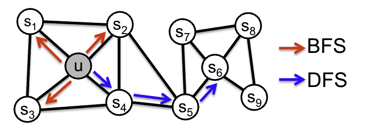
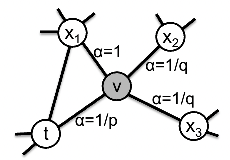
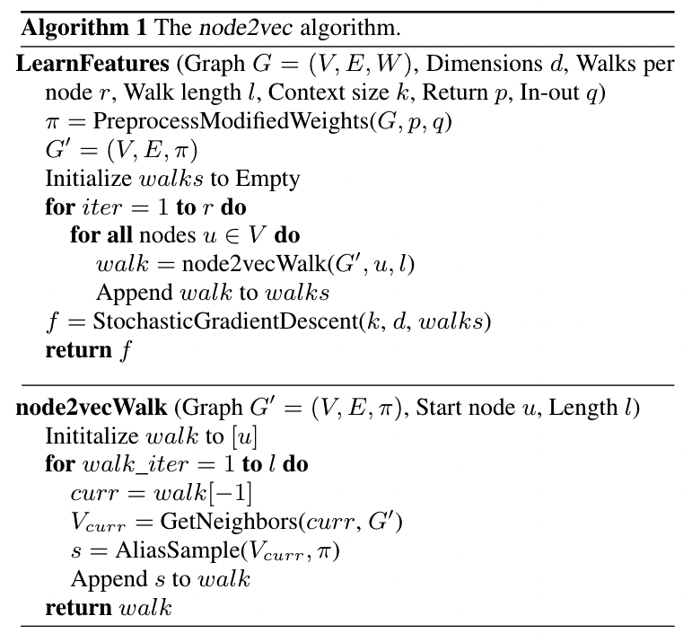

- [x] Round-1: Overview
- [x] Round-2: Model Implementation Details
- [ ] Round-3: Experiments

## Citation

Grover, A., & Leskovec, J. (2016).  
Node2vec: Scalable feature learning for networks.  
Knowledge Discovery and Data Mining - 2016, 855–864.  
https://doi.org/10.1145/2939672.2939754


## Abstract
> Prediction tasks over nodes and edges in networks require careful effort in engineering features used by learning algorithms. Recent research in the broader field of representation learning has led to significant progress in automating prediction by learning the features themselves. However, present feature learning approaches are not expressive enough to capture the diversity of connectivity patterns observed in networks. Here we propose node2vec, an algorithmic framework for learning continuous feature representations for nodes in networks. In node2vec, we learn a mapping of nodes to a low-dimensional space of features that maximizes the likelihood of preserving network neighborhoods of nodes. We define a flexible notion of a node's network neighborhood and design a biased random walk procedure, which efficiently explores diverse neighborhoods. Our algorithm generalizes prior work which is based on rigid notions of network neighborhoods, and we argue that the added flexibility in exploring neighborhoods is the key to learning richer representations. We demonstrate the efficacy of node2vec over existing state-of the-art techniques on multi-label classification and link prediction in several real-world networks from diverse domains. Taken together, our work represents a new way for efficiently learning state of-the-art task-independent representations in complex networks.

## Background & Wat's New
- GNNの領域において，既存研究ではスケーラブルな教師なし学習に用いることができる目的関数は，未だ見つかっていない
  - 既存手法の多くは主成分分析やMulti-Dimensional Scalingなどの技術によって隣接行列からEmbeddingを算出している
  - これらの手法では，どれも計算過程に固有値分解を必要としており，現実の大規模なネットワークに適用するには計算コストが高い
    - 
Mikhail Belkin, P. Niyogi. (2001)  
**Laplacian Eigenmaps and Spectral Techniques for Embedding and Clustering**  
NIPS  
[Paper Link](https://www.semanticscholar.org/paper/9d16c547d15a08091e68c86a99731b14366e3f0d)  
Influential Citation Count (370), SS-ID (9d16c547d15a08091e68c86a99731b14366e3f0d)  
**ABSTRACT**  
Drawing on the correspondence between the graph Laplacian, the Laplace-Beltrami operator on a manifold, and the connections to the heat equation, we propose a geometrically motivated algorithm for constructing a representation for data sampled from a low dimensional manifold embedded in a higher dimensional space. The algorithm provides a computationally efficient approach to nonlinear dimensionality reduction that has locality preserving properties and a natural connection to clustering. Several applications are considered.

    - 
S. Roweis, L. Saul. (2000)  
**Nonlinear dimensionality reduction by locally linear embedding.**  
Science  
[Paper Link](https://www.semanticscholar.org/paper/afcd6da7637ddeef6715109aca248da7a24b1c65)  
Influential Citation Count (1589), SS-ID (afcd6da7637ddeef6715109aca248da7a24b1c65)  
**ABSTRACT**  
Many areas of science depend on exploratory data analysis and visualization. The need to analyze large amounts of multivariate data raises the fundamental problem of dimensionality reduction: how to discover compact representations of high-dimensional data. Here, we introduce locally linear embedding (LLE), an unsupervised learning algorithm that computes low-dimensional, neighborhood-preserving embeddings of high-dimensional inputs. Unlike clustering methods for local dimensionality reduction, LLE maps its inputs into a single global coordinate system of lower dimensionality, and its optimizations do not involve local minima. By exploiting the local symmetries of linear reconstructions, LLE is able to learn the global structure of nonlinear manifolds, such as those generated by images of faces or documents of text.

    - 
J. Tenenbaum, V. De Silva, J. Langford. (2000)  
**A global geometric framework for nonlinear dimensionality reduction.**  
Science  
[Paper Link](https://www.semanticscholar.org/paper/3537fcd0ff99a3b3cb3d279012df826358420556)  
Influential Citation Count (1205), SS-ID (3537fcd0ff99a3b3cb3d279012df826358420556)  
**ABSTRACT**  
Scientists working with large volumes of high-dimensional data, such as global climate patterns, stellar spectra, or human gene distributions, regularly confront the problem of dimensionality reduction: finding meaningful low-dimensional structures hidden in their high-dimensional observations. The human brain confronts the same problem in everyday perception, extracting from its high-dimensional sensory inputs-30,000 auditory nerve fibers or 10(6) optic nerve fibers-a manageably small number of perceptually relevant features. Here we describe an approach to solving dimensionality reduction problems that uses easily measured local metric information to learn the underlying global geometry of a data set. Unlike classical techniques such as principal component analysis (PCA) and multidimensional scaling (MDS), our approach is capable of discovering the nonlinear degrees of freedom that underlie complex natural observations, such as human handwriting or images of a face under different viewing conditions. In contrast to previous algorithms for nonlinear dimensionality reduction, ours efficiently computes a globally optimal solution, and, for an important class of data manifolds, is guaranteed to converge asymptotically to the true structure.

    - 
Shuicheng Yan, Dong Xu, Benyu Zhang, HongJiang Zhang, Qiang Yang, Stephen Lin. (2007)  
**Graph Embedding and Extensions: A General Framework for Dimensionality Reduction**  
IEEE Transactions on Pattern Analysis and Machine Intelligence  
[Paper Link](https://www.semanticscholar.org/paper/69381b5efd97e7c55f51c2730caccab3d632d4d2)  
Influential Citation Count (310), SS-ID (69381b5efd97e7c55f51c2730caccab3d632d4d2)  
**ABSTRACT**  
A large family of algorithms - supervised or unsupervised; stemming from statistics or geometry theory - has been designed to provide different solutions to the problem of dimensionality reduction. Despite the different motivations of these algorithms, we present in this paper a general formulation known as graph embedding to unify them within a common framework. In graph embedding, each algorithm can be considered as the direct graph embedding or its linear/kernel/tensor extension of a specific intrinsic graph that describes certain desired statistical or geometric properties of a data set, with constraints from scale normalization or a penalty graph that characterizes a statistical or geometric property that should be avoided. Furthermore, the graph embedding framework can be used as a general platform for developing new dimensionality reduction algorithms. By utilizing this framework as a tool, we propose a new supervised dimensionality reduction algorithm called marginal Fisher analysis in which the intrinsic graph characterizes the intraclass compactness and connects each data point with its neighboring points of the same class, while the penalty graph connects the marginal points and characterizes the interclass separability. We show that MFA effectively overcomes the limitations of the traditional linear discriminant analysis algorithm due to data distribution assumptions and available projection directions. Real face recognition experiments show the superiority of our proposed MFA in comparison to LDA, also for corresponding kernel and tensor extensions

- 本研究では，ローカルな近傍ノードの情報を保持するような目的関数をデザインする
  - Stochastic Gradient Descent (SGD) を用いて最適化される
  - 同じ方針の既存研究が存在するが，ネットワークの近傍について限定的な前提をおいているため，各ネットワークに固有な接続性のパターンをうまく捉えることができない
    - 
Bryan Perozzi, Rami Al-Rfou, S. Skiena. (2014)  
**DeepWalk: online learning of social representations**  
KDD  
[Paper Link](https://www.semanticscholar.org/paper/fff114cbba4f3ba900f33da574283e3de7f26c83)  
Influential Citation Count (1404), SS-ID (fff114cbba4f3ba900f33da574283e3de7f26c83)  
**ABSTRACT**  
We present DeepWalk, a novel approach for learning latent representations of vertices in a network. These latent representations encode social relations in a continuous vector space, which is easily exploited by statistical models. DeepWalk generalizes recent advancements in language modeling and unsupervised feature learning (or deep learning) from sequences of words to graphs. DeepWalk uses local information obtained from truncated random walks to learn latent representations by treating walks as the equivalent of sentences. We demonstrate DeepWalk's latent representations on several multi-label network classification tasks for social networks such as BlogCatalog, Flickr, and YouTube. Our results show that DeepWalk outperforms challenging baselines which are allowed a global view of the network, especially in the presence of missing information. DeepWalk's representations can provide F1 scores up to 10% higher than competing methods when labeled data is sparse. In some experiments, DeepWalk's representations are able to outperform all baseline methods while using 60% less training data. DeepWalk is also scalable. It is an online learning algorithm which builds useful incremental results, and is trivially parallelizable. These qualities make it suitable for a broad class of real world applications such as network classification, and anomaly detection.

    - 
Jian Tang, Meng Qu, Mingzhe Wang, Ming Zhang, Jun Yan, Q. Mei. (2015)  
**LINE: Large-scale Information Network Embedding**  
WWW  
[Paper Link](https://www.semanticscholar.org/paper/0834e74304b547c9354b6d7da6fa78ef47a48fa8)  
Influential Citation Count (873), SS-ID (0834e74304b547c9354b6d7da6fa78ef47a48fa8)  
**ABSTRACT**  
This paper studies the problem of embedding very large information networks into low-dimensional vector spaces, which is useful in many tasks such as visualization, node classification, and link prediction. Most existing graph embedding methods do not scale for real world information networks which usually contain millions of nodes. In this paper, we propose a novel network embedding method called the ``LINE,'' which is suitable for arbitrary types of information networks: undirected, directed, and/or weighted. The method optimizes a carefully designed objective function that preserves both the local and global network structures. An edge-sampling algorithm is proposed that addresses the limitation of the classical stochastic gradient descent and improves both the effectiveness and the efficiency of the inference. Empirical experiments prove the effectiveness of the LINE on a variety of real-world information networks, including language networks, social networks, and citation networks. The algorithm is very efficient, which is able to learn the embedding of a network with millions of vertices and billions of edges in a few hours on a typical single machine. The source code of the LINE is available online\footnote{\url{https://github.com/tangjianpku/LINE}}.

- ネットワークのEmbeddingの学習において，同じ”コミュニティ”に所属しているノード同士の距離が近くなること，各”コミュニティ”において同じ役割を持つノード同士の距離が近くなること，の2点が重要である
- 学習に際して，Random Walkを用いて各ノードにおける適切な量の近傍ノードを抽出する手法を考案した
- 少量の正解データを用いて半教師有り学習を実施

## Dataset

## Model Description

グラフ $G=(V,E)$ に関して，$f: V \to \mathbb{R}^d$ となるようなEmbedding（写像）を考える．  
また，$\forall v \in V$ に対して，Strategy $S$ においてサンプリングされた **ネットワーク近傍（network neighborhood）** を $N\_S(v) \subset V$ と定義する．

NLPの領域におけるSkip-gramの手法を拡張して，以下の目的関数を考える．

$$
\max\_f \sum\_{v \in V} \log P\left( N\_S(v) | f(v) \right) \tag{1}
$$

このままでは扱いにくいので，以下の2つの前提をおく．
- Conditional Independence  
  $f$ が与えられたときのネットワーク近傍における各ノードの確率はそれぞれ独立である
  $$
    P(N\_S(v) | f(v)) = \prod\_{n\_i \in N\_S(v)} P(n\_i | f(v)) \tag{2}
  $$
- Symmetry in feature space  
  ノードとネットワーク近傍のノードは写像先の空間において対称的 (has a symmetric effect) である  
  したがって，個々のノードにおける確率はSoftmaxで表現できる
  $$
    P(n\_i | f(v)) = \frac{\exp \left( f(n\_i) \cdot f(v)\right)}{\sum\_{u \in V} \exp \left( f(u) \cdot f(v)\right)} \tag{3}
  $$

上記2つの前提を踏まえると，(1)は以下のようになる

$$
\begin{array}{l}
  {\displaystyle \max\_f \sum\_{v \in V} \left[ -\log Z\_v + \sum\_{n\_i \in N\_S(v)} f(n\_i) \cdot f(v) \right]} \tag{4} \\\\
  \text{where} \\\\
  \hspace{10pt} Z\_v = \sum\_{u \in V} \exp \left( f(v) \cdot f(u)\right)
\end{array}
$$

$Z\_v$ はそのまま計算すると計算コストが高いのでネガティブサンプリングで推定し，(4) をSGDで最適化する．

Skip-gramをベースとして学習を実施する場合，NLPの場合は単語列を線形に扱うことができるのでSliding Windowを設定すれば良いが，ネットワークは非線形な構造をしているので，$N\_S(v)$ に関して別のサンプリング方針を考える必要がある．

### Strategies

#### 近傍の2通りの考え方
- Breadth-first Sampling (BFS)
- Depth-first Sampling (DFS)

<figure>
  
  <figcaption>BFS and DFS search strategies from node $u \hspace{5pt} (k=3)$</figcaption>
</figure>

#### ネットワークにおける類似性の2通りの考え方
- homophily hypothesis
  密につながっているノード同士，同じクラスターに所属しているノード同士の距離が近くなるようにEmbeddingする
  $\to$ DFS
- structural equivalence hypothesis
  異なるクラスターにおいて，同じ役割を担っているノード同士の距離が近くなるようにEmbeddingする
  ex. ハブになっているノード，ゲートになっているノードなど
  $\to$ BFS

### node2vec

ノード $v$ から固定長 $l$ のランダムウォークでノード $c\_i$ を得る

$$
P(c\_i = x | c\_{i-1} = v) = 
\left \lbrace \begin{array}{l}
  {\displaystyle \frac{\pi\_{vx}}{Z}} \hspace{10pt} & \text{if } (v, x) \in E \\\\
  0 \hspace{10pt} & \text{otherwise}
\end{array} \right . \tag{5} \\\\
\text{where} \hspace{10pt} \begin{array}{l}
  c\_0 &= v \\\\
  \pi\_{vx} & \mapsto \text{the unnormalized transition probability} \\\\
  Z & \mapsto \text{the normalizing constant}
\end{array}
$$

ランダムウォークにおいてネットワークの構造を反映するため，$2^{\text{nd}}$ order random walk を定義する  
ランダムウォークがノード $t$ から $v$ に移動した直後だとした場合，遷移確率を下記のように定義する

$$
\pi\_{vx} = \alpha\_{pq}(t, x) \cdot w\_{vx} \tag{6} \\\\
\text{where} \hspace{10pt} \left \lbrace \begin{array}{l}
  \alpha\_{pq}(t, x) & = \left \lbrace \begin{array}{l}
    \frac{1}{p} & \hspace{5pt} \text{if } d\_{tx} = 0 \\\\
    1 & \hspace{5pt} \text{if } d\_{tx} = 1 \\\\
    \frac{1}{q} & \hspace{5pt} \text{if } d\_{tx} = 2
  \end{array} \right . \\\\
  w\_{vx} & \mapsto \text{weight of the edge }(v, x) \\\\
  d\_{tx} & \mapsto \text{shortest path distance between nodes }t\text{ and }x \\\\
  p & \mapsto \text{controls the likelihood of immediately revisiting a node in the walk} \\\\
  q & \mapsto \text{allows the search to differentiate between "inward" and "outward"}
\end{array} \right .
$$

$p$ が大きいほど，一度訪れたノードを再度訪れる確率が小さくなる  
$q > 1$ のとき，よりBFS的に，$q < 1$ のとき，よりDFS的になる

<figure>
  
  <figcaption>Illustration of the random walk procedure in node2vec</figcaption>
</figure>

node2vec の計算は，
1. 遷移確率を事前に計算する前処理工程
2. ランダムウォークによるシミュレーション工程
3. SGDによる最適化工程
の3つのプロセスから成る

<figure>
  
  <figcaption>The node2vec algorithm</figcaption>
</figure>

## Results

### Settings

## References


D. Liben-Nowell, J. Kleinberg. (2003)  
**The link prediction problem for social networks**  
CIKM '03  
[Paper Link](https://www.semanticscholar.org/paper/007f3290e1b5e3061a8b7089037ee775efc47b83)  
Influential Citation Count (71), SS-ID (007f3290e1b5e3061a8b7089037ee775efc47b83)  
**ABSTRACT**  
Given a snapshot of a social network, can we infer which new interactions among its members are likely to occur in the near future? We formalize this question as the link prediction problem, and develop approaches to link prediction based on measures the "proximity" of nodes in a network. Experiments on large co-authorship networks suggest that information about future interactions can be extracted from network topology alone, and that fairly subtle measures for detecting node proximity can outperform more direct measures.


P. Radivojac, W. Clark, T. Oron, A. M. Schnoes, T. Wittkop, A. Sokolov, Kiley Graim, Christopher S. Funk, K. Verspoor, A. Ben-Hur, G. Pandey, Jeffrey M. Yunes, Ameet S. Talwalkar, Susanna Repo, Michael L Souza, Damiano Piovesan, R. Casadio, Z. Wang, Jianlin Cheng, Hai Fang, J. Gough, P. Koskinen, P. Törönen, Jussi Nokso-Koivisto, L. Holm, D. Cozzetto, Daniel W. A. Buchan, K. Bryson, David T. Jones, Bhakti Limaye, Harshal Inamdar, Avik Datta, Sunitha K Manjari, R. Joshi, Meghana Chitale, D. Kihara, A. M. Lisewski, S. Erdin, Eric Venner, O. Lichtarge, R. Rentzsch, Haixuan Yang, Alfonso E. Romero, Prajwal Bhat, Alberto Paccanaro, Tobias Hamp, R. Kassner, Stefan Seemayer, Esmeralda Vicedo, Christian Schaefer, Dominik Achten, Florian Auer, Ariane Boehm, T. Braun, M. Hecht, Mark Heron, Peter Hönigschmid, Thomas A. Hopf, Stefanie Kaufmann, M. Kiening, Denis Krompass, C. Landerer, Yannick Mahlich, Manfred Roos, Jari Björne, T. Salakoski, Andrew Wong, H. Shatkay, Fanny Gatzmann, Ingolf Sommer, M. Wass, M. Sternberg, N. Skunca, F. Supek, Matko Bosnjak, P. Panov, S. Džeroski, T. Šmuc, Yiannis Kourmpetis, Aalt D. J. van Dijk, C. Braak, Yuanpeng Zhou, Qingtian Gong, Xinran Dong, Weidong Tian, M. Falda, P. Fontana, E. Lavezzo, B. Di Camillo, S. Toppo, Liang Lan, Nemanja Djuric, Yuhong Guo, S. Vucetic, A. Bairoch, M. Linial, P. Babbitt, S. Brenner, C. Orengo, B. Rost, S. Mooney, I. Friedberg. (2013)  
**A large-scale evaluation of computational protein function prediction**  
Nature Methods  
[Paper Link](https://www.semanticscholar.org/paper/07bd16366fc4b2c9055390890a814073e9e94053)  
Influential Citation Count (38), SS-ID (07bd16366fc4b2c9055390890a814073e9e94053)  


Jian Tang, Meng Qu, Mingzhe Wang, Ming Zhang, Jun Yan, Q. Mei. (2015)  
**LINE: Large-scale Information Network Embedding**  
WWW  
[Paper Link](https://www.semanticscholar.org/paper/0834e74304b547c9354b6d7da6fa78ef47a48fa8)  
Influential Citation Count (873), SS-ID (0834e74304b547c9354b6d7da6fa78ef47a48fa8)  
**ABSTRACT**  
This paper studies the problem of embedding very large information networks into low-dimensional vector spaces, which is useful in many tasks such as visualization, node classification, and link prediction. Most existing graph embedding methods do not scale for real world information networks which usually contain millions of nodes. In this paper, we propose a novel network embedding method called the ``LINE,'' which is suitable for arbitrary types of information networks: undirected, directed, and/or weighted. The method optimizes a carefully designed objective function that preserves both the local and global network structures. An edge-sampling algorithm is proposed that addresses the limitation of the classical stochastic gradient descent and improves both the effectiveness and the efficiency of the inference. Empirical experiments prove the effectiveness of the LINE on a variety of real-world information networks, including language networks, social networks, and citation networks. The algorithm is very efficient, which is able to learn the embedding of a network with millions of vertices and billions of edges in a few hours on a typical single machine. The source code of the LINE is available online\footnote{\url{https://github.com/tangjianpku/LINE}}.


B. Breitkreutz, Chris Stark, T. Reguly, L. Boucher, A. Breitkreutz, M. Livstone, R. Oughtred, D. Lackner, J. Bähler, V. Wood, K. Dolinski, M. Tyers. (2007)  
**The BioGRID Interaction Database: 2008 update**  
Nucleic Acids Res.  
[Paper Link](https://www.semanticscholar.org/paper/08705b00d9dcdfa69dc40f073c5a29e2cf8bcbed)  
Influential Citation Count (102), SS-ID (08705b00d9dcdfa69dc40f073c5a29e2cf8bcbed)  
**ABSTRACT**  
The Biological General Repository for Interaction Datasets (BioGRID) database (http://www.thebiogrid.org) was developed to house and distribute collections of protein and genetic interactions from major model organism species. BioGRID currently contains over 198 000 interactions from six different species, as derived from both high-throughput studies and conventional focused studies. Through comprehensive curation efforts, BioGRID now includes a virtually complete set of interactions reported to date in the primary literature for both the budding yeast Saccharomyces cerevisiae and the fission yeast Schizosaccharomyces pombe. A number of new features have been added to the BioGRID including an improved user interface to display interactions based on different attributes, a mirror site and a dedicated interaction management system to coordinate curation across different locations. The BioGRID provides interaction data with monthly updates to Saccharomyces Genome Database, Flybase and Entrez Gene. Source code for the BioGRID and the linked Osprey network visualization system is now freely available without restriction.


Jaewon Yang, J. Leskovec. (2014)  
**Overlapping Communities Explain Core–Periphery Organization of Networks**  
Proceedings of the IEEE  
[Paper Link](https://www.semanticscholar.org/paper/090f394df0cf051c78907aaaaa8bca9bd2e5d29d)  
Influential Citation Count (5), SS-ID (090f394df0cf051c78907aaaaa8bca9bd2e5d29d)  
**ABSTRACT**  
Networks provide a powerful way to study complex systems of interacting objects. Detecting network communities-groups of objects that often correspond to functional modules-is crucial to understanding social, technological, and biological systems. Revealing communities allows for analysis of system properties that are invisible when considering only individual objects or the entire system, such as the identification of module boundaries and relationships or the classification of objects according to their functional roles. However, in networks where objects can simultaneously belong to multiple modules at once, the decomposition of a network into overlapping communities remains a challenge. Here we present a new paradigm for uncovering the modular structure of complex networks, based on a decomposition of a network into any combination of overlapping, nonoverlapping, and hierarchically organized communities. We demonstrate on a diverse set of networks coming from a wide range of domains that our approach leads to more accurate communities and improved identification of community boundaries. We also unify two fundamental organizing principles of complex networks: the modularity of communities and the commonly observed core-periphery structure. We show that dense network cores form as an intersection of many overlapping communities. We discover that communities in social, information, and food web networks have a single central dominant core while communities in protein-protein interaction (PPI) as well as product copurchasing networks have small overlaps and form many local cores.


Yoshua Bengio, Aaron C. Courville, Pascal Vincent. (2012)  
**Representation Learning: A Review and New Perspectives**  
IEEE Transactions on Pattern Analysis and Machine Intelligence  
[Paper Link](https://www.semanticscholar.org/paper/184ac0766262312ba76bbdece4e7ffad0aa8180b)  
Influential Citation Count (468), SS-ID (184ac0766262312ba76bbdece4e7ffad0aa8180b)  
**ABSTRACT**  
The success of machine learning algorithms generally depends on data representation, and we hypothesize that this is because different representations can entangle and hide more or less the different explanatory factors of variation behind the data. Although specific domain knowledge can be used to help design representations, learning with generic priors can also be used, and the quest for AI is motivating the design of more powerful representation-learning algorithms implementing such priors. This paper reviews recent work in the area of unsupervised feature learning and deep learning, covering advances in probabilistic models, autoencoders, manifold learning, and deep networks. This motivates longer term unanswered questions about the appropriate objectives for learning good representations, for computing representations (i.e., inference), and the geometrical connections between representation learning, density estimation, and manifold learning.


Keith W. Henderson, B. Gallagher, Tina Eliassi-Rad, Hanghang Tong, Sugato Basu, L. Akoglu, Danai Koutra, C. Faloutsos, Lei Li. (2012)  
**RolX: structural role extraction & mining in large graphs**  
KDD  
[Paper Link](https://www.semanticscholar.org/paper/199369d8eaff23e00c106ef2ddc4181696600c1f)  
Influential Citation Count (39), SS-ID (199369d8eaff23e00c106ef2ddc4181696600c1f)  
**ABSTRACT**  
Given a network, intuitively two nodes belong to the same role if they have similar structural behavior. Roles should be automatically determined from the data, and could be, for example, "clique-members," "periphery-nodes," etc. Roles enable numerous novel and useful network-mining tasks, such as sense-making, searching for similar nodes, and node classification. This paper addresses the question: Given a graph, how can we automatically discover roles for nodes? We propose RolX (Role eXtraction), a scalable (linear in the number of edges), unsupervised learning approach for automatically extracting structural roles from general network data. We demonstrate the effectiveness of RolX on several network-mining tasks: from exploratory data analysis to network transfer learning. Moreover, we compare network role discovery with network community discovery. We highlight fundamental differences between the two (e.g., roles generalize across disconnected networks, communities do not); and show that the two approaches are complimentary in nature.


Shuangfei Zhai, Zhongfei Zhang. (2015)  
**Dropout Training of Matrix Factorization and Autoencoder for Link Prediction in Sparse Graphs**  
SDM  
[Paper Link](https://www.semanticscholar.org/paper/1e79e7d3247c7fddebaf5242c661de79bf7f31a7)  
Influential Citation Count (3), SS-ID (1e79e7d3247c7fddebaf5242c661de79bf7f31a7)  
**ABSTRACT**  
Matrix factorization (MF) and Autoencoder (AE) are among the most successful approaches of unsupervised learning. While MF based models have been extensively exploited in the graph modeling and link prediction literature, the AE family has not gained much attention. In this paper we investigate both MF and AE's application to the link prediction problem in sparse graphs. We show the connection between AE and MF from the perspective of multiview learning, and further propose MF+AE: a model training MF and AE jointly with shared parameters. We apply dropout to training both the MF and AE parts, and show that it can significantly prevent overfitting by acting as an adaptive regularization. We conduct experiments on six real world sparse graph datasets, and show that MF+AE consistently outperforms the competing methods, especially on datasets that demonstrate strong non-cohesive structures.


M. Livstone, B. Breitkreutz, Chris Stark, L. Boucher, A. Chatr-aryamontri, R. Oughtred, Julie Nixon, T. Reguly, Jennifer M. Rust, Andrew G. Winter, K. Dolinski, M. Tyers. (2011)  
**The BioGRID Interaction Database**  
  
[Paper Link](https://www.semanticscholar.org/paper/2515e0eb321c558629678b0c34447b40725ed989)  
Influential Citation Count (11), SS-ID (2515e0eb321c558629678b0c34447b40725ed989)  


L. Backstrom, J. Leskovec. (2010)  
**Supervised random walks: predicting and recommending links in social networks**  
WSDM '11  
[Paper Link](https://www.semanticscholar.org/paper/29efbdf3f95cee97405accafdebd3bd374f1f003)  
Influential Citation Count (85), SS-ID (29efbdf3f95cee97405accafdebd3bd374f1f003)  
**ABSTRACT**  
Predicting the occurrence of links is a fundamental problem in networks. In the link prediction problem we are given a snapshot of a network and would like to infer which interactions among existing members are likely to occur in the near future or which existing interactions are we missing. Although this problem has been extensively studied, the challenge of how to effectively combine the information from the network structure with rich node and edge attribute data remains largely open.  We develop an algorithm based on Supervised Random Walks that naturally combines the information from the network structure with node and edge level attributes. We achieve this by using these attributes to guide a random walk on the graph. We formulate a supervised learning task where the goal is to learn a function that assigns strengths to edges in the network such that a random walker is more likely to visit the nodes to which new links will be created in the future. We develop an efficient training algorithm to directly learn the edge strength estimation function.  Our experiments on the Facebook social graph and large collaboration networks show that our approach outperforms state-of-the-art unsupervised approaches as well as approaches that are based on feature extraction.


Tomas Mikolov, Kai Chen, G. Corrado, J. Dean. (2013)  
**Efficient Estimation of Word Representations in Vector Space**  
ICLR  
[Paper Link](https://www.semanticscholar.org/paper/330da625c15427c6e42ccfa3b747fb29e5835bf0)  
Influential Citation Count (3541), SS-ID (330da625c15427c6e42ccfa3b747fb29e5835bf0)  
**ABSTRACT**  
We propose two novel model architectures for computing continuous vector representations of words from very large data sets. The quality of these representations is measured in a word similarity task, and the results are compared to the previously best performing techniques based on different types of neural networks. We observe large improvements in accuracy at much lower computational cost, i.e. it takes less than a day to learn high quality word vectors from a 1.6 billion words data set. Furthermore, we show that these vectors provide state-of-the-art performance on our test set for measuring syntactic and semantic word similarities.


J. Tenenbaum, V. De Silva, J. Langford. (2000)  
**A global geometric framework for nonlinear dimensionality reduction.**  
Science  
[Paper Link](https://www.semanticscholar.org/paper/3537fcd0ff99a3b3cb3d279012df826358420556)  
Influential Citation Count (1205), SS-ID (3537fcd0ff99a3b3cb3d279012df826358420556)  
**ABSTRACT**  
Scientists working with large volumes of high-dimensional data, such as global climate patterns, stellar spectra, or human gene distributions, regularly confront the problem of dimensionality reduction: finding meaningful low-dimensional structures hidden in their high-dimensional observations. The human brain confronts the same problem in everyday perception, extracting from its high-dimensional sensory inputs-30,000 auditory nerve fibers or 10(6) optic nerve fibers-a manageably small number of perceptually relevant features. Here we describe an approach to solving dimensionality reduction problems that uses easily measured local metric information to learn the underlying global geometry of a data set. Unlike classical techniques such as principal component analysis (PCA) and multidimensional scaling (MDS), our approach is capable of discovering the nonlinear degrees of freedom that underlie complex natural observations, such as human handwriting or images of a face under different viewing conditions. In contrast to previous algorithms for nonlinear dimensionality reduction, ours efficiently computes a globally optimal solution, and, for an important class of data manifolds, is guaranteed to converge asymptotically to the true structure.


B. Recht, Christopher Ré, Stephen J. Wright, Feng Niu. (2011)  
**Hogwild: A Lock-Free Approach to Parallelizing Stochastic Gradient Descent**  
NIPS  
[Paper Link](https://www.semanticscholar.org/paper/36f49b05d764bf5c10428b082c2d96c13c4203b9)  
Influential Citation Count (323), SS-ID (36f49b05d764bf5c10428b082c2d96c13c4203b9)  
**ABSTRACT**  
Stochastic Gradient Descent (SGD) is a popular algorithm that can achieve state-of-the-art performance on a variety of machine learning tasks. Several researchers have recently proposed schemes to parallelize SGD, but all require performance-destroying memory locking and synchronization. This work aims to show using novel theoretical analysis, algorithms, and implementation that SGD can be implemented without any locking. We present an update scheme called HOGWILD! which allows processors access to shared memory with the possibility of overwriting each other's work. We show that when the associated optimization problem is sparse, meaning most gradient updates only modify small parts of the decision variable, then HOGWILD! achieves a nearly optimal rate of convergence. We demonstrate experimentally that HOGWILD! outperforms alternative schemes that use locking by an order of magnitude.


Kang Li, Jing Gao, Suxin Guo, Nan Du, Xiaoyi Li, A. Zhang. (2014)  
**LRBM: A Restricted Boltzmann Machine Based Approach for Representation Learning on Linked Data**  
2014 IEEE International Conference on Data Mining  
[Paper Link](https://www.semanticscholar.org/paper/3ce947f68c2c4061736a8b4363ebf84f48c572c9)  
Influential Citation Count (3), SS-ID (3ce947f68c2c4061736a8b4363ebf84f48c572c9)  
**ABSTRACT**  
Linked data consist of both node attributes, e.g., Preferences, posts and degrees, and links which describe the connections between nodes. They have been widely used to represent various network systems, such as social networks, biological networks and etc. Knowledge discovery on linked data is of great importance to many real applications. One of the major challenges of learning linked data is how to effectively and efficiently extract useful information from both node attributes and links in linked data. Current studies on this topic either use selected topological statistics to represent network structures, or linearly map node attributes and network structures to a shared latent feature space. However, while approaches based on statistics may miss critical patterns in network structure, approaches based on linear mappings may not be sufficient to capture the non-linear characteristics of nodes and links. To handle the challenge, we propose, to our knowledge, the first deep learning method to learn from linked data. A restricted Boltzmann machine model named LRBM is developed for representation learning on linked data. In LRBM, we aim to extract the latent feature representation of each node from both node attributes and network structures, non-linearly map each pair of nodes to the links, and use hidden units to control the mapping. The details of how to adapt LRBM for link prediction and node classification on linked data have also been presented. In the experiments, we test the performance of LRBM as well as other baselines on link prediction and node classification. Overall, the extensive experimental evaluations confirm the effectiveness of the proposed LRBM model in mining linked data.


W. Marsden. (2012)  
**I and J**  
  
[Paper Link](https://www.semanticscholar.org/paper/3d2218b17e7898a222e5fc2079a3f1531990708f)  
Influential Citation Count (12260), SS-ID (3d2218b17e7898a222e5fc2079a3f1531990708f)  


Lei Tang, Huan Liu. (2011)  
**Leveraging social media networks for classification**  
Data Mining and Knowledge Discovery  
[Paper Link](https://www.semanticscholar.org/paper/3f9df5c77af49d5b1b19eac9b82cb430b50f482d)  
Influential Citation Count (27), SS-ID (3f9df5c77af49d5b1b19eac9b82cb430b50f482d)  

{{< ci-details summary="{SNAP Datasets}: {Stanford} Large Network Dataset Collection (J. Leskovec et al., 2014)">}}
J. Leskovec, A. Krevl. (2014)  
**{SNAP Datasets}: {Stanford} Large Network Dataset Collection**  
  
[Paper Link](https://www.semanticscholar.org/paper/404ae4a2b31d5c2184861cf702f953e47db40cab)  
Influential Citation Count (340), SS-ID (404ae4a2b31d5c2184861cf702f953e47db40cab)  
**ABSTRACT**  
A collection of more than 50 large network datasets from tens of thousands of nodes and edges to tens of millions of nodes and edges. In includes social networks, web graphs, road networks, internet networks, citation networks, collaboration networks, and communication networks.


Yujia Li, Daniel Tarlow, Marc Brockschmidt, R. Zemel. (2015)  
**Gated Graph Sequence Neural Networks**  
ICLR  
[Paper Link](https://www.semanticscholar.org/paper/492f57ee9ceb61fb5a47ad7aebfec1121887a175)  
Influential Citation Count (307), SS-ID (492f57ee9ceb61fb5a47ad7aebfec1121887a175)  
**ABSTRACT**  
Abstract: Graph-structured data appears frequently in domains including chemistry, natural language semantics, social networks, and knowledge bases. In this work, we study feature learning techniques for graph-structured inputs. Our starting point is previous work on Graph Neural Networks (Scarselli et al., 2009), which we modify to use gated recurrent units and modern optimization techniques and then extend to output sequences. The result is a flexible and broadly useful class of neural network models that has favorable inductive biases relative to purely sequence-based models (e.g., LSTMs) when the problem is graph-structured. We demonstrate the capabilities on some simple AI (bAbI) and graph algorithm learning tasks. We then show it achieves state-of-the-art performance on a problem from program verification, in which subgraphs need to be matched to abstract data structures.


Shuang-Hong Yang, Bo Long, Alex Smola, N. Sadagopan, Zhaohui Zheng, H. Zha. (2011)  
**Like like alike: joint friendship and interest propagation in social networks**  
WWW  
[Paper Link](https://www.semanticscholar.org/paper/68b464837c44e909af353f148bc79837ee4e9877)  
Influential Citation Count (24), SS-ID (68b464837c44e909af353f148bc79837ee4e9877)  
**ABSTRACT**  
Targeting interest to match a user with services (e.g. news, products, games, advertisements) and predicting friendship to build connections among users are two fundamental tasks for social network systems. In this paper, we show that the information contained in interest networks (i.e. user-service interactions) and friendship networks (i.e. user-user connections) is highly correlated and mutually helpful. We propose a framework that exploits homophily to establish an integrated network linking a user to interested services and connecting different users with common interests, upon which both friendship and interests could be efficiently propagated. The proposed friendship-interest propagation (FIP) framework devises a factor-based random walk model to explain friendship connections, and simultaneously it uses a coupled latent factor model to uncover interest interactions. We discuss the flexibility of the framework in the choices of loss objectives and regularization penalties and benchmark different variants on the Yahoo! Pulse social networking system. Experiments demonstrate that by coupling friendship with interest, FIP achieves much higher performance on both interest targeting and friendship prediction than systems using only one source of information.


Shuicheng Yan, Dong Xu, Benyu Zhang, HongJiang Zhang, Qiang Yang, Stephen Lin. (2007)  
**Graph Embedding and Extensions: A General Framework for Dimensionality Reduction**  
IEEE Transactions on Pattern Analysis and Machine Intelligence  
[Paper Link](https://www.semanticscholar.org/paper/69381b5efd97e7c55f51c2730caccab3d632d4d2)  
Influential Citation Count (310), SS-ID (69381b5efd97e7c55f51c2730caccab3d632d4d2)  
**ABSTRACT**  
A large family of algorithms - supervised or unsupervised; stemming from statistics or geometry theory - has been designed to provide different solutions to the problem of dimensionality reduction. Despite the different motivations of these algorithms, we present in this paper a general formulation known as graph embedding to unify them within a common framework. In graph embedding, each algorithm can be considered as the direct graph embedding or its linear/kernel/tensor extension of a specific intrinsic graph that describes certain desired statistical or geometric properties of a data set, with constraints from scale normalization or a penalty graph that characterizes a statistical or geometric property that should be avoided. Furthermore, the graph embedding framework can be used as a general platform for developing new dimensionality reduction algorithms. By utilizing this framework as a tool, we propose a new supervised dimensionality reduction algorithm called marginal Fisher analysis in which the intrinsic graph characterizes the intraclass compactness and connects each data point with its neighboring points of the same class, while the penalty graph connects the marginal points and characterizes the interclass separability. We show that MFA effectively overcomes the limitations of the traditional linear discriminant analysis algorithm due to data distribution assumptions and available projection directions. Real face recognition experiments show the superiority of our proposed MFA in comparison to LDA, also for corresponding kernel and tensor extensions


D. Knuth. (1993)  
**The Stanford GraphBase - a platform for combinatorial computing**  
  
[Paper Link](https://www.semanticscholar.org/paper/77eb30495093bfe10929e7847d9d04ec41409846)  
Influential Citation Count (94), SS-ID (77eb30495093bfe10929e7847d9d04ec41409846)  
**ABSTRACT**  
Part 1: overview - Words, Roget, Books, Econ, Games, Miles, Plane, Lisa, Raman, Gates, Rand, Basic, Save technicalities - representation of Graphs, Words, Roget, Books, Econ, Games, Miles, Plane installation and use - how to obtain the files, installing CWEB, installing the graphbase, makefile details, troubleshooting, running the demos, storage considerations, running your own programs how to read CWEB programs - programs of the Stanford GraphBase, ASSIGN_LISA, BOOK_COMPONENTS, ECON_ORDER, FOOTBALL, GB_BASIC, GB_BOOKS, GB_DIJK, GB_ECON, GB_FLIP, GB_GAMES, GB_GATES, GB_GRAPH, GB_IO, GB_LISA, GB_MILES, GB_PLANE, GB_RAMAN, GB_RAND, GB_ROGET, GB_SAVE, GB_SORT, GB_WORDS, GIRTH, LADDERS, MILES_SPAN, MULTIPLY, QUEEN, ROGET_COMPONENTS, TAKE_RISC, TEST_SAMPLE, WORD_COMPONENTS, index to all the programs. Appendices: error codes summary of function calls - generators, nongenerators example graph parameters - undirected graphs, directed graphs 300 five-letter words.


Peter D. Hoff, A. Raftery, M. Handcock. (2002)  
**Latent Space Approaches to Social Network Analysis**  
  
[Paper Link](https://www.semanticscholar.org/paper/82e4390c043754d5af22d48964a42a891f81e8b3)  
Influential Citation Count (177), SS-ID (82e4390c043754d5af22d48964a42a891f81e8b3)  
**ABSTRACT**  
Network models are widely used to represent relational information among interacting units. In studies of social networks, recent emphasis has been placed on random graph models where the nodes usually represent individual social actors and the edges represent the presence of a specified relation between actors. We develop a class of models where the probability of a relation between actors depends on the positions of individuals in an unobserved “social space.” We make inference for the social space within maximum likelihood and Bayesian frameworks, and propose Markov chain Monte Carlo procedures for making inference on latent positions and the effects of observed covariates. We present analyses of three standard datasets from the social networks literature, and compare the method to an alternative stochastic blockmodeling approach. In addition to improving on model fit for these datasets, our method provides a visual and interpretable model-based spatial representation of social relationships and improves on existing methods by allowing the statistical uncertainty in the social space to be quantified and graphically represented.


Tomas Mikolov, Ilya Sutskever, Kai Chen, G. Corrado, J. Dean. (2013)  
**Distributed Representations of Words and Phrases and their Compositionality**  
NIPS  
[Paper Link](https://www.semanticscholar.org/paper/87f40e6f3022adbc1f1905e3e506abad05a9964f)  
Influential Citation Count (3729), SS-ID (87f40e6f3022adbc1f1905e3e506abad05a9964f)  
**ABSTRACT**  
The recently introduced continuous Skip-gram model is an efficient method for learning high-quality distributed vector representations that capture a large number of precise syntactic and semantic word relationships. In this paper we present several extensions that improve both the quality of the vectors and the training speed. By subsampling of the frequent words we obtain significant speedup and also learn more regular word representations. We also describe a simple alternative to the hierarchical softmax called negative sampling.    An inherent limitation of word representations is their indifference to word order and their inability to represent idiomatic phrases. For example, the meanings of "Canada" and "Air" cannot be easily combined to obtain "Air Canada". Motivated by this example, we present a simple method for finding phrases in text, and show that learning good vector representations for millions of phrases is possible.


Lada A. Adamic, Eytan Adar. (2003)  
**Friends and neighbors on the Web**  
Soc. Networks  
[Paper Link](https://www.semanticscholar.org/paper/8dc9d11e3fc229a1b70bb00de72dc15d55848174)  
Influential Citation Count (194), SS-ID (8dc9d11e3fc229a1b70bb00de72dc15d55848174)  


B. Gallagher, Tina Eliassi-Rad. (2008)  
**Leveraging Label-Independent Features for Classification in Sparsely Labeled Networks: An Empirical Study**  
SNAKDD  
[Paper Link](https://www.semanticscholar.org/paper/938de044710faf44a59094a47e7cf34fa155e622)  
Influential Citation Count (2), SS-ID (938de044710faf44a59094a47e7cf34fa155e622)  


S. Fortunato. (2009)  
**Community detection in graphs**  
ArXiv  
[Paper Link](https://www.semanticscholar.org/paper/9be428c9383d47b86570b1b9fc20faf006346c5d)  
Influential Citation Count (746), SS-ID (9be428c9383d47b86570b1b9fc20faf006346c5d)  


Mikhail Belkin, P. Niyogi. (2001)  
**Laplacian Eigenmaps and Spectral Techniques for Embedding and Clustering**  
NIPS  
[Paper Link](https://www.semanticscholar.org/paper/9d16c547d15a08091e68c86a99731b14366e3f0d)  
Influential Citation Count (370), SS-ID (9d16c547d15a08091e68c86a99731b14366e3f0d)  
**ABSTRACT**  
Drawing on the correspondence between the graph Laplacian, the Laplace-Beltrami operator on a manifold, and the connections to the heat equation, we propose a geometrically motivated algorithm for constructing a representation for data sampled from a low dimensional manifold embedded in a higher dimensional space. The algorithm provides a computationally efficient approach to nonlinear dimensionality reduction that has locality preserving properties and a natural connection to clustering. Several applications are considered.


Grigorios Tsoumakas, I. Katakis. (2007)  
**Multi-Label Classification: An Overview**  
Int. J. Data Warehous. Min.  
[Paper Link](https://www.semanticscholar.org/paper/a6ccfe1ac31444fb5a0d32b58182e0fb1b17c0e4)  
Influential Citation Count (189), SS-ID (a6ccfe1ac31444fb5a0d32b58182e0fb1b17c0e4)  
**ABSTRACT**  
Multi-label classification methods are increasingly required by modern applications, such as protein function classification, music categorization, and semantic scene classification. This article introduces the task of multi-label classification, organizes the sparse related literature into a structured presentation and performs comparative experimental results of certain multilabel classification methods. It also contributes the definition of concepts for the quantification of the multi-label nature of a data set.


S. Roweis, L. Saul. (2000)  
**Nonlinear dimensionality reduction by locally linear embedding.**  
Science  
[Paper Link](https://www.semanticscholar.org/paper/afcd6da7637ddeef6715109aca248da7a24b1c65)  
Influential Citation Count (1589), SS-ID (afcd6da7637ddeef6715109aca248da7a24b1c65)  
**ABSTRACT**  
Many areas of science depend on exploratory data analysis and visualization. The need to analyze large amounts of multivariate data raises the fundamental problem of dimensionality reduction: how to discover compact representations of high-dimensional data. Here, we introduce locally linear embedding (LLE), an unsupervised learning algorithm that computes low-dimensional, neighborhood-preserving embeddings of high-dimensional inputs. Unlike clustering methods for local dimensionality reduction, LLE maps its inputs into a single global coordinate system of lower dimensionality, and its optimizations do not involve local minima. By exploiting the local symmetries of linear reconstructions, LLE is able to learn the global structure of nonlinear manifolds, such as those generated by images of faces or documents of text.


A. Chatr-aryamontri, B. Breitkreutz, Sven Heinicke, L. Boucher, Andrew G. Winter, Chris Stark, Julie Nixon, Lindsay Ramage, Nadine Kolas, Lara O'Donnell, T. Reguly, A. Breitkreutz, A. Sellam, Daici Chen, Christie S. Chang, Jennifer M. Rust, M. Livstone, R. Oughtred, K. Dolinski, M. Tyers. (2012)  
**The BioGRID interaction database: 2013 update**  
Nucleic Acids Res.  
[Paper Link](https://www.semanticscholar.org/paper/b43ffeb049adb791a82521eaaf83c367d651da4c)  
Influential Citation Count (69), SS-ID (b43ffeb049adb791a82521eaaf83c367d651da4c)  
**ABSTRACT**  
The Biological General Repository for Interaction Datasets (BioGRID: http//thebiogrid.org) is an open access archive of genetic and protein interactions that are curated from the primary biomedical literature for all major model organism species. As of September 2012, BioGRID houses more than 500 000 manually annotated interactions from more than 30 model organisms. BioGRID maintains complete curation coverage of the literature for the budding yeast Saccharomyces cerevisiae, the fission yeast Schizosaccharomyces pombe and the model plant Arabidopsis thaliana. A number of themed curation projects in areas of biomedical importance are also supported. BioGRID has established collaborations and/or shares data records for the annotation of interactions and phenotypes with most major model organism databases, including Saccharomyces Genome Database, PomBase, WormBase, FlyBase and The Arabidopsis Information Resource. BioGRID also actively engages with the text-mining community to benchmark and deploy automated tools to expedite curation workflows. BioGRID data are freely accessible through both a user-defined interactive interface and in batch downloads in a wide variety of formats, including PSI-MI2.5 and tab-delimited files. BioGRID records can also be interrogated and analyzed with a series of new bioinformatics tools, which include a post-translational modification viewer, a graphical viewer, a REST service and a Cytoscape plugin.


A. Vazquez, A. Flammini, A. Maritan, Alessandro Vespignani. (2003)  
**Global protein function prediction from protein-protein interaction networks**  
Nature Biotechnology  
[Paper Link](https://www.semanticscholar.org/paper/b47e59a9e6f182a97fc6d93708bbbc624289de93)  
Influential Citation Count (32), SS-ID (b47e59a9e6f182a97fc6d93708bbbc624289de93)  


P. Cochat, L. Vaucoret, J. Sarles. (2008)  
**Et al**  
Archives de pediatrie : organe officiel de la Societe francaise de pediatrie  
[Paper Link](https://www.semanticscholar.org/paper/bc6dff14a130c57a91d5a21339c23471faf1d46f)  
Influential Citation Count (6501), SS-ID (bc6dff14a130c57a91d5a21339c23471faf1d46f)  
**ABSTRACT**  
disasters. Plenum, 2001. 11. Haley R, Thomas L, Hom J. Is there a Gulf War Syndrome? Searching for syndromes by factor analysis of symptoms. JAMA 1997;277:215–22. 12. Fukuda K, Nisenbaum R, Stewart G, et al. Chronic multi-symptom illness affecting Air Force veterans of the Gulf War. JAMA 1998;280:981–8. 13. Ismail K, Everitt B, Blatchley N, et al. Is there a Gulf War Syndrome? Lancet 1999;353:179–82. 14. Shapiro S, Lasarev M, McCauley L. Factor analysis of Gulf War illness: what does it add to our understanding of possible health effects of deployment. Am J Epidemiol 2002;156:578–85. 15. Doebbeling B, Clarke W, Watson D, et al. Is there a Persian Gulf War Syndrome? Evidence from a large population-based survey of veterans and nondeployed controls. Am J Med 2000;108:695–704. 16. Knoke J, Smith T, Gray G, et al. Factor analysis of self reported symptoms: Does it identify a Gulf War Syndrome? Am J Epidemiol 2000;152:379–88. 17. Kang H, Mahan C, Lee K, et al. Evidence for a deployment-related Gulf War syndrome by factor analysis. Arch Environ Health 2002;57:61–8.


Shaosheng Cao, Wei Lu, Qiongkai Xu. (2015)  
**GraRep: Learning Graph Representations with Global Structural Information**  
CIKM  
[Paper Link](https://www.semanticscholar.org/paper/c2fd72cb2a77941e655b5d949d0d59b01e173c3b)  
Influential Citation Count (143), SS-ID (c2fd72cb2a77941e655b5d949d0d59b01e173c3b)  
**ABSTRACT**  
In this paper, we present {GraRep}, a novel model for learning vertex representations of weighted graphs. This model learns low dimensional vectors to represent vertices appearing in a graph and, unlike existing work, integrates global structural information of the graph into the learning process. We also formally analyze the connections between our work and several previous research efforts, including the DeepWalk model of Perozzi et al. as well as the skip-gram model with negative sampling of Mikolov et al. We conduct experiments on a language network, a social network as well as a citation network and show that our learned global representations can be effectively used as features in tasks such as clustering, classification and visualization. Empirical results demonstrate that our representation significantly outperforms other state-of-the-art methods in such tasks.


Keith W. Henderson, B. Gallagher, Lei Li, L. Akoglu, Tina Eliassi-Rad, Hanghang Tong, C. Faloutsos. (2011)  
**It's who you know: graph mining using recursive structural features**  
KDD  
[Paper Link](https://www.semanticscholar.org/paper/c5a3889e8c5e91ac09c3ca06ae603772613ee828)  
Influential Citation Count (18), SS-ID (c5a3889e8c5e91ac09c3ca06ae603772613ee828)  
**ABSTRACT**  
Given a graph, how can we extract good features for the nodes? For example, given two large graphs from the same domain, how can we use information in one to do classification in the other (i.e., perform across-network classification or transfer learning on graphs)? Also, if one of the graphs is anonymized, how can we use information in one to de-anonymize the other? The key step in all such graph mining tasks is to find effective node features. We propose ReFeX (Recursive Feature eXtraction), a novel algorithm, that recursively combines local (node-based) features with neighborhood (egonet-based) features; and outputs regional features -- capturing "behavioral" information. We demonstrate how these powerful regional features can be used in within-network and across-network classification and de-anonymization tasks -- without relying on homophily, or the availability of class labels. The contributions of our work are as follows: (a) ReFeX is scalable and (b) it is effective, capturing regional ("behavioral") information in large graphs. We report experiments on real graphs from various domains with over 1M edges, where ReFeX outperforms its competitors on typical graph mining tasks like network classification and de-anonymization.


Xiaoyi Li, Nan Du, Hui Li, Kang Li, Jing Gao, A. Zhang. (2014)  
**A Deep Learning Approach to Link Prediction in Dynamic Networks**  
SDM  
[Paper Link](https://www.semanticscholar.org/paper/c90dd7731b01b3b486b5a28e1ce9bec547c9cfab)  
Influential Citation Count (11), SS-ID (c90dd7731b01b3b486b5a28e1ce9bec547c9cfab)  
**ABSTRACT**  
Time varying problems usually have complex underlying structures represented as dynamic networks where entities and relationships appear and disappear over time. The problem of efficiently performing dynamic link inference is extremely challenging due to the dynamic nature in massive evolving networks especially when there exist sparse connectivities and nonlinear transitional patterns. In this paper, we propose a novel deep learning framework, i.e., Conditional Temporal Restricted Boltzmann Machine (ctRBM), which predicts links based on individual transition variance as well as influence introduced by local neighbors. The proposed model is robust to noise and have the exponential capability to capture nonlinear variance. We tackle the computational challenges by developing an efficient algorithm for learning and inference of the proposed model. To improve the efficiency of the approach, we give a faster approximated implementation based on a proposed Neighbor Influence Clustering algorithm. Extensive experiments on simulated as well as real-world dynamic networks show that the proposed method outperforms existing algorithms in link inference on dynamic networks.


Fei Tian, Bin Gao, Qing Cui, Enhong Chen, Tie-Yan Liu. (2014)  
**Learning Deep Representations for Graph Clustering**  
AAAI  
[Paper Link](https://www.semanticscholar.org/paper/df787a974fff59f557ed1ec620fc345568aec491)  
Influential Citation Count (38), SS-ID (df787a974fff59f557ed1ec620fc345568aec491)  
**ABSTRACT**  
Recently deep learning has been successfully adopted in many applications such as speech recognition and image classification. In this work, we explore the possibility of employing deep learning in graph clustering. We propose a simple method, which first learns a nonlinear embedding of the original graph by stacked autoencoder, and then runs $k$-means algorithm on the embedding to obtain the clustering result. We show that this simple method has solid theoretical foundation, due to the similarity between autoencoder and spectral clustering in terms of what they actually optimize. Then, we demonstrate that the proposed method is more efficient and flexible than spectral clustering. First, the computational complexity of autoencoder is much lower than spectral clustering: the former can be linear to the number of nodes in a sparse graph while the latter is super quadratic due to eigenvalue decomposition. Second, when additional sparsity constraint is imposed, we can simply employ the sparse autoencoder developed in the literature of deep learning; however, it is non-straightforward to implement a sparse spectral method. The experimental results on various graph datasets show that the proposed method significantly outperforms conventional spectral clustering which clearly indicates the effectiveness of deep learning in graph clustering.


Kristina Toutanova, D. Klein, Christopher D. Manning, Y. Singer. (2003)  
**Feature-Rich Part-of-Speech Tagging with a Cyclic Dependency Network**  
NAACL  
[Paper Link](https://www.semanticscholar.org/paper/eb42a490cf4f186d3383c92963817d100afd81e2)  
Influential Citation Count (277), SS-ID (eb42a490cf4f186d3383c92963817d100afd81e2)  
**ABSTRACT**  
We present a new part-of-speech tagger that demonstrates the following ideas: (i) explicit use of both preceding and following tag contexts via a dependency network representation, (ii) broad use of lexical features, including jointly conditioning on multiple consecutive words, (iii) effective use of priors in conditional loglinear models, and (iv) fine-grained modeling of unknown word features. Using these ideas together, the resulting tagger gives a 97.24% accuracy on the Penn Treebank WSJ, an error reduction of 4.4% on the best previous single automatically learned tagging result.


Jeffrey Pennington, R. Socher, Christopher D. Manning. (2014)  
**GloVe: Global Vectors for Word Representation**  
EMNLP  
[Paper Link](https://www.semanticscholar.org/paper/f37e1b62a767a307c046404ca96bc140b3e68cb5)  
Influential Citation Count (3678), SS-ID (f37e1b62a767a307c046404ca96bc140b3e68cb5)  
**ABSTRACT**  
Recent methods for learning vector space representations of words have succeeded in capturing fine-grained semantic and syntactic regularities using vector arithmetic, but the origin of these regularities has remained opaque. We analyze and make explicit the model properties needed for such regularities to emerge in word vectors. The result is a new global logbilinear regression model that combines the advantages of the two major model families in the literature: global matrix factorization and local context window methods. Our model efficiently leverages statistical information by training only on the nonzero elements in a word-word cooccurrence matrix, rather than on the entire sparse matrix or on individual context windows in a large corpus. The model produces a vector space with meaningful substructure, as evidenced by its performance of 75% on a recent word analogy task. It also outperforms related models on similarity tasks and named entity recognition.


A. Liberzon, A. Subramanian, Reid Pinchback, H. Thorvaldsdóttir, P. Tamayo, J. Mesirov. (2011)  
**Molecular signatures database (MSigDB) 3.0**  
Bioinform.  
[Paper Link](https://www.semanticscholar.org/paper/f80a6ab4b0cfae0d00747f0f41f3e643f22f33ee)  
Influential Citation Count (193), SS-ID (f80a6ab4b0cfae0d00747f0f41f3e643f22f33ee)  
**ABSTRACT**  
MOTIVATION Well-annotated gene sets representing the universe of the biological processes are critical for meaningful and insightful interpretation of large-scale genomic data. The Molecular Signatures Database (MSigDB) is one of the most widely used repositories of such sets.   RESULTS We report the availability of a new version of the database, MSigDB 3.0, with over 6700 gene sets, a complete revision of the collection of canonical pathways and experimental signatures from publications, enhanced annotations and upgrades to the web site.   AVAILABILITY AND IMPLEMENTATION MSigDB is freely available for non-commercial use at http://www.broadinstitute.org/msigdb.


Bryan Perozzi, Rami Al-Rfou, S. Skiena. (2014)  
**DeepWalk: online learning of social representations**  
KDD  
[Paper Link](https://www.semanticscholar.org/paper/fff114cbba4f3ba900f33da574283e3de7f26c83)  
Influential Citation Count (1404), SS-ID (fff114cbba4f3ba900f33da574283e3de7f26c83)  
**ABSTRACT**  
We present DeepWalk, a novel approach for learning latent representations of vertices in a network. These latent representations encode social relations in a continuous vector space, which is easily exploited by statistical models. DeepWalk generalizes recent advancements in language modeling and unsupervised feature learning (or deep learning) from sequences of words to graphs. DeepWalk uses local information obtained from truncated random walks to learn latent representations by treating walks as the equivalent of sentences. We demonstrate DeepWalk's latent representations on several multi-label network classification tasks for social networks such as BlogCatalog, Flickr, and YouTube. Our results show that DeepWalk outperforms challenging baselines which are allowed a global view of the network, especially in the presence of missing information. DeepWalk's representations can provide F1 scores up to 10% higher than competing methods when labeled data is sparse. In some experiments, DeepWalk's representations are able to outperform all baseline methods while using 60% less training data. DeepWalk is also scalable. It is an online learning algorithm which builds useful incremental results, and is trivially parallelizable. These qualities make it suitable for a broad class of real world applications such as network classification, and anomaly detection.

