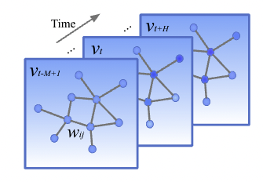
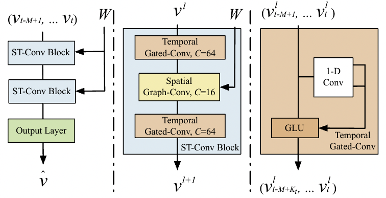
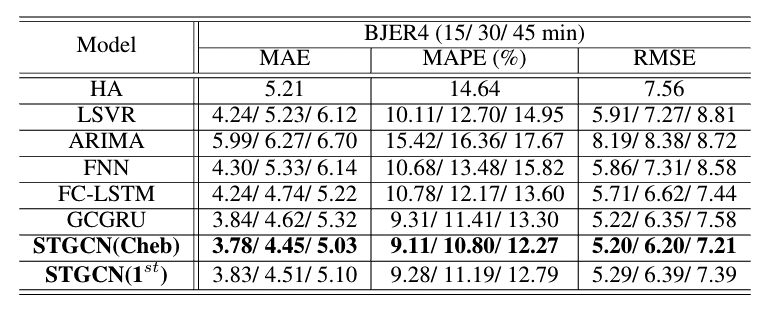
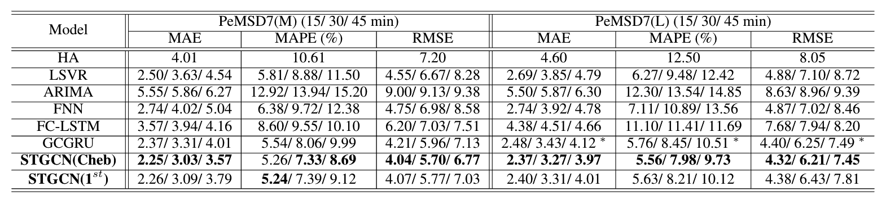

- [x] Round-1: Overview
- [x] Round-2: Model Implementation Details
- [ ] Round-3: Experiments

## Citation


Yu, B., Yin, H., & Zhu, Z. (2018).  
Spatio-temporal graph convolutional networks: A deep learning framework for traffic forecasting.  
IJCAI International Joint Conference on Artificial Intelligence, 2018-July, 3634–3640.  
https://doi.org/10.24963/IJCAI.2018/505


## Abstract

> Timely accurate traffic forecast is crucial for ur-ban traffic control and guidance. Due to the highnonlinearity and complexity of traffic flow, tradi-tional methods cannot satisfy the requirements ofmid-and-long term prediction tasks and often ne-glect spatial and temporal dependencies. In this pa-per, we propose a novel deep learning framework,Spatio-Temporal Graph Convolutional Networks(STGCN), to tackle the time series prediction prob-lem in traffic domain.  Instead of applying regu-lar convolutional and recurrent units, we formulatethe problem on graphs and build the model withcomplete convolutional structures, which enablemuch faster training speed with fewer parameters.Experiments show that our model STGCN effec-tively captures comprehensive spatio-temporal cor-relations through modeling multi-scale traffic net-works and consistently outperforms state-of-the-artbaselines on various real-world traffic datasets.

## Background & Wat's New
- 交通に関する研究では，基礎的な指標としてTraffic Flow (Speed)，交通量，密度などが使用されることが多い
- 交通の予測は短期予測（5〜30 min）と中長期予測（30 min 〜）の2種類に分類される
  - 先行研究の多くは短期予測を扱ったもので，中長期予測においては精度が落ちる
- 先行研究における中長期予測は2種類に分類される
  - Dynamical Modeling
    - 統計と物理的な知見を用いて交通のシミュレーションを行う
  - Data-Driven Methods
    - ARIMAベースのモデル
      - 
M. S. Ahmed, A. R. Cook. (1979)  
**ANALYSIS OF FREEWAY TRAFFIC TIME-SERIES DATA BY USING BOX-JENKINS TECHNIQUES**  
  
[Paper Link](https://www.semanticscholar.org/paper/c6fc010c45d2bd96b82b5696c997d3050d997095)  
Influential Citation Count (59), SS-ID (c6fc010c45d2bd96b82b5696c997d3050d997095)  
**ABSTRACT**  
This paper investigated the application of analysis techniques develoepd by Box and Jenkins to freeway traffic volume and occupancy time series. A total of 166 data sets from three surveillance systems in Los Angeles, Minneapolis, and Detroit were used in the development of a predictor model to provide short-term forecasts of traffic data. All of the data sets were best represented by an autoregressive integrated moving-average (ARIMA) (0,1,3) model. The moving-average parameters of the model, however, vary from location to location and over time. The ARIMA models were found to be more accurate in representing freeway time-series data, in terms of mean absolute error and mean square error, than moving-average, double-exponential smoothing, and Trigg and Leach adaptive models. Suggestions and implications for the operational use of the ARIMA model in making forecasts one time interval in advance are made. /Author/

      - 
Billy M. Williams, L. Hoel. (2003)  
**Modeling and Forecasting Vehicular Traffic Flow as a Seasonal ARIMA Process: Theoretical Basis and Empirical Results**  
Journal of Transportation Engineering  
[Paper Link](https://www.semanticscholar.org/paper/356052cf65e3aba8cc3191d11757fc802cd67eea)  
Influential Citation Count (116), SS-ID (356052cf65e3aba8cc3191d11757fc802cd67eea)  
**ABSTRACT**  
This article presents the theoretical basis for modeling univariate traffic condition data streams as seasonal autoregressive integrated moving average processes. This foundation rests on the Wold decomposition theorem and on the assertion that a one-week lagged first seasonal difference applied to discrete interval traffic condition data will yield a weakly stationary transformation. Moreover, empirical results using actual intelligent transportation system data are presented and found to be consistent with the theoretical hypothesis. Conclusions are given on the implications of these assertions and findings relative to ongoing intelligent transportation systems research, deployment, and operations.

      - データが定常過程の前提を満たしている必要があるという制約がある
      - Spatio-Temporal Correlation（時間・空間における相関関係）を考慮することができない
    - 機械学習
      - KNN
      - SVM
      - **Deep Leraning**
        - DBN (Deep Belief Network)
          - 
Yuhan Jia, Jianping Wu, Yiman Du. (2016)  
**Traffic speed prediction using deep learning method**  
2016 IEEE 19th International Conference on Intelligent Transportation Systems (ITSC)  
[Paper Link](https://www.semanticscholar.org/paper/6b59f34c8b1c6f44996eb305577478dd54f54249)  
Influential Citation Count (3), SS-ID (6b59f34c8b1c6f44996eb305577478dd54f54249)  
**ABSTRACT**  
Successful traffic speed prediction is of great importance for the benefits of both road users and traffic management agencies. To solve the problem, traffic scientists have developed a number of time-series speed prediction approaches, including traditional statistical models and machine learning techniques. However, existing methods are still unsatisfying due to the difficulty to reflect the stochastic traffic flow characteristics. Recently, various deep learning models have been introduced to the prediction field. In this paper, a deep learning method, the Deep Belief Network (DBN) model, is proposed for short-term traffic speed information prediction. The DBN model is trained in a greedy unsupervised method and fine-tuned by labeled data. Based on traffic speed data collected from one arterial in Beijing, China, the model is trained and tested for different prediction time horizons. From experiment analysis, it is concluded that the DBN can outperform Back Propagation Neural Network (BPNN) and Auto-Regressive Integrated Moving Average (ARIMA) for all time horizons. The advantages of DBN indicate that deep learning is promising in traffic research area.

          - 
Wenhao Huang, Guojie Song, Haikun Hong, Kunqing Xie. (2014)  
**Deep Architecture for Traffic Flow Prediction: Deep Belief Networks With Multitask Learning**  
IEEE Transactions on Intelligent Transportation Systems  
[Paper Link](https://www.semanticscholar.org/paper/32f75852c5eb5ec6d254818d054e57a90e76b3ba)  
Influential Citation Count (33), SS-ID (32f75852c5eb5ec6d254818d054e57a90e76b3ba)  
**ABSTRACT**  
Traffic flow prediction is a fundamental problem in transportation modeling and management. Many existing approaches fail to provide favorable results due to being: 1) shallow in architecture; 2) hand engineered in features; and 3) separate in learning. In this paper we propose a deep architecture that consists of two parts, i.e., a deep belief network (DBN) at the bottom and a multitask regression layer at the top. A DBN is employed here for unsupervised feature learning. It can learn effective features for traffic flow prediction in an unsupervised fashion, which has been examined and found to be effective for many areas such as image and audio classification. To the best of our knowledge, this is the first paper that applies the deep learning approach to transportation research. To incorporate multitask learning (MTL) in our deep architecture, a multitask regression layer is used above the DBN for supervised prediction. We further investigate homogeneous MTL and heterogeneous MTL for traffic flow prediction. To take full advantage of weight sharing in our deep architecture, we propose a grouping method based on the weights in the top layer to make MTL more effective. Experiments on transportation data sets show good performance of our deep architecture. Abundant experiments show that our approach achieved close to 5% improvements over the state of the art. It is also presented that MTL can improve the generalization performance of shared tasks. These positive results demonstrate that deep learning and MTL are promising in transportation research.

        - SAE (Stacked Autoencoder)
          - 
Yisheng Lv, Y. Duan, Wenwen Kang, Z. Li, Feiyue Wang. (2015)  
**Traffic Flow Prediction With Big Data: A Deep Learning Approach**  
IEEE Transactions on Intelligent Transportation Systems  
[Paper Link](https://www.semanticscholar.org/paper/94deb62af3054c49e7d80bd7eb3ed5efe990fc0b)  
Influential Citation Count (111), SS-ID (94deb62af3054c49e7d80bd7eb3ed5efe990fc0b)  
**ABSTRACT**  
Accurate and timely traffic flow information is important for the successful deployment of intelligent transportation systems. Over the last few years, traffic data have been exploding, and we have truly entered the era of big data for transportation. Existing traffic flow prediction methods mainly use shallow traffic prediction models and are still unsatisfying for many real-world applications. This situation inspires us to rethink the traffic flow prediction problem based on deep architecture models with big traffic data. In this paper, a novel deep-learning-based traffic flow prediction method is proposed, which considers the spatial and temporal correlations inherently. A stacked autoencoder model is used to learn generic traffic flow features, and it is trained in a greedy layerwise fashion. To the best of our knowledge, this is the first time that a deep architecture model is applied using autoencoders as building blocks to represent traffic flow features for prediction. Moreover, experiments demonstrate that the proposed method for traffic flow prediction has superior performance.

          - 
Quanjun Chen, Xuan Song, Harutoshi Yamada, R. Shibasaki. (2016)  
**Learning Deep Representation from Big and Heterogeneous Data for Traffic Accident Inference**  
AAAI  
[Paper Link](https://www.semanticscholar.org/paper/c9538e13bd2a0e33948feb1fce2c56c0bc0eb5d9)  
Influential Citation Count (15), SS-ID (c9538e13bd2a0e33948feb1fce2c56c0bc0eb5d9)  
**ABSTRACT**  
With the rapid development of urbanization and public transportation system, the number of traffic accidents have significantly increased globally over the past decades and become a big problem for human society. Facing these possible and unexpected traffic accidents, understanding what causes traffic accident and early alarms for some possible ones will play a critical role on planning effective traffic management. However, due to the lack of supported sensing data, research is very limited on the field of updating traffic accident risk in real-time. Therefore, in this paper, we collect big and heterogeneous data (7 months traffic accident data and 1.6 million users' GPS records) to understand how human mobility will affect traffic accident risk. By mining these data, we develop a deep model of Stack denoise Autoencoder to learn hierarchical feature representation of human mobility. And these features are used for efficient prediction of traffic accident risk level. Once the model has been trained, our model can simulate corresponding traffic accident risk map with given real-time input of human mobility. The experimental results demonstrate the efficiency of our model and suggest that traffic accident risk can be significantly more predictable through human mobility.

        - CLTFP (LSTM + 1-D CNN)
          - 
Yuankai Wu, Huachun Tan. (2016)  
**Short-term traffic flow forecasting with spatial-temporal correlation in a hybrid deep learning framework**  
ArXiv  
[Paper Link](https://www.semanticscholar.org/paper/c52b77c18700e9625c885a824a0c8b95c3e9cf21)  
Influential Citation Count (14), SS-ID (c52b77c18700e9625c885a824a0c8b95c3e9cf21)  
**ABSTRACT**  
Deep learning approaches have reached a celebrity status in artificial intelligence field, its success have mostly relied on Convolutional Networks (CNN) and Recurrent Networks. By exploiting fundamental spatial properties of images and videos, the CNN always achieves dominant performance on visual tasks. And the Recurrent Networks (RNN) especially long short-term memory methods (LSTM) can successfully characterize the temporal correlation, thus exhibits superior capability for time series tasks. Traffic flow data have plentiful characteristics on both time and space domain. However, applications of CNN and LSTM approaches on traffic flow are limited. In this paper, we propose a novel deep architecture combined CNN and LSTM to forecast future traffic flow (CLTFP). An 1-dimension CNN is exploited to capture spatial features of traffic flow, and two LSTMs are utilized to mine the short-term variability and periodicities of traffic flow. Given those meaningful features, the feature-level fusion is performed to achieve short-term forecasting. The proposed CLTFP is compared with other popular forecasting methods on an open datasets. Experimental results indicate that the CLTFP has considerable advantages in traffic flow forecasting. in additional, the proposed CLTFP is analyzed from the view of Granger Causality, and several interesting properties of CLTFP are discovered and discussed .

        - Convolutional LSTM
          - 
Xingjian Shi, Zhourong Chen, Hao Wang, D. Yeung, W. Wong, W. Woo. (2015)  
**Convolutional LSTM Network: A Machine Learning Approach for Precipitation Nowcasting**  
NIPS  
[Paper Link](https://www.semanticscholar.org/paper/f9c990b1b5724e50e5632b94fdb7484ece8a6ce7)  
Influential Citation Count (671), SS-ID (f9c990b1b5724e50e5632b94fdb7484ece8a6ce7)  
**ABSTRACT**  
The goal of precipitation nowcasting is to predict the future rainfall intensity in a local region over a relatively short period of time. Very few previous studies have examined this crucial and challenging weather forecasting problem from the machine learning perspective. In this paper, we formulate precipitation nowcasting as a spatiotemporal sequence forecasting problem in which both the input and the prediction target are spatiotemporal sequences. By extending the fully connected LSTM (FC-LSTM) to have convolutional structures in both the input-to-state and state-to-state transitions, we propose the convolutional LSTM (ConvLSTM) and use it to build an end-to-end trainable model for the precipitation nowcasting problem. Experiments show that our ConvLSTM network captures spatiotemporal correlations better and consistently outperforms FC-LSTM and the state-of-the-art operational ROVER algorithm for precipitation nowcasting.

- 時間軸方向にFully CNNを採用
- 時間・空間的な特徴を捉えるために，Spatio-Temporal Graph Convolutional Networkを提案
  - GNN (Defferrard et al., 2016)とConvolutional Sequence Learning Layerを組み合わせたブロックから構成される
    - 
M. Defferrard, X. Bresson, P. Vandergheynst. (2016)  
**Convolutional Neural Networks on Graphs with Fast Localized Spectral Filtering**  
NIPS  
[Paper Link](https://www.semanticscholar.org/paper/c41eb895616e453dcba1a70c9b942c5063cc656c)  
Influential Citation Count (591), SS-ID (c41eb895616e453dcba1a70c9b942c5063cc656c)  
**ABSTRACT**  
In this work, we are interested in generalizing convolutional neural networks (CNNs) from low-dimensional regular grids, where image, video and speech are represented, to high-dimensional irregular domains, such as social networks, brain connectomes or words' embedding, represented by graphs. We present a formulation of CNNs in the context of spectral graph theory, which provides the necessary mathematical background and efficient numerical schemes to design fast localized convolutional filters on graphs. Importantly, the proposed technique offers the same linear computational complexity and constant learning complexity as classical CNNs, while being universal to any graph structure. Experiments on MNIST and 20NEWS demonstrate the ability of this novel deep learning system to learn local, stationary, and compositional features on graphs.


## Dataset

- BJER4
- PeMSD7

## Model Description

### Preliminary
#### Traffic Prediction on Road Graphs
交通予測は一般的には交通関連の指標の時系列データにおける予測の問題となる．  
タイムステップが $H$，$M$ 個の交通指標の観測値が与えられたときの予測問題は以下のように定式化される．

$$
\newcommand{\argmax}{\mathop{\rm arg~max}\limits}
\begin{array}{l}
  \begin{array}{l}
    \hat{v}\_{t+1}, \ldots, \hat{v}\_{t+H} = \argmax\_{v\_{t+1},\ldots,v\_{t+H}} \log P(v\_{t+1}, \ldots, v\_{t+H} | v\_{t-M+1}, \ldots, v\_t)
  \end{array} \\\\ \\\\
  \text{where} \hspace{10pt} \left\lbrace\begin{array}{l}
    v\_t \in \mathbb{R}^n \mapsto \text{an observation vector of }n\text{ road segments at time step }t
  \end{array} \right .
\end{array}
$$

本研究においては，$v\_t$ はGraph Signalと見做される．

$$
\begin{array}{l}
  \begin{array}{l}
    \mathcal{G}\_t = \left( \mathcal{V}\_t, \mathcal{E}, W \right)
  \end{array} \\\\ \\\\
  \text{where} \hspace{10pt} \left\lbrace\begin{array}{l}
    W = \lbrace w\_{ij} | w\_{ij} \in \mathbb{R} \rbrace \in \mathbb{R}^{n \times n} \\\\
    i, j = \lbrace 1, \ldots, n \rbrace 
  \end{array} \right .
\end{array}
$$

<figure>
  
  <figcaption>graph-structured traffic data</figcaption>
</figure>

#### Convolutions on Graphs
GCNの実装としては，

**CNNにおいて空有間方向に次元を拡張したもの**  

Mathias Niepert, Mohamed Ahmed, Konstantin Kutzkov. (2016)  
**Learning Convolutional Neural Networks for Graphs**  
ICML  
[Paper Link](https://www.semanticscholar.org/paper/7c6de5a9e02a779e24504619050c6118f4eac181)  
Influential Citation Count (144), SS-ID (7c6de5a9e02a779e24504619050c6118f4eac181)  
**ABSTRACT**  
Numerous important problems can be framed as learning from graph data. We propose a framework for learning convolutional neural networks for arbitrary graphs. These graphs may be undirected, directed, and with both discrete and continuous node and edge attributes. Analogous to image-based convolutional networks that operate on locally connected regions of the input, we present a general approach to extracting locally connected regions from graphs. Using established benchmark data sets, we demonstrate that the learned feature representations are competitive with state of the art graph kernels and that their computation is highly efficient.


**グラフフーリエ変換を利用したもの** （Spectral Graph Convolution とも）  

Joan Bruna, Wojciech Zaremba, Arthur D. Szlam, Yann LeCun. (2013)  
**Spectral Networks and Locally Connected Networks on Graphs**  
ICLR  
[Paper Link](https://www.semanticscholar.org/paper/5e925a9f1e20df61d1e860a7aa71894b35a1c186)  
Influential Citation Count (281), SS-ID (5e925a9f1e20df61d1e860a7aa71894b35a1c186)  
**ABSTRACT**  
Convolutional Neural Networks are extremely efficient architectures in image and audio recognition tasks, thanks to their ability to exploit the local translational invariance of signal classes over their domain. In this paper we consider possible generalizations of CNNs to signals defined on more general domains without the action of a translation group. In particular, we propose two constructions, one based upon a hierarchical clustering of the domain, and another based on the spectrum of the graph Laplacian. We show through experiments that for low-dimensional graphs it is possible to learn convolutional layers with a number of parameters independent of the input size, resulting in efficient deep architectures.


の2通りがある．

 

後の研究によって計算量が $\mathcal{O}^2$ から $\mathcal{O}$ に削減された．  

M. Defferrard, X. Bresson, P. Vandergheynst. (2016)  
**Convolutional Neural Networks on Graphs with Fast Localized Spectral Filtering**  
NIPS  
[Paper Link](https://www.semanticscholar.org/paper/c41eb895616e453dcba1a70c9b942c5063cc656c)  
Influential Citation Count (591), SS-ID (c41eb895616e453dcba1a70c9b942c5063cc656c)  
**ABSTRACT**  
In this work, we are interested in generalizing convolutional neural networks (CNNs) from low-dimensional regular grids, where image, video and speech are represented, to high-dimensional irregular domains, such as social networks, brain connectomes or words' embedding, represented by graphs. We present a formulation of CNNs in the context of spectral graph theory, which provides the necessary mathematical background and efficient numerical schemes to design fast localized convolutional filters on graphs. Importantly, the proposed technique offers the same linear computational complexity and constant learning complexity as classical CNNs, while being universal to any graph structure. Experiments on MNIST and 20NEWS demonstrate the ability of this novel deep learning system to learn local, stationary, and compositional features on graphs.


Thomas Kipf, M. Welling. (2016)  
**Semi-Supervised Classification with Graph Convolutional Networks**  
ICLR  
[Paper Link](https://www.semanticscholar.org/paper/36eff562f65125511b5dfab68ce7f7a943c27478)  
Influential Citation Count (3650), SS-ID (36eff562f65125511b5dfab68ce7f7a943c27478)  
**ABSTRACT**  
We present a scalable approach for semi-supervised learning on graph-structured data that is based on an efficient variant of convolutional neural networks which operate directly on graphs. We motivate the choice of our convolutional architecture via a localized first-order approximation of spectral graph convolutions. Our model scales linearly in the number of graph edges and learns hidden layer representations that encode both local graph structure and features of nodes. In a number of experiments on citation networks and on a knowledge graph dataset we demonstrate that our approach outperforms related methods by a significant margin.


 

本研究では，Spectral Graph Convolution による GCN を採用する．  
具体的には GCN の演算 $*\mathcal{G} $ を以下のように定義する．

$$
\begin{array}{l}
  \begin{array}{l}
    \Theta *\mathcal{G} x &= \Theta (L) x \\\\
    &= \Theta (U \Lambda U^\mathsf{T})x \\\\
    &= U \Theta (\Lambda) U^\mathsf{T} x
  \end{array} \\\\ \\\\
  \text{where} \hspace{10pt} \left \lbrace \begin{array}{l}
    \Theta \mapsto \text{kernel filter} \\\\
    U \in \mathbb{R}^{n \times n} \mapsto \text{graph Fourier basis} \\\\
    L = I\_n - D^{-\frac{1}{2}}WD^{-\frac{1}{2}} = U \Lambda U^\mathsf{T} \in \mathbb{R}^{n \times n} \\\\
    I\_n \mapsto \text{Identity Matrix} \\\\
    D\_{ii} = \sum\_j W\_{ij} \\\\
    \Lambda \in \mathbb{R}^{n \times n} \mapsto \text{diagonal matrix of eigenvalues of }L
  \end{array} \right .
\end{array}
$$

### Proposed Model: STGCN

<figure>
  
  <figcaption>Model Architecture</figcaption>
</figure>

#### Input $\to$ Output
$$
\begin{array}{l}
  \text{Input} &: \left( \mathcal{V}\_{t-M+1}, \ldots,  \mathcal{V}\_t \right) \\\\
  \text{Output} &: \hat{\mathcal{V}} = \text{STGCN}\left( \mathcal{V}\_{t-M+1}, \ldots,  \mathcal{V}\_t \right)
\end{array}
$$

#### Two Approximation of GCN

##### Chebyshev Polynomials Approximation

GCNにおけるカーネルは以下のように計算される

$$
\begin{array}{l}
  \begin{array}{l}
    \Theta(\Lambda) = {\displaystyle \sum\_{k=0}^{K-1} \theta\_k\Lambda^k }
  \end{array} \\\\ \\\\
  \text{where} \hspace{5pt} \left \lbrace \begin{array}{l}
    K \mapsto \text{kernal size of graph convolution} \\\\
    \theta \in \mathbb{R}^k \mapsto \text{polynomial coefficients}
  \end{array} \right .
\end{array}
$$

カーネル $\Theta$ を直接計算するとコストが高いので，チェビシェフの多項式近似を用いる

$$
\begin{array}{l}
  \begin{array}{l}
    \Theta *\mathcal{G}x = \Theta(\Lambda)x \approx {\displaystyle \sum\_{k=0}^{K-1} \theta\_k T\_k (\tilde{L})x }
  \end{array} \\\\ \\\\
  \text{where} \hspace{5pt} \left \lbrace \begin{array}{l}
    T\_k(\tilde{L}) \in \mathbb{R}^{n \times n} \mapsto \text{Chebyshev polynomial of order }k \\\\
    \tilde{L} = {\displaystyle \frac{2L}{\lambda\_{\max}} - I\_n } \\\\
    \lambda\_{\max} \mapsto \text{the largest eigenvalue of }L
  \end{array} \right .
\end{array}
$$

##### $1^\text{st}$ -order Approximation

$$
\begin{array}{l}
  \begin{array}{l}
    \Theta *\mathcal{G}x &\approx {\displaystyle \theta\_0 x + \theta\_1 \left( \frac{2}{\lambda\_\max} L - I\_n \right)x } \\\\
    &\approx {\displaystyle \theta\_0 x - \theta\_1 \left( D^{-\frac{1}{2}}WD^{-\frac{1}{2}} \right) x }
  \end{array} \\\\ \\\\
  \text{where} \hspace{5pt} \left \lbrace \begin{array}{l}
    \theta\_0, \theta\_1 \mapsto \text{two shared parameters of the kernel} \\\\
    \lambda\_\max \approx 2
  \end{array} \right .
\end{array}
$$

$\theta = \theta\_0 = -\theta\_1$ として，さらに式を簡略化して

$$
\begin{array}{l}
  \begin{array}{l}
    \Theta *\mathcal{G}x &\approx {\displaystyle \theta \left( \tilde{D}^{-\frac{1}{2}}\tilde{W}\tilde{D}^{-\frac{1}{2}} \right) x }
  \end{array} \\\\ \\\\
  \text{where} \hspace{5pt} \left \lbrace \begin{array}{l}
    \tilde{W} = W + I\_n \\\\
    \tilde{D}\_{ii} = \sum\_j \tilde{W}\_{ij}
  \end{array} \right .
\end{array}
$$

##### Generalization of Graph Convolution

上記の定式化は2次元に拡張することができ，入力と出力のチャンネル数をそれぞれ $C\_i, C\_o$ としたとき，

$$
\begin{array}{l}
  \begin{array}{l}
    y\_j = {\displaystyle \sum\_{i=1}^{C\_i} \Theta\_{i,j} (L)x\_i \in \mathbb{R}^n }
  \end{array} \\\\ \\\\
  \text{where} \hspace{5pt} \left \lbrace \begin{array}{l}
    \Theta \in \mathbb{R}^{K \times C\_i \times C\_o} \\\\
    1 \leqq j \leqq C\_o
  \end{array} \right .
\end{array}
$$

とすることができ，グラフ $\mathcal{V}\_i$ において，ノード $i$ が $C\_i$-dimentional な特徴量をもつとして，これを $X \in \mathbb{R}^{n \times C\_i}$ とすると，GCNは

$$
\Theta *\mathcal{G} X
$$

と表すことができる  
さらに，時間軸を考慮して，各 $t ~(t=\lbrace 1, \ldots, M \rbrace)$ におけるGCNを考えると

$$
\begin{array}{l}
  \begin{array}{l}
    {\displaystyle \Theta *\mathcal{G} \mathcal{X} }
  \end{array} \\\\ \\\\
  \text{where} \hspace{5pt} \left \lbrace \begin{array}{l}
    \mathcal{X} \in \mathbb{R}^{M \times n \times C\_i}
  \end{array} \right .
\end{array}
$$

となる

#### Gated CNNs for Extracting Temporal Features

Gehring et al. (2017)にしたがって，CNNを用いて時間軸の特徴を捉えることを考える

Temporal Convolutionの入力は，あるノードに関して時間軸とチャンネル数を考えて $Y \in \mathbb{R}^{M \times C\_i}$ となる

Temporal Gated Convolution は以下のように定義される

$$
\begin{array}{l}
  \begin{array}{l}
    \Gamma *\\mathcal{T} ~ Y = P \odot \sigma(Q) \in \mathbb{R}^{(M-K\_t+1) \times C\_o}
  \end{array} \\\\ \\\\
  \text{where} \hspace{5pt} \left \lbrace \begin{array}{l}
    \Gamma \in \mathbb{R}^{K\_t \times C\_i \times 2C\_o} \\\\
    [PQ] \in \mathbb{R}^{(M-K\_t+1) \times 2C\_o} \mapsto \text{inputs of gates in GLU} \\\\
    \odot \mapsto \text{element-wise Hadamard product} \\\\
    \sigma \mapsto \text{sigmoid gate}
  \end{array} \right .
\end{array}
$$

#### Spatio-temporal Convolutional Block

時間軸と空間軸の特徴を同時に捉えるため，ST-Conv Blockを定義する

$$
\begin{array}{l}
  \begin{array}{l}
    v^{l+1} = \Gamma^l\_1 *\mathcal{T} ~ \text{ReLU}\left( \Theta^l *\mathcal{G} \left( \Gamma^l\_0 *\mathcal{T} ~ v^l \right) \right)
  \end{array} \\\\ \\\\
  \text{where} \hspace{5pt} \left \lbrace \begin{array}{l}
    v^l \in \mathbb{R}^{M \times n \times C^l} \hspace{10pt} (\text{for block }l) \\\\
    v^{l+1} \in \mathbb{R}^{(M-2(K\_t-1)) \times n \times C^{l+1}} \\\\
    \Gamma^l\_0, \Gamma^l\_1 \mapsto \text{the upper and lower temporal kernel within block }l \\\\
    \Theta^l \mapsto \text{the spectral kernel of graph convolution}
  \end{array} \right .
\end{array}
$$

## Results

<figure>
  
  <figcaption>Results on the dataset BJER4</figcaption>
</figure>

<figure>
  
  <figcaption>Results on the dataset PeMSD7</figcaption>
</figure>

## References


Yaguang Li, Rose Yu, C. Shahabi, Yan Liu. (2017)  
**Diffusion Convolutional Recurrent Neural Network: Data-Driven Traffic Forecasting**  
ICLR  
[Paper Link](https://www.semanticscholar.org/paper/9ba0186ed40656329c421f55ada7313293e13f17)  
Influential Citation Count (265), SS-ID (9ba0186ed40656329c421f55ada7313293e13f17)  
**ABSTRACT**  
Spatiotemporal forecasting has various applications in neuroscience, climate and transportation domain. Traffic forecasting is one canonical example of such learning task. The task is challenging due to (1) complex spatial dependency on road networks, (2) non-linear temporal dynamics with changing road conditions and (3) inherent difficulty of long-term forecasting. To address these challenges, we propose to model the traffic flow as a diffusion process on a directed graph and introduce Diffusion Convolutional Recurrent Neural Network (DCRNN), a deep learning framework for traffic forecasting that incorporates both spatial and temporal dependency in the traffic flow. Specifically, DCRNN captures the spatial dependency using bidirectional random walks on the graph, and the temporal dependency using the encoder-decoder architecture with scheduled sampling. We evaluate the framework on two real-world large scale road network traffic datasets and observe consistent improvement of 12% - 15% over state-of-the-art baselines.


Youngjoo Seo, M. Defferrard, P. Vandergheynst, X. Bresson. (2016)  
**Structured Sequence Modeling with Graph Convolutional Recurrent Networks**  
ICONIP  
[Paper Link](https://www.semanticscholar.org/paper/6b1793ece5993523855ce67c646de408318d1b12)  
Influential Citation Count (54), SS-ID (6b1793ece5993523855ce67c646de408318d1b12)  


Yaguang Li, Rose Yu, C. Shahabi, Yan Liu. (2017)  
**Graph Convolutional Recurrent Neural Network: Data-Driven Traffic Forecasting**  
ArXiv  
[Paper Link](https://www.semanticscholar.org/paper/5618bb2aff7ecdb0a2ae7c57838d156f731008ff)  
Influential Citation Count (11), SS-ID (5618bb2aff7ecdb0a2ae7c57838d156f731008ff)  
**ABSTRACT**  
Spatiotemporal forecasting has significant implications in sustainability, transportation and health-care domain. Traffic forecasting is one canonical example of such learning task. This task is challenging due to (1) non-linear temporal dynamics with changing road conditions, (2) complex spatial dependencies on road networks topology and (3) inherent difficulty of long-term time series forecasting. To address these challenges, we propose Graph Convolutional Recurrent Neural Network to incorporate both spatial and temporal dependency in traffic flow. We further integrate the encoder-decoder framework and scheduled sampling to improve long-term forecasting. When evaluated on real-world road network traffic data, our approach can accurately capture spatiotemporal correlations and consistently outperforms state-of-the-art baselines by 12% 15%.


Jonas Gehring, Michael Auli, David Grangier, Denis Yarats, Yann Dauphin. (2017)  
**Convolutional Sequence to Sequence Learning**  
ICML  
[Paper Link](https://www.semanticscholar.org/paper/43428880d75b3a14257c3ee9bda054e61eb869c0)  
Influential Citation Count (313), SS-ID (43428880d75b3a14257c3ee9bda054e61eb869c0)  
**ABSTRACT**  
The prevalent approach to sequence to sequence learning maps an input sequence to a variable length output sequence via recurrent neural networks. We introduce an architecture based entirely on convolutional neural networks. Compared to recurrent models, computations over all elements can be fully parallelized during training and optimization is easier since the number of non-linearities is fixed and independent of the input length. Our use of gated linear units eases gradient propagation and we equip each decoder layer with a separate attention module. We outperform the accuracy of the deep LSTM setup of Wu et al. (2016) on both WMT'14 English-German and WMT'14 English-French translation at an order of magnitude faster speed, both on GPU and CPU.


Thomas Kipf, M. Welling. (2016)  
**Semi-Supervised Classification with Graph Convolutional Networks**  
ICLR  
[Paper Link](https://www.semanticscholar.org/paper/36eff562f65125511b5dfab68ce7f7a943c27478)  
Influential Citation Count (3650), SS-ID (36eff562f65125511b5dfab68ce7f7a943c27478)  
**ABSTRACT**  
We present a scalable approach for semi-supervised learning on graph-structured data that is based on an efficient variant of convolutional neural networks which operate directly on graphs. We motivate the choice of our convolutional architecture via a localized first-order approximation of spectral graph convolutions. Our model scales linearly in the number of graph edges and learns hidden layer representations that encode both local graph structure and features of nodes. In a number of experiments on citation networks and on a knowledge graph dataset we demonstrate that our approach outperforms related methods by a significant margin.


Yuankai Wu, Huachun Tan. (2016)  
**Short-term traffic flow forecasting with spatial-temporal correlation in a hybrid deep learning framework**  
ArXiv  
[Paper Link](https://www.semanticscholar.org/paper/c52b77c18700e9625c885a824a0c8b95c3e9cf21)  
Influential Citation Count (14), SS-ID (c52b77c18700e9625c885a824a0c8b95c3e9cf21)  
**ABSTRACT**  
Deep learning approaches have reached a celebrity status in artificial intelligence field, its success have mostly relied on Convolutional Networks (CNN) and Recurrent Networks. By exploiting fundamental spatial properties of images and videos, the CNN always achieves dominant performance on visual tasks. And the Recurrent Networks (RNN) especially long short-term memory methods (LSTM) can successfully characterize the temporal correlation, thus exhibits superior capability for time series tasks. Traffic flow data have plentiful characteristics on both time and space domain. However, applications of CNN and LSTM approaches on traffic flow are limited. In this paper, we propose a novel deep architecture combined CNN and LSTM to forecast future traffic flow (CLTFP). An 1-dimension CNN is exploited to capture spatial features of traffic flow, and two LSTMs are utilized to mine the short-term variability and periodicities of traffic flow. Given those meaningful features, the feature-level fusion is performed to achieve short-term forecasting. The proposed CLTFP is compared with other popular forecasting methods on an open datasets. Experimental results indicate that the CLTFP has considerable advantages in traffic flow forecasting. in additional, the proposed CLTFP is analyzed from the view of Granger Causality, and several interesting properties of CLTFP are discovered and discussed .


Yuhan Jia, Jianping Wu, Yiman Du. (2016)  
**Traffic speed prediction using deep learning method**  
2016 IEEE 19th International Conference on Intelligent Transportation Systems (ITSC)  
[Paper Link](https://www.semanticscholar.org/paper/6b59f34c8b1c6f44996eb305577478dd54f54249)  
Influential Citation Count (3), SS-ID (6b59f34c8b1c6f44996eb305577478dd54f54249)  
**ABSTRACT**  
Successful traffic speed prediction is of great importance for the benefits of both road users and traffic management agencies. To solve the problem, traffic scientists have developed a number of time-series speed prediction approaches, including traditional statistical models and machine learning techniques. However, existing methods are still unsatisfying due to the difficulty to reflect the stochastic traffic flow characteristics. Recently, various deep learning models have been introduced to the prediction field. In this paper, a deep learning method, the Deep Belief Network (DBN) model, is proposed for short-term traffic speed information prediction. The DBN model is trained in a greedy unsupervised method and fine-tuned by labeled data. Based on traffic speed data collected from one arterial in Beijing, China, the model is trained and tested for different prediction time horizons. From experiment analysis, it is concluded that the DBN can outperform Back Propagation Neural Network (BPNN) and Auto-Regressive Integrated Moving Average (ARIMA) for all time horizons. The advantages of DBN indicate that deep learning is promising in traffic research area.


M. Defferrard, X. Bresson, P. Vandergheynst. (2016)  
**Convolutional Neural Networks on Graphs with Fast Localized Spectral Filtering**  
NIPS  
[Paper Link](https://www.semanticscholar.org/paper/c41eb895616e453dcba1a70c9b942c5063cc656c)  
Influential Citation Count (591), SS-ID (c41eb895616e453dcba1a70c9b942c5063cc656c)  
**ABSTRACT**  
In this work, we are interested in generalizing convolutional neural networks (CNNs) from low-dimensional regular grids, where image, video and speech are represented, to high-dimensional irregular domains, such as social networks, brain connectomes or words' embedding, represented by graphs. We present a formulation of CNNs in the context of spectral graph theory, which provides the necessary mathematical background and efficient numerical schemes to design fast localized convolutional filters on graphs. Importantly, the proposed technique offers the same linear computational complexity and constant learning complexity as classical CNNs, while being universal to any graph structure. Experiments on MNIST and 20NEWS demonstrate the ability of this novel deep learning system to learn local, stationary, and compositional features on graphs.


Mathias Niepert, Mohamed Ahmed, Konstantin Kutzkov. (2016)  
**Learning Convolutional Neural Networks for Graphs**  
ICML  
[Paper Link](https://www.semanticscholar.org/paper/7c6de5a9e02a779e24504619050c6118f4eac181)  
Influential Citation Count (144), SS-ID (7c6de5a9e02a779e24504619050c6118f4eac181)  
**ABSTRACT**  
Numerous important problems can be framed as learning from graph data. We propose a framework for learning convolutional neural networks for arbitrary graphs. These graphs may be undirected, directed, and with both discrete and continuous node and edge attributes. Analogous to image-based convolutional networks that operate on locally connected regions of the input, we present a general approach to extracting locally connected regions from graphs. Using established benchmark data sets, we demonstrate that the learned feature representations are competitive with state of the art graph kernels and that their computation is highly efficient.


Quanjun Chen, Xuan Song, Harutoshi Yamada, R. Shibasaki. (2016)  
**Learning Deep Representation from Big and Heterogeneous Data for Traffic Accident Inference**  
AAAI  
[Paper Link](https://www.semanticscholar.org/paper/c9538e13bd2a0e33948feb1fce2c56c0bc0eb5d9)  
Influential Citation Count (15), SS-ID (c9538e13bd2a0e33948feb1fce2c56c0bc0eb5d9)  
**ABSTRACT**  
With the rapid development of urbanization and public transportation system, the number of traffic accidents have significantly increased globally over the past decades and become a big problem for human society. Facing these possible and unexpected traffic accidents, understanding what causes traffic accident and early alarms for some possible ones will play a critical role on planning effective traffic management. However, due to the lack of supported sensing data, research is very limited on the field of updating traffic accident risk in real-time. Therefore, in this paper, we collect big and heterogeneous data (7 months traffic accident data and 1.6 million users' GPS records) to understand how human mobility will affect traffic accident risk. By mining these data, we develop a deep model of Stack denoise Autoencoder to learn hierarchical feature representation of human mobility. And these features are used for efficient prediction of traffic accident risk level. Once the model has been trained, our model can simulate corresponding traffic accident risk map with given real-time input of human mobility. The experimental results demonstrate the efficiency of our model and suggest that traffic accident risk can be significantly more predictable through human mobility.


Yexin Li, Yu Zheng, Huichu Zhang, Lei Chen. (2015)  
**Traffic prediction in a bike-sharing system**  
SIGSPATIAL/GIS  
[Paper Link](https://www.semanticscholar.org/paper/40e0588779c473cf56a09d2b5bb0af00a8cdb8f0)  
Influential Citation Count (14), SS-ID (40e0588779c473cf56a09d2b5bb0af00a8cdb8f0)  
**ABSTRACT**  
Bike-sharing systems are widely deployed in many major cities, providing a convenient transportation mode for citizens' commutes. As the rents/returns of bikes at different stations in different periods are unbalanced, the bikes in a system need to be rebalanced frequently. Real-time monitoring cannot tackle this problem well as it takes too much time to reallocate the bikes after an imbalance has occurred. In this paper, we propose a hierarchical prediction model to predict the number of bikes that will be rent from/returned to each station cluster in a future period so that reallocation can be executed in advance. We first propose a bipartite clustering algorithm to cluster bike stations into groups, formulating a two-level hierarchy of stations. The total number of bikes that will be rent in a city is predicted by a Gradient Boosting Regression Tree (GBRT). Then a multi-similarity-based inference model is proposed to predict the rent proportion across clusters and the inter-cluster transition, based on which the number of bikes rent from/ returned to each cluster can be easily inferred. We evaluate our model on two bike-sharing systems in New York City (NYC) and Washington D.C. (D.C.) respectively, confirming our model's advantage beyond baseline approaches (0.03 reduction of error rate), especially for anomalous periods (0.18/0.23 reduction of error rate).


Mikael Henaff, Joan Bruna, Yann LeCun. (2015)  
**Deep Convolutional Networks on Graph-Structured Data**  
ArXiv  
[Paper Link](https://www.semanticscholar.org/paper/e49ff72d420c8d72e62a9353e3abc053445e59bd)  
Influential Citation Count (58), SS-ID (e49ff72d420c8d72e62a9353e3abc053445e59bd)  
**ABSTRACT**  
Deep Learning's recent successes have mostly relied on Convolutional Networks, which exploit fundamental statistical properties of images, sounds and video data: the local stationarity and multi-scale compositional structure, that allows expressing long range interactions in terms of shorter, localized interactions. However, there exist other important examples, such as text documents or bioinformatic data, that may lack some or all of these strong statistical regularities.  In this paper we consider the general question of how to construct deep architectures with small learning complexity on general non-Euclidean domains, which are typically unknown and need to be estimated from the data. In particular, we develop an extension of Spectral Networks which incorporates a Graph Estimation procedure, that we test on large-scale classification problems, matching or improving over Dropout Networks with far less parameters to estimate.


Xingjian Shi, Zhourong Chen, Hao Wang, D. Yeung, W. Wong, W. Woo. (2015)  
**Convolutional LSTM Network: A Machine Learning Approach for Precipitation Nowcasting**  
NIPS  
[Paper Link](https://www.semanticscholar.org/paper/f9c990b1b5724e50e5632b94fdb7484ece8a6ce7)  
Influential Citation Count (671), SS-ID (f9c990b1b5724e50e5632b94fdb7484ece8a6ce7)  
**ABSTRACT**  
The goal of precipitation nowcasting is to predict the future rainfall intensity in a local region over a relatively short period of time. Very few previous studies have examined this crucial and challenging weather forecasting problem from the machine learning perspective. In this paper, we formulate precipitation nowcasting as a spatiotemporal sequence forecasting problem in which both the input and the prediction target are spatiotemporal sequences. By extending the fully connected LSTM (FC-LSTM) to have convolutional structures in both the input-to-state and state-to-state transitions, we propose the convolutional LSTM (ConvLSTM) and use it to build an end-to-end trainable model for the precipitation nowcasting problem. Experiments show that our ConvLSTM network captures spatiotemporal correlations better and consistently outperforms FC-LSTM and the state-of-the-art operational ROVER algorithm for precipitation nowcasting.


R. Srivastava, Klaus Greff, J. Schmidhuber. (2015)  
**Highway Networks**  
ArXiv  
[Paper Link](https://www.semanticscholar.org/paper/e0945081b5b87187a53d4329cf77cd8bff635795)  
Influential Citation Count (85), SS-ID (e0945081b5b87187a53d4329cf77cd8bff635795)  
**ABSTRACT**  
There is plenty of theoretical and empirical evidence that depth of neural networks is a crucial ingredient for their success. However, network training becomes more difficult with increasing depth and training of very deep networks remains an open problem. In this extended abstract, we introduce a new architecture designed to ease gradient-based training of very deep networks. We refer to networks with this architecture as highway networks, since they allow unimpeded information flow across several layers on information highways. The architecture is characterized by the use of gating units which learn to regulate the flow of information through a network. Highway networks with hundreds of layers can be trained directly using stochastic gradient descent and with a variety of activation functions, opening up the possibility of studying extremely deep and efficient architectures.


Yisheng Lv, Y. Duan, Wenwen Kang, Z. Li, Feiyue Wang. (2015)  
**Traffic Flow Prediction With Big Data: A Deep Learning Approach**  
IEEE Transactions on Intelligent Transportation Systems  
[Paper Link](https://www.semanticscholar.org/paper/94deb62af3054c49e7d80bd7eb3ed5efe990fc0b)  
Influential Citation Count (111), SS-ID (94deb62af3054c49e7d80bd7eb3ed5efe990fc0b)  
**ABSTRACT**  
Accurate and timely traffic flow information is important for the successful deployment of intelligent transportation systems. Over the last few years, traffic data have been exploding, and we have truly entered the era of big data for transportation. Existing traffic flow prediction methods mainly use shallow traffic prediction models and are still unsatisfying for many real-world applications. This situation inspires us to rethink the traffic flow prediction problem based on deep architecture models with big traffic data. In this paper, a novel deep-learning-based traffic flow prediction method is proposed, which considers the spatial and temporal correlations inherently. A stacked autoencoder model is used to learn generic traffic flow features, and it is trained in a greedy layerwise fashion. To the best of our knowledge, this is the first time that a deep architecture model is applied using autoencoders as building blocks to represent traffic flow features for prediction. Moreover, experiments demonstrate that the proposed method for traffic flow prediction has superior performance.


Diederik P. Kingma, Jimmy Ba. (2014)  
**Adam: A Method for Stochastic Optimization**  
ICLR  
[Paper Link](https://www.semanticscholar.org/paper/a6cb366736791bcccc5c8639de5a8f9636bf87e8)  
Influential Citation Count (16255), SS-ID (a6cb366736791bcccc5c8639de5a8f9636bf87e8)  
**ABSTRACT**  
We introduce Adam, an algorithm for first-order gradient-based optimization of stochastic objective functions, based on adaptive estimates of lower-order moments. The method is straightforward to implement, is computationally efficient, has little memory requirements, is invariant to diagonal rescaling of the gradients, and is well suited for problems that are large in terms of data and/or parameters. The method is also appropriate for non-stationary objectives and problems with very noisy and/or sparse gradients. The hyper-parameters have intuitive interpretations and typically require little tuning. Some connections to related algorithms, on which Adam was inspired, are discussed. We also analyze the theoretical convergence properties of the algorithm and provide a regret bound on the convergence rate that is comparable to the best known results under the online convex optimization framework. Empirical results demonstrate that Adam works well in practice and compares favorably to other stochastic optimization methods. Finally, we discuss AdaMax, a variant of Adam based on the infinity norm.


E. Vlahogianni. (2015)  
**Computational Intelligence and Optimization for Transportation Big Data: Challenges and Opportunities**  
  
[Paper Link](https://www.semanticscholar.org/paper/b7fc1cf4ee9125210ae58aab6ea1596c71ea2fb9)  
Influential Citation Count (2), SS-ID (b7fc1cf4ee9125210ae58aab6ea1596c71ea2fb9)  


Ilya Sutskever, Oriol Vinyals, Quoc V. Le. (2014)  
**Sequence to Sequence Learning with Neural Networks**  
NIPS  
[Paper Link](https://www.semanticscholar.org/paper/cea967b59209c6be22829699f05b8b1ac4dc092d)  
Influential Citation Count (1368), SS-ID (cea967b59209c6be22829699f05b8b1ac4dc092d)  
**ABSTRACT**  
Deep Neural Networks (DNNs) are powerful models that have achieved excellent performance on difficult learning tasks. Although DNNs work well whenever large labeled training sets are available, they cannot be used to map sequences to sequences. In this paper, we present a general end-to-end approach to sequence learning that makes minimal assumptions on the sequence structure. Our method uses a multilayered Long Short-Term Memory (LSTM) to map the input sequence to a vector of a fixed dimensionality, and then another deep LSTM to decode the target sequence from the vector. Our main result is that on an English to French translation task from the WMT-14 dataset, the translations produced by the LSTM achieve a BLEU score of 34.8 on the entire test set, where the LSTM's BLEU score was penalized on out-of-vocabulary words. Additionally, the LSTM did not have difficulty on long sentences. For comparison, a phrase-based SMT system achieves a BLEU score of 33.3 on the same dataset. When we used the LSTM to rerank the 1000 hypotheses produced by the aforementioned SMT system, its BLEU score increases to 36.5, which is close to the previous state of the art. The LSTM also learned sensible phrase and sentence representations that are sensitive to word order and are relatively invariant to the active and the passive voice. Finally, we found that reversing the order of the words in all source sentences (but not target sentences) improved the LSTM's performance markedly, because doing so introduced many short term dependencies between the source and the target sentence which made the optimization problem easier.


Wenhao Huang, Guojie Song, Haikun Hong, Kunqing Xie. (2014)  
**Deep Architecture for Traffic Flow Prediction: Deep Belief Networks With Multitask Learning**  
IEEE Transactions on Intelligent Transportation Systems  
[Paper Link](https://www.semanticscholar.org/paper/32f75852c5eb5ec6d254818d054e57a90e76b3ba)  
Influential Citation Count (33), SS-ID (32f75852c5eb5ec6d254818d054e57a90e76b3ba)  
**ABSTRACT**  
Traffic flow prediction is a fundamental problem in transportation modeling and management. Many existing approaches fail to provide favorable results due to being: 1) shallow in architecture; 2) hand engineered in features; and 3) separate in learning. In this paper we propose a deep architecture that consists of two parts, i.e., a deep belief network (DBN) at the bottom and a multitask regression layer at the top. A DBN is employed here for unsupervised feature learning. It can learn effective features for traffic flow prediction in an unsupervised fashion, which has been examined and found to be effective for many areas such as image and audio classification. To the best of our knowledge, this is the first paper that applies the deep learning approach to transportation research. To incorporate multitask learning (MTL) in our deep architecture, a multitask regression layer is used above the DBN for supervised prediction. We further investigate homogeneous MTL and heterogeneous MTL for traffic flow prediction. To take full advantage of weight sharing in our deep architecture, we propose a grouping method based on the weights in the top layer to make MTL more effective. Experiments on transportation data sets show good performance of our deep architecture. Abundant experiments show that our approach achieved close to 5% improvements over the state of the art. It is also presented that MTL can improve the generalization performance of shared tasks. These positive results demonstrate that deep learning and MTL are promising in transportation research.


Joan Bruna, Wojciech Zaremba, Arthur D. Szlam, Yann LeCun. (2013)  
**Spectral Networks and Locally Connected Networks on Graphs**  
ICLR  
[Paper Link](https://www.semanticscholar.org/paper/5e925a9f1e20df61d1e860a7aa71894b35a1c186)  
Influential Citation Count (281), SS-ID (5e925a9f1e20df61d1e860a7aa71894b35a1c186)  
**ABSTRACT**  
Convolutional Neural Networks are extremely efficient architectures in image and audio recognition tasks, thanks to their ability to exploit the local translational invariance of signal classes over their domain. In this paper we consider possible generalizations of CNNs to signals defined on more general domains without the action of a translation group. In particular, we propose two constructions, one based upon a hierarchical clustering of the domain, and another based on the spectrum of the graph Laplacian. We show through experiments that for low-dimensional graphs it is possible to learn convolutional layers with a number of parameters independent of the input size, resulting in efficient deep architectures.


Marco Lippi, Matteo Bertini, P. Frasconi. (2013)  
**Short-Term Traffic Flow Forecasting: An Experimental Comparison of Time-Series Analysis and Supervised Learning**  
IEEE Transactions on Intelligent Transportation Systems  
[Paper Link](https://www.semanticscholar.org/paper/b36c210094a7689b42097b2689f40d1b5fe44933)  
Influential Citation Count (19), SS-ID (b36c210094a7689b42097b2689f40d1b5fe44933)  
**ABSTRACT**  
The literature on short-term traffic flow forecasting has undergone great development recently. Many works, describing a wide variety of different approaches, which very often share similar features and ideas, have been published. However, publications presenting new prediction algorithms usually employ different settings, data sets, and performance measurements, making it difficult to infer a clear picture of the advantages and limitations of each model. The aim of this paper is twofold. First, we review existing approaches to short-term traffic flow forecasting methods under the common view of probabilistic graphical models, presenting an extensive experimental comparison, which proposes a common baseline for their performance analysis and provides the infrastructure to operate on a publicly available data set. Second, we present two new support vector regression models, which are specifically devised to benefit from typical traffic flow seasonality and are shown to represent an interesting compromise between prediction accuracy and computational efficiency. The SARIMA model coupled with a Kalman filter is the most accurate model; however, the proposed seasonal support vector regressor turns out to be highly competitive when performing forecasts during the most congested periods.


D. Shuman, S. K. Narang, P. Frossard, Antonio Ortega, P. Vandergheynst. (2012)  
**The emerging field of signal processing on graphs: Extending high-dimensional data analysis to networks and other irregular domains**  
IEEE Signal Processing Magazine  
[Paper Link](https://www.semanticscholar.org/paper/39e223e6b5a6f8727e9f60b8b7c7720dc40a5dbc)  
Influential Citation Count (386), SS-ID (39e223e6b5a6f8727e9f60b8b7c7720dc40a5dbc)  
**ABSTRACT**  
In applications such as social, energy, transportation, sensor, and neuronal networks, high-dimensional data naturally reside on the vertices of weighted graphs. The emerging field of signal processing on graphs merges algebraic and spectral graph theoretic concepts with computational harmonic analysis to process such signals on graphs. In this tutorial overview, we outline the main challenges of the area, discuss different ways to define graph spectral domains, which are the analogs to the classical frequency domain, and highlight the importance of incorporating the irregular structures of graph data domains when processing signals on graphs. We then review methods to generalize fundamental operations such as filtering, translation, modulation, dilation, and downsampling to the graph setting and survey the localized, multiscale transforms that have been proposed to efficiently extract information from high-dimensional data on graphs. We conclude with a brief discussion of open issues and possible extensions.


Fabian Pedregosa, G. Varoquaux, Alexandre Gramfort, V. Michel, B. Thirion, O. Grisel, Mathieu Blondel, Gilles Louppe, P. Prettenhofer, Ron Weiss, Ron J. Weiss, J. Vanderplas, Alexandre Passos, D. Cournapeau, M. Brucher, M. Perrot, E. Duchesnay. (2011)  
**Scikit-learn: Machine Learning in Python**  
J. Mach. Learn. Res.  
[Paper Link](https://www.semanticscholar.org/paper/168f28ac3c8c7ea63bf7ed25f2288e8b67e2fe74)  
Influential Citation Count (2836), SS-ID (168f28ac3c8c7ea63bf7ed25f2288e8b67e2fe74)  
**ABSTRACT**  
Scikit-learn is a Python module integrating a wide range of state-of-the-art machine learning algorithms for medium-scale supervised and unsupervised problems. This package focuses on bringing machine learning to non-specialists using a general-purpose high-level language. Emphasis is put on ease of use, performance, documentation, and API consistency. It has minimal dependencies and is distributed under the simplified BSD license, encouraging its use in both academic and commercial settings. Source code, binaries, and documentation can be downloaded from http://scikit-learn.sourceforge.net.


D. K. Hammond, P. Vandergheynst, R. Gribonval. (2009)  
**Wavelets on Graphs via Spectral Graph Theory**  
ArXiv  
[Paper Link](https://www.semanticscholar.org/paper/8e8152d46c8ff1070805096c214df7f389c57b80)  
Influential Citation Count (180), SS-ID (8e8152d46c8ff1070805096c214df7f389c57b80)  


M. Ehler. (2008)  
**Applied and Computational Harmonic Analysis**  
  
[Paper Link](https://www.semanticscholar.org/paper/ac21c7f3ebbc65b3bf91595286a72ebd16499b71)  
Influential Citation Count (15), SS-ID (ac21c7f3ebbc65b3bf91595286a72ebd16499b71)  
**ABSTRACT**  
Article history: Received 9 January 2012 Revised 21 May 2012 Accepted 15 July 2012 Available online 27 July 2012 Communicated by Karlheinz Grochenig


Billy M. Williams, L. Hoel. (2003)  
**Modeling and Forecasting Vehicular Traffic Flow as a Seasonal ARIMA Process: Theoretical Basis and Empirical Results**  
Journal of Transportation Engineering  
[Paper Link](https://www.semanticscholar.org/paper/356052cf65e3aba8cc3191d11757fc802cd67eea)  
Influential Citation Count (116), SS-ID (356052cf65e3aba8cc3191d11757fc802cd67eea)  
**ABSTRACT**  
This article presents the theoretical basis for modeling univariate traffic condition data streams as seasonal autoregressive integrated moving average processes. This foundation rests on the Wold decomposition theorem and on the assertion that a one-week lagged first seasonal difference applied to discrete interval traffic condition data will yield a weakly stationary transformation. Moreover, empirical results using actual intelligent transportation system data are presented and found to be consistent with the theoretical hypothesis. Conclusions are given on the implications of these assertions and findings relative to ongoing intelligent transportation systems research, deployment, and operations.


Chao Chen, K. Petty, A. Skabardonis, P. Varaiya, Zhanfeng Jia. (2001)  
**Freeway Performance Measurement System: Mining Loop Detector Data**  
  
[Paper Link](https://www.semanticscholar.org/paper/e680f2e90ac0d34c00daa0bcf3428844c6f535f7)  
Influential Citation Count (20), SS-ID (e680f2e90ac0d34c00daa0bcf3428844c6f535f7)  
**ABSTRACT**  
Performance Measurement System (PeMS) is a freeway performance measurement system for all of California. It processes 2 GB/day of 30-s loop detector data in real time to produce useful information. At any time managers can have a uniform, comprehensive assessment of freeway performance. Traffic engineers can base their operational decisions on knowledge of the current status of the freeway network. Planners can determine whether congestion bottlenecks can be alleviated by improving operations or by minor capital improvements. Travelers can obtain the current shortest route and travel time estimates. Researchers can validate their theory and calibrate simulation models. PeMS, which has been in stable operation for 18 months, is a low-cost system. It uses the California Department of Transportation (Caltrans) network for data acquisition and is easy to deploy and maintain. It takes under 6 weeks to bring a Caltrans district online, and functionality can be added incrementally. PeMS applications are accessed over the World Wide Web; custom applications can work directly with the PeMS database. Built as a prototype, PeMS can be transitioned into a 7 × 24 production system. The PeMS architecture and use are described.


Yann LeCun, L. Bottou, Yoshua Bengio, P. Haffner. (1998)  
**Gradient-based learning applied to document recognition**  
Proc. IEEE  
[Paper Link](https://www.semanticscholar.org/paper/162d958ff885f1462aeda91cd72582323fd6a1f4)  
Influential Citation Count (5688), SS-ID (162d958ff885f1462aeda91cd72582323fd6a1f4)  
**ABSTRACT**  
Multilayer neural networks trained with the back-propagation algorithm constitute the best example of a successful gradient based learning technique. Given an appropriate network architecture, gradient-based learning algorithms can be used to synthesize a complex decision surface that can classify high-dimensional patterns, such as handwritten characters, with minimal preprocessing. This paper reviews various methods applied to handwritten character recognition and compares them on a standard handwritten digit recognition task. Convolutional neural networks, which are specifically designed to deal with the variability of 2D shapes, are shown to outperform all other techniques. Real-life document recognition systems are composed of multiple modules including field extraction, segmentation recognition, and language modeling. A new learning paradigm, called graph transformer networks (GTN), allows such multimodule systems to be trained globally using gradient-based methods so as to minimize an overall performance measure. Two systems for online handwriting recognition are described. Experiments demonstrate the advantage of global training, and the flexibility of graph transformer networks. A graph transformer network for reading a bank cheque is also described. It uses convolutional neural network character recognizers combined with global training techniques to provide record accuracy on business and personal cheques. It is deployed commercially and reads several million cheques per day.


S. Hochreiter, J. Schmidhuber. (1997)  
**Long Short-Term Memory**  
Neural Computation  
[Paper Link](https://www.semanticscholar.org/paper/44d2abe2175df8153f465f6c39b68b76a0d40ab9)  
Influential Citation Count (9373), SS-ID (44d2abe2175df8153f465f6c39b68b76a0d40ab9)  
**ABSTRACT**  
Learning to store information over extended time intervals by recurrent backpropagation takes a very long time, mostly because of insufficient, decaying error backflow. We briefly review Hochreiter's (1991) analysis of this problem, then address it by introducing a novel, efficient, gradient based method called long short-term memory (LSTM). Truncating the gradient where this does not do harm, LSTM can learn to bridge minimal time lags in excess of 1000 discrete-time steps by enforcing constant error flow through constant error carousels within special units. Multiplicative gate units learn to open and close access to the constant error flow. LSTM is local in space and time; its computational complexity per time step and weight is O. 1. Our experiments with artificial data involve local, distributed, real-valued, and noisy pattern representations. In comparisons with real-time recurrent learning, back propagation through time, recurrent cascade correlation, Elman nets, and neural sequence chunking, LSTM leads to many more successful runs, and learns much faster. LSTM also solves complex, artificial long-time-lag tasks that have never been solved by previous recurrent network algorithms.


S. Hanson. (1990)  
**In Advances in Neural Information Processing Systems**  
NIPS 1990  
[Paper Link](https://www.semanticscholar.org/paper/69d7086300e7f5322c06f2f242a565b3a182efb5)  
Influential Citation Count (471), SS-ID (69d7086300e7f5322c06f2f242a565b3a182efb5)  
**ABSTRACT**  
Bill Baird { Publications References 1] B. Baird. Bifurcation analysis of oscillating neural network model of pattern recognition in the rabbit olfactory bulb. In D. 3] B. Baird. Bifurcation analysis of a network model of the rabbit olfactory bulb with periodic attractors stored by a sequence learning algorithm. 5] B. Baird. Bifurcation theory methods for programming static or periodic attractors and their bifurcations in dynamic neural networks.


M. V. Rossum. (1989)  
**Neural Computation**  
Artificial Intelligence  
[Paper Link](https://www.semanticscholar.org/paper/2d5af1ab6368f20a4a9bb2afae23663e5b08b9c6)  
Influential Citation Count (182), SS-ID (2d5af1ab6368f20a4a9bb2afae23663e5b08b9c6)  
**ABSTRACT**  
Lecture Notes for the MSc/DTC module. The brain is a complex computing machine which has evolved to give the ttest output to a given input. Neural computation has as goal to describe the function of the nervous system in mathematical and computational terms. By analysing or simulating the resulting equations, one can better understand its function, research how changes in parameters would eect the function, and try to mimic the nervous system in hardware or software implementations. Neural Computation is a bit like physics, that has been successful in describing numerous physical phenomena. However, approaches developed in those elds not always work for neural computation, because: 1. Physical systems are best studied in reduced, simplied circumstances, but the nervous system is hard to study in isolation. Neurons require a narrow range of operating conditions (temperature, oxygen, presence of other neurons, ion concentrations, ...) under which they work as they should. These conditions are hard to reproduce outside the body. Secondly, the neurons form a highly interconnected network. The function of the nervous systems depends on this connectivity and interaction, by trying to isolate the components, you are likely to alter the function. 2. It is not clear how much detail one needs to describe the computations in the brain. In these lectures we shall see various description levels. 3. Neural signals and neural connectivity are hard to measure, especially, if disturbance and damage to the nervous system is to be kept minimal. Perhaps Neural Computation has more in common with trying to gure out how a complicated machine, such as a computer or car works. Knowledge of the basic physics helps, but is not sucient. Luckily there are factors which perhaps make understanding the brain easier than understanding an arbitrary complicated machine: 1. There is a high degree of conservation across species. This means that animal studies can be used to gain information about the human brain. Furthermore, study of, say, the visual system might help to understand the auditory system. 2. The nervous system is able to develop by combining on one hand a only limited amount of genetic information and, on the other hand, the input it receives. Therefore it might be possible to nd the organising principles and develop a brain from there. This would be easier than guring out the complete 'wiring diagram'. 3. The nervous system is exible and robust, neurons die everyday. This stands …


M. S. Ahmed, A. R. Cook. (1979)  
**ANALYSIS OF FREEWAY TRAFFIC TIME-SERIES DATA BY USING BOX-JENKINS TECHNIQUES**  
  
[Paper Link](https://www.semanticscholar.org/paper/c6fc010c45d2bd96b82b5696c997d3050d997095)  
Influential Citation Count (59), SS-ID (c6fc010c45d2bd96b82b5696c997d3050d997095)  
**ABSTRACT**  
This paper investigated the application of analysis techniques develoepd by Box and Jenkins to freeway traffic volume and occupancy time series. A total of 166 data sets from three surveillance systems in Los Angeles, Minneapolis, and Detroit were used in the development of a predictor model to provide short-term forecasts of traffic data. All of the data sets were best represented by an autoregressive integrated moving-average (ARIMA) (0,1,3) model. The moving-average parameters of the model, however, vary from location to location and over time. The ARIMA models were found to be more accurate in representing freeway time-series data, in terms of mean absolute error and mean square error, than moving-average, double-exponential smoothing, and Trigg and Leach adaptive models. Suggestions and implications for the operational use of the ARIMA model in making forecasts one time interval in advance are made. /Author/

