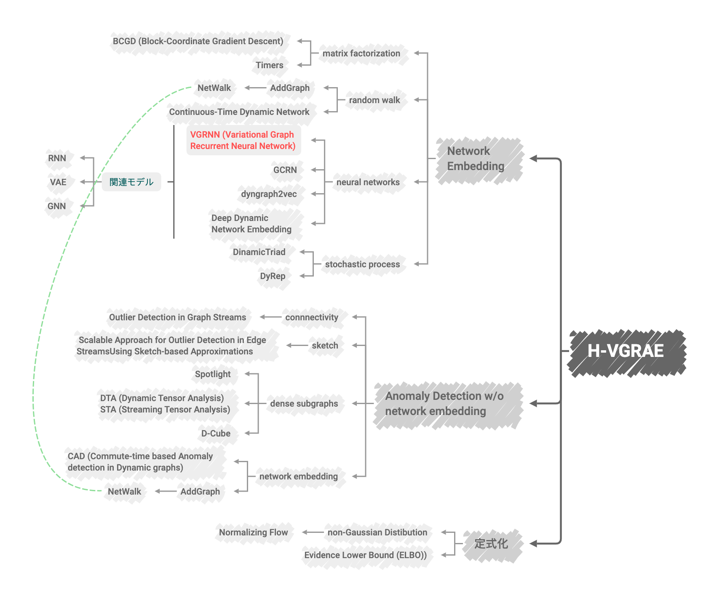
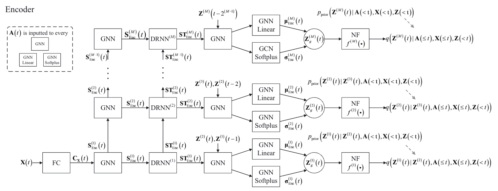
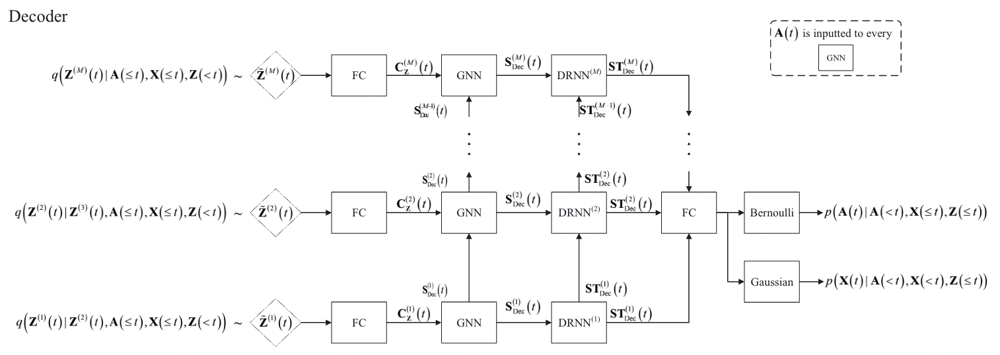

- [x] Round-1: Overview
- [x] Round-2: Model Implementation Details
- [ ] Round-3: Experiments

## Citation


Yang, C., Zhou, L., Wen, H., Zhou, Z., & Wu, Y. (2020)  
H-VGRAE: A Hierarchical Stochastic Spatial-Temporal Embedding Method for Robust Anomaly Detection in Dynamic Networks.  
https://doi.org/10.48550/arxiv.2007.06903


## Abstract
> Detecting anomalous edges and nodes in dynamic networks is critical in various areas, such as social media, computer networks, and so on. Recent approaches leverage network embedding technique to learn how to generate node representations for normal training samples and detect anomalies deviated from normal patterns. However, most existing network embedding approaches learn deterministic node representations, which are sensitive to fluctuations of the topology and attributes due to the high flexibility and stochasticity of dynamic networks. In this paper, a stochastic neural network, named by Hierarchical Variational Graph Recurrent Autoencoder (H-VGRAE), is proposed to detect anomalies in dynamic networks by the learned robust node representations in the form of random variables. H-VGRAE is a semi-supervised model to capture normal patterns in training set by maximizing the likelihood of the adjacency matrix and node attributes via variational inference. Comparing with existing methods, H-VGRAE has three main advantages: 1) H-VGRAE learns robust node representations through stochasticity modeling and the extraction of multi-scale spatial-temporal features; 2) H-VGRAE can be extended to deep structure with the increase of the dynamic network scale; 3) the anomalous edge and node can be located and interpreted from the probabilistic perspective. Extensive experiments on four real-world datasets demonstrate the outperformance of H-VGRAE on anomaly detection in dynamic networks compared with state-of-the-art competitors.

## Background & Wat's New
- 近年ではネットワークの特徴を抽出するための手法としてNetwork Embeddingがよく使われるようになってきている
  - 
Dan Li, Dacheng Chen, Lei Shi, Baihong Jin, Jonathan Goh, See-Kiong Ng. (2019)  
**MAD-GAN: Multivariate Anomaly Detection for Time Series Data with Generative Adversarial Networks**  
ICANN  
[Paper Link](https://www.semanticscholar.org/paper/261e81cba749f70271fa4b7e230328fc1a4a6c96)  
Influential Citation Count (39), SS-ID (261e81cba749f70271fa4b7e230328fc1a4a6c96)  
**Abstract**  
Many real-world cyber-physical systems (CPSs) are engineered for mission-critical tasks and usually are prime targets for cyber-attacks. The rich sensor data in CPSs can be continuously monitored for intrusion events through anomaly detection. On one hand, conventional supervised anomaly detection methods are unable to exploit the large amounts of data due to the lack of labelled data. On the other hand, current unsupervised machine learning approaches have not fully exploited the spatial-temporal correlation and other dependencies amongst the multiple variables (sensors/actuators) in the system when detecting anomalies. In this work, we propose an unsupervised multivariate anomaly detection method based on Generative Adversarial Networks (GANs), using the Long-Short-Term-Memory Recurrent Neural Networks (LSTM-RNN) as the base models (namely, the generator and discriminator) in the GAN framework to capture the temporal correlation of time series distributions. Instead of treating each data stream independently, our proposed Multivariate Anomaly Detection with GAN (MAD-GAN) framework considers the entire variable set concurrently to capture the latent interactions amongst the variables. We also fully exploit both the generator and discriminator produced by the GAN, using a novel anomaly score called DR-score to detect anomalies through discrimination and reconstruction. We have tested our proposed MAD-GAN using two recent datasets collected from real-world CPSs: the Secure Water Treatment (SWaT) and the Water Distribution (WADI) datasets. Our experimental results show that the proposed MAD-GAN is effective in reporting anomalies caused by various cyber-attacks inserted in these complex real-world systems.

  - 
Peng Cui, Xiao Wang, J. Pei, Wenwu Zhu. (2017)  
**A Survey on Network Embedding**  
IEEE Transactions on Knowledge and Data Engineering  
[Paper Link](https://www.semanticscholar.org/paper/ce840188f3395815201b7da49f9bb40d24fc046a)  
Influential Citation Count (31), SS-ID (ce840188f3395815201b7da49f9bb40d24fc046a)  
**ABSTRACT**  
Network embedding assigns nodes in a network to low-dimensional representations and effectively preserves the network structure. Recently, a significant amount of progresses have been made toward this emerging network analysis paradigm. In this survey, we focus on categorizing and then reviewing the current development on network embedding methods, and point out its future research directions. We first summarize the motivation of network embedding. We discuss the classical graph embedding algorithms and their relationship with network embedding. Afterwards and primarily, we provide a comprehensive overview of a large number of network embedding methods in a systematic manner, covering the structure- and property-preserving network embedding methods, the network embedding methods with side information, and the advanced information preserving network embedding methods. Moreover, several evaluation approaches for network embedding and some useful online resources, including the network data sets and softwares, are reviewed, too. Finally, we discuss the framework of exploiting these network embedding methods to build an effective system and point out some potential future directions.

- 近年の動的ネットワークにおける異常検知モデルはネットワークのEmbeddingを利用したものが多いが，既存のアプローチはノードに関する決定的なベクトル表現学習しようとするものである
  - これらのネットワークはネットワークのトポロジーや特徴量の変動に対して過敏である
- Hierarchical Variational Graph Recurrent Autoencoder (H-VGRAE)を提案
  - EncoderでSpatial-Temporal Informationをエンコードする
  - Decoderで潜在的なベクトル表現から元の動的ネットワークを再構築する
    - モデルによって十分に再構築できない入力データは異常とみなす
    - 予測から大きく逸脱する入力データは異常とみなす
- 新しいグラフの入力に対しては再構築したグラフにおけるノードやエッジの確率が異常度スコアとなる
- ネットワーク領域における異常検知はラベルづけの困難さから半教師あり学習によって実施されることが多い
  - 
Raghavendra Chalapathy University of Sydney, Capital Markets Cooperative Research Centre, Sanjay Chawla Qatar Computing Research Institute, Hbku. (2019)  
**Deep Learning for Anomaly Detection: A Survey**  
[Paper Link](https://www.semanticscholar.org/paper/a2e667e4382aaa8e02a17d0522c1a910790ab65b)  
Influential Citation Count (56), SS-ID (a2e667e4382aaa8e02a17d0522c1a910790ab65b)  
**ABSTRACT**  
Anomaly detection is an important problem that has been well-studied within diverse research areas and application domains. The aim of this survey is two-fold, firstly we present a structured and comprehensive overview of research methods in deep learning-based anomaly detection. Furthermore, we review the adoption of these methods for anomaly across various application domains and assess their effectiveness. We have grouped state-of-the-art deep anomaly detection research techniques into different categories based on the underlying assumptions and approach adopted. Within each category, we outline the basic anomaly detection technique, along with its variants and present key assumptions, to differentiate between normal and anomalous behavior. Besides, for each category, we also present the advantages and limitations and discuss the computational complexity of the techniques in real application domains. Finally, we outline open issues in research and challenges faced while adopting deep anomaly detection techniques for real-world problems.

- NetWalkやAddGraphなどの先行研究はいずれもNetwork Embeddingを基礎とした手法であるが，決定的な潜在ベクトル空間を生成することしかできないため確率モデルを扱うことはできない

- Contributions
  - 隣接行列とノードの特徴量に関する尤度を分析し，ELBOを定式化した
  - H-VGRAEを提案した
  - モデルの構築にあたってさまざまなメカニズムを導入
    - extraction of multi-scale ST features
    - the generalization of non-Gaussian random variables
    - the predictive prior
    - the information-sharing mechanism between the inference of posterior and prior to train deep hierarchies of conditional stochastic layers
- 異常はネットワークを再構築したときの確率に基づいて判断される
- データセットにおいて，AUCを0.75ポイント上昇させた

<figure>
  
  <figcaption>Dependencies</figcaption>
</figure>

## Dataset

## Model Description

### Problem Formulation


全部で $T$ のタイムステップを持つグラフの時系列データを以下のように定義する．

$$
\begin{array}{ll}
  \begin{array}{ll}
    \mathbb{G} = G = (V, E) = \left \lbrace \mathcal{G}\_t \right \rbrace \_{t=1}^T
  \end{array} \\\\ \\\\
  \text{where} \hspace{10pt} \left \lbrace \begin{array}{ll}
    \mathcal{G}\_t = \left( \mathcal{V}\_t, \mathcal{E}\_t \right) \\\\
    V = \cup \_{t=1}^T \mathcal{V}\_t \\\\
    E = \cup \_{t=1}^T \mathcal{E}\_t \\\\
    N = |V|
  \end{array} \right .
\end{array} \tag{1}
$$

また，

$$
\begin{array}{ll}
  A\_t \in \lbrace 0, 1 \rbrace ^{N \times N} \mapsto \text{adjacency matrix at timestemp }t \\\\
  X\_t = \left( {\vec{x}\_t}\_1, \ldots, {\vec{x}\_t}\_N \right) \in \mathbb{R}^{N \times D} \mapsto \text{attribute matrix}
\end{array}
$$

とする．


### Encoder Architecture

<fig>
  
  <figcaption>Encoder Architecture</figcaption>
</fig>

### Decoder Architecture

<fig>
  
  <figcaption>Decoder Architecture</figcaption>
</fig>

## Results

### Settings

## References


Palash Goyal, Sujit Rokka Chhetri, A. Canedo. (2018)  
**dyngraph2vec: Capturing Network Dynamics using Dynamic Graph Representation Learning**  
Knowl. Based Syst.  
[Paper Link](https://www.semanticscholar.org/paper/f6e59062382fdec9b95c3abef1c27efc3b2ec1c7)  
Influential Citation Count (26), SS-ID (f6e59062382fdec9b95c3abef1c27efc3b2ec1c7)  


Ehsan Hajiramezanali, Arman Hasanzadeh, N. Duffield, K. Narayanan, Mingyuan Zhou, Xiaoning Qian. (2019)  
**Variational Graph Recurrent Neural Networks**  
NeurIPS  
[Paper Link](https://www.semanticscholar.org/paper/05bc20af07c9ab8b369ac3615c3abd875104028c)  
Influential Citation Count (16), SS-ID (05bc20af07c9ab8b369ac3615c3abd875104028c)  
**ABSTRACT**  
Representation learning over graph structured data has been mostly studied in static graph settings while efforts for modeling dynamic graphs are still scant. In this paper, we develop a novel hierarchical variational model that introduces additional latent random variables to jointly model the hidden states of a graph recurrent neural network (GRNN) to capture both topology and node attribute changes in dynamic graphs. We argue that the use of high-level latent random variables in this variational GRNN (VGRNN) can better capture potential variability observed in dynamic graphs as well as the uncertainty of node latent representation. With semi-implicit variational inference developed for this new VGRNN architecture (SI-VGRNN), we show that flexible non-Gaussian latent representations can further help dynamic graph analytic tasks. Our experiments with multiple real-world dynamic graph datasets demonstrate that SI-VGRNN and VGRNN consistently outperform the existing baseline and state-of-the-art methods by a significant margin in dynamic link prediction.


Li Zheng, Zhenpeng Li, Jian Li, Zhao Li, Jun Gao. (2019)  
**AddGraph: Anomaly Detection in Dynamic Graph Using Attention-based Temporal GCN**  
IJCAI  
[Paper Link](https://www.semanticscholar.org/paper/a86efed0b0ae3a08460d1dd4b8a02f09659daccb)  
Influential Citation Count (5), SS-ID (a86efed0b0ae3a08460d1dd4b8a02f09659daccb)  
**ABSTRACT**  
Anomaly detection in dynamic graphs becomes very critical in many different application scenarios, e.g., recommender systems, while it also raises huge challenges due to the high flexible nature of anomaly and lack of sufficient labelled data. It is better to learn the anomaly patterns by considering all possible features including the structural, content and temporal features, rather than utilizing heuristic rules over the partial features. In this paper, we propose AddGraph, a general end-to-end anomalous edge detection framework using an extended temporal GCN (Graph Convolutional Network) with an attention model, which can capture both long-term patterns and the short-term patterns in dynamic graphs. In order to cope with insufficient explicit labelled data, we employ the negative sampling and margin loss in training of AddGraph in a semi-supervised fashion. We conduct extensive experiments on real-world datasets, and illustrate that AddGraph can outperform the state-of-the-art competitors in anomaly detection significantly.


Minji Yoon, Bryan Hooi, Kijung Shin, C. Faloutsos. (2019)  
**Fast and Accurate Anomaly Detection in Dynamic Graphs with a Two-Pronged Approach**  
KDD  
[Paper Link](https://www.semanticscholar.org/paper/a30ea6b21e50073bc468e3ac769d6cffd39c9d67)  
Influential Citation Count (1), SS-ID (a30ea6b21e50073bc468e3ac769d6cffd39c9d67)  
**ABSTRACT**  
Given a dynamic graph stream, how can we detect the sudden appearance of anomalous patterns, such as link spam, follower boosting, or denial of service attacks? Additionally, can we categorize the types of anomalies that occur in practice, and theoretically analyze the anomalous signs arising from each type? In this work, we propose AnomRank, an online algorithm for anomaly detection in dynamic graphs. AnomRank uses a two-pronged approach defining two novel metrics for anomalousness. Each metric tracks the derivatives of its own version of a 'node score' (or node importance) function. This allows us to detect sudden changes in the importance of any node. We show theoretically and experimentally that the two-pronged approach successfully detects two common types of anomalies: sudden weight changes along an edge, and sudden structural changes to the graph. AnomRank is (a) Fast and Accurate: up to 49.5x faster or 35% more accurate than state-of-the-art methods, (b) Scalable: linear in the number of edges in the input graph, processing millions of edges within 2 seconds on a stock laptop/desktop, and (c) Theoretically Sound: providing theoretical guarantees of the two-pronged approach.


Ya Su, Youjian Zhao, Chenhao Niu, Rong Liu, Wei Sun, Dan Pei. (2019)  
**Robust Anomaly Detection for Multivariate Time Series through Stochastic Recurrent Neural Network**  
KDD  
[Paper Link](https://www.semanticscholar.org/paper/440d248d148f7e36dad232e48f1c5c1cbc556d86)  
Influential Citation Count (54), SS-ID (440d248d148f7e36dad232e48f1c5c1cbc556d86)  
**ABSTRACT**  
Industry devices (i.e., entities) such as server machines, spacecrafts, engines, etc., are typically monitored with multivariate time series, whose anomaly detection is critical for an entity's service quality management. However, due to the complex temporal dependence and stochasticity of multivariate time series, their anomaly detection remains a big challenge. This paper proposes OmniAnomaly, a stochastic recurrent neural network for multivariate time series anomaly detection that works well robustly for various devices. Its core idea is to capture the normal patterns of multivariate time series by learning their robust representations with key techniques such as stochastic variable connection and planar normalizing flow, reconstruct input data by the representations, and use the reconstruction probabilities to determine anomalies. Moreover, for a detected entity anomaly, OmniAnomaly can provide interpretations based on the reconstruction probabilities of its constituent univariate time series. The evaluation experiments are conducted on two public datasets from aerospace and a new server machine dataset (collected and released by us) from an Internet company. OmniAnomaly achieves an overall F1-Score of 0.86 in three real-world datasets, signicantly outperforming the best performing baseline method by 0.09. The interpretation accuracy for OmniAnomaly is up to 0.89.


Nima Dehmamy, A. Barabasi, Rose Yu. (2019)  
**Understanding the Representation Power of Graph Neural Networks in Learning Graph Topology**  
NeurIPS  
[Paper Link](https://www.semanticscholar.org/paper/15748c0437c3be2e464dfb6aa42d2ff5dbd5d7f7)  
Influential Citation Count (7), SS-ID (15748c0437c3be2e464dfb6aa42d2ff5dbd5d7f7)  
**ABSTRACT**  
To deepen our understanding of graph neural networks, we investigate the representation power of Graph Convolutional Networks (GCN) through the looking glass of graph moments, a key property of graph topology encoding path of various lengths. We find that GCNs are rather restrictive in learning graph moments. Without careful design, GCNs can fail miserably even with multiple layers and nonlinear activation functions. We analyze theoretically the expressiveness of GCNs, arriving at a modular GCN design, using different propagation rules. Our modular design is capable of distinguishing graphs from different graph generation models for surprisingly small graphs, a notoriously difficult problem in network science. Our investigation suggests that, depth is much more influential than width, with deeper GCNs being more capable of learning higher order graph moments. Additionally, combining GCN modules with different propagation rules is critical to the representation power of GCNs.


Rakshit S. Trivedi, Mehrdad Farajtabar, P. Biswal, H. Zha. (2019)  
**DyRep: Learning Representations over Dynamic Graphs**  
ICLR  
[Paper Link](https://www.semanticscholar.org/paper/5593001e49474a475dbcae99be350a8d527c05a3)  
Influential Citation Count (41), SS-ID (5593001e49474a475dbcae99be350a8d527c05a3)  


Volodymyr Miz, B. Ricaud, Kirell Benzi, P. Vandergheynst. (2019)  
**Anomaly Detection in the Dynamics of Web and Social Networks Using Associative Memory**  
WWW  
[Paper Link](https://www.semanticscholar.org/paper/feeb8dd614024827b821477ebc0e57503a4eb6b1)  
Influential Citation Count (0), SS-ID (feeb8dd614024827b821477ebc0e57503a4eb6b1)  
**ABSTRACT**  
In this work, we propose a new, fast and scalable method for anomaly detection in large time-evolving graphs. It may be a static graph with dynamic node attributes (e.g. time-series), or a graph evolving in time, such as a temporal network. We define an anomaly as a localized increase in temporal activity in a cluster of nodes. The algorithm is unsupervised. It is able to detect and track anomalous activity in a dynamic network despite the noise from multiple interfering sources. We use the Hopfield network model of memory to combine the graph and time information. We show that anomalies can be spotted with good precision using a memory network. The presented approach is scalable and we provide a distributed implementation of the algorithm. To demonstrate its efficiency, we apply it to two datasets: Enron Email dataset and Wikipedia page views. We show that the anomalous spikes are triggered by the real-world events that impact the network dynamics. Besides, the structure of the clusters and the analysis of the time evolution associated with the detected events reveals interesting facts on how humans interact, exchange and search for information, opening the door to new quantitative studies on collective and social behavior on large and dynamic datasets.


Dan Li, Dacheng Chen, Lei Shi, Baihong Jin, Jonathan Goh, See-Kiong Ng. (2019)  
**MAD-GAN: Multivariate Anomaly Detection for Time Series Data with Generative Adversarial Networks**  
ICANN  
[Paper Link](https://www.semanticscholar.org/paper/261e81cba749f70271fa4b7e230328fc1a4a6c96)  
Influential Citation Count (39), SS-ID (261e81cba749f70271fa4b7e230328fc1a4a6c96)  
**Abstract**  
Many real-world cyber-physical systems (CPSs) are engineered for mission-critical tasks and usually are prime targets for cyber-attacks. The rich sensor data in CPSs can be continuously monitored for intrusion events through anomaly detection. On one hand, conventional supervised anomaly detection methods are unable to exploit the large amounts of data due to the lack of labelled data. On the other hand, current unsupervised machine learning approaches have not fully exploited the spatial-temporal correlation and other dependencies amongst the multiple variables (sensors/actuators) in the system when detecting anomalies. In this work, we propose an unsupervised multivariate anomaly detection method based on Generative Adversarial Networks (GANs), using the Long-Short-Term-Memory Recurrent Neural Networks (LSTM-RNN) as the base models (namely, the generator and discriminator) in the GAN framework to capture the temporal correlation of time series distributions. Instead of treating each data stream independently, our proposed Multivariate Anomaly Detection with GAN (MAD-GAN) framework considers the entire variable set concurrently to capture the latent interactions amongst the variables. We also fully exploit both the generator and discriminator produced by the GAN, using a novel anomaly score called DR-score to detect anomalies through discrimination and reconstruction. We have tested our proposed MAD-GAN using two recent datasets collected from real-world CPSs: the Secure Water Treatment (SWaT) and the Water Distribution (WADI) datasets. Our experimental results show that the proposed MAD-GAN is effective in reporting anomalies caused by various cyber-attacks inserted in these complex real-world systems.


Raghavendra Chalapathy University of Sydney, Capital Markets Cooperative Research Centre, Sanjay Chawla Qatar Computing Research Institute, Hbku. (2019)  
**Deep Learning for Anomaly Detection: A Survey**  
  
[Paper Link](https://www.semanticscholar.org/paper/a2e667e4382aaa8e02a17d0522c1a910790ab65b)  
Influential Citation Count (56), SS-ID (a2e667e4382aaa8e02a17d0522c1a910790ab65b)  
**ABSTRACT**  
Anomaly detection is an important problem that has been well-studied within diverse research areas and application domains. The aim of this survey is two-fold, firstly we present a structured and comprehensive overview of research methods in deep learning-based anomaly detection. Furthermore, we review the adoption of these methods for anomaly across various application domains and assess their effectiveness. We have grouped state-of-the-art deep anomaly detection research techniques into different categories based on the underlying assumptions and approach adopted. Within each category, we outline the basic anomaly detection technique, along with its variants and present key assumptions, to differentiate between normal and anomalous behavior. Besides, for each category, we also present the advantages and limitations and discuss the computational complexity of the techniques in real application domains. Finally, we outline open issues in research and challenges faced while adopting deep anomaly detection techniques for real-world problems.


Peng Cui, Xiao Wang, J. Pei, Wenwu Zhu. (2017)  
**A Survey on Network Embedding**  
IEEE Transactions on Knowledge and Data Engineering  
[Paper Link](https://www.semanticscholar.org/paper/ce840188f3395815201b7da49f9bb40d24fc046a)  
Influential Citation Count (31), SS-ID (ce840188f3395815201b7da49f9bb40d24fc046a)  
**ABSTRACT**  
Network embedding assigns nodes in a network to low-dimensional representations and effectively preserves the network structure. Recently, a significant amount of progresses have been made toward this emerging network analysis paradigm. In this survey, we focus on categorizing and then reviewing the current development on network embedding methods, and point out its future research directions. We first summarize the motivation of network embedding. We discuss the classical graph embedding algorithms and their relationship with network embedding. Afterwards and primarily, we provide a comprehensive overview of a large number of network embedding methods in a systematic manner, covering the structure- and property-preserving network embedding methods, the network embedding methods with side information, and the advanced information preserving network embedding methods. Moreover, several evaluation approaches for network embedding and some useful online resources, including the network data sets and softwares, are reviewed, too. Finally, we discuss the framework of exploiting these network embedding methods to build an effective system and point out some potential future directions.


Wenchao Yu, Wei Cheng, C. Aggarwal, Kai Zhang, Haifeng Chen, Wei Wang. (2018)  
**NetWalk: A Flexible Deep Embedding Approach for Anomaly Detection in Dynamic Networks**  
KDD  
[Paper Link](https://www.semanticscholar.org/paper/68f6fe021bd8efd8baf648138a8fe2182858e7cb)  
Influential Citation Count (12), SS-ID (68f6fe021bd8efd8baf648138a8fe2182858e7cb)  
**ABSTRACT**  
Massive and dynamic networks arise in many practical applications such as social media, security and public health. Given an evolutionary network, it is crucial to detect structural anomalies, such as vertices and edges whose "behaviors'' deviate from underlying majority of the network, in a real-time fashion. Recently, network embedding has proven a powerful tool in learning the low-dimensional representations of vertices in networks that can capture and preserve the network structure. However, most existing network embedding approaches are designed for static networks, and thus may not be perfectly suited for a dynamic environment in which the network representation has to be constantly updated. In this paper, we propose a novel approach, NetWalk, for anomaly detection in dynamic networks by learning network representations which can be updated dynamically as the network evolves. We first encode the vertices of the dynamic network to vector representations by clique embedding, which jointly minimizes the pairwise distance of vertex representations of each walk derived from the dynamic networks, and the deep autoencoder reconstruction error serving as a global regularization. The vector representations can be computed with constant space requirements using reservoir sampling. On the basis of the learned low-dimensional vertex representations, a clustering-based technique is employed to incrementally and dynamically detect network anomalies. Compared with existing approaches, NetWalk has several advantages: 1) the network embedding can be updated dynamically, 2) streaming network nodes and edges can be encoded efficiently with constant memory space usage, 3). flexible to be applied on different types of networks, and 4) network anomalies can be detected in real-time. Extensive experiments on four real datasets demonstrate the effectiveness of NetWalk.


D. Eswaran, C. Faloutsos, S. Guha, Nina Mishra. (2018)  
**SpotLight: Detecting Anomalies in Streaming Graphs**  
KDD  
[Paper Link](https://www.semanticscholar.org/paper/a3f38ffe0a2c72569e8e92e0e65ab8905871f12b)  
Influential Citation Count (7), SS-ID (a3f38ffe0a2c72569e8e92e0e65ab8905871f12b)  
**ABSTRACT**  
How do we spot interesting events from e-mail or transportation logs? How can we detect port scan or denial of service attacks from IP-IP communication data? In general, given a sequence of weighted, directed or bipartite graphs, each summarizing a snapshot of activity in a time window, how can we spot anomalous graphs containing the sudden appearance or disappearance of large dense subgraphs (e.g., near bicliques) in near real-time using sublinear memory? To this end, we propose a randomized sketching-based approach called SpotLight, which guarantees that an anomalous graph is mapped 'far' away from 'normal' instances in the sketch space with high probability for appropriate choice of parameters. Extensive experiments on real-world datasets show that SpotLight (a) improves accuracy by at least 8.4% compared to prior approaches, (b) is fast and can process millions of edges within a few minutes, (c) scales linearly with the number of edges and sketching dimensions and (d) leads to interesting discoveries in practice.


Taisong Li, Jiawei Zhang, Philip S. Yu, Yan Zhang, Yonghong Yan. (2018)  
**Deep Dynamic Network Embedding for Link Prediction**  
IEEE Access  
[Paper Link](https://www.semanticscholar.org/paper/6775bc75a1ab44c2f43857a44a29e74b70cd0d27)  
Influential Citation Count (5), SS-ID (6775bc75a1ab44c2f43857a44a29e74b70cd0d27)  
**ABSTRACT**  
Network embedding task aims at learning low-dimension latent representations of vertices while preserving the structure of a network simultaneously. Most existing network embedding methods mainly focus on static networks, which extract and condense the network information without temporal information. However, in the real world, networks keep evolving, where the linkage states between the same vertex pairs at consequential timestamps have very close correlations. In this paper, we propose to study the network embedding problem and focus on modeling the linkage evolution in the dynamic network setting. To address this problem, we propose a deep dynamic network embedding method. More specifically, the method utilizes the historical information obtained from the network snapshots at past timestamps to learn latent representations of the future network. In the proposed embedding method, the objective function is carefully designed to incorporate both the network internal and network dynamic transition structures. Extensive empirical experiments prove the effectiveness of the proposed model on various categories of real-world networks, including a human contact network, a bibliographic network, and e-mail networks. Furthermore, the experimental results also demonstrate the significant advantages of the method compared with both the state-of-the-art embedding techniques and several existing baseline methods.


Le-kui Zhou, Yang Yang, Xiang Ren, Fei Wu, Yueting Zhuang. (2018)  
**Dynamic Network Embedding by Modeling Triadic Closure Process**  
AAAI  
[Paper Link](https://www.semanticscholar.org/paper/7bfb46c47c25e46a5f7b168133f4e926ab44725b)  
Influential Citation Count (43), SS-ID (7bfb46c47c25e46a5f7b168133f4e926ab44725b)  
**ABSTRACT**  
Network embedding, which aims to learn the low-dimensional representations of vertices, is an important task and has attracted considerable research efforts recently. In real world, networks, like social network and biological networks, are dynamic and evolving over time. However, almost all the existing network embedding methods focus on static networks while ignore network dynamics. In this paper, we present a novel representation learning approach, DynamicTriad, to preserve both structural information and evolution patterns of a given network. The general idea of our approach is to impose triad, which is a group of three vertices and is one of the basic units of networks. In particular, we model how a closed triad, which consists of three vertices connected with each other, develops from an open triad that has two of three vertices not connected with each other. This triadic closure process is a fundamental mechanism in the formation and evolution of networks, thereby makes our model being able to capture the network dynamics and to learn representation vectors for each vertex at different time steps. Experimental results on three real-world networks demonstrate that, compared with several state-of-the-art techniques, DynamicTriad achieves substantial gains in several application scenarios. For example, our approach can effectively be applied and help to identify telephone frauds in a mobile network, and to predict whether a user will repay her loans or not in a loan network.


G. Nguyen, J. B. Lee, Ryan A. Rossi, Nesreen Ahmed, Eunyee Koh, Sungchul Kim. (2018)  
**Continuous-Time Dynamic Network Embeddings**  
WWW  
[Paper Link](https://www.semanticscholar.org/paper/0ebc58242d10e14633bdad72b74b31c3d4ed9bdd)  
Influential Citation Count (54), SS-ID (0ebc58242d10e14633bdad72b74b31c3d4ed9bdd)  
**ABSTRACT**  
Networks evolve continuously over time with the addition, deletion, and changing of links and nodes. Although many networks contain this type of temporal information, the majority of research in network representation learning has focused on static snapshots of the graph and has largely ignored the temporal dynamics of the network. In this work, we describe a general framework for incorporating temporal information into network embedding methods. The framework gives rise to methods for learning time-respecting embeddings from continuous-time dynamic networks. Overall, the experiments demonstrate the effectiveness of the proposed framework and dynamic network embedding approach as it achieves an average gain of 11.9% across all methods and graphs. The results indicate that modeling temporal dependencies in graphs is important for learning appropriate and meaningful network representations.


Ziwei Zhang, Peng Cui, J. Pei, Xiao Wang, Wenwu Zhu. (2017)  
**TIMERS: Error-Bounded SVD Restart on Dynamic Networks**  
AAAI  
[Paper Link](https://www.semanticscholar.org/paper/1ca27cb4d43e7f3fbc1c4196252168702d7b3b3e)  
Influential Citation Count (10), SS-ID (1ca27cb4d43e7f3fbc1c4196252168702d7b3b3e)  
**ABSTRACT**  
Singular Value Decomposition (SVD) is a popular approach in various network applications, such as link prediction and network parameter characterization. Incremental SVD approaches are proposed to process newly changed nodes and edges in dynamic networks. However, incremental SVD approaches suffer from serious error accumulation inevitably due to approximation on incremental updates. SVD restart is an effective approach to reset the aggregated error, but when to restart SVD for dynamic networks is not addressed in literature. In this paper, we propose TIMERS, Theoretically Instructed Maximum-Error-bounded Restart of SVD, a novel approach which optimally sets the restart time in order to reduce error accumulation in time. Specifically, we monitor the margin between reconstruction loss of incremental updates and the minimum loss in SVD model. To reduce the complexity of monitoring, we theoretically develop a lower bound of SVD minimum loss for dynamic networks and use the bound to replace the minimum loss in monitoring. By setting a maximum tolerated error as a threshold, we can trigger SVD restart automatically when the margin exceeds this threshold. We prove that the time complexity of our method is linear with respect to the number of local dynamic changes, and our method is general across different types of dynamic networks. We conduct extensive experiments on several synthetic and real dynamic networks. The experimental results demonstrate that our proposed method significantly outperforms the existing methods by reducing 27% to 42% in terms of the maximum error for dynamic network reconstruction when fixing the number of restarts. Our method reduces the number of restarts by 25% to 50% when fixing the maximum error tolerated.


Petar Velickovic, Guillem Cucurull, Arantxa Casanova, Adriana Romero, P. Lio’, Yoshua Bengio. (2017)  
**Graph Attention Networks**  
ICLR  
[Paper Link](https://www.semanticscholar.org/paper/33998aff64ce51df8dee45989cdca4b6b1329ec4)  
Influential Citation Count (1631), SS-ID (33998aff64ce51df8dee45989cdca4b6b1329ec4)  
**ABSTRACT**  
We present graph attention networks (GATs), novel neural network architectures that operate on graph-structured data, leveraging masked self-attentional layers to address the shortcomings of prior methods based on graph convolutions or their approximations. By stacking layers in which nodes are able to attend over their neighborhoods' features, we enable (implicitly) specifying different weights to different nodes in a neighborhood, without requiring any kind of costly matrix operation (such as inversion) or depending on knowing the graph structure upfront. In this way, we address several key challenges of spectral-based graph neural networks simultaneously, and make our model readily applicable to inductive as well as transductive problems. Our GAT models have achieved or matched state-of-the-art results across four established transductive and inductive graph benchmarks: the Cora, Citeseer and Pubmed citation network datasets, as well as a protein-protein interaction dataset (wherein test graphs remain unseen during training).


Youngjoo Seo, M. Defferrard, P. Vandergheynst, X. Bresson. (2016)  
**Structured Sequence Modeling with Graph Convolutional Recurrent Networks**  
ICONIP  
[Paper Link](https://www.semanticscholar.org/paper/6b1793ece5993523855ce67c646de408318d1b12)  
Influential Citation Count (54), SS-ID (6b1793ece5993523855ce67c646de408318d1b12)  


Adam Paszke, S. Gross, Soumith Chintala, Gregory Chanan, E. Yang, Zach DeVito, Zeming Lin, Alban Desmaison, L. Antiga, Adam Lerer. (2017)  
**Automatic differentiation in PyTorch**  
  
[Paper Link](https://www.semanticscholar.org/paper/b36a5bb1707bb9c70025294b3a310138aae8327a)  
Influential Citation Count (1260), SS-ID (b36a5bb1707bb9c70025294b3a310138aae8327a)  
**ABSTRACT**  
In this article, we describe an automatic differentiation module of PyTorch — a library designed to enable rapid research on machine learning models. It builds upon a few projects, most notably Lua Torch, Chainer, and HIPS Autograd [4], and provides a high performance environment with easy access to automatic differentiation of models executed on different devices (CPU and GPU). To make prototyping easier, PyTorch does not follow the symbolic approach used in many other deep learning frameworks, but focuses on differentiation of purely imperative programs, with a focus on extensibility and low overhead. Note that this preprint is a draft of certain sections from an upcoming paper covering all PyTorch features.


Shiyu Chang, Yang Zhang, Wei Han, Mo Yu, Xiaoxiao Guo, Wei Tan, Xiaodong Cui, M. Witbrock, M. Hasegawa-Johnson, Thomas S. Huang. (2017)  
**Dilated Recurrent Neural Networks**  
NIPS  
[Paper Link](https://www.semanticscholar.org/paper/2dad7e558a1e2982d0d42042021f4cde4af04abf)  
Influential Citation Count (33), SS-ID (2dad7e558a1e2982d0d42042021f4cde4af04abf)  
**ABSTRACT**  
Learning with recurrent neural networks (RNNs) on long sequences is a notoriously difficult task. There are three major challenges: 1) complex dependencies, 2) vanishing and exploding gradients, and 3) efficient parallelization. In this paper, we introduce a simple yet effective RNN connection structure, the DilatedRNN, which simultaneously tackles all of these challenges. The proposed architecture is characterized by multi-resolution dilated recurrent skip connections and can be combined flexibly with diverse RNN cells. Moreover, the DilatedRNN reduces the number of parameters needed and enhances training efficiency significantly, while matching state-of-the-art performance (even with standard RNN cells) in tasks involving very long-term dependencies. To provide a theory-based quantification of the architecture's advantages, we introduce a memory capacity measure, the mean recurrent length, which is more suitable for RNNs with long skip connections than existing measures. We rigorously prove the advantages of the DilatedRNN over other recurrent neural architectures. The code for our method is publicly available at this https URL


Alban Siffer, Pierre-Alain Fouque, A. Termier, Christine Largouët. (2017)  
**Anomaly Detection in Streams with Extreme Value Theory**  
KDD  
[Paper Link](https://www.semanticscholar.org/paper/0cfe631a0f99242a751a5a8bfd28dfb18f37f23e)  
Influential Citation Count (42), SS-ID (0cfe631a0f99242a751a5a8bfd28dfb18f37f23e)  
**ABSTRACT**  
Anomaly detection in time series has attracted considerable attention due to its importance in many real-world applications including intrusion detection, energy management and finance. Most approaches for detecting outliers rely on either manually set thresholds or assumptions on the distribution of data according to Chandola, Banerjee and Kumar. Here, we propose a new approach to detect outliers in streaming univariate time series based on Extreme Value Theory that does not require to hand-set thresholds and makes no assumption on the distribution: the main parameter is only the risk, controlling the number of false positives. Our approach can be used for outlier detection, but more generally for automatically setting thresholds, making it useful in wide number of situations. We also experiment our algorithms on various real-world datasets which confirm its soundness and efficiency.


Rianne van den Berg, Thomas Kipf, M. Welling. (2017)  
**Graph Convolutional Matrix Completion**  
ArXiv  
[Paper Link](https://www.semanticscholar.org/paper/c509de93b3d34ecd178f598814bd5177a0a29726)  
Influential Citation Count (137), SS-ID (c509de93b3d34ecd178f598814bd5177a0a29726)  
**ABSTRACT**  
We consider matrix completion for recommender systems from the point of view of link prediction on graphs. Interaction data such as movie ratings can be represented by a bipartite user-item graph with labeled edges denoting observed ratings. Building on recent progress in deep learning on graph-structured data, we propose a graph auto-encoder framework based on differentiable message passing on the bipartite interaction graph. Our model shows competitive performance on standard collaborative filtering benchmarks. In settings where complimentary feature information or structured data such as a social network is available, our framework outperforms recent state-of-the-art methods.


William L. Hamilton, Z. Ying, J. Leskovec. (2017)  
**Inductive Representation Learning on Large Graphs**  
NIPS  
[Paper Link](https://www.semanticscholar.org/paper/6b7d6e6416343b2a122f8416e69059ce919026ef)  
Influential Citation Count (1475), SS-ID (6b7d6e6416343b2a122f8416e69059ce919026ef)  
**ABSTRACT**  
Low-dimensional embeddings of nodes in large graphs have proved extremely useful in a variety of prediction tasks, from content recommendation to identifying protein functions. However, most existing approaches require that all nodes in the graph are present during training of the embeddings; these previous approaches are inherently transductive and do not naturally generalize to unseen nodes. Here we present GraphSAGE, a general, inductive framework that leverages node feature information (e.g., text attributes) to efficiently generate node embeddings for previously unseen data. Instead of training individual embeddings for each node, we learn a function that generates embeddings by sampling and aggregating features from a node's local neighborhood. Our algorithm outperforms strong baselines on three inductive node-classification benchmarks: we classify the category of unseen nodes in evolving information graphs based on citation and Reddit post data, and we show that our algorithm generalizes to completely unseen graphs using a multi-graph dataset of protein-protein interactions.


V. Sze, Yu-hsin Chen, Tien-Ju Yang, J. Emer. (2017)  
**Efficient Processing of Deep Neural Networks: A Tutorial and Survey**  
Proceedings of the IEEE  
[Paper Link](https://www.semanticscholar.org/paper/3f116042f50a499ab794bcc1255915bee507413c)  
Influential Citation Count (144), SS-ID (3f116042f50a499ab794bcc1255915bee507413c)  
**ABSTRACT**  
Deep neural networks (DNNs) are currently widely used for many artificial intelligence (AI) applications including computer vision, speech recognition, and robotics. While DNNs deliver state-of-the-art accuracy on many AI tasks, it comes at the cost of high computational complexity. Accordingly, techniques that enable efficient processing of DNNs to improve energy efficiency and throughput without sacrificing application accuracy or increasing hardware cost are critical to the wide deployment of DNNs in AI systems. This article aims to provide a comprehensive tutorial and survey about the recent advances toward the goal of enabling efficient processing of DNNs. Specifically, it will provide an overview of DNNs, discuss various hardware platforms and architectures that support DNNs, and highlight key trends in reducing the computation cost of DNNs either solely via hardware design changes or via joint hardware design and DNN algorithm changes. It will also summarize various development resources that enable researchers and practitioners to quickly get started in this field, and highlight important benchmarking metrics and design considerations that should be used for evaluating the rapidly growing number of DNN hardware designs, optionally including algorithmic codesigns, being proposed in academia and industry. The reader will take away the following concepts from this article: understand the key design considerations for DNNs; be able to evaluate different DNN hardware implementations with benchmarks and comparison metrics; understand the tradeoffs between various hardware architectures and platforms; be able to evaluate the utility of various DNN design techniques for efficient processing; and understand recent implementation trends and opportunities.


Kijung Shin, Bryan Hooi, Jisu Kim, C. Faloutsos. (2017)  
**D-Cube: Dense-Block Detection in Terabyte-Scale Tensors**  
WSDM  
[Paper Link](https://www.semanticscholar.org/paper/ffabd2758ad4a0106a886cc7d8161d5e294794ed)  
Influential Citation Count (7), SS-ID (ffabd2758ad4a0106a886cc7d8161d5e294794ed)  
**ABSTRACT**  
How can we detect fraudulent lockstep behavior in large-scale multi-aspect data (i.e., tensors)? Can we detect it when data are too large to fit in memory or even on a disk? Past studies have shown that dense blocks in real-world tensors (e.g., social media, Wikipedia, TCP dumps, etc.) signal anomalous or fraudulent behavior such as retweet boosting, bot activities, and network attacks. Thus, various approaches, including tensor decomposition and search, have been used for rapid and accurate dense-block detection in tensors. However, all such methods have low accuracy, or assume that tensors are small enough to fit in main memory, which is not true in many real-world applications such as social media and web. To overcome these limitations, we propose D-Cube, a disk-based dense-block detection method, which also can be run in a distributed manner across multiple machines. Compared with state-of-the-art methods, D-Cube is (1) Memory Efficient: requires up to 1,600 times less memory and handles 1,000 times larger data (2.6TB), (2) Fast: up to 5 times faster due to its near-linear scalability with all aspects of data, (3) Provably Accurate: gives a guarantee on the densities of the blocks it finds, and (4) Effective: successfully spotted network attacks from TCP dumps and synchronized behavior in rating data with the highest accuracy.


Thomas Kipf, M. Welling. (2016)  
**Semi-Supervised Classification with Graph Convolutional Networks**  
ICLR  
[Paper Link](https://www.semanticscholar.org/paper/36eff562f65125511b5dfab68ce7f7a943c27478)  
Influential Citation Count (3668), SS-ID (36eff562f65125511b5dfab68ce7f7a943c27478)  
**ABSTRACT**  
We present a scalable approach for semi-supervised learning on graph-structured data that is based on an efficient variant of convolutional neural networks which operate directly on graphs. We motivate the choice of our convolutional architecture via a localized first-order approximation of spectral graph convolutions. Our model scales linearly in the number of graph edges and learns hidden layer representations that encode both local graph structure and features of nodes. In a number of experiments on citation networks and on a knowledge graph dataset we demonstrate that our approach outperforms related methods by a significant margin.


Junyoung Chung, Sungjin Ahn, Yoshua Bengio. (2016)  
**Hierarchical Multiscale Recurrent Neural Networks**  
ICLR  
[Paper Link](https://www.semanticscholar.org/paper/65eee67dee969fdf8b44c87c560d66ad4d78e233)  
Influential Citation Count (72), SS-ID (65eee67dee969fdf8b44c87c560d66ad4d78e233)  
**ABSTRACT**  
Learning both hierarchical and temporal representation has been among the long-standing challenges of recurrent neural networks. Multiscale recurrent neural networks have been considered as a promising approach to resolve this issue, yet there has been a lack of empirical evidence showing that this type of models can actually capture the temporal dependencies by discovering the latent hierarchical structure of the sequence. In this paper, we propose a novel multiscale approach, called the hierarchical multiscale recurrent neural networks, which can capture the latent hierarchical structure in the sequence by encoding the temporal dependencies with different timescales using a novel update mechanism. We show some evidence that our proposed multiscale architecture can discover underlying hierarchical structure in the sequences without using explicit boundary information. We evaluate our proposed model on character-level language modelling and handwriting sequence modelling.


Linhong Zhu, Dong Guo, Junming Yin, G. V. Steeg, A. Galstyan. (2017)  
**Scalable Temporal Latent Space Inference for Link Prediction in Dynamic Social Networks**  
IEEE Transactions on Knowledge and Data Engineering  
[Paper Link](https://www.semanticscholar.org/paper/53393510065fefe94e87375a8dda311b526fed1c)  
Influential Citation Count (22), SS-ID (53393510065fefe94e87375a8dda311b526fed1c)  
**ABSTRACT**  
We propose a temporal latent space model for link prediction in dynamic social networks, where the goal is to predict links over time based on a sequence of previous graph snapshots. The model assumes that each user lies in an unobserved latent space, and interactions are more likely to occur between similar users in the latent space representation. In addition, the model allows each user to gradually move its position in the latent space as the network structure evolves over time. We present a global optimization algorithm to effectively infer the temporal latent space. Two alternative optimization algorithms with local and incremental updates are also proposed, allowing the model to scale to larger networks without compromising prediction accuracy. Empirically, we demonstrate that our model, when evaluated on a number of real-world dynamic networks, significantly outperforms existing approaches for temporal link prediction in terms of both scalability and predictive power.


Stephen Ranshous, Steve Harenberg, Kshitij Sharma, N. Samatova. (2016)  
**A Scalable Approach for Outlier Detection in Edge Streams Using Sketch-based Approximations**  
SDM  
[Paper Link](https://www.semanticscholar.org/paper/b66dbe242c3fa0a5738c7e76004f1f7b655f5ed6)  
Influential Citation Count (5), SS-ID (b66dbe242c3fa0a5738c7e76004f1f7b655f5ed6)  
**ABSTRACT**  
Dynamic graphs are a powerful way to model an evolving set of objects and their ongoing interactions. A broad spectrum of systems, such as information, communication, and social, are naturally represented by dynamic graphs. Outlier (or anomaly) detection in dynamic graphs can provide unique insights into the relationships of objects and identify novel or emerging relationships. To date, outlier detection in dynamic graphs has been studied in the context of graph streams, focusing on the analysis and comparison of entire graph objects. However, the volume and velocity of data are necessitating a transition from outlier detection in the context of graph streams to outlier detection in the context of edge streams–where the stream consists of individual graph edges instead of entire graph objects. In this paper, we propose the first approach for outlier detection in edge streams. We first describe a highlevel model for outlier detection based on global and local structural properties of a stream. We propose a novel application of the Count-Min sketch for approximating these properties, and prove probabilistic error bounds on our edge outlier scoring functions. Our sketch-based implementation provides a scalable solution, having constant time updates and constant space requirements. Experiments on synthetic and real world datasets demonstrate our method’s scalability, effectiveness for discovering outliers, and the effects of approximation.


Zhilin Yang, William W. Cohen, R. Salakhutdinov. (2016)  
**Revisiting Semi-Supervised Learning with Graph Embeddings**  
ICML  
[Paper Link](https://www.semanticscholar.org/paper/3d846cb01f6a975554035d2210b578ca61344b22)  
Influential Citation Count (193), SS-ID (3d846cb01f6a975554035d2210b578ca61344b22)  
**ABSTRACT**  
We present a semi-supervised learning framework based on graph embeddings. Given a graph between instances, we train an embedding for each instance to jointly predict the class label and the neighborhood context in the graph. We develop both transductive and inductive variants of our method. In the transductive variant of our method, the class labels are determined by both the learned embeddings and input feature vectors, while in the inductive variant, the embeddings are defined as a parametric function of the feature vectors, so predictions can be made on instances not seen during training. On a large and diverse set of benchmark tasks, including text classification, distantly supervised entity extraction, and entity classification, we show improved performance over many of the existing models.


C. Sønderby, T. Raiko, Lars Maaløe, Søren Kaae Sønderby, O. Winther. (2016)  
**Ladder Variational Autoencoders**  
NIPS  
[Paper Link](https://www.semanticscholar.org/paper/64d698ecd01eab99e81e586400e86d3d70b9cba7)  
Influential Citation Count (101), SS-ID (64d698ecd01eab99e81e586400e86d3d70b9cba7)  
**ABSTRACT**  
Variational Autoencoders are powerful models for unsupervised learning. However deep models with several layers of dependent stochastic variables are difficult to train which limits the improvements obtained using these highly expressive models. We propose a new inference model, the Ladder Variational Autoencoder, that recursively corrects the generative distribution by a data dependent approximate likelihood in a process resembling the recently proposed Ladder Network. We show that this model provides state of the art predictive log-likelihood and tighter log-likelihood lower bound compared to the purely bottom-up inference in layered Variational Autoencoders and other generative models. We provide a detailed analysis of the learned hierarchical latent representation and show that our new inference model is qualitatively different and utilizes a deeper more distributed hierarchy of latent variables. Finally, we observe that batch normalization and deterministic warm-up (gradually turning on the KL-term) are crucial for training variational models with many stochastic layers.


Samuel R. Bowman, L. Vilnis, Oriol Vinyals, Andrew M. Dai, R. Józefowicz, Samy Bengio. (2015)  
**Generating Sentences from a Continuous Space**  
CoNLL  
[Paper Link](https://www.semanticscholar.org/paper/d82b55c35c8673774a708353838918346f6c006f)  
Influential Citation Count (330), SS-ID (d82b55c35c8673774a708353838918346f6c006f)  
**ABSTRACT**  
The standard recurrent neural network language model (RNNLM) generates sentences one word at a time and does not work from an explicit global sentence representation. In this work, we introduce and study an RNN-based variational autoencoder generative model that incorporates distributed latent representations of entire sentences. This factorization allows it to explicitly model holistic properties of sentences such as style, topic, and high-level syntactic features. Samples from the prior over these sentence representations remarkably produce diverse and well-formed sentences through simple deterministic decoding. By examining paths through this latent space, we are able to generate coherent novel sentences that interpolate between known sentences. We present techniques for solving the difficult learning problem presented by this model, demonstrate its effectiveness in imputing missing words, explore many interesting properties of the model's latent sentence space, and present negative results on the use of the model in language modeling.


Junyoung Chung, Kyle Kastner, Laurent Dinh, Kratarth Goel, Aaron C. Courville, Yoshua Bengio. (2015)  
**A Recurrent Latent Variable Model for Sequential Data**  
NIPS  
[Paper Link](https://www.semanticscholar.org/paper/0c3b69b5247ef18fd5bab1109d87a04184ea8f4b)  
Influential Citation Count (181), SS-ID (0c3b69b5247ef18fd5bab1109d87a04184ea8f4b)  
**ABSTRACT**  
In this paper, we explore the inclusion of latent random variables into the hidden state of a recurrent neural network (RNN) by combining the elements of the variational autoencoder. We argue that through the use of high-level latent random variables, the variational RNN (VRNN)1 can model the kind of variability observed in highly structured sequential data such as natural speech. We empirically evaluate the proposed model against other related sequential models on four speech datasets and one handwriting dataset. Our results show the important roles that latent random variables can play in the RNN dynamics.


Danilo Jimenez Rezende, S. Mohamed. (2015)  
**Variational Inference with Normalizing Flows**  
ICML  
[Paper Link](https://www.semanticscholar.org/paper/0f899b92b7fb03b609fee887e4b6f3b633eaf30d)  
Influential Citation Count (240), SS-ID (0f899b92b7fb03b609fee887e4b6f3b633eaf30d)  
**ABSTRACT**  
The choice of approximate posterior distribution is one of the core problems in variational inference. Most applications of variational inference employ simple families of posterior approximations in order to allow for efficient inference, focusing on mean-field or other simple structured approximations. This restriction has a significant impact on the quality of inferences made using variational methods. We introduce a new approach for specifying flexible, arbitrarily complex and scalable approximate posterior distributions. Our approximations are distributions constructed through a normalizing flow, whereby a simple initial density is transformed into a more complex one by applying a sequence of invertible transformations until a desired level of complexity is attained. We use this view of normalizing flows to develop categories of finite and infinitesimal flows and provide a unified view of approaches for constructing rich posterior approximations. We demonstrate that the theoretical advantages of having posteriors that better match the true posterior, combined with the scalability of amortized variational approaches, provides a clear improvement in performance and applicability of variational inference.


Stephen Ranshous, Shitian Shen, Danai Koutra, Steve Harenberg, C. Faloutsos, N. Samatova. (2015)  
**Anomaly detection in dynamic networks: a survey**  
  
[Paper Link](https://www.semanticscholar.org/paper/23f9220e0ca8f2cb522c36d158ca88f043007c68)  
Influential Citation Count (14), SS-ID (23f9220e0ca8f2cb522c36d158ca88f043007c68)  
**ABSTRACT**  
Anomaly detection is an important problem with multiple applications, and thus has been studied for decades in various research domains. In the past decade there has been a growing interest in anomaly detection in data represented as networks, or graphs, largely because of their robust expressiveness and their natural ability to represent complex relationships. Originally, techniques focused on anomaly detection in static graphs, which do not change and are capable of representing only a single snapshot of data. As real‐world networks are constantly changing, there has been a shift in focus to dynamic graphs, which evolve over time.


Junyoung Chung, Çaglar Gülçehre, Kyunghyun Cho, Yoshua Bengio. (2014)  
**Empirical Evaluation of Gated Recurrent Neural Networks on Sequence Modeling**  
ArXiv  
[Paper Link](https://www.semanticscholar.org/paper/adfcf065e15fd3bc9badf6145034c84dfb08f204)  
Influential Citation Count (1359), SS-ID (adfcf065e15fd3bc9badf6145034c84dfb08f204)  
**ABSTRACT**  
In this paper we compare different types of recurrent units in recurrent neural networks (RNNs). Especially, we focus on more sophisticated units that implement a gating mechanism, such as a long short-term memory (LSTM) unit and a recently proposed gated recurrent unit (GRU). We evaluate these recurrent units on the tasks of polyphonic music modeling and speech signal modeling. Our experiments revealed that these advanced recurrent units are indeed better than more traditional recurrent units such as tanh units. Also, we found GRU to be comparable to LSTM.


K. Sricharan, K. Das. (2014)  
**Localizing anomalous changes in time-evolving graphs**  
SIGMOD Conference  
[Paper Link](https://www.semanticscholar.org/paper/b1ab5637e0583d173066a1b2366124afbe2eca31)  
Influential Citation Count (4), SS-ID (b1ab5637e0583d173066a1b2366124afbe2eca31)  
**ABSTRACT**  
Given a time-evolving sequence of undirected, weighted graphs, we address the problem of localizing anomalous changes in graph structure over time. In this paper, we use the term `localization' to refer to the problem of identifying abnormal changes in node relationships (edges) that cause anomalous changes in graph structure. While there already exist several methods that can detect whether a graph transition is anomalous or not, these methods are not well suited for localizing the edges which are responsible for a transition being marked as an anomaly. This is a limitation in applications such as insider threat detection, where identifying the anomalous graph transitions is not sufficient, but rather, identifying the anomalous node relationships and associated nodes is key. To this end, we propose a novel, fast method based on commute time distance called CAD (Commute-time based Anomaly detection in Dynamic graphs) that detects node relationships responsible for abnormal changes in graph structure. In particular, CAD localizes anomalous edges by tracking a measure that combines information regarding changes in graph structure (in terms of commute time distance) as well as changes in edge weights. For large, sparse graphs, CAD returns a list of these anomalous edges and associated nodes in O(n\log n) time per graph instance in the sequence, where $n$ is the number of nodes. We analyze the performance of CAD on several synthetic and real-world data sets such as the Enron email network, the DBLP co-authorship network and a worldwide precipitation network data. Based on experiments conducted, we conclude that CAD consistently and efficiently identifies anomalous changes in relationships between nodes over time.


L. Akoglu, Hanghang Tong, Danai Koutra. (2014)  
**Graph based anomaly detection and description: a survey**  
Data Mining and Knowledge Discovery  
[Paper Link](https://www.semanticscholar.org/paper/ae74522002f9093fbf63a20efb57d80ee2f4f564)  
Influential Citation Count (43), SS-ID (ae74522002f9093fbf63a20efb57d80ee2f4f564)  


Diederik P. Kingma, M. Welling. (2013)  
**Auto-Encoding Variational Bayes**  
ICLR  
[Paper Link](https://www.semanticscholar.org/paper/5f5dc5b9a2ba710937e2c413b37b053cd673df02)  
Influential Citation Count (3945), SS-ID (5f5dc5b9a2ba710937e2c413b37b053cd673df02)  
**ABSTRACT**  
Abstract: How can we perform efficient inference and learning in directed probabilistic models, in the presence of continuous latent variables with intractable posterior distributions, and large datasets? We introduce a stochastic variational inference and learning algorithm that scales to large datasets and, under some mild differentiability conditions, even works in the intractable case. Our contributions is two-fold. First, we show that a reparameterization of the variational lower bound yields a lower bound estimator that can be straightforwardly optimized using standard stochastic gradient methods. Second, we show that for i.i.d. datasets with continuous latent variables per datapoint, posterior inference can be made especially efficient by fitting an approximate inference model (also called a recognition model) to the intractable posterior using the proposed lower bound estimator. Theoretical advantages are reflected in experimental results.


C. Aggarwal. (2013)  
**Outlier Analysis**  
Springer New York  
[Paper Link](https://www.semanticscholar.org/paper/1bc042ec7a58ca8040ee08178433752f2c16f25e)  
Influential Citation Count (90), SS-ID (1bc042ec7a58ca8040ee08178433752f2c16f25e)  


C. Aggarwal, Yuchen Zhao, Philip S. Yu. (2011)  
**Outlier detection in graph streams**  
2011 IEEE 27th International Conference on Data Engineering  
[Paper Link](https://www.semanticscholar.org/paper/f038cb7e8e4349937a4af5894ac565f20afae2f4)  
Influential Citation Count (5), SS-ID (f038cb7e8e4349937a4af5894ac565f20afae2f4)  
**ABSTRACT**  
A number of applications in social networks, telecommunications, and mobile computing create massive streams of graphs. In many such applications, it is useful to detect structural abnormalities which are different from the “typical” behavior of the underlying network. In this paper, we will provide first results on the problem of structural outlier detection in massive network streams. Such problems are inherently challenging, because the problem of outlier detection is specially challenging because of the high volume of the underlying network stream. The stream scenario also increases the computational challenges for the approach. We use a structural connectivity model in order to define outliers in graph streams. In order to handle the sparsity problem of massive networks, we dynamically partition the network in order to construct statistically robust models of the connectivity behavior. We design a reservoir sampling method in order to maintain structural summaries of the underlying network. These structural summaries are designed in order to create robust, dynamic and efficient models for outlier detection in graph streams. We present experimental results illustrating the effectiveness and efficiency of our approach.


Tore Opsahl, P. Panzarasa. (2009)  
**Clustering in weighted networks**  
Soc. Networks  
[Paper Link](https://www.semanticscholar.org/paper/95f568b1dfc1078b6a6227f522c5406b2d52e949)  
Influential Citation Count (56), SS-ID (95f568b1dfc1078b6a6227f522c5406b2d52e949)  


J. Leskovec, J. Kleinberg, C. Faloutsos. (2006)  
**Graph evolution: Densification and shrinking diameters**  
TKDD  
[Paper Link](https://www.semanticscholar.org/paper/5929e6031115e3dfa4b4f12071f4e16b24a003e0)  
Influential Citation Count (200), SS-ID (5929e6031115e3dfa4b4f12071f4e16b24a003e0)  
**ABSTRACT**  
How do real graphs evolve over time? What are normal growth patterns in social, technological, and information networks? Many studies have discovered patterns in static graphs, identifying properties in a single snapshot of a large network or in a very small number of snapshots; these include heavy tails for in- and out-degree distributions, communities, small-world phenomena, and others. However, given the lack of information about network evolution over long periods, it has been hard to convert these findings into statements about trends over time.  Here we study a wide range of real graphs, and we observe some surprising phenomena. First, most of these graphs densify over time with the number of edges growing superlinearly in the number of nodes. Second, the average distance between nodes often shrinks over time in contrast to the conventional wisdom that such distance parameters should increase slowly as a function of the number of nodes (like O(log n) or O(log(log n)).  Existing graph generation models do not exhibit these types of behavior even at a qualitative level. We provide a new graph generator, based on a forest fire spreading process that has a simple, intuitive justification, requires very few parameters (like the flammability of nodes), and produces graphs exhibiting the full range of properties observed both in prior work and in the present study.  We also notice that the forest fire model exhibits a sharp transition between sparse graphs and graphs that are densifying. Graphs with decreasing distance between the nodes are generated around this transition point.  Last, we analyze the connection between the temporal evolution of the degree distribution and densification of a graph. We find that the two are fundamentally related. We also observe that real networks exhibit this type of relation between densification and the degree distribution.


Jimeng Sun, D. Tao, C. Faloutsos. (2006)  
**Beyond streams and graphs: dynamic tensor analysis**  
KDD '06  
[Paper Link](https://www.semanticscholar.org/paper/19680a17240eb1eab6cfec04e3faa2bd5be61ab9)  
Influential Citation Count (20), SS-ID (19680a17240eb1eab6cfec04e3faa2bd5be61ab9)  
**ABSTRACT**  
How do we find patterns in author-keyword associations, evolving over time? Or in Data Cubes, with product-branch-customer sales information? Matrix decompositions, like principal component analysis (PCA) and variants, are invaluable tools for mining, dimensionality reduction, feature selection, rule identification in numerous settings like streaming data, text, graphs, social networks and many more. However, they have only two orders, like author and keyword, in the above example.We propose to envision such higher order data as tensors,and tap the vast literature on the topic. However, these methods do not necessarily scale up, let alone operate on semi-infinite streams. Thus, we introduce the dynamic tensor analysis (DTA) method, and its variants. DTA provides a compact summary for high-order and high-dimensional data, and it also reveals the hidden correlations. Algorithmically, we designed DTA very carefully so that it is (a) scalable, (b) space efficient (it does not need to store the past) and (c) fully automatic with no need for user defined parameters. Moreover, we propose STA, a streaming tensor analysis method, which provides a fast, streaming approximation to DTA.We implemented all our methods, and applied them in two real settings, namely, anomaly detection and multi-way latent semantic indexing. We used two real, large datasets, one on network flow data (100GB over 1 month) and one from DBLP (200MB over 25 years). Our experiments show that our methods are fast, accurate and that they find interesting patterns and outliers on the real datasets.


S. Hochreiter, J. Schmidhuber. (1997)  
**Long Short-Term Memory**  
Neural Computation  
[Paper Link](https://www.semanticscholar.org/paper/44d2abe2175df8153f465f6c39b68b76a0d40ab9)  
Influential Citation Count (9417), SS-ID (44d2abe2175df8153f465f6c39b68b76a0d40ab9)  
**ABSTRACT**  
Learning to store information over extended time intervals by recurrent backpropagation takes a very long time, mostly because of insufficient, decaying error backflow. We briefly review Hochreiter's (1991) analysis of this problem, then address it by introducing a novel, efficient, gradient based method called long short-term memory (LSTM). Truncating the gradient where this does not do harm, LSTM can learn to bridge minimal time lags in excess of 1000 discrete-time steps by enforcing constant error flow through constant error carousels within special units. Multiplicative gate units learn to open and close access to the constant error flow. LSTM is local in space and time; its computational complexity per time step and weight is O. 1. Our experiments with artificial data involve local, distributed, real-valued, and noisy pattern representations. In comparisons with real-time recurrent learning, back propagation through time, recurrent cascade correlation, Elman nets, and neural sequence chunking, LSTM leads to many more successful runs, and learns much faster. LSTM also solves complex, artificial long-time-lag tasks that have never been solved by previous recurrent network algorithms.

